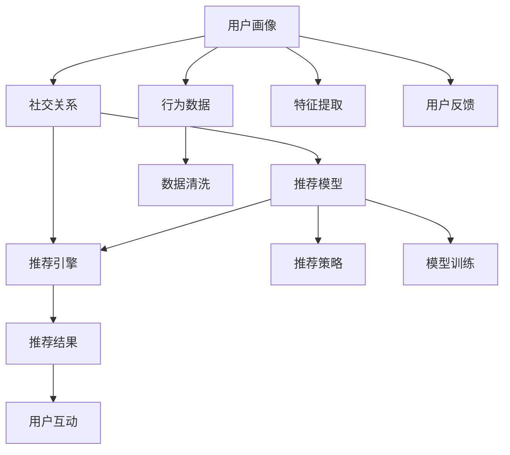

                 

# 社交网络推荐：连接用户的纽带

## 1. 背景介绍

### 1.1 问题由来
社交网络推荐（Social Network Recommendation）在当今数字化时代扮演着至关重要的角色。从朋友推荐到群组构建，从内容推送到广告定位，推荐系统无处不在。但无论哪种推荐，其核心目的都是帮助用户发现更有价值的社交关系和内容，以连接人与人，人与服务，最终提升用户体验。本文旨在深入探讨社交网络推荐的核心原理、算法实现及应用场景，以及如何通过推荐技术构建和维护用户间的关系网络，从而赋能社交平台的快速发展。

### 1.2 问题核心关键点
社交网络推荐的挑战在于如何高效地捕捉用户之间的相似性和相关性，并构建一个动态、可交互的推荐系统。该系统不仅需要理解用户的行为和偏好，还要能够通过推荐建立强连接，促进社交互动和用户粘性。

具体而言，社交网络推荐需要解决以下关键问题：
1. 如何衡量用户之间的相似性？
2. 如何构建和维护用户关系网络？
3. 如何通过推荐提升用户互动和粘性？
4. 如何优化推荐算法以适应实时交互和动态变化的数据？

这些问题既复杂又具有挑战性，但正是这些挑战推动了推荐算法和社交网络推荐系统的不断进步。

### 1.3 问题研究意义
社交网络推荐对于社交平台的健康发展至关重要，其能够有效提升用户体验，促进内容消费，增强用户粘性。通过深入研究推荐算法，我们不仅可以提升现有系统的性能，还可以探索新的应用场景和业务模式。

具体意义包括：
- **提升用户体验**：通过精准推荐，满足用户的个性化需求，提高满意度。
- **增加用户粘性**：通过社交关系推荐，构建用户社群，增加用户活跃度。
- **优化运营效率**：通过内容推送优化，减少用户流失率，提升平台收益。
- **探索新业务模式**：基于推荐算法，探索社交电商、社交广告等新的商业机遇。

## 2. 核心概念与联系

### 2.1 核心概念概述
社交网络推荐系统主要由以下几个核心组件构成：
1. **用户画像（User Profile）**：描述用户的基本信息和行为特征，如兴趣、好友列表、消费习惯等。
2. **社交关系（Social Relationship）**：描述用户间的互动和联系，如好友关系、关注关系、点赞关系等。
3. **推荐模型（Recommendation Model）**：基于用户画像和社交关系构建的推荐算法，用于预测用户可能感兴趣的社交内容和关系。
4. **推荐引擎（Recommendation Engine）**：实现推荐算法的具体执行环境，负责实时响应推荐请求。

这些组件通过协同工作，不断学习和优化，构建起一个动态、智能的社交网络推荐系统。

### 2.2 核心概念原理和架构的 Mermaid 流程图



### 2.3 核心概念联系

- **用户画像与社交关系**：用户画像提供了用户的静态特征，而社交关系则反映了用户的动态互动。两者共同构成推荐模型的输入，帮助模型更好地理解用户需求和社交网络结构。
- **推荐模型与推荐引擎**：推荐模型负责构建推荐算法，而推荐引擎则将算法应用于实际数据，生成推荐结果。
- **推荐结果与用户互动**：推荐结果通过推荐引擎推送给用户，用户基于推荐内容与平台互动，形成新的行为数据，反馈回推荐系统，进一步优化推荐效果。

这些组件通过数据流和信息流相连，构成了一个闭环的反馈系统，确保推荐系统能够持续优化并适应用户需求。

## 3. 核心算法原理 & 具体操作步骤

### 3.1 算法原理概述
社交网络推荐的算法原理主要基于以下几个步骤：
1. **用户画像构建**：通过用户的社交行为、内容消费、搜索历史等数据，构建用户的兴趣画像和行为特征。
2. **社交关系分析**：分析用户间的关系网络，包括好友关系、关注关系、点赞关系等，构建社交图谱。
3. **推荐模型训练**：基于用户画像和社交关系，训练推荐模型，预测用户可能感兴趣的内容或关系。
4. **推荐结果生成**：通过推荐模型，生成推荐结果，实时推送给用户。
5. **用户互动分析**：收集用户对推荐结果的反馈，如点击、点赞、分享等行为，用于优化推荐模型。

这些步骤通过机器学习算法和数据处理技术实现，构建起一个高效、智能的推荐系统。

### 3.2 算法步骤详解

#### 3.2.1 用户画像构建

用户画像构建的核心是特征提取和建模。常见的特征包括：
- **人口统计特征**：如年龄、性别、地区等。
- **行为特征**：如浏览历史、搜索记录、点击行为等。
- **社交特征**：如好友列表、关注用户、点赞内容等。

这些特征通过各种算法进行融合和处理，构建出用户画像。常见的算法包括：
- **协同过滤（Collaborative Filtering）**：基于用户间的相似性，推荐相似用户喜欢的内容。
- **内容推荐（Content-Based Recommendation）**：基于内容的相似性，推荐与用户兴趣相关的内容。
- **混合推荐（Hybrid Recommendation）**：结合多种算法，综合考虑用户画像和社交关系。

#### 3.2.2 社交关系分析

社交关系分析的核心是构建社交图谱。社交图谱是一个由节点和边构成的图，节点为用户，边为社交关系。常见的社交关系包括：
- **好友关系**：用户间的直接联系，如通过添加好友或互相关注建立。
- **关注关系**：用户间基于关注与被关注建立的联系。
- **点赞关系**：用户间基于内容点赞建立的联系。

社交图谱通过图算法进行分析和处理，常见的算法包括：
- **中心性分析**：计算节点在社交图中的中心性，如度中心性、接近中心性、中介中心性等。
- **社区发现**：将社交图谱划分为若干社区，发现用户间的聚合关系。
- **网络嵌入**：将社交关系转换为低维向量表示，用于推荐和分析。

#### 3.2.3 推荐模型训练

推荐模型训练的核心是构建和优化推荐算法。常见的推荐算法包括：
- **矩阵分解**：通过矩阵分解技术，将用户-物品评分矩阵分解为两个低维矩阵，用于预测用户对物品的评分。
- **深度学习**：使用深度神经网络，通过多层次的特征提取和融合，构建复杂的推荐模型。
- **协同训练**：通过联合训练用户画像和社交关系，优化推荐效果。

推荐模型通过监督学习和无监督学习相结合的方式进行训练，常见的算法包括：
- **梯度下降（Gradient Descent）**：通过梯度下降算法，最小化推荐误差。
- **正则化（Regularization）**：通过L1、L2正则化，避免过拟合。
- **优化算法**：如Adam、Adagrad、RMSprop等，用于加速模型训练。

#### 3.2.4 推荐结果生成

推荐结果生成的核心是将训练好的模型应用于实际数据，生成推荐结果。常见的推荐算法包括：
- **召回算法**：基于用户画像和社交关系，选择可能感兴趣的内容或关系。
- **排序算法**：基于推荐结果的评分或相关性，排序并选择推荐给用户。
- **动态调整**：根据用户实时行为和环境变化，动态调整推荐策略。

推荐结果通过推荐引擎实时推送给用户，常见的引擎包括：
- **Redis**：高效缓存推荐结果，提供实时推荐服务。
- **Flink**：实时处理推荐数据流，动态调整推荐策略。
- **Nginx**：分发推荐结果，优化用户体验。

#### 3.2.5 用户互动分析

用户互动分析的核心是收集和分析用户对推荐结果的反馈，用于优化推荐模型。常见的反馈数据包括：
- **点击行为**：用户对推荐内容的点击情况。
- **点赞行为**：用户对推荐内容的点赞情况。
- **分享行为**：用户对推荐内容的分享情况。

这些反馈数据通过A/B测试、多臂老虎机等算法进行分析和优化，常见的算法包括：
- **点击率优化**：通过点击率优化算法，提升推荐内容的用户参与度。
- **曝光率优化**：通过曝光率优化算法，提高推荐内容的可见性。
- **转换率优化**：通过转换率优化算法，提升推荐内容的转化效果。

### 3.3 算法优缺点

#### 3.3.1 优点

1. **精准性高**：通过综合考虑用户画像和社交关系，推荐系统能够更精准地预测用户需求和行为。
2. **实时性强**：推荐系统能够实时处理数据流，动态调整推荐策略，满足用户即时需求。
3. **可扩展性好**：推荐算法和系统架构可扩展性强，支持大规模数据和高并发请求。

#### 3.3.2 缺点

1. **冷启动问题**：新用户或新内容没有足够的历史数据，导致推荐效果不佳。
2. **数据偏差**：用户画像和社交关系可能存在偏差，导致推荐结果有失偏颇。
3. **过拟合问题**：模型可能过度拟合历史数据，导致泛化能力不足。

### 3.4 算法应用领域

社交网络推荐已经在多个领域得到广泛应用，包括：
1. **社交平台**：如Facebook、Twitter、LinkedIn等，通过推荐好友、群组、内容等，提升用户体验和活跃度。
2. **内容平台**：如Netflix、YouTube、Spotify等，通过推荐影视、音乐、文章等，提高用户参与度和满意度。
3. **电子商务**：如Amazon、淘宝、京东等，通过推荐商品、活动等，提升销售转化率和客户粘性。
4. **媒体广告**：如Google、Facebook等，通过推荐广告，实现精准营销和广告投放。
5. **移动应用**：如滴滴出行、美团等，通过推荐目的地、服务等，提升服务质量和用户粘性。

## 4. 数学模型和公式 & 详细讲解 & 举例说明

### 4.1 数学模型构建

社交网络推荐系统的数学模型主要基于图神经网络（Graph Neural Network, GNN）构建。图神经网络是一种专门用于处理图结构数据的深度学习模型，能够自动学习图结构中的特征和关系，用于推荐系统中的社交关系分析和推荐结果生成。

### 4.2 公式推导过程

以图卷积网络（Graph Convolutional Network, GCN）为例，推导推荐模型的公式。

设社交图谱为 $G=(V,E)$，其中 $V$ 为用户集合，$E$ 为社交关系集合。用户 $i$ 的特征表示为 $h_i$，社交图谱的邻居节点集合为 $N(i)$。则用户 $i$ 的邻居特征加权和表示为：

$$
\tilde{h}_i = \sum_{j \in N(i)} w_{ij} h_j
$$

其中 $w_{ij}$ 为节点间的权重，可以表示为：

$$
w_{ij} = \frac{1}{\sqrt{\deg(i) \deg(j)}}
$$

用户 $i$ 的特征更新表示为：

$$
h_i^{(k+1)} = \sigma(D^{-1/2} A^{1/2} W h_i^{(k)} + b)
$$

其中 $D$ 为图的度矩阵，$A$ 为图的邻接矩阵，$W$ 为权重矩阵，$b$ 为偏置项，$\sigma$ 为激活函数。

### 4.3 案例分析与讲解

以一个简单的社交网络推荐系统为例，分析其推荐过程。

设有一个社交网络，包含用户 $U$ 和内容 $C$，用户 $i$ 对内容 $j$ 进行评分 $r_{ij}$。社交网络中用户 $i$ 与用户 $j$ 之间存在好友关系，表示为 $A_{ij}=1$。

设用户 $i$ 的特征表示为 $h_i$，内容 $j$ 的特征表示为 $h_j$。通过矩阵分解算法，将用户-内容评分矩阵分解为两个低维矩阵 $U$ 和 $V$，分别表示用户特征和内容特征。推荐系统通过计算用户 $i$ 对内容 $j$ 的评分预测 $\hat{r}_{ij}$，表示为：

$$
\hat{r}_{ij} = \hat{u}_i^T V_j
$$

其中 $\hat{u}_i = U_i$ 表示用户 $i$ 的特征向量，$V_j$ 表示内容 $j$ 的特征向量。

推荐系统根据评分预测值 $\hat{r}_{ij}$ 生成推荐列表，选择评分较高的内容推荐给用户 $i$。

## 5. 项目实践：代码实例和详细解释说明

### 5.1 开发环境搭建

社交网络推荐系统的开发需要具备以下环境：
1. **编程语言**：Python
2. **深度学习框架**：TensorFlow、PyTorch、Keras
3. **图处理库**：NetworkX、PyTorch Geometric
4. **数据存储**：Hadoop、Spark、MySQL、Redis
5. **缓存服务器**：Memcached、Redis
6. **分布式计算**：Spark、Flink
7. **推荐引擎**：Nginx、FastAPI

### 5.2 源代码详细实现

以基于图卷积网络的社交网络推荐系统为例，实现推荐模型的代码如下：

```python
import torch
import torch.nn as nn
import torch.nn.functional as F
import torch_geometric.nn as gnn
import networkx as nx

class GCN(nn.Module):
    def __init__(self, in_features, hidden_features, out_features):
        super(GCN, self).__init__()
        self.conv1 = gnn.GraphConv(in_features, hidden_features)
        self.conv2 = gnn.GraphConv(hidden_features, out_features)
        
    def forward(self, x, adj):
        x = self.conv1(x, adj)
        x = F.relu(x)
        x = self.conv2(x, adj)
        return x

class GraphRecommendation(nn.Module):
    def __init__(self, in_features, hidden_features, out_features, num_classes):
        super(GraphRecommendation, self).__init__()
        self.gcn = GCN(in_features, hidden_features, hidden_features)
        self.fc = nn.Linear(hidden_features, num_classes)
        
    def forward(self, x, adj):
        x = self.gcn(x, adj)
        x = self.fc(x)
        return x

# 数据加载与处理
data = load_data('social_network_data')
x, y, edge_index, edge_weight = preprocess_data(data)
model = GraphRecommendation(in_features, hidden_features, num_classes, num_users)
optimizer = torch.optim.Adam(model.parameters(), lr=0.01)

# 训练模型
for epoch in range(num_epochs):
    optimizer.zero_grad()
    output = model(x, edge_index, edge_weight)
    loss = F.cross_entropy(output, y)
    loss.backward()
    optimizer.step()
```

### 5.3 代码解读与分析

代码实现了基于图卷积网络的社交网络推荐模型，具体分析如下：
- `GCN`类：实现图卷积网络，包含两个卷积层。
- `GraphRecommendation`类：实现社交网络推荐模型，包含GCN和全连接层。
- 数据加载与处理：从数据集中加载用户特征、社交关系等，并进行预处理。
- 模型训练：使用Adam优化器训练模型，损失函数为交叉熵。

## 6. 实际应用场景

### 6.1 智能推荐

社交网络推荐的核心应用场景之一是智能推荐。通过分析用户的历史行为和社交关系，推荐系统可以为用户推荐其可能感兴趣的内容和关系，如好友、群组、文章、视频等，提升用户体验和满意度。

### 6.2 群组构建

社交网络推荐还用于群组构建，通过分析用户间的互动和相似性，推荐用户加入可能感兴趣的群组，促进用户间的交流和互动，提升平台活跃度。

### 6.3 广告投放

社交网络推荐还可以用于广告投放，通过分析用户的行为和兴趣，推荐相关广告，实现精准营销和广告投放，提高广告转化率。

## 7. 工具和资源推荐

### 7.1 学习资源推荐

- **推荐系统入门**：《推荐系统实践》书籍，全面介绍推荐系统的理论和技术。
- **深度学习**：《深度学习》书籍，深入讲解深度学习框架和算法。
- **图神经网络**：《图神经网络基础》博客，介绍图神经网络的原理和应用。
- **Python编程**：《Python核心编程》书籍，提升Python编程能力。

### 7.2 开发工具推荐

- **深度学习框架**：TensorFlow、PyTorch、Keras
- **图处理库**：NetworkX、PyTorch Geometric
- **数据存储**：Hadoop、Spark、MySQL、Redis
- **缓存服务器**：Memcached、Redis
- **分布式计算**：Spark、Flink
- **推荐引擎**：Nginx、FastAPI

### 7.3 相关论文推荐

- **图卷积网络**：《Graph Convolutional Network》论文
- **协同过滤**：《Collaborative Filtering for Implicit Feedback Datasets》论文
- **内容推荐**：《A Survey of Content-Based Recommendation Algorithms》论文
- **深度推荐**：《Deep Learning for Recommender Systems》论文

## 8. 总结：未来发展趋势与挑战

### 8.1 总结

社交网络推荐系统已经成为社交平台的核心功能之一，通过高效捕捉用户之间的相似性和相关性，构建动态、可交互的推荐系统，提升了用户体验和平台活跃度。本文对社交网络推荐的核心原理、算法实现及应用场景进行了全面系统的介绍。

### 8.2 未来发展趋势

未来社交网络推荐系统将呈现以下几个发展趋势：
1. **个性化推荐**：通过深度学习和大数据分析，实现更加精准、个性化的推荐，满足用户的多样化需求。
2. **实时推荐**：通过流处理和分布式计算，实现实时推荐，提升用户体验和平台互动。
3. **跨平台推荐**：通过联邦学习和分布式协同过滤，实现跨平台推荐，提升推荐效果和数据利用率。
4. **隐私保护**：通过差分隐私和联邦学习，保护用户隐私，增强推荐系统的可信度和安全性。

### 8.3 面临的挑战

尽管社交网络推荐系统已经取得了一定的进展，但仍面临以下挑战：
1. **数据隐私**：用户数据的隐私保护始终是一个重要问题，需要在使用数据的同时保护用户隐私。
2. **冷启动问题**：新用户或新内容没有足够的历史数据，导致推荐效果不佳。
3. **过拟合问题**：模型可能过度拟合历史数据，导致泛化能力不足。
4. **计算资源**：社交网络推荐系统需要处理大规模数据和高并发请求，计算资源需求较高。

### 8.4 研究展望

未来社交网络推荐系统的研究重点在于：
1. **多模态推荐**：结合文本、图像、视频等多模态数据，提升推荐效果和用户满意度。
2. **异构图推荐**：处理多种类型的社交图谱，如用户-物品、用户-用户、物品-物品等，实现更加全面的推荐。
3. **交互式推荐**：通过用户反馈和互动，动态调整推荐策略，提升推荐效果和用户粘性。
4. **隐私保护**：保护用户隐私，增强推荐系统的可信度和安全性。

通过不断优化和创新，社交网络推荐系统将更好地服务用户，赋能社交平台的快速发展，带来更美好的数字生活。

## 9. 附录：常见问题与解答

**Q1：什么是社交网络推荐系统？**

A: 社交网络推荐系统是一种通过分析用户画像和社交关系，预测用户可能感兴趣的内容和关系，提升用户体验和平台活力的推荐系统。

**Q2：社交网络推荐系统的主要算法有哪些？**

A: 社交网络推荐系统的主要算法包括协同过滤、内容推荐、混合推荐、图神经网络等。

**Q3：推荐系统如何处理冷启动问题？**

A: 推荐系统通过多臂老虎机、混合推荐、集成学习等方法处理冷启动问题，即在新用户或新内容出现时，能够通过已有数据进行推荐。

**Q4：推荐系统的计算资源需求高吗？**

A: 推荐系统处理大规模数据和高并发请求，计算资源需求较高，通常需要分布式计算和缓存服务器等基础设施支持。

**Q5：推荐系统的数据隐私如何保护？**

A: 推荐系统通过差分隐私、联邦学习等方法保护用户数据隐私，避免数据泄露和滥用。

以上内容仅为社交网络推荐系统的基础介绍，未来随着技术的不断进步，社交网络推荐系统将迎来更多的创新和发展，为用户带来更丰富、便捷的数字生活体验。

---

作者：禅与计算机程序设计艺术 / Zen and the Art of Computer Programming

