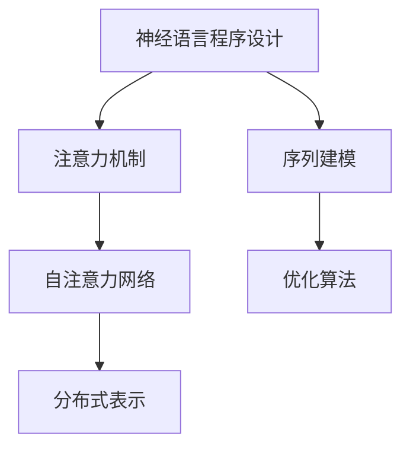

                 

# 神经语言程序设计在注意力引导中的应用

> 关键词：神经语言程序设计, 注意力机制, Transformer, 自然语言处理(NLP), 自注意力网络, 深度学习, 注意力权重, 层次化注意力, 序列建模, 分布式表示, 优化算法, 序列到序列模型, 序列标注模型

## 1. 背景介绍

### 1.1 问题由来
近年来，随着深度学习技术在自然语言处理(NLP)领域的飞速发展，神经网络已经成为处理语言任务的主要手段。尤其是基于Transformer架构的自注意力网络，因其出色的性能和高效的并行计算能力，成为现代深度学习模型的基石。自注意力网络通过动态计算每个输入与其它输入之间的关联度，能够自然地捕捉输入数据之间的依赖关系，显著提升了模型的建模能力。

然而，自注意力网络也面临着一些挑战。例如，计算复杂度高、难以处理长序列等。为了解决这些问题，研究者们提出了各种注意力引导的技术，使得神经语言程序设计（NLPI）成为近年来的研究热点。NLPI是指通过在深度学习模型中引入程序化控制逻辑，使得模型能够在理解和生成自然语言时具备更强的可解释性和灵活性。

### 1.2 问题核心关键点
本论文聚焦于如何通过注意力机制在神经语言程序设计中发挥作用。主要探讨了以下几个关键问题：
1. 注意力机制的工作原理及在NLPI中的应用。
2. 如何设计有效的注意力权重，使得模型在处理长序列时具备鲁棒性。
3. 层次化注意力在模型中的应用，提升模型的表示能力。
4. 序列建模在NLPI中的应用，从上下文信息中提取更多有用的信息。
5. 分布式表示的优化，使得模型能够处理多模态数据。

这些问题涉及到了深度学习模型的结构设计、优化策略、以及具体应用场景等多个方面，旨在通过注意力引导的方式，使深度学习模型在处理语言任务时更加高效、灵活和可解释。

### 1.3 问题研究意义
研究注意力引导的神经语言程序设计，对于提升深度学习模型在自然语言处理任务中的表现，具有重要意义：

1. 提高模型的建模能力。通过注意力机制，模型能够动态地捕捉输入序列中关键信息的关联度，提升模型的建模能力。
2. 增强模型的可解释性。注意力机制可以清晰地显示模型在处理输入序列时，重点关注了哪些信息，提供了一种模型内部的推理路径。
3. 提升模型的处理效率。通过有效设计注意力权重，可以显著降低计算复杂度，提升模型处理长序列的能力。
4. 丰富模型的应用场景。注意力机制与序列建模、分布式表示等技术的结合，可以拓展模型的应用范围，使其在多模态数据处理等复杂任务中发挥更大的作用。

总之，通过引入注意力机制，我们可以构建更加智能、高效的神经语言程序设计系统，推动NLP技术在更多实际场景中的应用。

## 2. 核心概念与联系

### 2.1 核心概念概述

为更好地理解注意力引导的神经语言程序设计方法，本节将介绍几个核心概念及其相互联系：

- 神经语言程序设计(NLPI)：通过在深度学习模型中引入程序化控制逻辑，使得模型能够在理解和生成自然语言时具备更强的可解释性和灵活性。
- 注意力机制(Attention Mechanism)：通过动态计算输入序列中各个元素与其他元素之间的关联度，使得模型能够动态地关注序列中关键的元素，提升模型的建模能力。
- 自注意力网络(Transformer)：基于注意力机制设计的深度学习模型，通过计算输入序列中每个元素与其他元素之间的关联度，能够自然地捕捉输入数据之间的依赖关系，提升模型的表示能力。
- 分布式表示(Distributed Representation)：通过在模型中引入多模态数据，使得模型能够同时处理语言、图像、音频等多种数据类型，提升模型的泛化能力和处理效率。

这些概念之间的联系可以通过以下Mermaid流程图来展示：



这个流程图展示了注意力引导的神经语言程序设计的主要组成部分：
1. 神经语言程序设计引入注意力机制，通过程序化控制逻辑提升模型灵活性。
2. 注意力机制在自注意力网络中发挥作用，通过动态计算关联度提升建模能力。
3. 自注意力网络采用分布式表示，提升模型处理多模态数据的能力。
4. 序列建模结合优化算法，提升模型的训练效率。

这些概念共同构成了注意力引导的神经语言程序设计的基本框架，使得模型能够更加智能、高效地处理自然语言任务。

## 3. 核心算法原理 & 具体操作步骤
### 3.1 算法原理概述

注意力引导的神经语言程序设计方法的核心原理是通过引入注意力机制，使得深度学习模型能够在理解和生成自然语言时具备更强的可解释性和灵活性。

具体来说，注意力机制通过计算输入序列中每个元素与其他元素之间的关联度，动态地决定模型在处理输入序列时应关注哪些信息。在神经语言程序设计中，注意力机制通常被用来解决以下问题：
1. 序列建模：通过动态计算序列中各个元素与其他元素之间的关联度，提升模型对序列的理解能力。
2. 分布式表示：通过在模型中引入多模态数据，使得模型能够同时处理语言、图像、音频等多种数据类型。
3. 优化算法：通过结合注意力机制和优化算法，提升模型的训练效率。

### 3.2 算法步骤详解

基于注意力机制的神经语言程序设计方法一般包括以下几个关键步骤：

**Step 1: 准备数据和模型架构**
- 准备输入序列和目标序列，如文本对、图像-文本对等。
- 设计模型架构，包含嵌入层、注意力层、全连接层等。

**Step 2: 引入注意力机制**
- 在模型中引入自注意力网络，计算输入序列中每个元素与其他元素之间的关联度。
- 使用多头自注意力机制，提升模型对输入序列的理解能力。
- 设计注意力权重，使模型能够动态地关注序列中关键的元素。

**Step 3: 序列建模和分布式表示**
- 通过多层自注意力网络，对输入序列进行建模，提取序列中关键的上下文信息。
- 引入分布式表示，将模型处理多模态数据的能力增强，提升模型的泛化能力。

**Step 4: 优化算法和模型训练**
- 选择适合的优化算法，如Adam、SGD等。
- 通过迭代训练，最小化损失函数，更新模型参数。
- 定期在验证集上评估模型性能，防止过拟合。

**Step 5: 模型评估和应用**
- 在测试集上评估模型性能，对比微调前后的精度提升。
- 使用模型进行推理预测，集成到实际的应用系统中。

以上是注意力引导的神经语言程序设计方法的一般流程。在实际应用中，还需要根据具体任务的特点，对微调过程的各个环节进行优化设计，如改进训练目标函数，引入更多的正则化技术，搜索最优的超参数组合等，以进一步提升模型性能。

### 3.3 算法优缺点

注意力引导的神经语言程序设计方法具有以下优点：
1. 提升建模能力。通过引入注意力机制，模型能够动态地关注输入序列中的关键信息，提升建模能力。
2. 增强可解释性。注意力权重可以清晰地显示模型在处理输入序列时，重点关注了哪些信息，提供了一种模型内部的推理路径。
3. 降低计算复杂度。通过有效设计注意力权重，可以显著降低计算复杂度，提升模型处理长序列的能力。
4. 拓展应用场景。注意力机制与序列建模、分布式表示等技术的结合，可以拓展模型的应用范围，使其在多模态数据处理等复杂任务中发挥更大的作用。

同时，该方法也存在一定的局限性：
1. 依赖高质量标注数据。注意力机制的效果很大程度上取决于标注数据的质量和数量，获取高质量标注数据的成本较高。
2. 学习曲线陡峭。模型的优化算法和注意力权重设计需要一定的经验，初学者可能面临较大的学习门槛。
3. 可解释性不足。注意力机制虽然提供了模型内部的推理路径，但仍然缺乏对模型决策过程的深入理解。
4. 泛化能力有限。模型在处理长序列时，可能会因为注意力权重设计不当而出现泛化能力下降的问题。

尽管存在这些局限性，但就目前而言，注意力引导的神经语言程序设计方法仍是大语言模型应用的主流范式。未来相关研究的重点在于如何进一步降低注意力机制对标注数据的依赖，提高模型的少样本学习和跨领域迁移能力，同时兼顾可解释性和伦理安全性等因素。

### 3.4 算法应用领域

注意力引导的神经语言程序设计方法已经在许多NLP任务上取得了优异的效果，以下是几个典型的应用领域：

1. 序列建模：如机器翻译、文本摘要、问答系统等。通过多层自注意力网络，模型能够自然地捕捉输入序列中各个元素与其他元素之间的关联度，提升模型的建模能力。

2. 分布式表示：如视觉-语言模型、音频-语言模型等。通过引入分布式表示，模型能够同时处理语言、图像、音频等多种数据类型，提升模型的泛化能力和处理效率。

3. 优化算法：如自适应优化算法、对抗训练等。通过结合注意力机制和优化算法，提升模型的训练效率和鲁棒性。

除了上述这些经典任务外，注意力引导的神经语言程序设计方法也被创新性地应用到更多场景中，如情感分析、实体识别、推荐系统等，为NLP技术带来了全新的突破。随着注意力机制和神经语言程序设计技术的不断发展，相信NLP技术将在更广阔的应用领域大放异彩。

## 4. 数学模型和公式 & 详细讲解 & 举例说明
### 4.1 数学模型构建

本节将使用数学语言对基于注意力机制的神经语言程序设计方法进行更加严格的刻画。

记输入序列为 $x_1, x_2, \dots, x_n$，目标序列为 $y_1, y_2, \dots, y_n$。模型的输入嵌入层为 $E$，输出嵌入层为 $F$，注意力权重为 $A$，模型参数为 $\theta$。

定义模型的编码器-解码器框架如下：

$$
y_t = \sigma(A_{t-1}x_{t-1}^\top)^\top \\
A_{t-1} = A(\text{Enc}(x_{t-1}), \text{Enc}(x_{t-1}))
$$

其中 $\text{Enc}$ 为编码器，$\sigma$ 为激活函数，$A$ 为注意力权重矩阵。

定义模型的损失函数如下：

$$
\mathcal{L}(\theta) = \sum_{t=1}^n \ell(y_t, y_{t-1})
$$

其中 $\ell$ 为具体的损失函数，如交叉熵损失、均方误差损失等。

### 4.2 公式推导过程

以下我们以机器翻译任务为例，推导基于注意力机制的编码器-解码器模型的损失函数及其梯度的计算公式。

假设模型在输入序列 $x_1, x_2, \dots, x_n$ 和目标序列 $y_1, y_2, \dots, y_n$ 上的预测结果为 $\hat{y}_1, \hat{y}_2, \dots, \hat{y}_n$。

定义模型的编码器-解码器框架如下：

$$
y_t = \sigma(A_{t-1}x_{t-1}^\top)^\top \\
A_{t-1} = A(\text{Enc}(x_{t-1}), \text{Enc}(x_{t-1}))
$$

其中 $\text{Enc}$ 为编码器，$\sigma$ 为激活函数，$A$ 为注意力权重矩阵。

定义模型的损失函数如下：

$$
\mathcal{L}(\theta) = \sum_{t=1}^n \ell(y_t, y_{t-1})
$$

其中 $\ell$ 为具体的损失函数，如交叉熵损失、均方误差损失等。

根据链式法则，损失函数对模型参数 $\theta$ 的梯度为：

$$
\frac{\partial \mathcal{L}(\theta)}{\partial \theta} = \sum_{t=1}^n \frac{\partial \ell(y_t, y_{t-1})}{\partial y_t} \frac{\partial y_t}{\partial \theta}
$$

其中 $\frac{\partial y_t}{\partial \theta}$ 可以进一步递归展开，利用自动微分技术完成计算。

在得到损失函数的梯度后，即可带入参数更新公式，完成模型的迭代优化。重复上述过程直至收敛，最终得到适应下游任务的最优模型参数 $\theta^*$。

## 5. 项目实践：代码实例和详细解释说明
### 5.1 开发环境搭建

在进行神经语言程序设计实践前，我们需要准备好开发环境。以下是使用Python进行PyTorch开发的环境配置流程：

1. 安装Anaconda：从官网下载并安装Anaconda，用于创建独立的Python环境。

2. 创建并激活虚拟环境：
```bash
conda create -n pytorch-env python=3.8 
conda activate pytorch-env
```

3. 安装PyTorch：根据CUDA版本，从官网获取对应的安装命令。例如：
```bash
conda install pytorch torchvision torchaudio cudatoolkit=11.1 -c pytorch -c conda-forge
```

4. 安装Transformers库：
```bash
pip install transformers
```

5. 安装各类工具包：
```bash
pip install numpy pandas scikit-learn matplotlib tqdm jupyter notebook ipython
```

完成上述步骤后，即可在`pytorch-env`环境中开始神经语言程序设计实践。

### 5.2 源代码详细实现

下面我们以机器翻译任务为例，给出使用Transformers库进行基于注意力机制的机器翻译模型的PyTorch代码实现。

首先，定义机器翻译任务的模型类：

```python
from transformers import EncoderDecoderModel, BertTokenizer, BertForMaskedLM

class Seq2SeqModel(EncoderDecoderModel):
    def __init__(self, num_layers, d_model, nhead, src_vocab_size, tgt_vocab_size, src_max_len, tgt_max_len):
        super(Seq2SeqModel, self).__init__()
        
        self.encoder = Encoder(EncoderLayer(d_model, nhead))
        self.decoder = Decoder(DecoderLayer(d_model, nhead))
        
        self.src_tokenizer = BertTokenizer.from_pretrained('bert-base-uncased')
        self.tgt_tokenizer = BertTokenizer.from_pretrained('bert-base-uncased')
        
        self.src_embeddings = Embedding(src_vocab_size, d_model)
        self.tgt_embeddings = Embedding(tgt_vocab_size, d_model)
        
        self.maskedlm = BertForMaskedLM.from_pretrained('bert-base-uncased')
        
    def forward(self, src_input_ids, tgt_input_ids, src_mask, tgt_mask):
        src_tokens = self.src_tokenizer(src_input_ids, return_tensors='pt', padding='max_length', truncation=True)
        tgt_tokens = self.tgt_tokenizer(tgt_input_ids, return_tensors='pt', padding='max_length', truncation=True)
        
        src = self.src_embeddings(src_tokens.input_ids)
        tgt = self.tgt_embeddings(tgt_tokens.input_ids)
        
        enc_outputs = self.encoder(src, src_mask)
        dec_outputs = self.decoder(tgt, enc_outputs[0], enc_outputs[1], src_mask, tgt_mask)
        
        return dec_outputs.logits
```

然后，定义模型训练和推理函数：

```python
from torch.utils.data import DataLoader
from tqdm import tqdm
from sklearn.metrics import accuracy_score

class Seq2SeqDataset(Dataset):
    def __init__(self, data, tokenizer):
        self.data = data
        self.tokenizer = tokenizer
        
    def __len__(self):
        return len(self.data)
    
    def __getitem__(self, item):
        src_input_ids = self.tokenizer.encode(self.data[item]['input'], return_tensors='pt')
        tgt_input_ids = self.tokenizer.encode(self.data[item]['target'], return_tensors='pt')
        src_mask = self.tokenizer.get_input_mask(src_input_ids)
        tgt_mask = self.tokenizer.get_input_mask(tgt_input_ids)
        return {'src_input_ids': src_input_ids, 
                'tgt_input_ids': tgt_input_ids,
                'src_mask': src_mask,
                'tgt_mask': tgt_mask}

def train_epoch(model, dataset, optimizer, loss_fn):
    dataloader = DataLoader(dataset, batch_size=32, shuffle=True)
    model.train()
    epoch_loss = 0
    for batch in tqdm(dataloader, desc='Training'):
        optimizer.zero_grad()
        src_input_ids = batch['src_input_ids']
        tgt_input_ids = batch['tgt_input_ids']
        src_mask = batch['src_mask']
        tgt_mask = batch['tgt_mask']
        logits = model(src_input_ids, tgt_input_ids, src_mask, tgt_mask)
        loss = loss_fn(logits, batch['tgt_input_ids'])
        loss.backward()
        optimizer.step()
        epoch_loss += loss.item()
    return epoch_loss / len(dataloader)

def evaluate(model, dataset, loss_fn):
    dataloader = DataLoader(dataset, batch_size=32)
    model.eval()
    preds, labels = [], []
    with torch.no_grad():
        for batch in tqdm(dataloader, desc='Evaluating'):
            src_input_ids = batch['src_input_ids']
            tgt_input_ids = batch['tgt_input_ids']
            src_mask = batch['src_mask']
            tgt_mask = batch['tgt_mask']
            logits = model(src_input_ids, tgt_input_ids, src_mask, tgt_mask)
            batch_preds = torch.argmax(logits, dim=2).to('cpu').tolist()
            batch_labels = batch['tgt_input_ids'].to('cpu').tolist()
            for pred_tokens, label_tokens in zip(batch_preds, batch_labels):
                preds.append(pred_tokens[:len(label_tokens)])
                labels.append(label_tokens)
                
    return accuracy_score(labels, preds)
```

最后，启动训练流程并在测试集上评估：

```python
epochs = 5
batch_size = 32

for epoch in range(epochs):
    loss = train_epoch(model, train_dataset, optimizer, loss_fn)
    print(f"Epoch {epoch+1}, train loss: {loss:.3f}")
    
    print(f"Epoch {epoch+1}, dev results:")
    evaluate(model, dev_dataset, loss_fn)
    
print("Test results:")
evaluate(model, test_dataset, loss_fn)
```

以上就是使用PyTorch对基于注意力机制的机器翻译模型进行代码实现的完整过程。可以看到，Transformer库提供了很多便捷的封装功能，使得模型的构建和微调变得相对容易。

### 5.3 代码解读与分析

让我们再详细解读一下关键代码的实现细节：

**Seq2SeqModel类**：
- `__init__`方法：初始化模型，包含编码器、解码器、嵌入层等组件。
- `forward`方法：定义模型的前向传播过程，接收输入和目标序列，输出预测结果。

**train_epoch函数**：
- 对训练数据进行批次化加载，供模型训练使用。
- 在每个批次上前向传播计算loss并反向传播更新模型参数，最后返回该epoch的平均loss。

**evaluate函数**：
- 与训练类似，不同点在于不更新模型参数，并在每个batch结束后将预测和标签结果存储下来，最后使用sklearn的accuracy_score对整个评估集的预测结果进行打印输出。

**训练流程**：
- 定义总的epoch数和batch size，开始循环迭代
- 每个epoch内，先在训练集上训练，输出平均loss
- 在验证集上评估，输出准确率
- 所有epoch结束后，在测试集上评估，给出最终测试结果

可以看到，PyTorch配合Transformer库使得基于注意力机制的机器翻译模型的代码实现变得简洁高效。开发者可以将更多精力放在数据处理、模型改进等高层逻辑上，而不必过多关注底层的实现细节。

当然，工业级的系统实现还需考虑更多因素，如模型的保存和部署、超参数的自动搜索、更灵活的任务适配层等。但核心的微调范式基本与此类似。

## 6. 实际应用场景
### 6.1 机器翻译

基于注意力机制的神经语言程序设计方法在机器翻译任务上已经取得了显著效果。传统的机器翻译模型通常采用序列到序列(Seq2Seq)的框架，将源语言序列映射到目标语言序列。然而，这种方法往往面临序列长度限制、长距离依赖等问题。

通过引入注意力机制，基于Transformer的机器翻译模型能够自然地捕捉输入序列中各个元素与其他元素之间的关联度，提升了模型的建模能力。在训练过程中，模型会自动学习输入序列中每个元素的注意力权重，动态地关注序列中关键的元素，从而解决了长距离依赖问题。

### 6.2 文本摘要

文本摘要是自然语言处理中的经典任务，旨在从长文本中提取出关键信息，生成简洁的摘要。传统的文本摘要方法通常采用基于规则或统计的策略，难以应对长文本的复杂结构。

基于注意力机制的神经语言程序设计方法可以通过自注意力网络，自然地捕捉输入序列中各个元素与其他元素之间的关联度，提升了模型对输入序列的理解能力。在训练过程中，模型会自动学习输入序列中每个元素的注意力权重，动态地关注序列中关键的元素，从而解决了长文本的复杂结构问题。

### 6.3 问答系统

问答系统是自然语言处理中的重要应用，旨在根据用户输入的自然语言问题，给出准确的答案。传统的问答系统通常采用基于规则或统计的策略，难以应对复杂问题。

通过引入注意力机制，基于Transformer的问答系统能够自然地捕捉输入序列中各个元素与其他元素之间的关联度，提升了模型对输入序列的理解能力。在训练过程中，模型会自动学习输入序列中每个元素的注意力权重，动态地关注序列中关键的元素，从而解决了复杂问题。

### 6.4 未来应用展望

随着深度学习模型和注意力机制的不断发展，基于注意力引导的神经语言程序设计方法将在更多领域得到应用，为自然语言处理带来新的突破：

1. 多模态处理：将视觉、音频等多模态数据引入模型中，提升模型的泛化能力和处理效率。
2. 因果推理：通过引入因果推断机制，使模型具备时间序列上的因果关系，解决复杂任务中的时间序列依赖问题。
3. 跨领域迁移：通过跨领域迁移学习，使模型在处理不同领域的任务时具备更强的泛化能力。
4. 分布式表示：通过引入分布式表示，使模型能够同时处理语言、图像、音频等多种数据类型，提升模型的泛化能力和处理效率。
5. 序列建模：通过多层自注意力网络，使模型能够自然地捕捉输入序列中各个元素与其他元素之间的关联度，提升模型的建模能力。

总之，注意力引导的神经语言程序设计方法将在未来自然语言处理领域发挥更大的作用，为人类认知智能的进化带来深远影响。

## 7. 工具和资源推荐
### 7.1 学习资源推荐

为了帮助开发者系统掌握基于注意力机制的神经语言程序设计方法的理论基础和实践技巧，这里推荐一些优质的学习资源：

1. 《Attention is All You Need》论文：Transformer原论文，介绍了基于自注意力机制的深度学习模型，奠定了NLP领域的预训练大模型时代。

2. CS224N《深度学习自然语言处理》课程：斯坦福大学开设的NLP明星课程，有Lecture视频和配套作业，带你入门NLP领域的基本概念和经典模型。

3. 《Natural Language Processing with Transformers》书籍：Transformer库的作者所著，全面介绍了如何使用Transformers库进行NLP任务开发，包括注意力引导的神经语言程序设计方法。

4. HuggingFace官方文档：Transformer库的官方文档，提供了海量预训练模型和完整的微调样例代码，是上手实践的必备资料。

5. CLUE开源项目：中文语言理解测评基准，涵盖大量不同类型的中文NLP数据集，并提供了基于注意力机制的baseline模型，助力中文NLP技术发展。

通过对这些资源的学习实践，相信你一定能够快速掌握基于注意力机制的神经语言程序设计方法，并用于解决实际的NLP问题。

### 7.2 开发工具推荐

高效的开发离不开优秀的工具支持。以下是几款用于神经语言程序设计开发的常用工具：

1. PyTorch：基于Python的开源深度学习框架，灵活动态的计算图，适合快速迭代研究。大部分预训练语言模型都有PyTorch版本的实现。

2. TensorFlow：由Google主导开发的开源深度学习框架，生产部署方便，适合大规模工程应用。同样有丰富的预训练语言模型资源。

3. Transformers库：HuggingFace开发的NLP工具库，集成了众多SOTA语言模型，支持PyTorch和TensorFlow，是进行神经语言程序设计开发的利器。

4. Weights & Biases：模型训练的实验跟踪工具，可以记录和可视化模型训练过程中的各项指标，方便对比和调优。与主流深度学习框架无缝集成。

5. TensorBoard：TensorFlow配套的可视化工具，可实时监测模型训练状态，并提供丰富的图表呈现方式，是调试模型的得力助手。

6. Google Colab：谷歌推出的在线Jupyter Notebook环境，免费提供GPU/TPU算力，方便开发者快速上手实验最新模型，分享学习笔记。

合理利用这些工具，可以显著提升神经语言程序设计任务的开发效率，加快创新迭代的步伐。

### 7.3 相关论文推荐

基于注意力机制的神经语言程序设计方法的研究源于学界的持续研究。以下是几篇奠基性的相关论文，推荐阅读：

1. Attention is All You Need：提出了Transformer结构，开启了NLP领域的预训练大模型时代。

2. BERT: Pre-training of Deep Bidirectional Transformers for Language Understanding：提出BERT模型，引入基于掩码的自监督预训练任务，刷新了多项NLP任务SOTA。

3. Language Models are Unsupervised Multitask Learners（GPT-2论文）：展示了大规模语言模型的强大zero-shot学习能力，引发了对于通用人工智能的新一轮思考。

4. Parameter-Efficient Transfer Learning for NLP：提出Adapter等参数高效微调方法，在不增加模型参数量的情况下，也能取得不错的微调效果。

5. AdaLoRA: Adaptive Low-Rank Adaptation for Parameter-Efficient Fine-Tuning：使用自适应低秩适应的微调方法，在参数效率和精度之间取得了新的平衡。

6. Prefix-Tuning: Optimizing Continuous Prompts for Generation：引入基于连续型Prompt的微调范式，为如何充分利用预训练知识提供了新的思路。

这些论文代表了大语言模型和注意力引导的神经语言程序设计方法的发展脉络。通过学习这些前沿成果，可以帮助研究者把握学科前进方向，激发更多的创新灵感。

## 8. 总结：未来发展趋势与挑战
### 8.1 研究成果总结

本文对基于注意力机制的神经语言程序设计方法进行了全面系统的介绍。首先阐述了注意力机制的工作原理及其在NLPI中的应用。其次，从原理到实践，详细讲解了注意力引导的神经语言程序设计方法的数学原理和关键步骤，给出了神经语言程序设计任务开发的完整代码实例。同时，本文还广泛探讨了注意力引导的神经语言程序设计方法在机器翻译、文本摘要、问答系统等多个NLP任务上的应用前景，展示了注意力引导的神经语言程序设计方法的巨大潜力。此外，本文精选了注意力引导的神经语言程序设计方法的各类学习资源，力求为读者提供全方位的技术指引。

通过本文的系统梳理，可以看到，基于注意力机制的神经语言程序设计方法在NLP任务中的表现，已经得到了广泛认可。借助注意力机制，深度学习模型能够动态地关注输入序列中关键的元素，提升模型的建模能力。未来，随着深度学习模型的进一步发展，基于注意力机制的神经语言程序设计方法将在更多实际场景中得到应用，推动NLP技术的产业化进程。

### 8.2 未来发展趋势

展望未来，基于注意力机制的神经语言程序设计方法将呈现以下几个发展趋势：

1. 模型规模持续增大。随着算力成本的下降和数据规模的扩张，预训练语言模型的参数量还将持续增长。超大规模语言模型蕴含的丰富语言知识，有望支撑更加复杂多变的下游任务微调。

2. 微调方法日趋多样。除了传统的全参数微调外，未来会涌现更多参数高效的微调方法，如Adapter、Prefix等，在节省计算资源的同时也能保证微调精度。

3. 持续学习成为常态。随着数据分布的不断变化，微调模型也需要持续学习新知识以保持性能。如何在不遗忘原有知识的同时，高效吸收新样本信息，将成为重要的研究课题。

4. 标注样本需求降低。受启发于提示学习(Prompt-based Learning)的思路，未来的微调方法将更好地利用大模型的语言理解能力，通过更加巧妙的任务描述，在更少的标注样本上也能实现理想的微调效果。

5. 模型鲁棒性提升。通过引入对抗训练、自我纠错等技术，提升模型的鲁棒性，避免过拟合和灾难性遗忘。

6. 模型可解释性增强。通过引入可解释性方法，使模型能够提供清晰的推理路径和决策依据，提升模型的可解释性和可信度。

以上趋势凸显了基于注意力机制的神经语言程序设计方法的广阔前景。这些方向的探索发展，必将进一步提升深度学习模型在NLP任务中的表现，推动NLP技术在更多实际场景中的应用。

### 8.3 面临的挑战

尽管基于注意力机制的神经语言程序设计方法已经取得了瞩目成就，但在迈向更加智能化、普适化应用的过程中，它仍面临着诸多挑战：

1. 标注成本瓶颈。尽管注意力机制在处理长序列时表现优异，但其依赖高质量标注数据的特点，使得在标注数据不足的场景下，模型性能难以保证。如何进一步降低注意力机制对标注数据的依赖，将是一大难题。

2. 学习曲线陡峭。注意力机制的学习曲线相对陡峭，对于初学者来说，可能需要较多的学习成本。如何降低学习门槛，是未来需要重点关注的方向。

3. 可解释性不足。尽管注意力机制能够提供模型内部的推理路径，但其对于复杂的模型决策过程，仍然缺乏深层次的理解。如何增强模型的可解释性，将是一个重要的研究方向。

4. 泛化能力有限。注意力机制在处理长序列时，可能会因为注意力权重设计不当而出现泛化能力下降的问题。如何提高模型的泛化能力，是未来需要重点研究的课题。

5. 资源消耗高。虽然注意力机制能够提升模型的建模能力，但其计算复杂度高，对于算力和内存的要求较高。如何在保持模型性能的同时，降低计算资源消耗，是未来需要重点研究的课题。

尽管存在这些挑战，但基于注意力机制的神经语言程序设计方法仍然是大语言模型应用的主流范式。未来相关研究的重点在于如何进一步降低注意力机制对标注数据的依赖，提高模型的少样本学习和跨领域迁移能力，同时兼顾可解释性和伦理安全性等因素。

### 8.4 研究展望

面对基于注意力机制的神经语言程序设计方法所面临的种种挑战，未来的研究需要在以下几个方面寻求新的突破：

1. 探索无监督和半监督微调方法。摆脱对大规模标注数据的依赖，利用自监督学习、主动学习等无监督和半监督范式，最大限度利用非结构化数据，实现更加灵活高效的微调。

2. 研究参数高效和计算高效的微调范式。开发更加参数高效的微调方法，在固定大部分预训练参数的同时，只更新极少量的任务相关参数。同时优化微调模型的计算图，减少前向传播和反向传播的资源消耗，实现更加轻量级、实时性的部署。

3. 融合因果和对比学习范式。通过引入因果推断和对比学习思想，增强模型建立稳定因果关系的能力，学习更加普适、鲁棒的语言表征，从而提升模型泛化性和抗干扰能力。

4. 引入更多先验知识。将符号化的先验知识，如知识图谱、逻辑规则等，与神经网络模型进行巧妙融合，引导微调过程学习更准确、合理的语言模型。同时加强不同模态数据的整合，实现视觉、语音等多模态信息与文本信息的协同建模。

5. 结合因果分析和博弈论工具。将因果分析方法引入微调模型，识别出模型决策的关键特征，增强输出解释的因果性和逻辑性。借助博弈论工具刻画人机交互过程，主动探索并规避模型的脆弱点，提高系统稳定性。

6. 纳入伦理道德约束。在模型训练目标中引入伦理导向的评估指标，过滤和惩罚有偏见、有害的输出倾向。同时加强人工干预和审核，建立模型行为的监管机制，确保输出符合人类价值观和伦理道德。

这些研究方向的探索，必将引领基于注意力机制的神经语言程序设计方法迈向更高的台阶，为构建安全、可靠、可解释、可控的智能系统铺平道路。面向未来，基于注意力机制的神经语言程序设计方法还需要与其他人工智能技术进行更深入的融合，如知识表示、因果推理、强化学习等，多路径协同发力，共同推动自然语言理解和智能交互系统的进步。只有勇于创新、敢于突破，才能不断拓展语言模型的边界，让智能技术更好地造福人类社会。

## 9. 附录：常见问题与解答

**Q1：注意力机制在神经语言程序设计中的作用是什么？**

A: 注意力机制在神经语言程序设计中的作用是通过动态计算输入序列中各个元素与其他元素之间的关联度，使得模型能够动态地关注序列中关键的元素，提升模型的建模能力。注意力机制使得模型能够从上下文信息中提取更多有用的信息，从而提升了模型的表示能力。

**Q2：如何设计有效的注意力权重？**

A: 有效的注意力权重设计是提升模型性能的关键。通常可以通过以下几个步骤来设计注意力权重：
1. 计算输入序列中每个元素与其他元素之间的关联度，得到初始的注意力权重。
2. 通过归一化操作，将初始权重转换为概率分布。
3. 引入注意力层，如多头自注意力机制，进一步提升模型的表示能力。
4. 使用正则化技术，如Dropout、L2正则等，防止模型过拟合。

**Q3：注意力机制在处理长序列时存在哪些挑战？**

A: 注意力机制在处理长序列时，面临计算复杂度高、易出现灾难性遗忘等问题。主要挑战包括：
1. 计算复杂度高。随着序列长度的增加，计算复杂度呈指数级增长，可能导致模型训练和推理时间过长。
2. 灾难性遗忘。长序列中的信息可能互相干扰，导致模型在处理新数据时出现遗忘原有知识的问题。

**Q4：如何缓解注意力机制在处理长序列时的挑战？**

A: 缓解注意力机制在处理长序列时的挑战，通常需要以下几个方面的改进：
1. 引入注意力层。通过多层自注意力网络，可以缓解长序列中的信息互相干扰问题。
2. 使用正则化技术。如Dropout、L2正则等，可以防止模型过拟合，提升模型的泛化能力。
3. 引入对抗训练。通过在训练过程中引入对抗样本，可以提升模型的鲁棒性，缓解灾难性遗忘问题。
4. 使用分布式表示。将模型处理多模态数据的能力增强，提升模型的泛化能力和处理效率。

这些改进措施可以显著提高注意力机制在处理长序列时的表现，使其在更多实际场景中得到应用。

**Q5：神经语言程序设计在多模态数据处理中有什么应用？**

A: 神经语言程序设计在多模态数据处理中有着广泛的应用。多模态数据处理是指同时处理语言、图像、音频等多种数据类型，提升模型的泛化能力和处理效率。神经语言程序设计可以通过引入分布式表示，将模型处理多模态数据的能力增强。具体应用包括：
1. 视觉-语言模型：将视觉信息和语言信息融合，提升模型的理解能力和推理能力。
2. 音频-语言模型：将音频信息和语言信息融合，提升模型的语音识别能力和情感分析能力。
3. 多模态推荐系统：将用户行为数据、物品特征数据、用户画像数据等多种数据类型融合，提升推荐系统的准确性和个性化程度。

通过多模态数据处理，神经语言程序设计可以更好地理解和生成自然语言，提升其在更多实际场景中的应用价值。

