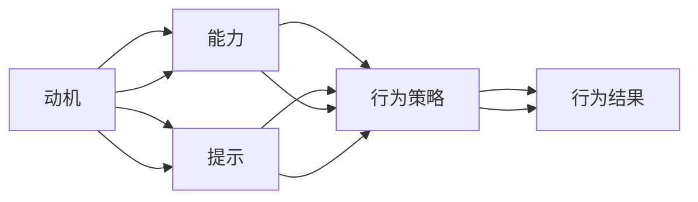

                 

# 福格行为模型:培养团队良好习惯的秘诀

> 关键词：行为科学,行为设计,团队管理,行为改变,福格模型

## 1. 背景介绍

在现代企业中，团队协作已成为提升工作效率、创新能力和市场竞争力的关键。如何有效地管理和激励团队，使其成员能持续保持高水平的工作动力和协同效率，一直是管理层和人力资源部门关注的重点。行为科学领域的学者B.J.福格（B.J. Fogg）提出的行为设计模型，为这个问题提供了一套系统化的方法。本文将深入探讨福格行为模型及其在团队管理中的应用，帮助读者理解和应用这一模型，从而更好地培养团队良好习惯，提升团队整体效能。

## 2. 核心概念与联系

### 2.1 核心概念概述

福格行为模型是一种行为设计框架，旨在通过明晰目标、理解环境因素和行为能力，帮助人们实现行为改变。该模型基于行为科学原理，强调动机、能力与提示三者之间的交互作用。其中：
- **动机**（Motivation）：个体为什么想要执行某个行为，如避免痛苦、追求奖励等。
- **能力**（Ability）：执行该行为所需的技能和资源，如时间、知识、工具等。
- **提示**（Prompts）：触发行为执行的线索或情境，如时间、地点、情绪等。

通过改变这三个要素中的任意一个或组合，便能设计出有效的行为策略，推动人们实现目标。福格行为模型在团队管理中的应用，主要体现在如何通过合理的行为设计，激发团队成员的内在动机，提供必要的资源和支持，并创造适宜的工作环境，从而实现团队的协同高效。

### 2.2 核心概念原理和架构的 Mermaid 流程图



该图展示了福格行为模型中动机、能力和提示三者之间的交互关系。动机驱动能力与提示，共同作用于行为策略的形成，最终导致行为结果。在团队管理中，理解并设计这三个要素，是实现行为改变、提升团队效能的关键。

## 3. 核心算法原理 & 具体操作步骤

### 3.1 算法原理概述

福格行为模型的核心在于通过设计适宜的动机、能力和提示，来改变个体行为。这一原理同样适用于团队管理，即通过行为设计策略，提升团队成员的工作动力和协同效率。具体而言，团队管理者需：
- 理解团队成员的内在动机，为其设定明确、可达成的目标。
- 评估团队成员的行为能力，提供必要的资源和支持。
- 创造适宜的提示环境，确保行为策略的有效执行。

### 3.2 算法步骤详解

以下是福格行为模型在团队管理中具体应用的步骤：

**Step 1: 目标设定**

1. **明确目标**：与团队成员共同设定具体、可达成的目标，确保每个成员都清楚自己的工作方向和期望成果。
2. **量化目标**：将目标进行量化，以便于评估和跟踪进展。

**Step 2: 动机激发**

1. **了解动机**：通过一对一沟通或问卷调查，了解团队成员的内在动机，如避免失败、追求成就感等。
2. **激发动机**：设计符合个体动机的奖励机制，如表扬、晋升、奖金等，激发成员的内在动力。

**Step 3: 能力评估**

1. **识别能力缺口**：评估团队成员现有能力和技能，识别出需要提升的方面。
2. **提供支持**：针对能力缺口，提供培训、工具、资源等支持，帮助团队成员提升能力。

**Step 4: 提示设计**

1. **设计提示**：设计适宜的提示环境，如设定固定工作时间、优化工作流程、提供必要的工具等，确保行为策略的有效执行。
2. **持续反馈**：建立持续反馈机制，及时了解团队成员的工作进展和困难，给予必要的指导和调整。

**Step 5: 行为实施**

1. **实施策略**：根据目标、动机、能力和提示设计出的行为策略，开始执行。
2. **监测和调整**：持续监测行为实施效果，根据实际情况进行必要的调整和优化。

### 3.3 算法优缺点

福格行为模型的优点包括：
- 系统化：通过明确目标、评估能力和设计提示，系统性地推动行为改变。
- 实用性强：模型简单易懂，适用于各种规模和类型的团队管理。
- 灵活性高：可根据实际情况进行灵活调整和优化。

然而，该模型也存在一些缺点：
- 缺乏理论深度：模型过于简化，未能全面涵盖影响行为的所有因素。
- 过度依赖管理者：行为设计的效果高度依赖于管理者的理解和应用。
- 需要持续维护：行为策略的实施需要持续监测和调整，管理成本较高。

### 3.4 算法应用领域

福格行为模型广泛应用于企业的人力资源管理、团队建设、项目管理等多个领域。具体而言，该模型在以下方面具有显著的应用价值：

1. **员工激励**：通过行为设计激发员工的内在动机，提升工作积极性和满意度。
2. **绩效管理**：通过量化目标和持续反馈，帮助员工明确目标，提升工作绩效。
3. **培训与发展**：识别并弥补员工能力缺口，提供必要的培训和资源，促进员工成长。
4. **团队协作**：设计适宜的提示环境，促进团队成员之间的沟通和协作，提升团队整体效能。
5. **企业文化**：通过行为设计塑造积极的企业文化，提升员工的归属感和忠诚度。

## 4. 数学模型和公式 & 详细讲解

### 4.1 数学模型构建

福格行为模型主要关注行为改变的过程，因此其数学模型更多地基于心理学和行为科学原理，而非传统意义上的数学模型。然而，为了更好地解释和应用该模型，我们可以将其简化为一个行为改变的过程模型。

**模型假设**：
- 目标（Goal）：团队成员希望实现的行为目标。
- 能力（Ability）：团队成员实现目标所需的技能和资源。
- 提示（Prompts）：触发行为的环境因素。
- 动力（Motivation）：团队成员执行目标的动机。
- 反馈（Feedback）：行为结果对团队成员的反馈和影响。

**模型构建**：
- 行为改变 = 目标 * 动机 * 能力 * 提示

### 4.2 公式推导过程

根据上述假设和模型构建，我们可以推导出行为改变的基本公式：

$$
\text{Behavior Change} = \text{Goal} \times \text{Motivation} \times \text{Ability} \times \text{Prompt}
$$

该公式表明，行为改变的程度取决于目标的明确性、动机的强度、能力的水平以及环境的提示。

### 4.3 案例分析与讲解

**案例**：某科技公司员工频繁加班，导致工作效率低下，团队士气低落。

1. **目标设定**：设定明确的工作目标，减少加班，提高工作效率。
2. **动机激发**：了解员工加班的动机，如任务压力、奖金激励等，设计相应的奖励机制。
3. **能力评估**：评估员工的工作能力和技能，识别能力缺口，提供必要的培训和工具。
4. **提示设计**：优化工作流程，设定合理的工作时间，提供高效的工作环境。
5. **行为实施**：根据上述策略，逐步实施行为改变，并持续监测和调整。

## 5. 项目实践：代码实例和详细解释说明

### 5.1 开发环境搭建

在进行福格行为模型的实践应用时，需要搭建适合的行为管理平台。以下是基本开发环境配置步骤：

1. **环境配置**：安装Python、Flask等开发工具，搭建Web服务器环境。
2. **数据准备**：准备团队成员的工作数据，如目标设定、动机评估、能力评估等。
3. **模型训练**：根据上述数据，训练福格行为模型，生成行为改变策略。
4. **平台部署**：将模型部署到Web平台，提供可视化管理界面。

### 5.2 源代码详细实现

以下是基于Flask的福格行为管理平台的基本代码实现：

```python
from flask import Flask, render_template, request
import pandas as pd

app = Flask(__name__)

@app.route('/')
def index():
    return render_template('index.html')

@app.route('/submit', methods=['POST'])
def submit():
    # 处理表单数据
    goal = request.form['goal']
    motivation = request.form['motivation']
    ability = request.form['ability']
    prompt = request.form['prompt']
    
    # 使用数据处理和机器学习模型进行行为策略生成
    # ...
    
    return render_template('result.html', result=result)

if __name__ == '__main__':
    app.run(debug=True)
```

### 5.3 代码解读与分析

**代码解释**：
- `Flask`库用于搭建Web平台，实现与用户的交互。
- `index`函数提供首页，展示平台界面。
- `submit`函数处理用户提交的表单数据，生成行为策略。
- `result`函数展示行为策略结果，供用户参考和调整。

**分析**：
- 代码简洁高效，利用Flask框架实现了基本的Web平台功能。
- 数据处理和行为策略生成部分需要根据具体需求进行详细设计和实现。
- 平台的用户界面和交互体验设计是关键，应尽可能简洁、直观，方便用户操作。

### 5.4 运行结果展示

运行上述代码后，即可在Web平台上看到行为管理界面。用户可以填写目标、动机、能力和提示信息，系统自动生成行为策略，并提供结果展示和调整建议。

## 6. 实际应用场景

### 6.1 团队激励与绩效管理

在团队管理中，通过福格行为模型，可以设计出有效的激励机制，提升团队成员的工作动力和绩效。例如：
- 设定明确的工作目标，如提高销售额、降低出错率等。
- 设计符合个体动机的奖励机制，如提成奖金、晋升机会等。
- 提供必要的培训和资源，帮助团队成员提升技能。
- 创造适宜的工作环境，如设定合理的工作时间、优化工作流程等。

### 6.2 项目管理和团队协作

在项目管理中，福格行为模型同样具有显著的应用价值。例如：
- 设定项目里程碑和任务目标，确保项目进展透明可控。
- 识别和弥补项目团队的能力缺口，提供必要的支持。
- 设计提示环境，如定期会议、任务分配等，促进团队协作。
- 持续监测项目进展，根据实际情况进行调整和优化。

### 6.3 人力资源管理

人力资源管理是企业管理的核心环节，福格行为模型在此方面的应用包括：
- 设定员工职业发展规划和目标，帮助员工明确成长方向。
- 设计个性化的培训和发展计划，提升员工技能和能力。
- 提供灵活的工作环境和支持，如弹性工作时间、远程办公等。
- 定期反馈和评估员工表现，根据实际情况进行调整。

### 6.4 未来应用展望

展望未来，福格行为模型在团队管理中的应用将更加广泛和深入。以下是可以预见的应用方向：
- **智能化管理**：利用人工智能技术，实时监测和分析团队行为数据，提供动态调整建议。
- **跨文化管理**：针对不同文化背景的团队，设计适宜的行为策略，促进跨文化协作。
- **情绪管理**：通过情绪监测和分析，提供情绪调节和团队激励的策略。
- **个性化管理**：根据团队成员的个人特征和需求，设计个性化的行为策略，提升个体满意度和绩效。

## 7. 工具和资源推荐

### 7.1 学习资源推荐

- **书籍**：《行为设计学》（B.J. Fogg），详细介绍了福格行为模型的理论基础和应用实践。
- **课程**：Coursera上的《行为科学》课程，涵盖行为科学的基本原理和应用。
- **工具**：Trello、Asana等项目管理工具，配合行为设计思想，提升项目管理效果。
- **文章**：Harvard Business Review上关于行为设计的系列文章，提供丰富的应用案例和实践建议。

### 7.2 开发工具推荐

- **Python**：作为数据分析和行为设计的常用编程语言，Python提供了丰富的库和工具，如Pandas、NumPy等，适合进行数据处理和行为策略生成。
- **Flask**：用于搭建Web平台，实现与用户的交互和行为数据收集。
- **TensorFlow**：用于机器学习和行为策略生成，支持复杂的数据处理和模型训练。

### 7.3 相关论文推荐

- **《行为改变理论的最新进展》**（Alan cognitive therapy，2016）：介绍了行为改变理论的发展和应用，为理解福格行为模型提供理论基础。
- **《行为设计：创新时代的策略指南》**（B.J. Fogg）：详细阐述了行为设计的基本原理和实践方法，是应用福格行为模型的必读之作。
- **《行为设计学：创建习惯》**（B.J. Fogg）：介绍了如何设计有效的行为策略，促进习惯的形成和保持。

## 8. 总结：未来发展趋势与挑战

### 8.1 研究成果总结

福格行为模型作为一种行为设计框架，为团队管理提供了系统化的解决方案。通过明确目标、评估能力和设计提示，该模型帮助团队实现行为改变，提升整体效能。在员工激励、绩效管理、项目管理和人力资源管理等多个领域，福格行为模型都显示出了显著的应用价值。

### 8.2 未来发展趋势

未来，福格行为模型将在以下几个方面继续发展：
- **智能化管理**：结合人工智能技术，实现动态监测和实时调整，提升管理效率。
- **跨文化管理**：针对不同文化背景的团队，设计适宜的行为策略，促进跨文化协作。
- **情绪管理**：引入情绪监测和调节技术，提升团队的情绪管理和幸福感。
- **个性化管理**：根据团队成员的个人特征和需求，设计个性化的行为策略，提升个体满意度和绩效。

### 8.3 面临的挑战

尽管福格行为模型在团队管理中具有显著优势，但仍面临以下挑战：
- **复杂性**：行为设计需要综合考虑多个因素，实施和管理较为复杂。
- **数据依赖**：行为策略的有效性高度依赖于准确的数据收集和分析。
- **持续维护**：行为策略的实施需要持续监测和调整，管理成本较高。

### 8.4 研究展望

未来，福格行为模型的研究应重点关注以下方向：
- **模型优化**：通过优化模型结构和算法，提升行为策略的生成效率和准确性。
- **跨领域应用**：探索福格行为模型在其他领域的应用，如医疗、教育等，推广行为设计的理念和实践。
- **伦理考量**：关注行为设计中的伦理问题，确保管理策略符合道德和法律要求。
- **技术融合**：将行为设计与新兴技术如区块链、物联网等相结合，探索新的应用场景和管理模式。

## 9. 附录：常见问题与解答

**Q1：福格行为模型是否适用于所有团队？**

A: 福格行为模型适用于大多数团队，特别是那些希望提升团队协作效率和员工满意度的团队。但对于一些特殊类型的团队，如高度分散或自主性较强的团队，可能需要结合具体情况进行调整和优化。

**Q2：如何识别团队成员的能力缺口？**

A: 通过定期评估和反馈，识别团队成员在技能和资源方面的缺口。可以参考以下步骤：
1. 设定清晰的绩效标准。
2. 定期进行绩效评估。
3. 分析评估结果，识别能力缺口。
4. 提供针对性的培训和资源支持。

**Q3：如何设计适宜的提示环境？**

A: 设计提示环境需要综合考虑团队的工作习惯和心理需求。可以参考以下策略：
1. 设定固定的工作时间和休息时间。
2. 优化工作流程，减少不必要的步骤。
3. 提供高效的工具和资源，减少工作负担。
4. 建立正面的团队文化，提升成员的归属感。

**Q4：如何确保行为策略的持续执行？**

A: 确保行为策略持续执行的关键在于建立持续的反馈和监测机制：
1. 定期收集团队成员的反馈和建议。
2. 分析反馈结果，识别行为策略的执行效果。
3. 根据反馈结果进行必要的调整和优化。
4. 建立激励机制，保持成员的持续动力。

**Q5：如何应用福格行为模型于跨文化团队管理？**

A: 跨文化团队管理需要特别注意文化差异对行为策略的影响，建议采取以下措施：
1. 了解不同文化的价值观和工作习惯。
2. 设计符合各文化背景的行为策略，确保策略的适用性和有效性。
3. 建立文化敏感度培训，提升团队成员的文化适应能力。
4. 鼓励跨文化沟通，促进团队成员之间的理解和协作。

作者：禅与计算机程序设计艺术 / Zen and the Art of Computer Programming

