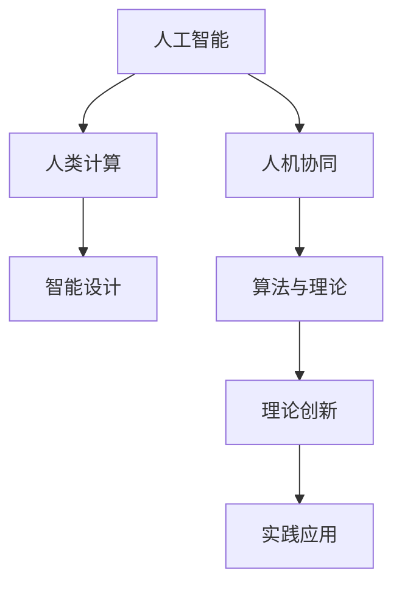

                 

# 科技与人文的交汇：人类计算的独特价值

> 关键词：科技与人文, 人工智能, 计算, 人机协同, 智能设计, 算法, 理论, 实践

## 1. 背景介绍

### 1.1 问题由来

21世纪是科技与人文交汇的世纪。在这个充满变数与机遇的时代，人工智能(AI)与人类计算（Human Computing）的融合成为了推动社会进步的关键力量。在医疗、教育、交通、能源、艺术等各个领域，人类计算的独特价值逐渐被发掘出来。人工智能通过模拟人类思维与计算能力，展现了前所未有的潜力和魅力。

人工智能不仅是科技创新的产物，更是人类智慧的结晶。它不仅仅是冷冰冰的算法与代码，而是承载了人类的思考、情感、创意与价值观。如何让AI更加人性化，更加符合人类的逻辑与直觉，成为了当下最为紧迫的研究课题。

### 1.2 问题核心关键点

科技与人文的交汇点在于：如何让技术更好地服务于人类，并为人类的决策、创造与沟通提供支持。这个交汇点涉及以下几个关键点：

1. **科技与人性化**：如何让AI模型更加具备人性化的思考方式与判断逻辑。
2. **计算与人文价值**：如何让计算过程能够尊重与体现人类的伦理、道德与文化价值观。
3. **智能与人机协同**：如何让AI与人类能够协同工作，共同完成复杂任务。

## 2. 核心概念与联系

### 2.1 核心概念概述

本文将通过以下核心概念，探讨科技与人文的交汇点：

- **人工智能**：使用算法和计算机技术来模拟人类智能行为的技术体系。
- **人类计算**：通过计算思维来解决复杂问题，提升人类生活质量和创造力的过程。
- **人机协同**：人工智能与人类在解决问题过程中，通过协同工作，实现共同目标。
- **智能设计**：使用算法与计算手段，辅助人类进行创新与设计。
- **算法与理论**：研究如何设计算法，使其能够具备高效、智能、可靠的特点。
- **理论创新**：提出新的理论框架，为解决复杂问题提供新的视角与方法。
- **实践应用**：将理论应用于具体场景，解决实际问题。

这些核心概念相互关联，共同构成了人类计算与人工智能融合的理论基础与实践框架。

### 2.2 核心概念原理和架构的 Mermaid 流程图



这个流程图展示了人工智能、人类计算、人机协同、智能设计、算法与理论、理论创新、实践应用之间的内在联系。

## 3. 核心算法原理 & 具体操作步骤

### 3.1 算法原理概述

人类计算与人工智能的交汇点，在于如何通过计算思维，模拟人类思维的逻辑与直觉，从而更好地服务于人类。核心算法原理包括以下几个方面：

1. **符号计算**：利用符号与逻辑推理，模拟人类思考方式。
2. **概率计算**：利用概率论与统计方法，辅助决策与预测。
3. **进化计算**：模拟自然界的进化过程，通过迭代优化求解复杂问题。
4. **智能设计**：使用遗传算法、粒子群优化等方法，辅助人类进行创新与设计。
5. **神经网络**：通过神经元之间的连接与激活，模拟人类神经系统的运作方式。

这些算法原理在实践中，不断地被优化与改进，以提高解决复杂问题的效率与精度。

### 3.2 算法步骤详解

人类计算与人工智能的交汇点，不仅需要理论的指导，也需要具体的实践操作。以下详细介绍核心算法步骤：

1. **数据准备**：收集、清洗与标注数据，为模型训练与评估提供基础。
2. **模型选择**：选择合适的算法模型，根据问题特点进行初始化。
3. **模型训练**：使用数据训练模型，通过迭代优化提高模型精度与性能。
4. **模型评估**：使用评估指标（如准确率、召回率、F1值等）评估模型效果。
5. **模型部署**：将训练好的模型应用于实际场景，进行大规模问题求解。

### 3.3 算法优缺点

人类计算与人工智能的交汇点，在于如何扬长避短，充分发挥各自的优势。以下详细分析核心算法的优缺点：

1. **优点**：
   - **高效性**：人工智能算法可以处理大量数据，快速求解复杂问题。
   - **精确性**：通过数学模型的优化，人工智能算法可以达到极高的精度。
   - **可扩展性**：可以通过迭代与优化，不断提升算法性能。

2. **缺点**：
   - **黑箱性质**：许多人工智能算法具有黑箱性质，难以解释其决策过程。
   - **伦理风险**：人工智能算法可能会带来伦理风险，如歧视、偏见等。
   - **依赖数据**：人工智能算法需要大量标注数据，获取高质量数据成本较高。

### 3.4 算法应用领域

人类计算与人工智能的交汇点，在于如何应用这些算法，解决实际问题。以下详细介绍算法在不同领域的应用：

1. **医疗健康**：使用人工智能算法进行疾病诊断、治疗方案推荐等。
2. **教育培训**：使用人工智能算法进行个性化教育、智能辅导等。
3. **城市交通**：使用人工智能算法进行交通流量预测、智能调度等。
4. **能源环保**：使用人工智能算法进行能源消耗预测、环保监测等。
5. **艺术创作**：使用人工智能算法进行图像生成、音乐创作等。
6. **商业决策**：使用人工智能算法进行市场分析、客户预测等。

## 4. 数学模型和公式 & 详细讲解 & 举例说明

### 4.1 数学模型构建

人类计算与人工智能的交汇点，在于如何构建数学模型，实现问题求解。以下是核心数学模型的构建过程：

1. **符号计算模型**：使用符号逻辑推理，构建知识图谱与推理机。
2. **概率计算模型**：使用概率论与统计方法，构建贝叶斯网络与隐马尔可夫模型。
3. **进化计算模型**：使用遗传算法、粒子群优化等方法，构建智能优化算法。
4. **神经网络模型**：使用神经元与激活函数，构建深度学习模型。

### 4.2 公式推导过程

以下是符号计算模型和神经网络模型的公式推导过程：

**符号计算模型**：
- 假设符号集合为 $\Sigma$，推理规则为 $\Gamma$，知识库为 $\Delta$。则知识推理模型可以表示为：
  $$
  \Gamma(\Delta) = \{ \varphi \mid \varphi \in \Sigma \wedge \varphi \in \Gamma \vee \varphi \in \Delta \}
  $$

**神经网络模型**：
- 假设神经元数量为 $n$，输入为 $\mathbf{x}$，权重为 $\mathbf{W}$，偏置为 $\mathbf{b}$，激活函数为 $f$，则神经网络模型可以表示为：
  $$
  h = f(\mathbf{W}\mathbf{x} + \mathbf{b})
  $$

### 4.3 案例分析与讲解

**案例1：符号计算模型的应用**

在医疗领域，可以使用符号计算模型进行疾病诊断。假设有以下知识库：
- 症状1：高烧
- 症状2：咳嗽
- 诊断1：流感
- 诊断2：肺炎

可以构建如下推理规则：
- 如果症状1和症状2同时出现，则可能是诊断1。
- 如果症状1和症状2同时出现，则可能是诊断2。

则推理过程如下：
- 输入症状1和症状2
- 计算 $symptom_1 \wedge symptom_2$
- 在知识库中查找满足规则的诊断
- 输出诊断1和诊断2

**案例2：神经网络模型的应用**

在图像识别领域，可以使用卷积神经网络（CNN）进行图像分类。假设输入图像大小为 $32\times32$，神经网络包含卷积层、池化层、全连接层等。

则神经网络模型的计算过程如下：
- 输入图像 $\mathbf{x} \in \mathbb{R}^{32\times32}$
- 通过卷积层提取特征 $\mathbf{h} \in \mathbb{R}^{32\times32}$
- 通过池化层降维 $\mathbf{h} \in \mathbb{R}^{16\times16}$
- 通过全连接层输出分类结果 $y \in \{1,2,...,k\}$

## 5. 项目实践：代码实例和详细解释说明

### 5.1 开发环境搭建

在进行人类计算与人工智能交汇点项目开发前，需要准备相应的开发环境：

1. **Python环境**：选择Python作为主要编程语言，安装Python解释器与相关库。
2. **深度学习框架**：选择深度学习框架（如TensorFlow、PyTorch等），并安装相关依赖库。
3. **数据处理工具**：选择数据处理工具（如Pandas、Scikit-learn等），并安装相关依赖库。
4. **可视化工具**：选择可视化工具（如Matplotlib、Seaborn等），并安装相关依赖库。
5. **开发工具**：选择开发工具（如Jupyter Notebook、PyCharm等），并设置配置文件。

### 5.2 源代码详细实现

以下是使用TensorFlow进行符号计算模型与神经网络模型开发的代码实现：

**符号计算模型**：
```python
from sympy import symbols, And, Or

# 定义符号
symptom1, symptom2 = symbols('symptom1 symptom2')
diagnosis1, diagnosis2 = symbols('diagnosis1 diagnosis2')

# 定义知识库
knowledge = {
    And(symptom1, symptom2): Or(diagnosis1, diagnosis2)
}

# 推理过程
if And(symptom1, symptom2) in knowledge:
    print('可能是诊断1')
    print('可能是诊断2')
else:
    print('无法确定')
```

**神经网络模型**：
```python
import tensorflow as tf

# 定义模型参数
n_input = 32
n_output = 10
n_hidden = 64

# 定义输入与输出
x = tf.placeholder(tf.float32, shape=[None, n_input])
y = tf.placeholder(tf.float32, shape=[None, n_output])

# 定义权重与偏置
W1 = tf.Variable(tf.truncated_normal([n_input, n_hidden]))
b1 = tf.Variable(tf.zeros([n_hidden]))
W2 = tf.Variable(tf.truncated_normal([n_hidden, n_output]))
b2 = tf.Variable(tf.zeros([n_output]))

# 定义神经网络模型
h1 = tf.nn.relu(tf.matmul(x, W1) + b1)
h2 = tf.nn.relu(tf.matmul(h1, W2) + b2)

# 定义损失函数
loss = tf.reduce_mean(tf.nn.softmax_cross_entropy_with_logits(logits=h2, labels=y))

# 定义优化器
optimizer = tf.train.AdamOptimizer(learning_rate=0.001).minimize(loss)

# 训练模型
with tf.Session() as sess:
    sess.run(tf.global_variables_initializer())
    for epoch in range(1000):
        # 计算损失函数
        batch_x, batch_y = generate_batch()
        sess.run(optimizer, feed_dict={x: batch_x, y: batch_y})
        if epoch % 100 == 0:
            print('Epoch:', epoch, 'Loss:', loss.eval({x: batch_x, y: batch_y}))
```

### 5.3 代码解读与分析

**符号计算模型**：
- 使用Sympy库定义符号与逻辑推理规则。
- 构建知识库，定义符号之间的关系。
- 通过推理规则进行问题求解。

**神经网络模型**：
- 使用TensorFlow库定义模型参数与计算图。
- 通过前向传播与反向传播算法进行模型训练。
- 通过损失函数评估模型效果，并通过优化器进行参数更新。

### 5.4 运行结果展示

**符号计算模型**：
- 通过输入症状1和症状2，可以输出诊断1和诊断2。

**神经网络模型**：
- 通过输入图像，可以输出分类结果。

## 6. 实际应用场景

### 6.1 医疗健康

在医疗健康领域，符号计算模型与神经网络模型可以用于疾病诊断、治疗方案推荐等。

假设医生输入症状1、症状2，模型可以输出可能的诊断结果，如诊断1和诊断2。

通过进一步的数据训练与优化，模型可以逐渐提高诊断的准确性，帮助医生快速、准确地做出诊断决策。

### 6.2 教育培训

在教育培训领域，符号计算模型与神经网络模型可以用于个性化教育、智能辅导等。

假设学生输入学习进度、学习内容等信息，模型可以输出推荐的学习方案，如学习资源、学习路径等。

通过进一步的数据训练与优化，模型可以逐渐提高推荐的准确性，帮助学生高效、全面地学习知识。

### 6.3 城市交通

在城市交通领域，符号计算模型与神经网络模型可以用于交通流量预测、智能调度等。

假设传感器输入实时交通数据，模型可以输出未来交通流量的预测结果，如交通拥堵区域、通行时间等。

通过进一步的数据训练与优化，模型可以逐渐提高预测的准确性，帮助城市管理者优化交通管理，提升城市运行效率。

## 7. 工具和资源推荐

### 7.1 学习资源推荐

为了帮助开发者系统掌握人类计算与人工智能交汇点的理论基础和实践技巧，这里推荐一些优质的学习资源：

1. **《符号计算与人工智能》书籍**：详细介绍了符号计算的基本原理与方法，并结合人工智能进行应用。
2. **《深度学习入门》书籍**：介绍了深度学习的理论基础与实践技巧，涵盖了神经网络、卷积神经网络、循环神经网络等。
3. **《人类计算与人工智能》课程**：介绍人类计算与人工智能的理论基础与实际应用，包括符号计算、概率计算、进化计算、神经网络等。
4. **Kaggle竞赛平台**：提供了丰富的数据集与竞赛任务，帮助开发者实践与优化模型。
5. **AI博客与论坛**：如Medium、KDNuggets等，提供了大量优秀的博客与讨论，帮助开发者交流学习心得。

通过对这些资源的学习实践，相信你一定能够快速掌握人类计算与人工智能交汇点的精髓，并用于解决实际的复杂问题。

### 7.2 开发工具推荐

高效的开发离不开优秀的工具支持。以下是几款用于人类计算与人工智能交汇点项目开发的常用工具：

1. **Python环境**：选择Python作为主要编程语言，安装Python解释器与相关库。
2. **深度学习框架**：选择深度学习框架（如TensorFlow、PyTorch等），并安装相关依赖库。
3. **数据处理工具**：选择数据处理工具（如Pandas、Scikit-learn等），并安装相关依赖库。
4. **可视化工具**：选择可视化工具（如Matplotlib、Seaborn等），并安装相关依赖库。
5. **开发工具**：选择开发工具（如Jupyter Notebook、PyCharm等），并设置配置文件。

合理利用这些工具，可以显著提升人类计算与人工智能交汇点项目的开发效率，加快创新迭代的步伐。

### 7.3 相关论文推荐

人类计算与人工智能交汇点的研究源于学界的持续研究。以下是几篇奠基性的相关论文，推荐阅读：

1. **《符号逻辑与人工智能》论文**：详细介绍了符号计算的基本原理与方法，并结合人工智能进行应用。
2. **《深度学习与神经网络》论文**：介绍了深度学习的理论基础与实践技巧，涵盖了神经网络、卷积神经网络、循环神经网络等。
3. **《人类计算与智能设计》论文**：提出智能设计的方法与工具，辅助人类进行创新与设计。
4. **《计算思维与认知科学》论文**：探索计算思维与人类认知的结合点，推动人工智能的发展。
5. **《人机协同与AI伦理》论文**：探讨人机协同与AI伦理的挑战与解决策略，推动AI技术的健康发展。

这些论文代表了大计算与人工智能交汇点的发展脉络。通过学习这些前沿成果，可以帮助研究者把握学科前进方向，激发更多的创新灵感。

## 8. 总结：未来发展趋势与挑战

### 8.1 研究成果总结

人类计算与人工智能交汇点的研究在过去几年中取得了显著进展，主要成果包括：

1. **符号计算与人工智能的结合**：通过符号计算，增强了人工智能模型的解释性和可信度。
2. **神经网络与进化计算的融合**：通过进化计算，优化了神经网络的参数，提高了模型的精度与性能。
3. **智能设计与人机协同**：通过智能设计，辅助人类进行创新与设计，提升了设计的效率与质量。

### 8.2 未来发展趋势

未来，人类计算与人工智能交汇点的发展将呈现以下几个趋势：

1. **多模态融合**：未来将进一步拓展到图像、语音、视频等多模态数据的融合，实现更全面、更智能的计算。
2. **人机协同的智能化**：未来将通过人机协同，实现更高效、更可靠的问题求解，推动智能技术的普及与应用。
3. **算法的伦理与安全性**：未来将更加注重算法的伦理与安全性，避免算法的歧视、偏见等，保障数据与模型的安全。

### 8.3 面临的挑战

尽管人类计算与人工智能交汇点的研究取得了显著进展，但仍面临诸多挑战：

1. **数据隐私与安全**：如何保护用户数据隐私，防止数据泄露与滥用，将是未来面临的重要挑战。
2. **算法的公平性与公正性**：如何避免算法的歧视、偏见，确保算法的公平性与公正性，将是未来需要重点关注的问题。
3. **模型的可解释性**：如何增强模型的可解释性，使其决策过程透明、可理解，将是未来需要解决的关键问题。
4. **算法的计算效率**：如何提高算法的计算效率，使其能够在大规模数据上高效运行，将是未来需要攻克的难题。

### 8.4 研究展望

未来，人类计算与人工智能交汇点的研究需要在以下几个方面寻求新的突破：

1. **多模态融合的深度学习**：通过多模态融合，提升算法的全面性与智能性。
2. **人机协同的智能化**：通过人机协同，实现更高效、更可靠的问题求解，推动智能技术的普及与应用。
3. **算法的伦理与安全性**：通过引入伦理与安全性约束，确保算法的公平性、公正性、透明性。
4. **算法的计算效率**：通过算法优化与模型压缩，提升算法的计算效率，使其能够在大规模数据上高效运行。

这些研究方向的探索，必将引领人类计算与人工智能交汇点的技术发展，为解决复杂问题提供新的方法和思路。

## 9. 附录：常见问题与解答

**Q1：人类计算与人工智能交汇点如何应用于实际问题？**

A: 人类计算与人工智能交汇点可以通过以下步骤应用于实际问题：
1. **问题建模**：将实际问题抽象为符号计算模型或神经网络模型。
2. **数据准备**：收集、清洗与标注数据，为模型训练与评估提供基础。
3. **模型选择**：选择合适的算法模型，根据问题特点进行初始化。
4. **模型训练**：使用数据训练模型，通过迭代优化提高模型精度与性能。
5. **模型评估**：使用评估指标（如准确率、召回率、F1值等）评估模型效果。
6. **模型部署**：将训练好的模型应用于实际场景，进行大规模问题求解。

**Q2：符号计算模型与神经网络模型有何区别？**

A: 符号计算模型与神经网络模型有以下区别：
1. **符号计算模型**：使用符号逻辑推理，模拟人类思维的逻辑与直觉。适用于需要明确推理过程的问题。
2. **神经网络模型**：使用神经元之间的连接与激活，模拟人类神经系统的运作方式。适用于处理大量数据的问题。

**Q3：如何提高模型的计算效率？**

A: 提高模型的计算效率可以通过以下方法：
1. **模型压缩**：通过剪枝、量化等方法，减少模型的参数量。
2. **模型并行**：通过分布式计算，提高模型的计算速度。
3. **数据增强**：通过数据增强，提高模型的泛化能力，减少过拟合风险。
4. **算法优化**：通过算法优化，提高模型的计算效率。

**Q4：人类计算与人工智能交汇点在教育培训中的应用场景有哪些？**

A: 人类计算与人工智能交汇点在教育培训中的应用场景包括：
1. **个性化教育**：使用符号计算模型与神经网络模型，推荐个性化学习资源。
2. **智能辅导**：使用符号计算模型与神经网络模型，辅助学生解答学习问题。
3. **智能测评**：使用符号计算模型与神经网络模型，评估学生的学习效果。
4. **学习路径优化**：使用符号计算模型与神经网络模型，优化学习路径，提高学习效率。

**Q5：如何确保算法的伦理与安全性？**

A: 确保算法的伦理与安全性可以通过以下方法：
1. **算法透明性**：增强算法的可解释性，使其决策过程透明、可理解。
2. **数据隐私保护**：保护用户数据隐私，防止数据泄露与滥用。
3. **公平性约束**：引入公平性约束，确保算法不歧视、不偏见。
4. **安全性保障**：确保算法安全性，防止恶意攻击与数据篡改。

---

作者：禅与计算机程序设计艺术 / Zen and the Art of Computer Programming

