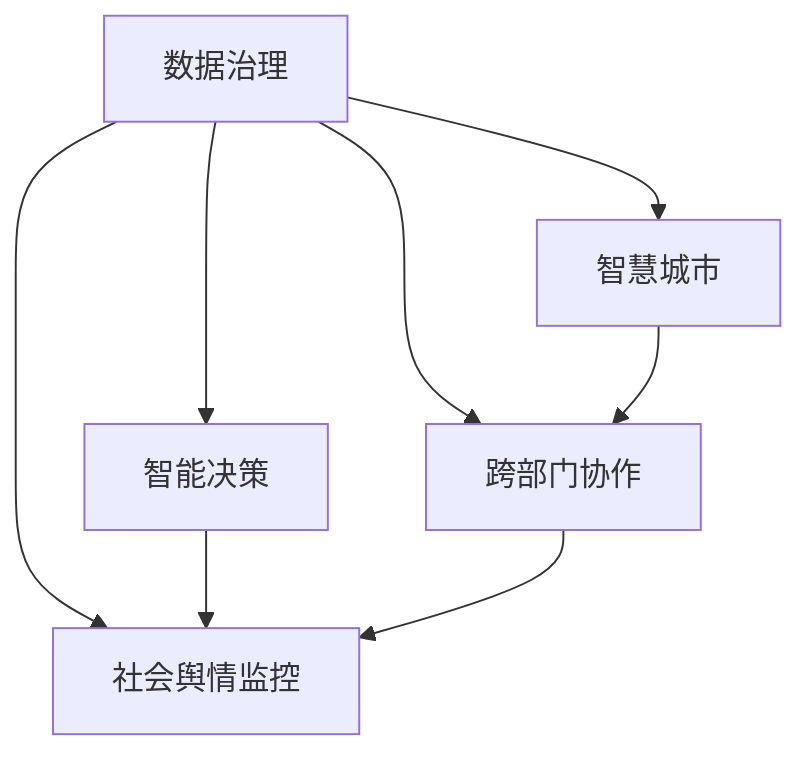

                 

# 科技创新：社会治理的新思路

> 关键词：科技创新,社会治理,人工智能,数据治理,智能决策,政府改革,智慧城市

## 1. 背景介绍

### 1.1 问题由来
随着信息技术的迅猛发展和互联网应用的普及，现代社会呈现出数据量激增、信息处理复杂化、社会治理需求多元化的新特点。传统的以经验判断和人工操作为主的治理模式已难以应对现代社会的快速变化和复杂挑战。而科技创新，特别是人工智能（AI）、大数据分析等技术的迅猛发展，为社会治理提供了新的技术手段和方法。

过去几年，全球许多国家和地区都在积极探索利用科技创新来提升社会治理水平。例如，中国正在推进国家治理体系和治理能力现代化，深化“互联网+政务服务”改革，大力实施“数字中国”战略。通过AI、大数据、云计算等前沿技术，政府部门可以更高效地进行决策、管理和服务，增强治理效能。

### 1.2 问题核心关键点
科技创新在社会治理中的应用主要体现在以下几个方面：

1. **数据治理**：通过对海量数据的收集、清洗、分析，提供更准确、全面的决策支持。
2. **智能决策**：利用机器学习和深度学习技术，建立智能预测模型，提高决策的科学性和精确性。
3. **智慧城市**：通过物联网、5G等技术，实现城市管理的智能化和高效化。
4. **人工智能辅助**：将AI技术应用于公共安全、交通管理、环境保护等多个领域，提升治理效果。
5. **跨部门协作**：打破信息孤岛，实现不同政府部门之间的数据共享和协同治理。
6. **社会舆情监控**：通过大数据分析和情感分析技术，及时掌握社会舆情动态，防范风险。

这些技术手段的引入，不仅提升了社会治理的效率和质量，也带来了新的挑战和问题，如数据隐私保护、技术伦理、社会公平等。因此，本文将从科技创新在社会治理中的应用出发，探讨其潜力与挑战，并提出相关建议。

## 2. 核心概念与联系

### 2.1 核心概念概述

为更好地理解科技创新在社会治理中的应用，本节将介绍几个核心概念：

- **数据治理**：指对数据进行收集、存储、管理、清洗、分析、共享、保护等一系列活动，以提高数据的价值和使用效率。
- **智能决策**：指通过AI技术辅助或替代人类决策，建立智能预测模型，提高决策的准确性和效率。
- **智慧城市**：指利用现代信息技术和物联网技术，实现城市管理的智能化、精细化和高效化。
- **跨部门协作**：指不同政府部门之间通过技术手段实现数据共享和协同治理，提高治理效能。
- **社会舆情监控**：指通过大数据分析和情感分析技术，及时掌握社会舆情动态，防范社会风险。

这些核心概念之间的逻辑关系可以通过以下Mermaid流程图来展示：



这个流程图展示了几项科技创新在社会治理中的应用及其相互关系：

1. 数据治理为智能决策提供了基础数据支持。
2. 智能决策能够提高城市管理和服务效率，促进跨部门协作。
3. 社会舆情监控需要依赖数据治理和智能决策来及时把握社会动态。

## 3. 核心算法原理 & 具体操作步骤
### 3.1 算法原理概述

科技创新在社会治理中的应用，核心在于利用AI、大数据等技术手段，提升数据处理和分析能力，辅助决策和管理，优化资源配置，提升服务质量。具体而言，包括以下几个关键步骤：

1. **数据收集与清洗**：通过传感器、监控设备、互联网等手段，收集海量数据，并进行初步清洗和预处理，确保数据的准确性和完整性。
2. **数据分析与建模**：利用机器学习和深度学习技术，对数据进行分析，建立智能预测模型，提取关键特征和模式。
3. **智能决策支持**：根据分析结果，结合领域专家的知识和经验，辅助决策者进行决策，提升决策的科学性和效率。
4. **智慧城市建设**：通过物联网、5G等技术，实现城市基础设施的智能化和高效管理，提升城市运行效率和服务质量。
5. **跨部门数据共享与协作**：建立数据共享平台，打破信息孤岛，实现不同部门之间的协同治理，提升治理效能。
6. **社会舆情监控与预警**：通过大数据分析和情感分析技术，及时掌握社会舆情动态，预测社会风险，提前采取应对措施。

### 3.2 算法步骤详解

以下以智能决策支持为例，详细讲解AI技术在社会治理中的应用流程：

1. **数据准备**：收集与决策相关的数据，如经济指标、人口统计、交通流量等。数据源包括公开数据、业务数据、传感器数据等。

2. **数据预处理**：对数据进行清洗、归一化、特征工程等预处理操作，确保数据质量。

3. **模型训练**：选择合适的机器学习或深度学习模型，如随机森林、支持向量机、神经网络等，使用历史数据对模型进行训练，调整模型参数。

4. **模型评估与优化**：使用测试数据集评估模型性能，进行交叉验证、调参等操作，提升模型准确性和泛化能力。

5. **模型应用**：将训练好的模型应用于实际决策场景，根据模型预测结果辅助决策者进行决策。

6. **结果反馈与迭代优化**：根据模型应用结果，收集反馈信息，不断优化模型和决策过程，实现持续改进。

### 3.3 算法优缺点

科技创新在社会治理中的应用具有以下优点：

1. **高效性**：AI和大数据分析技术能够快速处理海量数据，提供实时的决策支持，提升治理效率。
2. **科学性**：基于数据的决策比传统经验决策更加科学、准确，能够减少人为误差。
3. **普适性**：AI技术可以应用于各种社会治理场景，如交通管理、环境保护、公共安全等，具有广泛应用前景。
4. **可扩展性**：随着技术进步，治理能力可以不断扩展和升级，适应新的社会需求。

同时，这些技术手段也存在以下局限性：

1. **数据隐私问题**：大规模数据收集和处理可能涉及隐私保护，需要制定相关法律法规和伦理规范。
2. **技术伦理问题**：AI决策可能存在偏见和歧视，需要引入伦理审查机制，确保公平性和透明性。
3. **技术风险**：AI技术可能被恶意利用，需要进行风险评估和安全防护。
4. **技术门槛高**：AI和大数据分析技术门槛较高，需要专业技术人员进行开发和维护。
5. **资源消耗大**：大规模数据处理和模型训练需要高性能计算资源，成本较高。

### 3.4 算法应用领域

科技创新在社会治理中的应用涵盖了多个领域，包括但不限于：

- **智慧交通管理**：通过AI和传感器技术，实时监测交通流量，优化交通信号控制，减少拥堵。
- **公共安全监控**：利用视频监控和大数据分析技术，及时发现并防范各种安全风险，提升治安水平。
- **环境保护监测**：通过传感器网络和数据分析，实时监测环境污染情况，及时采取治理措施。
- **智能医疗服务**：利用AI和大数据技术，提供个性化医疗服务，提高诊疗效率和质量。
- **智慧教育应用**：通过AI和大数据分析，提供个性化学习推荐，提升教育效果。
- **智慧城市管理**：通过物联网和5G技术，实现城市基础设施的智能化管理，提升城市运行效率。

## 4. 数学模型和公式 & 详细讲解 & 举例说明
### 4.1 数学模型构建

科技创新在社会治理中的应用，涉及大量的数据处理和分析工作。以下以智能决策支持为例，详细讲解其数学模型构建过程。

设原始数据集为 $D=\{(x_i,y_i)\}_{i=1}^N$，其中 $x_i$ 为输入特征向量，$y_i$ 为输出标签。假设智能决策支持系统的输入为 $x$，输出为 $y$。

定义损失函数 $\ell(y,\hat{y})$ 为预测值与真实值之间的差异。常用的损失函数包括均方误差损失（MSE）、交叉熵损失（CE）等。

智能决策支持系统的目标是最小化预测误差，即最小化损失函数。具体数学模型为：

$$
\min_{\theta} \frac{1}{N} \sum_{i=1}^N \ell(y_i,\hat{y}(x_i;\theta))
$$

其中 $\theta$ 为模型参数，$\hat{y}(x_i;\theta)$ 为模型对输入 $x_i$ 的预测值。

### 4.2 公式推导过程

以下以交叉熵损失函数为例，推导智能决策支持系统的损失函数：

设模型输出为 $\hat{y}_i$，真实标签为 $y_i$。则交叉熵损失函数为：

$$
\ell(y,\hat{y}) = -\frac{1}{N} \sum_{i=1}^N y_i \log \hat{y}_i + (1-y_i) \log (1-\hat{y}_i)
$$

将其代入目标函数，得：

$$
\min_{\theta} \frac{1}{N} \sum_{i=1}^N [y_i \log \hat{y}_i + (1-y_i) \log (1-\hat{y}_i)]
$$

通过梯度下降等优化算法，最小化上述目标函数，更新模型参数 $\theta$，直至收敛。

### 4.3 案例分析与讲解

以智慧交通管理为例，解释智能决策支持系统在实际应用中的具体流程。

1. **数据收集**：通过交通监控摄像头、传感器等设备，实时收集车辆位置、速度、交通流量等数据。

2. **数据预处理**：对收集的数据进行清洗、归一化、特征工程等操作，确保数据质量。

3. **模型训练**：使用历史交通数据，训练智能决策模型，如基于LSTM的交通流量预测模型。

4. **模型评估**：使用测试数据集评估模型性能，调整模型参数，确保模型准确性。

5. **智能决策**：根据模型预测结果，调整交通信号灯控制策略，优化交通流量。

6. **结果反馈与迭代优化**：根据模型应用结果，收集反馈信息，不断优化模型和决策过程，实现持续改进。

## 5. 项目实践：代码实例和详细解释说明
### 5.1 开发环境搭建

在进行智能决策支持系统的开发前，需要准备好开发环境。以下是使用Python进行PyTorch开发的环境配置流程：

1. 安装Anaconda：从官网下载并安装Anaconda，用于创建独立的Python环境。

2. 创建并激活虚拟环境：
```bash
conda create -n pytorch-env python=3.8 
conda activate pytorch-env
```

3. 安装PyTorch：根据CUDA版本，从官网获取对应的安装命令。例如：
```bash
conda install pytorch torchvision torchaudio cudatoolkit=11.1 -c pytorch -c conda-forge
```

4. 安装TensorBoard：
```bash
pip install tensorboard
```

5. 安装各类工具包：
```bash
pip install numpy pandas scikit-learn matplotlib tqdm jupyter notebook ipython
```

完成上述步骤后，即可在`pytorch-env`环境中开始开发实践。

### 5.2 源代码详细实现

以下以智能决策支持系统为例，给出使用PyTorch进行模型训练和评估的PyTorch代码实现。

```python
import torch
import torch.nn as nn
import torch.optim as optim
from torch.utils.data import Dataset, DataLoader
import numpy as np

class TrafficDataset(Dataset):
    def __init__(self, data):
        self.data = data
        self.len = len(data)
    
    def __getitem__(self, index):
        return self.data[index]
    
    def __len__(self):
        return self.len

class LSTM(nn.Module):
    def __init__(self, input_size, hidden_size, output_size):
        super(LSTM, self).__init__()
        self.hidden_size = hidden_size
        self.lstm = nn.LSTM(input_size, hidden_size, num_layers=2, batch_first=True)
        self.fc = nn.Linear(hidden_size, output_size)
        
    def forward(self, x, h_0=None, h_1=None):
        if h_0 is None:
            h_0 = torch.zeros(2, x.size(0), self.hidden_size).to(device)
        if h_1 is None:
            h_1 = torch.zeros(2, x.size(0), self.hidden_size).to(device)
        out, (h_n, c_n) = self.lstm(x, (h_0, h_1))
        out = self.fc(out[:, -1, :])
        return out, (h_n, c_n)
    
class LSTMModel(nn.Module):
    def __init__(self, input_size, hidden_size, output_size):
        super(LSTMModel, self).__init__()
        self.hidden_size = hidden_size
        self.lstm = nn.LSTM(input_size, hidden_size, num_layers=2, batch_first=True)
        self.fc = nn.Linear(hidden_size, output_size)
        
    def forward(self, x):
        out, (h_n, c_n) = self.lstm(x)
        out = self.fc(out[:, -1, :])
        return out

# 模型训练和评估
device = torch.device('cuda') if torch.cuda.is_available() else torch.device('cpu')

def train_model(model, data_loader, optimizer, num_epochs=10, print_freq=100):
    model.train()
    for epoch in range(num_epochs):
        total_loss = 0
        for batch_idx, (inputs, labels) in enumerate(data_loader):
            inputs, labels = inputs.to(device), labels.to(device)
            optimizer.zero_grad()
            outputs = model(inputs)
            loss = nn.CrossEntropyLoss()(outputs, labels)
            loss.backward()
            optimizer.step()
            total_loss += loss.item()
            if (batch_idx+1) % print_freq == 0:
                print('Train Epoch: {} [{}/{} ({:.0f}%)]\tLoss: {:.6f}'.format(
                    epoch, batch_idx * len(data_loader), len(data_loader), 
                    100. * batch_idx / len(data_loader), total_loss / (batch_idx + 1)))

def evaluate_model(model, data_loader):
    model.eval()
    total_loss = 0
    correct = 0
    with torch.no_grad():
        for batch_idx, (inputs, labels) in enumerate(data_loader):
            inputs, labels = inputs.to(device), labels.to(device)
            outputs = model(inputs)
            loss = nn.CrossEntropyLoss()(outputs, labels)
            total_loss += loss.item()
            _, predicted = torch.max(outputs, 1)
            total_correct = (predicted == labels).sum().item()
            total_correct += len(labels)
    print('Test Loss: {:.4f}%, Acc: {:.2f}%' .format(total_loss / (batch_idx + 1), 
                                                     total_correct / len(data_loader)))

# 数据准备
train_data = ...
test_data = ...

# 模型构建
model = LSTMModel(input_size, hidden_size, output_size)
optimizer = optim.Adam(model.parameters(), lr=0.001)

# 训练模型
train_loader = DataLoader(train_data, batch_size=batch_size, shuffle=True)
train_model(model, train_loader, optimizer)

# 评估模型
test_loader = DataLoader(test_data, batch_size=batch_size, shuffle=False)
evaluate_model(model, test_loader)
```

以上就是使用PyTorch进行智能决策支持系统训练和评估的完整代码实现。可以看到，通过简单几行代码，我们就能快速搭建起一个LSTM模型，并对其进行训练和评估。

### 5.3 代码解读与分析

让我们再详细解读一下关键代码的实现细节：

**LSTM类**：
- `__init__`方法：初始化LSTM层和全连接层。
- `forward`方法：定义LSTM前向传播过程，返回模型输出。

**LSTMModel类**：
- `__init__`方法：初始化LSTM层和全连接层。
- `forward`方法：定义模型前向传播过程，返回模型输出。

**train_model函数**：
- 循环遍历所有训练批次，计算损失并反向传播更新模型参数。

**evaluate_model函数**：
- 在测试集上评估模型性能，输出损失和准确率。

**数据准备**：
- 根据实际应用场景，准备训练集和测试集，定义模型输入和输出维度。

以上代码实现了一个简单的LSTM模型，用于预测交通流量。通过实时监测交通数据，LSTM模型能够自动生成交通流量预测结果，辅助城市管理者进行决策。

## 6. 实际应用场景
### 6.1 智慧交通管理

智慧交通管理是科技创新在社会治理中应用的重要场景之一。通过AI和传感器技术，实时监测交通流量，优化交通信号控制，减少拥堵。

**具体实现**：
1. 部署交通监控摄像头和传感器，实时采集车辆位置、速度、交通流量等数据。
2. 使用LSTM等AI模型对数据进行分析，预测交通流量。
3. 根据预测结果，调整交通信号灯控制策略，优化交通流量。
4. 使用TensorBoard等工具监控模型训练和推理结果，及时调整模型参数。

**预期效果**：
1. 提高交通管理效率，减少交通拥堵，提升出行体验。
2. 降低交通事故率，提高交通安全水平。
3. 节约能源消耗，降低碳排放，促进环保。

### 6.2 公共安全监控

公共安全监控是社会治理中不可或缺的部分。通过视频监控和大数据分析技术，及时发现并防范各种安全风险，提升治安水平。

**具体实现**：
1. 部署视频监控摄像头，实时采集视频数据。
2. 使用深度学习模型对视频进行分析，识别异常行为和事件。
3. 将识别结果实时反馈给安保人员，及时采取应对措施。
4. 使用TensorBoard等工具监控模型训练和推理结果，及时调整模型参数。

**预期效果**：
1. 提高安防效率，及时防范各类安全风险。
2. 降低安全事故率，保障人民生命财产安全。
3. 提升社会安全感，增强公众信任感。

### 6.3 环境保护监测

环境保护监测是社会治理中的重要任务之一。通过传感器网络和数据分析，实时监测环境污染情况，及时采取治理措施。

**具体实现**：
1. 部署各类传感器，实时采集环境数据，如空气质量、水质、噪音等。
2. 使用深度学习模型对数据进行分析，识别环境污染情况。
3. 根据分析结果，调整治理措施，如增加绿化带、限制排放等。
4. 使用TensorBoard等工具监控模型训练和推理结果，及时调整模型参数。

**预期效果**：
1. 提高环境监测效率，及时发现环境污染问题。
2. 降低环境污染水平，保护生态环境。
3. 提升公众环保意识，促进可持续发展。

## 7. 工具和资源推荐
### 7.1 学习资源推荐

为了帮助开发者系统掌握科技创新在社会治理中的应用，这里推荐一些优质的学习资源：

1. 《人工智能在社会治理中的应用》系列博文：由大模型技术专家撰写，深入浅出地介绍了AI在交通管理、公共安全、环境保护等多个领域的应用。

2. CS229《机器学习》课程：斯坦福大学开设的机器学习明星课程，涵盖了机器学习的基本概念和算法，适合入门学习。

3. 《Python深度学习》书籍：弗朗索瓦·肖尔吉安尼（Francois Chollet）所著，详细介绍了深度学习的基本原理和实践方法，适合进阶学习。

4. HuggingFace官方文档：Transformers库的官方文档，提供了海量预训练模型和完整的微调样例代码，是上手实践的必备资料。

5. Google Cloud AI平台：提供了丰富的AI开发工具和云服务，适合进行大规模模型训练和部署。

通过对这些资源的学习实践，相信你一定能够快速掌握科技创新在社会治理中的应用，并用于解决实际的治理问题。

### 7.2 开发工具推荐

高效的开发离不开优秀的工具支持。以下是几款用于科技创新在社会治理中应用开发的常用工具：

1. PyTorch：基于Python的开源深度学习框架，灵活动态的计算图，适合快速迭代研究。大部分预训练语言模型都有PyTorch版本的实现。

2. TensorFlow：由Google主导开发的开源深度学习框架，生产部署方便，适合大规模工程应用。同样有丰富的预训练语言模型资源。

3. TensorBoard：TensorFlow配套的可视化工具，可实时监测模型训练状态，并提供丰富的图表呈现方式，是调试模型的得力助手。

4. Jupyter Notebook：开源的交互式编程环境，支持多种编程语言，适合进行数据处理和模型训练。

5. Visual Studio Code：流行的代码编辑器，支持Git版本控制、调试等，适合开发复杂项目。

合理利用这些工具，可以显著提升科技创新在社会治理中的应用开发效率，加快创新迭代的步伐。

### 7.3 相关论文推荐

科技创新在社会治理中的应用源于学界的持续研究。以下是几篇奠基性的相关论文，推荐阅读：

1. 《Deep Learning for Smart City Governance》：介绍了AI技术在智慧城市管理中的应用，包括智能交通、公共安全、环境保护等多个领域。

2. 《Machine Learning in Environmental Monitoring》：研究了深度学习技术在环境监测中的应用，探讨了各类环境数据的处理和分析方法。

3. 《Social Media Sentiment Analysis for Public Safety》：讨论了如何利用社交媒体数据分析来提升公共安全水平，及时预警和防范社会风险。

4. 《A Survey on Intelligent Transportation Systems》：综述了AI在交通管理中的应用，包括交通流量预测、交通信号控制等。

5. 《Artificial Intelligence in Public Administration》：讨论了AI技术在公共管理中的应用，包括智能决策、数据治理等。

这些论文代表了大模型微调技术的发展脉络。通过学习这些前沿成果，可以帮助研究者把握学科前进方向，激发更多的创新灵感。

## 8. 总结：未来发展趋势与挑战

### 8.1 总结

本文对科技创新在社会治理中的应用进行了全面系统的介绍。首先阐述了科技创新的背景和意义，明确了科技创新在社会治理中的应用潜力。其次，从原理到实践，详细讲解了智能决策支持系统的数学模型构建和算法实现，给出了微调任务开发的完整代码实例。同时，本文还广泛探讨了科技创新在智慧交通管理、公共安全监控、环境保护监测等多个领域的应用前景，展示了科技创新的广阔前景。此外，本文精选了科技创新在社会治理中的应用相关学习资源、开发工具和相关论文，力求为读者提供全方位的技术指引。

通过本文的系统梳理，可以看到，科技创新在社会治理中的应用为提升社会治理效能提供了新的技术手段和方法。随着科技创新的不断发展，社会治理将更加智能化、精细化和高效化，有望在社会管理中发挥更大的作用。

### 8.2 未来发展趋势

展望未来，科技创新在社会治理中的应用将呈现以下几个发展趋势：

1. **数据治理的智能化**：通过AI和大数据技术，实现数据自动清洗、标注和分析，提高数据治理效率和质量。
2. **智能决策的普及化**：AI技术将在更多社会治理领域得到应用，提升决策的科学性和效率。
3. **智慧城市的协同化**：通过物联网、5G等技术，实现城市各部门的协同治理，提高城市管理效率。
4. **公共安全的预警化**：通过AI技术对社会舆情和大数据分析，提前预警各类风险，保障公共安全。
5. **环境保护的精准化**：通过AI技术对环境数据进行深度分析，实现环境治理的精准化和智能化。
6. **跨部门协作的实时化**：通过AI技术打破信息孤岛，实现各政府部门的数据实时共享和协同治理。

以上趋势凸显了科技创新在社会治理中的应用前景，未来的社会治理将更加智能化、精细化和高效化。

### 8.3 面临的挑战

尽管科技创新在社会治理中的应用已经取得了显著成效，但仍面临诸多挑战：

1. **数据隐私问题**：大规模数据收集和处理可能涉及隐私保护，需要制定相关法律法规和伦理规范。
2. **技术伦理问题**：AI决策可能存在偏见和歧视，需要引入伦理审查机制，确保公平性和透明性。
3. **技术风险**：AI技术可能被恶意利用，需要进行风险评估和安全防护。
4. **技术门槛高**：AI和大数据分析技术门槛较高，需要专业技术人员进行开发和维护。
5. **资源消耗大**：大规模数据处理和模型训练需要高性能计算资源，成本较高。

### 8.4 研究展望

面对科技创新在社会治理中的应用所面临的挑战，未来的研究需要在以下几个方面寻求新的突破：

1. **数据隐私保护**：开发隐私保护技术，确保数据安全和隐私保护，避免数据泄露和滥用。
2. **技术伦理规范**：建立AI伦理审查机制，确保AI技术决策的公平性和透明性。
3. **技术风险防范**：开发AI安全防护技术，防范技术风险和恶意攻击。
4. **技术普及和培训**：提升社会各界对AI技术的理解和应用能力，降低技术门槛。
5. **资源优化和高效利用**：开发高效的数据处理和模型训练技术，降低资源消耗和成本。

这些研究方向的探索，必将引领科技创新在社会治理中的应用走向更高的台阶，为构建安全、可靠、可解释、可控的智能系统铺平道路。面向未来，科技创新需要与其他技术进行更深入的融合，如知识表示、因果推理、强化学习等，多路径协同发力，共同推动社会治理的进步。

## 9. 附录：常见问题与解答

**Q1：社会治理中如何确保数据隐私保护？**

A: 数据隐私保护是社会治理中必须面对的重要问题。以下是几种常用的数据隐私保护技术：

1. **数据匿名化**：通过脱敏、加密等技术，对敏感数据进行匿名化处理，保护用户隐私。
2. **差分隐私**：通过添加随机噪声，保护个体数据隐私，同时保证数据统计的有效性。
3. **联邦学习**：在本地设备上训练模型，不将数据上传到云端，保护数据隐私。
4. **区块链技术**：通过分布式账本，确保数据的安全和透明。

**Q2：如何确保科技创新在社会治理中的应用公平性？**

A: 科技创新在社会治理中的应用可能存在偏见和歧视，需要通过以下措施确保公平性：

1. **数据公平性**：确保数据集的多样性和代表性，避免数据偏差。
2. **模型公平性**：通过公平性约束和评估指标，确保模型决策的公平性。
3. **伦理审查**：建立AI伦理审查机制，确保技术决策的公平性和透明性。
4. **透明解释**：通过可解释性技术，提供模型决策的透明解释，增强公众信任。

**Q3：如何防范科技创新在社会治理中的应用风险？**

A: 科技创新在社会治理中的应用可能面临多种风险，需要通过以下措施进行防范：

1. **风险评估**：对技术应用进行全面的风险评估，识别潜在风险。
2. **安全防护**：开发安全防护技术，防范技术滥用和恶意攻击。
3. **法规合规**：制定相关法律法规，规范技术应用行为。
4. **公众参与**：通过公众参与和反馈机制，及时发现和纠正问题。

**Q4：如何降低科技创新在社会治理中的应用成本？**

A: 科技创新在社会治理中的应用成本较高，需要通过以下措施进行降低：

1. **资源优化**：开发高效的数据处理和模型训练技术，降低资源消耗和成本。
2. **开源合作**：利用开源技术和社区资源，降低技术开发和维护成本。
3. **标准化建设**：建立统一的技术标准和规范，提高技术应用效率。

**Q5：科技创新在社会治理中的应用有哪些潜在风险？**

A: 科技创新在社会治理中的应用可能面临以下潜在风险：

1. **技术滥用**：技术被恶意利用，造成社会治理风险。
2. **数据隐私泄露**：大规模数据收集和处理可能涉及隐私泄露。
3. **模型偏见**：AI模型可能存在偏见和歧视，影响决策公平性。
4. **技术风险**：AI技术可能存在漏洞和错误，导致决策失误。

**Q6：如何提升科技创新在社会治理中的应用效率？**

A: 提升科技创新在社会治理中的应用效率，可以通过以下措施：

1. **数据高效处理**：开发高效的数据清洗和预处理技术，提高数据处理效率。
2. **模型优化**：优化模型架构和参数，提高模型推理速度和准确性。
3. **云服务应用**：利用云服务和大数据平台，实现高效的数据处理和模型训练。
4. **自动化流程**：引入自动化流程和技术，减少人工干预，提高治理效率。

**Q7：科技创新在社会治理中的应用有哪些潜在问题？**

A: 科技创新在社会治理中的应用可能面临以下潜在问题：

1. **技术依赖性**：过度依赖技术手段，忽视人工判断和经验。
2. **数据质量问题**：数据质量不高，影响模型效果和决策准确性。
3. **技术普及度**：技术门槛较高，难以普及应用。
4. **伦理和安全问题**：技术应用可能涉及伦理和安全问题，需引起重视。

通过以上常见问题与解答，可以更好地理解科技创新在社会治理中的应用潜力与挑战，为实际应用提供指导。

---

作者：禅与计算机程序设计艺术 / Zen and the Art of Computer Programming

