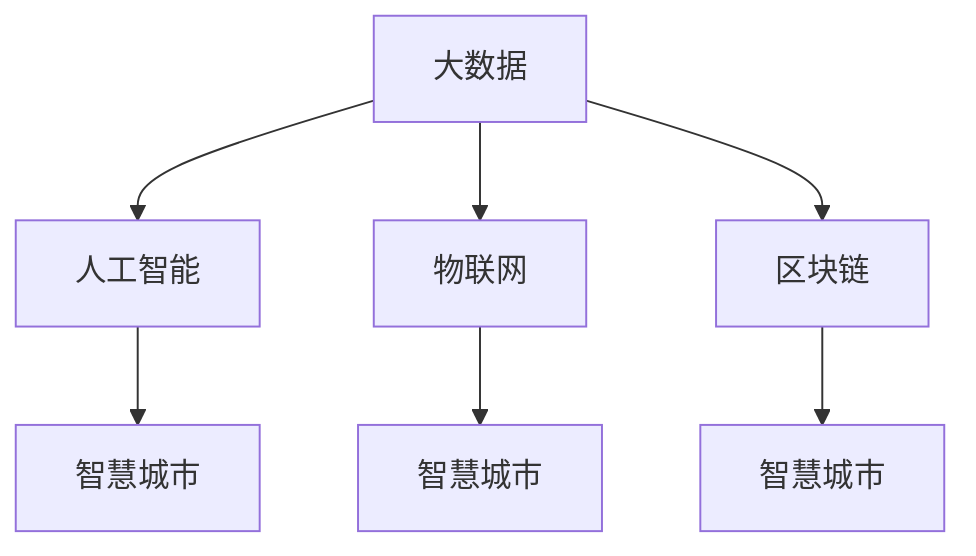

                 

# 科技创新：社会治理的新思路

在快速发展的数字化时代，科技已经成为推动社会进步的重要动力。科技不仅改变了我们的生产方式，也重塑了社会的治理模式。本文旨在探讨科技创新在社会治理中的新思路，分析其对治理结构的优化，并展望未来发展的趋势和挑战。

## 1. 背景介绍

### 1.1 科技与社会治理的演变
传统社会治理模式主要依赖于人力、政策和法律等手段，以解决社会问题，维护社会稳定。然而，随着信息技术的发展，社会治理的方式逐渐发生了变化。科技的引入，尤其是大数据、人工智能、区块链等新兴技术的出现，为社会治理提供了新的可能性。

### 1.2 科技创新对社会治理的影响
科技创新使得数据收集、存储、分析更加高效，为社会治理提供了丰富、实时的信息支持。例如，大数据分析可以预测和预防犯罪，提升公共安全；人工智能辅助决策可以优化资源分配，提高服务效率；区块链技术可以保证数据的透明和不可篡改，增强治理的公信力。

## 2. 核心概念与联系

### 2.1 核心概念概述

为更好地理解科技创新对社会治理的影响，本节将介绍几个密切相关的核心概念：

- **大数据(Big Data)**：指的是体量大、类型多样、速度快且价值密度低的数据集。通过大数据分析，可以发现数据中的规律，辅助决策。

- **人工智能(Artificial Intelligence, AI)**：模拟人类智能的计算和行为的技术。在社会治理中，AI可以自动化处理海量数据，提供高效的决策支持。

- **区块链(Blockchain)**：一种分布式账本技术，通过加密和去中心化方式确保数据的透明和不可篡改，为社会治理提供信任基础。

- **物联网(Internet of Things, IoT)**：将传感器、智能设备等连接到互联网，实现信息的实时采集和传递。

- **智慧城市(Smart City)**：利用先进的信息技术，提供高效、便捷、智能的城市管理和服务。

这些核心概念之间的逻辑关系可以通过以下Mermaid流程图来展示：



这个流程图展示了大数据、人工智能、物联网和区块链在社会治理中的应用场景：

1. 大数据和人工智能结合，可以提供更精准的社会治理决策。
2. 物联网技术实现了数据的实时采集，提高了城市管理的效率。
3. 区块链技术保证了数据的透明和不可篡改，增强了社会治理的公信力。

## 3. 核心算法原理 & 具体操作步骤

### 3.1 算法原理概述

社会治理的科技创新，其核心原理在于数据驱动和智能决策。通过收集、分析和应用数据，可以实现更高效的治理和管理。以下是大数据和人工智能在社会治理中的核心算法原理：

**大数据分析**：利用统计学、机器学习等方法，从大数据中提取有用的信息和模式，为决策提供依据。例如，通过分析交通流量数据，可以优化交通信号灯设置，减少拥堵。

**机器学习**：通过算法训练模型，使其能够自动从数据中学习规律，预测未来趋势。在犯罪预测、灾害预警等领域，机器学习模型可以提供高效的决策支持。

### 3.2 算法步骤详解

以智慧城市中的交通流量预测为例，大数据和机器学习的算法步骤如下：

**Step 1: 数据收集与处理**
- 收集城市交通流量数据，包括实时车速、车流量、道路拥堵情况等。
- 对数据进行清洗、整合和格式化，确保数据的质量和一致性。

**Step 2: 特征工程**
- 提取交通流量的关键特征，如时间、路段、天气条件等。
- 利用降维、归一化等技术，提高特征的表示能力。

**Step 3: 模型训练**
- 选择合适的机器学习算法，如回归模型、时间序列模型等。
- 利用历史数据训练模型，使其能够预测未来交通流量。

**Step 4: 模型评估与优化**
- 在验证集上评估模型的预测准确度，优化模型参数。
- 使用交叉验证等技术，确保模型泛化能力。

**Step 5: 模型应用**
- 将训练好的模型集成到城市交通管理系统中，提供交通流量预测功能。
- 结合实时数据，动态调整交通信号灯，优化交通流量。

### 3.3 算法优缺点

大数据和机器学习在社会治理中的应用具有以下优点：

- 提高决策效率：通过大数据和机器学习，可以快速分析海量数据，发现规律和趋势，辅助决策。
- 增强治理能力：数据驱动的治理方式，可以精准定位问题，优化资源配置，提高治理效果。

然而，这些技术也存在一些缺点：

- 数据隐私问题：大规模数据收集和使用，可能涉及隐私保护和数据安全问题。
- 算法透明性：机器学习模型的决策过程往往复杂，难以解释和理解，可能影响治理的透明性和公信力。
- 数据质量问题：数据质量不高的数据，可能影响模型效果，甚至导致错误的决策。

### 3.4 算法应用领域

大数据和机器学习在社会治理中的应用领域非常广泛，包括但不限于以下几个方面：

- **公共安全**：通过分析犯罪数据，预测和预防犯罪，提升公共安全。
- **城市管理**：优化交通流量、能源分配、环境保护等城市管理任务，提升城市运行效率。
- **社会服务**：提供精准的社区服务，如垃圾分类、健康管理、教育等。
- **灾害预警**：通过分析气象、地质等数据，预警自然灾害，减少损失。
- **环境监测**：监测空气、水质等环境指标，保护生态环境。

## 4. 数学模型和公式 & 详细讲解 & 举例说明

### 4.1 数学模型构建

本节将使用数学语言对大数据和机器学习在社会治理中的应用进行更加严格的刻画。

假设有一组交通流量数据 $\{x_i\}_{i=1}^N$，其中 $x_i$ 为第 $i$ 时刻的交通流量。设 $y_i$ 为第 $i$ 时刻的预测流量，模型的目标是找到最优的函数 $f(x)$，使得预测误差最小化：

$$
\min_{f(x)} \sum_{i=1}^N (y_i - f(x_i))^2
$$

其中 $f(x)$ 为交通流量预测模型，一般使用时间序列模型或回归模型。

### 4.2 公式推导过程

以下以线性回归模型为例，推导其预测函数：

设 $x_i = (t_i, w_i)$，其中 $t_i$ 为时间，$w_i$ 为其他特征（如天气、节假日等）。假设 $y_i$ 与 $x_i$ 之间的关系为线性：

$$
y_i = \beta_0 + \beta_1 t_i + \beta_2 w_i + \epsilon_i
$$

其中 $\beta_0, \beta_1, \beta_2$ 为模型参数，$\epsilon_i$ 为误差项。

根据最小二乘法，可以得到模型参数的估计值：

$$
\hat{\beta} = (X^TX)^{-1}X^Ty
$$

其中 $X = \begin{bmatrix} 1 & t_1 & w_{1,1} \\ 1 & t_2 & w_{2,1} \\ \vdots & \vdots & \vdots \\ 1 & t_N & w_{N,1} \end{bmatrix}$。

在实际应用中，还需要考虑模型的泛化能力，通过交叉验证等技术进行模型评估和选择。

### 4.3 案例分析与讲解

以某城市交通流量预测为例，假设收集到历史交通流量数据，并提取时间、天气等特征。通过线性回归模型进行训练，得到预测函数：

$$
\hat{y} = \beta_0 + \beta_1 t + \beta_2 w + \epsilon
$$

其中 $\beta_0, \beta_1, \beta_2$ 为模型参数，$w$ 为天气条件，$t$ 为时间。

将模型应用于未来某一时刻 $t'$ 的预测：

$$
\hat{y_{t'}} = \beta_0 + \beta_1 t' + \beta_2 w_{t'}
$$

根据预测结果，调整交通信号灯设置，优化交通流量。

## 5. 项目实践：代码实例和详细解释说明

### 5.1 开发环境搭建

在进行交通流量预测的微调实践前，我们需要准备好开发环境。以下是使用Python进行PyTorch开发的环境配置流程：

1. 安装Anaconda：从官网下载并安装Anaconda，用于创建独立的Python环境。

2. 创建并激活虚拟环境：
```bash
conda create -n traffic-prediction python=3.8 
conda activate traffic-prediction
```

3. 安装PyTorch：根据CUDA版本，从官网获取对应的安装命令。例如：
```bash
conda install pytorch torchvision torchaudio cudatoolkit=11.1 -c pytorch -c conda-forge
```

4. 安装Pandas、Numpy等工具包：
```bash
pip install pandas numpy
```

完成上述步骤后，即可在`traffic-prediction`环境中开始微调实践。

### 5.2 源代码详细实现

下面我们以线性回归模型为例，给出使用PyTorch进行交通流量预测的完整代码实现。

```python
import torch
import torch.nn as nn
import torch.optim as optim
import pandas as pd
import numpy as np

# 加载数据
data = pd.read_csv('traffic_data.csv')
X = data[['time', 'weather']].to_numpy()
y = data['traffic'].to_numpy()

# 数据标准化
X_mean = np.mean(X, axis=0)
X_std = np.std(X, axis=0)
X = (X - X_mean) / X_std

# 划分训练集和验证集
train_ratio = 0.8
split_idx = int(len(X) * train_ratio)
X_train, X_valid = X[:split_idx], X[split_idx:]
y_train, y_valid = y[:split_idx], y[split_idx:]

# 定义模型
class LinearRegression(nn.Module):
    def __init__(self, input_dim, output_dim):
        super(LinearRegression, self).__init__()
        self.linear = nn.Linear(input_dim, output_dim)
    
    def forward(self, x):
        return self.linear(x)

# 定义损失函数和优化器
model = LinearRegression(input_dim=2, output_dim=1)
criterion = nn.MSELoss()
optimizer = optim.SGD(model.parameters(), lr=0.01)

# 训练模型
epochs = 100
for epoch in range(epochs):
    optimizer.zero_grad()
    predictions = model(X_train)
    loss = criterion(predictions, y_train)
    loss.backward()
    optimizer.step()
    print(f"Epoch {epoch+1}, loss: {loss:.3f}")

# 评估模型
predictions_valid = model(X_valid)
mse = np.mean((y_valid - predictions_valid.squeeze())**2)
print(f"Validation MSE: {mse:.3f}")
```

以上代码实现了使用线性回归模型进行交通流量预测的完整流程。可以看到，通过Pandas和Numpy处理数据，使用PyTorch定义和训练模型，代码实现简洁高效。

### 5.3 代码解读与分析

让我们再详细解读一下关键代码的实现细节：

**数据处理**：
- 使用Pandas读取数据，并进行数据标准化，以提高模型训练的稳定性和收敛速度。
- 将数据集划分为训练集和验证集，用于模型训练和评估。

**模型定义**：
- 使用PyTorch的nn.Module定义线性回归模型，包括输入特征和输出层。
- 在模型的forward方法中，使用线性层进行预测。

**训练过程**：
- 使用MSELoss定义均方误差损失函数，用于评估模型预测误差。
- 使用SGD优化器进行梯度下降，更新模型参数。
- 在每个epoch结束后，打印当前损失值。

**模型评估**：
- 在验证集上评估模型的预测误差，使用均方误差作为评估指标。

可以看到，通过Pandas和PyTorch，可以方便地实现模型的数据处理、定义、训练和评估。

## 6. 实际应用场景

### 6.1 智慧城市交通管理

交通流量预测在智慧城市中具有重要的应用价值。通过预测交通流量，可以优化交通信号灯设置，减少交通拥堵，提升城市运行效率。

在实际应用中，可以将交通流量预测模型集成到智慧城市交通管理系统中，提供实时交通流量预测功能。根据预测结果，系统可以自动调整交通信号灯设置，优化交通流量，提高城市交通的运行效率和安全性。

### 6.2 公共安全犯罪预防

大数据和机器学习在公共安全领域也具有广泛的应用。通过分析犯罪数据，可以预测犯罪发生的可能性，提前采取预防措施。

例如，通过分析历史犯罪数据，可以发现某些区域的犯罪趋势和模式。根据这些模式，预测未来某一时间段的犯罪风险，提前部署警力，降低犯罪率。此外，通过社交媒体和网络数据，可以监测社会情绪，预测群体性事件，提前采取应对措施，维护社会稳定。

### 6.3 社会服务精准帮扶

社会服务领域也需要大数据和机器学习来提供精准的服务。通过分析居民的社会经济数据，可以识别出需要帮助的群体，提供针对性的服务。

例如，通过分析居民的健康数据、教育数据、就业数据等，可以识别出需要医疗援助、教育辅导、就业帮扶的群体。根据不同群体的需求，提供定制化的服务，提高社会服务的效果。此外，通过分析社会服务的效果，可以不断优化服务策略，提升社会服务的覆盖率和满意度。

## 7. 工具和资源推荐

### 7.1 学习资源推荐

为了帮助开发者系统掌握大数据和机器学习在社会治理中的应用，这里推荐一些优质的学习资源：

1. 《Python数据科学手册》：涵盖Python在数据处理、数据分析、机器学习等领域的应用，适合初学者入门。

2. 《深度学习》课程：斯坦福大学开设的深度学习课程，深入浅出地介绍了深度学习的基本概念和算法。

3. Kaggle竞赛平台：提供大量数据集和竞赛任务，通过实际项目锻炼机器学习技能。

4. Coursera、edX等在线课程平台：提供大量免费和付费的机器学习课程，覆盖从入门到进阶的各个层次。

5. GitHub代码库：通过阅读和复现开源项目，了解机器学习在实际应用中的实现。

通过对这些资源的学习实践，相信你一定能够快速掌握大数据和机器学习在社会治理中的应用。

### 7.2 开发工具推荐

高效的开发离不开优秀的工具支持。以下是几款用于大数据和机器学习开发的常用工具：

1. PyTorch：基于Python的开源深度学习框架，灵活动态的计算图，适合快速迭代研究。大部分机器学习模型都有PyTorch版本的实现。

2. TensorFlow：由Google主导开发的开源深度学习框架，生产部署方便，适合大规模工程应用。同样有丰富的机器学习模型资源。

3. Scikit-learn：Python的机器学习库，提供简单易用的机器学习算法和工具。

4. Jupyter Notebook：交互式的开发环境，支持Python代码和数据处理，方便研究和分享。

5. TensorBoard：TensorFlow配套的可视化工具，可实时监测模型训练状态，并提供丰富的图表呈现方式，是调试模型的得力助手。

6. Apache Spark：大数据处理框架，支持分布式计算和数据处理，适合处理大规模数据集。

合理利用这些工具，可以显著提升大数据和机器学习任务的开发效率，加快创新迭代的步伐。

### 7.3 相关论文推荐

大数据和机器学习在社会治理中的应用源于学界的持续研究。以下是几篇奠基性的相关论文，推荐阅读：

1. 《Big Data: A Revolution That Will Transform How We Live, Work, and Think》：探讨大数据对社会治理的革命性影响。

2. 《Predicting Urban Traffic Flow Based on Long Short-Term Memory Neural Network》：提出基于LSTM的交通流量预测模型，提高预测准确度。

3. 《Crime Prediction Using Machine Learning: A Review》：回顾了机器学习在犯罪预测中的应用，分析了不同算法的性能。

4. 《Machine Learning Applications in Social Security: A Survey》：介绍了机器学习在社会保障领域的应用，包括医疗、福利、就业等。

5. 《Blockchain: A Survey》：回顾了区块链技术的原理和应用，探讨其在社会治理中的应用潜力。

这些论文代表了大数据和机器学习在社会治理中的应用发展脉络。通过学习这些前沿成果，可以帮助研究者把握学科前进方向，激发更多的创新灵感。

## 8. 总结：未来发展趋势与挑战

### 8.1 总结

本文对大数据和机器学习在社会治理中的应用进行了全面系统的介绍。首先阐述了社会治理中科技创新的重要性，明确了大数据和机器学习在提高治理效率、优化资源配置方面的独特价值。其次，从原理到实践，详细讲解了大数据和机器学习在社会治理中的应用，给出了实际应用中的代码实例和详细解释。

通过本文的系统梳理，可以看到，大数据和机器学习为社会治理提供了新的思路和方法，极大地提升了治理的效率和效果。未来，伴随技术的发展和应用场景的拓展，社会治理的智能化水平还将进一步提升。

### 8.2 未来发展趋势

展望未来，大数据和机器学习在社会治理中的应用将呈现以下几个发展趋势：

1. **数据治理**：随着数据量的激增，数据的治理和质量管理将变得更加重要。通过数据清洗、去重、标注等手段，提高数据的质量和可用性。

2. **算法优化**：随着算法的不断进步，大数据和机器学习模型的性能将进一步提升。更加高效的算法，如深度强化学习、联邦学习等，将应用于社会治理中。

3. **多模态融合**：社会治理需要整合多种数据源，如文本、图像、语音等。通过多模态数据的融合，可以更全面地理解社会现象，提高治理的精准度。

4. **隐私保护**：数据隐私和安全问题是社会治理中必须重视的问题。通过数据加密、匿名化等技术，保护数据隐私，增强治理的透明度和公信力。

5. **智能决策支持**：大数据和机器学习将与决策支持系统结合，为决策者提供更全面、准确的信息支持。通过智能决策，提高治理的效率和效果。

6. **边缘计算**：随着物联网设备的普及，数据的采集和处理将更加分散。边缘计算技术可以将数据处理和决策支持系统部署到设备端，提高处理效率和响应速度。

以上趋势凸显了大数据和机器学习在社会治理中的广阔前景。这些方向的探索发展，必将进一步提升社会治理的智能化水平，为构建更加公平、高效、安全的社会治理体系铺平道路。

### 8.3 面临的挑战

尽管大数据和机器学习在社会治理中的应用取得了显著成果，但在迈向更加智能化、普适化应用的过程中，仍面临诸多挑战：

1. **数据隐私问题**：大规模数据收集和使用，可能涉及隐私保护和数据安全问题。如何保护个人隐私，防止数据滥用，是未来需要解决的重要问题。

2. **算法透明性**：机器学习模型的决策过程往往复杂，难以解释和理解，可能影响治理的透明性和公信力。如何提高算法的透明性和可解释性，是未来研究的重要方向。

3. **数据质量问题**：数据质量不高的数据，可能影响模型效果，甚至导致错误的决策。如何提高数据质量，确保数据的准确性和一致性，是未来研究的重点。

4. **资源消耗问题**：大数据和机器学习模型对计算资源的需求较高，如何降低计算成本，提高模型效率，是未来需要解决的问题。

5. **公平性问题**：数据和算法可能存在偏见，影响治理的公平性。如何消除偏见，确保治理的公正性，是未来研究的重要方向。

6. **伦理道德问题**：机器学习模型可能存在伦理道德风险，如决策不公、隐私泄露等。如何从伦理道德角度规范模型的使用，是未来研究的重要课题。

### 8.4 研究展望

面向未来，大数据和机器学习在社会治理中的应用还需要在以下几个方面进行深入研究：

1. **联邦学习**：通过分布式学习技术，实现数据本地化，保护数据隐私。

2. **边缘计算**：将数据处理和决策支持系统部署到设备端，提高处理效率和响应速度。

3. **多模态融合**：整合多种数据源，实现视觉、语音、文本等多种数据的协同处理。

4. **公平性研究**：研究如何消除数据和算法的偏见，确保治理的公正性。

5. **隐私保护**：研究数据加密、匿名化等技术，保护数据隐私，增强治理的透明度和公信力。

6. **伦理道德**：研究如何从伦理道德角度规范机器学习模型的使用，确保其应用的安全性和可解释性。

这些研究方向的探索，必将引领大数据和机器学习在社会治理中的应用走向更高的台阶，为构建安全、可靠、可解释、可控的智能系统铺平道路。面向未来，大数据和机器学习技术还需要与其他人工智能技术进行更深入的融合，如知识表示、因果推理、强化学习等，多路径协同发力，共同推动社会治理的进步。只有勇于创新、敢于突破，才能不断拓展社会治理的边界，让智能化技术更好地造福人类社会。

## 9. 附录：常见问题与解答

**Q1: 大数据和机器学习在社会治理中主要应用有哪些？**

A: 大数据和机器学习在社会治理中的主要应用包括：

1. 交通流量预测和交通管理。通过分析交通流量数据，优化交通信号灯设置，提高城市交通运行效率。

2. 犯罪预测和预防。通过分析历史犯罪数据，预测犯罪发生的可能性，提前采取预防措施。

3. 公共安全监测。通过监测社交媒体和网络数据，预测群体性事件，提前采取应对措施。

4. 精准帮扶。通过分析居民的社会经济数据，识别需要帮助的群体，提供针对性的服务。

5. 环境监测。通过分析环境数据，预测和预防自然灾害，保护生态环境。

6. 智能决策支持。通过大数据和机器学习，辅助决策者进行智能决策，提高治理效果。

**Q2: 如何提高机器学习模型的透明性和可解释性？**

A: 提高机器学习模型的透明性和可解释性，是未来研究的重要方向。以下是几种常见的方法：

1. 模型可解释性工具：使用如SHAP、LIME等工具，生成模型的局部特征解释，帮助理解模型的决策过程。

2. 可视化技术：通过绘制特征重要性、模型结构等，直观展示模型的复杂性和决策依据。

3. 可解释性算法：使用可解释性强的算法，如决策树、线性模型等，降低模型的复杂度，提高可解释性。

4. 数据可视化：通过可视化数据分布和特征关系，帮助理解数据特征和模型行为。

5. 用户交互界面：设计友好的用户界面，提供模型解释和反馈，帮助用户理解模型的输出。

这些方法可以结合使用，提高机器学习模型的透明性和可解释性，增强治理的透明性和公信力。

**Q3: 数据质量问题如何解决？**

A: 提高数据质量，是机器学习模型效果提升的关键。以下是几种常见的方法：

1. 数据清洗：去除数据中的异常值、缺失值等，确保数据的一致性和完整性。

2. 数据标注：对数据进行人工标注，确保标签的正确性和一致性。

3. 数据增强：通过数据增强技术，生成更多的训练数据，提高模型的泛化能力。

4. 数据融合：整合多个数据源，提高数据的多样性和丰富性。

5. 数据预处理：使用数据标准化、归一化等技术，提高数据的质量和可用性。

6. 数据监控：实时监测数据质量，及时发现和纠正数据问题。

通过以上方法，可以确保数据的质量和可用性，提高机器学习模型的效果和性能。

---

作者：禅与计算机程序设计艺术 / Zen and the Art of Computer Programming

