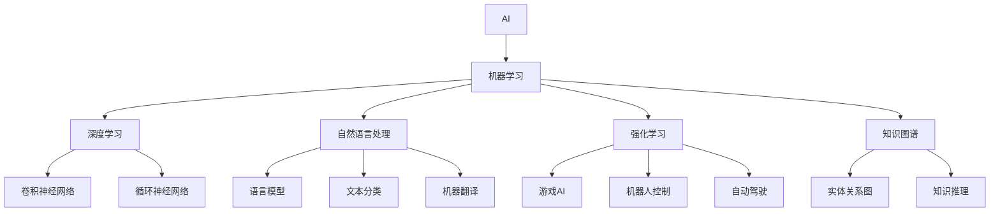

                 

# 科技创新：社会进步的阶梯

## 1. 背景介绍

科技创新是推动社会进步的重要动力。在历史长河中，每一次科技革命都极大地改变了人类的生产方式、生活方式，甚至是思维模式。从蒸汽机的发明到电力应用的普及，再到互联网的广泛应用，科技的发展始终沿着一条曲曲折折但总体上升的路径前进。

当前，我们正处于一个全新的科技时代——人工智能(AI)和机器学习(ML)技术的迅猛发展，正在深刻地改变世界。这些技术在各个领域的应用，带来了前所未有的效率提升和创新可能。本文将深入探讨AI和ML技术的核心概念、算法原理、实践步骤，以及它们在实际应用场景中的表现和未来发展方向。

## 2. 核心概念与联系

### 2.1 核心概念概述

科技创新不仅仅是技术的进步，更是技术和应用的结合。以下是几个与AI和ML密切相关的核心概念：

- **人工智能(AI)**：指模拟人类智能行为的技术，包括感知、理解、推理、学习、决策等能力。AI的应用范围广泛，涵盖了计算机视觉、自然语言处理、语音识别、机器人学等领域。
- **机器学习(ML)**：指通过数据驱动的方法，让机器具备学习能力，通过算法自动优化模型参数，提高模型性能。机器学习可以分为监督学习、无监督学习、半监督学习和强化学习等多种类型。
- **深度学习(Deep Learning)**：是机器学习的一个分支，使用多层次神经网络进行建模和预测。深度学习在图像识别、语音识别、自然语言处理等任务中取得了显著的进展。
- **自然语言处理(NLP)**：指让机器理解和生成人类语言的技术，是AI的一个重要应用方向。NLP涉及语言模型的构建、文本分类、情感分析、机器翻译、对话系统等多个子领域。
- **强化学习(Reinforcement Learning)**：通过与环境的交互，让机器在不断的试错中学习最优策略。强化学习常用于游戏策略、机器人控制、自动驾驶等领域。
- **知识图谱(Knowledge Graph)**：通过图形结构对实体和关系进行建模，帮助机器理解复杂的知识结构，广泛应用于信息检索、推荐系统、知识推理等领域。

这些核心概念之间相互关联，共同构建起现代AI和ML技术的生态体系。本文将重点介绍AI和ML的核心技术，探讨其在实际应用中的表现和未来发展趋势。

### 2.2 核心概念原理和架构的 Mermaid 流程图



这个流程图展示了AI和ML技术的主要分支及其应用方向。深度学习是机器学习的核心技术之一，而自然语言处理则是AI的一个热点领域，强化学习则在机器人控制、自动驾驶等领域有着广泛的应用，知识图谱则为复杂的知识建模提供了新的思路。

## 3. 核心算法原理 & 具体操作步骤

### 3.1 算法原理概述

AI和ML的核心算法原理主要包括监督学习、无监督学习、强化学习等。这里以深度学习为例，介绍其基本原理和操作步骤。

深度学习模型通过多层次的非线性变换，能够捕捉数据中的复杂结构。其基本框架包括输入层、多个隐藏层和输出层。每个隐藏层由多个神经元组成，通过前向传播计算，生成一个向量表示。反向传播算法根据输出与真实标签的误差，反向更新神经元权重，优化模型性能。

深度学习模型主要通过监督学习进行训练。给定训练集 $\{(x_i,y_i)\}_{i=1}^N$，其中 $x_i$ 为输入数据，$y_i$ 为输出标签，模型的目标是学习一个函数 $f(x;\theta)$，使得 $f(x;\theta)$ 在训练集上最小化损失函数 $L(f(x;\theta),y_i)$，进而泛化到未见过的测试数据集上。

### 3.2 算法步骤详解

深度学习的训练过程包括以下几个关键步骤：

**Step 1: 数据预处理**

数据预处理是深度学习模型的第一步，包括数据清洗、归一化、分词、标签编码等。例如，在自然语言处理任务中，需要先将文本数据进行分词、去停用词、构建词汇表等预处理，将其转化为模型可处理的向量形式。

**Step 2: 模型构建**

模型构建是深度学习模型的核心步骤，包括选择网络结构、设置超参数、初始化权重等。常用的深度学习模型包括卷积神经网络(CNN)、循环神经网络(RNN)、长短时记忆网络(LSTM)、Transformer等。

**Step 3: 前向传播**

前向传播是将输入数据输入模型，逐层计算生成中间向量表示的过程。例如，在Transformer模型中，输入序列经过多个自注意力和前向神经网络层，最终生成一个向量表示。

**Step 4: 损失计算**

损失计算是根据输出向量与真实标签的误差，计算模型预测结果与实际结果之间的差距。例如，在分类任务中，使用交叉熵损失函数计算模型预测值与真实标签之间的差距。

**Step 5: 反向传播**

反向传播是根据损失函数，反向计算模型中每个参数的梯度，更新参数值，优化模型性能。反向传播算法通过链式法则，计算每个神经元的梯度，并更新权重和偏置。

**Step 6: 模型评估**

模型评估是在测试集上评估模型性能的过程。例如，在分类任务中，使用准确率、精确率、召回率等指标评估模型预测结果的准确性和泛化能力。

### 3.3 算法优缺点

深度学习的优点包括：

- **自适应能力**：通过学习数据特征，深度学习模型能够自动提取数据中的复杂结构。
- **泛化能力**：深度学习模型具有较强的泛化能力，能够应用于多种任务和领域。
- **端到端学习**：深度学习模型能够自动学习输入与输出之间的映射关系，无需手动设计特征。

然而，深度学习也存在一些缺点：

- **计算资源消耗大**：深度学习模型参数量庞大，需要大量的计算资源进行训练和推理。
- **过拟合风险高**：深度学习模型容易过拟合，尤其是当数据量较小或模型过于复杂时。
- **模型可解释性差**：深度学习模型通常被称为"黑盒"，难以解释其内部的决策过程。

### 3.4 算法应用领域

深度学习在各个领域都得到了广泛应用，以下是一些主要应用领域：

- **计算机视觉**：在图像分类、目标检测、图像生成等任务中，深度学习模型取得了显著进展。
- **自然语言处理**：在语言建模、文本分类、机器翻译、对话系统等任务中，深度学习模型表现出色。
- **语音识别**：在语音识别、语音合成、语音情感分析等任务中，深度学习模型也取得了重要进展。
- **机器人学**：在机器人视觉、导航、控制等任务中，深度学习模型提供了强大的支持。
- **自动驾驶**：在自动驾驶、场景感知、路径规划等任务中，深度学习模型被广泛应用。

## 4. 数学模型和公式 & 详细讲解 & 举例说明

### 4.1 数学模型构建

深度学习模型的数学模型通常包括输入层、隐藏层和输出层。假设输入数据为 $x \in \mathbb{R}^d$，输出数据为 $y \in \mathbb{R}^k$，模型参数为 $\theta$，其中 $\theta = \{\theta_1,\theta_2,\ldots,\theta_n\}$。模型的前向传播过程为：

$$
f(x;\theta) = \sigma(W_l f(x;\theta_{l-1}) + b_l)
$$

其中 $f(x;\theta_0) = x$，$W_l$ 和 $b_l$ 分别为第 $l$ 层的权重和偏置，$\sigma$ 为激活函数。

### 4.2 公式推导过程

以一个简单的神经网络为例，其训练过程如下：

- 前向传播：将输入数据 $x$ 输入网络，逐层计算生成输出 $y$。
- 损失计算：计算预测输出 $y$ 与真实标签 $y^*$ 的误差，例如使用均方误差损失函数。
- 反向传播：根据误差，反向计算每个神经元的梯度，更新权重和偏置。
- 模型评估：在测试集上评估模型性能，例如使用准确率、精确率、召回率等指标。

以一个简单的二分类任务为例，假设模型参数为 $W_1, b_1, W_2, b_2$，输入数据为 $x \in \mathbb{R}^d$，输出数据为 $y \in \{0,1\}$，模型函数为：

$$
f(x;\theta) = \sigma(W_2 \sigma(W_1 x + b_1) + b_2)
$$

其中 $\sigma$ 为激活函数，例如 ReLU 或 sigmoid。

训练过程中，模型通过前向传播计算输出 $y$，损失函数为二元交叉熵损失：

$$
L(f(x;\theta),y) = -(y \log f(x;\theta) + (1-y) \log (1-f(x;\theta)))
$$

反向传播算法计算每个神经元的梯度，更新参数 $W_1, b_1, W_2, b_2$，使其在训练集上最小化损失函数 $L$。

### 4.3 案例分析与讲解

以一个简单的文本分类任务为例，使用BERT模型进行微调。BERT模型是一个双向 Transformer 模型，具有很强的语言表示能力。其训练过程如下：

- 数据预处理：将文本数据分词、去停用词、构建词汇表等预处理。
- 模型构建：使用预训练的 BERT 模型作为基础，添加任务适配层，例如全连接层和 softmax 层。
- 前向传播：将输入数据输入 BERT 模型，得到词向量表示，再经过适配层生成分类结果。
- 损失计算：使用交叉熵损失函数计算预测结果与真实标签的误差。
- 反向传播：根据误差，反向计算 BERT 模型和适配层的参数，更新模型参数。
- 模型评估：在测试集上评估模型性能，例如使用准确率、精确率、召回率等指标。

## 5. 项目实践：代码实例和详细解释说明

### 5.1 开发环境搭建

在进行深度学习项目实践前，需要准备好开发环境。以下是使用 Python 进行 PyTorch 开发的环境配置流程：

1. 安装 Anaconda：从官网下载并安装 Anaconda，用于创建独立的 Python 环境。

2. 创建并激活虚拟环境：
```bash
conda create -n pytorch-env python=3.8 
conda activate pytorch-env
```

3. 安装 PyTorch：根据 CUDA 版本，从官网获取对应的安装命令。例如：
```bash
conda install pytorch torchvision torchaudio cudatoolkit=11.1 -c pytorch -c conda-forge
```

4. 安装 Transformers 库：
```bash
pip install transformers
```

5. 安装各类工具包：
```bash
pip install numpy pandas scikit-learn matplotlib tqdm jupyter notebook ipython
```

完成上述步骤后，即可在 `pytorch-env` 环境中开始项目实践。

### 5.2 源代码详细实现

下面我们以文本分类任务为例，给出使用 Transformers 库对 BERT 模型进行微调的 PyTorch 代码实现。

首先，定义文本分类任务的数据处理函数：

```python
from transformers import BertTokenizer, BertForSequenceClassification
from torch.utils.data import Dataset
import torch

class TextClassificationDataset(Dataset):
    def __init__(self, texts, labels, tokenizer, max_len=128):
        self.texts = texts
        self.labels = labels
        self.tokenizer = tokenizer
        self.max_len = max_len
        
    def __len__(self):
        return len(self.texts)
    
    def __getitem__(self, item):
        text = self.texts[item]
        label = self.labels[item]
        
        encoding = self.tokenizer(text, return_tensors='pt', max_length=self.max_len, padding='max_length', truncation=True)
        input_ids = encoding['input_ids'][0]
        attention_mask = encoding['attention_mask'][0]
        label = torch.tensor(label, dtype=torch.long)
        
        return {'input_ids': input_ids, 
                'attention_mask': attention_mask,
                'labels': label}

# 标签与id的映射
label2id = {'positive': 1, 'negative': 0}
id2label = {v: k for k, v in label2id.items()}

# 创建dataset
tokenizer = BertTokenizer.from_pretrained('bert-base-cased')

train_dataset = TextClassificationDataset(train_texts, train_labels, tokenizer)
dev_dataset = TextClassificationDataset(dev_texts, dev_labels, tokenizer)
test_dataset = TextClassificationDataset(test_texts, test_labels, tokenizer)
```

然后，定义模型和优化器：

```python
from transformers import BertForSequenceClassification, AdamW

model = BertForSequenceClassification.from_pretrained('bert-base-cased', num_labels=len(label2id))

optimizer = AdamW(model.parameters(), lr=2e-5)
```

接着，定义训练和评估函数：

```python
from torch.utils.data import DataLoader
from tqdm import tqdm
from sklearn.metrics import accuracy_score

device = torch.device('cuda') if torch.cuda.is_available() else torch.device('cpu')
model.to(device)

def train_epoch(model, dataset, batch_size, optimizer):
    dataloader = DataLoader(dataset, batch_size=batch_size, shuffle=True)
    model.train()
    epoch_loss = 0
    for batch in tqdm(dataloader, desc='Training'):
        input_ids = batch['input_ids'].to(device)
        attention_mask = batch['attention_mask'].to(device)
        labels = batch['labels'].to(device)
        model.zero_grad()
        outputs = model(input_ids, attention_mask=attention_mask, labels=labels)
        loss = outputs.loss
        epoch_loss += loss.item()
        loss.backward()
        optimizer.step()
    return epoch_loss / len(dataloader)

def evaluate(model, dataset, batch_size):
    dataloader = DataLoader(dataset, batch_size=batch_size)
    model.eval()
    preds, labels = [], []
    with torch.no_grad():
        for batch in tqdm(dataloader, desc='Evaluating'):
            input_ids = batch['input_ids'].to(device)
            attention_mask = batch['attention_mask'].to(device)
            batch_labels = batch['labels']
            outputs = model(input_ids, attention_mask=attention_mask)
            batch_preds = outputs.logits.argmax(dim=1).to('cpu').tolist()
            batch_labels = batch_labels.to('cpu').tolist()
            for pred, label in zip(batch_preds, batch_labels):
                preds.append(pred)
                labels.append(label)
                
    print(f"Accuracy: {accuracy_score(labels, preds):.2f}")
```

最后，启动训练流程并在测试集上评估：

```python
epochs = 5
batch_size = 16

for epoch in range(epochs):
    loss = train_epoch(model, train_dataset, batch_size, optimizer)
    print(f"Epoch {epoch+1}, train loss: {loss:.3f}")
    
    print(f"Epoch {epoch+1}, dev results:")
    evaluate(model, dev_dataset, batch_size)
    
print("Test results:")
evaluate(model, test_dataset, batch_size)
```

以上就是使用 PyTorch 对 BERT 进行文本分类任务微调的完整代码实现。可以看到，得益于 Transformers 库的强大封装，我们可以用相对简洁的代码完成 BERT 模型的加载和微调。

### 5.3 代码解读与分析

让我们再详细解读一下关键代码的实现细节：

**TextClassificationDataset类**：
- `__init__`方法：初始化文本、标签、分词器等关键组件。
- `__len__`方法：返回数据集的样本数量。
- `__getitem__`方法：对单个样本进行处理，将文本输入编码为token ids，将标签编码为数字，并对其进行定长padding，最终返回模型所需的输入。

**label2id和id2label字典**：
- 定义了标签与数字id之间的映射关系，用于将预测结果解码回真实的标签。

**训练和评估函数**：
- 使用 PyTorch 的 DataLoader 对数据集进行批次化加载，供模型训练和推理使用。
- 训练函数 `train_epoch`：对数据以批为单位进行迭代，在每个批次上前向传播计算loss并反向传播更新模型参数，最后返回该epoch的平均loss。
- 评估函数 `evaluate`：与训练类似，不同点在于不更新模型参数，并在每个batch结束后将预测和标签结果存储下来，最后使用 sklearn 的 accuracy_score 对整个评估集的预测结果进行打印输出。

**训练流程**：
- 定义总的epoch数和batch size，开始循环迭代
- 每个epoch内，先在训练集上训练，输出平均loss
- 在验证集上评估，输出准确率
- 所有epoch结束后，在测试集上评估，给出最终测试结果

可以看到，PyTorch 配合 Transformers 库使得 BERT 微调的代码实现变得简洁高效。开发者可以将更多精力放在数据处理、模型改进等高层逻辑上，而不必过多关注底层的实现细节。

当然，工业级的系统实现还需考虑更多因素，如模型的保存和部署、超参数的自动搜索、更灵活的任务适配层等。但核心的微调范式基本与此类似。

## 6. 实际应用场景

### 6.1 智能客服系统

智能客服系统是一种典型的深度学习应用场景。传统的客服系统需要大量的人力资源，高峰期响应缓慢，且一致性和专业性难以保证。使用深度学习模型进行自然语言处理和对话生成，可以显著提高客服系统的效率和响应速度。

在技术实现上，可以收集企业的历史客服对话记录，将问题和最佳答复构建成监督数据，在此基础上对深度学习模型进行微调。微调后的模型能够自动理解用户意图，匹配最合适的答复，提供自然流畅的对话。对于用户提出的新问题，还可以接入检索系统实时搜索相关内容，动态组织生成回答。如此构建的智能客服系统，能大幅提升客户咨询体验和问题解决效率。

### 6.2 金融舆情监测

金融舆情监测是深度学习在金融领域的重要应用之一。金融机构需要实时监测市场舆论动向，以便及时应对负面信息传播，规避金融风险。传统的舆情监测方式成本高、效率低，难以应对网络时代海量信息爆发的挑战。使用深度学习模型进行文本分类和情感分析，可以在大规模数据上快速识别舆情动向，并及时做出反应。

具体而言，可以收集金融领域相关的新闻、报道、评论等文本数据，并对其进行主题标注和情感标注。在此基础上对深度学习模型进行微调，使其能够自动判断文本属于何种主题，情感倾向是正面、中性还是负面。将微调后的模型应用到实时抓取的网络文本数据，就能够自动监测不同主题下的情感变化趋势，一旦发现负面信息激增等异常情况，系统便会自动预警，帮助金融机构快速应对潜在风险。

### 6.3 个性化推荐系统

个性化推荐系统是深度学习在电商、视频等领域的经典应用。传统的推荐系统往往只依赖用户的历史行为数据进行物品推荐，无法深入理解用户的真实兴趣偏好。使用深度学习模型进行知识表示和关联挖掘，可以更好地挖掘用户行为背后的语义信息，从而提供更精准、多样的推荐内容。

在实践中，可以收集用户浏览、点击、评论、分享等行为数据，提取和用户交互的物品标题、描述、标签等文本内容。将文本内容作为模型输入，用户的后续行为（如是否点击、购买等）作为监督信号，在此基础上微调深度学习模型。微调后的模型能够从文本内容中准确把握用户的兴趣点。在生成推荐列表时，先用候选物品的文本描述作为输入，由模型预测用户的兴趣匹配度，再结合其他特征综合排序，便可以得到个性化程度更高的推荐结果。

### 6.4 未来应用展望

随着深度学习技术的不断进步，其在各个领域的应用将进一步拓展。未来，深度学习技术将在医疗、教育、城市治理等领域带来深刻的变革。

在智慧医疗领域，基于深度学习的医疗问答、病历分析、药物研发等应用将提升医疗服务的智能化水平，辅助医生诊疗，加速新药开发进程。

在智能教育领域，深度学习技术可应用于作业批改、学情分析、知识推荐等方面，因材施教，促进教育公平，提高教学质量。

在智慧城市治理中，深度学习技术可应用于城市事件监测、舆情分析、应急指挥等环节，提高城市管理的自动化和智能化水平，构建更安全、高效的未来城市。

此外，在企业生产、社会治理、文娱传媒等众多领域，深度学习技术也将不断涌现，为传统行业数字化转型升级提供新的技术路径。相信随着技术的日益成熟，深度学习技术将成为各个行业的重要工具，推动经济社会发展进入新的阶段。

## 7. 工具和资源推荐

### 7.1 学习资源推荐

为了帮助开发者系统掌握深度学习技术的理论基础和实践技巧，这里推荐一些优质的学习资源：

1. **《深度学习》（Goodfellow et al.）**：这是一本深度学习的经典教材，涵盖了深度学习的各个方面，适合初学者和进阶学习者。

2. **CS231n《卷积神经网络》课程**：斯坦福大学开设的计算机视觉课程，内容深入浅出，讲解了卷积神经网络的基本原理和应用。

3. **Coursera《机器学习》课程**：由斯坦福大学教授 Andrew Ng 开设的机器学习课程，内容丰富，涵盖监督学习、无监督学习、强化学习等多个方面。

4. **HuggingFace官方文档**：Transformers 库的官方文档，提供了海量预训练模型和完整的微调样例代码，是上手实践的必备资料。

5. **ArXiv 和 Google Scholar**：这些学术资源平台提供了大量的深度学习论文，是了解最新研究成果和进展的重要渠道。

通过对这些资源的学习实践，相信你一定能够快速掌握深度学习技术的精髓，并用于解决实际的工程问题。

### 7.2 开发工具推荐

高效的开发离不开优秀的工具支持。以下是几款用于深度学习开发的常用工具：

1. **PyTorch**：基于 Python 的开源深度学习框架，灵活动态的计算图，适合快速迭代研究。大部分深度学习模型都有 PyTorch 版本的实现。

2. **TensorFlow**：由 Google 主导开发的开源深度学习框架，生产部署方便，适合大规模工程应用。同样有丰富的深度学习模型资源。

3. **Keras**：高层次的深度学习框架，支持多种后端引擎（如 TensorFlow、Theano、CNTK），适合快速原型开发。

4. **JAX**：Google 推出的高性能深度学习框架，支持自动微分、分布式训练等先进特性，是未来深度学习开发的潜在方向。

5. **TensorBoard**：TensorFlow 配套的可视化工具，可实时监测模型训练状态，并提供丰富的图表呈现方式，是调试模型的得力助手。

6. **Weights & Biases**：模型训练的实验跟踪工具，可以记录和可视化模型训练过程中的各项指标，方便对比和调优。与主流深度学习框架无缝集成。

合理利用这些工具，可以显著提升深度学习项目的开发效率，加快创新迭代的步伐。

### 7.3 相关论文推荐

深度学习技术的发展源于学界的持续研究。以下是几篇奠基性的相关论文，推荐阅读：

1. **AlexNet：ImageNet 分类挑战赛冠军**：这是一篇关于卷积神经网络的经典论文，展示了卷积神经网络在图像分类任务中的强大性能。

2. **LSTM：长短期记忆网络**：这是一篇关于循环神经网络的经典论文，展示了循环神经网络在序列建模任务中的优秀表现。

3. **Attention is All You Need**：这是一篇关于 Transformer 模型的经典论文，展示了 Transformer 模型在机器翻译任务中的出色表现。

4. **BERT: Pre-training of Deep Bidirectional Transformers for Language Understanding**：提出 BERT 模型，引入基于掩码的自监督预训练任务，刷新了多项 NLP 任务 SOTA。

5. **GPT-3：语言模型的上限**：展示了 GPT-3 模型的强大 zero-shot 学习能力，引发了对于通用人工智能的新一轮思考。

这些论文代表了大深度学习技术的发展脉络。通过学习这些前沿成果，可以帮助研究者把握学科前进方向，激发更多的创新灵感。

## 8. 总结：未来发展趋势与挑战

### 8.1 研究成果总结

本文对深度学习技术的核心概念、算法原理、实践步骤进行了全面系统的介绍。重点介绍了深度学习在实际应用中的表现和未来发展趋势，探讨了其在智能客服、金融舆情、个性化推荐等场景中的应用。同时，通过推荐相关学习资源、开发工具和论文，力求为读者提供全方位的技术指引。

通过本文的系统梳理，可以看到，深度学习技术在各个领域的应用前景广阔，其带来的效率提升和创新潜力是不可忽视的。从深度学习模型的构建、训练到应用，整个过程都需要开发者具备扎实的基础知识和丰富的实践经验。未来，随着深度学习技术的不断进步，其在更多领域的应用将进一步拓展，为社会进步注入新的动力。

### 8.2 未来发展趋势

深度学习技术的未来发展趋势包括以下几个方向：

1. **模型规模持续增大**：随着算力成本的下降和数据规模的扩张，深度学习模型的参数量还将持续增长。超大规模深度学习模型蕴含的丰富知识，有望支撑更加复杂多变的下游任务。

2. **模型训练效率提升**：开发更加高效的深度学习模型和算法，以缩短训练时间，降低计算资源消耗，提升深度学习模型的应用可行性。

3. **跨领域知识融合**：将符号化的先验知识，如知识图谱、逻辑规则等，与深度学习模型进行巧妙融合，引导模型学习更准确、合理的知识表示。

4. **多模态信息整合**：融合视觉、语音、文本等多种模态数据，增强深度学习模型的泛化能力和适应性。

5. **智能化决策支持**：结合因果分析、强化学习等方法，提高深度学习模型的决策能力和预测准确性。

6. **可解释性和透明度提升**：开发更具可解释性的深度学习模型，提高决策过程的透明度和可理解性，满足不同领域对模型输出的解释需求。

### 8.3 面临的挑战

尽管深度学习技术在各个领域取得了显著进展，但在迈向更加智能化、普适化应用的过程中，它仍面临诸多挑战：

1. **计算资源消耗大**：深度学习模型参数量庞大，需要大量的计算资源进行训练和推理。GPU/TPU 等高性能设备是必不可少的，但即便如此，超大批次的训练和推理也可能遇到显存不足的问题。

2. **过拟合风险高**：深度学习模型容易过拟合，尤其是当数据量较小或模型过于复杂时。如何平衡模型的复杂度和泛化能力，仍需进一步探索。

3. **可解释性差**：深度学习模型通常被称为 "黑盒"，难以解释其内部的决策过程。对于医疗、金融等高风险应用，算法的可解释性和可审计性尤为重要。

4. **安全性有待保障**：深度学习模型难免会学习到有偏见、有害的信息，通过训练传递到下游任务，产生误导性、歧视性的输出，给实际应用带来安全隐患。

5. **知识整合能力不足**：现有的深度学习模型往往局限于数据驱动的学习，难以灵活吸收和运用更广泛的先验知识。如何让模型更好地与外部知识库、规则库等专家知识结合，还需要更多的探索和创新。

### 8.4 研究展望

面对深度学习技术面临的挑战，未来的研究需要在以下几个方面寻求新的突破：

1. **探索无监督和半监督学习范式**：摆脱对大规模标注数据的依赖，利用自监督学习、主动学习等无监督和半监督范式，最大限度利用非结构化数据，实现更加灵活高效的深度学习模型。

2. **研究参数高效和计算高效的深度学习范式**：开发更加参数高效的深度学习模型，在固定大部分深度学习参数的同时，只更新极少量的任务相关参数。同时优化深度学习模型的计算图，减少前向传播和反向传播的资源消耗，实现更加轻量级、实时性的部署。

3. **融合因果分析和强化学习**：通过引入因果推断和强化学习思想，增强深度学习模型建立稳定因果关系的能力，学习更加普适、鲁棒的知识表示，从而提升模型泛化性和抗干扰能力。

4. **引入更多先验知识**：将符号化的先验知识，如知识图谱、逻辑规则等，与深度学习模型进行巧妙融合，引导模型学习更准确、合理的知识表示。同时加强不同模态数据的整合，实现视觉、语音等多模态信息与文本信息的协同建模。

5. **结合因果分析和博弈论工具**：将因果分析方法引入深度学习模型，识别出模型决策的关键特征，增强输出解释的因果性和逻辑性。借助博弈论工具刻画人机交互过程，主动探索并规避模型的脆弱点，提高系统稳定性。

6. **纳入伦理道德约束**：在模型训练目标中引入伦理导向的评估指标，过滤和惩罚有偏见、有害的输出倾向。同时加强人工干预和审核，建立模型行为的监管机制，确保输出符合人类价值观和伦理道德。

这些研究方向的探索，必将引领深度学习技术迈向更高的台阶，为构建安全、可靠、可解释、可控的智能系统铺平道路。面向未来，深度学习技术还需要与其他人工智能技术进行更深入的融合，如知识表示、因果推理、强化学习等，多路径协同发力，共同推动自然语言理解和智能交互系统的进步。只有勇于创新、敢于突破，才能不断拓展深度学习模型的边界，让智能技术更好地造福人类社会。

## 9. 附录：常见问题与解答

**Q1：深度学习模型的过拟合风险如何缓解？**

A: 缓解深度学习模型的过拟合风险，可以采用以下几种策略：

1. **数据增强**：通过增加数据多样性，如旋转、平移、裁剪等，缓解过拟合。
2. **正则化技术**：使用 L2 正则、Dropout 等技术，约束模型复杂度，防止过拟合。
3. **早停技术**：在验证集上监控模型性能，当性能不再提升时停止训练，防止过拟合。
4. **批标准化**：在每个训练批次中标准化输入数据，提高模型的稳定性和泛化能力。
5. **自适应学习率**：使用自适应学习率算法（如 Adagrad、Adadelta），动态调整学习率，防止过拟合。

这些策略需要根据具体任务和数据特点进行灵活组合，才能最大限度地缓解过拟合风险。

**Q2：如何提高深度学习模型的泛化能力？**

A: 提高深度学习模型的泛化能力，可以从以下几个方面入手：

1. **增加数据量**：通过收集更多数据，增加模型的泛化能力。
2. **数据增强**：对数据进行随机变换，增加数据多样性，提高模型的泛化能力。
3. **正则化**：使用 L2 正则、Dropout 等技术，约束模型复杂度，防止过拟合。
4. **早停技术**：在验证集上监控模型性能，当性能不再提升时停止训练，防止过拟合。
5. **模型简化**：通过减少模型复杂度，提高模型的泛化能力。
6. **批标准化**：在每个训练批次中标准化输入数据，提高模型的稳定性和泛化能力。
7. **自适应学习率**：使用自适应学习率算法（如 Adagrad、Adadelta），动态调整学习率，提高模型的泛化能力。

这些策略需要根据具体任务和数据特点进行灵活组合，才能最大限度地提高深度学习模型的泛化能力。

**Q3：如何提高深度学习模型的可解释性？**

A: 提高深度学习模型的可解释性，可以采用以下几种策略：

1. **可视化技术**：使用可视化工具（如 TensorBoard、TorchViz），展示模型内部结构和工作原理，帮助理解模型。
2. **局部可解释性**：使用局部可解释性方法（如 SHAP、LIME），解释模型在特定输入上的决策过程。
3. **模型简化**：通过减少模型复杂度，提高模型的可解释性。
4. **因果分析**：通过引入因果分析方法，识别模型决策的关键特征，提高模型输出的可解释性。
5. **解释模型**：使用解释模型（如 LIME、SHAP），生成模型的可解释性指标，帮助理解模型。

这些策略需要根据具体任务和数据特点进行灵活组合，才能最大限度地提高深度学习模型的可解释性。

**Q4：如何提高深度学习模型的安全性和可靠性？**

A: 提高深度学习模型的安全性和可靠性，可以采用以下几种策略：

1. **数据清洗**：对输入数据进行清洗，去除噪声和异常值，提高模型的鲁棒性。
2. **对抗训练**：引入对抗样本，提高模型对攻击的鲁棒性。
3. **模型审计**：对模型进行定期审计，检测模型的潜在漏洞和错误。
4. **可解释性**：提高模型的可解释性，增强模型的透明度和可信度。
5. **鲁棒优化**：使用鲁棒优化方法（如 ADMM、SVRG），提高模型的鲁棒性。
6. **模型融合**：结合多个模型的输出，提高模型的鲁棒性和可靠性。

这些策略需要根据具体任务和数据特点进行灵活组合，才能最大限度地提高深度学习模型的安全性和可靠性。

**Q5：如何提高深度学习模型的训练效率？**

A: 提高深度学习模型的训练效率，可以采用以下几种策略：

1. **硬件加速**：使用 GPU、TPU 等高性能设备，加速深度学习模型的训练。
2. **分布式训练**：使用分布式训练技术，提高模型的训练速度。
3. **优化算法**：使用高效的优化算法（如 Adam、SGD），提高模型的训练速度。
4. **模型压缩**：使用模型压缩技术（如量化、剪枝），减少模型参数量，提高训练速度。
5. **数据并行**：使用数据并行技术，提高模型的训练速度。
6. **小批量训练**：使用小批量训练技术，提高模型的训练速度。

这些策略需要根据具体任务和数据特点进行灵活组合，才能最大限度地提高深度学习模型的训练效率。

以上是深度学习技术在实际应用中的一些常见问题和解答，希望能对你的深度学习项目有所帮助。

---

作者：禅与计算机程序设计艺术 / Zen and the Art of Computer Programming

