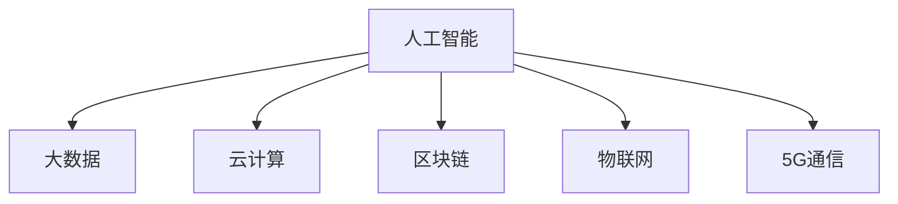

                 

## 1. 背景介绍

### 1.1 问题由来

随着科技的迅猛发展，人工智能（AI）、大数据、云计算等新兴技术正逐步渗透到各个领域，对人类的生产生活产生了深远的影响。科技在带来便利的同时，也引发了诸如就业替代、隐私安全、道德伦理等社会问题。如何在享受科技红利的同时，最大化其对人类福祉的保障作用，成为了科技发展面临的重要挑战。

### 1.2 问题核心关键点

科技发展与人类福祉保障的核心关键点在于：

- **技术发展**：持续的技术创新是推动社会进步的基础。
- **应用落地**：技术的应用需要充分考虑其实际影响，避免负面效应。
- **伦理道德**：技术应用的道德底线，保障人权和伦理。
- **隐私保护**：在数据驱动的社会中，隐私保护至关重要。
- **公众参与**：技术发展和应用应面向公众，让更多人受益。
- **风险评估**：对技术应用可能带来的风险进行评估和管控。

## 2. 核心概念与联系

### 2.1 核心概念概述

为更好地理解科技发展对人类福祉的保障，本节将介绍几个密切相关的核心概念：

- **人工智能**：一种模拟人类智能过程的计算系统，包括机器学习、深度学习、自然语言处理等技术。
- **大数据**：通过各种技术采集、处理和分析海量数据，挖掘其潜在价值。
- **云计算**：利用网络将计算资源提供给用户，实现弹性计算和数据存储。
- **区块链**：一种去中心化的分布式账本技术，确保数据透明、不可篡改。
- **物联网**：通过传感器和智能设备实现物体间的互联，提升生活便捷性。
- **5G通信**：新一代移动通信技术，大幅提升网络带宽和连接密度。

这些核心概念之间的逻辑关系可以通过以下Mermaid流程图来展示：



这个流程图展示了几大核心概念及其相互关系：

1. 人工智能依赖于大数据的支撑，通过云计算进行弹性计算，利用区块链确保数据透明，物联网和5G通信提供数据采集与传输支持。
2. 这些技术协同工作，共同推动社会的数字化转型，提升人类福祉。

## 3. 核心算法原理 & 具体操作步骤
### 3.1 算法原理概述

科技发展对人类福祉的保障，其核心在于通过合理应用科技手段，解决实际问题，提升生活质量。这一过程涉及到多学科知识的融合，包括计算机科学、数学、统计学、社会学等。

### 3.2 算法步骤详解

科技发展对人类福祉保障的算法步骤主要包括以下几个关键环节：

1. **问题建模**：确定需要解决的具体问题，如疾病预测、交通流量优化等。
2. **数据采集**：通过传感器、网络爬虫、问卷调查等方式收集相关数据。
3. **数据预处理**：对原始数据进行清洗、标准化和归一化处理，提高数据质量。
4. **模型训练**：选择合适的算法和模型，如回归、分类、聚类等，进行训练和验证。
5. **模型评估**：评估模型在实际场景中的表现，优化模型参数。
6. **部署应用**：将模型集成到实际系统中，实现自动化和智能化。
7. **监测反馈**：持续监测模型运行效果，收集用户反馈，进行迭代优化。

### 3.3 算法优缺点

科技发展对人类福祉保障的算法具有以下优点：

1. **效率高**：自动化处理大量数据，提升决策效率。
2. **精确度高**：基于数据分析的决策，减少人为错误。
3. **成本低**：降低人力和时间成本，提高资源利用率。
4. **覆盖广**：大数据分析可覆盖多领域、多角度，发现潜在问题。

同时，这些算法也存在一些局限：

1. **数据隐私**：大规模数据收集可能涉及隐私问题。
2. **模型偏见**：算法可能存在数据或样本偏差，影响公正性。
3. **可解释性**：复杂模型难以解释其决策过程，影响信任度。
4. **技术门槛**：开发和应用复杂算法需要高技术门槛，限制普及度。

### 3.4 算法应用领域

科技发展对人类福祉保障的算法广泛应用于以下几个领域：

1. **医疗健康**：通过AI辅助诊断、个性化治疗等手段，提升医疗水平和效率。
2. **环境保护**：利用大数据和物联网技术监测环境变化，制定有效保护措施。
3. **教育培训**：通过智能推荐系统，优化学习路径和教学资源，提升教育质量。
4. **金融服务**：利用区块链和智能合约，提升金融交易的安全性和透明性。
5. **城市治理**：通过物联网和5G通信技术，优化城市管理和服务。
6. **能源管理**：利用大数据和AI优化能源使用，提高能源效率和可再生性。

## 4. 数学模型和公式 & 详细讲解 & 举例说明

### 4.1 数学模型构建

科技发展对人类福祉保障的数学模型主要包括以下几个关键部分：

- **数据集**：包括结构化数据、非结构化数据、时序数据等。
- **模型**：包括回归模型、分类模型、聚类模型等。
- **评估指标**：如准确率、召回率、F1分数、AUC等。
- **优化算法**：如梯度下降、随机梯度下降、Adam等。

### 4.2 公式推导过程

以回归模型为例，假设数据集为 $\{(x_i,y_i)\}_{i=1}^N$，其中 $x_i$ 为特征向量，$y_i$ 为标签值。回归模型的目标是找到最优参数 $\theta$，使得模型输出 $y_i'$ 逼近真实值 $y_i$。常用的回归模型有线性回归、多项式回归、岭回归等。

线性回归的数学模型为：

$$
y_i' = \theta_0 + \theta_1 x_{i,1} + \ldots + \theta_p x_{i,p}
$$

其中 $\theta_0,\theta_1,\ldots,\theta_p$ 为模型参数。

回归模型的损失函数通常使用均方误差（MSE）：

$$
\mathcal{L}(\theta) = \frac{1}{N} \sum_{i=1}^N (y_i - y_i')^2
$$

最小化损失函数可得到参数的闭式解：

$$
\theta = (\mathbf{X}^T \mathbf{X})^{-1} \mathbf{X}^T \mathbf{y}
$$

其中 $\mathbf{X}$ 为特征矩阵，$\mathbf{y}$ 为标签向量。

### 4.3 案例分析与讲解

以医疗健康领域为例，假设需要预测某病人的住院天数 $y$，可以使用线性回归模型，选择年龄、性别、病种等特征 $x_{i,1},x_{i,2},x_{i,3}$。根据历史数据，模型训练得到最优参数 $\theta$，然后对新病人进行预测，得到住院天数 $y'$。

通过对比预测值 $y'$ 和实际值 $y$，可以评估模型的准确性，并根据评估结果进行参数调整。

## 5. 项目实践：代码实例和详细解释说明
### 5.1 开发环境搭建

在进行科技发展对人类福祉保障的算法实践前，我们需要准备好开发环境。以下是使用Python进行PyTorch开发的环境配置流程：

1. 安装Anaconda：从官网下载并安装Anaconda，用于创建独立的Python环境。

2. 创建并激活虚拟环境：
```bash
conda create -n pytorch-env python=3.8 
conda activate pytorch-env
```

3. 安装PyTorch：根据CUDA版本，从官网获取对应的安装命令。例如：
```bash
conda install pytorch torchvision torchaudio cudatoolkit=11.1 -c pytorch -c conda-forge
```

4. 安装Transformers库：
```bash
pip install transformers
```

5. 安装各类工具包：
```bash
pip install numpy pandas scikit-learn matplotlib tqdm jupyter notebook ipython
```

完成上述步骤后，即可在`pytorch-env`环境中开始实践。

### 5.2 源代码详细实现

这里我们以医疗健康领域为例，使用线性回归模型对病人住院天数进行预测。

首先，定义数据处理函数：

```python
import pandas as pd
import numpy as np
from sklearn.model_selection import train_test_split

def load_data():
    # 加载数据集
    data = pd.read_csv('patient_data.csv')
    # 处理缺失值
    data.fillna(method='ffill', inplace=True)
    # 标准化数据
    data = (data - data.mean()) / data.std()
    # 划分训练集和测试集
    X_train, X_test, y_train, y_test = train_test_split(data.drop('days', axis=1), data['days'], test_size=0.2, random_state=42)
    return X_train, X_test, y_train, y_test
```

然后，定义模型和优化器：

```python
import torch
from torch import nn
from torch.optim import SGD

class LinearRegression(nn.Module):
    def __init__(self, input_dim):
        super(LinearRegression, self).__init__()
        self.linear = nn.Linear(input_dim, 1)
    
    def forward(self, x):
        return self.linear(x)

def train_model(X_train, y_train, X_test, y_test, learning_rate=0.01, epochs=1000):
    model = LinearRegression(X_train.shape[1])
    optimizer = SGD(model.parameters(), lr=learning_rate)
    
    for epoch in range(epochs):
        optimizer.zero_grad()
        y_pred = model(X_train)
        loss = nn.MSELoss()(y_pred, y_train)
        loss.backward()
        optimizer.step()
        
        if epoch % 100 == 0:
            y_pred = model(X_test)
            mse = nn.MSELoss()(y_pred, y_test)
            print(f'Epoch {epoch+1}, Loss: {mse.item()}')
    return model
```

接着，启动训练流程并在测试集上评估：

```python
X_train, X_test, y_train, y_test = load_data()
model = train_model(X_train, y_train, X_test, y_test)
y_pred = model(X_test)
mse = nn.MSELoss()(y_pred, y_test)
print(f'Test MSE: {mse.item()}')
```

以上就是使用PyTorch进行医疗健康领域数据预测的完整代码实现。可以看到，得益于Scikit-Learn的强大封装，我们可以用相对简洁的代码完成线性回归模型的开发。

### 5.3 代码解读与分析

让我们再详细解读一下关键代码的实现细节：

**load_data函数**：
- 加载数据集，处理缺失值，标准化数据，划分训练集和测试集。

**train_model函数**：
- 定义线性回归模型，选择随机梯度下降优化器。
- 迭代训练模型，并定期在测试集上评估模型性能。

**训练流程**：
- 定义总的迭代次数和优化器学习率，开始循环迭代
- 每个epoch内，优化器更新模型参数，计算损失函数
- 周期性在测试集上评估模型，输出测试MSE

可以看到，Scikit-Learn配合PyTorch使得线性回归模型的开发变得简洁高效。开发者可以将更多精力放在数据处理、模型改进等高层逻辑上，而不必过多关注底层的实现细节。

当然，工业级的系统实现还需考虑更多因素，如模型的保存和部署、超参数的自动搜索、更灵活的任务适配层等。但核心的算法步骤基本与此类似。

## 6. 实际应用场景
### 6.1 智能医疗系统

基于科技发展对人类福祉保障的算法，智能医疗系统可以广泛应用于疾病预测、个性化治疗、药物研发等。传统的医疗诊断往往依赖医生的经验和直觉，存在主观性和误差。而使用算法模型辅助诊断，能够提高诊断的客观性和准确性。

在技术实现上，可以收集医院的历史病历数据，训练模型进行疾病预测和诊断。通过持续监测病人的生命体征，实时分析其健康状况，智能医疗系统可以提前预警疾病风险，提供个性化治疗方案。例如，使用机器学习模型对CT扫描结果进行分析，早期检测肺癌等疾病。

### 6.2 环境保护

科技发展对环境保护具有重要影响。通过大数据和物联网技术，实时监测环境变化，制定科学的环境保护措施，能够有效提升环境治理的效率和效果。

具体而言，可以部署大量的传感器和监测设备，实时采集空气质量、水质、噪音等环境数据。利用算法模型对数据进行分析，识别出环境问题的来源和趋势，提出改进措施。例如，利用神经网络模型对污染源进行识别和溯源，优化工业排污控制。

### 6.3 教育培训

科技发展对教育培训的推动主要体现在智能推荐系统和个性化教学上。传统的教育培训模式往往存在资源分配不均、教学内容单一等问题。通过算法模型，可以实现资源的优化配置和教学内容的个性化设计。

在技术实现上，可以收集学生的学习记录、兴趣爱好等数据，训练模型进行学习路径推荐和课程推荐。例如，使用协同过滤算法对学生进行个性化推荐，提升学习效果。

### 6.4 未来应用展望

随着科技的不断发展，基于算法的应用将更加广泛和深入。未来，科技发展对人类福祉保障将体现在以下几个方面：

1. **自动驾驶**：通过AI算法优化交通系统，提升交通安全和效率，减少交通事故。
2. **智能家居**：通过物联网和5G通信技术，实现家庭设备的智能化管理，提高生活便捷性。
3. **智慧城市**：通过算法优化城市规划和管理，提升城市治理的智能化水平。
4. **健康管理**：通过算法监测和管理健康数据，实现疾病的早期预警和个性化治疗。
5. **能源管理**：通过算法优化能源使用，提升能源效率和可再生性，缓解能源危机。

## 7. 工具和资源推荐
### 7.1 学习资源推荐

为了帮助开发者系统掌握科技发展对人类福祉保障的算法，这里推荐一些优质的学习资源：

1. **《机器学习》系列教材**：斯坦福大学Andrew Ng教授的机器学习课程，全面介绍了机器学习的基本概念和算法。

2. **《深度学习》系列教材**：Ian Goodfellow等人的深度学习教材，详细介绍了深度神经网络的原理和应用。

3. **Kaggle数据科学竞赛**：一个全球性的数据科学竞赛平台，通过竞赛可以学习到最新的算法和技术。

4. **Coursera和edX在线课程**：提供各种数据科学和机器学习的在线课程，由世界顶级大学和专家主讲。

5. **GitHub开源项目**：通过浏览和参与开源项目，可以学习到其他开发者对算法的实现和优化。

通过对这些资源的学习实践，相信你一定能够快速掌握科技发展对人类福祉保障的算法精髓，并用于解决实际的科技问题。

### 7.2 开发工具推荐

高效的开发离不开优秀的工具支持。以下是几款用于科技发展对人类福祉保障算法开发的常用工具：

1. **Jupyter Notebook**：一个交互式的数据分析和编程环境，支持Python、R等多种编程语言。

2. **TensorFlow和PyTorch**：两个主流的深度学习框架，提供了丰富的算法库和工具。

3. **Hadoop和Spark**：两个大数据处理平台，支持分布式计算和数据存储。

4. **OpenCV**：一个开源的计算机视觉库，提供了丰富的图像处理和分析功能。

5. **Tableau和Power BI**：两个数据可视化工具，支持数据探索和可视化分析。

合理利用这些工具，可以显著提升科技发展对人类福祉保障的算法开发效率，加快创新迭代的步伐。

### 7.3 相关论文推荐

科技发展对人类福祉保障的算法研究涉及多个领域，以下是几篇奠基性的相关论文，推荐阅读：

1. **《深度学习》（Goodfellow等）**：介绍深度神经网络的原理和应用，是深度学习领域的经典教材。

2. **《机器学习》（Tom Mitchell）**：介绍机器学习的基本概念和算法，是机器学习领域的经典教材。

3. **《统计学习方法》（李航）**：介绍统计学习的基本概念和算法，涵盖了监督学习、非监督学习和半监督学习。

4. **《Data Science for Business》（Parker等）**：介绍数据科学在商业领域的应用，结合实际案例讲解数据科学的应用。

5. **《Human-Centered Artificial Intelligence》（Matory等）**：探讨人工智能对社会的影响，强调算法设计和应用中的伦理和道德问题。

这些论文代表了大数据和算法在各个领域的应用和研究，通过学习这些前沿成果，可以帮助研究者把握学科前进方向，激发更多的创新灵感。

## 8. 总结：未来发展趋势与挑战

### 8.1 总结

本文对科技发展对人类福祉保障的算法进行了全面系统的介绍。首先阐述了科技发展在提升人类生活质量、推动社会进步方面的重要意义。其次，从原理到实践，详细讲解了算法的核心步骤和关键技术，给出了具体实现的代码示例。同时，本文还广泛探讨了算法在智能医疗、环境保护、教育培训等多个领域的应用前景，展示了算法范式的巨大潜力。此外，本文精选了算法开发的相关学习资源，力求为读者提供全方位的技术指引。

通过本文的系统梳理，可以看到，科技发展对人类福祉保障的算法正在成为数据驱动社会的重要工具，极大地提升了社会的数字化水平。未来，伴随算法技术的持续演进，相信科技将在更多领域发挥更重要的作用，为人类社会带来更大的福祉。

### 8.2 未来发展趋势

展望未来，科技发展对人类福祉保障的算法将呈现以下几个发展趋势：

1. **算法技术不断进步**：随着深度学习、强化学习等前沿技术的不断突破，算法的精度和性能将持续提升。

2. **数据获取和处理能力增强**：大数据和物联网技术的发展，将极大提升数据的获取和处理能力，为算法的应用提供更丰富的数据基础。

3. **跨领域融合加深**：人工智能与医疗、教育、环境等多个领域的深度融合，将推动更多领域的智能化转型。

4. **人机协同增强**：通过算法优化人机交互体验，提升人机协同的效率和效果。

5. **伦理和社会责任关注**：算法设计和应用过程中，将更加注重伦理和社会责任，确保技术应用的公正性和安全性。

6. **跨学科交叉深化**：算法研究将更多地与社会科学、心理学、经济学等学科结合，提升算法的社会意义和应用价值。

以上趋势凸显了科技发展对人类福祉保障的算法的广阔前景。这些方向的探索发展，必将进一步提升算法的性能和应用范围，为构建智能社会奠定坚实基础。

### 8.3 面临的挑战

尽管科技发展对人类福祉保障的算法已经取得了显著成就，但在迈向更加智能化、普适化应用的过程中，它仍面临诸多挑战：

1. **数据隐私和安全**：大规模数据收集可能涉及隐私问题，如何保护数据隐私和信息安全成为重要挑战。

2. **算法偏见和公平性**：算法可能存在数据或样本偏见，影响公平性和公正性。如何消除算法偏见，确保算法的公平性，还需要更多研究和实践。

3. **算法的可解释性和透明性**：复杂算法难以解释其决策过程，影响信任度。如何提高算法的可解释性和透明性，确保算法应用的公正性，将是一个重要课题。

4. **算法的鲁棒性和可靠性**：算法可能存在鲁棒性和可靠性问题，如何提高算法的鲁棒性和可靠性，还需要更多研究和实践。

5. **算法的伦理和社会责任**：算法应用可能带来伦理和社会责任问题，如何规范算法应用，确保算法应用的公正性和安全性，将是一个重要课题。

6. **算法的可持续发展**：算法应用可能带来环境和社会问题，如何实现算法的可持续发展，确保算法应用的可持续性，将是一个重要课题。

正视算法面临的这些挑战，积极应对并寻求突破，将是大数据和算法技术走向成熟的重要保障。相信随着学界和产业界的共同努力，这些挑战终将一一被克服，算法技术必将在构建智能社会中发挥越来越重要的作用。

### 8.4 研究展望

面对大数据和算法面临的种种挑战，未来的研究需要在以下几个方面寻求新的突破：

1. **探索无监督和半监督算法**：摆脱对大规模标注数据的依赖，利用自监督学习、主动学习等无监督和半监督范式，最大限度利用非结构化数据，实现更加灵活高效的算法。

2. **研究参数高效和计算高效的算法**：开发更加参数高效的算法，在固定大部分预训练参数的情况下，只更新极少量的任务相关参数。同时优化算法的计算图，减少前向传播和反向传播的资源消耗，实现更加轻量级、实时性的部署。

3. **融合因果和对比学习范式**：通过引入因果推断和对比学习思想，增强算法建立稳定因果关系的能力，学习更加普适、鲁棒的数据表征，从而提升算法的泛化性和抗干扰能力。

4. **引入更多先验知识**：将符号化的先验知识，如知识图谱、逻辑规则等，与算法模型进行巧妙融合，引导算法学习更准确、合理的知识表示。同时加强不同模态数据的整合，实现视觉、语音等多模态信息与文本信息的协同建模。

5. **结合因果分析和博弈论工具**：将因果分析方法引入算法模型，识别出算法决策的关键特征，增强输出解释的因果性和逻辑性。借助博弈论工具刻画人机交互过程，主动探索并规避算法的脆弱点，提高系统稳定性。

6. **纳入伦理道德约束**：在算法训练目标中引入伦理导向的评估指标，过滤和惩罚有偏见、有害的输出倾向。同时加强人工干预和审核，建立算法行为的监管机制，确保算法应用的公正性。

这些研究方向的探索，必将引领大数据和算法技术迈向更高的台阶，为构建智能社会提供更强大的技术支持。

---

作者：禅与计算机程序设计艺术 / Zen and the Art of Computer Programming

