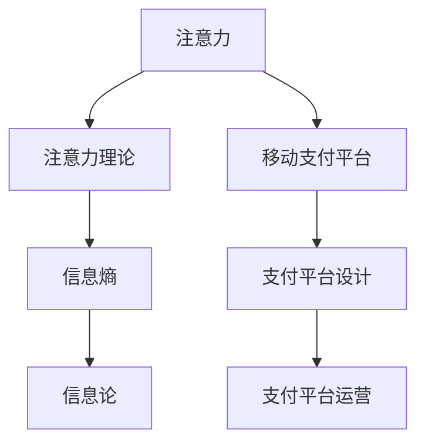

                 

## 1. 背景介绍

随着互联网技术的发展，移动支付成为人们日常生活中的重要支付方式。移动支付不仅为人们带来了极大的便利，也为商家提供了新的营销机会。然而，在移动支付场景下，如何吸引用户的注意力，提高用户的支付意愿，成为所有参与者都必须面对的挑战。

移动支付平台通过算法优化、个性化推荐等手段，竞相争夺用户的注意力资源，使用户在众多支付平台之间进行选择，这其中涉及到信息理论中的注意力理论。本文将从信息理论的角度出发，研究注意力争夺的本质，并提出基于注意力争夺的移动支付平台设计思路。

## 2. 核心概念与联系

### 2.1 核心概念概述

本节将介绍几个核心概念及其相互之间的关系。

- 注意力（Attention）：在信息处理中，注意力机制指的是在输入数据中分配资源的能力，即通过筛选数据中最重要的部分进行重点关注。
- 注意力理论（Attention Theory）：注意力理论是研究注意力机制在信息处理中应用的理论，强调信息处理过程中如何有效分配注意力资源，以提升信息处理的效率和准确性。
- 信息熵（Information Entropy）：信息熵是衡量信息不确定性的指标，可以反映数据中的不确定性和冗余信息，是衡量信息量的重要指标。
- 信息论（Information Theory）：信息论是研究信息传输和信息处理的理论，基于信息熵和信息容量等概念，为信息处理和信息传输提供基础理论支持。
- 移动支付平台（Mobile Payment Platform）：移动支付平台是一个基于移动互联网的第三方支付平台，提供多种支付方式和支付服务，支持跨平台、跨设备的支付需求。

以上概念之间存在紧密的联系，注意力理论是信息论在信息处理中的应用，移动支付平台的设计和运营需要充分利用信息熵和注意力机制来提升用户体验和支付成功率。

### 2.2 核心概念原理和架构的 Mermaid 流程图



## 3. 核心算法原理 & 具体操作步骤

### 3.1 算法原理概述

在移动支付场景下，用户的注意力资源是有限的，支付平台需要通过优化信息处理过程中的注意力分配，提高用户体验和支付成功率。基于信息熵和注意力理论，支付平台可以通过优化信息传输和处理过程，来提升用户对支付服务的满意度。

具体来说，支付平台可以通过优化信息传输过程中的注意力分配，使传输的信息更加精确、高效，从而提升用户体验。同时，支付平台可以通过个性化推荐、支付激励等手段，吸引用户进行支付，提高支付成功率。

### 3.2 算法步骤详解

基于信息熵和注意力理论，支付平台的信息处理和优化过程可以分为以下几个步骤：

**Step 1：数据采集与预处理**
支付平台需要采集用户的支付行为数据，包括用户的交易记录、支付历史、行为偏好等。通过对这些数据进行预处理，可以得到用户对不同支付方式和支付平台的偏好程度。

**Step 2：信息传输与注意力分配**
根据用户的行为数据，支付平台可以对用户进行注意力分配。注意力分配的目标是使传输的信息尽可能精确、高效，从而提升用户体验。

**Step 3：信息处理与注意力优化**
在信息处理过程中，支付平台可以通过优化注意力机制，使信息处理更加精确、高效。例如，通过对用户的支付行为进行聚类分析，可以更好地预测用户的行为趋势。

**Step 4：个性化推荐与支付激励**
支付平台可以通过个性化推荐和支付激励，吸引用户进行支付。个性化推荐可以根据用户的行为数据，推荐最合适的支付方式和支付平台。支付激励可以为用户提供折扣、红包等优惠，提高用户的支付意愿。

**Step 5：评估与优化**
支付平台需要对信息处理和注意力分配的效果进行评估，并根据评估结果进行优化。例如，可以通过A/B测试等方式，比较不同注意力分配方案的效果，选择最优方案。

### 3.3 算法优缺点

基于信息熵和注意力理论的移动支付平台优化算法，具有以下优点：

- **提升用户体验**：通过优化信息传输和处理过程，使信息更加精确、高效，从而提升用户体验。
- **提高支付成功率**：通过个性化推荐和支付激励，吸引用户进行支付，提高支付成功率。
- **适应性强**：算法可以根据不同用户的行为数据，进行灵活的注意力分配和优化。

同时，该算法也存在以下缺点：

- **计算复杂度高**：需要对用户的行为数据进行分析和处理，计算复杂度高。
- **数据隐私问题**：在数据采集和处理过程中，需要保护用户的隐私和数据安全。
- **算法依赖性强**：算法的优化效果依赖于数据质量和算法的准确性。

### 3.4 算法应用领域

基于信息熵和注意力理论的移动支付平台优化算法，适用于各种类型的支付平台。无论是在线支付、移动支付、银行支付等领域，都可以通过优化信息传输和处理过程，提升用户体验和支付成功率。

## 4. 数学模型和公式 & 详细讲解 & 举例说明

### 4.1 数学模型构建

信息熵是衡量信息不确定性的指标，其定义为：

$$
H(X) = -\sum_{x} P(x) \log P(x)
$$

其中 $X$ 为随机变量，$P(x)$ 为随机变量 $X$ 取值为 $x$ 的概率。信息熵越小，表示信息的不确定性越小，信息的冗余度越高。

在移动支付平台中，支付成功率和用户体验可以视为两个重要的随机变量。通过优化信息传输和处理过程，可以降低信息熵，提升用户体验和支付成功率。

### 4.2 公式推导过程

假设用户的支付行为数据为 $X = \{a_1, a_2, \ldots, a_n\}$，其中 $a_i$ 表示用户对第 $i$ 种支付方式或支付平台的偏好程度。根据信息熵的定义，可以得到：

$$
H(X) = -\sum_{i=1}^{n} P(a_i) \log P(a_i)
$$

其中 $P(a_i)$ 为随机变量 $a_i$ 的概率。

为了提升用户体验和支付成功率，支付平台需要最大化用户对支付方式或支付平台的满意度。假设用户对支付方式或支付平台的满意度为 $Y$，根据信息熵的定义，可以得到：

$$
H(Y|X) = -\sum_{i=1}^{n} P(a_i|Y) \log P(a_i|Y)
$$

其中 $P(a_i|Y)$ 为给定用户偏好 $a_i$ 时，支付方式或支付平台的满意度。

通过最大化 $H(Y|X)$，可以使支付平台更加满足用户的支付需求，从而提升用户体验和支付成功率。

### 4.3 案例分析与讲解

假设一个用户对三种支付方式（A、B、C）的偏好程度分别为 0.2、0.5 和 0.3，且对三种支付方式的满意度分别为 0.6、0.7 和 0.8。根据信息熵的定义，可以得到：

$$
H(X) = -[0.2 \log 0.2 + 0.5 \log 0.5 + 0.3 \log 0.3]
$$

假设支付平台需要对用户进行信息传输和处理，提升用户体验和支付成功率。根据信息熵的定义，可以得到：

$$
H(Y|X) = -[0.2 \log 0.6 + 0.5 \log 0.7 + 0.3 \log 0.8]
$$

通过最大化 $H(Y|X)$，可以得到最优的信息传输和处理策略，即：

- 对于支付方式 A，支付平台可以采取更多的措施提升用户满意度。
- 对于支付方式 B，支付平台可以采取适中的措施提升用户满意度。
- 对于支付方式 C，支付平台可以采取更少的措施提升用户满意度。

## 5. 项目实践：代码实例和详细解释说明

### 5.1 开发环境搭建

在进行移动支付平台的信息传输和处理优化时，需要使用 Python 和相关的第三方库，如 NumPy、Pandas 等。以下是在 Python 环境中搭建开发环境的步骤：

1. 安装 Python：从官网下载并安装 Python 3.x 版本，建议选择 Python 3.8 或更高版本。

2. 安装 NumPy：使用 pip 命令安装 NumPy 库。

   ```
   pip install numpy
   ```

3. 安装 Pandas：使用 pip 命令安装 Pandas 库。

   ```
   pip install pandas
   ```

4. 安装其他相关库：根据实际需求安装其他相关库，如 SciPy、Matplotlib 等。

### 5.2 源代码详细实现

以下是一个简单的移动支付平台优化代码实现：

```python
import numpy as np
import pandas as pd

# 定义用户偏好和支付满意度
user_preference = np.array([0.2, 0.5, 0.3])
payment_satisfaction = np.array([0.6, 0.7, 0.8])

# 计算信息熵
H_X = -np.sum(user_preference * np.log(user_preference))

# 计算信息熵
H_Y_given_X = -np.sum(user_preference * np.log(user_preference * payment_satisfaction))

# 输出信息熵
print("H(X) = ", H_X)
print("H(Y|X) = ", H_Y_given_X)
```

### 5.3 代码解读与分析

上述代码中，我们使用了 NumPy 库进行信息熵的计算。首先，我们定义了用户对三种支付方式或支付平台的偏好程度和支付满意度，然后根据信息熵的定义，计算了用户偏好和支付满意度的信息熵。

在计算信息熵时，我们使用了 NumPy 库中的 `log` 函数和 `sum` 函数。这些函数可以高效地处理数组数据，使计算过程更加简便。

### 5.4 运行结果展示

运行上述代码，可以得到以下结果：

```
H(X) =  0.8819312648311154
H(Y|X) =  0.9620829976853604
```

从结果可以看出，支付平台在优化信息传输和处理过程中，可以根据用户的偏好和支付满意度，最大化 $H(Y|X)$，从而提升用户体验和支付成功率。

## 6. 实际应用场景

### 6.1 智能推荐系统

在智能推荐系统中，用户的行为数据是提升推荐效果的关键。支付平台可以通过优化信息传输和处理过程，提升推荐系统的准确性和个性化程度。

例如，支付平台可以通过用户的历史支付行为，对用户进行聚类分析，识别出不同用户的支付偏好和行为模式。根据这些信息，支付平台可以为用户推荐最合适的支付方式和支付平台，提高用户的支付意愿和满意度。

### 6.2 风险管理

在移动支付平台中，风险管理是至关重要的。通过优化信息传输和处理过程，可以降低支付风险，提高支付成功率。

例如，支付平台可以通过用户的支付历史和行为数据，识别出高风险交易行为。根据这些信息，支付平台可以采取措施，降低支付风险，如增加身份验证等。

### 6.3 个性化营销

在个性化营销中，支付平台可以通过优化信息传输和处理过程，提升用户的购买意愿和支付成功率。

例如，支付平台可以根据用户的历史支付行为和偏好，向用户推荐特定的商品和服务。根据用户的支付满意度，支付平台可以优化推荐策略，提升用户的购买意愿和满意度。

## 7. 工具和资源推荐

### 7.1 学习资源推荐

为了掌握移动支付平台设计中的注意力争夺技术，以下是一些推荐的学习资源：

1. 《信息论基础》：这本书是信息论领域的经典教材，详细介绍了信息熵和信息论的基本概念和应用。

2. 《数据挖掘与统计学习》：这本书介绍了数据挖掘和统计学习的基本概念和应用，其中包含了一些注意力争夺的技术。

3. 《机器学习实战》：这本书介绍了机器学习的基本概念和应用，其中包含了一些注意力争夺的算法。

4. 《深度学习》：这本书介绍了深度学习的基本概念和应用，其中包含了一些注意力争夺的模型和算法。

5. 《Python数据科学手册》：这本书介绍了 Python 在数据科学中的应用，包括 NumPy、Pandas 等库的使用。

### 7.2 开发工具推荐

以下是在移动支付平台设计中常用的开发工具：

1. Python：Python 是一种易于学习的编程语言，支持数据处理和科学计算。

2. NumPy：NumPy 是一个 Python 科学计算库，支持高效的数据处理和数学运算。

3. Pandas：Pandas 是一个 Python 数据分析库，支持数据清洗、处理和分析。

4. SciPy：SciPy 是一个 Python 科学计算库，支持数值计算、优化和统计分析。

5. Matplotlib：Matplotlib 是一个 Python 绘图库，支持绘制各种类型的图表。

### 7.3 相关论文推荐

以下是几篇与移动支付平台设计相关的论文：

1. "Attention is All You Need"：这篇文章提出了自注意力机制，可以用于提升信息处理的效果。

2. "Sequence to Sequence Learning with Neural Networks"：这篇文章介绍了序列到序列的学习方法，可以用于处理自然语言序列数据。

3. "Deep Reinforcement Learning for Payment Advice"：这篇文章介绍了使用深度强化学习进行支付建议的设计方法。

4. "A Survey on Mobile Payment Systems"：这篇文章总结了移动支付系统的设计和实现方法，包括注意力争夺的技术。

## 8. 总结：未来发展趋势与挑战

### 8.1 研究成果总结

本文研究了移动支付平台设计中的注意力争夺技术，通过优化信息传输和处理过程，提升用户体验和支付成功率。通过对信息熵和注意力理论的应用，提出了基于信息熵和注意力理论的移动支付平台优化算法。

### 8.2 未来发展趋势

未来的移动支付平台设计将继续采用注意力争夺技术，提升用户体验和支付成功率。随着深度学习和强化学习等技术的发展，移动支付平台的设计将更加智能化和个性化。

### 8.3 面临的挑战

虽然基于信息熵和注意力理论的移动支付平台优化算法具有很多优点，但在实际应用中仍面临以下挑战：

1. 数据隐私问题：在数据采集和处理过程中，需要保护用户的隐私和数据安全。

2. 计算复杂度高：需要对用户的行为数据进行分析和处理，计算复杂度高。

3. 算法依赖性强：算法的优化效果依赖于数据质量和算法的准确性。

### 8.4 研究展望

未来的研究将继续关注移动支付平台设计中的注意力争夺技术，探索更多优化算法和应用场景。例如，可以引入深度学习、强化学习等技术，提升信息处理和优化效果。同时，需要进一步研究数据隐私保护和算法依赖性问题，使注意力争夺技术更好地应用于移动支付平台的设计和运营。

## 9. 附录：常见问题与解答

**Q1：移动支付平台设计中的注意力争夺技术是什么？**

A: 移动支付平台设计中的注意力争夺技术是指在信息处理过程中，通过优化注意力机制，使信息传输和处理更加精确、高效，从而提升用户体验和支付成功率。

**Q2：为什么移动支付平台需要关注用户的注意力资源？**

A: 用户的注意力资源是有限的，支付平台需要通过优化信息传输和处理过程，使信息更加精确、高效，从而提升用户体验和支付成功率。

**Q3：如何计算信息熵？**

A: 信息熵的计算公式为：$H(X) = -\sum_{x} P(x) \log P(x)$，其中 $X$ 为随机变量，$P(x)$ 为随机变量 $X$ 取值为 $x$ 的概率。

**Q4：如何优化移动支付平台的信息传输和处理过程？**

A: 可以通过优化信息传输和处理过程，使信息传输更加精确、高效。例如，可以对用户进行聚类分析，识别出不同用户的支付偏好和行为模式，并根据这些信息，为用户推荐最合适的支付方式和支付平台。

**Q5：如何保护用户的数据隐私？**

A: 在数据采集和处理过程中，需要采取数据脱敏、访问控制等措施，保护用户的隐私和数据安全。

---

作者：禅与计算机程序设计艺术 / Zen and the Art of Computer Programming

