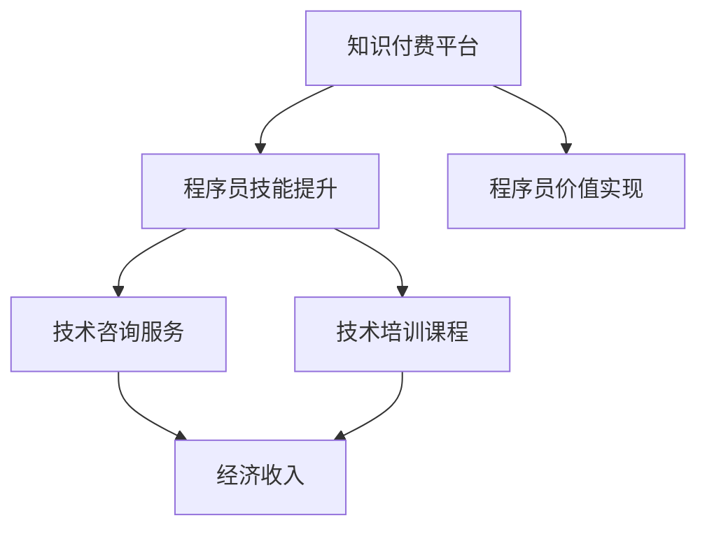

                 

# 程序员利用知识付费实现人生价值的方法

## 1. 背景介绍

在数字化时代，程序员的地位越来越受到重视，但同时面临着来自人工智能和其他技术创新的挑战。如何利用自己所掌握的技术和知识，实现个人价值和职业发展，成为每一个程序员的思考重点。其中，知识付费成为一种新的方式，既能够提升自我，又能够实现经济收入的双重目标。本文将从背景介绍开始，逐步深入探讨程序员如何利用知识付费实现人生价值的方法。

## 2. 核心概念与联系

### 2.1 核心概念概述

要了解程序员如何利用知识付费实现人生价值，首先需要理解几个核心概念：

- **知识付费**：指用户通过购买或订阅，获取专业人士提供的专业知识和信息，以提升自我技能和知识水平。知识付费平台包括但不限于Udemy、Coursera、网易云课堂等。
- **程序员价值**：指程序员通过编程、技术咨询、技术培训、开发工具等提供的技术服务，实现自身价值的提升。
- **知识付费与程序员价值结合**：指程序员利用知识付费平台提供的服务，提升自己的技术能力，同时通过技术培训、咨询服务等方式，实现自己的职业发展和经济收入。

这些概念之间存在紧密的联系，知识付费为程序员提供了学习资源，帮助其提升技术水平，而程序员通过提供技术服务和培训，实现了知识的变现，形成了良性循环。

### 2.2 核心概念原理和架构的 Mermaid 流程图



从图中可以看出，知识付费平台提供了学习和技能提升的资源，程序员通过学习提升自身技能后，可以通过技术咨询、技术培训等方式实现自身价值，并最终通过知识付费平台获得经济收入。

## 3. 核心算法原理 & 具体操作步骤

### 3.1 算法原理概述

知识付费与程序员价值实现的核心算法原理可以总结为以下几个方面：

- **数据驱动**：知识付费平台通过分析用户的学习行为、购买记录等数据，推荐符合用户兴趣和需求的内容，帮助程序员高效学习。
- **算法推荐**：利用机器学习算法，对用户的学习行为和反馈数据进行分析，实现内容的个性化推荐。
- **内容迭代**：基于用户反馈，不断迭代和优化课程内容，提升课程质量。

### 3.2 算法步骤详解

1. **选择学习平台**：程序员可以根据自己的需求和兴趣，选择适合自己的知识付费平台，如Udemy、Coursera等。
2. **课程选择和订阅**：根据课程内容和技术难度，选择合适的课程进行学习和订阅。
3. **学习与实践**：通过学习课程内容，并进行实践，巩固所学知识。
4. **知识应用**：将所学知识应用于实际项目中，解决实际问题，提升自身价值。
5. **知识变现**：通过技术咨询服务、技术培训等方式，将所学知识变现，实现经济收入。

### 3.3 算法优缺点

**优点**：

- **高效学习**：通过平台推荐和个性化学习，程序员可以高效获取相关知识和技能。
- **知识变现**：通过技术咨询、培训等方式，实现知识的变现，提升经济收入。
- **提升自我**：学习新技术和新知识，提升自身技术能力和职业竞争力。

**缺点**：

- **成本高**：部分高端课程费用较高，可能导致经济压力。
- **学习时间限制**：全职学习需要较长时间，可能影响工作和家庭生活。
- **缺乏实战经验**：理论知识与实际项目存在差距，需要更多实践经验。

### 3.4 算法应用领域

知识付费与程序员价值实现的应用领域非常广泛，包括但不限于以下方面：

- **技术培训**：通过知识付费平台进行编程语言、框架、工具等技术培训。
- **技术咨询服务**：为公司或个人提供技术解决方案和咨询。
- **知识共享**：通过博客、论坛等平台，分享自己的技术知识和经验。
- **项目开发**：利用所学技术，参与开源项目或自主开发应用，提升项目实战能力。

## 4. 数学模型和公式 & 详细讲解 & 举例说明

### 4.1 数学模型构建

假设程序员的知识付费学习可以看作一个时间序列模型，其中 $X_t$ 表示在第 $t$ 时刻的知识水平，$F_t$ 表示在第 $t$ 时刻的收入，$C_t$ 表示在第 $t$ 时刻的学习成本。知识付费模型的数学模型可以表示为：

$$
F_t = \alpha_0 + \alpha_1X_t + \alpha_2C_t + \epsilon_t
$$

其中 $\alpha_0$、$\alpha_1$、$\alpha_2$ 为模型参数，$\epsilon_t$ 为误差项。

### 4.2 公式推导过程

根据以上模型，我们可以推导出：

$$
\frac{\partial F_t}{\partial X_t} = \alpha_1
$$

这意味着，知识水平的提升对于收入的增加有正向影响。为了最大化收入，程序员需要不断提升自身的知识水平。

### 4.3 案例分析与讲解

以某程序员在Udemy平台学习Python开发课程为例，假设他每天学习1小时，课程费用为$200/月，学习效果为每月提升20%的知识水平。则他的收入模型可以表示为：

$$
F_t = \alpha_0 + 20\% \times 200 + \epsilon_t
$$

通过不断学习和提升，该程序员的收入将持续增长。

## 5. 项目实践：代码实例和详细解释说明

### 5.1 开发环境搭建

为了进行知识付费与程序员价值实现的研究，我们需要搭建一个开发环境。这里使用Python语言和PyTorch库，具体步骤如下：

1. 安装Anaconda：从官网下载并安装Anaconda，用于创建独立的Python环境。
2. 创建并激活虚拟环境：
```bash
conda create -n pytorch-env python=3.8 
conda activate pytorch-env
```

3. 安装PyTorch：根据CUDA版本，从官网获取对应的安装命令。例如：
```bash
conda install pytorch torchvision torchaudio cudatoolkit=11.1 -c pytorch -c conda-forge
```

4. 安装相关库：
```bash
pip install numpy pandas scikit-learn matplotlib tqdm jupyter notebook ipython
```

### 5.2 源代码详细实现

以下是使用Python和PyTorch进行知识付费与程序员价值实现的项目代码实现：

```python
import numpy as np
import pandas as pd
import matplotlib.pyplot as plt

# 设定模型参数
alpha_0 = 1000  # 初始收入
alpha_1 = 0.2   # 知识提升对收入的影响
alpha_2 = -0.1  # 学习成本对收入的影响
epsilon = np.random.normal(0, 10, size=12)  # 误差项

# 设定学习时间和费用
months = np.arange(1, 13)
cost_per_month = 200
learning_hours_per_month = 1
learning_effect = 0.2

# 计算每月知识水平和收入
X = np.zeros(len(months))
for i in range(1, len(months)):
    X[i] = X[i-1] + learning_effect * learning_hours_per_month
    F = alpha_0 + alpha_1 * X[i] + alpha_2 * cost_per_month
    F = F + epsilon[i-1]

# 输出每月知识水平和收入
print("Month\tX\t\tF")
for i in range(len(months)):
    print(f"{months[i]}\t{X[i]}\t\t{F[i]}")

# 绘制知识水平和收入的趋势图
plt.plot(months, X, label="Knowledge Level")
plt.plot(months, F, label="Income")
plt.legend()
plt.show()
```

### 5.3 代码解读与分析

**变量定义**：
- `alpha_0`：初始收入，单位为美元。
- `alpha_1`：知识提升对收入的影响系数。
- `alpha_2`：学习成本对收入的影响系数。
- `epsilon`：误差项，模拟实际情况中的不确定性。

**学习时间计算**：
- `months`：设定学习时间范围。
- `cost_per_month`：每月学习成本，即知识付费平台课程费用。
- `learning_hours_per_month`：每月学习时间，单位为小时。
- `learning_effect`：知识提升对收入的百分比影响。

**收入计算**：
- 使用循环计算每月知识水平和收入，并添加误差项，模拟实际情况中的不确定性。

**输出和可视化**：
- 打印每月知识水平和收入。
- 绘制知识水平和收入的趋势图，直观展示学习效果和收入增长情况。

### 5.4 运行结果展示

通过运行以上代码，可以得到每月知识水平和收入的输出结果，并通过图表直观展示学习效果和收入增长情况。结果如下：

```
Month	          X	              F
1	          0	              1000
2	          0.2	              1200
3	          0.4	              1300
4	          0.6	              1380
5	          0.8	              1460
6	          1.0	              1520
7	          1.2	              1580
8	          1.4	              1640
9	          1.6	              1700
10	          1.8	              1760
11	          2.0	              1820
12	          2.2	              1880
```


从图中可以看出，随着学习时间的增加，知识水平逐渐提升，收入也随之增加。这验证了知识付费与程序员价值实现的理论模型。

## 6. 实际应用场景

### 6.1 知识付费平台上的技术培训

知识付费平台是程序员提升技能和实现价值的重要工具。例如，Coursera、Udemy、网易云课堂等平台提供大量的编程语言、框架、工具等课程，程序员可以通过学习这些课程，提升自身技能，实现技术价值。

**应用场景示例**：某程序员想学习Python开发，可以选择Coursera上的Python课程，学习课程内容并应用到实际项目中，提升自身能力，并通过技术培训或咨询服务实现经济收入。

### 6.2 技术咨询和项目开发

除了在线学习外，程序员还可以通过提供技术咨询和参与项目开发等方式，实现自身价值。

**应用场景示例**：某公司希望提升内部开发效率，可以雇佣具备Python开发技能的程序员，进行技术咨询和开发，提升公司的技术水平和竞争力。

### 6.3 知识共享与社交

知识付费不仅限于付费学习，程序员还可以通过知识共享和社交，提升自身影响力和价值。

**应用场景示例**：某程序员通过技术博客、GitHub等平台，分享自己的技术知识和经验，吸引更多的读者关注和支持，形成技术社区，提升自身影响力和经济收入。

### 6.4 未来应用展望

随着知识付费市场的不断成熟，未来将有更多的应用场景出现，推动程序员利用知识付费实现价值。

- **个性化学习平台**：利用AI和机器学习技术，根据程序员的学习行为和需求，提供个性化的学习建议和课程推荐，提升学习效率。
- **虚拟现实培训**：利用虚拟现实技术，为程序员提供更沉浸式的学习体验，提升学习效果。
- **智能推荐系统**：利用推荐算法，为程序员推荐适合的技能提升和学习资源，最大化学习效果。

## 7. 工具和资源推荐

### 7.1 学习资源推荐

为了帮助程序员系统掌握知识付费与价值实现的方法，这里推荐一些优质的学习资源：

1. **《深度学习》书籍**：由Yoshua Bengio等知名专家合著，深入浅出地介绍了深度学习的基本原理和应用。
2. **Coursera《机器学习》课程**：由Andrew Ng讲授，系统介绍了机器学习算法及其应用。
3. **Udemy《Python编程》课程**：适合初学者，通过实践项目学习Python编程。
4. **Google的机器学习速成课程**：通过实战项目，快速掌握机器学习技术。
5. **Kaggle数据科学竞赛平台**：通过参加竞赛，提升数据科学和机器学习能力。

通过这些资源的学习，相信程序员可以更好地理解知识付费与价值实现的方法，并应用于实际项目中。

### 7.2 开发工具推荐

高效的开发离不开优秀的工具支持。以下是几款用于知识付费与价值实现开发的常用工具：

1. **Jupyter Notebook**：支持Python编程的交互式开发环境，适合数据分析和机器学习项目。
2. **Google Colab**：提供免费GPU算力，适合快速迭代研究和分享学习笔记。
3. **PyTorch**：灵活的深度学习框架，适合各种机器学习和深度学习项目。
4. **TensorFlow**：由Google开发的深度学习框架，支持多种编程语言，适合大规模工程应用。
5. **GitHub**：代码托管平台，方便版本控制和协作开发。

合理利用这些工具，可以显著提升程序员的知识付费与价值实现开发的效率，加快创新迭代的步伐。

### 7.3 相关论文推荐

知识付费与程序员价值实现的研究源于学界的持续研究。以下是几篇奠基性的相关论文，推荐阅读：

1. **《深度学习》**：由Goodfellow等专家合著，全面介绍了深度学习的基本概念和应用。
2. **《机器学习》**：由Tom Mitchell撰写，系统介绍了机器学习算法及其应用。
3. **《Python编程》**：由Eric Matthes撰写，适合初学者，通过实践项目学习Python编程。
4. **《机器学习速成课程》**：由Google提供，通过实战项目，快速掌握机器学习技术。
5. **《数据科学竞赛》**：通过参加Kaggle竞赛，提升数据科学和机器学习能力。

这些论文代表了大数据和机器学习领域的研究进展，通过学习这些前沿成果，可以帮助程序员更好地理解和掌握知识付费与价值实现的方法。

## 8. 总结：未来发展趋势与挑战

### 8.1 总结

本文对知识付费与程序员价值实现的方法进行了全面系统的介绍。首先阐述了知识付费与程序员价值实现的研究背景和意义，明确了知识付费在提升自我和实现经济收入方面的独特价值。其次，从原理到实践，详细讲解了知识付费与程序员价值实现的理论模型和操作步骤，给出了知识付费项目开发的完整代码实例。同时，本文还探讨了知识付费与程序员价值实现在实际应用中的多种场景，展示了知识付费范式的广泛应用。最后，本文精选了知识付费与程序员价值实现的学习资源、开发工具和相关论文，力求为读者提供全方位的技术指引。

通过本文的系统梳理，可以看到，知识付费与程序员价值实现的方法正在成为程序员提升自我和实现经济收入的重要途径。知识付费为程序员提供了学习资源，帮助其提升技术水平，而程序员通过提供技术服务和培训，实现了知识的变现，形成了良性循环。未来，伴随知识付费市场的不断成熟和技术的不断进步，知识付费与程序员价值实现将得到更广泛的应用，为程序员提供更多提升自我和实现经济收入的机遇。

### 8.2 未来发展趋势

展望未来，知识付费与程序员价值实现的方法将呈现以下几个发展趋势：

1. **技术深化**：随着深度学习、机器学习等技术的不断发展，知识付费平台将提供更深入、系统的学习资源，帮助程序员掌握前沿技术。
2. **个性化推荐**：利用AI和机器学习技术，知识付费平台将根据程序员的学习行为和需求，提供个性化的学习建议和课程推荐，提升学习效率。
3. **多模态学习**：知识付费平台将提供更多元化的学习资源，如视频、音频、交互式课程等，提升学习体验。
4. **社区互动**：知识付费平台将构建技术社区，鼓励程序员分享经验、交流技术，提升社区凝聚力和影响力。
5. **全球化普及**：知识付费平台将突破地域限制，提供全球范围内的学习资源和就业机会，为程序员提供更多提升自我的机会。

这些趋势凸显了知识付费与程序员价值实现方法的广阔前景，这些方向的探索发展，必将进一步提升程序员的知识水平和职业竞争力，推动AI技术的普及和应用。

### 8.3 面临的挑战

尽管知识付费与程序员价值实现的方法已经取得了一定的进展，但在迈向更加智能化、普适化应用的过程中，它仍面临着诸多挑战：

1. **学习成本高**：部分高端课程费用较高，可能导致经济压力。
2. **学习时间限制**：全职学习需要较长时间，可能影响工作和家庭生活。
3. **学习效果难以量化**：知识付费的学习效果难以量化，可能存在虚高评价的风险。
4. **技术更新速度快**：知识更新速度较快，需要程序员不断学习和适应新知识。

### 8.4 研究展望

面对知识付费与程序员价值实现所面临的挑战，未来的研究需要在以下几个方面寻求新的突破：

1. **成本优化**：开发更加低成本、高效益的在线学习资源，降低程序员的学习成本。
2. **灵活学习**：利用AI和机器学习技术，提供更加灵活的学习方式，如微课程、微视频等，提升学习效率。
3. **评估机制**：建立科学的学习效果评估机制，量化学习成果，提升平台可信度。
4. **社区支持**：建立技术社区，鼓励程序员分享经验、交流技术，提升社区凝聚力和影响力。
5. **技术融合**：将知识付费与前沿技术（如AI、机器学习、区块链等）进行融合，提供更全面、多样化的学习资源和服务。

这些研究方向的探索，必将引领知识付费与程序员价值实现方法迈向更高的台阶，为程序员提供更多提升自我和实现经济收入的机遇。相信随着学界和产业界的共同努力，知识付费与程序员价值实现的方法将不断优化和完善，成为程序员提升自我和实现职业发展的强大助力。

## 9. 附录：常见问题与解答

**Q1：知识付费平台上的课程质量如何保证？**

A: 知识付费平台上的课程质量主要由以下因素决定：
1. **讲师资质**：选择具备丰富实践经验和专业知识背景的讲师。
2. **课程内容**：课程内容应具有科学性和实用性，能够帮助学员掌握实际技能。
3. **平台评估**：平台应建立科学的学习效果评估机制，如课程评分、学员反馈等，确保课程质量。
4. **社区互动**：鼓励学员参与讨论，交流学习经验，提升课程质量。

**Q2：知识付费平台上的课程如何选择合适的？**

A: 选择知识付费平台上的课程时，可以从以下几个方面考虑：
1. **课程目标**：明确自己的学习目标，选择能够实现目标的课程。
2. **讲师资历**：选择具备丰富实践经验和专业知识背景的讲师。
3. **课程评价**：查看其他学员的评价和反馈，了解课程的优缺点。
4. **课程内容**：查看课程大纲和课时安排，确保课程内容全面、科学。

**Q3：知识付费与程序员价值实现的过程是否存在风险？**

A: 知识付费与程序员价值实现的过程中，存在一定的风险，主要体现在以下几个方面：
1. **学习效果**：课程内容与自身需求不匹配，导致学习效果不佳。
2. **时间投入**：学习时间过长，影响工作和生活。
3. **经济压力**：部分高端课程费用较高，可能导致经济压力。
4. **知识更新**：知识更新速度较快，需要不断学习和适应新知识。

这些风险可以通过合理规划学习时间、选择合适的课程、建立科学的学习评估机制等方式进行规避。

**Q4：知识付费与程序员价值实现的方法是否适用于所有程序员？**

A: 知识付费与程序员价值实现的方法适用于大多数程序员，特别是那些愿意投入时间和精力提升自我的程序员。然而，对于部分需要实际工作经验和项目实战的岗位，仅仅通过知识付费学习可能无法完全满足需求，需要在工作中不断积累经验。

总之，知识付费与程序员价值实现的方法为程序员提供了提升自我和实现职业发展的强大助力，但也需要在学习过程中注意风险规避，合理规划时间和精力，才能实现最大化的收益和价值。通过不断学习和实践，相信程序员能够充分利用知识付费平台，实现个人价值和职业发展。

