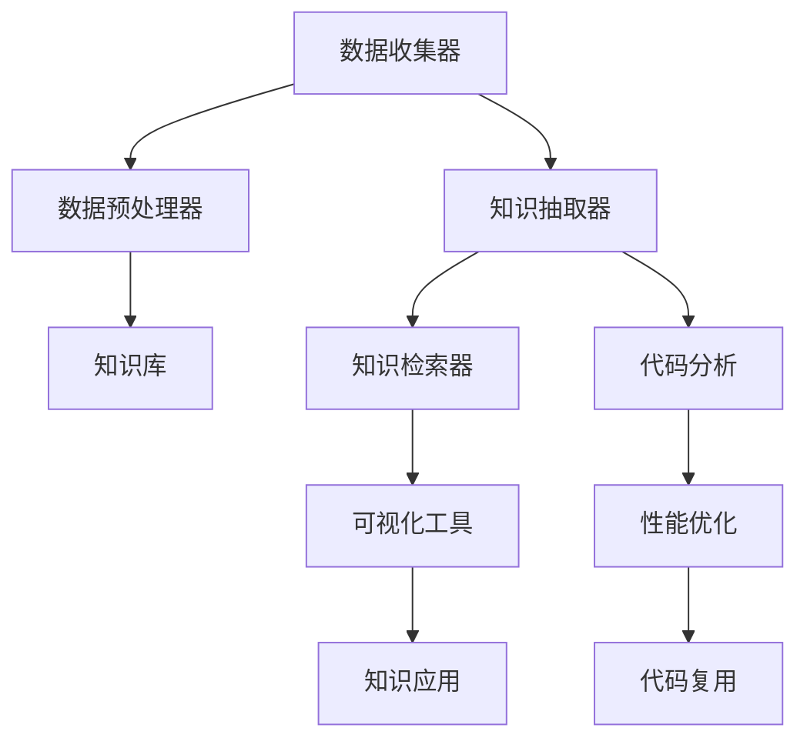

                 

# 程序员利用知识发现引擎提高工作效率

## 1. 背景介绍

在当今快速发展的科技时代，程序员的工作效率对于企业的竞争力和创新能力至关重要。然而，随着技术栈的日益复杂，面对庞大的代码库和多样化的需求，程序员常常感到不堪重负。知识发现引擎（Knowledge Discovery Engine, KDE）作为一种新兴的技术，能够帮助程序员快速定位问题、积累经验、优化代码，从而大幅提升工作效率。

### 1.1 问题由来
随着软件系统的复杂性增加，程序员在开发、维护和部署过程中遇到的问题也越来越多。传统的问题查找方法，如手动搜索代码、查阅文档等，耗费大量时间且效率低下。这些问题包括但不限于：

- 代码错误：由于语言错误、逻辑错误、运行时错误等原因导致的程序崩溃。
- 性能问题：由于算法不合理、资源分配不均、循环次数过多等原因导致的应用性能下降。
- 测试问题：由于测试用例设计不当、覆盖不全等原因导致的测试失败。
- 代码复用性差：由于缺乏设计思路、技术储备等原因导致的代码重复编写。

为了应对这些挑战，知识发现引擎应运而生。KDE通过分析代码、日志、性能数据等海量信息，自动识别问题模式，生成可操作的知识，帮助程序员快速定位问题、优化代码。

### 1.2 问题核心关键点
知识发现引擎的核心在于其独特的知识抽取和检索机制。KDE通常包括以下几个关键组件：

- 数据收集器：从代码、日志、性能监控工具等不同来源收集数据。
- 数据预处理器：清洗、标准化数据，提高数据质量。
- 知识抽取器：基于算法和规则，从数据中提取有价值的模式和知识。
- 知识库：存储抽取到的知识，便于查询和复用。
- 知识检索器：支持基于查询模式的检索，快速定位相关问题。
- 可视化工具：将知识呈现为直观的图表和报告，便于理解和决策。

KDE通过这些组件的协同工作，实现对程序的理解和优化。其核心原理在于数据驱动的分析与模式识别，提升程序员的工作效率。

## 2. 核心概念与联系

### 2.1 核心概念概述

为了更好地理解知识发现引擎的工作原理和应用场景，本节将介绍几个密切相关的核心概念：

- 知识发现（Knowledge Discovery, KD）：从大量数据中提取有价值的信息和知识，帮助决策者做出更明智的决策。
- 数据挖掘（Data Mining, DM）：使用统计、机器学习等方法，从数据中发现有价值的模式和知识。
- 代码分析（Code Analysis）：对代码进行静态和动态分析，识别代码质量、安全性、可维护性等问题。
- 性能优化（Performance Optimization）：通过分析性能数据，识别和解决性能瓶颈，提升应用响应速度和资源利用效率。
- 代码复用（Code Reusability）：通过代码复用，提升代码的可维护性和开发效率。

这些概念之间的逻辑关系可以通过以下Mermaid流程图来展示：



这个流程图展示了一个典型的知识发现引擎工作流程：

1. 数据收集器从不同数据源收集信息。
2. 数据预处理器清洗和标准化数据。
3. 知识抽取器提取有价值的模式和知识。
4. 知识库存储和管理抽取到的知识。
5. 知识检索器支持基于查询模式的检索。
6. 可视化工具呈现知识，便于理解和决策。
7. 知识应用组件将知识应用于代码分析、性能优化、代码复用等场景。

## 3. 核心算法原理 & 具体操作步骤

### 3.1 算法原理概述

知识发现引擎的核心算法原理主要包括数据抽取、知识挖掘、模式识别、知识检索和知识可视化等步骤。以下是各个步骤的详细解释：

- **数据抽取**：从代码库、日志文件、性能监控数据等来源收集和整理数据。
- **知识挖掘**：使用数据挖掘算法，从收集的数据中发现潜在的模式和知识。
- **模式识别**：通过算法和规则，从数据中识别出具体的问题模式。
- **知识检索**：根据用户查询，在知识库中检索相关知识。
- **知识可视化**：将抽取出的知识通过图表、报告等方式呈现出来，便于理解和决策。

### 3.2 算法步骤详解

以下将详细介绍知识发现引擎的核心算法步骤及其具体操作：

**Step 1: 数据收集与预处理**

1. **数据收集**：
   - 从代码库、日志文件、性能监控工具等不同来源收集数据。
   - 收集的数据包括代码文件、函数调用记录、系统日志、性能指标等。

2. **数据预处理**：
   - 清洗数据，去除噪声和无用信息。
   - 标准化数据格式，统一数据结构。
   - 数据去重和归一化，确保数据质量。

**Step 2: 知识抽取**

1. **静态代码分析**：
   - 使用代码分析工具，如SonarQube、PMD等，对代码进行静态分析。
   - 识别代码质量问题，如语法错误、未使用的变量、未被覆盖的代码块等。

2. **动态代码分析**：
   - 使用动态代码分析工具，如Dynatrace、New Relic等，监测代码运行时的性能指标。
   - 识别性能瓶颈，如响应时间过长、内存泄漏、高CPU占用等。

**Step 3: 模式识别**

1. **问题模式识别**：
   - 通过算法和规则，识别出常见的问题模式，如死锁、内存泄漏、SQL注入等。
   - 使用模式匹配技术，如正则表达式、基于树形结构的匹配等，进行问题模式识别。

2. **知识提取**：
   - 将识别出的问题模式，转化为具体的知识，如修复建议、性能优化策略等。
   - 存储到知识库中，便于后续检索和使用。

**Step 4: 知识检索**

1. **查询设计**：
   - 根据用户查询，设计合理的查询条件，如代码行号、函数名、错误类型等。
   - 设计复杂的查询条件，支持多维度、多层次的检索需求。

2. **知识检索**：
   - 在知识库中检索相关知识，返回匹配结果。
   - 根据匹配程度排序，返回最相关的前几条结果。

**Step 5: 知识可视化**

1. **图表生成**：
   - 使用图表工具，如Tableau、PowerBI等，生成直观的图表。
   - 生成代码覆盖率、性能指标、错误类型等统计图表。

2. **报告生成**：
   - 使用报告工具，如Jenkins、Jira等，生成详细的报告。
   - 生成代码分析报告、性能优化报告、错误处理报告等。

### 3.3 算法优缺点

知识发现引擎在提升程序员工作效率方面具有显著优势，但也存在一些局限性：

**优点**：
- 自动化问题识别：通过自动化的方式，快速定位代码和系统中的问题。
- 实时监控和分析：提供实时监控和分析功能，及时发现和解决潜在问题。
- 经验积累：通过知识库的积累，提升团队的整体技术水平。
- 协作优化：支持团队协作，共享知识，共同提升效率。

**缺点**：
- 数据隐私和安全：收集和分析代码、日志等数据，涉及隐私和安全问题。
- 高初始成本：构建和维护知识发现引擎需要较高的初始成本和技术门槛。
- 数据质量依赖：数据质量对知识抽取和模式识别的效果影响较大。
- 复杂性管理：知识发现引擎本身需要管理和维护，增加了系统复杂性。

## 4. 数学模型和公式 & 详细讲解 & 举例说明

### 4.1 数学模型构建

为了更好地理解知识发现引擎的工作原理，我们将以知识抽取为例，介绍其数学模型构建过程。

设从数据集中抽取的知识表示为 $\mathcal{K}$，其中包含多个知识点 $k_i = (k_{i1}, k_{i2}, \dots, k_{in})$，每个知识点由多个属性组成，如代码行号、函数名、错误类型等。

定义知识抽取模型为 $f$，其输入为数据集 $D$，输出为知识集 $\mathcal{K}$，即：
$$
\mathcal{K} = f(D)
$$

其中，$f$ 可以表示为一系列算法和规则的组合，如机器学习算法、规则匹配等。

### 4.2 公式推导过程

以下我们将推导一个简单的知识抽取模型 $f$ 的公式，假设使用决策树算法进行知识抽取：

假设数据集 $D$ 包含 $N$ 个样本，每个样本有 $M$ 个特征 $x_{ij}$，其中 $i$ 表示样本编号，$j$ 表示特征编号。知识抽取模型 $f$ 可以表示为决策树的构建过程，每个决策节点 $n$ 对应一个特征 $x_{nj}$，每个叶子节点 $l$ 对应一个知识点 $k_i$。

决策树的构建过程包括特征选择、分裂、剪枝等步骤，可以使用如下公式表示：
$$
\mathcal{K} = \bigcup_{l \in \text{Leaves}} k_l
$$
其中，$k_l$ 表示决策树的第 $l$ 个叶子节点对应的知识点。

### 4.3 案例分析与讲解

假设我们要从一组代码库中抽取关于未使用变量的知识。首先，我们需要构建一个决策树，选择最优的特征进行分裂。例如，我们可以选择代码行号 $x_{n1}$ 作为分裂点，构建决策树。假设决策树共有 $L$ 个叶子节点，每个叶子节点对应一个知识点 $k_l$，表示在该行存在未使用的变量。

我们可以使用以下公式表示知识抽取过程：
$$
\mathcal{K} = \bigcup_{l \in \{1, 2, \dots, L\}} k_l
$$

通过决策树的构建，我们可以自动地从代码库中抽取关于未使用变量的知识，从而帮助程序员快速定位和修复代码中的问题。

## 5. 项目实践：代码实例和详细解释说明

### 5.1 开发环境搭建

在进行知识发现引擎的实践开发前，我们需要准备好开发环境。以下是使用Python进行PyTorch开发的环境配置流程：

1. 安装Anaconda：从官网下载并安装Anaconda，用于创建独立的Python环境。

2. 创建并激活虚拟环境：
```bash
conda create -n kde-env python=3.8 
conda activate kde-env
```

3. 安装PyTorch：根据CUDA版本，从官网获取对应的安装命令。例如：
```bash
conda install pytorch torchvision torchaudio cudatoolkit=11.1 -c pytorch -c conda-forge
```

4. 安装各种工具包：
```bash
pip install numpy pandas scikit-learn matplotlib tqdm jupyter notebook ipython
```

完成上述步骤后，即可在`kde-env`环境中开始知识发现引擎的开发。

### 5.2 源代码详细实现

这里我们以静态代码分析为例，给出使用PyTorch进行知识抽取的PyTorch代码实现。

首先，定义数据收集器类，用于从代码库中收集数据：

```python
from pytorch_pretrained_bert import BertTokenizer, BertForSequenceClassification
from transformers import Trainer, TrainingArguments

class CodeCollector:
    def __init__(self, data_dir):
        self.data_dir = data_dir
        self.tokenizer = BertTokenizer.from_pretrained('bert-base-uncased')

    def collect_code(self, file_path):
        with open(file_path, 'r') as f:
            code = f.read()
        tokens = self.tokenizer.encode(code, add_special_tokens=True)
        return tokens
```

然后，定义知识抽取器类，使用BERT模型进行知识抽取：

```python
class CodeKDE:
    def __init__(self, model_path):
        self.model = BertForSequenceClassification.from_pretrained(model_path)
        self.tokenizer = BertTokenizer.from_pretrained(model_path)
        self.max_seq_length = 512

    def extract_knowledge(self, code):
        tokens = self.tokenizer.encode(code, max_length=self.max_seq_length, truncation=True, padding='max_length')
        inputs = {key: value for key, value in self.model.model_dict.items()}
        inputs['input_ids'] = tokens
        outputs = self.model(**inputs)
        logits = outputs.logits
        probs = logits.softmax(dim=-1).tolist()[0]
        return probs
```

接着，定义知识检索器类，根据查询条件检索知识：

```python
class KnowledgeRetriever:
    def __init__(self, knowledge_base):
        self.knowledge_base = knowledge_base

    def retrieve_knowledge(self, query):
        for k in self.knowledge_base:
            if query in k:
                return k
        return None
```

最后，定义可视化工具类，将知识抽取结果进行可视化：

```python
import matplotlib.pyplot as plt

class KnowledgeVisualizer:
    def __init__(self, knowledge):
        self.knowledge = knowledge

    def plot_knowledge(self):
        plt.bar(range(len(self.knowledge)), self.knowledge.values())
        plt.xlabel('Sample')
        plt.ylabel('Probs')
        plt.title('Knowledge Extraction Results')
        plt.show()
```

### 5.3 代码解读与分析

让我们再详细解读一下关键代码的实现细节：

**CodeCollector类**：
- `__init__`方法：初始化数据目录和分词器。
- `collect_code`方法：读取代码文件，并使用分词器进行编码，返回编码后的token ids。

**CodeKDE类**：
- `__init__`方法：初始化BERT模型和分词器。
- `extract_knowledge`方法：对代码进行编码，输入BERT模型，得到概率分布，返回每个知识点的概率值。

**KnowledgeRetriever类**：
- `__init__`方法：初始化知识库。
- `retrieve_knowledge`方法：根据查询条件，在知识库中检索相关知识，返回匹配的知识点。

**KnowledgeVisualizer类**：
- `__init__`方法：初始化知识。
- `plot_knowledge`方法：将知识抽取结果绘制为条形图，并显示图表。

通过以上代码，我们可以实现从代码库中抽取知识，并进行检索和可视化的全流程。开发者可以根据具体需求，进一步扩展和优化这些代码，实现更复杂的功能。

### 5.4 运行结果展示

我们可以通过下面的代码展示知识抽取和可视化的结果：

```python
# 实例化CodeCollector类
collector = CodeCollector('path/to/code')
# 从代码库中收集代码
code = collector.collect_code('path/to/code/file')

# 实例化CodeKDE类
kde = CodeKDE('path/to/model')
# 从代码中抽取知识
knowledge = kde.extract_knowledge(code)

# 实例化KnowledgeVisualizer类
visualizer = KnowledgeVisualizer(knowledge)
# 可视化知识
visualizer.plot_knowledge()
```

在上述代码中，`collect_code`方法从代码文件中读取代码，`extract_knowledge`方法使用BERT模型对代码进行知识抽取，`plot_knowledge`方法将抽取到的知识可视化。

## 6. 实际应用场景

### 6.1 软件开发过程

知识发现引擎在软件开发过程中有着广泛的应用。以下是几个典型场景：

- **代码质量检查**：通过静态代码分析，识别代码质量问题，如未使用的变量、循环嵌套过深等。
- **性能瓶颈定位**：通过动态代码分析，监测代码运行时的性能指标，定位性能瓶颈，如响应时间过长、内存泄漏等。
- **问题定位与修复**：通过问题模式识别，自动定位代码中的问题，生成修复建议，提高代码的稳定性和可维护性。
- **代码复用优化**：通过知识检索，查找代码复用模板，提高代码复用率，减少重复编写代码的工作量。

### 6.2 系统维护与升级

系统维护和升级是软件开发过程中不可避免的一部分。知识发现引擎在维护与升级过程中同样发挥着重要作用：

- **系统问题诊断**：通过日志分析，识别系统中的问题，如错误日志、性能指标等。
- **性能优化**：通过性能数据分析，识别和解决性能瓶颈，提升系统响应速度和资源利用效率。
- **故障排除**：通过问题模式识别，自动定位故障原因，快速恢复系统运行。
- **新功能开发**：通过知识检索，查找已有功能和模板，快速开发新功能，缩短开发周期。

### 6.3 安全防护

知识发现引擎在安全防护中也发挥着重要作用。以下是几个典型场景：

- **安全漏洞检测**：通过代码分析，识别代码中的安全漏洞，如SQL注入、跨站脚本等。
- **异常行为监测**：通过日志分析，监测异常行为，如异常访问、异常请求等。
- **风险评估**：通过性能数据分析，评估系统的安全性，识别潜在的安全风险。
- **安全加固**：通过问题模式识别，自动生成安全加固方案，提升系统的安全性。

### 6.4 未来应用展望

随着知识发现引擎技术的不断发展，其应用场景也将更加广泛。以下是我们对未来应用的展望：

- **多模态数据融合**：将知识发现引擎应用于多模态数据，如文本、图像、视频等，实现更加全面和深入的分析。
- **实时动态监测**：将知识发现引擎集成到实时监控系统中，实现对系统状态的实时动态监测和分析。
- **智能决策支持**：通过知识发现引擎提取有价值的模式和知识，支持智能决策，提升决策效率和准确性。
- **自动化运维**：将知识发现引擎应用于自动化运维系统，实现自动化问题定位、故障排除和修复。

## 7. 工具和资源推荐

### 7.1 学习资源推荐

为了帮助开发者系统掌握知识发现引擎的理论基础和实践技巧，这里推荐一些优质的学习资源：

1. 《Python数据科学手册》：详细介绍了Python在数据科学中的应用，包括数据处理、数据可视化等。
2. 《深度学习入门》：由深度学习领域的专家撰写，介绍了深度学习的基本概念和常用算法。
3. 《代码优化技巧》：介绍代码优化的方法和工具，如静态分析、动态分析等。
4. 《自动化运维实战》：介绍了自动化运维的实践经验，包括监控工具、自动化脚本等。

通过这些资源的学习实践，相信你一定能够快速掌握知识发现引擎的精髓，并用于解决实际的开发问题。

### 7.2 开发工具推荐

高效的开发离不开优秀的工具支持。以下是几款用于知识发现引擎开发的常用工具：

1. Python：作为数据科学和机器学习的主流编程语言，具有丰富的库和工具支持。
2. PyTorch：基于Python的深度学习框架，灵活的计算图支持，适合快速迭代研究。
3. TensorFlow：由Google主导开发的深度学习框架，生产部署方便，适合大规模工程应用。
4. Jupyter Notebook：交互式的编程环境，支持代码编写、数据分析、可视化等，是数据科学家的利器。
5. GitHub：代码托管平台，支持版本控制、协作开发等，方便代码管理和分享。

合理利用这些工具，可以显著提升知识发现引擎的开发效率，加快创新迭代的步伐。

### 7.3 相关论文推荐

知识发现引擎的研究源于学界的持续研究。以下是几篇奠基性的相关论文，推荐阅读：

1. "Knowledge Discovery in Databases"：KDD会议的开创性论文，系统介绍了知识发现的理论和实践。
2. "A Survey of Knowledge Discovery and Data Mining Techniques"：综述了数据挖掘和知识发现的最新进展和应用。
3. "Practical Methods for Knowledge Discovery"：介绍了知识发现的具体方法和应用实例，适合实战参考。
4. "Machine Learning and Knowledge Discovery in Databases"：介绍了机器学习在知识发现中的应用，系统讲解了相关技术和算法。

这些论文代表了大数据和知识发现领域的经典研究，通过学习这些前沿成果，可以帮助研究者把握学科前进方向，激发更多的创新灵感。

## 8. 总结：未来发展趋势与挑战

### 8.1 总结

本文对知识发现引擎进行了全面系统的介绍。首先阐述了知识发现引擎在程序员工作效率提升中的重要作用，明确了知识抽取、知识检索、知识可视化等核心组件的逻辑关系。其次，从原理到实践，详细讲解了知识抽取的具体步骤和方法，给出了知识发现引擎的代码实现示例。同时，本文还广泛探讨了知识发现引擎在软件开发、系统维护、安全防护等实际应用场景中的应用前景，展示了知识发现引擎的广泛潜力。此外，本文精选了知识发现引擎的学习资源、开发工具和相关论文，力求为读者提供全方位的技术指引。

通过本文的系统梳理，可以看到，知识发现引擎正在成为程序员工作效率提升的重要工具，极大地减轻了程序员在开发、维护和部署过程中的负担。随着知识抽取和模式识别技术的不断发展，知识发现引擎必将在更广泛的应用场景中发挥更大作用，为软件开发行业带来新的变革。

### 8.2 未来发展趋势

展望未来，知识发现引擎将呈现以下几个发展趋势：

1. 自动化和智能化程度提升。知识发现引擎将变得更加自动化和智能化，能够自主进行问题识别、知识提取和优化建议，提升开发效率。
2. 多模态数据融合。将知识发现引擎应用于多模态数据，如文本、图像、视频等，实现更加全面和深入的分析。
3. 实时动态监测。将知识发现引擎集成到实时监控系统中，实现对系统状态的实时动态监测和分析。
4. 智能决策支持。通过知识发现引擎提取有价值的模式和知识，支持智能决策，提升决策效率和准确性。
5. 自动化运维。将知识发现引擎应用于自动化运维系统，实现自动化问题定位、故障排除和修复。
6. 人工智能融合。将知识发现引擎与人工智能技术结合，实现更高级别的自动化和智能化。

这些趋势凸显了知识发现引擎的广阔前景。这些方向的探索发展，必将进一步提升知识发现引擎的性能和应用范围，为软件开发行业带来新的变革。

### 8.3 面临的挑战

尽管知识发现引擎已经取得了显著成就，但在迈向更加智能化、自动化应用的过程中，它仍面临着诸多挑战：

1. 数据隐私和安全。收集和分析代码、日志等数据，涉及隐私和安全问题，需要合理管理和保护。
2. 数据质量依赖。知识抽取和模式识别的效果高度依赖于数据质量，如何提升数据质量将是关键问题。
3. 系统复杂性管理。知识发现引擎本身需要管理和维护，增加了系统复杂性，需要合理设计和管理。
4. 技术门槛高。知识发现引擎的构建和维护需要较高的技术门槛，需要更多技术支持和工具。

正视知识发现引擎面临的这些挑战，积极应对并寻求突破，将是大语言模型微调走向成熟的必由之路。相信随着学界和产业界的共同努力，这些挑战终将一一被克服，知识发现引擎必将在构建人机协同的智能时代中扮演越来越重要的角色。

### 8.4 研究展望

面对知识发现引擎所面临的挑战，未来的研究需要在以下几个方面寻求新的突破：

1. 探索无监督和半监督知识发现方法。摆脱对大规模标注数据的依赖，利用自监督学习、主动学习等无监督和半监督范式，最大限度利用非结构化数据。
2. 研究参数高效和计算高效的抽取方法。开发更加参数高效的抽取方法，在固定大部分预训练参数的同时，只更新极少量的任务相关参数。同时优化抽取模型的计算图，减少前向传播和反向传播的资源消耗。
3. 融合因果和对比学习范式。通过引入因果推断和对比学习思想，增强知识发现引擎建立稳定因果关系的能力，学习更加普适、鲁棒的语言表征。
4. 引入更多先验知识。将符号化的先验知识，如知识图谱、逻辑规则等，与神经网络模型进行巧妙融合，引导知识发现过程学习更准确、合理的知识。
5. 结合因果分析和博弈论工具。将因果分析方法引入知识发现引擎，识别出知识发现过程中的关键特征，增强输出解释的因果性和逻辑性。借助博弈论工具刻画人机交互过程，主动探索并规避知识发现的脆弱点，提高系统稳定性。

这些研究方向的探索，必将引领知识发现引擎技术迈向更高的台阶，为构建安全、可靠、可解释、可控的智能系统铺平道路。面向未来，知识发现引擎还需要与其他人工智能技术进行更深入的融合，如知识表示、因果推理、强化学习等，多路径协同发力，共同推动知识发现引擎技术的进步。只有勇于创新、敢于突破，才能不断拓展知识发现引擎的边界，让知识发现引擎技术更好地造福人类社会。

## 9. 附录：常见问题与解答

**Q1：知识发现引擎是否适用于所有开发项目？**

A: 知识发现引擎在绝大多数开发项目中都能发挥作用，特别是对于大型和复杂的项目。但对于一些小型项目或特定领域的应用，知识发现引擎的效果可能不如预期。此时需要根据具体情况选择更适合的工具和方法。

**Q2：如何选择知识发现引擎的数据源？**

A: 知识发现引擎的数据源可以是代码库、日志文件、性能监控工具等。选择数据源时，需要考虑数据的质量、覆盖面、更新频率等因素。数据源的选择对知识发现引擎的效果影响很大，需要根据具体需求进行选择。

**Q3：知识发现引擎对系统性能的影响有哪些？**

A: 知识发现引擎在运行过程中需要消耗一定的计算资源，可能会对系统性能产生一定影响。为了减少影响，可以使用轻量级知识发现引擎或进行性能优化，如采用并行处理、异步处理等技术。

**Q4：如何保证知识发现引擎的数据隐私和安全？**

A: 知识发现引擎在运行过程中需要收集和分析代码、日志等数据，涉及隐私和安全问题。需要采取合理的措施，如数据加密、访问控制等，确保数据的安全性。

**Q5：知识发现引擎的开发和维护成本高吗？**

A: 知识发现引擎的开发和维护需要较高的技术门槛和资源投入。但其带来的开发效率提升和问题定位能力，往往可以抵消这些成本。

总之，知识发现引擎作为一种新兴的技术，正在成为程序员提升工作效率的重要工具。通过合理选择数据源、优化算法和工具，知识发现引擎必将在更广泛的应用场景中发挥更大作用，为软件开发行业带来新的变革。面对未来的挑战，我们需要不断探索和优化知识发现引擎技术，推动其在人工智能领域的深入应用。

