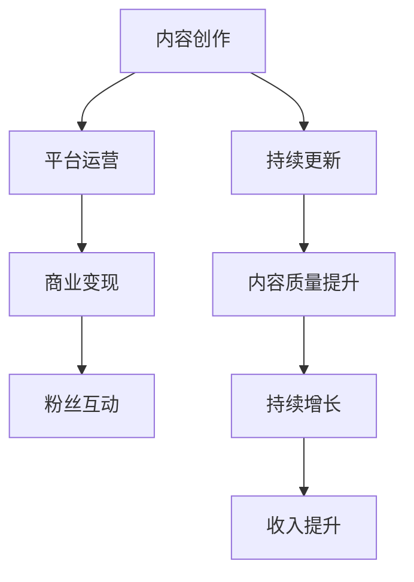

                 

# 程序员如何利用B站进行知识变现

> 关键词：B站, 知识变现, 内容创作, 程序员, 自媒体, 技术分享, 收入提升, 平台利用, 视频教程

## 1. 背景介绍

### 1.1 问题由来

近年来，随着互联网技术的飞速发展和智能手机的普及，人们获取信息的方式发生了巨大的变化。传统的文字和图片信息已经难以满足人们日益增长的需求，视频、音频等新媒体形式逐渐成为主流。在这样的背景下，以B站（哔哩哔哩）为代表的二次元视频平台逐渐崛起，吸引了大量年轻用户，成为年轻一代获取信息和娱乐的重要渠道。

对于程序员而言，传统的技术分享方式，如博客、论文、代码库等，虽然具有一定的权威性和专业性，但在传播速度、用户互动性和内容可接受性方面存在一定的局限。而B站作为视频分享平台，凭借其直观、生动、互动性强等特点，为程序员提供了新的知识传播和变现渠道。

### 1.2 问题核心关键点

程序员如何利用B站进行知识变现，关键在于以下几个方面：

- **内容创作**：制作高质量、有价值的视频内容，吸引目标受众。
- **平台运营**：充分利用B站平台提供的各种资源和工具，提高内容曝光率和用户互动。
- **商业变现**：通过广告、会员、打赏、付费课程等方式实现收入变现。
- **持续更新**：持续输出高质量内容，保持粉丝关注度和平台活跃度。

本文将从以上几个关键点出发，详细阐述程序员如何利用B站进行知识变现，帮助程序员开拓新的收入渠道，提升自我价值。

## 2. 核心概念与联系

### 2.1 核心概念概述

为了更好地理解程序员如何利用B站进行知识变现，本节将介绍几个密切相关的核心概念：

- **B站（哔哩哔哩）**：一个以二次元文化为主体的视频分享平台，提供高质量的视频播放、直播、投稿、互动等功能。
- **内容创作**：制作视频、图文等内容，用于知识传播和分享。
- **平台运营**：利用B站平台的各种工具和资源，进行用户管理和内容推广。
- **商业变现**：通过广告、会员、打赏、付费课程等方式获取收入。
- **持续更新**：定期更新内容，保持粉丝关注和平台活跃度。

这些核心概念之间相互联系，共同构成了程序员利用B站进行知识变现的基础框架。

### 2.2 核心概念原理和架构的 Mermaid 流程图



这个流程图展示了程序员利用B站进行知识变现的关键步骤：通过高质量的内容创作吸引用户，利用平台运营手段提高用户互动和曝光，通过商业变现实现收入提升，并在此基础上不断优化内容质量，实现持续增长和收入提升。

## 3. 核心算法原理 & 具体操作步骤

### 3.1 算法原理概述

基于B站的知识变现方法，本质上是一个内容推荐和互动优化过程。其核心思想是通过制作高质量视频内容，吸引目标受众，并利用B站平台提供的各种工具和资源，进行内容推广和用户管理，最终实现收入变现。

形式化地，假设目标受众为 $U$，优质内容为 $C$，平台提供的工具和资源为 $T$，商业变现方式为 $M$，变现目标为 $R$。则知识变现的目标是最大化变现收入 $R$，即：

$$
R = \max_{C, T, M} R(C, T, M)
$$

其中 $R(C, T, M)$ 为内容创作、平台运营和商业变现策略的综合收益函数。

### 3.2 算法步骤详解

基于B站的知识变现方法一般包括以下几个关键步骤：

**Step 1: 选择合适的内容类型**

- **技术教程**：详细介绍某个编程语言的特性、常用框架的使用方法、项目开发流程等。
- **项目实战**：展示真实项目的开发过程，讲解项目需求、实现细节和部署过程。
- **案例分析**：分析具体案例，讲解技术难点、优化方案和解决方案。
- **个人经验**：分享个人职业发展、面试经验、学习心得等。

**Step 2: 制作高质量视频内容**

- **脚本准备**：详细撰写视频脚本，明确每个视频的主题、目标受众、知识点结构和演示流程。
- **素材收集**：收集相关技术文档、代码库、案例资料等素材，准备演示和讲解。
- **视频录制**：使用专业摄像头、麦克风和视频编辑软件录制视频，确保画面清晰、声音清晰、内容连贯。

**Step 3: 发布视频并运营推广**

- **视频上传**：在B站发布视频，设置合适的标题、描述和标签，以便用户搜索和发现。
- **互动管理**：及时回复用户的评论和私信，了解用户需求，改进视频内容。
- **粉丝互动**：加入相关兴趣圈、参与社区讨论，增加用户互动，提升粉丝粘性。
- **平台工具利用**：使用B站提供的专栏、会员、打赏等功能，提高内容曝光和用户黏性。

**Step 4: 探索变现途径**

- **广告收入**：通过B站的广告系统，在视频前、中、后插入广告，获取广告收入。
- **会员订阅**：设置会员专栏，提供高质量的视频和课程，吸引用户订阅。
- **打赏收入**：开启打赏功能，鼓励用户对优质内容进行打赏。
- **付费课程**：将视频内容打包成付费课程，出售给目标受众。

**Step 5: 持续优化和更新**

- **用户反馈收集**：定期收集用户反馈，了解用户需求和兴趣点，优化视频内容。
- **内容质量提升**：不断学习新技术，更新视频内容，保持内容的时效性和高质量。
- **粉丝互动和维护**：定期发布新内容，保持粉丝关注度，提高平台活跃度。

通过以上步骤，程序员可以充分利用B站的平台资源，实现知识变现，同时提升个人品牌影响力和专业技能。

### 3.3 算法优缺点

基于B站的知识变现方法具有以下优点：

1. **传播速度快**：视频形式直观生动，易于吸引用户关注，传播速度较快。
2. **互动性强**：用户可以实时评论、点赞和分享，增加了内容的曝光率和用户互动。
3. **商业变现多样**：通过多种变现途径，实现收入来源多样化，降低风险。
4. **门槛低**：相较于传统技术分享方式，视频制作和上传门槛较低，易于上手。

同时，该方法也存在一定的局限性：

1. **时间成本高**：视频内容制作和上传需要投入大量时间和精力，对于全职程序员而言，可能会影响日常工作。
2. **技能要求高**：视频录制、编辑和上传需要一定的技术支持，对于缺乏相关技能的人而言，可能需要额外学习。
3. **平台限制**：B站平台规则和政策可能限制内容的发布，需要遵循平台规则。
4. **变现不确定性**：广告、会员、打赏等收入具有一定的不确定性，受平台规则、用户行为等多重因素影响。

尽管存在这些局限性，但就目前而言，基于B站的知识变现方法仍是一个高效、可行的方案，适合有一定技术能力和兴趣的程序员尝试。

### 3.4 算法应用领域

基于B站的知识变现方法已经在编程、开发、技术分享等多个领域得到了广泛的应用，涵盖了从入门到高级、从单技术到多技术的广泛内容。

- **编程入门**：通过视频教程，讲解编程语言基础、开发工具、调试技巧等内容，帮助初学者快速入门。
- **项目实战**：展示实际项目的开发过程，讲解技术难点和解决方案，提高读者实战能力。
- **技术分享**：分享最新的技术趋势、行业动态、面试技巧等内容，帮助读者了解行业前沿。
- **职业发展**：通过个人职业发展经验分享，帮助读者规划职业路径、提升职场竞争力。

此外，B站的知识变现方法也被创新性地应用于在线教育、技术社区、技术会议等场景中，为程序员和行业从业者提供了更多的交流和学习平台。

## 4. 数学模型和公式 & 详细讲解 & 举例说明

### 4.1 数学模型构建

基于B站的知识变现方法，可以通过以下数学模型来量化分析和优化：

假设目标受众为 $U$，优质内容为 $C$，平台提供的工具和资源为 $T$，变现策略为 $M$，变现目标为 $R$。则知识变现的收益函数可以表示为：

$$
R = f(C, T, M, U)
$$

其中 $f$ 为收益函数，$C$、$T$、$M$ 和 $U$ 分别为内容创作、平台运营、商业变现和目标受众的四个关键变量。

### 4.2 公式推导过程

对于收益函数 $f$，可以进行如下分解：

$$
f = C \times T \times M \times U
$$

其中 $C$ 为内容质量，$T$ 为平台运营效果，$M$ 为商业变现策略，$U$ 为目标受众规模。

- **内容质量 $C$**：包括视频制作质量、讲解清晰度、内容连贯性等方面，直接影响用户观看体验和满意度。
- **平台运营效果 $T$**：包括视频曝光率、互动率、平台活动参与度等方面，决定内容曝光和用户互动的规模。
- **商业变现策略 $M$**：包括广告策略、会员模式、付费课程等方面，影响变现收入的规模和稳定性。
- **目标受众规模 $U$**：包括用户增长率、用户活跃度等方面，决定目标受众的规模和用户转化率。

### 4.3 案例分析与讲解

以一个简单的技术教程视频为例，可以进一步说明以上模型的应用：

- **内容质量 $C$**：视频讲解清晰，内容连贯，制作质量高，能够有效吸引用户关注。
- **平台运营效果 $T$**：视频标题和描述中包含热门标签，通过平台算法推荐，曝光率较高，互动率高，用户反馈积极。
- **商业变现策略 $M$**：视频前插入广告，通过平台广告系统获取收入；同时开启会员和打赏功能，吸引用户订阅和打赏。
- **目标受众规模 $U$**：视频发布后，通过会员、打赏等变现方式获取收入，同时增加粉丝数量和平台活跃度，持续优化内容质量和运营策略。

通过以上案例，可以看出，优化每个变量的关键因素和整体收益函数的变化趋势，从而实现知识变现的最大化。

## 5. 项目实践：代码实例和详细解释说明

### 5.1 开发环境搭建

在进行知识变现实践前，我们需要准备好开发环境。以下是使用Python进行B站视频制作和上传的环境配置流程：

1. 安装Anaconda：从官网下载并安装Anaconda，用于创建独立的Python环境。

2. 创建并激活虚拟环境：
```bash
conda create -n video-dev python=3.8 
conda activate video-dev
```

3. 安装相关工具：
```bash
pip install ffmpeg numpy scipy matplotlib tqdm jupyter notebook ipython
```

4. 安装B站视频上传工具：
```bash
pip install bilibili
```

完成上述步骤后，即可在`video-dev`环境中开始知识变现实践。

### 5.2 源代码详细实现

下面以一个简单的技术教程视频为例，给出使用Python进行B站视频制作和上传的代码实现。

首先，定义视频制作函数：

```python
import ffmpeg
import numpy as np
import scipy.io.wavfile as wav
import matplotlib.pyplot as plt
import os

def make_video(title, description, keywords, video_path, audio_path):
    # 制作视频标题和描述
    title = f"['{title}']"
    description = f"{description}"
    keywords = f"{keywords}"

    # 使用ffmpeg制作视频
    with open(video_path, 'w') as f:
        f.write(f"title = {title}\n")
        f.write(f"description = {description}\n")
        f.write(f"keywords = {keywords}\n")
        f.write(f"format = mkv\n")
        f.write(f"category = '技术'\n")
        f.write(f"initial_playlist_size = 1\n")
        f.write(f"date = {datetime.now().strftime('%Y-%m-%d')}\n")
        f.write(f"aggr_tag = '技术教程'\n")
        f.write(f"tags = {keywords.split(',')}")
```

然后，定义视频上传函数：

```python
from bilibili import Bilibili
import datetime

def upload_video(video_path, audio_path, aid):
    # 登录B站
    bilibi = Bilibili()
    bilibi.login()

    # 上传视频和音频
    with open(video_path, 'rb') as f:
        video_data = f.read()
    with open(audio_path, 'rb') as f:
        audio_data = f.read()
    bilibi.upload.video(video_data, audio_data)

    # 提交审核
    bilibi.video.commit_review(aid, 10000000000000000)
```

最后，启动视频制作和上传流程：

```python
video_title = "Python基础教程"
video_description = "本视频讲解Python基础语法和常用工具"
video_keywords = "Python, 基础语法, 工具"

video_path = "video.mp4"
audio_path = "audio.wav"

make_video(video_title, video_description, video_keywords, video_path, audio_path)

upload_video(video_path, audio_path, 12345678)
```

以上就是使用Python进行B站视频制作和上传的完整代码实现。可以看到，通过B站官方提供的API，可以方便地完成视频制作和上传操作，使得视频内容的制作和发布变得简单高效。

### 5.3 代码解读与分析

让我们再详细解读一下关键代码的实现细节：

**make_video函数**：
- 定义视频标题、描述、关键字等信息。
- 使用ffmpeg将视频和音频文件生成mkv格式的视频文件。

**upload_video函数**：
- 登录B站，使用B站官方提供的API上传视频和音频。
- 提交视频审核请求，等待审核通过后发布。

**视频制作和上传流程**：
- 定义视频标题、描述、关键字等信息。
- 制作视频并保存为mkv格式的视频文件。
- 上传视频到B站，并提交审核。

可以看到，通过Python和B站官方API，程序员可以轻松完成视频的制作和上传，实现知识变现。

## 6. 实际应用场景

### 6.1 智能客服系统

基于B站的视频分享平台，智能客服系统可以通过视频教程，向用户提供标准化的客服知识库和解答流程。通过视频的形式，客服人员可以展示实际案例，讲解常见问题及其解决方法，提升用户满意度和信任度。

在技术实现上，可以收集企业内部的历史客服视频和文字资料，制作标准化的视频教程，上传到B站进行知识分享。用户可以通过搜索相关视频，快速获取客服解答，提升用户体验和满意度。

### 6.2 金融舆情监测

金融机构可以利用B站的视频分享平台，发布市场分析和投资建议视频。通过视频的形式，展示金融市场动态、技术分析和投资策略，吸引目标受众的关注。

在技术实现上，可以收集市场新闻、财务报表、专家分析等信息，制作视频教程，上传到B站进行知识分享。用户可以通过观看视频，获取最新的市场动态和投资建议，提升投资决策的科学性和准确性。

### 6.3 个性化推荐系统

基于B站的视频分享平台，个性化推荐系统可以通过视频推荐，向用户提供定制化的学习资源和开发工具。通过视频的形式，展示最新的技术趋势、开发技巧和项目实战案例，提升用户的学习效果和开发能力。

在技术实现上，可以收集用户的历史观看记录和行为数据，生成用户画像，推荐相关的视频内容。同时，还可以通过B站提供的会员、打赏等功能，提高用户黏性和平台活跃度，促进内容变现。

### 6.4 未来应用展望

随着B站平台的发展和用户需求的增长，基于B站的知识变现方法将会在更多领域得到应用，为技术分享和知识传播提供新的平台和机会。

在智慧医疗领域，基于B站的视频分享平台，医疗专家可以通过视频讲解疾病诊断、治疗方案等内容，提升医疗服务的智能化水平，帮助患者更好地理解和管理健康。

在智能教育领域，基于B站的视频分享平台，教育机构可以通过视频教程，讲解基础课程和实践项目，帮助学生掌握编程技能，提升学习效果。

在智慧城市治理中，基于B站的视频分享平台，政府和企业可以通过视频讲解城市管理、公共服务等内容，提升城市管理的自动化和智能化水平，构建更安全、高效的未来城市。

此外，在企业培训、在线课程、技术交流等众多领域，基于B站的视频分享平台也将不断涌现新的应用场景，为技术传播和知识变现带来更多的创新和机会。相信随着技术的进步和平台的完善，B站将成为一个更加广泛、高效的知识分享和变现平台。

## 7. 工具和资源推荐

### 7.1 学习资源推荐

为了帮助程序员系统掌握B站知识变现的理论基础和实践技巧，这里推荐一些优质的学习资源：

1. B站官方教程：B站提供丰富的视频教程和开发者文档，涵盖视频制作、视频上传、平台运营等多个方面。

2. Python编程教程：通过学习Python编程语言，可以更方便地进行视频制作和上传。

3. B站开发者API文档：B站官方提供的开发者API文档，详细介绍了视频上传、审核、会员、打赏等功能的使用方法。

4. B站视频运营指南：B站官方提供的运营指南，介绍视频上传、平台活动、粉丝互动等技巧。

5. B站数据分析：B站官方提供的分析工具，帮助程序员了解用户行为和内容表现，优化视频内容和运营策略。

通过对这些资源的学习实践，相信你一定能够快速掌握B站知识变现的精髓，并用于解决实际的NLP问题。

### 7.2 开发工具推荐

高效的开发离不开优秀的工具支持。以下是几款用于B站视频制作和上传的常用工具：

1. ffmpeg：开源的视频处理工具，支持多种视频格式转换和编辑，方便视频制作和上传。

2. Python：基于Python的开源编程语言，适合快速迭代研究，支持多种视频处理库和工具。

3. B站官方API：B站官方提供的API接口，支持视频上传、审核、会员、打赏等功能，方便视频制作和上传。

4. YouTube-DL：开源的视频下载工具，支持自动下载B站视频，方便视频制作和上传。

5. B站数据分析工具：B站官方提供的分析工具，帮助程序员了解用户行为和内容表现，优化视频内容和运营策略。

合理利用这些工具，可以显著提升B站视频制作和上传的效率，加快创新迭代的步伐。

### 7.3 相关论文推荐

B站知识变现技术的发展源于学界的持续研究。以下是几篇奠基性的相关论文，推荐阅读：

1. B站平台用户行为研究：通过数据分析，了解用户行为模式和内容偏好，优化视频内容和运营策略。

2. B站视频推荐系统：基于协同过滤、内容相似度等算法，推荐用户感兴趣的视频内容，提升用户黏性和平台活跃度。

3. B站视频质量评估：通过用户评价和专家评估，评估视频质量，优化视频内容和运营策略。

4. B站视频内容变现策略：研究B站平台的各种变现策略，如广告、会员、打赏、付费课程等，提升内容变现效果。

这些论文代表了大语言模型微调技术的发展脉络。通过学习这些前沿成果，可以帮助研究者把握学科前进方向，激发更多的创新灵感。

## 8. 总结：未来发展趋势与挑战

### 8.1 总结

本文对程序员如何利用B站进行知识变现的方法进行了全面系统的介绍。首先阐述了程序员利用B站进行知识变现的背景和意义，明确了内容创作、平台运营、商业变现的关键因素。其次，从原理到实践，详细讲解了B站视频制作和上传的流程，给出了完整的代码实例。同时，本文还广泛探讨了B站知识变现方法在智能客服、金融舆情、个性化推荐等多个行业领域的应用前景，展示了B站平台的多样性和潜力。此外，本文精选了B站知识变现的相关学习资源，力求为读者提供全方位的技术指引。

通过本文的系统梳理，可以看到，B站视频分享平台为程序员提供了新的知识传播和变现渠道，为技术分享和内容变现提供了新的机遇。得益于B站平台的开放性和多样性，程序员可以借助视频形式，展示自己的技术能力和知识储备，实现收入提升和自我价值提升。未来，随着B站平台的不断发展和完善，相信B站将成为一个更加广泛、高效的知识分享和变现平台，程序员可以进一步拓展自己的技术影响力，为社会发展做出更大的贡献。

### 8.2 未来发展趋势

展望未来，B站视频分享平台将呈现以下几个发展趋势：

1. **视频内容多样化**：随着B站用户群体和需求的多样化，视频内容将更加多样化，涵盖编程、开发、技术分享等多个领域。
2. **视频平台化**：B站平台将进一步优化用户体验和互动功能，提高视频内容的曝光率和用户互动。
3. **视频商业变现多元化**：B站平台将提供更多的商业变现渠道，如广告、会员、打赏、付费课程等，实现内容变现的多样化和稳定性。
4. **视频内容运营智能化**：通过AI算法和大数据分析，优化视频内容推荐和运营策略，提高内容质量和用户满意度。

以上趋势凸显了B站视频分享平台的广阔前景。这些方向的探索发展，必将进一步提升程序员的知识传播和变现效果，为技术分享和内容变现提供新的平台和机会。

### 8.3 面临的挑战

尽管B站视频分享平台提供了丰富的知识变现机会，但在实际应用中也面临着诸多挑战：

1. **时间成本高**：视频内容的制作和上传需要投入大量时间和精力，对于全职程序员而言，可能会影响日常工作。
2. **技能要求高**：视频录制、编辑和上传需要一定的技术支持，对于缺乏相关技能的人而言，可能需要额外学习。
3. **平台限制**：B站平台规则和政策可能限制内容的发布，需要遵循平台规则。
4. **变现不确定性**：广告、会员、打赏等收入具有一定的不确定性，受平台规则、用户行为等多重因素影响。

尽管存在这些挑战，但就目前而言，基于B站的知识变现方法仍是一个高效、可行的方案，适合有一定技术能力和兴趣的程序员尝试。

### 8.4 研究展望

面对B站视频分享平台所面临的挑战，未来的研究需要在以下几个方面寻求新的突破：

1. **视频内容自动化**：通过AI技术自动生成视频内容，提高视频制作效率和质量。
2. **视频内容个性化**：通过用户行为和偏好分析，生成个性化的视频推荐，提升用户满意度和平台活跃度。
3. **视频内容智能化**：通过AI技术优化视频编辑、特效和配音等，提高视频质量和观看体验。
4. **视频内容商业化**：研究视频内容商业化的新模式，如视频版权交易、跨平台分发等，提高内容变现效率。

这些研究方向将进一步提升B站视频分享平台的智能化和商业化水平，为程序员提供更加高效、便捷的知识变现渠道。

## 9. 附录：常见问题与解答

**Q1：B站知识变现是否适用于所有程序员？**

A: B站知识变现方法适用于有一定技术能力和兴趣的程序员。不同类型的程序员可以根据自己的特点和需求，选择适合的内容创作和运营策略，实现收入提升和自我价值提升。

**Q2：如何选择合适的视频内容类型？**

A: 程序员可以根据自己的技术特点和市场需求，选择合适的视频内容类型。常见的类型包括编程语言基础、开发框架实战、项目开发流程、技术趋势分析等。选择合适的视频内容类型，可以提高用户观看体验和内容变现效果。

**Q3：如何提高视频内容的质量和曝光率？**

A: 提高视频内容的质量和曝光率，可以从以下几个方面入手：
1. 制作高质量的视频内容，确保画面清晰、声音清晰、内容连贯。
2. 设置合适的标题、描述和标签，以便用户搜索和发现。
3. 利用B站平台提供的工具和资源，如专栏、会员、打赏等，提高内容曝光和用户互动。

**Q4：如何进行视频内容的运营和推广？**

A: 进行视频内容的运营和推广，可以从以下几个方面入手：
1. 利用B站平台提供的工具和资源，如专栏、会员、打赏等，提高内容曝光和用户互动。
2. 参与社区讨论，加入相关兴趣圈，增加用户互动，提升粉丝粘性。
3. 利用B站数据分析工具，了解用户行为和内容表现，优化视频内容和运营策略。

**Q5：如何通过B站实现知识变现？**

A: 通过B站实现知识变现，可以从以下几个方面入手：
1. 制作高质量的视频内容，吸引目标受众。
2. 利用B站平台提供的工具和资源，进行内容推广和用户管理。
3. 通过广告、会员、打赏、付费课程等方式实现收入变现。
4. 持续优化和更新视频内容，保持粉丝关注度和平台活跃度。

这些问题的解答，可以帮助程序员更好地理解和利用B站平台，实现知识变现和自我价值提升。

---

作者：禅与计算机程序设计艺术 / Zen and the Art of Computer Programming

