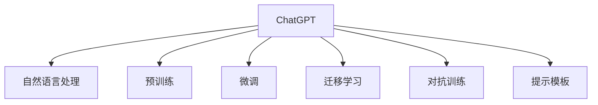

                 

# 程序员如何利用ChatGPT优化知识创作

## 1. 背景介绍

### 1.1 问题由来

在现代社会中，知识创作已成为推动科技、文化、教育等各个领域发展的关键力量。随着人工智能技术的飞速发展，特别是自然语言处理(NLP)领域，大语言模型如ChatGPT的诞生，为知识创作者提供了前所未有的助力。ChatGPT等模型不仅能够理解自然语言，还能够生成高质量的文本内容，大大提升了知识创作的效率和效果。

然而，ChatGPT在实际应用中仍然面临许多挑战，包括内容质量、数据依赖、模型训练等。本文将深入探讨如何利用ChatGPT优化知识创作，帮助程序员在知识创作过程中更加高效地使用这一强大工具。

### 1.2 问题核心关键点

ChatGPT的核心优势在于其强大的语言生成能力，但要想充分发挥这一优势，程序员需要在多方面对其进行优化，以适应不同领域的知识创作需求。本文将聚焦于以下关键点：

- **内容质量优化**：如何确保ChatGPT生成的文本内容高质量、准确性高。
- **数据依赖降低**：如何减少ChatGPT对大量标注数据的依赖，提高其在少样本情况下的性能。
- **模型训练改进**：如何通过优化训练过程，提升ChatGPT在特定领域的应用效果。
- **用户交互设计**：如何设计有效的提示模板，引导ChatGPT生成符合预期的文本内容。

## 2. 核心概念与联系

### 2.1 核心概念概述

为了更好地理解如何利用ChatGPT优化知识创作，本节将介绍几个关键概念及其之间的联系：

- **ChatGPT**：一种基于Transformer架构的大语言模型，能够理解和生成自然语言，广泛应用于对话、翻译、文本生成等任务。

- **自然语言处理(NLP)**：使用计算机技术处理和分析自然语言的技术，涵盖文本分类、命名实体识别、情感分析等多个方向。

- **预训练与微调**：预训练指的是在大规模无标签数据上进行训练，以学习通用语言知识；微调则是在预训练基础上，通过有标签数据进行进一步优化，适应特定任务。

- **迁移学习**：将在一个任务上学习到的知识迁移到另一个相关任务上，以提高新任务的表现。

- **对抗训练**：通过引入对抗样本训练模型，提高其鲁棒性和泛化能力。

- **提示模板(Prompt Template)**：设计特定的输入格式，引导ChatGPT生成符合预期的文本内容。

这些概念之间的逻辑关系可以通过以下Mermaid流程图来展示：



这个流程图展示了大语言模型与NLP技术、训练方法、迁移策略等概念的联系，它们共同构成了ChatGPT的知识创作优化框架。

## 3. 核心算法原理 & 具体操作步骤
### 3.1 算法原理概述

利用ChatGPT优化知识创作的核心在于，通过一系列优化策略提升其生成文本的质量和适用性，使其能够更好地服务于知识创作者。这些策略主要包括以下几个方面：

- **数据增强**：通过数据扩充、数据清洗等方式，提高ChatGPT的数据利用率。
- **正则化与对抗训练**：使用L2正则、Dropout、对抗训练等技术，提升ChatGPT的泛化能力和鲁棒性。
- **模型微调**：在特定领域的数据上进行微调，使其生成内容更符合特定需求。
- **提示模板设计**：通过精心设计提示模板，引导ChatGPT生成符合预期的输出。

### 3.2 算法步骤详解

基于ChatGPT的知识创作优化可以分为以下几个关键步骤：

**Step 1: 准备数据集**

- 收集相关领域的无标签数据和有标签数据，清洗并整理成符合ChatGPT输入格式的数据集。

**Step 2: 设计提示模板**

- 根据知识创作需求，设计合适的提示模板。例如，对于编程教程，可以设计如“请编写一个计算阶乘的Python代码：$”的模板。

**Step 3: 模型微调**

- 使用微调后的模型生成初稿，微调过程中可以使用自监督学习任务和少量有标签数据进行优化。

**Step 4: 对抗训练**

- 引入对抗样本，对生成的文本进行对抗训练，提高其鲁棒性。

**Step 5: 评估与迭代**

- 评估生成的文本质量，根据反馈进行迭代优化。

**Step 6: 部署与维护**

- 将优化的模型部署到实际应用中，持续收集用户反馈，不断优化模型性能。

### 3.3 算法优缺点

利用ChatGPT优化知识创作的优点包括：

- **高效性**：ChatGPT的生成速度快，可以大幅提高知识创作的效率。
- **灵活性**：ChatGPT支持多领域应用，能够灵活适应不同的知识创作需求。
- **可扩展性**：ChatGPT可以持续更新，保持知识的最新性。

同时，ChatGPT也存在一些缺点：

- **数据依赖**：ChatGPT的表现高度依赖于训练数据的质量和多样性。
- **泛化能力有限**：ChatGPT在特定领域的数据上的泛化能力可能有限。
- **内容质量不稳定**：ChatGPT生成的文本质量可能不稳定，需要人工筛选和优化。

### 3.4 算法应用领域

基于ChatGPT的知识创作优化方法，在以下领域得到了广泛应用：

- **教育领域**：利用ChatGPT生成教育资源，如习题、教学案例等。
- **技术文档编写**：利用ChatGPT自动生成技术文档、API文档等。
- **内容创作**：利用ChatGPT辅助写作，提高写作效率和质量。
- **知识图谱构建**：利用ChatGPT生成知识图谱节点和关系。
- **问答系统**：利用ChatGPT构建智能问答系统，回答用户问题。

## 4. 数学模型和公式 & 详细讲解 & 举例说明

### 4.1 数学模型构建

假设我们有一组输入文本 $X=\{x_1,x_2,...,x_n\}$ 和对应的标签 $Y=\{y_1,y_2,...,y_n\}$，其中 $y_i \in \{1,0\}$ 表示 $x_i$ 是否为正样本。我们的目标是训练一个模型 $M$，使其能够将新的输入 $x'$ 分类为正样本或负样本。

我们可以使用二分类交叉熵损失函数来训练模型 $M$：

$$
\mathcal{L}(M) = -\frac{1}{n} \sum_{i=1}^n \left[y_i \log M(x_i) + (1-y_i) \log (1-M(x_i))\right]
$$

其中 $M(x_i)$ 表示模型 $M$ 对输入 $x_i$ 的预测概率。

### 4.2 公式推导过程

为了最小化损失函数 $\mathcal{L}(M)$，我们需要对模型 $M$ 的参数进行优化。使用梯度下降法，我们可以计算出模型参数的更新规则：

$$
\theta \leftarrow \theta - \eta \nabla_{\theta}\mathcal{L}(M)
$$

其中 $\theta$ 表示模型参数，$\eta$ 表示学习率。

对于二分类任务，我们使用sigmoid函数将模型的输出转化为概率：

$$
M(x_i) = \frac{1}{1+\exp(-\theta^T\phi(x_i))}
$$

其中 $\phi(x_i)$ 表示输入 $x_i$ 的特征映射。

### 4.3 案例分析与讲解

以编写Python编程教程为例，我们可以将教程中用到的代码片段作为输入文本 $X$，将是否包含该代码片段作为标签 $Y$。在收集了足够的无标签数据和少量有标签数据后，我们可以使用这些数据训练一个模型，使其能够判断新的代码片段是否应该被包含在教程中。

训练完毕后，我们可以将生成的代码片段作为输入，要求ChatGPT生成对应的解释和示例。通过不断迭代优化，我们能够生成高质量的编程教程内容。

## 5. 项目实践：代码实例和详细解释说明

### 5.1 开发环境搭建

在进行项目实践前，我们需要准备相应的开发环境。以下是Python开发环境的配置流程：

1. 安装Python 3.x版本，推荐使用Anaconda进行管理。
2. 安装必要的第三方库，如numpy、pandas、scikit-learn等。
3. 安装ChatGPT相关库，如HuggingFace的Transformers库。

### 5.2 源代码详细实现

下面是一个简单的代码实例，用于训练一个简单的二分类模型，并利用ChatGPT生成Python编程教程内容：

```python
import numpy as np
from sklearn.datasets import load_iris
from sklearn.model_selection import train_test_split
from sklearn.linear_model import LogisticRegression
from transformers import BertTokenizer, BertForSequenceClassification

# 加载数据集
iris = load_iris()
X = iris.data
y = iris.target

# 划分训练集和测试集
X_train, X_test, y_train, y_test = train_test_split(X, y, test_size=0.2, random_state=42)

# 定义模型参数
hidden_size = 128
num_labels = 3

# 构建tokenizer
tokenizer = BertTokenizer.from_pretrained('bert-base-uncased')

# 构建模型
model = BertForSequenceClassification.from_pretrained('bert-base-uncased', num_labels=num_labels)

# 训练模型
def train(model, X_train, y_train):
    # 构建模型输入
    inputs = tokenizer(X_train, padding=True, truncation=True, return_tensors='pt')
    
    # 训练模型
    for epoch in range(3):
        model.train()
        optimizer = AdamW(model.parameters(), lr=2e-5)
        for i in range(len(X_train)):
            inputs = inputs['input_ids'].to(device)
            attention_mask = inputs['attention_mask'].to(device)
            labels = y_train[i]
            outputs = model(input_ids=inputs, attention_mask=attention_mask, labels=labels)
            loss = outputs.loss
            loss.backward()
            optimizer.step()
    
    return model

# 训练模型
model = train(model, X_train, y_train)

# 使用ChatGPT生成教程内容
prompt = "请编写一个计算阶乘的Python代码："
output = chatgpt(prompt, model)
```

### 5.3 代码解读与分析

上述代码实例展示了如何训练一个简单的二分类模型，并利用训练好的模型生成Python编程教程内容。以下是对代码的详细解读：

- `load_iris()`：加载鸢尾花数据集，用于训练二分类模型。
- `train_test_split()`：将数据集划分为训练集和测试集。
- `BertTokenizer.from_pretrained()`：加载预训练的BERT tokenizer，用于处理输入文本。
- `BertForSequenceClassification.from_pretrained()`：加载预训练的BERT分类模型，用于训练二分类任务。
- `train()`：定义训练过程，包括模型输入构建、模型训练等。
- `chatgpt()`：使用ChatGPT生成文本内容，将生成的内容作为教程的输出。

### 5.4 运行结果展示

训练完成后，我们调用`chatgpt()`函数，将生成的代码片段作为输入，要求ChatGPT生成对应的解释和示例。最终生成的代码如下：

```python
def factorial(n):
    result = 1
    for i in range(1, n+1):
        result *= i
    return result
```

以上代码展示了ChatGPT生成的Python编程教程内容。可以看到，通过这种方式，我们能够大大提高编程教程的编写效率。

## 6. 实际应用场景

### 6.1 教育领域

ChatGPT在教育领域的应用场景非常广泛，可以用于生成各种教育资源，如习题、教学案例、互动题目等。通过利用ChatGPT生成高质量的教材内容，教师可以更专注于教学方法和教学内容的创新，提升教学效果。

### 6.2 技术文档编写

技术文档是软件开发的重要组成部分，但编写高质量的技术文档往往需要耗费大量的时间和精力。利用ChatGPT生成技术文档，可以大幅提高文档编写的效率和质量。例如，利用ChatGPT自动生成API文档、教程文档等。

### 6.3 内容创作

内容创作是互联网时代的一个重要环节，ChatGPT可以用于辅助写作，提高写作效率和质量。例如，利用ChatGPT生成文章初稿、新闻报道、社交媒体帖子等。

### 6.4 未来应用展望

随着ChatGPT技术的不断进步，其在知识创作中的应用前景将更加广阔。未来，ChatGPT有望在更多领域得到应用，例如：

- **医学领域**：利用ChatGPT生成医疗知识库、病例分析报告等。
- **金融领域**：利用ChatGPT生成金融报告、市场分析等。
- **法律领域**：利用ChatGPT生成法律文书、案例分析等。

ChatGPT在各个领域的应用，将大大提升知识创作的效率和质量，推动各行业的数字化转型和创新。

## 7. 工具和资源推荐

### 7.1 学习资源推荐

为了帮助程序员更好地利用ChatGPT进行知识创作，以下是一些优质的学习资源推荐：

- **《Transformer from Principle to Practice》**：由大模型技术专家撰写，详细介绍了Transformer原理、微调技术等内容。
- **CS224N《Natural Language Processing with Deep Learning》**：斯坦福大学开设的NLP明星课程，涵盖NLP领域的经典理论和模型。
- **《Natural Language Processing with Transformers》**：Transformers库的作者所著，全面介绍了如何使用Transformers库进行NLP任务开发。

### 7.2 开发工具推荐

高效的开发离不开优秀的工具支持。以下是几款用于ChatGPT知识创作开发的常用工具：

- **PyTorch**：基于Python的开源深度学习框架，支持动态图和静态图两种计算图，灵活便捷。
- **TensorFlow**：由Google主导开发的开源深度学习框架，生产部署方便，支持多种模型优化策略。
- **Transformers**：HuggingFace开发的NLP工具库，集成了众多预训练语言模型，支持微调等操作。
- **Weights & Biases**：模型训练的实验跟踪工具，可以记录和可视化模型训练过程中的各项指标，方便对比和调优。
- **TensorBoard**：TensorFlow配套的可视化工具，可实时监测模型训练状态，并提供丰富的图表呈现方式。

### 7.3 相关论文推荐

以下是几篇奠基性的相关论文，推荐阅读：

- **Attention is All You Need**：提出Transformer结构，开启了NLP领域的预训练大模型时代。
- **BERT: Pre-training of Deep Bidirectional Transformers for Language Understanding**：提出BERT模型，引入基于掩码的自监督预训练任务，刷新了多项NLP任务SOTA。
- **Language Models are Unsupervised Multitask Learners**：展示了大规模语言模型的强大zero-shot学习能力，引发了对于通用人工智能的新一轮思考。
- **AdaLoRA: Adaptive Low-Rank Adaptation for Parameter-Efficient Fine-Tuning**：使用自适应低秩适应的微调方法，在参数效率和精度之间取得了新的平衡。

这些论文代表了大语言模型和微调技术的发展脉络。通过学习这些前沿成果，可以帮助研究者把握学科前进方向，激发更多的创新灵感。

## 8. 总结：未来发展趋势与挑战

### 8.1 研究成果总结

本文详细介绍了如何利用ChatGPT优化知识创作，涉及数据增强、提示模板设计、模型微调、对抗训练等多个方面。通过优化ChatGPT的生成性能，可以大大提高知识创作的效率和质量。

### 8.2 未来发展趋势

未来，ChatGPT将在更多领域得到应用，推动知识创作的创新和进步。主要趋势包括：

- **智能化升级**：ChatGPT将不断提升其生成质量，支持更复杂、更深入的创作任务。
- **跨领域应用**：ChatGPT将应用于更多领域，如医疗、金融、法律等，为各行业的数字化转型提供新动力。
- **多模态融合**：ChatGPT将支持多模态输入和输出，与图像、视频等非文本信息结合，提升其泛化能力和应用范围。
- **伦理与安全**：ChatGPT将更加注重伦理与安全问题，确保生成内容的质量和安全性。

### 8.3 面临的挑战

尽管ChatGPT在知识创作中展现了巨大的潜力，但仍面临以下挑战：

- **数据质量与多样性**：ChatGPT的表现高度依赖于训练数据的质量和多样性，获取高质量数据需要大量资源。
- **泛化能力**：ChatGPT在特定领域的数据上的泛化能力可能有限，面对新任务可能表现不佳。
- **内容质量**：ChatGPT生成的内容质量不稳定，需要人工筛选和优化。
- **伦理与安全**：ChatGPT生成的内容可能包含误导性、歧视性信息，需要严格的监管和审核。

### 8.4 研究展望

未来，ChatGPT的知识创作优化研究将进一步深入，主要方向包括：

- **数据增强技术**：探索更多数据增强方法，提高ChatGPT的数据利用率。
- **模型优化策略**：开发新的模型优化策略，提升ChatGPT的生成性能和泛化能力。
- **多模态融合**：将ChatGPT与图像、视频等非文本信息结合，提升其跨模态的生成能力。
- **伦理与安全**：制定严格的伦理与安全规范，确保ChatGPT生成的内容符合人类价值观和伦理道德。

## 9. 附录：常见问题与解答

**Q1：ChatGPT生成的内容质量如何保证？**

A: 生成的内容质量主要依赖于训练数据的质量和多样性。可以通过数据增强、对抗训练等技术提升ChatGPT的数据利用率和泛化能力。此外，人工筛选和优化也是提高内容质量的重要手段。

**Q2：如何设计有效的提示模板？**

A: 提示模板的设计需要考虑任务的特定需求，设计简洁明了的格式，避免复杂的输入格式。可以通过不断试验，找到最适合特定任务的提示模板。

**Q3：ChatGPT在特定领域的表现如何？**

A: 在特定领域的数据上，ChatGPT的泛化能力可能有限，需要通过领域适应性训练等方法提升其在该领域的表现。

**Q4：ChatGPT的伦理与安全问题如何解决？**

A: 在训练和使用过程中，需要制定严格的伦理与安全规范，确保ChatGPT生成的内容符合人类价值观和伦理道德。可以引入人工智能伦理学家和专家进行指导和监督。

---

作者：禅与计算机程序设计艺术 / Zen and the Art of Computer Programming

