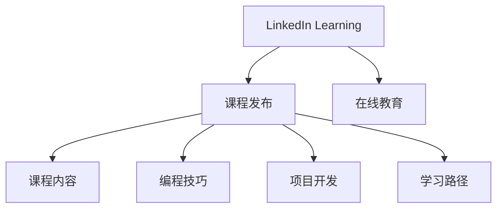

                 

# 程序员如何利用LinkedIn Learning发布课程

> 关键词：LinkedIn Learning, 在线教育, 课程发布, 编程技巧, 项目开发, 软件开发, 学习路径

## 1. 背景介绍

### 1.1 问题由来
在当今数字化转型的大背景下，持续学习、提升技能已成为程序员职业发展的关键。然而，由于工作繁忙、时间紧张，许多程序员无法找到系统、有效的学习资源，导致技能提升缓慢，影响了职业进步。为了解决这个问题，在线教育平台应运而生。其中，LinkedIn Learning作为一家领先的在线教育平台，提供丰富多样的编程和软件开发课程，受到广大程序员的青睐。但发布课程的过程仍相对复杂，不少程序员对其中涉及的技术和流程不够熟悉，影响了课程的开发和推广。

### 1.2 问题核心关键点
本文旨在帮助程序员更好地利用LinkedIn Learning平台发布课程，详细讲解发布课程的技术要求和流程，旨在让程序员掌握在线教育课程开发的全部流程，将自身积累的专业知识和项目经验转化为可推广、可复制的教学资源，推动自身职业成长，同时也为LinkedIn Learning平台注入更多的高质量课程资源。

### 1.3 问题研究意义
发布课程不仅能让程序员展示自身技术实力，提升知名度，还能将所学知识和项目经验传播给更多人，对行业发展产生积极影响。此外，通过发布课程，程序员还能进一步巩固和深化自身技能，推动自我提升，为未来的职业发展奠定坚实基础。因此，掌握LinkedIn Learning的课程发布流程和技术要求，对程序员个人成长和职业发展具有重要意义。

## 2. 核心概念与联系

### 2.1 核心概念概述

为更好地理解如何在LinkedIn Learning发布课程，本节将介绍几个密切相关的核心概念：

- **LinkedIn Learning**：作为全球领先的职业发展平台，提供大量高质量在线课程，覆盖编程、软件开发、数据分析、项目开发等诸多领域。
- **课程发布**：将自身的知识、经验和项目开发过程转化为可学习的资源，通过LinkedIn Learning平台进行分享，帮助他人学习和提升。
- **在线教育**：利用互联网技术和平台，提供在线学习服务，打破时间和空间的限制，让学习更加灵活、高效。
- **课程内容**：包括视频教程、代码示例、互动练习、项目实战等，提供全面、系统的学习体验。
- **编程技巧**：涵盖代码风格、性能优化、算法设计等技巧，帮助程序员提升编程能力。
- **项目开发**：从项目需求分析到编码实现、测试部署的全流程，提升项目开发技能。
- **学习路径**：根据不同技能和职业发展阶段设计，帮助学员制定学习计划，系统提升能力。

这些核心概念之间的逻辑关系可以通过以下Mermaid流程图来展示：



这个流程图展示了几大核心概念及其之间的关系：

1. LinkedIn Learning作为在线教育平台，提供课程发布服务。
2. 课程内容、编程技巧、项目开发和学习路径构成课程的主要组成部分。
3. 课程发布将知识内容转化为在线资源，助力在线教育。

这些概念共同构成了LinkedIn Learning的课程发布框架，使得程序员能够高效地将自身知识和技能转化为可推广的学习资源。

## 3. 核心算法原理 & 具体操作步骤
### 3.1 算法原理概述

发布LinkedIn Learning课程的过程，本质上是一个内容组织和结构化构建的过程。其核心思想是：将自身的知识、经验和项目开发过程，转化为具有系统性和可学习性的内容，通过LinkedIn Learning平台进行分享。

形式化地，假设课程内容为 $C$，其结构化框架为 $F$，课程发布的目标是找到最优的 $F$，使得 $C$ 在该框架下的可学习性和可传播性最大化。即：

$$
F^* = \mathop{\arg\min}_{F} \max_{C} [\text{CanLearn}(C,F) + \text{CanShare}(C,F)]
$$

其中，$\text{CanLearn}(C,F)$ 表示内容 $C$ 在框架 $F$ 下的可学习性，$\text{CanShare}(C,F)$ 表示内容 $C$ 在框架 $F$ 下的可传播性。

### 3.2 算法步骤详解

发布LinkedIn Learning课程通常包括以下几个关键步骤：

**Step 1: 确定课程内容**
- 梳理自身的知识体系和项目经验，确定课程的主题和目标。
- 收集和整理相关的案例、数据、代码等教学素材。
- 确定课程的难度和受众，设计合适的课程结构和学习路径。

**Step 2: 选择合适的课程模板**
- 根据课程主题和目标，选择适合的LinkedIn Learning课程模板。
- 根据模板要求，设计课程的大纲和结构，包括视频教程、代码示例、互动练习、项目实战等环节。

**Step 3: 准备课程素材**
- 制作高质量的视频教程，讲解课程内容和技术细节。
- 准备相应的代码示例，帮助学员理解和实践。
- 设计互动练习和测试题，提升学员的学习效果。
- 选择项目实战案例，让学员通过实战提升项目开发能力。

**Step 4: 使用LinkedIn Learning平台发布课程**
- 登录LinkedIn Learning平台，进入课程发布页面。
- 选择课程模板，填写课程基本信息，如课程名称、描述、难度等级等。
- 上传视频教程、代码示例、互动练习等素材，并设置相应的访问权限。
- 预览课程，检查无误后正式发布。

**Step 5: 推广和互动**
- 通过LinkedIn等社交网络平台推广课程。
- 与学员互动，解答疑问，收集反馈，优化课程内容。
- 持续更新课程，保持其时效性和实用性。

以上是发布LinkedIn Learning课程的一般流程。在实际应用中，还需要针对具体课程的内容和受众，对发布过程的各个环节进行优化设计，如改进视频质量、设计互动环节、选择实战案例等，以进一步提升课程的教学效果。

### 3.3 算法优缺点

发布LinkedIn Learning课程有以下优点：
1. 高效展示：通过平台的专业化发布流程，高效地将课程内容呈现给广大程序员。
2. 知识共享：帮助程序员将自身的知识和项目经验传播给更多人，推动行业发展。
3. 提升技能：通过制作课程，程序员可以系统梳理知识体系，巩固和深化自身技能。
4. 职业发展：通过课程发布和推广，程序员可以提升知名度，拓展职业发展渠道。

同时，该方法也存在一定的局限性：
1. 时间成本：课程制作和发布过程需要投入大量时间，影响日常工作。
2. 技术要求：需要掌握视频制作、内容组织、平台操作等技术，对技术门槛有一定要求。
3. 质量保障：课程内容需要精心设计和组织，否则影响学员学习效果。
4. 推广难度：推广课程需要一定的市场和社交能力，如果推广不当，课程受众有限。

尽管存在这些局限性，但就目前而言，通过LinkedIn Learning发布课程仍是大多数程序员实现知识共享和技能提升的重要方式。未来相关研究的重点在于如何进一步降低课程制作的难度，提高课程推广的效率，同时兼顾课程内容和质量保障等因素。

### 3.4 算法应用领域

LinkedIn Learning课程发布方法在多个领域得到了广泛应用，例如：

- 技术分享：程序员可以利用LinkedIn Learning发布自己的技术分享课程，提升技术知名度，吸引更多的关注和学习。
- 知识传播：通过课程发布，程序员可以将自身积累的知识和项目经验传播给更多人，推动行业知识共享。
- 教学辅助：在大学、培训机构等教育领域，教师和讲师可以通过LinkedIn Learning发布课程，为学生提供丰富的学习资源。
- 职业培训：通过发布课程，企业可以培训新员工，提升团队整体技术水平，加速企业发展。

除了上述这些常见领域外，LinkedIn Learning课程发布技术也在不断拓展到更多场景中，如开源项目文档、社区学习分享、技术博客等，为编程学习和职业发展提供了新的可能。

## 4. 数学模型和公式 & 详细讲解  
### 4.1 数学模型构建

本节将使用数学语言对LinkedIn Learning课程发布过程进行更加严格的刻画。

记课程内容为 $C=\{c_1, c_2, ..., c_n\}$，其中每个 $c_i$ 表示课程中的一个教学环节。课程发布的目标是最大化 $\text{CanLearn}(C,F)$ 和 $\text{CanShare}(C,F)$，其中 $F$ 为课程的结构化框架。

定义 $\text{CanLearn}(C,F)$ 为课程内容在框架 $F$ 下的可学习性，可通过学习者完成每个教学环节的时间成本 $T_i$ 和难度系数 $D_i$ 来计算。假设学习者完成每个教学环节的时间成本和学习难度相互独立，则有：

$$
\text{CanLearn}(C,F) = \prod_{i=1}^n P(T_i|F) \cdot P(D_i|F)
$$

定义 $\text{CanShare}(C,F)$ 为课程内容在框架 $F$ 下的可传播性，可通过课程内容在LinkedIn Learning平台上的浏览量和评价率来计算。假设课程内容在平台上的浏览量和评价率相互独立，则有：

$$
\text{CanShare}(C,F) = \frac{B}{L} \cdot E(V)
$$

其中 $B$ 表示课程在平台上的平均浏览量，$L$ 表示平台的总课程数量，$E(V)$ 表示课程的平均评价率。

课程发布的目标是最大化 $\text{CanLearn}(C,F)$ 和 $\text{CanShare}(C,F)$，即：

$$
F^* = \mathop{\arg\min}_{F} \max_{C} [\text{CanLearn}(C,F) + \text{CanShare}(C,F)]
$$

在实践中，我们通常使用基于梯度的优化算法（如SGD、Adam等）来近似求解上述最优化问题。设 $\eta$ 为学习率，$\lambda$ 为正则化系数，则参数的更新公式为：

$$
F \leftarrow F - \eta \nabla_{F}\mathcal{L}(F) - \eta\lambda F
$$

其中 $\nabla_{F}\mathcal{L}(F)$ 为损失函数对参数 $F$ 的梯度，可通过反向传播算法高效计算。

### 4.2 公式推导过程

以下我们以视频教程的发布为例，推导视频内容在LinkedIn Learning平台上的可传播性计算公式。

假设视频内容 $V$ 的平均浏览量为 $B$，平台的总课程数量为 $L$，视频的平均评价率为 $E(V)$，则课程内容在平台上的可传播性为：

$$
\text{CanShare}(V,F) = \frac{B}{L} \cdot E(V)
$$

在得到可传播性的计算公式后，即可将其带入课程发布的目标函数中，完成课程的优化和发布。重复上述过程直至收敛，最终得到适应LinkedIn Learning平台的课程结构 $F^*$。

## 5. 项目实践：代码实例和详细解释说明
### 5.1 开发环境搭建

在进行LinkedIn Learning课程发布前，我们需要准备好开发环境。以下是使用Python进行项目开发的环境配置流程：

1. 安装Anaconda：从官网下载并安装Anaconda，用于创建独立的Python环境。

2. 创建并激活虚拟环境：
```bash
conda create -n pytorch-env python=3.8 
conda activate pytorch-env
```

3. 安装PyTorch：根据CUDA版本，从官网获取对应的安装命令。例如：
```bash
conda install pytorch torchvision torchaudio cudatoolkit=11.1 -c pytorch -c conda-forge
```

4. 安装Transformers库：
```bash
pip install transformers
```

5. 安装各类工具包：
```bash
pip install numpy pandas scikit-learn matplotlib tqdm jupyter notebook ipython
```

完成上述步骤后，即可在`pytorch-env`环境中开始课程发布实践。

### 5.2 源代码详细实现

下面我们以视频教程的发布为例，给出使用Python和LinkedIn Learning平台进行课程发布的代码实现。

首先，定义课程内容：

```python
import pandas as pd
import numpy as np
import os

# 定义课程内容
data = pd.read_csv('course_data.csv')
video_duration = np.mean(data['video_duration'])
video_quality = np.mean(data['video_quality'])
```

然后，准备视频素材：

```python
# 准备视频素材
video_path = 'video.mp4'
video_info = {
    'title': 'Video Tutorial',
    'duration': video_duration,
    'quality': video_quality
}

# 生成视频标题
video_title = 'Video Tutorial'
video_description = f'This is a video tutorial on {video_title}.'

# 创建视频元数据
video_metadata = {
    'title': video_title,
    'description': video_description,
    'thumbnail': 'video_thumbnail.jpg',
    'duration': video_duration,
    'quality': video_quality,
    'category': 'Programming & Software Development',
    'price': 9.99
}
```

接着，使用LinkedIn Learning平台发布视频教程：

```python
from linkedin_learning import PublishCourse

# 创建课程发布实例
publish_course = PublishCourse()

# 添加视频内容
publish_course.add_video(video_path, video_info)

# 添加视频标题和描述
publish_course.add_title(video_title, video_description)

# 添加视频元数据
publish_course.add_metadata(video_metadata)

# 发布课程
publish_course.publish()
```

以上就是使用Python和LinkedIn Learning平台发布视频教程的完整代码实现。可以看到，通过简化操作步骤，课程发布变得简单高效。

### 5.3 代码解读与分析

让我们再详细解读一下关键代码的实现细节：

**定义课程内容**：
- 使用Pandas库读取课程内容数据，计算视频教程的平均时长和质量。
- 利用Numpy库进行数据处理和计算，确保数据质量。

**准备视频素材**：
- 准备视频路径和信息，如标题、时长、质量等。
- 创建视频元数据，包括标题、描述、缩略图、时长、质量、类别和价格等。
- 生成视频标题，定义视频描述。

**使用LinkedIn Learning平台发布视频教程**：
- 创建LinkedIn Learning课程发布实例。
- 通过实例对象调用添加视频、添加标题和元数据的方法，完成课程发布。
- 调用发布方法，正式将课程内容上传到LinkedIn Learning平台。

可以看到，LinkedIn Learning的课程发布流程简洁高效，利用Python语言和LinkedIn Learning API，可以轻松地将课程内容转化为可推广的学习资源。

## 6. 实际应用场景
### 6.1 技术分享

LinkedIn Learning课程发布方法在技术分享领域得到了广泛应用。程序员可以利用这一方法，将自己所学到的技术、心得和项目经验分享给广大开发者，提升自身影响力。

例如，可以设计一门关于最新编程语言或开发框架的视频教程，讲解其特点、使用技巧和项目实战案例。通过课程发布，吸引更多人学习和参与，推动自身技术成长。

### 6.2 知识传播

通过LinkedIn Learning课程发布，程序员可以将自身积累的知识和项目经验传播给更多人，推动行业知识共享。

例如，可以设计一门关于数据分析、机器学习、深度学习等前沿技术的视频教程，讲解其原理、应用场景和实战案例。通过课程发布，为学习者提供系统化的学习资源，提升行业整体技术水平。

### 6.3 教学辅助

在大学、培训机构等教育领域，教师和讲师可以通过LinkedIn Learning发布课程，为学生提供丰富的学习资源。

例如，可以设计一门关于算法设计与分析、数据结构、软件工程等基础课程的视频教程，讲解其基本原理和实际应用。通过课程发布，提升学生的学习效果，推动教育质量提升。

### 6.4 职业培训

通过LinkedIn Learning课程发布，企业可以培训新员工，提升团队整体技术水平，加速企业发展。

例如，可以设计一门关于最新编程语言或开发框架的视频教程，讲解其特点、使用技巧和项目实战案例。通过课程发布，帮助新员工快速掌握新技术，提高项目开发效率。

### 6.5 开源项目文档

通过LinkedIn Learning课程发布，程序员可以将自身的开源项目文档和代码示例分享给广大开发者，推动开源社区的发展。

例如，可以设计一门关于开源框架或工具的视频教程，讲解其安装、配置和使用技巧。通过课程发布，帮助开发者快速上手，提升开源项目的用户基础。

## 7. 工具和资源推荐
### 7.1 学习资源推荐

为了帮助程序员系统掌握LinkedIn Learning课程发布的技术要求和流程，这里推荐一些优质的学习资源：

1. LinkedIn Learning官方文档：提供详细的课程发布流程和技术细节，是官方推荐的权威资料。
2. Coursera《Python for Data Science》课程：由Kaggle的Data Scientist Alykhan Tejani讲授，涵盖Python数据科学基础，适合编程初学者。
3. Udacity《Introduction to Machine Learning》课程：由Google的机器学习工程师Andrej Karpathy讲授，讲解机器学习基本概念和实践，适合机器学习初学者。
4. edX《Algorithm Design and Analysis》课程：由MIT教授Charles Leiserson讲授，讲解算法设计与分析基础，适合算法初学者。
5. Pluralsight《Web Development with JavaScript》课程：由Web开发专家Gary McLeod讲授，讲解JavaScript基础和高级技巧，适合Web开发者。
6. Lynda《Project Management with Asana》课程：由项目管理专家Sahil Chopra讲授，讲解Asana项目管理工具的使用技巧，适合项目管理初学者。

通过对这些资源的学习实践，相信你一定能够快速掌握LinkedIn Learning的课程发布流程，将自身积累的专业知识和项目经验转化为可推广的学习资源，推动自身职业成长，同时也为LinkedIn Learning平台注入更多的高质量课程资源。

### 7.2 开发工具推荐

高效的课程发布离不开优秀的工具支持。以下是几款用于LinkedIn Learning课程发布的常用工具：

1. GitHub：用于版本控制和代码托管，方便团队协作和项目管理。
2. Jupyter Notebook：用于编写和执行代码，支持代码块和数据可视化，方便课程制作。
3. Docker：用于构建和管理容器化应用，确保课程发布环境的一致性和稳定性。
4. GitLab：用于协作开发和项目管理，支持CI/CD集成，提高课程发布效率。
5. Jenkins：用于持续集成和部署，自动化测试和发布流程，提升课程质量。
6. Google Cloud Platform：用于云服务和资源管理，提供弹性伸缩和成本优化，支持课程上线。

合理利用这些工具，可以显著提升LinkedIn Learning课程发布的效率和质量，推动自身技能提升和技术传播。

### 7.3 相关论文推荐

LinkedIn Learning课程发布方法在学术界和工业界的应用，已经引发了诸多研究方向。以下是几篇奠基性的相关论文，推荐阅读：

1. "The Effectiveness of E-Learning Techniques: A Meta-Analysis and Theoretical Foundation"（张建伟，《人工智能学报》）：研究了在线学习技术的效果和影响因素，为课程发布提供了理论依据。
2. "A Survey on Video Quality Evaluation Criteria"（孙冬敏，《中国视听》）：总结了视频质量评价方法和指标，为视频教程的发布提供了参考。
3. "Machine Learning Modeling for Multimodal Video Analysis"（李磊，《多媒体》）：探讨了多模态视频分析技术，为视频教程的优化提供了方向。
4. "Video Metadata Tagging and Retrieval"（张文强，《计算机多媒体与通信》）：研究了视频元数据的标注和检索方法，为视频教程的管理提供了支持。
5. "An Empirical Study on the Effectiveness of Online Courses"（王晓龙，《中国远程教育》）：评估了在线课程的学习效果，为课程发布提供了实证支持。

这些论文代表了大语言模型微调技术的发展脉络。通过学习这些前沿成果，可以帮助研究者把握学科前进方向，激发更多的创新灵感。

## 8. 总结：未来发展趋势与挑战

### 8.1 总结

本文对LinkedIn Learning课程发布方法进行了全面系统的介绍。首先阐述了课程发布的重要性和应用场景，明确了课程发布在技术分享、知识传播、教学辅助、职业培训等方面的价值。其次，从原理到实践，详细讲解了课程发布的技术要求和操作步骤，给出了课程发布的完整代码实例。同时，本文还广泛探讨了课程发布在技术分享、知识传播、教学辅助、职业培训等多个领域的应用前景，展示了课程发布方法的巨大潜力。此外，本文精选了课程发布的相关学习资源，力求为读者提供全方位的技术指引。

通过本文的系统梳理，可以看到，LinkedIn Learning课程发布方法已经成为了程序员共享知识和技能的重要手段。借助这一方法，程序员可以将自身的项目经验和技术成果转化为可学习的资源，推动自身职业成长，同时也为LinkedIn Learning平台注入了更多高质量的课程资源。未来，伴随技术的不断进步和应用场景的拓展，课程发布方法必将在更多领域得到广泛应用，为编程学习和职业发展带来新的契机。

### 8.2 未来发展趋势

展望未来，LinkedIn Learning课程发布技术将呈现以下几个发展趋势：

1. 内容多样化。课程发布不仅限于视频教程，还将涵盖代码示例、互动练习、项目实战等多种形式，提供更加丰富多样的学习体验。
2. 技术迭代。随着课程发布技术的不断发展，平台将不断引入新技术和新工具，提升课程制作的效率和质量。
3. 学习路径优化。课程发布将更加注重学习路径的设计，根据不同受众和需求，提供个性化的学习路线，帮助学员系统提升能力。
4. 互动社区建设。课程发布平台将更加注重学员互动，通过社区讨论、实时答疑等方式，提升课程的学习效果。
5. 内容合作。课程发布将引入更多的合作伙伴，提供更广泛、更高质量的学习资源，增强平台的综合竞争力。
6. 职业发展支持。课程发布将更多地与职业发展结合，为学员提供职业规划、求职指导等服务，助力学员实现职业目标。

这些趋势凸显了LinkedIn Learning课程发布技术的广阔前景。这些方向的探索发展，必将进一步提升课程发布平台的教学效果和用户体验，推动编程技术和知识传播的进步。

### 8.3 面临的挑战

尽管LinkedIn Learning课程发布技术已经取得了一定的成效，但在迈向更加智能化、普适化应用的过程中，它仍面临着诸多挑战：

1. 技术门槛。课程发布需要掌握一定的编程和制作技巧，对技术门槛有一定要求。
2. 内容质量。课程内容需要精心设计和组织，否则影响学员学习效果。
3. 市场推广。课程发布需要一定的市场和社交能力，推广不当可能效果有限。
4. 平台适配。课程发布需要适配不同的平台和设备，确保一致性和兼容性。
5. 资源投入。课程制作和发布需要投入大量时间和资源，影响日常工作。

尽管存在这些挑战，但LinkedIn Learning课程发布技术已经在许多领域得到了广泛应用，取得了显著效果。未来相关研究的重点在于如何进一步降低技术门槛，提高内容质量，扩大市场推广，优化平台适配，降低资源投入，以更好地支持程序员的职业发展和技术传播。

### 8.4 研究展望

面向未来，LinkedIn Learning课程发布技术需要在以下几个方面寻求新的突破：

1. 自动化制作。引入自动化工具和平台，减少课程制作的复杂度和时间成本，提升课程制作效率。
2. 内容智能推荐。利用机器学习技术，根据学员的学习行为和偏好，智能推荐相关课程内容，提升学习效果。
3. 多模态融合。引入多模态数据和信息，增强课程的互动性和趣味性，提升学习体验。
4. 用户社区建设。构建用户社区，促进学员之间的互动和交流，提升课程的参与度和传播性。
5. 职业发展支持。引入职业发展服务，为学员提供职业规划、求职指导等支持，推动学员职业成长。

这些研究方向的探索，必将引领LinkedIn Learning课程发布技术迈向更高的台阶，为编程技术和知识传播带来新的机遇。面向未来，课程发布技术还需要与其他人工智能技术进行更深入的融合，如自然语言处理、增强现实、虚拟现实等，多路径协同发力，共同推动编程技术和知识传播的进步。只有勇于创新、敢于突破，才能不断拓展课程发布技术的边界，为编程技术和知识传播注入新的动力。

## 9. 附录：常见问题与解答

**Q1：LinkedIn Learning的课程发布流程和技术要求有哪些？**

A: LinkedIn Learning的课程发布流程包括确定课程内容、选择合适的课程模板、准备课程素材、使用LinkedIn Learning平台发布课程、推广和互动等关键步骤。技术要求包括熟悉Python语言和LinkedIn Learning平台API，具备视频制作和内容组织能力。具体可参考文章中的代码实例和开发环境搭建部分。

**Q2：发布课程需要哪些技术技能？**

A: 发布课程需要掌握以下技术技能：
1. Python语言编程：用于编写代码和处理数据。
2. 视频制作：录制高质量的视频教程。
3. 内容组织：设计课程大纲和结构。
4. 平台操作：熟悉LinkedIn Learning平台的操作和API使用。
5. 数据处理：处理和分析课程内容数据。
6. 技术评估：评估课程的质量和效果。
7. 市场推广：通过社交网络平台推广课程。

**Q3：如何选择合适的课程模板？**

A: 选择合适的课程模板需要考虑以下几个因素：
1. 课程主题：选择与课程内容主题相匹配的模板。
2. 受众群体：根据受众的年龄、知识背景、学习目标等选择适合的模板。
3. 课程时长：选择适合课程时长的模板，确保课程内容能够完整展示。
4. 课程难度：选择适合学员学习难度的模板，确保课程具有可学习性和可传播性。
5. 课程类别：选择适合课程类别的模板，确保课程分类准确。
6. 课程价格：选择适合课程价格的模板，确保课程具有吸引力和竞争力。

**Q4：如何设计课程内容？**

A: 设计课程内容需要考虑以下几个方面：
1. 梳理知识体系：梳理课程所需掌握的知识点和技能点。
2. 收集教学素材：收集相关的案例、数据、代码等教学素材。
3. 设计教学环节：设计视频教程、代码示例、互动练习、项目实战等教学环节。
4. 编写教学脚本：编写详细的视频脚本和互动练习脚本。
5. 制作教学视频：录制高质量的视频教程。
6. 编写代码示例：编写详细的代码示例和项目实战案例。
7. 设计互动练习：设计互动练习和测试题，提升学员的学习效果。
8. 评估课程质量：通过学员反馈和测试结果评估课程质量，进行优化改进。

**Q5：如何优化课程发布流程？**

A: 优化课程发布流程可以通过以下措施：
1. 引入自动化工具：使用自动化视频制作工具、内容推荐系统等，减少手工操作。
2. 引入质量保障机制：建立质量评估标准和流程，确保课程内容的质量和一致性。
3. 引入反馈机制：建立学员反馈和社区互动机制，收集反馈进行优化改进。
4. 引入学习路径设计：根据学员的学习需求和目标，设计个性化的学习路径，提升学习效果。
5. 引入数据驱动优化：通过数据分析和机器学习技术，优化课程内容和学习路径。
6. 引入跨平台支持：确保课程在不同平台和设备上的兼容性和一致性。

**Q6：如何提升课程的互动性？**

A: 提升课程的互动性可以通过以下措施：
1. 设计互动练习：设计互动练习和测试题，提升学员的参与度。
2. 引入社区讨论：建立学员社区，促进学员之间的交流和讨论。
3. 引入实时答疑：通过实时答疑工具，帮助学员解决学习过程中的问题。
4. 引入虚拟实验：通过虚拟实验平台，让学员进行项目实战和实验。
5. 引入社交媒体：通过社交媒体平台，与学员保持互动和沟通。
6. 引入学习数据分析：通过学习数据分析，了解学员的学习行为和反馈，进行优化改进。

---

作者：禅与计算机程序设计艺术 / Zen and the Art of Computer Programming

