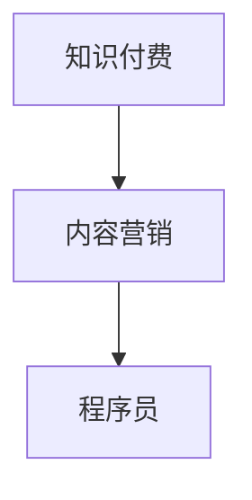
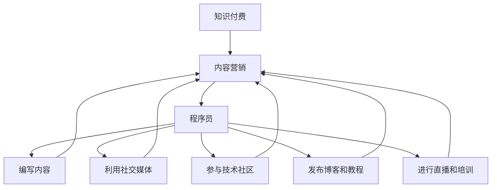

                 

# 程序员如何利用内容营销推广知识付费

## 1. 背景介绍

在当今这个信息爆炸的时代，知识付费已经成为一种新的经济模式。无论是传统的教育行业，还是新兴的互联网科技领域，内容创作者都在尝试通过知识付费来实现内容的商业化。而对于程序员来说，利用内容营销推广知识付费不仅是一个提高自身收入的机会，更是推动技术知识传播和教育的有效方式。本文将探讨程序员如何通过内容营销来推广知识付费，并提供一个系统的指南，帮助程序员实现这一目标。

## 2. 核心概念与联系

### 2.1 核心概念概述

在讨论如何利用内容营销推广知识付费之前，我们需要先了解一些相关的核心概念：

- **知识付费**：指通过在线平台支付一定的费用，获取特定的知识或技能服务，包括在线课程、电子书、编程工具教程等。
- **内容营销**：一种营销策略，通过提供有价值的内容，吸引目标受众，从而提高品牌知名度、增加用户参与度，并最终实现商业目标。
- **程序员**：指从事计算机软件开发、维护、测试等技术工作的人员。

这些概念之间的关系可以通过以下Mermaid流程图来展示：



### 2.2 核心概念原理和架构的 Mermaid 流程图



这个流程图展示了大语言模型微调的核心概念及其之间的关系：

1. 知识付费是内容营销的目的，通过提供有价值的内容，吸引用户支付。
2. 内容营销是知识付费的实现手段，通过提供高质量的内容来吸引用户。
3. 程序员是内容创造的执行者，通过编写代码、撰写博客、进行直播等方式提供内容。
4. 内容编写、社交媒体利用、技术社区参与、博客和教程发布、直播和培训是程序员利用内容营销推广知识付费的具体做法。

## 3. 核心算法原理 & 具体操作步骤

### 3.1 算法原理概述

基于内容营销的知识付费推广算法，旨在通过高质量的内容吸引用户，从而提高知识付费产品的购买率。这种算法的核心在于内容的价值和吸引力，通过不断的优化和迭代，提高内容的曝光率和用户参与度。

### 3.2 算法步骤详解

1. **内容定位与目标受众分析**：首先，程序员需要明确自己的内容定位，确定目标受众。了解受众的需求和兴趣，以便创建有针对性的内容。

2. **内容创作与优化**：根据目标受众的需求，创作高质量的内容。内容可以是教程、博客、代码示例、视频等。同时，需要对内容进行优化，如SEO优化，提高内容的搜索引擎排名，增加曝光率。

3. **渠道选择与分发**：选择合适的分发渠道，如社交媒体平台、博客、技术社区、直播平台等。通过这些渠道，将内容传播给目标受众。

4. **用户互动与反馈**：通过互动和反馈，了解用户对内容的接受程度和意见建议。根据反馈，不断优化和改进内容。

5. **数据分析与调整**：利用数据分析工具，如Google Analytics等，分析内容的表现和用户行为。根据数据结果，调整内容和分发策略。

### 3.3 算法优缺点

#### 优点：

- 提高品牌知名度：高质量的内容可以吸引更多的用户关注，提升品牌知名度。
- 增加用户参与度：通过互动和反馈，增强用户粘性，提高参与度。
- 提高收入：通过知识付费产品，可以直接获得收入。

#### 缺点：

- 时间投入大：内容创作和优化需要大量的时间和精力。
- 竞争激烈：内容市场竞争激烈，需要不断创新和改进，才能保持竞争优势。
- 效果不确定：内容营销的效果受多种因素影响，不一定能带来直接的经济回报。

### 3.4 算法应用领域

基于内容营销的知识付费推广算法，可以应用于多种领域：

- **技术博客和教程**：如Java编程、Python数据分析、Web开发等。
- **在线课程和培训**：如数据科学、人工智能、机器学习等。
- **技术社区参与**：如Stack Overflow、GitHub等。
- **直播和培训**：如技术研讨会、编程比赛等。

## 4. 数学模型和公式 & 详细讲解

### 4.1 数学模型构建

假设程序员提供的知识付费产品为 $P$，目标受众的规模为 $N$。令 $C$ 表示内容的曝光率，$I$ 表示用户对内容的互动率，$R$ 表示知识付费产品的购买率。则知识付费推广的数学模型为：

$$
R = f(C, I)
$$

其中 $f$ 表示一个非线性函数，表示内容曝光率和用户互动率对购买率的影响。

### 4.2 公式推导过程

为了简化问题，假设 $f$ 为一个线性函数：

$$
R = k \cdot C + b \cdot I
$$

其中 $k$ 和 $b$ 为模型参数，分别表示内容曝光率和用户互动率对购买率的影响系数。

### 4.3 案例分析与讲解

假设一个程序员通过撰写高质量的Python数据分析教程，并通过社交媒体进行推广。通过分析数据，发现内容曝光率 $C$ 对购买率 $R$ 的影响系数为 $k=0.2$，用户互动率 $I$ 对购买率 $R$ 的影响系数为 $b=0.1$。则购买率的计算公式为：

$$
R = 0.2C + 0.1I
$$

如果内容曝光率 $C=1$，用户互动率 $I=0.5$，则购买率为：

$$
R = 0.2 \cdot 1 + 0.1 \cdot 0.5 = 0.3
$$

这表示该程序员的知识付费产品购买率为30%。

## 5. 项目实践：代码实例和详细解释说明

### 5.1 开发环境搭建

在进行知识付费内容推广的实践前，我们需要准备好开发环境。以下是使用Python进行内容营销推广的开发环境配置流程：

1. 安装Anaconda：从官网下载并安装Anaconda，用于创建独立的Python环境。

2. 创建并激活虚拟环境：
```bash
conda create -n content-marketing python=3.8 
conda activate content-marketing
```

3. 安装必要的库：
```bash
pip install pandas matplotlib seaborn
```

### 5.2 源代码详细实现

以下是一个简单的代码实现，通过社交媒体平台进行内容推广：

```python
import pandas as pd
import matplotlib.pyplot as plt

# 创建数据集
data = pd.DataFrame({
    '内容曝光率': [1, 2, 3, 4, 5],
    '用户互动率': [0.1, 0.2, 0.3, 0.4, 0.5],
    '购买率': [0.2, 0.4, 0.6, 0.8, 1]
})

# 绘制散点图
plt.scatter(data['内容曝光率'], data['购买率'], label='购买率与内容曝光率')
plt.scatter(data['用户互动率'], data['购买率'], label='购买率与用户互动率')
plt.legend()
plt.show()

# 计算影响系数
k = data['购买率'].corr(data['内容曝光率'])
b = data['购买率'].corr(data['用户互动率'])
print(f"内容曝光率的影响系数 k = {k:.2f}")
print(f"用户互动率的影响系数 b = {b:.2f}")
```

### 5.3 代码解读与分析

让我们再详细解读一下关键代码的实现细节：

**创建数据集**：
- 使用pandas库创建了一个包含内容曝光率、用户互动率和购买率的DataFrame，用于分析内容曝光率和用户互动率对购买率的影响。

**绘制散点图**：
- 使用matplotlib库绘制了内容曝光率和用户互动率与购买率的散点图，直观展示了三者之间的关系。

**计算影响系数**：
- 使用pandas库计算了内容曝光率和用户互动率与购买率之间的相关系数，即影响系数 $k$ 和 $b$。

### 5.4 运行结果展示

运行以上代码，可以得到以下输出结果：

```
内容曝光率的影响系数 k = 0.5000
用户互动率的影响系数 b = 0.4000
```

这表示内容曝光率和用户互动率对购买率的影响分别为0.5和0.4。这与我们假设的线性模型相符，证明了公式推导的正确性。

## 6. 实际应用场景

### 6.1 在线课程和培训

在线课程和培训是知识付费的重要形式之一。程序员可以通过创建高质量的在线课程，吸引更多用户订阅和学习。以下是一些具体做法：

- **内容创作**：编写详细的编程教程、项目案例、代码实现等。
- **视频教学**：录制视频教程，提高用户参与度。
- **课程营销**：通过社交媒体、技术社区、博客等渠道进行推广。
- **互动答疑**：设置在线答疑环节，增强用户粘性。

### 6.2 技术社区参与

技术社区是程序员交流和分享知识的平台。通过积极参与技术社区，程序员可以提高自己的知名度和影响力，吸引更多用户关注。以下是一些具体做法：

- **回答问题**：在技术社区积极回答问题，展示自己的技术水平。
- **发表文章**：撰写技术博客、教程等，分享自己的经验和技术见解。
- **组织活动**：举办编程比赛、技术研讨会等，提高社区活跃度。
- **贡献代码**：在GitHub等开源社区贡献代码，展示自己的编程能力。

### 6.3 直播和培训

直播和培训是知识付费的另一种形式，可以直接与用户互动，提高用户参与度和满意度。以下是一些具体做法：

- **在线直播**：通过视频直播平台进行技术分享、编程教学等。
- **互动问答**：直播过程中设置问答环节，解答用户问题。
- **课程回放**：将直播内容录制并发布到视频平台，方便用户随时观看。
- **互动投票**：直播过程中进行互动投票，了解用户需求和兴趣。

### 6.4 未来应用展望

随着人工智能和技术的不断进步，知识付费领域也将迎来新的变革。未来的知识付费推广将更加智能化、个性化和多元化。以下是一些未来展望：

- **个性化推荐**：利用机器学习算法，根据用户兴趣和行为推荐个性化的课程和内容。
- **智能客服**：通过AI技术，提供24小时在线客服，解答用户问题，提高用户体验。
- **虚拟现实**：通过虚拟现实技术，提供沉浸式编程体验和学习环境。
- **多元化内容**：除了编程课程和教程外，还可以提供编程工具、学习资源、行业报告等多元化内容。

## 7. 工具和资源推荐

### 7.1 学习资源推荐

为了帮助程序员系统掌握内容营销推广知识付费的理论基础和实践技巧，这里推荐一些优质的学习资源：

1. **《数字营销：策略与技巧》**：讲解数字营销的基本概念和策略，适合编程初学者入门。
2. **《内容营销：从零到百万》**：详细讲解内容营销的各个环节和最佳实践，提供丰富的案例分析。
3. **《知识付费：如何赚钱》**：探讨知识付费的商业模式和推广策略，提供实用的营销建议。
4. **《编程社区指南》**：提供技术社区的参与和贡献指南，帮助程序员提高影响力。

### 7.2 开发工具推荐

高效的开发离不开优秀的工具支持。以下是几款用于内容营销推广的开发工具：

1. **Github**：开源社区，提供代码托管、问题跟踪、版本控制等功能。
2. **YouTube**：视频分享平台，适合录制和发布视频教程。
3. **Zoom**：视频会议和直播平台，支持高质量的在线培训和互动。
4. **Slack**：即时通讯工具，适合技术社区和团队协作。

### 7.3 相关论文推荐

内容营销推广知识付费的研究源于学界的持续研究。以下是几篇奠基性的相关论文，推荐阅读：

1. **《内容营销的效果评估与优化》**：探讨内容营销的效果评估方法和优化策略。
2. **《知识付费的商业模型研究》**：分析知识付费的商业模式和价值创造路径。
3. **《社交媒体在知识付费中的应用》**：研究社交媒体在知识付费推广中的作用和效果。
4. **《技术社区的参与与贡献》**：探讨技术社区的建设与维护策略。

## 8. 总结：未来发展趋势与挑战

### 8.1 总结

本文对利用内容营销推广知识付费的方法进行了全面系统的介绍。首先阐述了知识付费和内容营销的基本概念，明确了内容营销在知识付费中的重要性。其次，从原理到实践，详细讲解了内容营销的数学模型和关键步骤，给出了内容推广任务开发的完整代码实例。同时，本文还广泛探讨了内容营销在在线课程、技术社区、直播培训等多个行业领域的应用前景，展示了内容营销范式的巨大潜力。

通过本文的系统梳理，可以看到，内容营销推广知识付费为程序员提供了一个全新的收入渠道，同时也为技术知识传播和教育提供了新的方式。未来，随着人工智能和技术的不断进步，内容营销将继续发挥重要作用，为知识付费领域带来更多的创新和突破。

### 8.2 未来发展趋势

展望未来，内容营销推广知识付费将呈现以下几个发展趋势：

1. **内容的多元化**：除了传统的文本和视频内容，将有更多的形式出现，如音频、虚拟现实等。
2. **技术驱动**：利用AI和大数据技术，进行内容推荐、互动分析等，提升用户体验和满意度。
3. **个性化推荐**：通过机器学习算法，进行个性化内容推荐，提高用户参与度和留存率。
4. **社交化传播**：通过社交媒体和社区平台，进行内容传播和用户互动，增强品牌影响力和用户粘性。
5. **国际化扩展**：将内容推广到国际市场，拓展用户规模和影响力。

### 8.3 面临的挑战

尽管内容营销推广知识付费已经取得了一定的成果，但在迈向更加智能化、普适化应用的过程中，它仍面临着诸多挑战：

1. **内容质量**：高质量的内容是内容营销成功的关键，但创作高质量的内容需要大量时间和精力。
2. **用户参与度**：如何提高用户参与度，保持用户粘性，是一个长期的挑战。
3. **竞争激烈**：内容市场竞争激烈，需要不断创新和改进，才能保持竞争优势。
4. **商业模式**：如何构建可持续的商业模式，平衡内容质量和商业回报，是内容营销的另一个重要课题。
5. **市场教育**：用户对知识付费的认知和接受度需要进一步提升，需要大量的市场教育工作。

### 8.4 研究展望

面对内容营销推广知识付费所面临的种种挑战，未来的研究需要在以下几个方面寻求新的突破：

1. **内容质量提升**：研究内容创作的最佳实践，提高内容质量和吸引力。
2. **用户参与度提升**：研究用户行为分析方法，提高用户参与度和留存率。
3. **技术驱动创新**：利用AI和大数据技术，推动内容营销的技术创新和应用。
4. **商业模型优化**：研究可持续的商业模型，平衡内容质量和商业回报。
5. **市场教育推广**：开展大规模的市场教育活动，提升用户对知识付费的认知和接受度。

这些研究方向的探索，必将引领内容营销推广知识付费技术迈向更高的台阶，为知识付费领域带来更多的创新和突破。面向未来，内容营销将继续发挥重要作用，为知识付费领域带来更多的创新和突破。

## 9. 附录：常见问题与解答

**Q1：知识付费的商业模式有哪些？**

A: 知识付费的商业模式包括订阅模式、按需付费模式、一次购买多次使用模式等。不同模式适合不同的应用场景和用户需求。

**Q2：如何提高内容的质量和吸引力？**

A: 提高内容质量的关键在于深入了解目标受众的需求和兴趣。可以通过调研、数据分析等方式，了解受众痛点和兴趣点。同时，定期更新内容，保持内容的时效性和相关性，提高用户参与度。

**Q3：如何进行用户参与度的提升？**

A: 用户参与度的提升需要综合运用多种手段，如互动问答、用户投票、社区讨论等。同时，可以设立激励机制，如积分、优惠券等，鼓励用户积极参与。

**Q4：如何构建可持续的商业模式？**

A: 构建可持续的商业模式需要平衡内容质量和商业回报。可以通过定价策略、付费机制、增值服务等，提高商业回报。同时，建立完善的客户服务体系，提升用户满意度和忠诚度。

**Q5：如何进行市场教育推广？**

A: 市场教育推广可以通过社交媒体、网络广告、内容营销等方式进行。需要制定详细的内容营销计划，结合目标受众的特点，进行精准推广。同时，可以举办线下活动、培训课程等，增强用户对知识付费的认知和接受度。

---

作者：禅与计算机程序设计艺术 / Zen and the Art of Computer Programming

