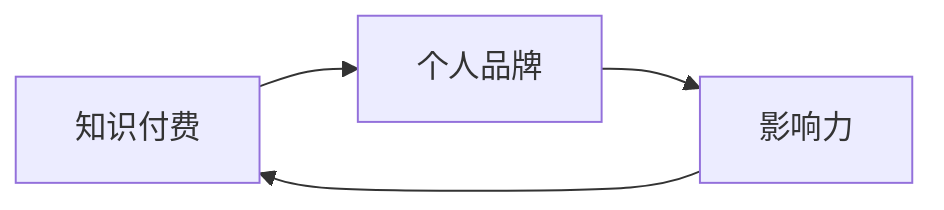

                 

# 程序员如何利用知识付费打造个人品牌与影响力

> 关键词：知识付费, 程序员, 个人品牌, 影响力, 技术社区, 教育平台, 专业博客, 网络课程

## 1. 背景介绍

在信息技术飞速发展的今天，程序员不仅需要具备扎实的技术能力，还需要在个人品牌与影响力方面有所建树。知识付费作为互联网时代的新趋势，为程序员提供了一个崭新的展示平台。通过知识付费，程序员可以将自身的技术知识和经验转化为高价值的个人品牌与影响力，实现自我价值与职业发展的双赢。本文将探讨程序员如何利用知识付费打造个人品牌与影响力，并分析其背后的原理与过程。

## 2. 核心概念与联系

### 2.1 核心概念概述

在深入探讨如何利用知识付费打造个人品牌与影响力之前，首先需要理解几个核心概念：

- **知识付费**：指用户为获取知识和技能而支付费用的商业模式。这种模式利用了知识资源的价值，通过市场机制实现知识与资金的匹配。

- **个人品牌**：指通过展示个人技能、成就和专业知识，在特定领域内建立独特且可识别的形象和声誉。个人品牌对于职业发展和市场竞争力至关重要。

- **影响力**：指个体在特定领域内对他人思想、行为或决策产生影响的能力。影响力的大小通常与个人品牌密切相关。

### 2.2 核心概念联系

知识付费、个人品牌与影响力之间存在密切的联系。具体来说：

- **知识付费与个人品牌**：知识付费平台为个人品牌建设提供了舞台。程序员通过在知识付费平台上发布内容，向用户展示自己的专业能力，逐渐建立起个人品牌。

- **个人品牌与影响力**：在建立个人品牌的基础上，程序员可以逐渐扩大其影响力。随着品牌知名度的提升，程序员的影响力也将随之增强。

- **影响力与知识付费**：程序员通过提升自身影响力，能够吸引更多用户关注，从而增加知识付费内容的需求，形成良性循环。

这些概念之间的联系可以通过以下Mermaid流程图来展示：



## 3. 核心算法原理 & 具体操作步骤

### 3.1 算法原理概述

利用知识付费打造个人品牌与影响力的过程，本质上是一个基于用户反馈的强化学习过程。程序员通过发布高质量的内容，不断优化自己的知识和技能，同时吸引更多用户关注和付费。在这一过程中，程序员通过用户反馈不断调整自己的内容策略，提升个人品牌价值和影响力。

具体而言，这个过程包括以下几个步骤：

1. **内容发布**：程序员在知识付费平台上发布技术文章、视频教程、编程实战等内容。
2. **用户互动**：内容发布后，用户进行阅读、评论、点赞和付费等互动。
3. **反馈分析**：程序员根据用户反馈，分析内容受欢迎程度和用户需求，调整内容策略。
4. **品牌提升**：通过高质量内容吸引用户关注，提升个人品牌知名度。
5. **影响扩大**：随着个人品牌知名度的提升，影响力和付费用户数不断增加。

### 3.2 算法步骤详解

以下是详细的操作步骤：

1. **选择平台**：根据自身的技术特长和兴趣领域，选择适合的知识付费平台，如CSDN、知乎、Coursera等。

2. **内容定位**：明确自己的内容定位，选择适合的平台和内容类型。例如，技术博客、编程实战视频、课程讲授等。

3. **内容创作**：根据选定的内容和平台，创作高质量的内容。内容应具备以下特点：
   - **深度**：内容应具备深度和广度，能够满足不同层次用户的需求。
   - **实用**：内容应具有实用性和可操作性，解决实际问题，有明确的示例和代码。
   - **结构**：内容应结构清晰，条理分明，易于理解。

4. **内容发布**：在选定的平台上发布内容，并通过各种渠道进行推广，如社交媒体、技术社区、博客等。

5. **用户互动**：积极与用户互动，解答疑问，接受反馈。通过评论、点赞、付费等互动，了解用户需求和兴趣。

6. **反馈分析**：根据用户反馈，分析内容受欢迎程度和用户需求，调整内容策略。例如，通过数据分析工具，了解哪些内容最受欢迎，哪些主题用户最感兴趣。

7. **品牌提升**：通过持续发布高质量内容，逐步提升个人品牌知名度。在内容中突出个人特点，如独特的技术视角、解决问题的创新方法等。

8. **影响扩大**：随着个人品牌知名度的提升，影响力和付费用户数不断增加。可以利用积累的用户基础，推出新的课程、咨询或合作项目。

### 3.3 算法优缺点

利用知识付费打造个人品牌与影响力的方法具有以下优点：

- **高效性**：知识付费模式可以快速积累粉丝和付费用户，加速个人品牌与影响力的建立。
- **灵活性**：程序员可以灵活选择内容形式和平台，根据市场需求和个人兴趣调整内容策略。
- **盈利性**：通过高质量内容获得用户付费，实现技术价值变现。

同时，该方法也存在一定的局限性：

- **竞争激烈**：知识付费市场竞争激烈，需要持续创新和保持内容质量。
- **市场认知度**：个人品牌的建立需要时间，初期可能面临用户认知度低的问题。
- **内容沉淀**：高质量内容需要时间和精力沉淀，短期内难以见效。

### 3.4 算法应用领域

知识付费打造个人品牌与影响力的方法，不仅适用于技术领域，还广泛适用于各个行业。以下是几个典型应用领域：

- **技术教育**：通过知识付费平台教授编程、数据科学、人工智能等技术课程，传授专业技能。
- **技术咨询**：利用自身技术优势，提供技术方案咨询、代码审查、项目诊断等服务。
- **技术培训**：组织线上线下技术培训、工作坊，传授实践经验，帮助他人提升技术能力。
- **技术写作**：通过博客、书籍等形式，发布技术文章，传播技术知识。
- **技术创业**：将技术知识和经验转化为商业项目，形成新的创业机会。

## 4. 数学模型和公式 & 详细讲解 & 举例说明

### 4.1 数学模型构建

我们可以用数学模型来表示程序员利用知识付费打造个人品牌与影响力的过程。设程序员的初始品牌价值为 $B_0$，每发布一篇内容，品牌价值增加量与内容受欢迎程度成正比，即：

$$
B_{t+1} = B_t + f(C_t)
$$

其中 $B_t$ 表示第 $t$ 次发布内容后的品牌价值，$C_t$ 表示第 $t$ 次发布的内容受欢迎程度，$f(\cdot)$ 为映射函数。

### 4.2 公式推导过程

设每次发布的内容受欢迎程度为 $C_t$，则：

$$
C_t = \alpha p_t + (1-\alpha) h_t
$$

其中 $\alpha$ 为内容互动权重，$p_t$ 为内容互动指标（如阅读量、点赞数、评论数），$h_t$ 为内容质量指标（如内容深度、结构清晰度、用户满意度）。

进一步，设每次互动带来的品牌价值增加量为 $D_t$，则：

$$
D_t = \beta P_t
$$

其中 $\beta$ 为互动带来的品牌价值增长率，$P_t$ 为每次互动带来的品牌价值增长量。

根据上述公式，可以得到品牌价值更新的递推公式：

$$
B_{t+1} = B_t + \beta \alpha p_t + \beta (1-\alpha) h_t
$$

### 4.3 案例分析与讲解

假设程序员小李在知识付费平台CSDN上发布了一篇关于深度学习实践的文章，文章获得了500次阅读、50次点赞、10条评论，平均满意度为4星（满分5星）。设互动权重 $\alpha = 0.6$，内容质量权重 $\beta = 0.4$，则：

$$
C_t = 0.6 \times 500 + 0.4 \times 4 = 980
$$

$$
D_t = 0.4 \times 0.6 \times 500 = 120
$$

假设小李的初始品牌价值为100，则第 $t+1$ 次发布内容后的品牌价值为：

$$
B_{t+1} = 100 + 120 = 220
$$

通过不断发布高质量内容，小李的品牌价值和影响力逐渐提升，最终成为该领域的知名专家。

## 5. 项目实践：代码实例和详细解释说明

### 5.1 开发环境搭建

要在知识付费平台上发布内容，首先需要搭建开发环境。具体步骤如下：

1. **选择合适的知识付费平台**：根据自身领域和目标用户选择适合的平台，如CSDN、知乎、Coursera等。

2. **注册并完善个人资料**：在选定的平台上注册账号，完善个人资料和博客设置。

3. **选择发布平台**：根据内容类型和目标用户，选择合适的发布平台，如CSDN文章、知乎回答、Coursera课程等。

4. **准备内容**：准备发布的内容，包括文字、代码、图片等。

5. **发布内容**：在平台上发布内容，并通过各种渠道进行推广，如社交媒体、技术社区、博客等。

### 5.2 源代码详细实现

以在CSDN上发布一篇技术文章为例，详细实现步骤如下：

1. **选择文章类型**：在CSDN上选择文章类型，如编程实践、技术教程、专题讲座等。

2. **撰写文章**：使用Markdown或HTML格式撰写文章内容，包括标题、副标题、正文、代码块、图片等。

3. **添加标签**：为文章添加相关标签，方便用户搜索和阅读。

4. **提交文章**：将文章内容提交到CSDN平台，等待审核通过。

5. **推广文章**：在社交媒体、技术社区、博客等渠道推广文章，吸引更多用户关注。

### 5.3 代码解读与分析

以CSDN文章发布为例，CSDN提供了一个简单易用的Markdown编辑器，支持富文本格式和代码块的输入。以下是一个简单的Markdown代码示例：

```markdown
# 技术文章标题

## 副标题

这是一段Markdown文本。

```python
def add(a, b):
    return a + b
```


更多的Markdown语法和代码块请参考CSDN官方文档。
```

在发布文章时，CSDN提供了文章审核机制，确保发布的内容符合平台规范。发布后，文章会自动出现在用户的博客首页，并通过各种渠道进行推广。用户可以通过阅读、点赞、评论等方式与文章互动。

### 5.4 运行结果展示

以下是CSDN文章发布后的运行结果示例：


## 6. 实际应用场景

### 6.1 技术社区贡献

程序员在技术社区（如Stack Overflow、GitHub、开源项目等）贡献代码、编写技术文章、参与讨论，可以显著提升个人品牌和影响力。通过在社区分享知识和经验，程序员可以逐步建立起自己的技术权威，吸引更多的关注和合作机会。

### 6.2 技术教育

通过知识付费平台教授编程、数据科学、人工智能等技术课程，传授专业技能。例如，在Coursera、Udemy等平台上发布课程，可以通过课程订阅获得收入，同时提升个人品牌和影响力。

### 6.3 技术咨询

利用自身技术优势，提供技术方案咨询、代码审查、项目诊断等服务。在知识付费平台上发布相关服务内容，吸引有需求的用户付费咨询，实现技术价值变现。

### 6.4 技术写作

通过博客、书籍等形式，发布技术文章，传播技术知识。例如，在Medium、博客园等平台上发布技术博客，通过广告、赞助等方式获得收入。

### 6.5 技术创业

将技术知识和经验转化为商业项目，形成新的创业机会。例如，开发自己的应用程序、创业公司等，通过知识付费平台推广产品，实现商业成功。

## 7. 工具和资源推荐

### 7.1 学习资源推荐

要成为一名成功的程序员，首先需要不断学习和积累知识。以下是几份推荐的资源：

1. **《深入理解计算机系统》**：深入介绍计算机系统原理和技术，是编程和系统设计的重要参考。
2. **《Clean Code》**：介绍如何编写干净、可维护的代码，是软件工程的基本指南。
3. **《Python核心编程》**：详细介绍Python语言的高级特性和编程技巧，适合进阶学习。
4. **《算法导论》**：介绍经典算法和数据结构，是算法和数据结构的重要教材。
5. **Coursera、edX、Udacity**：提供大量在线课程，涵盖计算机科学、数据科学、人工智能等领域的知识和技能。

### 7.2 开发工具推荐

程序员在技术开发和项目管理中，需要使用各种工具提高效率。以下是几个推荐的开发工具：

1. **GitHub**：全球最大的代码托管平台，适合版本控制和协作开发。
2. **Visual Studio Code**：轻量级且功能强大的代码编辑器，支持多种语言和插件。
3. **JIRA**：强大的项目管理工具，帮助团队跟踪任务和进度。
4. **Slack**：团队沟通工具，支持即时消息、文件共享和集成其他应用。
5. **Zoom**：视频会议工具，适合远程协作和在线教育。

### 7.3 相关论文推荐

以下是几篇关于知识付费和影响力建设的经典论文，推荐阅读：

1. **《社会网络分析：构建、应用、挖掘和分析》**：介绍如何通过社会网络分析技术来评估和提升个人品牌影响力。
2. **《知识付费平台的用户行为分析》**：研究知识付费平台上用户的行为模式和付费动机，帮助开发者优化内容和策略。
3. **《技术社区对个人品牌的影响》**：分析技术社区中个人品牌建立的机制和策略，探讨如何利用社区平台提升影响力。
4. **《如何利用数据驱动提升技术博客影响力》**：通过数据分析工具，评估技术博客的影响力，优化内容和推广策略。
5. **《知识付费平台的用户付费意愿分析》**：研究用户对知识付费内容的需求和付费意愿，帮助开发者制定合理的定价策略。

## 8. 总结：未来发展趋势与挑战

### 8.1 研究成果总结

本文详细探讨了程序员如何利用知识付费打造个人品牌与影响力，并分析了其背后的原理与过程。通过知识付费平台，程序员可以将自身的技术知识和经验转化为高价值的个人品牌与影响力，实现自我价值与职业发展的双赢。

### 8.2 未来发展趋势

知识付费领域将会继续发展，未来可能会出现以下趋势：

1. **多样化内容形式**：除了文本和视频，将出现更多形式的内容，如直播、音频、交互式课程等。
2. **个性化推荐**：利用人工智能和大数据技术，实现个性化内容推荐，提高用户黏性和满意度。
3. **社区化建设**：知识付费平台将更加注重社区建设，促进用户之间的互动和交流，提升平台的活跃度和影响力。
4. **知识普及化**：知识付费平台将更注重普及化教育，帮助更多人获得知识和技能。
5. **技术融合**：知识付费平台将与更多技术（如区块链、人工智能等）进行融合，提升平台的可靠性和安全性。

### 8.3 面临的挑战

尽管知识付费具有巨大的潜力，但实现个人品牌与影响力的提升也面临一些挑战：

1. **内容质量**：高质量内容的持续输出是提升个人品牌的关键，需要大量时间和精力。
2. **竞争激烈**：知识付费市场竞争激烈，需要持续创新和保持内容质量。
3. **用户需求多样性**：用户需求多样，需要不断调整内容策略，满足不同用户的需求。
4. **平台规则**：不同平台有不同的规则和要求，需要灵活应对和适应。
5. **市场认知度**：个人品牌的建立需要时间，初期可能面临用户认知度低的问题。

### 8.4 研究展望

未来，知识付费将进一步推动个人品牌与影响力的发展，程序员可以借助更多工具和资源，提升自身的技术水平和影响力。以下是一些未来的研究方向：

1. **智能化内容创作**：利用人工智能技术自动生成高质量内容，提升内容创作效率。
2. **社区化合作**：通过技术社区建立更多的合作机会，共同提升个人品牌和影响力。
3. **多平台协同**：在多个知识付费平台上发布内容，扩大影响范围。
4. **跨领域融合**：将知识付费与更多领域进行融合，如教育、健康、娱乐等，形成新的商业模式。
5. **伦理与安全**：关注知识付费平台的安全性和伦理问题，保障用户隐私和数据安全。

总之，知识付费为程序员提供了一个展示自我、提升影响力的新舞台。通过不断学习、创新和合作，程序员可以在这个舞台上实现自我价值的最大化。

## 9. 附录：常见问题与解答

### Q1: 如何选择合适的知识付费平台？

A: 根据自身的技术特长和目标用户，选择适合的平台。例如，CSDN适合技术文章和编程实践，知乎适合技术问答和讨论，Coursera适合系统化课程教学。

### Q2: 如何提升内容的互动率？

A: 提升内容的互动率，需要从内容质量和互动策略两方面入手。例如，在文章中加入代码示例、案例分析等，提升内容的实用性和可操作性。同时，积极与用户互动，回复评论和私信，增加用户粘性。

### Q3: 如何保持内容的持续性？

A: 保持内容的持续性，需要制定合理的内容计划和发布频率。例如，每周发布一篇技术文章，每月发布一次视频教程，确保内容的连续性和稳定性。

### Q4: 如何利用数据分析提升内容策略？

A: 利用数据分析工具，评估内容受欢迎程度和用户需求，调整内容策略。例如，使用Google Analytics等工具，分析访问量、停留时间、页面跳出率等指标，优化内容结构和发布时间。

### Q5: 如何处理社区中的负面评价？

A: 处理社区中的负面评价，需要及时回应和处理。例如，针对负面评价进行深入分析，找出问题所在，并制定改进措施。同时，保持积极态度，耐心听取用户意见，不断提升内容质量和服务水平。

---

作者：禅与计算机程序设计艺术 / Zen and the Art of Computer Programming

