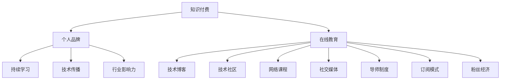

                 

# 程序员如何利用知识付费打造个人影响力

> 关键词：知识付费, 个人品牌, 在线教育, 技术博客, 技术社区, 网络课程, 社交媒体, 导师制度, 订阅模式, 粉丝经济

## 1. 背景介绍

### 1.1 问题由来
在信息爆炸的时代，技术日新月异，职场竞争日益激烈。然而，获取新知识的渠道虽多，却鱼龙混杂，难以分辨真伪。于是，越来越多的程序员开始反思：如何在这信息洪流中突围，打造自己的竞争优势？

### 1.2 问题核心关键点
面对这一问题，答案或许在于**知识付费**。知识付费不仅仅是买卖知识的过程，更是一种价值的传递和信任的建立。通过系统、专业地分享知识，程序员不仅能在技术上精进，还能在个人品牌上构建影响力。

本文将系统探讨程序员如何利用知识付费，打造个人影响力，帮助读者在技术时代找到自己的位置。

## 2. 核心概念与联系

### 2.1 核心概念概述

为更好地理解知识付费的原理和机制，本节将介绍几个密切相关的核心概念：

- **知识付费**：指的是通过付费获取知识和信息的商业模式。其本质是通过支付来获取高价值的知识服务，以提升个人或企业能力的一种方式。

- **个人品牌**：指的是个人在某一领域内通过不断积累知识和经验，形成的专有知识和技能体系，并通过有效传播，在特定受众中建立的影响力和信任度。

- **在线教育**：指通过网络平台提供的学习资源和互动服务，帮助用户自我提升的一种教育方式。

- **技术博客**：指的是程序员分享技术经验、教程和心得的自媒体平台。

- **技术社区**：指程序员相互交流、分享、协作的技术交流平台。

- **网络课程**：指在线提供的系统性、结构化学习内容，涵盖编程语言、算法、数据结构等多个技术领域。

- **社交媒体**：指基于社交网络的交流平台，程序员可通过发布文章、分享项目等方式与同行互动。

- **导师制度**：指通过建立导师与学员间的连结，提供指导和帮助，加速技术人才成长的机制。

- **订阅模式**：指用户定期支付固定费用，获取特定内容或服务的商业模式，如技术博客订阅、付费技术社区等。

- **粉丝经济**：指通过个人或品牌的影响力，吸引粉丝关注并消费的经济模式，常见于技术博客、技术社区等平台。

这些概念之间的关系可以通过以下Mermaid流程图来展示：



这个流程图展示了个体在知识付费体系中，通过不同的渠道和方式，如何不断积累知识，提升个人影响力，并最终转化为商业价值。

## 3. 核心算法原理 & 具体操作步骤
### 3.1 算法原理概述

知识付费和影响力构建的机制，可以归纳为以下核心算法原理：

1. **系统化学习**：通过结构化、系统化的在线课程和博文，帮助用户构建完整的技术知识体系。

2. **持续互动**：通过在线教育平台、技术社区和社交媒体，持续与学员互动，解决问题，分享经验。

3. **质量控制**：通过粉丝和学员的反馈，不断优化课程和文章的质量，提升个人影响力。

4. **品牌打造**：通过稳定的内容输出和高质量的互动服务，逐步建立和巩固个人品牌。

5. **变现策略**：通过订阅、付费课程、广告等变现方式，实现商业价值的积累。

### 3.2 算法步骤详解

基于上述原理，构建知识付费和影响力系统的步骤大致如下：

**Step 1: 知识积累与梳理**
- 选择感兴趣的领域，系统学习相关知识，构建完整的知识体系。
- 通过阅读经典书籍、参加在线课程、观摩开源项目等方式，不断充实自己的技术栈。
- 将知识进行梳理和总结，形成系统化的博客文章或视频教程。

**Step 2: 搭建平台与渠道**
- 选择合适的在线教育平台（如Udemy、Coursera、Bilibili等）或技术社区（如GitHub、Stack Overflow等）搭建个人品牌。
- 开设个人博客或技术专栏，定期发布技术文章和心得。
- 利用社交媒体（如Twitter、LinkedIn、知乎等）扩大影响力，与同行互动。

**Step 3: 提供价值**
- 在平台上发布高质量的课程、文章、项目，解决用户实际问题。
- 与学员进行互动，及时回答疑问，建立信任关系。
- 通过参与开源项目、技术讲座等方式，提升行业影响力。

**Step 4: 运营与变现**
- 通过订阅模式（如技术博客订阅、社区会员制等）收取费用，获取稳定的收入来源。
- 开设付费课程、举办技术讲座，进一步提升个人价值。
- 利用品牌影响力，推广相关产品或服务，实现商业变现。

### 3.3 算法优缺点

知识付费和影响力构建的系统，具有以下优点：

- **知识系统化**：通过系统化学习，帮助用户构建完整的技术知识体系，提升技术水平。
- **互动性强**：持续的互动与反馈，有助于及时解决问题，提升学员满意度和忠诚度。
- **品牌影响力**：通过高质量的内容输出，逐步建立个人品牌，提升行业影响力。
- **商业变现**：通过多种变现方式，实现个人商业价值的积累和提升。

同时，这一系统也存在一些局限性：

- **时间和精力投入大**：构建和维护个人品牌需要持续的时间和精力投入。
- **内容质量要求高**：高质量的内容输出，需要极高的专业水平和创作能力。
- **市场竞争激烈**：在线教育和技术社区竞争激烈，需要不断创新和优化。

尽管如此，知识付费和影响力构建的系统依然为程序员提供了一个全新的发展路径，具有广阔的应用前景。

### 3.4 算法应用领域

知识付费和影响力构建的系统，在以下几个领域有广泛应用：

- **技术教育与培训**：通过知识付费，提供系统化的在线课程和技术培训，帮助学员提升技术能力。
- **技术咨询与辅导**：通过高质量的互动和反馈，提供技术咨询服务，解决用户实际问题。
- **技术项目合作**：利用个人品牌，吸引技术人才和项目合作伙伴，推动技术创新。
- **技术产品推广**：利用品牌影响力，推广相关技术产品，提升商业价值。

## 4. 数学模型和公式 & 详细讲解  
### 4.1 数学模型构建

为更好地理解知识付费和影响力构建的过程，我们可以使用数学模型来刻画。

设程序员知识付费的影响力模型为 $F(u,v)$，其中 $u$ 表示用户获取的知识量，$v$ 表示用户的互动质量（如评论、点赞、付费等）。则模型可以表示为：

$$
F(u,v) = f_k(u) + f_i(v) + f_b(\text{brand})
$$

其中 $f_k(u)$ 表示知识获取对影响力的贡献，$f_i(v)$ 表示互动质量对影响力的贡献，$f_b(\text{brand})$ 表示品牌影响力对影响力的贡献。

### 4.2 公式推导过程

1. **知识获取对影响力的贡献**：
   - $f_k(u) = \alpha u^2$，其中 $\alpha$ 为知识获取对影响力的权重系数。知识获取的边际贡献随知识量增加而递减。

2. **互动质量对影响力的贡献**：
   - $f_i(v) = \beta v$，其中 $\beta$ 为互动质量对影响力的权重系数。互动质量的边际贡献随互动数量线性增加。

3. **品牌影响力对影响力的贡献**：
   - $f_b(\text{brand}) = \gamma \exp(\delta \text{brand})$，其中 $\gamma$ 为品牌影响力对影响力的权重系数，$\delta$ 为品牌影响力的指数衰减系数。品牌影响力随品牌名望指数的增加而指数增长。

### 4.3 案例分析与讲解

以某知名技术博主为例，分析其影响力构建过程：

1. **知识获取**：通过系统化学习，积累大量知识，撰写技术文章。知识获取边际贡献逐渐递减，但整体贡献显著。
   
2. **互动质量**：通过在技术社区活跃互动，获得大量点赞、评论和付费。互动质量贡献随互动数量线性增加，是影响力提升的重要来源。

3. **品牌影响力**：通过持续高质量的内容输出，品牌名望指数不断提升，品牌影响力贡献呈指数增长。

将具体数据代入上述模型，可以计算出该技术博主的综合影响力值 $F(u,v)$。

## 5. 项目实践：代码实例和详细解释说明
### 5.1 开发环境搭建

在进行知识付费和影响力构建实践前，我们需要准备好开发环境。以下是使用Python进行Flask框架开发的环境配置流程：

1. 安装Anaconda：从官网下载并安装Anaconda，用于创建独立的Python环境。

2. 创建并激活虚拟环境：
```bash
conda create -n myenv python=3.8 
conda activate myenv
```

3. 安装Flask：
```bash
pip install Flask
```

4. 安装其它工具包：
```bash
pip install flask_sqlalchemy flask_login Flask-WTF flask_bcrypt flask_wtf
```

完成上述步骤后，即可在`myenv`环境中开始项目开发。

### 5.2 源代码详细实现

下面是一个简单的Flask应用示例，用于展示如何搭建知识付费和个人品牌的平台：

```python
from flask import Flask, render_template, request, redirect, url_for
from flask_sqlalchemy import SQLAlchemy
from flask_login import LoginManager, UserMixin, login_user, logout_user, login_required
from flask_bcrypt import Bcrypt
from flask_wtf import FlaskForm
from wtforms import StringField, PasswordField, SubmitField
from wtforms.validators import DataRequired, Email, EqualTo, ValidationError
from app.models import User, Post

app = Flask(__name__)
app.config['SQLALCHEMY_DATABASE_URI'] = 'sqlite:///app.db'
app.config['SECRET_KEY'] = 'supersecretkey'

db = SQLAlchemy(app)
bcrypt = Bcrypt(app)
login_manager = LoginManager(app)

class User(UserMixin, db.Model):
    id = db.Column(db.Integer, primary_key=True)
    username = db.Column(db.String(80), unique=True, nullable=False)
    email = db.Column(db.String(120), unique=True, nullable=False)
    password = db.Column(db.String(80), nullable=False)

@login_manager.user_loader
def load_user(user_id):
    return User.query.get(int(user_id))

class LoginForm(FlaskForm):
    email = StringField('Email', validators=[DataRequired(), Email()])
    password = PasswordField('Password', validators=[DataRequired()])
    submit = SubmitField('Log In')

class RegisterForm(FlaskForm):
    username = StringField('Username', validators=[DataRequired()])
    email = StringField('Email', validators=[DataRequired(), Email()])
    password = PasswordField('Password', validators=[DataRequired()])
    confirm_password = PasswordField('Confirm Password', validators=[DataRequired(), EqualTo('password')])
    submit = SubmitField('Register')

@app.route('/')
@login_required
def home():
    posts = Post.query.all()
    return render_template('home.html', posts=posts)

@app.route('/register', methods=['GET', 'POST'])
def register():
    form = RegisterForm()
    if form.validate_on_submit():
        hashed_password = bcrypt.generate_password_hash(form.password.data).decode('utf-8')
        new_user = User(username=form.username.data, email=form.email.data, password=hashed_password)
        db.session.add(new_user)
        db.session.commit()
        return redirect(url_for('login'))
    return render_template('register.html', title='Register', form=form)

@app.route('/login', methods=['GET', 'POST'])
def login():
    form = LoginForm()
    if form.validate_on_submit():
        user = User.query.filter_by(email=form.email.data).first()
        if user and bcrypt.check_password_hash(user.password, form.password.data):
            login_user(user)
            return redirect(url_for('home'))
    return render_template('login.html', title='Login', form=form)

@app.route('/logout')
@login_required
def logout():
    logout_user()
    return redirect(url_for('home'))

@app.route('/post', methods=['GET', 'POST'])
@login_required
def post():
    form = PostForm()
    if form.validate_on_submit():
        new_post = Post(title=form.title.data, content=form.content.data, user_id=current_user.id)
        db.session.add(new_post)
        db.session.commit()
        return redirect(url_for('home'))
    return render_template('post.html', title='Post', form=form)

if __name__ == "__main__":
    app.run(debug=True)
```

### 5.3 代码解读与分析

让我们再详细解读一下关键代码的实现细节：

**User模型**：
- 定义了用户的基本信息（用户名、邮箱、密码），并关联至数据库。

**LoginForm和RegisterForm**：
- 定义了登录和注册表单，通过Flask-WTF框架，对表单字段进行验证。

**login_manager**：
- 定义了用户管理器的配置，用于处理用户登录和注册逻辑。

**app.route**：
- 定义了应用程序的路由，通过装饰器`@login_required`实现用户权限管理。

**home、register、login、logout、post**：
- 分别对应首页、注册、登录、注销和发布文章等功能，通过视图函数处理用户请求。

通过这个简单的Flask应用示例，可以看到如何构建一个基本的知识付费和个人品牌平台。在实际应用中，还需要进一步优化，如引入支付功能、文章评论、用户积分等，实现更完善的商业变现策略。

## 6. 实际应用场景
### 6.1 技术教育与培训

技术教育与培训是知识付费的重要应用场景。程序员可以通过在线课程和博文，系统地传授知识，提升学员的技术水平。常见的平台包括Udemy、Coursera、Bilibili等。

具体而言，技术博主可以开设系列课程，涵盖技术栈、算法、数据结构等基础知识，以及项目实战和案例分析。通过在线互动和反馈，帮助学员解决实际问题，提升学习效果。

### 6.2 技术咨询与辅导

技术咨询与辅导是知识付费的另一重要应用场景。程序员可以通过技术社区、在线问答平台等方式，提供个性化的技术咨询服务，解决用户实际问题。

技术博主可以在社区内开设问答专栏，实时回答学员问题，提供定制化解决方案。通过系统化的问题和解决方案，逐步建立行业影响力。

### 6.3 技术项目合作

技术项目合作是知识付费的高级应用场景。程序员可以通过技术博客和社交媒体，展示自己的技术成果和项目案例，吸引志同道合的技术人才，共同开展技术创新。

技术博主可以组织开源项目、技术讲座等活动，结识更多同行，合作开展技术研究。通过技术分享和合作，提升行业影响力，拓展商业机会。

### 6.4 技术产品推广

技术产品推广是知识付费的商业变现场景。程序员可以通过个人品牌和技术影响力，推广自己的技术产品，提升商业价值。

技术博主可以在博客、社交媒体等渠道，展示自己的技术产品和服务。通过粉丝经济，推广产品，获取商业回报。

## 7. 工具和资源推荐
### 7.1 学习资源推荐

为了帮助程序员系统掌握知识付费和影响力构建的理论基础和实践技巧，这里推荐一些优质的学习资源：

1. 《知识付费商业模型》系列博文：由知名创业者和市场专家撰写，深入浅出地介绍了知识付费的商业模式，适合初入者阅读。

2. 《NLP与知识图谱》课程：由斯坦福大学开设的课程，涵盖NLP基础和知识图谱构建，适合进阶学习。

3. 《知识付费之道》书籍：全面介绍了知识付费的理论和实践，包括用户分析、内容创作、商业变现等环节。

4. Coursera《内容创业》课程：涵盖内容创业的各个环节，包括内容创作、品牌建设、商业变现等，适合希望转型为技术博主的程序员。

5. Google Colab：谷歌提供的免费在线Jupyter Notebook环境，适合进行知识付费平台的实验开发和测试。

通过对这些资源的学习实践，相信你一定能够快速掌握知识付费的精髓，并用于解决实际的商业问题。

### 7.2 开发工具推荐

高效的开发离不开优秀的工具支持。以下是几款用于知识付费和影响力构建开发的常用工具：

1. Flask：基于Python的轻量级Web框架，适合快速搭建个人博客和技术社区。

2. Django：基于Python的全功能Web框架，适合大规模应用开发。

3. MySQL：稳定高效的数据库系统，适合存储用户信息和文章内容。

4. Redis：高并发内存数据库，适合存储用户登录信息、文章访问统计等数据。

5. Pyinstaller：将Python应用打包成可执行文件，方便部署和分发。

6. Git：版本控制系统，适合团队协作开发和管理代码。

合理利用这些工具，可以显著提升知识付费平台的开发效率，加快创新迭代的步伐。

### 7.3 相关论文推荐

知识付费和影响力构建的研究源于学界的持续研究。以下是几篇奠基性的相关论文，推荐阅读：

1. "Zero to One: Notes on Startups, or How to Build the Future"（彼得·蒂尔）：揭示知识付费和创业的核心原理，适合理解商业模式。

2. "The Lean Startup"（艾瑞克·莱斯）：介绍了精益创业方法论，适合知识付费平台的实践应用。

3. "The Value Proposition Canvas"（亚历山大·奥斯特瓦尔德）：介绍了价值主张画布工具，适合制定知识付费产品和服务。

4. "A Framework for Building Strong Brands"（凯文·凯勒）：介绍了品牌建设的方法论，适合提升个人品牌影响力。

5. "Brand Echo Chambers"（马克·E·希思）：分析了社交媒体对品牌传播的影响，适合理解粉丝经济。

这些论文代表了大知识付费和影响力构建的发展脉络。通过学习这些前沿成果，可以帮助研究者把握学科前进方向，激发更多的创新灵感。

## 8. 总结：未来发展趋势与挑战
### 8.1 总结

本文对知识付费和影响力构建的原理和实践进行了全面系统的介绍。首先阐述了知识付费和影响力构建的独特价值，明确了这一过程对程序员技术成长和商业变现的积极作用。其次，从原理到实践，详细讲解了知识付费和影响力构建的数学模型和操作步骤，给出了系统化的实践指导。同时，本文还探讨了知识付费和影响力构建在技术教育、咨询辅导、项目合作、产品推广等多个场景中的应用前景，展示了其广阔的发展空间。此外，本文精选了知识付费的相关学习资源，力求为读者提供全方位的技术指引。

通过本文的系统梳理，可以看到，知识付费和影响力构建为程序员提供了一条全新的职业发展路径，具有广阔的应用前景。未来，伴随知识付费平台的持续发展，这一体系必将带来更多商业机会，助力程序员在技术时代找到自己的位置。

### 8.2 未来发展趋势

展望未来，知识付费和影响力构建技术将呈现以下几个发展趋势：

1. **内容多样化**：知识付费平台将不仅提供技术课程，还将涵盖更多生活、文化、管理等领域的知识，满足用户多方面的需求。

2. **社区化互动**：知识付费平台将更加注重社区建设，通过在线讨论、问答、协作等方式，增强用户互动，提升学习效果。

3. **智能推荐**：利用AI技术，知识付费平台将提供个性化的内容推荐，提升用户体验和粘性。

4. **多渠道变现**：知识付费平台将探索更多变现渠道，如会员制、内容订阅、知识付费社群等，实现商业模式的创新。

5. **国际化扩展**：随着全球化进程的加速，知识付费平台将拓展国际市场，为全球用户提供优质的知识服务。

以上趋势凸显了知识付费和影响力构建技术的广阔前景。这些方向的探索发展，必将进一步提升知识付费平台的用户体验和粘性，推动技术教育和知识传播的发展。

### 8.3 面临的挑战

尽管知识付费和影响力构建技术已经取得了瞩目成就，但在迈向更加智能化、普适化应用的过程中，它仍面临着诸多挑战：

1. **用户信任问题**：知识付费平台需要建立用户信任，避免劣质内容泛滥，确保内容质量。

2. **竞争激烈**：在线教育和技术社区竞争激烈，需要不断创新和优化，提升平台竞争力。

3. **商业模式复杂**：知识付费平台涉及知识创作、内容分发、用户互动等多个环节，商业模式复杂，难以快速变现。

4. **知识产权问题**：内容创作涉及版权问题，需要合理处理，避免侵权风险。

5. **技术壁垒高**：知识付费平台需要技术支持，包括系统架构、内容推荐、数据分析等，技术壁垒高，难以快速搭建。

尽管如此，知识付费和影响力构建技术依然为程序员提供了一个全新的发展路径，具有广阔的应用前景。相信随着学界和产业界的共同努力，这些挑战终将一一被克服，知识付费和影响力构建必将在构建人机协同的智能时代中扮演越来越重要的角色。

### 8.4 研究展望

面向未来，知识付费和影响力构建技术需要在以下几个方面寻求新的突破：

1. **技术创新**：开发更加高效、易用的知识付费平台技术，提升用户体验和平台粘性。

2. **内容质量控制**：建立严格的内容审查机制，确保平台内容的高质量和高价值。

3. **社区建设**：注重社区建设，通过互动和反馈，提升用户粘性和参与度。

4. **商业模式优化**：探索更多商业模式，如会员制、内容订阅、知识付费社群等，实现商业变现。

5. **国际化拓展**：拓展国际市场，为全球用户提供优质的知识服务。

这些研究方向的探索，必将引领知识付费和影响力构建技术迈向更高的台阶，为知识传播和人才培养提供更多可能性。总之，知识付费和影响力构建需要技术、内容、运营等多维度的协同发力，方能实现商业价值的最大化。

## 9. 附录：常见问题与解答
### 9.1 问答

**Q1：知识付费和影响力构建的主要收益是什么？**

A: 知识付费和影响力构建的主要收益包括：

- **技术提升**：系统化学习提升了技术水平，掌握了前沿技术。
- **品牌影响力**：通过高质量的内容输出，逐步建立个人品牌，提升行业影响力。
- **商业变现**：通过多种变现方式，实现商业价值的积累和提升。

**Q2：如何衡量知识付费和影响力构建的效果？**

A: 知识付费和影响力构建的效果可以通过以下几个指标进行衡量：

- **用户增长率**：新注册用户数量和活跃用户数量。
- **用户留存率**：用户连续使用时间，衡量用户粘性。
- **内容互动率**：用户对内容的评论、点赞、分享等互动行为，衡量内容质量。
- **商业转化率**：付费用户数量和消费金额，衡量商业变现效果。

**Q3：知识付费和影响力构建的核心竞争力是什么？**

A: 知识付费和影响力构建的核心竞争力在于：

- **内容质量**：高质量、系统化的内容输出是核心竞争力之一。
- **互动质量**：持续与学员互动，解决问题，提升学员满意度和忠诚度。
- **品牌名望**：通过持续高质量的内容输出，逐步建立和巩固个人品牌。

**Q4：如何构建高质量的知识付费平台？**

A: 构建高质量的知识付费平台需要以下关键步骤：

1. **内容积累**：选择感兴趣的领域，系统学习相关知识，构建完整的知识体系。
2. **平台搭建**：选择合适的平台，搭建个人品牌。
3. **运营推广**：通过高质量的内容输出和互动服务，吸引用户关注和付费。
4. **商业变现**：通过多种变现方式，实现商业价值的积累和提升。

通过本文的系统梳理，可以看到，知识付费和影响力构建为程序员提供了一条全新的职业发展路径，具有广阔的应用前景。未来，伴随知识付费平台的持续发展，这一体系必将带来更多商业机会，助力程序员在技术时代找到自己的位置。

---

作者：禅与计算机程序设计艺术 / Zen and the Art of Computer Programming

