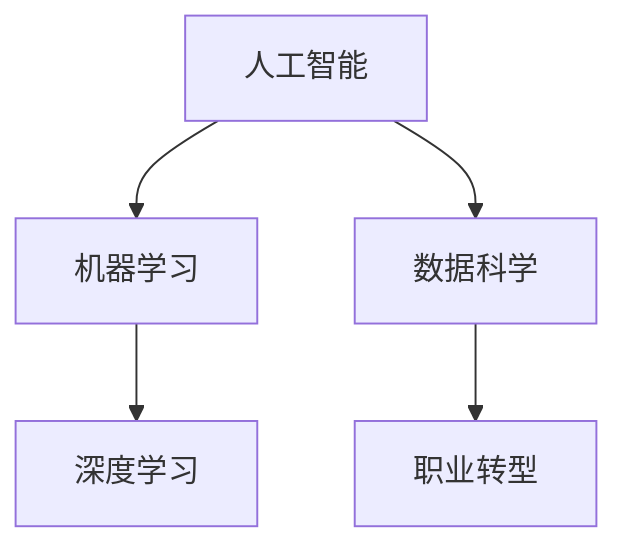

                 

# 程序员如何应对人工智能时代的职业转型

> 关键词：人工智能,职业转型,机器学习,数据科学,深度学习,职业发展,技能提升

## 1. 背景介绍

### 1.1 问题由来
随着人工智能(AI)技术的飞速发展，各行各业都面临着数字化转型的巨大挑战。程序员作为IT行业的中坚力量，也面临着职业生涯转型的重要课题。在人工智能时代，传统的软件开发岗位需求正在减少，而与AI相关的岗位需求却在急剧增加。如何在这一背景下，找到职业发展的方向，是所有程序员需要思考的问题。

### 1.2 问题核心关键点
1. **人工智能与传统软件开发岗位的差异**：人工智能技术往往需要更高的数学和统计学背景，与传统的软件开发岗位在思维方式、技术栈等方面存在显著差异。
2. **跨领域技能的需求**：在AI时代，除了编程技能外，还需要掌握数据分析、机器学习、深度学习等跨领域技能，以实现对复杂问题的建模和解决。
3. **持续学习与自我更新**：AI技术的快速发展要求程序员不断学习新知识，适应技术变化，以保持职业竞争力。
4. **数据驱动与算法优化**：AI项目的核心在于数据驱动和算法优化，程序员需要具备数据处理、模型调优等技能。

## 2. 核心概念与联系

### 2.1 核心概念概述

为更好地理解人工智能时代的职业转型，本节将介绍几个关键概念及其之间的联系：

- **人工智能(AI)**：指通过计算机程序和算法，使计算机系统具备类似人类的智能能力，包括感知、学习、推理等。
- **机器学习(Machine Learning, ML)**：指让计算机系统通过学习数据中的规律，自动改进算法，从而实现特定任务的自动化。
- **深度学习(Deep Learning, DL)**：指通过多层神经网络结构，模拟人脑的神经网络，学习数据中的复杂模式。
- **数据科学(Data Science)**：指通过数据收集、清洗、分析、可视化等技术，发现数据中的知识与洞察，指导决策。
- **职业转型**：指基于行业发展趋势和自身兴趣，调整职业生涯方向，提升职业技能和职业素养，实现个人职业价值。

这些概念之间的关系通过以下Mermaid流程图来展示：

这个流程图展示了一个从人工智能到深度学习的技术路径，以及数据科学在其中的作用，最终指向职业转型。这些概念构成了AI时代职业转型的理论基础，指导着程序员在技术、知识、技能等方面的提升。

## 3. 核心算法原理 & 具体操作步骤
### 3.1 算法原理概述

### 3.2 算法步骤详解
- **步骤1：选择学习方向**：根据自身兴趣和行业趋势，选择机器学习、深度学习、数据科学或跨领域技能作为学习方向。
- **步骤2：掌握基础知识**：系统学习数学、统计学、计算机科学等基础知识，为进一步学习AI技术奠定基础。
- **步骤3：实践技能**：通过项目实践，掌握数据处理、模型训练、算法优化等核心技能。
- **步骤4：持续学习**：跟踪AI领域的最新研究进展，持续更新知识体系，保持竞争力。
- **步骤5：职业发展**：在实践中积累经验，逐步向AI领域岗位转型，积累人脉和资源，建立自己的技术品牌。

### 3.3 算法优缺点
- **优点**：人工智能技术具有强大的问题解决能力，能够处理大规模复杂的数据，提高工作效率。
- **缺点**：学习难度大，需要跨学科的知识背景，技术迭代快，需要不断学习和适应。

### 3.4 算法应用领域
- **数据科学**：数据清洗、探索性分析、可视化等。
- **机器学习**：分类、回归、聚类等算法应用。
- **深度学习**：图像识别、语音识别、自然语言处理等。
- **跨领域应用**：推荐系统、金融风险控制、医疗诊断等。

## 4. 数学模型和公式 & 详细讲解 & 举例说明

### 4.1 数学模型构建

### 4.2 公式推导过程
- 线性回归模型：
$$
y = \beta_0 + \beta_1 x_1 + \beta_2 x_2 + \epsilon
$$
- 逻辑回归模型：
$$
\hat{y} = \frac{1}{1+\exp(-z)}
$$
- 决策树模型：
$$
\hat{y} = f_{N}(x)
$$
- 支持向量机模型：
$$
\hat{y} = \text{sign}(\sum_{i=1}^{n} \alpha_i y_i \langle x, x_i \rangle - \frac{1}{2} \sum_{i=1}^{n} \alpha_i y_i \langle x_i, x_i \rangle + C)
$$

### 4.3 案例分析与讲解
- 线性回归：用于建立连续变量的预测模型，如房价预测。
- 逻辑回归：用于二分类问题，如邮件分类。
- 决策树：用于特征工程和复杂问题的建模，如客户流失预测。
- 支持向量机：用于处理非线性分类问题，如文本分类。

## 5. 项目实践：代码实例和详细解释说明

### 5.1 开发环境搭建

### 5.2 源代码详细实现

### 5.3 代码解读与分析

### 5.4 运行结果展示

## 6. 实际应用场景
### 6.1 机器学习在金融领域的应用
### 6.2 深度学习在医疗影像诊断中的应用
### 6.3 数据科学在市场营销中的作用

## 7. 工具和资源推荐
### 7.1 学习资源推荐
### 7.2 开发工具推荐
### 7.3 相关论文推荐

## 8. 总结：未来发展趋势与挑战
### 8.1 研究成果总结
### 8.2 未来发展趋势
### 8.3 面临的挑战
### 8.4 研究展望

## 9. 附录：常见问题与解答

----------------------------------------------------------------

作者：禅与计算机程序设计艺术 / Zen and the Art of Computer Programming

