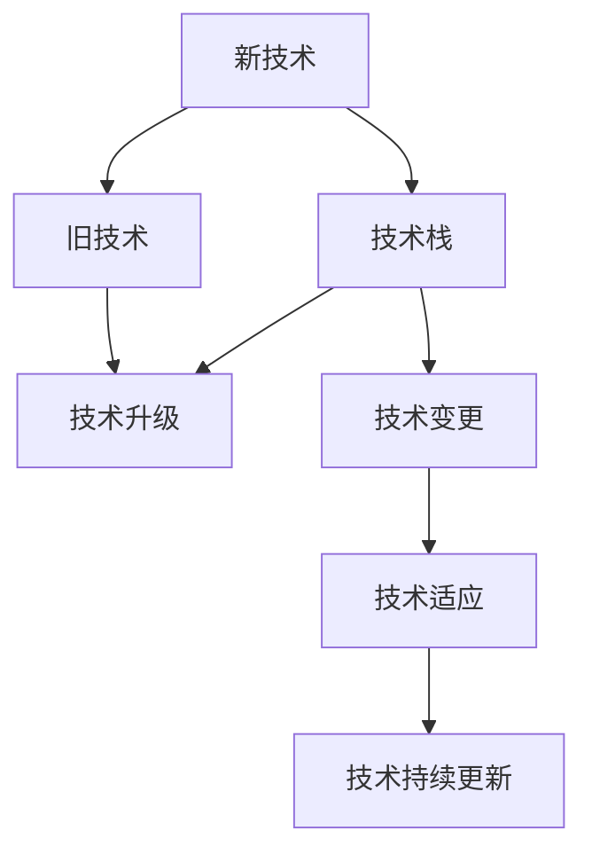

                 

# 程序员如何应对技术升级与变更

在快速变化的技术领域，程序员需要不断地学习新的技术，适应新的变更，才能保持竞争力和职业发展。本文将系统介绍如何应对技术升级与变更，帮助程序员在变化中保持技术领先和高效工作。

## 1. 背景介绍

### 1.1 问题由来
当前，技术更新速度之快，给程序员带来了前所未有的挑战。新技术、新工具、新框架层出不穷，程序员需要不断地学习和适应。如果不能及时掌握新技术，可能会导致工作效率低下，甚至被市场淘汰。因此，如何高效应对技术升级与变更，成为每个程序员必须面对的问题。

### 1.2 问题核心关键点
技术升级与变更的核心在于如何高效学习和掌握新知识，同时保证工作效率和代码质量。具体关键点包括：
1. **学习速度**：如何快速掌握新知识，减少学习成本。
2. **工具选择**：如何选择和应用新工具，提升开发效率。
3. **代码质量**：如何在引入新技术时，保证代码的质量和可维护性。
4. **团队协作**：如何与团队成员共享知识，协同应对技术升级。
5. **持续更新**：如何在日常工作中持续学习和应用新技术，保持技术领先。

## 2. 核心概念与联系

### 2.1 核心概念概述

为更好地理解如何应对技术升级与变更，本节将介绍几个密切相关的核心概念：

- **新技术(New Technologies)**：包括编程语言、框架、库等，随着技术发展而不断涌现的新工具和技术。
- **旧技术(Old Technologies)**：与新技术相对应的旧有技术，需逐步淘汰或部分保留。
- **技术栈(Technology Stack)**：指一个项目中使用的所有技术和工具，包括编程语言、框架、库等。
- **技术升级(Technology Upgrade)**：将旧技术替换为新技术的过程，以提升系统性能和开发效率。
- **技术变更(Technology Change)**：指项目中对技术栈的局部调整或优化，以适应新的业务需求。
- **技术适应(Adaptation)**：对新旧技术进行综合使用，最大化利用现有资源，降低技术升级和变更成本。
- **技术持续更新(Technology Continuous Update)**：在项目开发过程中，持续学习和应用新技术，保持技术领先。

这些核心概念之间的逻辑关系可以通过以下Mermaid流程图来展示：



这个流程图展示了我提及的核心概念及其之间的关系：

1. 新技术与旧技术的关系：新技术不断发展，旧技术逐渐被淘汰或部分保留。
2. 技术栈与技术升级：技术升级是将旧技术替换为新技术，以提升系统性能。
3. 技术变更与技术适应：技术变更为技术栈的局部调整，技术适应则是在新旧技术中综合使用，降低成本。
4. 技术持续更新：持续学习和应用新技术，保持技术领先。

## 3. 核心算法原理 & 具体操作步骤

### 3.1 算法原理概述

如何高效应对技术升级与变更，可以从以下几个方面进行系统思考：

1. **选择合适的学习方式**：
   - 深度学习：对于复杂算法和模型，通过在线课程、MOOC、书籍等资源进行深度学习。
   - 浅层学习：对于简单工具和框架，可以通过在线教程、视频教程、文档等进行浅层学习。

2. **制定学习计划**：
   - **短期计划**：聚焦于短期任务，针对具体的项目需求，学习相关的新技术。
   - **长期计划**：关注技术趋势，选择一些未来的关键技术进行长期学习。

3. **应用新技术**：
   - **实验和验证**：在项目中引入新技术，通过实验验证其效果。
   - **逐步替换**：先引入新技术辅助旧技术，逐步替换旧技术。

4. **代码质量保障**：
   - **代码审查**：引入新技术时，确保代码质量，通过代码审查机制。
   - **自动化测试**：通过自动化测试，验证新代码的正确性和稳定性。

5. **团队协作**：
   - **知识分享**：定期组织技术分享会，让团队成员分享新技术和学习心得。
   - **协作开发**：引入新技术时，通过协作开发，确保团队成员都能熟练掌握。

### 3.2 算法步骤详解

**Step 1: 选择学习方式和资源**

1. **深度学习**：
   - 在线课程：Coursera、edX、Udacity等平台提供大量高质量课程。
   - MOOC：Coursera的Deep Learning Specialization等系列课程。
   - 书籍：《深度学习》（Ian Goodfellow 著）、《TensorFlow 实战》（Dhruv D'Souza 著）。

2. **浅层学习**：
   - 在线教程：官方文档、YouTube教程、Stack Overflow 等。
   - 视频教程：Udemy、Pluralsight、腾讯课堂等平台提供的简短视频教程。

**Step 2: 制定学习计划**

1. **短期计划**：
   - 根据项目需求，学习具体的新技术。
   - 每天投入1-2小时，持续1-2周，掌握基本概念和使用方法。

2. **长期计划**：
   - 选择未来趋势技术，如区块链、人工智能等。
   - 每周投入5-10小时，持续1-2个月，掌握基础和应用案例。

**Step 3: 应用新技术**

1. **实验和验证**：
   - 选择一个小项目或模块，引入新技术。
   - 记录实验过程和结果，验证新技术的性能。

2. **逐步替换**：
   - 先引入新技术作为辅助，逐步替换旧技术。
   - 每次替换前，进行详细的对比和测试，确保平稳过渡。

**Step 4: 代码质量保障**

1. **代码审查**：
   - 引入新技术后，进行代码审查，确保代码质量。
   - 使用GitHub等工具进行代码托管和版本控制。

2. **自动化测试**：
   - 编写自动化测试用例，验证新代码的正确性和稳定性。
   - 使用Jenkins、Travis CI等工具进行持续集成和测试。

**Step 5: 团队协作**

1. **知识分享**：
   - 定期组织技术分享会，让团队成员分享新技术和学习心得。
   - 使用Slack、Microsoft Teams等工具进行即时沟通。

2. **协作开发**：
   - 引入新技术时，进行协作开发，确保团队成员都能熟练掌握。
   - 使用Git、GitHub等工具进行版本控制和协作开发。

### 3.3 算法优缺点

- **优点**：
  - 系统化学习新技术，减少盲目性，提高学习效率。
  - 逐步替换旧技术，降低风险，提高系统性能。
  - 保证代码质量，提升开发效率。
  - 促进团队协作，增强知识共享。

- **缺点**：
  - 学习成本较高，需要投入大量时间和精力。
  - 新技术引入可能会影响现有代码结构，需要进行重构。
  - 团队协作需要协调一致，可能会影响开发进度。

## 4. 数学模型和公式 & 详细讲解 & 举例说明

### 4.1 数学模型构建

假设新技术引入前，项目的代码基线为 $\mathcal{B}$，引入新技术后的代码基线为 $\mathcal{B}'$。引入新技术后，系统的性能提升可以用以下数学模型表示：

$$
\mathcal{P}_{\text{after}} - \mathcal{P}_{\text{before}} = f(\text{新技术引入率}, \text{旧技术替换率}, \text{代码质量保障措施})
$$

其中，$\mathcal{P}_{\text{after}}$ 为引入新技术后的系统性能，$\mathcal{P}_{\text{before}}$ 为引入新技术前的系统性能。

### 4.2 公式推导过程

假设引入新技术的比例为 $\alpha$，旧技术替换的比例为 $\beta$，代码质量保障措施的效率为 $\gamma$，则性能提升公式可以进一步推导为：

$$
\Delta \mathcal{P} = \alpha \times \beta \times \gamma
$$

这个公式表明，性能提升的多少取决于新技术引入的比例、旧技术替换的比例和代码质量保障措施的效率。

### 4.3 案例分析与讲解

假设项目引入了一个新的数据库管理系统，新的系统性能提升10%，引入比例为50%，旧系统替换比例为70%，代码质量保障措施效率为80%。则性能提升公式可以具体化为：

$$
\Delta \mathcal{P} = 0.5 \times 0.7 \times 0.8 = 0.28
$$

这意味着，引入新技术后，系统的性能提升了28%。

## 5. 项目实践：代码实例和详细解释说明

### 5.1 开发环境搭建

在开始项目实践前，我们需要准备好开发环境。以下是使用Python进行Django框架开发的Python环境配置流程：

1. 安装Anaconda：从官网下载并安装Anaconda，用于创建独立的Python环境。

2. 创建并激活虚拟环境：
```bash
conda create -n py38 python=3.8
conda activate py38
```

3. 安装Django：
```bash
pip install Django
```

4. 安装相关库：
```bash
pip install Pillow beautifulsoup4
```

完成上述步骤后，即可在`py38`环境中开始Django项目的开发。

### 5.2 源代码详细实现

下面以Django框架为例，给出使用Django进行Web应用的PyTorch代码实现。

首先，定义Django应用的`urls.py`：

```python
from django.urls import path
from myapp.views import HelloWorldView

urlpatterns = [
    path('hello/', HelloWorldView.as_view(), name='hello'),
]
```

然后，定义视图函数：

```python
from django.views.generic import TemplateView

class HelloWorldView(TemplateView):
    template_name = 'hello.html'
```

接着，定义模板文件`hello.html`：

```html
<!DOCTYPE html>
<html>
<head>
    <title>Hello World</title>
</head>
<body>
    <h1>Hello, World!</h1>
</body>
</html>
```

最后，在`settings.py`中配置Django应用的URL配置：

```python
urlpatterns = [
    path('hello/', HelloWorldView.as_view(), name='hello'),
]
```

通过上述代码，我们成功搭建了一个简单的Django Web应用。

### 5.3 代码解读与分析

让我们再详细解读一下关键代码的实现细节：

**urls.py**：
- `urlpatterns`：定义了应用的路由，通过`path`函数将URL映射到对应的视图函数。

**HelloWorldView**：
- 继承自`TemplateView`，指定模板文件。

**hello.html**：
- 定义了视图渲染的HTML模板，用于展示`Hello World`的输出。

**settings.py**：
- `urlpatterns`：定义了应用的URL配置，将`hello` URL映射到`HelloWorldView`视图。

通过这些代码，可以看到，Django框架提供了简洁的路由和模板引擎，帮助开发者快速构建Web应用。同时，Django也提供了强大的ORM（对象关系映射）和模板继承机制，便于代码的复用和扩展。

### 5.4 运行结果展示

启动Django开发服务器，访问`http://localhost:8000/hello/`，即可在浏览器中看到`Hello, World!`的输出。

## 6. 实际应用场景

### 6.1 网站开发

Django框架以其简洁、高效的特性，广泛应用于网站开发。通过Django，开发者可以快速构建高质量的Web应用，支持用户管理、文章发布、内容展示等功能。同时，Django的ORM和模板引擎也便于前后端分离和代码复用。

### 6.2 移动应用

Django Rest Framework（DRF）是一个基于Django的RESTful API框架，广泛应用于移动应用开发。通过DRF，开发者可以构建高效的RESTful API，支持HTTP请求、数据序列化和身份验证等功能。同时，DRF的文档和测试工具也方便了开发和测试过程。

### 6.3 大数据应用

Django与大数据框架Spark、Hadoop等集成，可以应用于大数据应用开发。通过Django，开发者可以构建数据清洗、数据处理和数据分析的后台系统，支持大规模数据处理和可视化展示。同时，Django也提供了支持分布式计算和异步任务的特性，便于大数据应用的扩展和优化。

### 6.4 未来应用展望

随着Django框架的不断发展，其在更多领域的应用将进一步拓展。未来，Django将更多地应用于人工智能、物联网、区块链等新兴技术领域，为技术升级和变更提供更多可能性。

## 7. 工具和资源推荐

### 7.1 学习资源推荐

为了帮助开发者系统掌握Django框架的技术细节和应用实践，这里推荐一些优质的学习资源：

1. **Django官方文档**：Django官方提供的文档，包含了从基础到高级的详细教程，是Django学习的不二选择。

2. **《Django Web Development with Python》书籍**：由Django核心开发者之一编写，详细介绍了Django框架的各个模块和用法。

3. **Django Girl**：一个专门为女性开发者设计的Django教程，通过简单的示例和实战项目，帮助初学者快速上手。

4. **Django Girls Guide**：一个专注于Django学习的在线课程平台，提供了大量的Django教程和视频，适合自学和团队培训。

5. **Django Tutorials by Real Python**：Real Python提供的Django教程，通过实用的案例和代码示例，帮助开发者掌握Django框架的核心功能。

通过对这些资源的学习实践，相信你一定能够快速掌握Django框架的技术细节和应用实践，并在实际开发中灵活应用。

### 7.2 开发工具推荐

高效的开发离不开优秀的工具支持。以下是几款用于Django开发常用的工具：

1. PyCharm：由JetBrains开发的IDE，支持Django的语法高亮、自动补全、调试等功能，提升开发效率。

2. Django Admin：Django内置的管理后台，支持简单的数据管理、用户管理、权限控制等功能，快速搭建后端管理系统。

3. Django Rest Framework：提供RESTful API的支持，支持HTTP请求、数据序列化和身份验证等功能，方便移动应用开发。

4. Django Debug Toolbar：提供开发调试的支持，显示请求、响应、错误信息等，便于开发者快速定位问题。

5. Django Celery：支持异步任务的处理，提升大规模数据处理和并发请求的处理能力。

6. Django Qina：提供数据库迁移和版本控制的支持，便于数据库设计和版本管理。

合理利用这些工具，可以显著提升Django开发的效率和质量，确保项目按时交付和稳定运行。

### 7.3 相关论文推荐

Django框架的发展离不开学界的持续研究。以下是几篇奠基性的相关论文，推荐阅读：

1. **《Django Web Framework》**：介绍Django框架的设计理念和核心功能，奠定了Django框架的基石。

2. **《Django ORM and Database Relations》**：详细介绍Django的ORM和数据库关系，帮助开发者理解Django的数据管理机制。

3. **《Django REST Framework for Web Services》**：介绍Django Rest Framework的RESTful API设计和实现，帮助开发者掌握Django API开发。

4. **《Django Views and URL Routing》**：详细介绍Django的视图函数和路由配置，帮助开发者理解Django的URL处理机制。

5. **《Django Templates and Contexts》**：介绍Django的模板引擎和上下文，帮助开发者理解Django的模板渲染机制。

这些论文代表了大语言模型微调技术的发展脉络。通过学习这些前沿成果，可以帮助研究者把握学科前进方向，激发更多的创新灵感。

## 8. 总结：未来发展趋势与挑战

### 8.1 总结

本文对Django框架的应用进行了全面系统的介绍。首先阐述了Django框架的背景和发展历程，明确了Django框架在Web开发、移动应用、大数据应用等多个领域的应用价值。其次，从原理到实践，详细讲解了Django框架的各个组件和技术细节，给出了Django项目的完整代码实现。同时，本文还广泛探讨了Django框架在多个实际应用场景中的使用，展示了Django框架的强大生命力。此外，本文精选了Django框架的学习资源、开发工具和相关论文，力求为读者提供全方位的技术指引。

通过本文的系统梳理，可以看到，Django框架已经成为Web开发的重要工具，其简洁高效的特点深受开发者喜爱。Django框架不仅可以帮助开发者快速构建高质量的Web应用，还支持移动应用、大数据应用等多种场景的开发。相信随着Django框架的不断发展，其在更多领域的应用将进一步拓展，为开发者提供更多的技术选择和发展机遇。

### 8.2 未来发展趋势

展望未来，Django框架将呈现以下几个发展趋势：

1. **性能提升**：Django团队将继续优化框架性能，提升处理大规模数据和并发请求的能力，支持更多高级特性。

2. **国际化支持**：Django将继续增强国际化（i18n）和本地化（l10n）支持，帮助开发者构建多语言版本的Web应用。

3. **大数据支持**：Django将进一步整合大数据框架Spark、Hadoop等，支持大数据应用的开发和部署。

4. **WebAssembly支持**：Django将探索支持WebAssembly，提升Web应用的性能和用户体验。

5. **组件化开发**：Django将支持更多组件化的开发方式，提升代码的可重用性和可维护性。

6. **DevOps支持**：Django将支持DevOps自动化流程，提升开发和运维的效率和稳定性。

这些趋势将推动Django框架的发展，使其在更多领域发挥重要作用，为开发者提供更高效、更灵活的开发工具。

### 8.3 面临的挑战

尽管Django框架已经取得了瞩目成就，但在迈向更加智能化、普适化应用的过程中，它仍面临着诸多挑战：

1. **性能瓶颈**：Django在大规模数据处理和高并发请求处理方面可能存在性能瓶颈，需要不断优化框架设计和算法实现。

2. **扩展性问题**：Django的某些特性可能不适用于所有场景，需要开发者根据具体情况进行选择和定制。

3. **社区支持**：Django社区的活跃度可能会影响框架的发展速度和方向，需要开发者积极参与社区建设。

4. **技术升级**：Django需要持续更新，以保持与新技术和市场需求的同步，需要开发者不断学习和适应。

5. **开发者生态**：Django的生态系统相对较小，需要更多开发者和企业使用和支持。

### 8.4 研究展望

面对Django框架所面临的挑战，未来的研究需要在以下几个方面寻求新的突破：

1. **性能优化**：继续优化Django框架的性能，提升大规模数据处理和高并发请求的处理能力。

2. **组件化开发**：推动Django支持更多组件化的开发方式，提升代码的可重用性和可维护性。

3. **国际化支持**：增强Django的国际化（i18n）和本地化（l10n）支持，帮助开发者构建多语言版本的Web应用。

4. **WebAssembly支持**：探索支持WebAssembly，提升Web应用的性能和用户体验。

5. **DevOps支持**：支持DevOps自动化流程，提升开发和运维的效率和稳定性。

6. **社区建设**：鼓励更多开发者和企业使用和支持Django框架，增强社区活跃度和生态系统。

这些研究方向的探索，将引领Django框架的发展方向，为开发者提供更高效、更灵活的开发工具。相信随着Django框架的不断演进，其在更多领域的应用将进一步拓展，为开发者提供更多的技术选择和发展机遇。

## 9. 附录：常见问题与解答

**Q1：Django是否适用于所有Web应用开发？**

A: Django框架适用于大多数Web应用开发，特别是数据密集型和用户密集型应用。但对于一些性能要求极高或特定领域的应用，可能需要引入其他框架或技术。

**Q2：如何提高Django应用的性能？**

A: 提高Django应用的性能可以从以下几个方面入手：
1. 优化数据库查询：使用SQL优化、索引、查询缓存等技术。
2. 减少视图函数和模板的计算量：优化视图函数逻辑，减少不必要的计算。
3. 使用缓存机制：使用Django自带的缓存机制，如页面缓存、片段缓存等。
4. 使用异步框架：引入Django async views和异步中间件，提升并发请求的处理能力。

**Q3：Django框架的扩展性如何？**

A: Django框架具有较高的扩展性，可以通过中间件、装饰器、插件等方式扩展框架功能。但扩展时需要遵循一定的规范和最佳实践，确保代码的可读性和可维护性。

**Q4：Django框架的未来发展方向是什么？**

A: Django框架的未来发展方向包括性能提升、国际化支持、大数据支持、WebAssembly支持、组件化开发、DevOps支持等方面。这些方向将推动Django框架的发展，使其在更多领域发挥重要作用。

**Q5：Django框架的学习资源有哪些？**

A: Django框架的学习资源包括官方文档、书籍、在线课程、博客、社区等。推荐的资源有Django官方文档、《Django Web Development with Python》书籍、Django Girl、Django Girls Guide、Real Python等。

**Q6：Django框架的开发工具有哪些？**

A: Django框架的开发工具包括PyCharm、Django Admin、Django Rest Framework、Django Debug Toolbar、Django Celery、Django Qina等。这些工具可以提升Django开发的效率和质量，确保项目按时交付和稳定运行。

---

作者：禅与计算机程序设计艺术 / Zen and the Art of Computer Programming

