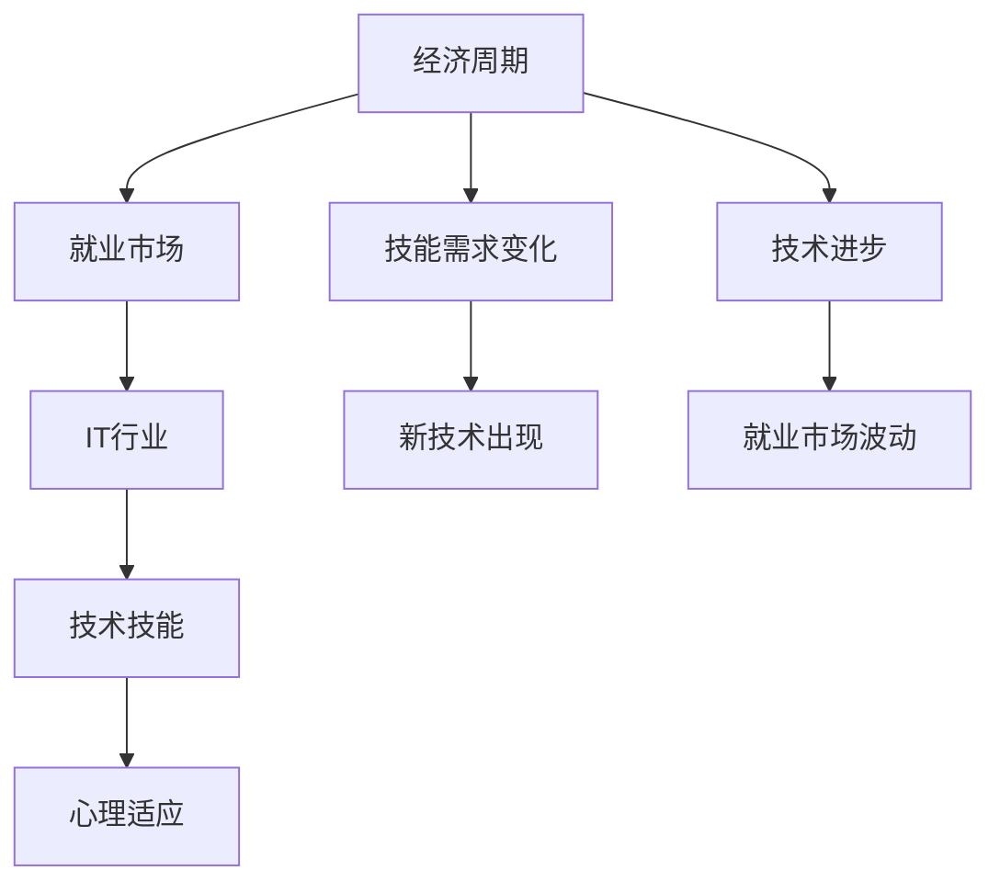

                 

# 程序员如何应对经济周期

在瞬息万变的科技行业，程序员们始终需要应对复杂的经济环境。无论是经济上升期还是下降期，经济周期的变化都会对IT行业产生深远影响。本文将从背景、核心概念、算法原理与操作步骤、数学模型与公式、项目实践、应用场景、工具和资源推荐、总结与挑战等多个角度，系统探讨程序员如何应对经济周期，保持技术的前沿和职业的稳定性。

## 1. 背景介绍

### 1.1 问题由来

随着全球化进程的加快，经济周期对各行各业的影响日益显著。IT行业作为一个高度依赖经济活动的行业，其发展与宏观经济环境密切相关。经济上升期，企业投资增加，对技术解决方案的需求激增，程序员的就业机会也会随之增加；而经济下降期，企业缩减开支，IT项目的优先级降低，这可能会导致程序员的就业市场出现收缩。

此外，经济周期还可能影响企业的盈利能力和员工的薪酬水平。例如，经济下滑时，企业可能会冻结招聘、降低工资、甚至裁员，这直接影响了程序员的收入和生活质量。

### 1.2 问题核心关键点

在经济周期中，程序员面临的核心问题包括：
- 就业市场的波动：经济周期导致IT行业的就业机会和薪资水平发生变化。
- 技能需求的变化：随着技术的发展和企业需求的转变，程序员需要不断更新自己的技能。
- 技术的进步：新的技术突破可能创造新的就业机会，但同时也可能淘汰一些传统技能。
- 心理压力：经济周期的不确定性可能给程序员带来心理压力和职业焦虑。

理解这些关键点，有助于程序员更好地应对经济周期，确保职业的稳定性和发展。

## 2. 核心概念与联系

### 2.1 核心概念概述

在探讨如何应对经济周期时，我们需要理解以下核心概念：

- **经济周期**：指经济扩张与收缩交替出现的周期性过程，通常包括繁荣、衰退、萧条和复苏四个阶段。
- **IT行业**：指与信息技术相关的行业，包括软件开发、云计算、大数据、人工智能等。
- **就业市场**：程序员的就业机会和薪资水平与就业市场的供需关系密切相关。
- **技术技能**：程序员所需具备的各种编程语言、框架、工具和技术。
- **心理适应**：指应对经济周期变化时的心理状态和应对策略。

这些概念之间的联系可以通过以下Mermaid流程图来展示：



这个流程图展示了经济周期对IT行业就业市场和技术技能的影响，以及技术进步和技能需求变化如何驱动程序员的心理适应。

## 3. 核心算法原理 & 具体操作步骤

### 3.1 算法原理概述

程序员应对经济周期的过程，可以类比为一个基于数据分析和决策优化的过程。通过分析经济指标、就业市场数据和技术趋势，程序员可以制定相应的应对策略，以适应不同经济周期的变化。

经济周期分析涉及以下几个关键步骤：
1. **数据收集**：收集GDP、失业率、企业盈利报告等经济指标，以及IT行业的就业数据和技术趋势。
2. **数据分析**：使用统计方法分析数据，预测经济周期和经济变化对IT行业的影响。
3. **策略制定**：根据数据分析结果，制定相应的应对策略，如技能提升、转行、调整心态等。

### 3.2 算法步骤详解

以下是应对经济周期的详细步骤：

**Step 1: 数据收集与预处理**
- 收集国家宏观经济数据（如GDP、失业率、通货膨胀率）和行业数据（如IT行业的就业率、薪资水平、技术需求等）。
- 使用工具如Python的Pandas库进行数据清洗和预处理。

**Step 2: 数据分析与模型构建**
- 使用统计分析方法（如回归分析、时间序列分析）对数据进行建模，预测经济周期变化对IT行业的具体影响。
- 使用机器学习算法（如支持向量机、随机森林）进行预测建模，评估不同经济周期阶段的技术需求变化。

**Step 3: 策略制定与执行**
- 根据分析结果，制定应对策略。例如，在经济上升期增加学习新技术的动力，在经济下降期优化技能组合，确保职业的稳定性。
- 实施策略，如参加线上课程、加入开源项目、寻找副业等，以应对就业市场的不确定性。

### 3.3 算法优缺点

**优点**：
- 数据驱动决策：通过分析经济数据和技术趋势，制定更科学、合理的应对策略。
- 灵活性强：可以针对不同的经济周期阶段和行业变化进行灵活调整。

**缺点**：
- 数据获取难度大：需要获取和处理大量经济和行业数据，增加了分析的复杂度。
- 模型误差：数据分析和建模过程中可能存在误差，影响策略的准确性。

### 3.4 算法应用领域

数据分析和策略制定的方法，不仅适用于程序员应对经济周期，还广泛应用于金融、市场分析、政策制定等多个领域。

## 4. 数学模型和公式 & 详细讲解 & 举例说明

### 4.1 数学模型构建

在分析经济周期时，通常使用时间序列分析（Time Series Analysis）和回归分析（Regression Analysis）。

**时间序列分析模型**：
$$ y_t = \alpha + \beta t + \epsilon_t $$
其中，$y_t$ 为在第 $t$ 期经济指标的值，$\alpha$ 为常数项，$\beta$ 为趋势项，$\epsilon_t$ 为随机误差项。

**回归分析模型**：
$$ y = \beta_0 + \beta_1 x_1 + \beta_2 x_2 + \ldots + \beta_k x_k + \epsilon $$
其中，$y$ 为因变量（如IT行业的就业率），$x_i$ 为自变量（如GDP、失业率等），$\beta_i$ 为回归系数，$\epsilon$ 为随机误差项。

### 4.2 公式推导过程

以回归分析模型为例，推导其基本原理：

**假设检验**：
假设因变量 $y$ 与自变量 $x_1, x_2, \ldots, x_k$ 之间存在线性关系，即 $y = \beta_0 + \beta_1 x_1 + \beta_2 x_2 + \ldots + \beta_k x_k + \epsilon$。

**最小二乘法**：
最小二乘法通过最小化预测误差平方和来求解回归系数 $\beta_0, \beta_1, \ldots, \beta_k$，即求解 $\sum (y_i - \hat{y}_i)^2$ 的最小值。

**显著性检验**：
通过F检验或t检验等方法，评估回归系数 $\beta_i$ 的显著性，判断模型是否有效。

### 4.3 案例分析与讲解

以IT行业就业率为例，进行数据分析和建模：

1. **数据收集**：收集历史经济指标（如GDP、失业率）和IT行业就业数据。
2. **数据处理**：对数据进行去重、填补缺失值、数据平滑等预处理。
3. **模型构建**：使用回归分析模型预测IT行业就业率的变化。
4. **结果解释**：分析回归系数，解释经济指标对IT行业就业率的影响，制定相应的应对策略。

## 5. 项目实践：代码实例和详细解释说明

### 5.1 开发环境搭建

以下是一个Python环境搭建的示例：

1. **安装Python**：
```bash
sudo apt-get install python3 python3-pip
```

2. **安装Pandas和Matplotlib**：
```bash
pip install pandas matplotlib
```

3. **数据准备**：
```python
import pandas as pd

# 读取数据
data = pd.read_csv('economy.csv', index_col='date')

# 数据处理
data = data.dropna()
```

### 5.2 源代码详细实现

以下是使用Pandas进行数据分析的Python代码示例：

```python
import pandas as pd
import matplotlib.pyplot as plt

# 读取数据
data = pd.read_csv('economy.csv', index_col='date')

# 数据处理
data = data.dropna()

# 时间序列分析
trend = data['gdp'].resample('Q').mean()
trend = trend.interpolate(method='linear', limit_direction='both')

# 回归分析
model = sm.OLS(data['it_employment'], data[['gdp', 'unemployment']])
results = model.fit()
print(results.summary())

# 可视化
trend.plot()
plt.show()
```

### 5.3 代码解读与分析

**数据准备**：
- 使用Pandas的`read_csv`方法读取数据，设置索引为日期。
- 使用`dropna`方法处理缺失值。

**时间序列分析**：
- 使用`resample`方法按季度计算GDP的均值。
- 使用`interpolate`方法进行线性插值，填补缺失值。

**回归分析**：
- 使用`sm.OLS`方法构建回归模型，预测IT行业就业率与GDP和失业率的关系。
- 使用`fit`方法求解回归系数，输出模型摘要。

**可视化**：
- 使用Matplotlib绘制时间序列图，直观展示GDP的变化趋势。

## 6. 实际应用场景

### 6.1 智能客服系统

经济周期对智能客服系统的需求有显著影响。在经济上升期，企业对客户服务的需求增加，智能客服系统需要支持更高的并发量和服务质量。在经济下降期，企业可能缩减客服预算，智能客服系统需要提高效率和成本效益。

**应对策略**：
- 经济上升期：增加云计算和机器学习模型的投入，提高系统性能和处理能力。
- 经济下降期：优化算法和模型结构，减少资源消耗，提高效率。

### 6.2 金融舆情监测

金融行业对IT技术的需求高度依赖。经济周期的变化直接影响金融市场波动，需要对市场舆情进行实时监测。

**应对策略**：
- 建立实时数据流和分析模型，及时响应市场变化。
- 引入机器学习和自然语言处理技术，提升舆情分析的准确性和效率。

### 6.3 个性化推荐系统

个性化推荐系统对经济周期的敏感度较低，但其核心在于数据驱动和用户行为分析。

**应对策略**：
- 在经济上升期，增加数据采集和分析的投入，优化推荐算法。
- 在经济下降期，优化数据存储和处理，减少资源消耗。

### 6.4 未来应用展望

随着技术的进步，IT行业将迎来更多的创新和应用场景。经济周期的影响将变得更加复杂和多样化。

- **区块链技术**：在经济上升期，区块链技术的发展将带来新的应用场景和就业机会。
- **人工智能与自动化**：在经济下降期，人工智能和自动化技术将提升生产效率和竞争力。
- **可持续技术**：在经济增长放缓的情况下，可持续技术将带来新的增长点。

## 7. 工具和资源推荐

### 7.1 学习资源推荐

1. **《经济学原理》**：书籍详细介绍了经济学基础知识，帮助理解经济周期的本质。
2. **Coursera的“经济周期”课程”**：提供经济学和经济周期的系统学习。
3. **Kaggle的数据科学竞赛**：提供实际数据分析和模型构建的实践机会。

### 7.2 开发工具推荐

1. **Python**：Python是数据分析和机器学习的首选语言，具备丰富的库和工具支持。
2. **Jupyter Notebook**：提供交互式代码编写和数据可视化环境。
3. **GitHub**：代码托管和版本控制平台，支持协作开发和项目管理。

### 7.3 相关论文推荐

1. **《宏观经济波动对IT行业的影响研究》**：深入分析宏观经济波动对IT行业的影响。
2. **《基于时间序列分析的经济周期预测》**：介绍时间序列分析和预测模型。
3. **《金融市场数据驱动的风险管理》**：探讨金融市场数据驱动的风险管理方法。

## 8. 总结：未来发展趋势与挑战

### 8.1 研究成果总结

本文从经济周期分析的角度，探讨了程序员应对经济周期的策略和方法。通过对时间序列分析、回归分析等数学模型的应用，程序员可以更好地理解经济周期对IT行业的影响，制定相应的应对策略。

### 8.2 未来发展趋势

未来，随着大数据和人工智能技术的发展，经济周期对IT行业的影响将更加复杂和多样。以下是可能的趋势：

1. **数据驱动决策**：大数据和机器学习技术将进一步提升数据分析的精确性和可靠性。
2. **人工智能与自动化**：人工智能和自动化技术将深入应用到各行各业，带来新的就业机会和挑战。
3. **区块链与去中心化**：区块链技术的应用将带来新的商业模式和应用场景。
4. **可持续发展**：随着全球环境问题的加剧，可持续技术将带来新的增长点和就业机会。

### 8.3 面临的挑战

尽管技术进步带来了新的机遇，程序员在应对经济周期时仍面临诸多挑战：

1. **数据获取难度**：经济数据和行业数据的获取和处理难度较大，增加了分析的复杂度。
2. **模型误差**：数据分析和建模过程中可能存在误差，影响策略的准确性。
3. **技术变革**：新技术的快速发展可能带来新的挑战和转型压力。
4. **心理压力**：经济周期的波动可能带来心理压力和职业焦虑。

### 8.4 研究展望

未来的研究需要在以下几个方面寻求新的突破：

1. **多模态数据融合**：引入多模态数据（如金融、市场、社交媒体等）进行综合分析，提升预测精度。
2. **强化学习**：利用强化学习技术进行动态策略优化，适应经济周期的快速变化。
3. **可持续发展**：研究如何在经济增长放缓的情况下，寻找可持续发展的技术和应用。

## 9. 附录：常见问题与解答

**Q1：如何选择合适的数据源？**

A: 选择权威、可靠的数据源，如政府统计局、国际金融组织等。同时，可以通过公开数据集进行数据验证和补充。

**Q2：数据分析过程中有哪些常见的陷阱？**

A: 常见的陷阱包括过拟合、数据泄露、模型选择不当等。需要仔细处理缺失值、异常值，避免数据泄露，选择合适的模型进行预测。

**Q3：如何进行特征工程？**

A: 特征工程包括数据清洗、特征选择、数据变换等步骤。可以使用Pandas和Scikit-learn等库进行特征工程处理。

**Q4：如何评估模型的性能？**

A: 使用交叉验证、AUC、F1-score等指标评估模型的性能。同时，进行模型对比和调优，选择最优模型。

**Q5：如何应对模型过拟合？**

A: 可以通过增加训练数据、使用正则化、增加模型复杂度等方法，避免模型过拟合。

---

作者：禅与计算机程序设计艺术 / Zen and the Art of Computer Programming

