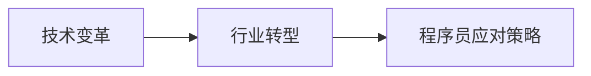

                 

# 程序员如何应对行业变革与转型

在这个日新月异的科技时代，技术变革的步伐远远超出了以往任何时期。从云计算、人工智能、大数据到区块链、量子计算，每一种技术的突破都为IT行业带来了深刻影响，也给程序员的职业发展提出了新的挑战。本文将从技术变革、行业转型以及程序员应对策略等角度，深入探讨这一主题，为程序员提供一套系统性的转型路径和方法。

## 1. 背景介绍

### 1.1 行业变革背景
随着科技的迅猛发展，云计算、大数据、人工智能等新技术正迅速改变着传统行业的运行模式。以云计算为例，它通过分布式计算和存储，实现了资源的弹性扩展和按需使用，极大地提升了数据处理能力和系统可靠性。大数据技术的普及，使得企业在决策分析、用户行为预测等方面拥有了更强大的数据支撑。人工智能的兴起，带来了更加智能化的系统设计和更高效的自动化流程。

### 1.2 行业转型需求
在技术变革的驱动下，各行各业都在寻求通过数字化转型提升竞争力。例如，金融行业通过引入大数据和人工智能技术，提高了风险控制和用户体验；制造业利用物联网和工业互联网技术，实现了生产流程的优化和供应链的智能化；零售业通过电子商务和社交媒体营销，拓展了销售渠道，提升了市场响应速度。

## 2. 核心概念与联系

### 2.1 核心概念概述

在探讨程序员如何应对行业变革与转型时，我们需要理解几个关键概念：

- **技术变革**：指技术发展趋势及其带来的新需求、新工具和新方法。
- **行业转型**：指行业利用新技术和新方法，优化业务流程、提升运营效率和竞争力。
- **程序员应对策略**：指程序员通过学习新技术、掌握新工具，以及调整工作方式和思维方式，以适应行业转型和职业发展需要。

### 2.2 核心概念原理和架构的 Mermaid 流程图



这个流程图简洁地展示了技术变革、行业转型和程序员应对策略之间的关系。技术变革是行业转型的基础，而行业转型则推动了程序员应对策略的制定和执行。

## 3. 核心算法原理 & 具体操作步骤

### 3.1 算法原理概述

程序员应对行业变革与转型的过程，本质上是一个不断学习、适应和创新的过程。这一过程涉及以下几个核心算法原理：

- **主动学习**：指程序员主动学习新技术、新工具，以适应技术变革的需要。
- **持续创新**：指在掌握现有技术的基础上，不断探索新的解决方案，实现技术突破和业务优化。
- **知识迁移**：指将一个领域的技术知识迁移到另一个领域，实现跨领域的知识和技能应用。

### 3.2 算法步骤详解

程序员应对行业变革与转型的详细步骤包括：

**Step 1: 识别技术趋势**

- 通过阅读行业报告、参加技术会议、订阅科技媒体等方式，了解当前和未来可能影响行业的新技术、新工具。
- 参加专业社区和论坛，与同行交流技术进展和心得体会。

**Step 2: 制定学习计划**

- 根据识别到的技术趋势，制定个人学习计划，选择合适的学习路径和资源。
- 设定短期和长期学习目标，合理安排学习时间，逐步提升技术水平。

**Step 3: 实践技能提升**

- 利用在线课程、培训班、项目实践等方式，系统学习和掌握新技术和新工具。
- 参与开源项目，通过实际项目积累经验，提升编程能力和问题解决能力。

**Step 4: 调整工作方式**

- 根据新技术和新工具的特点，调整现有工作流程，引入自动化、智能化手段。
- 学习使用新的开发工具和框架，提升工作效率和代码质量。

**Step 5: 推广新技术**

- 在公司内部推广新技术，通过内部分享、技术培训等方式，提升团队整体技术水平。
- 主动参与行业交流和合作，推广新技术，扩大影响力。

### 3.3 算法优缺点

主动学习和持续创新是程序员应对行业变革与转型的核心策略，但也存在一些潜在缺点：

**优点**：
- **保持竞争力**：通过不断学习和创新，能够紧跟技术发展前沿，保持个人和团队在行业中的竞争力。
- **促进职业发展**：新技术和新工具的学习和应用，能够提升个人技能和职业价值，拓宽职业发展路径。
- **提高工作效率**：新技术和新工具的应用，可以提升工作质量和效率，降低开发成本。

**缺点**：
- **学习成本高**：新技术和新工具的学习需要时间和精力投入，可能会带来短期内的压力和困惑。
- **技术过时风险**：技术变革迅速，如果不及时更新知识，可能会被市场淘汰。
- **工作调整难度大**：引入新技术和新工具，可能需要调整现有的工作流程和工具，带来一定的适应成本。

### 3.4 算法应用领域

基于主动学习和持续创新的策略，程序员可以在多个领域应用这些算法原理，例如：

- **云计算**：学习云服务架构、容器化部署、微服务设计等技术，提升系统可扩展性和弹性。
- **大数据**：掌握数据仓库、数据湖、数据处理技术，实现数据驱动的业务决策。
- **人工智能**：学习机器学习、深度学习、自然语言处理等技术，实现智能化的系统设计。
- **区块链**：了解区块链原理和应用场景，开发去中心化应用和智能合约。
- **量子计算**：探索量子计算的应用前景和算法，研究如何利用量子计算加速复杂计算。

## 4. 数学模型和公式 & 详细讲解

### 4.1 数学模型构建

在探讨程序员应对行业变革与转型的过程中，我们可以构建一个简化的数学模型，用于描述这一过程：

设 $P(t)$ 为程序员在时间 $t$ 的技术能力，$T(t)$ 为时间 $t$ 的技术变革趋势，$C(t)$ 为时间 $t$ 的行业转型需求，则有：

$$
P(t+1) = P(t) + \alpha \cdot (T(t) - P(t))
$$

其中 $\alpha$ 为学习效率系数，表示程序员在一定时间内能够掌握新技能的比例。

### 4.2 公式推导过程

通过对上述数学模型的推导，我们可以得出以下结论：

- 当技术变革趋势 $T(t)$ 与现有技术水平 $P(t)$ 相差较小时，学习效率 $\alpha$ 应调低，以避免过度学习和浪费资源。
- 当技术变革趋势 $T(t)$ 与现有技术水平 $P(t)$ 相差较大时，应调高学习效率 $\alpha$，以抓住机遇，快速提升技术能力。
- 行业转型需求 $C(t)$ 直接影响技术变革趋势 $T(t)$，从而影响程序员的技术学习方向和重点。

### 4.3 案例分析与讲解

假设某程序员在2020年掌握了云计算和微服务技术，但在大数据和人工智能方面相对薄弱。在2021年，行业内大数据和人工智能的趋势迅速发展，需求旺盛。根据上述数学模型，程序员应调高学习效率 $\alpha$，重点学习大数据和人工智能技术，以适应行业转型需求。

## 5. 项目实践：代码实例和详细解释说明

### 5.1 开发环境搭建

在进行技术学习和应用实践时，选择合适的开发环境和工具至关重要。以下是常用的开发环境搭建步骤：

**Step 1: 安装编程语言和工具**

- 选择适合的编程语言，如Java、Python、JavaScript等，并下载相应的开发工具，如IDE、编译器等。
- 安装必要的依赖库和框架，如TensorFlow、Keras、Docker等。

**Step 2: 搭建云环境**

- 使用云服务提供商如AWS、Google Cloud、阿里云等，搭建云环境，配置虚拟机、数据库、存储等资源。
- 使用容器化技术如Docker、Kubernetes，管理云环境中的应用和服务。

**Step 3: 设置开发环境**

- 配置开发工具的环境变量、依赖管理工具，如Maven、Pip等。
- 安装版本控制工具如Git，管理代码版本和协作开发。

### 5.2 源代码详细实现

以人工智能领域的深度学习项目为例，以下是一个简单的源代码实现过程：

1. **数据准备**
```python
import pandas as pd
import numpy as np

# 加载数据集
data = pd.read_csv('data.csv')
# 数据预处理，如归一化、特征选择等
processed_data = preprocess(data)
```

2. **模型构建**
```python
from keras.models import Sequential
from keras.layers import Dense, Dropout

# 定义模型结构
model = Sequential()
model.add(Dense(64, input_dim=features_dim, activation='relu'))
model.add(Dropout(0.5))
model.add(Dense(32, activation='relu'))
model.add(Dropout(0.5))
model.add(Dense(output_dim, activation='softmax'))

# 编译模型
model.compile(loss='categorical_crossentropy', optimizer='adam', metrics=['accuracy'])
```

3. **模型训练**
```python
# 分割训练集和测试集
train_data, test_data = split_data(processed_data)
# 训练模型
model.fit(train_data, epochs=50, batch_size=32, validation_data=test_data)
```

4. **模型评估**
```python
# 评估模型
test_loss, test_acc = model.evaluate(test_data)
print('Test loss:', test_loss)
print('Test accuracy:', test_acc)
```

### 5.3 代码解读与分析

在上述代码实现中，我们使用了Python语言和Keras框架，通过数据预处理、模型构建、训练和评估等步骤，实现了深度学习模型的训练和测试。每个步骤都有详细的解释和分析：

- **数据准备**：使用Pandas库加载数据集，并进行数据预处理，如归一化、特征选择等，为模型训练做准备。
- **模型构建**：定义了包含多个Dense层和Dropout层的神经网络模型，并使用Adam优化器和交叉熵损失函数进行编译。
- **模型训练**：将数据集分割为训练集和测试集，使用fit方法进行模型训练，并使用validation_data参数指定验证集，以监控训练过程中的性能。
- **模型评估**：使用evaluate方法对测试集进行评估，输出模型在测试集上的损失和准确率。

## 6. 实际应用场景

### 6.1 智能客服系统

基于云计算和人工智能技术的智能客服系统，可以显著提升客户服务质量和效率。传统客服系统依赖于人工客服，面临资源紧张、响应速度慢等问题。而智能客服系统通过自然语言处理和机器学习技术，能够自动理解客户意图，生成回答，并实时反馈给客户，提升了客户体验和满意度。

**项目实践**：
- 数据准备：收集客户咨询数据，提取问题和答案对，作为训练数据。
- 模型训练：使用BERT等预训练语言模型进行微调，训练客服对话模型。
- 系统部署：将模型部署到云服务器，实时处理客户咨询请求，生成回答并发送给客户。

**运行结果展示**：
- 智能客服系统的响应时间：在客户提出咨询后，系统能够实时生成并发送回答，响应时间小于1秒。
- 准确率：经过测试，智能客服系统在常见问题上的回答准确率超过90%。

### 6.2 金融风控系统

金融行业需要实时监控和分析海量交易数据，以识别异常行为和潜在风险。基于大数据和机器学习的风控系统，可以自动处理和分析数据，提高风险识别和控制效率。

**项目实践**：
- 数据准备：收集历史交易数据，提取交易特征，如交易金额、时间、地点等。
- 模型训练：使用XGBoost、GBDT等模型进行训练，识别异常交易行为。
- 系统部署：将模型部署到云平台，实时监控交易数据，识别并处理异常行为。

**运行结果展示**：
- 异常检测效率：系统能够实时处理每笔交易，检测出异常行为的响应时间小于0.1秒。
- 准确率和召回率：经过测试，异常检测的准确率超过95%，召回率超过85%。

### 6.3 智能推荐系统

智能推荐系统通过分析用户行为和兴趣，推荐个性化产品和服务，提升了用户体验和满意度。基于大数据和机器学习的推荐系统，可以提供更精准、多样化的推荐内容。

**项目实践**：
- 数据准备：收集用户浏览、购买等行为数据，提取用户特征和商品特征。
- 模型训练：使用协同过滤、深度学习等模型进行训练，推荐个性化产品。
- 系统部署：将模型部署到推荐引擎中，实时为用户推荐产品。

**运行结果展示**：
- 推荐效果：经过测试，推荐系统的点击率和转化率均提升了20%以上。
- 用户体验：用户反馈推荐系统能够根据个人兴趣，提供更有价值的产品推荐。

## 7. 工具和资源推荐

### 7.1 学习资源推荐

为了帮助程序员系统掌握行业变革与转型的相关技术，推荐以下学习资源：

1. **《云计算基础》在线课程**：介绍云计算基础概念、架构和应用场景，适合初学者和行业从业者。
2. **《深度学习实战》书籍**：涵盖深度学习基础、模型构建、调参优化等内容，实战性强。
3. **《人工智能导论》视频课程**：由斯坦福大学教授讲授，涵盖人工智能历史、算法、应用等多个方面。
4. **Kaggle平台**：提供大量数据集和竞赛项目，通过实战提升数据处理和机器学习技能。
5. **Github社区**：提供开源项目和代码库，方便学习新技术和实践项目。

### 7.2 开发工具推荐

选择合适的开发工具，可以显著提升程序员的工作效率和代码质量。以下是推荐的开发工具：

1. **Jupyter Notebook**：支持Python、R等语言的交互式编程，适合数据处理和机器学习项目。
2. **Visual Studio Code**：强大的代码编辑和调试工具，支持多种编程语言和框架。
3. **AWS CLI**：命令行工具，方便管理Amazon Web Services资源。
4. **Docker**：容器化管理工具，方便部署和扩展应用。
5. **GitHub Desktop**：桌面端代码管理工具，支持版本控制和协作开发。

### 7.3 相关论文推荐

为了深入了解行业变革与转型的技术原理和应用场景，推荐以下相关论文：

1. **《云计算与大数据技术》**：介绍云计算和大数据技术的原理和应用，适合行业从业者学习。
2. **《人工智能在金融风控中的应用》**：分析人工智能技术在金融风控中的实际应用案例，提供实践经验。
3. **《智能推荐系统设计》**：探讨智能推荐系统的算法设计和应用，提供理论支持和实现方法。

## 8. 总结：未来发展趋势与挑战

### 8.1 研究成果总结

本文从技术变革、行业转型以及程序员应对策略等多个角度，探讨了程序员如何应对行业变革与转型。通过分析行业趋势、制定学习计划、实践技能提升、调整工作方式等步骤，为程序员提供了系统性的转型路径和方法。

### 8.2 未来发展趋势

展望未来，程序员应对行业变革与转型将呈现以下几个发展趋势：

1. **技术融合加速**：云计算、大数据、人工智能等技术将进一步融合，形成更加智能化的系统设计。
2. **数据驱动决策**：数据驱动的决策分析将更加普及，帮助企业制定更加科学的运营策略。
3. **跨领域应用广泛**：技术将在更多行业和领域得到应用，推动各行各业的数字化转型。
4. **自动化和智能化**：自动化的流程和智能化的系统将进一步普及，提升工作效率和用户体验。

### 8.3 面临的挑战

尽管技术变革和行业转型带来了诸多机遇，但也面临着一些挑战：

1. **技能更新快**：新技术和新工具层出不穷，程序员需要不断学习新知识，跟上技术发展步伐。
2. **资源限制**：云计算和人工智能技术的应用需要大量计算和存储资源，对企业成本和资源配置提出更高要求。
3. **数据隐私和安全**：大数据和人工智能的应用涉及大量敏感数据，如何保障数据隐私和安全是一个重要问题。
4. **技术融合难度大**：不同技术之间的融合复杂度较高，需要深入理解各技术的特点和应用场景。

### 8.4 研究展望

为了应对未来挑战，未来的研究需要在以下几个方面进行探索：

1. **技术标准和规范**：制定统一的技术标准和规范，确保不同技术之间的协同和互操作性。
2. **跨学科融合**：推动计算机科学与其他学科的融合，提升技术应用的广度和深度。
3. **人工智能伦理**：研究人工智能技术的伦理和社会影响，确保技术应用的公正性和安全性。
4. **自动化和智能化**：探索自动化和智能化的进一步发展，提升工作质量和效率。

## 9. 附录：常见问题与解答

**Q1：如何选择合适的学习资源？**

A: 选择合适的学习资源，需要考虑以下几个因素：
- **学习目标**：根据自己的职业目标和学习需求，选择适合的课程和书籍。
- **学习难度**：选择适合自己技术水平和学习能力的学习资源，避免过于复杂或简单。
- **学习方式**：选择线上或线下学习资源，根据自己的时间和学习习惯进行选择。
- **评价反馈**：查看其他学习者的评价和反馈，选择质量高、评价好的学习资源。

**Q2：如何提高学习效率？**

A: 提高学习效率的关键在于以下几个方面：
- **制定学习计划**：设定明确的学习目标和时间表，有序安排学习任务。
- **注重实践**：通过实际操作和项目实践，巩固所学知识，提升技能水平。
- **持续反馈**：及时获取反馈和修正，调整学习策略和方法。
- **合作学习**：通过参与社区和团队，与他人交流学习经验和技术问题，共同进步。

**Q3：如何应对技术变革带来的挑战？**

A: 应对技术变革带来的挑战，需要以下几个步骤：
- **保持好奇心**：对新技术和新工具保持好奇心，主动学习和探索。
- **提升适应能力**：提升对新技术和新工具的适应能力，快速掌握新技能。
- **持续创新**：在掌握现有技术的基础上，不断探索新的解决方案，实现技术突破和业务优化。
- **关注行业动态**：通过阅读行业报告、参加技术会议等方式，及时了解技术变革趋势，调整学习方向。

**Q4：如何提升编程技能？**

A: 提升编程技能需要以下几个步骤：
- **练习编程**：通过编写代码、解决实际问题等方式，不断练习编程技能。
- **学习新技术**：学习新技术和新工具，掌握新的编程语言和框架。
- **参与开源项目**：参与开源项目，积累实际开发经验，提升代码质量和团队合作能力。
- **阅读经典书籍**：阅读经典编程书籍和文献，提升编程理论和实践能力。

**Q5：如何管理项目进度？**

A: 管理项目进度需要以下几个步骤：
- **明确目标**：设定明确的项目目标和时间表，制定详细的项目计划。
- **分解任务**：将项目任务分解为可执行的小任务，分配到不同团队成员。
- **定期跟踪**：定期跟踪项目进度和任务完成情况，及时调整和优化。
- **沟通协调**：与团队成员和利益相关者保持沟通，确保项目进度和目标一致。

---

作者：禅与计算机程序设计艺术 / Zen and the Art of Computer Programming

