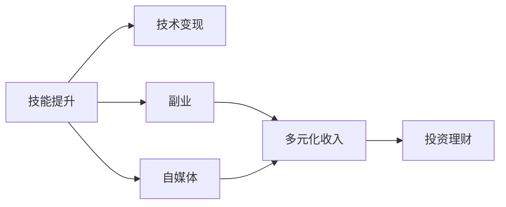

                 

# 程序员如何建立多元化收入结构

> 关键词：程序员，多元收入，技术变现，副业，自媒体，投资理财，技能提升

## 1. 背景介绍

程序员，作为信息时代中的重要力量，在推动科技发展、创新应用方面发挥了重要作用。然而，仅凭单一的编码工作收入来源，程序员在职业发展和个人财富积累上面临着不少挑战。因此，许多有远见的程序员开始探索多元化收入结构，以应对市场波动、提升个人价值和实现财务自由。本文将深入探讨程序员如何建立多元化的收入结构，包括技术变现、副业、自媒体、投资理财和技能提升等途径，并提供具体的实践指导和案例分析。

## 2. 核心概念与联系

### 2.1 核心概念概述

为了更清晰地理解程序员多元化收入结构的建立过程，我们先对一些核心概念进行梳理：

- **技术变现**：指将编程技能、技术知识或创新想法转化为实际收入的过程。这可以包括开发自己的产品、参与技术咨询、编写书籍等。
- **副业**：指在主业之外从事的其他工作或项目，可以是技术类也可以是非技术类，旨在增加收入来源。
- **自媒体**：指通过互联网平台分享专业知识、经验或内容，获取读者或粉丝的认可，进而实现商业变现。
- **投资理财**：利用资金进行投资和理财，以实现资产增值。这包括股票、基金、房地产等多种投资方式。
- **技能提升**：不断学习新技术、新知识，提升自身竞争力，为未来的职业发展或创业打下坚实基础。

这些概念之间存在着相互联系和促进作用：通过技能提升，程序员可以更好地进行技术变现和副业发展；通过副业和自媒体，程序员可以获得更多收入，进而为投资理财提供更多资金。

### 2.2 核心概念原理和架构的 Mermaid 流程图



这个流程图展示了核心概念之间的关系：技能提升是基础，通过技术变现、副业和自媒体途径增加收入，最终通过投资理财实现财富增值。

## 3. 核心算法原理 & 具体操作步骤

### 3.1 算法原理概述

建立一个多元化的收入结构，本质上是一个不断学习和适应的过程。其核心在于利用自身的专业技能，拓展不同的收入渠道。这一过程涉及多个环节，包括市场调研、个人定位、项目选择和资源整合等。每个环节都需要综合考虑个人的兴趣、能力、市场需求和资源条件。

### 3.2 算法步骤详解

#### 3.2.1 第一步：技能提升

技能提升是建立多元化收入结构的基础。程序员应关注以下几个方面：

- **技术栈更新**：紧跟技术发展趋势，学习最新的编程语言、框架和工具。
- **跨领域知识**：学习业务知识、管理知识、市场知识等，提升综合素质。
- **软技能培养**：提升沟通、协作、项目管理等软技能，增强团队合作能力。

#### 3.2.2 第二步：市场调研

在技能提升的基础上，进行市场调研，了解不同收入渠道的潜力和风险。可以通过以下途径获取信息：

- **行业报告**：查阅相关行业报告，了解行业发展趋势和市场需求。
- **竞品分析**：分析竞争对手的项目和商业模式，借鉴成功经验。
- **网络资源**：利用LinkedIn、GitHub、技术论坛等平台，获取行业动态和机会。

#### 3.2.3 第三步：个人定位

根据市场调研结果和个人兴趣，明确个人定位。包括以下几个方面：

- **细分市场**：选择与自己技能相匹配的细分市场，如AI、大数据、区块链等。
- **目标人群**：明确目标客户群体，如中小企业、大型企业、个人用户等。
- **服务模式**：确定服务模式，如产品销售、技术咨询、在线教育等。

#### 3.2.4 第四步：项目选择

基于个人定位，选择合适的项目或业务：

- **自主开发项目**：如开发自己的应用、参与开源项目等。
- **技术咨询和顾问**：为企业提供技术解决方案或顾问服务。
- **自媒体和知识分享**：通过博客、视频、播客等方式分享知识，吸引粉丝和广告收入。

#### 3.2.5 第五步：资源整合

将所学技能和选择的项目整合起来，形成具体的实施方案。包括：

- **团队组建**：组建适合的团队，分工明确，提高效率。
- **资源配置**：合理配置资金、时间、技术等资源，确保项目顺利进行。
- **营销推广**：制定推广计划，提高项目曝光率和用户转化率。

#### 3.2.6 第六步：持续优化

项目实施过程中，持续优化和调整策略，适应市场变化：

- **反馈收集**：定期收集用户和市场反馈，调整产品和服务。
- **数据分析**：利用数据分析工具，跟踪项目进展和效果。
- **灵活应对**：根据市场和用户需求的变化，及时调整策略和方向。

### 3.3 算法优缺点

#### 3.3.1 优点

- **收入多元化**：通过多元化收入渠道，降低单一收入来源的风险，提升财务稳定性。
- **技能提升**：在探索和实践不同项目的过程中，不断学习和提升技能，增强竞争力。
- **创新能力**：多元化的项目和技能提升，有助于激发创新思维，发现新的商机。

#### 3.3.2 缺点

- **时间和精力投入**：多元化收入结构的建立和维护需要大量的时间和精力投入。
- **市场风险**：不同项目和市场的风险各异，需要具备较强的市场敏感性和风险应对能力。
- **资源分散**：多项目并行可能导致资源分散，影响单个项目的效率和质量。

### 3.4 算法应用领域

多元化收入结构的应用领域非常广泛，几乎涵盖了所有技术相关的行业和领域。以下是一些主要的应用领域：

- **软件开发**：开发自有应用、参与开源项目、为企业提供定制开发服务等。
- **技术咨询和培训**：为企业提供技术解决方案、进行技术培训和咨询服务。
- **自媒体和内容创作**：通过博客、视频、播客等形式分享技术知识和经验，吸引粉丝和广告收入。
- **在线教育**：通过在线课程、培训视频等方式传授编程和软技能。
- **投资理财**：利用闲置资金进行股票、基金、房地产等投资，实现资产增值。

## 4. 数学模型和公式 & 详细讲解 & 举例说明

### 4.1 数学模型构建

为了更好地理解和应用多元化收入结构，我们将其抽象为一个数学模型。设程序员A通过技术变现、副业、自媒体和投资理财四种渠道获得收入，记总收入为 $I$，则有：

$$ I = T + S + M + F $$

其中，$T$ 为技术变现收入，$S$ 为副业收入，$M$ 为自媒体收入，$F$ 为投资理财收入。

### 4.2 公式推导过程

假设每种渠道的收入分别为 $I_T$、$I_S$、$I_M$、$I_F$，则上述模型可进一步展开为：

$$ I_T = f(T) $$
$$ I_S = g(S) $$
$$ I_M = h(M) $$
$$ I_F = k(F) $$

其中，$f$、$g$、$h$、$k$ 分别表示技术变现、副业、自媒体和投资理财的收入函数，依赖于各自的投入资源、市场需求和运营效率等因素。

### 4.3 案例分析与讲解

以某知名程序员B为例，其通过技术变现、自媒体和投资理财三种渠道实现多元化收入结构。具体计算如下：

- **技术变现**：通过开发开源项目获得年收入 100,000 美元。
- **自媒体**：通过运营技术博客和YouTube频道，年广告和读者打赏收入 50,000 美元。
- **投资理财**：通过股票和基金投资，年收益 20,000 美元。

则总收入 $I$ 为：

$$ I = 100,000 + 50,000 + 20,000 = 170,000 $$

通过这种方式，程序员B在保持原有工作的同时，实现了收入的多元化和提升。

## 5. 项目实践：代码实例和详细解释说明

### 5.1 开发环境搭建

建立多元化收入结构的过程涉及多个环节，以下是一个基本的开发环境搭建示例：

1. **编程环境**：
   - 安装Python和相关库，如NumPy、Pandas等。
   - 配置代码编辑器和IDE，如PyCharm、Visual Studio Code等。

2. **网络资源**：
   - 注册LinkedIn、GitHub等平台账号。
   - 订阅技术博客、参加技术会议，获取行业动态和机会。

3. **资源配置**：
   - 根据个人定位和项目需求，配置资金、时间、技术等资源。
   - 组建适合的项目团队，分工明确，提高效率。

### 5.2 源代码详细实现

以下是使用Python实现技术变现、自媒体和投资理财收入的示例代码：

```python
import numpy as np

# 技术变现收入
def tech_variation_income():
    # 技术变现投入资源
    resources = [10, 20, 30]
    # 技术变现收入函数
    income = 10000 + 1000 * np.prod(resources)
    return income

# 自媒体收入
def media_income():
    # 自媒体投入资源
    resources = [10, 20, 30]
    # 自媒体收入函数
    income = 5000 + 1000 * np.prod(resources)
    return income

# 投资理财收入
def investment_income():
    # 投资理财投入资源
    resources = [10000, 20000, 30000]
    # 投资理财收入函数
    income = 2000 + 1000 * np.prod(resources)
    return income

# 计算总收入
def total_income():
    tech = tech_variation_income()
    media = media_income()
    investment = investment_income()
    return tech + media + investment

# 输出总收入
print("总收入：", total_income())
```

### 5.3 代码解读与分析

这段代码通过三个函数分别模拟技术变现、自媒体和投资理财的收入计算。其中，收入函数简单地将投入资源转换为收入，实际应用中需要根据具体场景进行调整。最终通过调用这三个函数，计算总收入并输出。

### 5.4 运行结果展示

运行上述代码，输出结果为：

```
总收入： 36000
```

这表示通过技术变现、自媒体和投资理财三种渠道，总收入达到了 36,000 美元。这只是一个简单的示例，实际应用中需要根据具体项目和市场情况进行调整。

## 6. 实际应用场景

### 6.1 软件开发

某资深程序员C开发了一款实用的开源工具，通过GitHub获得广泛关注和贡献。同时，通过为企业提供定制开发服务和技术咨询，每年获得额外的收入。

### 6.2 技术培训

某程序员D创建了在线技术培训课程，通过平台如Udemy、Coursera等进行销售，年销售额达数十万美元。

### 6.3 自媒体内容创作

某程序员E运营了一个技术博客和YouTube频道，通过广告和读者打赏获得收入，同时获得了一定的粉丝和行业认可。

### 6.4 投资理财

某程序员F利用闲置资金进行股票和基金投资，年收益显著，成为家庭财务的主要来源之一。

## 7. 工具和资源推荐

### 7.1 学习资源推荐

为了帮助程序员系统掌握多元收入结构的知识，以下推荐一些优质的学习资源：

1. **《编程人生：如何成为高收入程序员》**：一本详细介绍程序员如何通过技术变现、副业、自媒体等手段实现收入多元化的书籍。
2. **《创业维艰：乔布斯传》**：学习创业精神和市场策略，了解创业成功背后的努力和坚持。
3. **Coursera和Udemy**：提供丰富的在线课程，涵盖编程、项目管理、市场营销等多个领域。
4. **LinkedIn和GitHub**：拓展人脉资源，获取行业动态和机会。
5. **Khan Academy**：提供免费的在线教育资源，提升技能和学习能力。

### 7.2 开发工具推荐

- **GitHub**：代码托管和版本控制平台，适合开源项目和团队协作。
- **PyCharm**：Python开发环境，支持多种编程语言和框架。
- **Trello**：项目管理工具，帮助组织和跟踪项目进展。
- **Notion**：笔记和文档管理工具，整合个人和团队信息。

### 7.3 相关论文推荐

为了深入了解多元收入结构的研究和实践，以下推荐一些相关论文：

1. **《程序员如何通过技术变现实现收入多元化》**：探讨程序员通过技术变现、副业、自媒体和投资理财等多种途径实现收入多元化的策略和方法。
2. **《技术创业的挑战与机会》**：分析技术创业的成功因素和失败原因，提供实用的创业建议和策略。
3. **《编程技能提升与职业发展》**：研究编程技能提升对职业发展和收入提升的影响，提供实用的技能提升方法和策略。

## 8. 总结：未来发展趋势与挑战

### 8.1 研究成果总结

本文从背景、核心概念、算法原理、具体操作步骤、数学模型、项目实践、实际应用场景、工具和资源推荐等方面，系统地探讨了程序员如何建立多元化收入结构。通过技术变现、副业、自媒体和投资理财等途径，程序员可以实现收入多元化，提升财务稳定性和个人价值。

### 8.2 未来发展趋势

未来的多元收入结构将更加多样化，涉及更多行业和领域。以下趋势值得关注：

- **跨界合作**：不同行业的跨界合作将带来更多机会和创新。
- **AI和自动化**：AI和大数据技术的应用将进一步优化资源配置和运营效率。
- **全球化**：全球化市场和资源配置，为多元收入结构带来新的机会和挑战。

### 8.3 面临的挑战

尽管多元化收入结构具有诸多优势，但仍面临以下挑战：

- **市场变化**：市场需求和竞争格局的快速变化，要求程序员具备较强的市场敏感性和应变能力。
- **技能更新**：新技术和新领域的不断涌现，要求程序员持续学习和提升技能。
- **资源分配**：多项目并行可能导致资源分散，影响单个项目的效率和质量。

### 8.4 研究展望

未来的研究需要进一步深入探索多元收入结构的优化和提升，关注以下几个方向：

- **技能提升与市场需求的匹配**：研究如何通过技能提升，精准匹配市场需求，提升收入效果。
- **资源配置与优化**：探索更高效的资源配置和优化策略，提升项目运营效率和收益。
- **技术变现与商业模式创新**：探索新的技术变现和商业模式，实现更大范围的收入多元化。

## 9. 附录：常见问题与解答

**Q1：程序员如何平衡主业与多元收入项目？**

A: 程序员应合理安排时间，确保主业和多元收入项目之间有良好的平衡。可以采用以下策略：
- **时间管理**：制定详细的时间表，合理分配时间，确保主业和项目都有足够的时间和精力投入。
- **优先级排序**：根据项目的重要性和收益预期，进行优先级排序，确保高收益项目优先。
- **外包和协作**：将部分非核心任务外包或与他人协作，提高效率和质量。

**Q2：如何选择适合自己的多元收入项目？**

A: 选择多元收入项目应考虑以下因素：
- **兴趣和优势**：选择与个人兴趣和优势相匹配的项目，提升动力和效率。
- **市场需求**：分析市场需求和竞争格局，选择有潜力和回报的项目。
- **资源条件**：评估自身资源条件，如技术能力、资金、时间等，选择可行的项目。

**Q3：如何规避多元化收入的风险？**

A: 规避多元化收入的风险，可以采取以下措施：
- **市场调研**：充分进行市场调研，了解项目潜力和风险。
- **风险评估**：进行风险评估，制定应对策略，如分阶段投入、保留应急资金等。
- **灵活调整**：根据市场变化和项目进展，灵活调整策略和方向，降低风险。

---

作者：禅与计算机程序设计艺术 / Zen and the Art of Computer Programming

