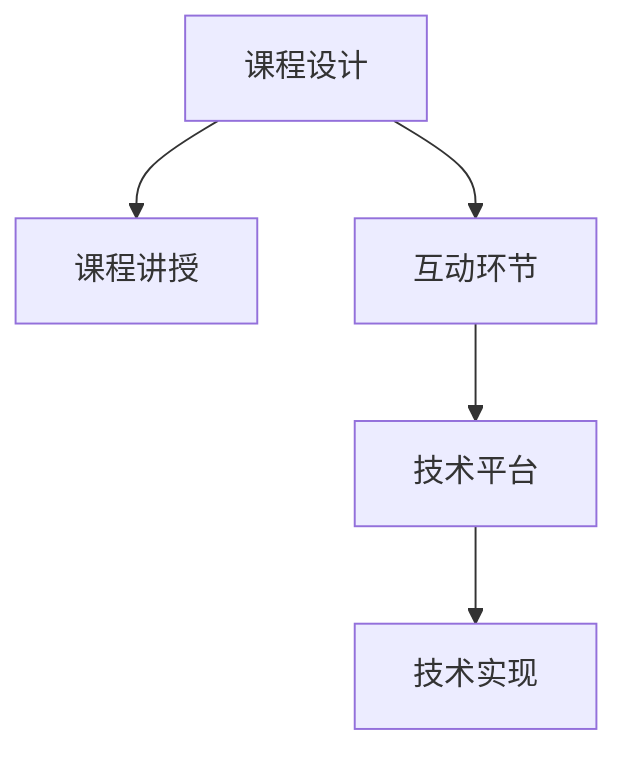

                 

# 程序员如何打造高质量的在线视频课程

## 1. 背景介绍

### 1.1 问题由来
随着在线教育的兴起，越来越多的程序员选择通过在线视频课程进行学习。这不仅极大地丰富了学习资源，也使得学习更加灵活便捷。然而，随着在线视频课程数量的激增，选择适合的学习资源变得越来越困难。质量参差不齐的课程不仅浪费了大量时间，还可能对学习产生负面影响。

### 1.2 问题核心关键点
高质量的在线视频课程具有以下特点：
- 内容丰富，体系完整，知识点覆盖面广。
- 讲解清晰，逻辑严谨，易于理解。
- 实操性强，案例丰富，便于实践。
- 互动性强，及时反馈，提升学习体验。
- 权威性高，师资雄厚，具备行业经验。

为了打造高质量的在线视频课程，程序员需要关注以下关键点：
- 内容设计：如何设计课程内容和结构，使其具有逻辑性和连贯性。
- 讲授技巧：如何讲解课程内容，使其易于理解，富有吸引力。
- 互动机制：如何设计互动环节，激发学生兴趣，提升学习效果。
- 技术实现：如何选择合适的技术工具和平台，实现课程的稳定运行。

## 2. 核心概念与联系

### 2.1 核心概念概述

为了更好地理解如何打造高质量的在线视频课程，本节将介绍几个关键概念：

- 课程设计(Course Design)：指根据学习目标，合理规划课程内容、结构和互动环节的过程。课程设计的好坏直接影响课程的质量和学习效果。

- 课程讲授(Presentation)：指教师如何通过讲授技巧，使复杂的知识点变得易懂有趣，激发学生的学习兴趣。

- 互动环节(Interactive Activities)：指课程中设置的互动环节，如提问、练习、讨论等，帮助学生更好地理解和掌握知识点。

- 技术平台(Platform)：指用于实现和交付在线视频课程的技术工具和平台，如视频录制、编辑、上传，学生管理系统等。

- 技术实现(Implementation)：指将课程设计和讲授内容转化为可执行的课程的技术过程。

这些概念之间的联系可以通过以下Mermaid流程图来展示：



这个流程图展示了几类概念之间的关系：

1. 课程设计是课程讲授和互动环节的基础。
2. 课程讲授和互动环节需要通过技术平台进行实现。
3. 技术平台和实现是课程得以交付的关键。

这些概念共同构成了高质量在线视频课程的核心框架，使得课程设计者能够从多方面进行全面优化。

## 3. 核心算法原理 & 具体操作步骤
### 3.1 算法原理概述

打造高质量的在线视频课程，本质上是将复杂的知识点以结构化、互动化的方式呈现出来，并通过合适的技术手段进行录制、编辑和交付。这一过程涉及多个环节，包括课程设计、讲授、互动和平台技术实现等。

### 3.2 算法步骤详解

以下将详细介绍如何通过步骤化的方式，从课程设计到技术实现，打造高质量的在线视频课程：

**Step 1: 确定课程目标**
- 明确课程的定位和学习目标。
- 分析受众群体，理解他们的学习需求和水平。

**Step 2: 设计课程内容**
- 选择合适的知识点，制定学习路径。
- 编写课程大纲，包括各章节的具体内容和结构。

**Step 3: 准备课程讲授**
- 确定讲授形式，选择线上还是线下。
- 制作讲授材料，如PPT、代码示例等。

**Step 4: 设计互动环节**
- 设置互动问题，引导学生思考和讨论。
- 设计练习和作业，帮助学生巩固知识点。

**Step 5: 选择合适的技术平台**
- 根据课程需求，选择适合的录制、编辑和发布平台。
- 了解平台的使用规则和技术要求，准备所需的技术资源。

**Step 6: 录制和编辑课程**
- 使用录制工具进行课程录制。
- 使用编辑工具对录制内容进行剪辑和优化。

**Step 7: 测试和发布课程**
- 测试课程在技术平台上的运行效果。
- 发布课程，并进行推广和宣传。

### 3.3 算法优缺点

高质量在线视频课程的设计和实现具有以下优点：
1. 灵活便捷：学生可以根据自己的时间安排，随时随地进行学习。
2. 互动性强：通过互动环节，能够更好地激发学生的学习兴趣和参与感。
3. 覆盖面广：能够覆盖更广泛的知识点，提供更丰富的学习资源。

同时，该方法也存在一定的局限性：
1. 制作成本高：需要投入大量的时间和精力进行课程设计和录制。
2. 质量参差不齐：不同课程的质量差别较大，难以进行统一的标准评估。
3. 互动效果有限：线上互动环节难以完全替代线下互动，学生可能缺乏及时反馈和交流机会。

尽管存在这些局限性，但高质量的在线视频课程仍然是当前学习的重要资源。通过不断优化课程设计和技术实现，能够更好地提升学习效果，促进知识的传播和应用。

### 3.4 算法应用领域

高质量的在线视频课程广泛应用于软件开发、人工智能、大数据、区块链等多个领域。以下是几个具体的案例：

**软件开发**
- 如《Java核心编程》课程，涵盖Java基础、面向对象编程、多线程等内容，适合初学者和进阶学习者。

**人工智能**
- 如《深度学习入门》课程，通过具体的案例和实验，讲解深度学习的基本概念和应用。

**大数据**
- 如《Hadoop与大数据技术》课程，详细讲解Hadoop、Spark等大数据框架的使用。

**区块链**
- 如《区块链技术及应用》课程，涵盖区块链的基本原理、共识机制、智能合约等内容。

除了上述这些经典领域，高质量的在线视频课程还可以应用于更多场景中，如教育培训、科学普及、技术交流等，为各行各业提供优质的学习资源。

## 4. 数学模型和公式 & 详细讲解
### 4.1 数学模型构建

在课程设计中，数学模型通常用于描述知识点之间的关系和逻辑结构。以下是一个简单的数学模型构建示例：

假设课程目标为教授学生如何使用算法进行数据排序，那么课程内容可以分为以下几个模块：

1. 算法基础：讲解排序算法的基本概念和分类。
2. 排序算法：详细介绍冒泡排序、插入排序、选择排序等具体算法。
3. 高级算法：讲解快速排序、归并排序等更高效的算法。
4. 应用案例：通过具体案例，展示算法在不同场景下的应用。

这个数学模型清晰地描述了课程内容之间的逻辑关系，便于学生理解和掌握。

### 4.2 公式推导过程

以排序算法为例，我们可以使用以下公式来描述算法的复杂度：

设 $n$ 为排序数据的数量，对于不同的排序算法，其时间复杂度 $T(n)$ 可以表示为：

- 冒泡排序：$T(n) = O(n^2)$
- 快速排序：$T(n) = O(n\log n)$
- 归并排序：$T(n) = O(n\log n)$

通过这些公式，我们可以清晰地展示不同排序算法的时间复杂度差异，帮助学生理解和选择适合的算法。

### 4.3 案例分析与讲解

以下是一个具体的案例分析示例：

假设课程为《Python网络编程》，主要介绍Python网络编程的基本原理和实践。课程内容可以分为以下几个模块：

1. 网络基础：讲解TCP/IP协议、HTTP协议等基本概念。
2. 网络编程：介绍Python的socket模块，讲解网络连接、数据传输等基本操作。
3. 高级应用：讲解Web服务器开发、RESTful API设计等高级应用。
4. 案例分析：通过具体案例，展示网络编程在实际项目中的应用。

在课程设计中，我们可以通过以下方式进行案例分析：

- 选择实际项目中的具体问题，如Web服务器性能优化、API接口设计等。
- 使用Python代码进行问题演示，并进行详细讲解。
- 结合项目实践，探讨问题的解决方案和优化策略。

通过这种方式，学生能够更好地理解理论知识，并在实践中提升应用能力。

## 5. 项目实践：代码实例和详细解释说明
### 5.1 开发环境搭建

在进行课程实践前，我们需要准备好开发环境。以下是使用Python进行项目开发的环境配置流程：

1. 安装Python：从官网下载并安装Python，确保版本稳定。
2. 安装所需的Python包：如Flask、Jinja等，用于开发Web应用。
3. 安装视频编辑工具：如OBS Studio，用于录制和编辑视频。
4. 安装项目管理工具：如Jenkins或Travis CI，用于测试和发布课程。

完成上述步骤后，即可在开发环境中开始项目实践。

### 5.2 源代码详细实现

以下是《Python网络编程》课程的代码实现示例：

```python
# Python网络编程示例代码

# 导入必要的模块
import socket
import threading

# 定义服务器地址和端口
HOST = 'localhost'
PORT = 8888

# 创建服务器套接字
server_socket = socket.socket(socket.AF_INET, socket.SOCK_STREAM)

# 绑定服务器地址和端口
server_socket.bind((HOST, PORT))

# 开始监听连接
server_socket.listen(5)

# 接受客户端连接
while True:
    client_socket, client_address = server_socket.accept()
    print(f"连接建立：{client_address}")

    # 创建子线程处理客户端请求
    client_thread = threading.Thread(target=handle_client, args=(client_socket,))
    client_thread.start()

# 处理客户端请求的函数
def handle_client(client_socket):
    # 接收客户端发送的数据
    request = client_socket.recv(1024).decode()

    # 处理请求并返回响应
    response = process_request(request)
    client_socket.sendall(response.encode())

# 处理请求的函数
def process_request(request):
    # 解析请求
    method, path, body = parse_request(request)

    # 根据请求方法执行相应的操作
    if method == 'GET':
        return get_response(path, body)
    elif method == 'POST':
        return post_response(path, body)
    else:
        return '不支持的方法'

# 解析请求的函数
def parse_request(request):
    # 根据请求格式进行解析
    method, path, body = request.split(' ', 2)[0], request.split(' ', 2)[1], request.split(' ', 2)[2]

    # 返回解析结果
    return method, path, body

# 处理GET请求的函数
def get_response(path, body):
    # 根据请求路径返回响应
    if path == '/':
        return '欢迎访问Python网络编程课程'

    return '不支持的请求路径'

# 处理POST请求的函数
def post_response(path, body):
    # 根据请求路径返回响应
    if path == '/login':
        return '请使用POST方法并发送用户名和密码'

    return '不支持的请求路径'

# 运行服务器
if __name__ == '__main__':
    server_socket.listen(5)
    while True:
        client_socket, client_address = server_socket.accept()
        print(f"连接建立：{client_address}")

        client_thread = threading.Thread(target=handle_client, args=(client_socket,))
        client_thread.start()
```

### 5.3 代码解读与分析

让我们再详细解读一下关键代码的实现细节：

**Python网络编程示例代码**

- `import socket`：导入socket模块，用于创建网络套接字。
- `HOST` 和 `PORT` 变量：定义服务器地址和端口。
- `server_socket`：创建服务器套接字。
- `server_socket.bind((HOST, PORT))`：绑定服务器地址和端口。
- `server_socket.listen(5)`：开始监听连接，最大连接数为5。
- `while True` 循环：不断接受客户端连接。
- `client_socket, client_address = server_socket.accept()`：接受客户端连接。
- `print(f"连接建立：{client_address}")`：输出连接建立信息。
- `client_thread`：创建子线程处理客户端请求。
- `handle_client` 函数：处理客户端请求。
- `parse_request` 函数：解析请求。
- `process_request` 函数：根据请求方法执行相应的操作。
- `get_response` 函数：处理GET请求。
- `post_response` 函数：处理POST请求。
- `if __name__ == '__main__'`：判断当前模块是否为主程序，以运行服务器。

通过这个示例代码，可以清晰地看到如何实现一个简单的Python Web服务器。该示例代码可以帮助学生更好地理解网络编程的基本原理和实践方法。

### 5.4 运行结果展示

在运行上述代码后，可以通过浏览器访问 `http://localhost:8888` 来测试服务器是否正常工作。当浏览器访问服务器时，会输出欢迎信息：

```
欢迎访问Python网络编程课程
```

这个简单的结果展示证明了服务器已经成功启动，并且可以接受HTTP请求。学生可以通过修改代码，进一步扩展功能，实现更加复杂的Web应用。

## 6. 实际应用场景
### 6.1 软件开发培训

在线视频课程可以广泛应用于软件开发培训，帮助学生掌握编程语言和开发工具的使用。

例如，《Python网络编程》课程通过实际的Web应用开发，使学生能够深入理解Python网络编程的基本原理和实践方法。课程中包括Web服务器开发、RESTful API设计等具体内容，能够帮助学生全面掌握Web开发技术。

### 6.2 人工智能入门

在线视频课程还可以用于人工智能入门，帮助学生了解机器学习、深度学习等基本概念和应用。

例如，《深度学习入门》课程通过具体的案例和实验，讲解深度学习的基本概念和应用。课程中包括神经网络的基本原理、反向传播算法等，能够帮助学生全面理解深度学习的基本原理。

### 6.3 大数据技术培训

在线视频课程可以应用于大数据技术培训，帮助学生掌握Hadoop、Spark等大数据框架的使用。

例如，《Hadoop与大数据技术》课程详细讲解Hadoop、Spark等大数据框架的使用。课程中包括数据存储、数据处理、数据可视化等内容，能够帮助学生全面掌握大数据技术。

### 6.4 未来应用展望

随着在线教育的不断发展，高质量的在线视频课程将得到更广泛的应用。未来，在线视频课程可能会在以下几个方面得到进一步发展：

- 互动性增强：通过虚拟现实(VR)、增强现实(AR)等技术，提升课程的互动性和沉浸式体验。
- 个性化推荐：根据学生的学习进度和兴趣，推荐适合的课程内容，提升学习效果。
- 多样化形式：结合视频、音频、文本等多种形式，提供更加丰富和灵活的学习资源。
- 跨平台支持：支持多种设备和平台，使学生可以随时随地进行学习。
- 开源共享：鼓励开源共享课程资源，促进知识的传播和应用。

未来，高质量的在线视频课程将为全球学习者提供更加多样、灵活和高效的学习资源，推动知识的传播和应用。

## 7. 工具和资源推荐
### 7.1 学习资源推荐

为了帮助开发者系统掌握在线视频课程的设计和制作，这里推荐一些优质的学习资源：

1. Coursera、edX等在线教育平台：提供多种高质量的在线课程，涵盖软件开发、人工智能、大数据等多个领域。
2. Udemy、Pluralsight等在线教育平台：提供丰富的课程资源，适合实战练习和技能提升。
3. YouTube等视频分享平台：提供大量的免费视频资源，适合进行自主学习和兴趣探索。
4. GitHub等代码托管平台：提供开放源码的课程项目，方便学习和实践。
5. CSDN等技术社区：提供技术交流和知识分享的平台，适合进行问题讨论和学习资源分享。

通过对这些资源的学习实践，相信你一定能够快速掌握在线视频课程的设计和制作技巧，并用于解决实际的学习问题。

### 7.2 开发工具推荐

高效的开发离不开优秀的工具支持。以下是几款用于在线视频课程开发常用的工具：

1. Google Colab：谷歌提供的免费Jupyter Notebook环境，方便进行在线编程和实验。
2. Adobe Premiere Pro：专业的视频编辑软件，支持多种格式的视频编辑和处理。
3. Camtasia：简单易用的屏幕录制和编辑工具，适合进行课程录制和剪辑。
4. Audacity：免费开源的音频编辑软件，支持多种音频格式的录制和编辑。
5. VLC Media Player：支持多种视频和音频格式，适合进行在线课程的播放和测试。

合理利用这些工具，可以显著提升在线视频课程的开发效率，加快创新迭代的步伐。

### 7.3 相关论文推荐

在线视频课程的研究源于学界的持续研究。以下是几篇奠基性的相关论文，推荐阅读：

1. A Study of Online Learning：研究在线学习平台的使用效果和学习成果，提供丰富的实证数据和分析。
2. Designing Effective Online Courses：介绍在线课程的设计方法和策略，帮助课程设计者提升课程质量。
3. Interactive Learning in Online Courses：研究在线课程的互动性设计，提供具体的案例和实证数据。
4. The Impact of Multimedia in Online Learning：研究多媒体在在线学习中的作用，提供多媒体资源的使用建议。
5. Online Learning Analytics：研究在线学习的数据分析方法，提供数据驱动的学习评估和改进策略。

这些论文代表了大规模在线视频课程的研究方向，能够为课程设计者和制作者提供有价值的参考和指导。

## 8. 总结：未来发展趋势与挑战
### 8.1 研究成果总结

本文对如何打造高质量的在线视频课程进行了全面系统的介绍。首先阐述了在线视频课程的重要性和当前面临的挑战。其次，从课程设计、讲授技巧、互动机制和技术实现等方面，详细讲解了高质量课程的实现步骤。最后，从多个实际应用场景和未来发展趋势的角度，展望了在线视频课程的发展前景。

### 8.2 未来发展趋势

展望未来，在线视频课程将呈现以下几个发展趋势：

1. 多样化形式：未来课程将更加多样化，结合视频、音频、文本等多种形式，提供更加丰富和灵活的学习资源。
2. 互动性增强：通过虚拟现实(VR)、增强现实(AR)等技术，提升课程的互动性和沉浸式体验。
3. 个性化推荐：根据学生的学习进度和兴趣，推荐适合的课程内容，提升学习效果。
4. 跨平台支持：支持多种设备和平台，使学生可以随时随地进行学习。
5. 开源共享：鼓励开源共享课程资源，促进知识的传播和应用。

这些趋势表明，未来在线视频课程将更加多样化和灵活，能够满足不同学习者的需求，提升学习效果。

### 8.3 面临的挑战

尽管在线视频课程具有诸多优点，但在迈向更加智能化、普适化应用的过程中，它仍面临着诸多挑战：

1. 制作成本高：需要投入大量的时间和精力进行课程设计和录制。
2. 质量参差不齐：不同课程的质量差别较大，难以进行统一的标准评估。
3. 互动效果有限：线上互动环节难以完全替代线下互动，学生可能缺乏及时反馈和交流机会。
4. 技术平台限制：不同的技术平台有不同的使用规则和技术要求，需要开发者具备一定的技术基础。
5. 学习效果评估：如何评估在线视频课程的学习效果，确保课程的有效性和实用性，是一个重要的研究方向。

这些挑战需要通过技术进步和教育模式创新来解决，从而推动在线视频课程的进一步发展和应用。

### 8.4 研究展望

未来，在线视频课程的研究需要在以下几个方面寻求新的突破：

1. 探索高质量的课程设计方法：如何设计高质量的课程内容，使其具有逻辑性和连贯性，是未来研究的重要方向。
2. 开发高效的课程制作工具：如何通过技术手段，提高课程制作效率，降低制作成本，是未来研究的另一个重要方向。
3. 研究课程互动机制：如何通过互动环节，激发学生的学习兴趣和参与感，提升学习效果，是未来研究的重点方向。
4. 改进技术平台：如何优化技术平台的使用体验，提高课程的稳定性和可用性，是未来研究的另一个重要方向。
5. 建立学习效果评估标准：如何建立科学合理的在线课程学习效果评估标准，确保课程的有效性和实用性，是未来研究的另一个重要方向。

这些研究方向的探索，将为在线视频课程的进一步发展和应用提供有力的支持和保障。未来，在线视频课程必将在教育、培训、科研等多个领域得到广泛应用，为全球学习者提供更加多样、灵活和高效的学习资源。

## 9. 附录：常见问题与解答
### 9.1 常见问题

**Q1: 如何选择合适的在线视频课程平台？**

A: 在选择在线视频课程平台时，需要考虑以下几个因素：
1. 课程质量：选择平台时，优先考虑课程质量和学习效果。
2. 课程内容：选择平台时，优先考虑课程内容的全面性和实用性。
3. 学习体验：选择平台时，优先考虑学习体验和互动性。
4. 价格和优惠：选择平台时，优先考虑课程价格和优惠活动。

**Q2: 如何设计高质量的在线视频课程？**

A: 设计高质量的在线视频课程需要遵循以下几个原则：
1. 明确课程目标：明确课程的目标和定位，使课程内容具有逻辑性和连贯性。
2. 选择合适的知识点：选择合适的知识点，制定学习路径，使课程内容全面覆盖。
3. 编写详细的课程大纲：编写课程大纲，包括各章节的具体内容和结构，使课程结构清晰。
4. 制作高质量的讲授材料：制作高质量的讲授材料，如PPT、代码示例等，使课程内容易于理解。
5. 设计互动环节：设计互动问题，引导学生思考和讨论，提升学习效果。

**Q3: 如何录制和编辑高质量的视频课程？**

A: 录制和编辑高质量的视频课程需要遵循以下几个步骤：
1. 选择合适的录制工具：选择合适的录制工具，如OBS Studio、Camtasia等。
2. 进行详细规划：规划课程内容和时间安排，明确录制顺序。
3. 进行高质量录制：在录制过程中，确保环境安静，光线良好，声音清晰。
4. 进行高质量编辑：使用视频编辑工具，对录制内容进行剪辑和优化，提升课程效果。
5. 进行测试和反馈：测试课程在技术平台上的运行效果，并收集学生反馈，进行优化。

通过这些步骤，可以显著提升视频课程的质量和效果，满足学生的需求和学习体验。

---

作者：禅与计算机程序设计艺术 / Zen and the Art of Computer Programming

