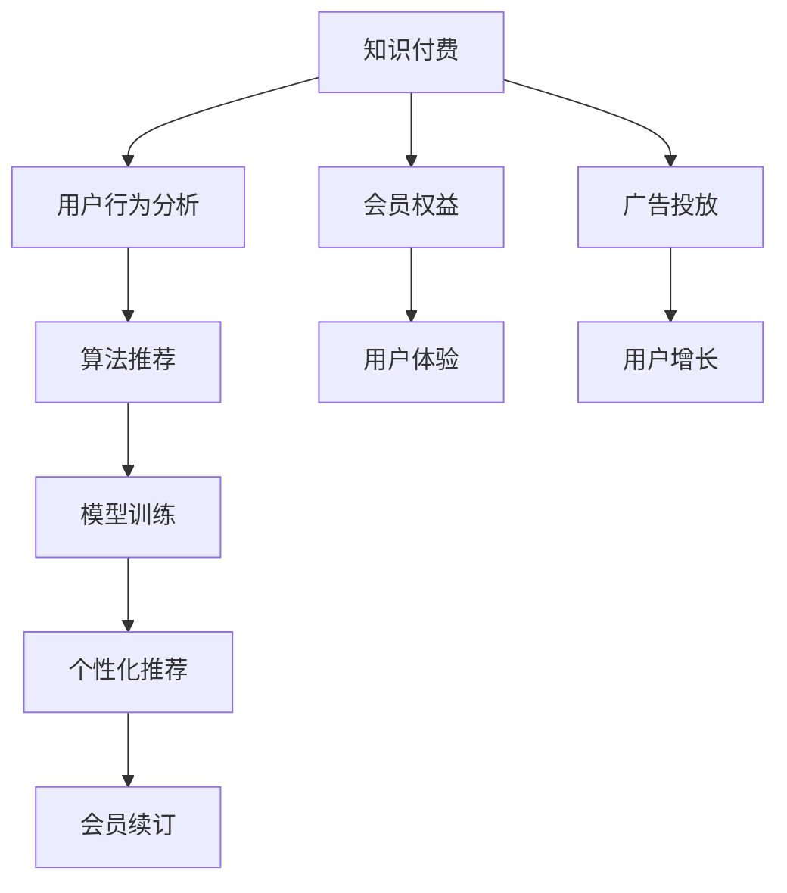

                 

# 程序员如何设计知识付费的会员权益

> 关键词：知识付费,会员权益,用户行为分析,算法推荐,模型训练,个性化推荐,广告投放

## 1. 背景介绍

在互联网时代，知识付费逐渐成为人们获取高质量知识的主要途径。知识付费平台通过提供有价值的课程内容，满足用户学习和自我提升的需求。然而，如何设计合理的会员权益，提升用户粘性，并最大化商业价值，是知识付费平台面临的一大挑战。本文将从核心概念、算法原理、具体操作步骤等方面，系统地介绍如何设计知识付费的会员权益，并给出实际应用场景和未来展望。

## 2. 核心概念与联系

### 2.1 核心概念概述

为更好地理解如何设计知识付费的会员权益，本节将介绍几个密切相关的核心概念：

- 知识付费：指用户为获取高质量的课程内容或知识服务，愿意支付一定费用的商业模式。知识付费平台通过提供定制化的课程服务，满足用户学习和自我提升的需求。
- 会员权益：指知识付费平台为吸引和留住用户，为其提供的专享服务和优惠。通常包括课程折扣、免费试用、内容增值服务等。
- 用户行为分析：指对用户在知识付费平台上的行为进行数据收集和分析，了解用户需求和偏好，为个性化推荐和会员权益设计提供依据。
- 算法推荐：指基于用户行为数据，通过推荐算法为用户推荐最适合其兴趣和需求的课程内容。常见的算法包括协同过滤、基于内容的推荐、矩阵分解等。
- 模型训练：指使用历史用户行为数据，训练推荐模型，预测用户对课程的评分和兴趣。
- 个性化推荐：指根据用户历史行为和当前兴趣，为其推荐最符合其需求的课程内容。个性化推荐能够提升用户满意度和平台黏性，增加会员转化率。
- 广告投放：指在知识付费平台上投放定向广告，引导用户注册和购买课程。广告投放能够快速获取新用户，增加平台收入。

这些核心概念之间的逻辑关系可以通过以下Mermaid流程图来展示：



这个流程图展示了这个系统的核心概念及其之间的关系：

1. 知识付费平台提供课程服务，吸引用户付费注册。
2. 平台利用用户行为数据，设计个性化的会员权益，提升用户粘性。
3. 推荐算法根据用户兴趣，为用户推荐合适的课程内容。
4. 模型训练通过历史数据，预测用户行为，优化推荐效果。
5. 个性化推荐满足用户需求，提高用户满意度和平台黏性。
6. 广告投放吸引新用户，增加平台收入。

这些概念共同构成了知识付费平台的运营框架，使得平台能够有效地吸引和留住用户，实现商业价值的最大化。

## 3. 核心算法原理 & 具体操作步骤
### 3.1 算法原理概述

知识付费平台设计会员权益的核心在于通过算法推荐满足用户需求，增加用户粘性，最终提升商业价值。具体而言，可以分为以下几个步骤：

1. 数据收集：通过用户在平台上的行为数据（如浏览记录、购买记录、评分反馈等），收集用户兴趣和偏好的信息。
2. 特征提取：使用特征工程技术，将原始数据转化为可用于模型训练的特征向量。
3. 模型训练：使用机器学习算法（如协同过滤、基于内容的推荐、矩阵分解等），训练推荐模型，预测用户对课程的评分和兴趣。
4. 个性化推荐：根据用户的评分和兴趣，使用推荐算法为用户推荐最适合的课程内容。
5. 会员权益设计：结合用户行为数据和推荐效果，设计个性化的会员权益，提高用户粘性和平台收益。

### 3.2 算法步骤详解

以协同过滤算法为例，详细介绍如何设计个性化推荐系统。

**Step 1: 数据收集**
- 收集用户在平台上的行为数据，包括浏览记录、购买记录、评分反馈等。
- 使用合适的特征工程技术，将原始数据转化为可用于模型训练的特征向量。

**Step 2: 特征提取**
- 提取用户的兴趣特征，如用户浏览过的课程、购买过的课程、评分较高的课程等。
- 提取课程特征，如课程难度、课程内容、课程评价等。

**Step 3: 模型训练**
- 使用协同过滤算法，将用户和课程视为两个集合，构建用户-课程评分矩阵。
- 计算用户和课程的相似度，得到推荐结果。

**Step 4: 个性化推荐**
- 根据用户的行为数据和历史评分，为用户推荐最感兴趣的课程内容。
- 使用A/B测试等方法，不断优化推荐效果。

**Step 5: 会员权益设计**
- 结合用户行为数据和推荐效果，设计个性化的会员权益，如课程折扣、免费试用、内容增值服务等。
- 定期分析会员数据，优化权益设计，提升会员粘性和平台收益。

### 3.3 算法优缺点

基于协同过滤的个性化推荐系统具有以下优点：
1. 简单易用：协同过滤算法相对简单，易于实现和优化。
2. 效果显著：在用户行为数据充足的情况下，协同过滤算法能够取得不错的推荐效果。
3. 适用性广：协同过滤算法适用于多种推荐场景，如电子商务、音乐推荐、电影推荐等。

但该算法也存在一些局限性：
1. 冷启动问题：协同过滤算法需要足够的用户行为数据，难以处理新用户和老用户推荐的问题。
2. 数据稀疏性：用户-课程评分矩阵容易发生数据稀疏性，影响推荐效果。
3. 可解释性不足：协同过滤算法的推荐结果较难解释，难以满足用户需求。

尽管存在这些局限性，但协同过滤算法仍是当前推荐系统的主要方法之一。未来相关研究的重点在于如何进一步优化推荐算法，提升推荐效果和用户体验。

### 3.4 算法应用领域

基于协同过滤的个性化推荐系统已经在电商、音乐、视频等多个领域得到了广泛应用，为这些平台带来了显著的业务增长。例如：

- 电商推荐：如亚马逊、淘宝等电商平台，通过推荐用户可能感兴趣的商品，提升用户购买转化率。
- 音乐推荐：如网易云音乐、Spotify等音乐平台，根据用户听歌记录，推荐相似歌曲和歌单。
- 视频推荐：如Netflix、Bilibili等视频平台，根据用户观影历史，推荐相关视频内容。

除了上述这些经典应用外，协同过滤算法还被创新性地应用到知识付费平台的课程推荐中，为平台用户提供有价值的课程推荐，提升用户体验和平台收益。

## 4. 数学模型和公式 & 详细讲解  
### 4.1 数学模型构建

基于协同过滤的个性化推荐系统，本质上是一个矩阵分解问题。设用户集合为 $U=\{u_1, u_2, ..., u_n\}$，课程集合为 $I=\{i_1, i_2, ..., i_m\}$，用户 $u_j$ 对课程 $i_k$ 的评分 $R_{i_k}$ 为 $U$ 和 $I$ 的评分矩阵 $R$。则协同过滤算法的目标为分解评分矩阵 $R$，找到用户特征矩阵 $P$ 和课程特征矩阵 $Q$，使得：

$$
R = PQ^T
$$

其中 $P_{uj}$ 和 $Q_{ik}$ 分别表示用户和课程的潜在特征向量。

### 4.2 公式推导过程

以矩阵分解算法为例，推导协同过滤算法的核心公式。

**Step 1: 构建用户-课程评分矩阵**
- 收集用户对课程的评分数据，构建用户-课程评分矩阵 $R$。
- 使用归一化技术处理稀疏数据，如将评分矩阵中的所有元素除以当前用户的平均评分。

**Step 2: 矩阵分解**
- 通过矩阵分解算法，将评分矩阵 $R$ 分解为用户特征矩阵 $P$ 和课程特征矩阵 $Q$，即 $R = PQ^T$。
- 求解潜在特征向量 $P_{uj}$ 和 $Q_{ik}$。

**Step 3: 计算用户-课程相似度**
- 根据分解得到的用户和课程特征向量，计算用户 $u_j$ 和课程 $i_k$ 的相似度 $s(u_j, i_k)$。
- 使用余弦相似度等方法计算相似度。

**Step 4: 推荐结果**
- 根据用户和课程的相似度，为用户 $u_j$ 推荐最感兴趣的课程 $i_k$。
- 使用阈值设置、权重调整等方法优化推荐结果。

### 4.3 案例分析与讲解

假设某知识付费平台有 $n=1000$ 名用户，$m=1000$ 门课程，每个用户对 $k=10$ 门课程进行了评分，评分范围为 $[1, 5]$。用户-课程评分矩阵 $R$ 如下：

$$
R = \begin{bmatrix}
5 & 4 & 2 & ... & 1 \\
3 & 5 & 1 & ... & 4 \\
... & ... & ... & ... & ... \\
... & ... & ... & ... & ... \\
1 & 2 & 3 & ... & 5
\end{bmatrix}
$$

采用矩阵分解算法，将评分矩阵 $R$ 分解为 $P$ 和 $Q$，并计算用户和课程的相似度，得到推荐结果。

## 5. 项目实践：代码实例和详细解释说明
### 5.1 开发环境搭建

在进行个性化推荐系统的开发前，我们需要准备好开发环境。以下是使用Python进行Scikit-learn开发的推荐环境配置流程：

1. 安装Anaconda：从官网下载并安装Anaconda，用于创建独立的Python环境。

2. 创建并激活虚拟环境：
```bash
conda create -n recommendation-env python=3.8 
conda activate recommendation-env
```

3. 安装Scikit-learn：使用conda命令安装Scikit-learn。
```bash
conda install scikit-learn
```

4. 安装其他推荐系统工具包：
```bash
pip install pandas numpy sklearn tqdm
```

完成上述步骤后，即可在`recommendation-env`环境中开始推荐系统的开发。

### 5.2 源代码详细实现

以下是一个简单的推荐系统实现，使用协同过滤算法为用户推荐课程。

```python
import pandas as pd
import numpy as np
from scipy.sparse import csr_matrix
from sklearn.decomposition import NMF
from scipy.spatial.distance import cosine

# 构建用户-课程评分矩阵
data = pd.read_csv('ratings.csv')
user = data['user'].unique()
course = data['course'].unique()
R = csr_matrix((data['rating'], (data['user'], data['course'])), shape=(len(user), len(course)))

# 矩阵分解
model = NMF(n_components=10)
P = model.fit_transform(R.todense())
Q = model.components_.todense()

# 计算用户和课程的相似度
similarity = cosine(P.T, Q)

# 推荐结果
def recommend(user_id, top_n=10):
    user_id = user.index(user_id)
    similarity_user = similarity[user_id, :]
    ranked_indices = np.argsort(similarity_user)[::-1]
    recommended_courses = [course[i] for i in ranked_indices[:top_n]]
    return recommended_courses

# 测试
recommend('user1')
```

以上代码实现了一个基于矩阵分解的推荐系统，通过Scikit-learn的NMF模型，对用户-课程评分矩阵进行分解，计算用户和课程的相似度，并为用户推荐课程。

### 5.3 代码解读与分析

让我们再详细解读一下关键代码的实现细节：

**数据处理**：
- 使用Pandas库读取评分数据，提取用户和课程ID，构建用户-课程评分矩阵 $R$。

**矩阵分解**：
- 使用Scikit-learn的NMF模型，对评分矩阵 $R$ 进行分解，得到用户特征矩阵 $P$ 和课程特征矩阵 $Q$。

**相似度计算**：
- 使用Scipy库的cosine函数，计算用户和课程的相似度。

**推荐结果**：
- 根据用户-课程相似度，为用户推荐最感兴趣的课程。

可以看到，使用Scikit-learn的NMF模型，可以方便地实现基于协同过滤的推荐系统。开发者可以将更多精力放在数据处理、算法改进等高层逻辑上，而不必过多关注底层的实现细节。

当然，工业级的系统实现还需考虑更多因素，如模型的保存和部署、超参数的自动搜索、更灵活的任务适配层等。但核心的推荐算法基本与此类似。

## 6. 实际应用场景
### 6.1 智能课程推荐

基于个性化推荐系统的智能课程推荐，可以广泛应用于知识付费平台。传统课程推荐往往依赖固定课程库和人工筛选，无法精准匹配用户需求。而使用个性化推荐系统，可以实时获取用户行为数据，利用协同过滤算法进行精准推荐，提升用户满意度和平台收益。

在技术实现上，可以收集用户浏览、评分、购买等行为数据，提取和课程相关的特征，在此基础上训练协同过滤模型。模型能够根据用户的历史行为数据，预测其对课程的兴趣，推荐最适合其需求的课程内容。对于用户提出的新课程，还可以接入检索系统实时搜索相关内容，动态生成推荐列表。如此构建的智能课程推荐系统，能大幅提升课程推荐精准度和用户体验。

### 6.2 广告投放

个性化推荐系统不仅可以用于推荐课程，还可以用于定向广告投放。通过收集用户行为数据，识别出有较高购买倾向的用户群体，向其推送相关广告。例如，某知识付费平台可以向浏览过编程课程的用户推送编程书籍、课程等广告，增加广告点击率和购买转化率。

在技术实现上，可以使用推荐系统的相似度算法，识别出与广告内容相关的课程，并基于用户行为数据计算用户对广告内容的兴趣。在合适的时间节点，向用户推送广告，提升广告效果和平台收益。

### 6.3 用户行为分析

除了推荐和广告投放，个性化推荐系统还可以用于用户行为分析，帮助知识付费平台了解用户需求和行为规律，进行针对性的用户运营和产品改进。

例如，某知识付费平台可以通过分析用户浏览和购买数据，了解用户的兴趣和偏好。根据分析结果，推出更有针对性的课程和活动，提升用户满意度和平台收益。同时，平台还可以利用用户行为数据，优化推荐算法和广告投放策略，提升平台的用户增长和收入。

### 6.4 未来应用展望

随着个性化推荐技术的不断发展，其在知识付费平台的应用将更加广泛和深入。未来可能的应用场景包括：

- 动态课程生成：根据用户行为数据和市场趋势，动态生成新课程内容，提升平台竞争力。
- 个性化教学辅助：利用推荐系统，为教师提供个性化的教学建议和资源，提升教学质量。
- 智能客服系统：基于推荐系统，构建智能客服系统，提升客户服务质量。

此外，在教育、医疗、金融等更多领域，个性化推荐系统也有望得到应用，提升各行业的智能化水平，带来新的业务价值。相信随着技术的不断进步，个性化推荐系统必将在各个领域发挥更大的作用，助力各行各业的发展。

## 7. 工具和资源推荐
### 7.1 学习资源推荐

为了帮助开发者系统掌握个性化推荐系统的理论基础和实践技巧，这里推荐一些优质的学习资源：

1. 《推荐系统实践》系列博文：由大模型技术专家撰写，深入浅出地介绍了推荐系统原理、协同过滤、基于内容的推荐等前沿话题。

2. 《Recommender Systems》课程：由斯坦福大学开设的推荐系统明星课程，涵盖推荐系统的基本概念和经典算法，适合入门学习。

3. 《Applied Recommender Systems》书籍：推荐系统领域的经典教材，系统地介绍了推荐系统的方法和应用，适合深度学习工程师和推荐系统开发者。

4. Kaggle推荐系统竞赛：Kaggle上举办的多场推荐系统竞赛，可以通过竞赛数据集和竞赛平台，实践推荐系统的算法和优化。

5. OpenRec系统开源项目：提供多模态推荐系统的开源代码，支持协同过滤、深度学习等方法，适合推荐系统开发者的学习实践。

通过对这些资源的学习实践，相信你一定能够快速掌握个性化推荐系统的精髓，并用于解决实际的推荐问题。

### 7.2 开发工具推荐

高效的开发离不开优秀的工具支持。以下是几款用于个性化推荐系统开发的常用工具：

1. Scikit-learn：基于Python的开源推荐系统库，简单易用，支持多种推荐算法，适合快速迭代研究。

2. TensorFlow：由Google主导开发的开源深度学习框架，支持大规模工程应用。

3. PyTorch：基于Python的开源深度学习框架，灵活动态的计算图，适合快速迭代研究。

4. Weights & Biases：模型训练的实验跟踪工具，可以记录和可视化模型训练过程中的各项指标，方便对比和调优。

5. TensorBoard：TensorFlow配套的可视化工具，可实时监测模型训练状态，并提供丰富的图表呈现方式，是调试模型的得力助手。

6. Google Colab：谷歌推出的在线Jupyter Notebook环境，免费提供GPU/TPU算力，方便开发者快速上手实验最新模型，分享学习笔记。

合理利用这些工具，可以显著提升个性化推荐系统的开发效率，加快创新迭代的步伐。

### 7.3 相关论文推荐

个性化推荐技术的发展源于学界的持续研究。以下是几篇奠基性的相关论文，推荐阅读：

1. Amazon Product Recommendation Systems: Architecture, Algorithms, and Business Value：介绍亚马逊推荐系统的架构和算法，展示了推荐系统对业务价值的显著提升。

2. Matrix Factorization Techniques for Recommender Systems：系统地介绍了矩阵分解算法，并展示了其在推荐系统中的应用效果。

3. Adaptive Collaborative Filtering using Matrix Factorization Techniques：提出自适应协同过滤算法，通过引入自适应技术，提升推荐效果和用户满意度。

4. Neural Collaborative Filtering：引入神经网络模型，解决协同过滤算法的冷启动问题，提升推荐效果和用户体验。

5. Deep Matrix Factorization：提出深度矩阵分解算法，通过引入深度神经网络，提升推荐效果和模型泛化能力。

这些论文代表了个性化推荐技术的发展脉络。通过学习这些前沿成果，可以帮助研究者把握学科前进方向，激发更多的创新灵感。

## 8. 总结：未来发展趋势与挑战
### 8.1 总结

本文对个性化推荐系统的设计和优化进行了全面系统的介绍。首先阐述了知识付费平台的会员权益设计，明确了推荐系统在提升用户粘性和平台收益方面的独特价值。其次，从原理到实践，详细讲解了推荐系统的数学原理和核心步骤，给出了推荐系统开发的全流程示例。同时，本文还广泛探讨了推荐系统在推荐、广告、用户行为分析等多个领域的应用前景，展示了推荐系统范式的巨大潜力。最后，本文精选了推荐系统的各类学习资源，力求为读者提供全方位的技术指引。

通过本文的系统梳理，可以看到，个性化推荐系统已经在电商、音乐、视频等多个领域得到了广泛应用，为这些平台带来了显著的业务增长。未来，伴随推荐算法和技术的不断演进，个性化推荐系统必将在更多领域得到应用，为各行各业带来新的业务价值。

### 8.2 未来发展趋势

展望未来，个性化推荐系统将呈现以下几个发展趋势：

1. 推荐算法多样化：除了协同过滤算法，未来将涌现更多推荐算法，如基于内容的推荐、基于深度学习的推荐、混合推荐等，满足不同场景下的推荐需求。

2. 实时化推荐：通过流式数据处理和实时计算技术，推荐系统能够实时响应用户需求，提升推荐效果和用户体验。

3. 跨模态推荐：未来推荐系统将融合视觉、语音、文本等多模态数据，构建更加全面、准确的推荐模型。

4. 用户隐私保护：随着用户隐私保护的重视，推荐系统将引入差分隐私、联邦学习等技术，保护用户数据安全。

5. 社会化推荐：未来推荐系统将引入社会化信息，如用户社交网络、群体行为等，构建更普适、鲁棒的推荐模型。

这些趋势凸显了个性化推荐系统的发展方向。这些方向的探索发展，必将进一步提升推荐系统的性能和用户体验，为各行各业带来新的业务价值。

### 8.3 面临的挑战

尽管个性化推荐系统已经取得了显著的进展，但在迈向更加智能化、普适化应用的过程中，它仍面临着诸多挑战：

1. 数据隐私问题：推荐系统需要大量用户数据，如何在保护用户隐私的同时，充分利用数据进行推荐，是一个重要问题。

2. 模型复杂性：随着推荐算法和模型结构的复杂化，推荐系统的训练和优化变得更加困难，需要更多的计算资源和时间。

3. 冷启动问题：对于新用户和老用户，推荐系统的表现往往较差，需要更多的数据和算法支持。

4. 多模态融合：融合多模态数据进行推荐，需要更多的算法和技术支持，目前仍处于探索阶段。

5. 系统稳定性：推荐系统的稳定性受多种因素影响，如何保证系统在不同情况下都能稳定运行，是一个需要解决的问题。

这些挑战需要研究者从数据、算法、工程等多个维度进行全面优化，才能不断提升推荐系统的性能和用户体验。

### 8.4 研究展望

面对个性化推荐系统面临的挑战，未来的研究需要在以下几个方面寻求新的突破：

1. 探索更加高效、多样化的推荐算法。开发新的推荐算法，解决现有算法的不足，提升推荐效果和用户体验。

2. 引入更多的用户行为数据。收集更多的用户行为数据，提高推荐系统的准确性和鲁棒性。

3. 优化模型训练和优化技术。优化推荐模型的训练和优化过程，提高模型泛化能力和稳定性。

4. 引入跨模态数据融合技术。利用多模态数据进行推荐，提升推荐系统的全面性和准确性。

5. 引入差分隐私和联邦学习技术。保护用户隐私，提高推荐系统的可信度和用户满意度。

6. 引入社会化推荐算法。利用社会化信息进行推荐，提高推荐系统的普适性和鲁棒性。

这些研究方向的探索，必将引领个性化推荐系统迈向更高的台阶，为知识付费平台和各行各业带来新的业务价值。相信随着技术的不断进步，个性化推荐系统必将在更多领域得到应用，助力各行各业的发展。

## 9. 附录：常见问题与解答

**Q1：推荐系统如何应对新用户和老用户？**

A: 推荐系统可以通过以下方法应对新用户和老用户：

1. 冷启动处理：对于新用户，可以使用基于内容的推荐、基于协同过滤的推荐等方法，根据用户行为数据和历史数据进行推荐。

2. 老用户行为数据：对于老用户，可以基于其历史行为数据和评分记录，进行推荐。可以通过协同过滤、矩阵分解等方法，为用户推荐最感兴趣的课程。

3. 混合推荐：结合多种推荐方法，根据用户类型和数据情况，选择合适的方法进行推荐。

4. 新用户引导：对于新用户，可以通过引导注册、赠送课程、提供免费试用等策略，增加用户粘性。

**Q2：推荐系统如何应对数据稀疏性问题？**

A: 推荐系统可以采取以下措施应对数据稀疏性问题：

1. 数据补全：对于缺失的数据，可以使用均值、中位数、插值等方法进行补全，提高数据的完整性。

2. 数据稀疏性处理：对于稀疏的评分矩阵，可以使用矩阵分解、低秩逼近等方法进行处理，减小数据的稀疏性。

3. 用户行为数据增强：收集更多的用户行为数据，如浏览记录、评论、分享等，增加数据的丰富性。

4. 混合推荐：结合多种推荐方法，根据数据情况和用户行为，选择合适的方法进行推荐。

5. 协同过滤改进：使用改进的协同过滤算法，如基于矩阵分解、深度神经网络等方法，提升推荐效果和系统鲁棒性。

这些措施可以帮助推荐系统更好地应对数据稀疏性问题，提升推荐效果和用户体验。

**Q3：推荐系统如何应对模型复杂性问题？**

A: 推荐系统可以通过以下方法应对模型复杂性问题：

1. 模型简化：对推荐模型进行简化和优化，减少模型的复杂度和计算量，提高模型的泛化能力和稳定性。

2. 分布式训练：使用分布式训练技术，提高模型的训练效率和稳定性。

3. 模型压缩和优化：使用模型压缩和优化技术，如剪枝、量化、蒸馏等，减小模型的大小和计算量。

4. 轻量级模型：开发轻量级的推荐模型，如基于知识图谱、基于图神经网络的模型，提高模型的计算效率和稳定性。

5. 自适应推荐：引入自适应技术，根据用户行为和数据情况，动态调整推荐算法和模型参数，提升推荐效果和用户体验。

这些方法可以帮助推荐系统更好地应对模型复杂性问题，提升模型的性能和用户体验。

**Q4：推荐系统如何应对数据隐私问题？**

A: 推荐系统可以通过以下方法应对数据隐私问题：

1. 差分隐私：在推荐模型的训练和优化过程中，引入差分隐私技术，保护用户数据的隐私。

2. 联邦学习：使用联邦学习技术，在用户数据不离开本地的前提下，进行模型训练和优化，保护用户数据的隐私。

3. 数据匿名化：对用户数据进行匿名化处理，保护用户隐私。

4. 数据加密：对用户数据进行加密处理，保护用户隐私。

5. 隐私保护推荐：在推荐模型中加入隐私保护技术，如隐私保护矩阵分解、隐私保护协同过滤等，保护用户隐私。

这些方法可以帮助推荐系统更好地应对数据隐私问题，保护用户数据的隐私和安全。

---

作者：禅与计算机程序设计艺术 / Zen and the Art of Computer Programming

