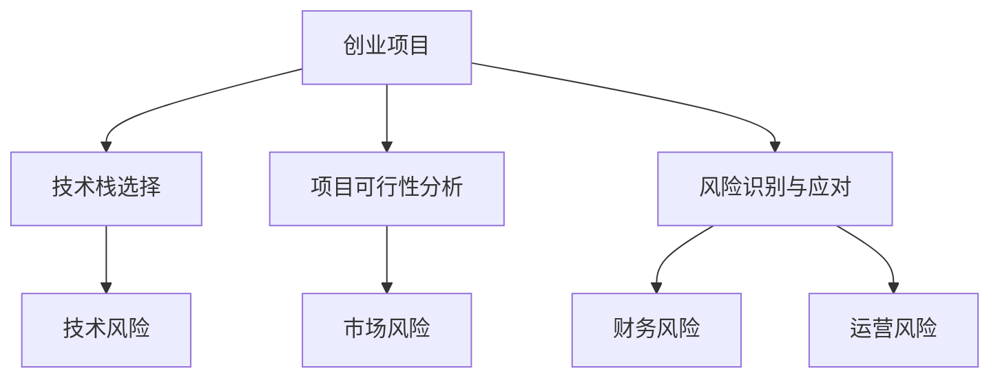

                 

# 程序员如何评估创业风险

> 关键词：创业风险评估, 风险管理, 创业决策, 技术栈选择, 项目可行性分析

## 1. 背景介绍

### 1.1 问题由来
在当今快速变化的商业环境中，创业公司面临着前所未有的机遇与挑战。技术创新、市场需求、市场竞争等诸多因素，都深刻影响着创业项目的成败。然而，即便项目本身具备了强大的技术实力和市场潜力，也有可能在项目实施过程中遇到各种意料之外的挑战，导致项目失败。因此，对于创业者来说，如何进行科学的创业风险评估，制定合理的风险管理策略，显得尤为重要。

本文将从创业风险评估的角度出发，介绍如何基于创业项目的核心要素和技术栈，对项目进行全面的风险评估，帮助创业者在项目实施前预见潜在风险，规避风险，提升项目的成功率。

### 1.2 问题核心关键点
创业风险评估的核心在于对创业项目的技术、市场、财务、运营等多个维度进行全面分析，识别潜在的风险点和问题，并制定相应的风险应对策略。具体来说，以下几个方面是评估的重点：

- **技术栈选择**：合适的技术栈能够大幅提升项目的开发效率和维护成本。但技术栈的选择也存在一定的风险，如技术选型过时、依赖关系复杂、难以维护等。
- **项目可行性分析**：包括市场需求分析、竞争分析、成本分析等，帮助创业者确定项目是否具有商业价值和市场前景。
- **风险识别与应对**：识别项目实施过程中可能遇到的各种风险，如技术风险、市场风险、运营风险等，并制定相应的风险管理策略。

通过科学的创业风险评估，创业者可以更好地把握项目的整体状况，提前发现并应对潜在问题，确保项目的顺利进行和成功落地。

## 2. 核心概念与联系

### 2.1 核心概念概述

在进行创业风险评估时，需要理解并关注以下关键概念：

- **创业项目**：指创业者基于一定的市场需求和技术趋势，启动的一个或多个相关产品、服务或解决方案的集合。
- **技术栈**：指开发项目所需的一组技术工具、框架、库、平台等，是项目实施的基石。
- **技术风险**：指技术栈的选择和使用过程中，可能面临的各种技术问题，如技术选型不当、技术更新快速等。
- **市场风险**：指项目在市场推广和运营过程中，可能遇到的市场变化、客户需求变动等问题。
- **财务风险**：指项目在资金筹集、成本控制、收入实现等方面可能遇到的各种财务问题。
- **运营风险**：指项目在产品上线后，日常运营和维护过程中可能遇到的各种问题，如用户增长缓慢、客户流失等。

这些概念之间的逻辑关系可以通过以下Mermaid流程图来展示：



这个流程图展示了创业项目中各核心要素之间的关系：

1. 创业项目是整个评估的中心。
2. 技术栈选择直接影响项目的开发效率和维护成本。
3. 项目可行性分析是评估项目是否具有商业价值的重要手段。
4. 风险识别与应对是识别并处理项目实施过程中可能遇到的各种风险。
5. 技术风险、市场风险、财务风险和运营风险分别从不同的角度评估项目的风险状况。

## 3. 核心算法原理 & 具体操作步骤

### 3.1 算法原理概述

创业风险评估的本质是一个多维度、动态的决策过程。其核心在于通过对创业项目的技术、市场、财务、运营等多个维度进行全面的分析，识别并量化潜在的风险因素，制定相应的风险管理策略，从而降低项目的实施风险。

形式化地，假设创业项目为 $P$，技术栈选择为 $T$，项目可行性分析为 $C$，风险识别与应对为 $R$，则创业风险评估的总体目标为：

$$
\min_{P, T, C, R} \mathcal{R}(P, T, C, R)
$$

其中 $\mathcal{R}$ 为风险评估函数，衡量创业项目的整体风险水平。

具体评估步骤包括：

1. 对项目的技术栈进行详细分析，评估其技术选型、依赖关系、维护成本等。
2. 对项目的市场潜力进行全面评估，包括市场需求、竞争对手、市场趋势等。
3. 对项目的财务状况进行详细分析，评估其资金需求、成本控制、收入实现等。
4. 对项目的运营状况进行全面分析，评估其用户增长、客户流失、技术迭代等。
5. 综合各维度评估结果，量化整体风险水平，并制定相应的风险管理策略。

### 3.2 算法步骤详解

#### 3.2.1 技术栈评估

技术栈的选择是创业项目成功与否的关键因素之一。评估技术栈的优劣，主要从以下几个方面进行：

1. **技术选型**：评估所选技术的成熟度、社区活跃度、未来发展前景等。
2. **依赖关系**：评估技术栈中不同组件之间的依赖关系是否合理，是否存在严重的依赖瓶颈。
3. **维护成本**：评估技术栈的维护难度、学习成本、开发效率等。
4. **扩展性**：评估技术栈是否易于扩展，是否能够适应业务增长。

具体评估方法包括：

- **技术调研**：通过阅读技术文档、社区讨论、专家访谈等方式，了解所选技术的优缺点。
- **代码审计**：通过代码审查，评估技术栈的质量和维护难度。
- **性能测试**：通过性能测试，评估技术栈的响应速度、并发能力等。

#### 3.2.2 项目可行性分析

项目可行性分析是评估创业项目是否具备商业价值的关键步骤。评估的重点是：

1. **市场需求**：评估目标市场的需求量、增长趋势、用户画像等。
2. **竞争环境**：评估主要竞争对手的优劣势、市场占有率等。
3. **收入模型**：评估项目的收入来源、定价策略、盈利能力等。

具体评估方法包括：

- **市场调研**：通过问卷调查、用户访谈等方式，获取目标市场的需求信息。
- **竞争分析**：通过SWOT分析、五力模型等方式，评估竞争环境。
- **收入分析**：通过财务模型、成本分析等方式，评估项目的盈利能力。

#### 3.2.3 风险识别与应对

风险识别与应对是创业风险评估的核心环节。评估的风险点包括：

1. **技术风险**：如技术选型不当、依赖关系复杂、技术更新快速等。
2. **市场风险**：如市场需求变动、竞争对手变化、市场趋势变化等。
3. **财务风险**：如资金筹集困难、成本控制不当、收入实现缓慢等。
4. **运营风险**：如用户增长缓慢、客户流失、技术迭代困难等。

具体评估方法包括：

- **风险识别**：通过专家访谈、风险清单、风险矩阵等方式，识别项目可能面临的各种风险。
- **风险量化**：通过量化分析、蒙特卡洛模拟等方式，评估风险的可能性和影响程度。
- **风险应对**：制定相应的风险应对策略，如风险规避、风险转移、风险缓解等。

#### 3.2.4 综合评估与决策

综合各维度评估结果，量化整体风险水平，并制定相应的风险管理策略。具体步骤如下：

1. **风险量化**：对技术风险、市场风险、财务风险、运营风险等进行量化分析，计算整体风险水平。
2. **决策制定**：根据风险评估结果，制定相应的风险管理策略，如优先解决高风险问题、调整技术栈等。
3. **持续监控**：在项目实施过程中，持续监控项目风险，及时调整应对策略。

### 3.3 算法优缺点

基于多维度、动态的创业风险评估方法具有以下优点：

1. **全面性**：通过对技术、市场、财务、运营等多维度的全面分析，能够更全面地识别潜在的风险点。
2. **科学性**：通过定量和定性结合的方式，对风险进行量化分析，提供科学的决策依据。
3. **动态性**：在项目实施过程中，持续监控风险变化，及时调整应对策略。

同时，该方法也存在一定的局限性：

1. **主观性强**：评估过程中，评估人员的主观判断和经验对结果影响较大。
2. **复杂度高**：评估过程中，需要考虑多个维度和因素，较为复杂。
3. **数据依赖**：评估结果依赖于获取的数据质量和数量，数据不足或失真可能导致评估结果不准确。

尽管存在这些局限性，但就目前而言，基于多维度、动态的创业风险评估方法仍是大规模创业项目风险管理的重要手段。未来相关研究的重点在于如何进一步降低评估的主观性，提高数据的准确性和获取效率，同时兼顾可解释性和伦理安全性等因素。

### 3.4 算法应用领域

创业风险评估的方法不仅适用于创业公司的技术开发和市场推广，还广泛应用于各种投资决策、企业风险管理、项目评估等领域。具体应用场景包括：

- **创业项目评估**：对初创公司的项目进行全面评估，识别潜在风险点，制定风险管理策略。
- **投资决策**：评估创业公司的技术实力、市场前景、运营状况等，制定投资决策依据。
- **企业风险管理**：对企业内部各项目进行风险评估，识别并处理潜在风险，确保企业稳定发展。
- **项目评估**：对各类项目进行风险评估，确定项目的可行性和投资价值。

通过科学的风险评估方法，可以帮助投资者、创业者更好地把握项目的整体状况，提前发现并应对潜在问题，确保项目的顺利进行和成功落地。

## 4. 数学模型和公式 & 详细讲解 & 举例说明

### 4.1 数学模型构建

在创业风险评估中，我们通常使用多目标优化模型进行量化分析。假设创业项目 $P$ 的风险水平为 $R$，技术栈选择 $T$ 的技术风险为 $T_r$，项目可行性分析 $C$ 的市场风险为 $C_r$，财务风险为 $C_f$，运营风险为 $C_o$，则风险评估函数 $\mathcal{R}$ 可以表示为：

$$
\mathcal{R}(P, T, C, R) = \omega_1 \times T_r + \omega_2 \times C_r + \omega_3 \times C_f + \omega_4 \times C_o + \omega_5 \times R
$$

其中 $\omega_1, \omega_2, \omega_3, \omega_4, \omega_5$ 为权重系数，用于调整各风险因素的影响程度。

### 4.2 公式推导过程

为了便于解释，这里以二项式模型为例进行推导。假设创业项目 $P$ 的市场成功率 $p$ 为二项分布，即 $p \sim Bernoulli(\pi)$，其中 $\pi$ 为成功概率。技术栈选择 $T$ 对成功率的影响为 $\theta$，则成功概率可以表示为：

$$
p = \pi \times (1 - \theta)
$$

假设成功率的概率分布为 $f(p)$，则风险评估函数可以表示为：

$$
\mathcal{R}(P, T) = \int f(p) \times (1 - p) dp
$$

通过计算积分，可以得到风险评估函数的具体表达式，用于量化项目的风险水平。

### 4.3 案例分析与讲解

以一家创业公司开发的一款移动应用为例，假设公司选择的技术栈为 $T_1$，市场成功概率为 $p$，则可以根据上述公式，计算出风险评估函数的具体值，进而评估项目的风险水平。

具体步骤如下：

1. **确定成功概率**：通过市场调研和竞争分析，确定项目成功的概率 $p$。
2. **确定技术栈影响**：通过技术选型和代码审计，确定技术栈对成功率的影响 $\theta$。
3. **计算风险评估函数**：根据公式计算出风险评估函数的具体值，量化项目的风险水平。
4. **制定应对策略**：根据风险评估结果，制定相应的风险应对策略，如调整技术栈、增加市场推广力度等。

## 5. 项目实践：代码实例和详细解释说明

### 5.1 开发环境搭建

在进行创业风险评估的实践过程中，需要准备好开发环境。以下是使用Python进行风险评估的开发环境配置流程：

1. 安装Anaconda：从官网下载并安装Anaconda，用于创建独立的Python环境。

2. 创建并激活虚拟环境：
```bash
conda create -n risk-eval python=3.8 
conda activate risk-eval
```

3. 安装必要的库：
```bash
pip install pandas numpy matplotlib scikit-learn
```

4. 安装Python可视化库：
```bash
pip install matplotlib seaborn
```

完成上述步骤后，即可在`risk-eval`环境中开始实践。

### 5.2 源代码详细实现

这里我们以一家创业公司开发的一款移动应用为例，使用Python和Pandas库进行风险评估。

首先，定义项目成功率和成功概率的数学模型：

```python
import pandas as pd
import numpy as np
import matplotlib.pyplot as plt

# 设定成功率概率分布
p = np.linspace(0, 1, 1001)
f_p = (p**(0.5) * (1 - p)**(0.5)) / (np.sqrt(2 * np.pi))

# 设定技术栈对成功率的影响
theta = 0.2

# 计算风险评估函数
R = np.integrate(lambda x: f_p * (1 - x), (0, 1))
R = R * theta

print(f"风险评估函数值为: {R:.2f}")
```

然后，进行项目成功率和市场调研的模拟：

```python
# 假设成功概率为0.8
p = 0.8

# 计算成功率
p_success = p * (1 - theta)

# 计算风险评估函数
R = np.integrate(lambda x: f_p * (1 - x), (0, p_success))
R = R * theta

print(f"项目成功概率为: {p_success:.2f}")
print(f"风险评估函数值为: {R:.2f}")
```

最后，通过可视化展示结果：

```python
# 绘制风险评估函数曲线
plt.plot(p, R, label='Risk Assessment Function')
plt.xlabel('Probability of Success')
plt.ylabel('Risk Assessment Function')
plt.legend()
plt.show()
```

### 5.3 代码解读与分析

让我们再详细解读一下关键代码的实现细节：

**pandas库**：
- `p`：表示市场成功概率的取值范围，从0到1，步长为0.01。
- `f_p`：通过数学公式计算市场成功概率的分布。

**matplotlib库**：
- `plt.plot(p, R, label='Risk Assessment Function')`：绘制风险评估函数曲线，其中 `p` 为横轴，`R` 为纵轴，`label` 为曲线标签。
- `plt.xlabel('Probability of Success')` 和 `plt.ylabel('Risk Assessment Function')`：分别设置横轴和纵轴的标签。
- `plt.legend()`：显示图例。

可以看到，Python和Pandas库的结合使用，使得风险评估过程变得简洁高效。开发者可以通过调整代码中的参数，实现不同的风险评估场景，验证风险评估方法的有效性。

## 6. 实际应用场景

### 6.1 创业项目评估

在创业项目评估中，风险评估方法可以帮助创业者全面衡量项目的各个方面，识别潜在风险，制定相应的应对策略。

以一家初创公司开发的一款社交应用为例，通过风险评估方法，可以识别出技术选型不当、市场需求变动等风险点，提前采取措施进行规避，确保项目的顺利进行。

### 6.2 投资决策

投资决策中，风险评估方法可以帮助投资者全面了解创业项目的风险状况，评估项目的投资价值，制定投资决策依据。

以一家投资公司投资一家创业公司为例，通过风险评估方法，可以识别出创业公司的技术选型、市场前景、运营状况等风险点，评估项目的投资价值，制定投资决策依据。

### 6.3 企业风险管理

企业风险管理中，风险评估方法可以帮助企业全面评估内部各项目的风险状况，识别潜在风险，制定相应的应对策略，确保企业稳定发展。

以一家大公司内部多个项目为例，通过风险评估方法，可以识别出各项目的技术风险、市场风险、财务风险、运营风险等风险点，制定相应的风险管理策略，确保企业的稳定发展。

### 6.4 未来应用展望

随着创业风险评估方法的不断发展，未来将在更多领域得到应用，为创业公司和投资者带来新的突破：

- **更加科学化的评估方法**：未来的评估方法将更加科学化和定量化的结合，提高评估的准确性和可靠性。
- **多维度、多层次的风险评估**：未来的评估方法将从技术、市场、财务、运营等多个维度进行综合评估，识别全面的风险点。
- **大数据、人工智能的结合**：未来的评估方法将结合大数据、人工智能技术，提升评估的效率和精度。
- **更加全面的风险应对策略**：未来的评估方法将结合风险管理理论，制定更加全面、科学的风险应对策略。

总之，创业风险评估方法将继续在创业项目、投资决策、企业风险管理等多个领域发挥重要作用，推动创业生态的健康发展。

## 7. 工具和资源推荐

### 7.1 学习资源推荐

为了帮助开发者系统掌握创业风险评估的理论基础和实践技巧，这里推荐一些优质的学习资源：

1. 《创业风险评估》系列博文：由大公司风险管理专家撰写，深入浅出地介绍了创业风险评估的理论基础和实践方法。
2. Coursera《创业与投资》课程：斯坦福大学开设的创业与投资课程，有Lecture视频和配套作业，带你入门创业与投资的基础概念。
3. 《创业风险管理》书籍：创业风险管理专家所著，全面介绍了创业风险评估的理论和方法。
4. RiskMetrics官方文档：RiskMetrics的官方文档，提供了完整的创业风险评估模型和应用样例，是实际应用的重要参考。

通过对这些资源的学习实践，相信你一定能够快速掌握创业风险评估的精髓，并用于解决实际的创业问题。

### 7.2 开发工具推荐

高效的开发离不开优秀的工具支持。以下是几款用于创业风险评估开发的常用工具：

1. Python：灵活的动态语言，支持大规模数据分析和科学计算，是风险评估的主要语言。
2. R语言：擅长统计分析和大数据处理，适用于风险评估中复杂的数据建模和分析。
3. SQL：关系型数据库管理系统，用于数据存储和管理。
4. Jupyter Notebook：交互式编程环境，便于开发和调试。
5. Apache Spark：分布式计算框架，支持大规模数据的处理和分析。

合理利用这些工具，可以显著提升创业风险评估的开发效率，加快创新迭代的步伐。

### 7.3 相关论文推荐

创业风险评估的方法源于学界的持续研究。以下是几篇奠基性的相关论文，推荐阅读：

1. The Rise of Big Data in Business Analytics（大数据在商业分析中的应用）：展示了大数据技术在创业风险评估中的应用。
2. Machine Learning for Risk Management: A Survey（机器学习在风险管理中的应用）：介绍了机器学习在风险评估中的应用，包括分类、回归、聚类等算法。
3. The Impact of Cybersecurity on Business Risk Management（网络安全对商业风险管理的影响）：探讨了网络安全在创业项目中的风险评估和管理。
4. The Role of Big Data in Financial Risk Management（大数据在金融风险管理中的应用）：展示了大数据技术在金融风险评估中的应用。
5. Robust Risk Assessment for Cybersecurity Attacks（网络安全攻击的稳健风险评估）：介绍了如何基于机器学习算法进行网络安全风险评估。

这些论文代表了大规模创业风险评估的发展脉络。通过学习这些前沿成果，可以帮助研究者把握学科前进方向，激发更多的创新灵感。

## 8. 总结：未来发展趋势与挑战

### 8.1 总结

本文对基于多维度、动态的创业风险评估方法进行了全面系统的介绍。首先阐述了创业风险评估的背景和意义，明确了风险评估在创业项目决策中的重要性。其次，从技术栈选择、项目可行性分析、风险识别与应对等多个角度，详细讲解了风险评估的原理和操作步骤，给出了风险评估任务开发的完整代码实例。同时，本文还广泛探讨了风险评估方法在创业项目、投资决策、企业风险管理等多个领域的应用前景，展示了风险评估方法的巨大潜力。

通过本文的系统梳理，可以看到，基于多维度、动态的创业风险评估方法，可以帮助创业者全面把握项目的整体状况，提前发现并应对潜在问题，确保项目的顺利进行和成功落地。未来，伴随风险评估方法的不断演进，创业项目必将实现更加科学的决策和管理，加速创业生态的繁荣发展。

### 8.2 未来发展趋势

展望未来，创业风险评估方法将呈现以下几个发展趋势：

1. **多维度、多层次的风险评估**：未来的评估方法将从技术、市场、财务、运营等多个维度进行综合评估，识别全面的风险点。
2. **科学化和定量化的结合**：未来的评估方法将更加科学化和定量化的结合，提高评估的准确性和可靠性。
3. **大数据、人工智能的结合**：未来的评估方法将结合大数据、人工智能技术，提升评估的效率和精度。
4. **更加全面、科学的风险应对策略**：未来的评估方法将结合风险管理理论，制定更加全面、科学的风险应对策略。
5. **实时化、动态化的风险监控**：未来的评估方法将实时监控风险变化，及时调整应对策略。

以上趋势凸显了创业风险评估技术的广阔前景。这些方向的探索发展，必将进一步提升创业项目的成功率和稳健性，为创业生态的健康发展提供有力支持。

### 8.3 面临的挑战

尽管创业风险评估方法已经取得了显著成效，但在迈向更加智能化、普适化应用的过程中，它仍面临着诸多挑战：

1. **数据质量问题**：风险评估结果依赖于数据的准确性和可靠性，数据质量不足可能导致评估结果不准确。
2. **主观性问题**：评估过程中，评估人员的主观判断和经验对结果影响较大，可能导致评估结果的主观性。
3. **计算复杂性**：评估过程中，需要考虑多个维度和因素，较为复杂，需要高效的计算工具和算法支持。
4. **模型更新问题**：评估模型需要不断更新，以应对新的风险点和技术趋势，更新周期较长。

尽管存在这些挑战，但就目前而言，基于多维度、动态的创业风险评估方法仍是大规模创业项目风险管理的重要手段。未来相关研究的重点在于如何进一步降低评估的主观性，提高数据的准确性和获取效率，同时兼顾可解释性和伦理安全性等因素。

### 8.4 研究展望

面对创业风险评估面临的诸多挑战，未来的研究需要在以下几个方面寻求新的突破：

1. **数据获取和处理**：探索更加高效的数据获取和处理方式，提高数据的准确性和可靠性。
2. **算法优化**：开发更加高效的算法，提升风险评估的计算速度和精度。
3. **模型更新**：建立自动化的模型更新机制，提高模型的及时性和适用性。
4. **伦理和可解释性**：引入伦理和可解释性的约束，确保评估过程的公平性和透明度。

这些研究方向的探索，必将引领创业风险评估技术迈向更高的台阶，为创业项目带来更科学、更稳健的决策依据，助力创业生态的健康发展。面向未来，创业风险评估技术还需要与其他人工智能技术进行更深入的融合，如大数据、人工智能、机器学习等，多路径协同发力，共同推动创业项目的成功落地。只有勇于创新、敢于突破，才能不断拓展创业风险评估的边界，为创业项目的稳健发展提供有力支持。

## 9. 附录：常见问题与解答

**Q1：创业风险评估是否适用于所有创业项目？**

A: 创业风险评估方法适用于大多数创业项目，尤其是技术驱动型的项目。但对于一些特定领域的项目，如生物医药、环保等领域，可能需要结合专业领域的知识进行评估，才能更好地识别风险点。

**Q2：如何进行科学的风险评估？**

A: 科学的风险评估需要全面考虑项目的各个方面，包括技术栈选择、市场需求、财务状况、运营状况等。可以使用定量和定性结合的方式，通过专家评估、市场调研、财务分析等方式，全面评估项目的风险状况。

**Q3：如何选择合适的工作评估方法？**

A: 选择合适的工作评估方法需要根据项目的特定情况和需求进行。一般来说，可以使用历史数据分析、专家评估、蒙特卡洛模拟等方法进行风险评估，根据实际情况选择最优方法。

**Q4：如何提高评估的准确性？**

A: 提高评估的准确性需要从数据质量、算法优化、模型更新等多个方面进行。确保数据的准确性和可靠性，选择高效的算法和工具，建立自动化的模型更新机制，是提高评估准确性的关键。

**Q5：风险评估过程中需要注意哪些问题？**

A: 风险评估过程中需要注意数据质量、主观性、计算复杂性、模型更新等多个问题。数据质量不足可能导致评估结果不准确，主观性较强可能影响评估结果的公平性，计算复杂性较高需要高效的计算工具和算法支持，模型更新周期较长需要建立自动化的更新机制。

通过科学的风险评估方法，可以帮助创业者全面把握项目的整体状况，提前发现并应对潜在问题，确保项目的顺利进行和成功落地。总之，创业风险评估方法将继续在创业项目、投资决策、企业风险管理等多个领域发挥重要作用，推动创业生态的健康发展。

