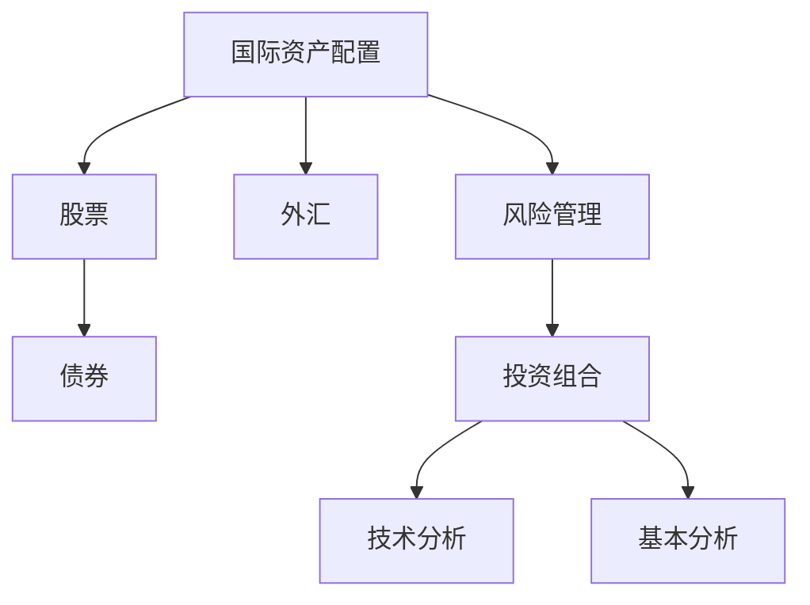

                 

# 程序员如何进行国际资产配置

> 关键词：国际资产配置, 股票, 债券, 外汇, 风险管理, 投资组合, 技术分析, 基本分析

## 1. 背景介绍

### 1.1 问题由来

在当今全球化的经济环境下，程序员已经不仅仅局限于传统软件开发领域，越来越多的程序员开始涉足金融投资领域。然而，由于金融市场的复杂性，许多程序员在投资决策时常常感到无从下手。特别是在国际资产配置方面，由于不同国家金融市场的差异，以及外汇市场的不确定性，如何进行有效的资产配置成为一个难题。

### 1.2 问题核心关键点

国际资产配置的核心在于如何构建一个跨多个国家的投资组合，以实现风险分散和收益最大化。这一过程涉及股票、债券、外汇等多种金融工具，需要考虑汇率、利率、政治风险等多种因素。此外，考虑到程序员的工作特点，还需要注意时间跨度和操作便捷性等因素。

### 1.3 问题研究意义

掌握国际资产配置方法，可以帮助程序员在投资中获得更高的回报，同时分散风险，降低投资损失。此外，随着程序员收入的增加，进行合理的资产配置，对于实现财富保值增值，以及实现财务自由具有重要意义。

## 2. 核心概念与联系

### 2.1 核心概念概述

- **国际资产配置**：通过在全球不同地区的市场进行资产配置，构建投资组合以实现收益和风险的平衡。
- **股票**：指公司发行的有价证券，代表了公司所有权的一部分，是国际资产配置中的主要组成部分。
- **债券**：是一种固定收益工具，代表了借款人向贷款人承诺在未来某个日期支付本金和利息的承诺，适合风险偏好较低的投资者。
- **外汇**：是不同货币之间的兑换，反映了货币之间的价值关系，是国际资产配置中的重要组成部分。
- **风险管理**：通过分散投资、对冲策略等手段，控制投资组合的风险水平。
- **投资组合**：由多种资产组成，通过组合优化，实现收益最大化和风险最小化。
- **技术分析**：利用图表、指标等技术工具，对市场趋势进行预测，辅助投资决策。
- **基本分析**：通过对公司财务报表、行业趋势等基本面分析，评估股票或债券的价值。

这些核心概念之间的逻辑关系可以通过以下Mermaid流程图来展示：



这个流程图展示了一个完整的国际资产配置过程，从股票、债券、外汇等多种资产类型开始，通过风险管理和投资组合优化，结合技术分析和基本面分析，最终完成资产配置。

## 3. 核心算法原理 & 具体操作步骤
### 3.1 算法原理概述

国际资产配置的核心算法包括马科维茨（Markowitz）均值方差（Mean-Variance）模型和现代投资组合理论（Modern Portfolio Theory, MPT）。这些模型通过数学手段，帮助投资者构建最优投资组合，实现风险分散和收益最大化。

- **马科维茨均值方差模型**：通过计算各资产的期望收益和协方差矩阵，构建无风险资产和风险资产的组合，以最大化期望收益和最小化风险。
- **现代投资组合理论**：基于马科维茨模型，进一步考虑了投资者的风险偏好和资产之间的相关性，提出了风险平价（Risk Parity）和极小化最大回撤（Minimization of Maximum Drawdown）等策略。

### 3.2 算法步骤详解

1. **数据收集**：收集全球主要市场（如美国、中国、日本等）的股票、债券、外汇等金融工具的历史价格数据。
2. **市场预测**：通过技术分析和基本分析，对未来市场趋势进行预测。
3. **风险评估**：评估各个资产的风险水平，包括市场风险、信用风险等。
4. **构建投资组合**：利用马科维茨均值方差模型或现代投资组合理论，构建最优投资组合。
5. **动态调整**：定期重新评估市场情况，根据市场变化动态调整投资组合。

### 3.3 算法优缺点

**优点**：
- **系统性**：通过数学模型和统计方法，构建系统的投资策略。
- **量化**：通过量化分析，减少主观偏见，提高决策的客观性。
- **灵活性**：可以灵活调整投资组合，适应市场变化。

**缺点**：
- **复杂性**：模型构建和优化过程复杂，需要较强的数学和统计背景。
- **高门槛**：需要掌握复杂的计算工具和统计分析方法。
- **模型局限**：模型假设和参数选择可能影响结果的准确性。

### 3.4 算法应用领域

国际资产配置算法广泛应用于股票、债券、外汇等多种金融工具的配置中，特别是在跨国公司的资产管理、大型基金的配置策略中。此外，在个人投资者进行全球资产配置时，这些算法也具有广泛的应用前景。

## 4. 数学模型和公式 & 详细讲解

### 4.1 数学模型构建

**马科维茨均值方差模型**：
- **目标函数**：
  $$
  \max_{w} E(w^T r) - \frac{\alpha}{2} w^T \Sigma w
  $$
  其中，$r$ 为资产收益向量，$\Sigma$ 为协方差矩阵，$\alpha$ 为风险偏好系数。
- **约束条件**：
  $$
  w_i \geq 0, \sum_{i=1}^n w_i = 1
  $$

**现代投资组合理论**：
- **风险平价模型**：
  $$
  w_i \propto \sigma_i \quad \text{for} \quad \sigma_i > 0
  $$
  其中，$w_i$ 为资产 $i$ 的权重，$\sigma_i$ 为资产 $i$ 的标准差。

### 4.2 公式推导过程

马科维茨均值方差模型的推导过程主要基于以下几个基本假设：
1. 投资者的目标为最大化期望收益。
2. 所有资产的期望收益和方差可以预测。
3. 投资组合的期望收益等于各个资产期望收益的加权和。
4. 投资组合的方差为各个资产方差的加权和和协方差矩阵的加权和。

根据上述假设，马科维茨模型可以转化为一个二次规划问题，求解过程中通过拉格朗日乘子法和KKT条件，最终得到最优解。

现代投资组合理论的风险平价模型则基于风险对收益的贡献，通过优化风险权重，实现风险与收益的平衡。

### 4.3 案例分析与讲解

假设我们有三个资产：股票A、股票B和债券C。根据历史数据，它们的期望收益和协方差矩阵如下：

| 资产 | 期望收益 | 标准差 | 相关系数 |
| ---- | -------- | ------ | -------- |
| 股票A | 0.1      | 0.15   | 0.5      |
| 股票B | 0.08     | 0.12   | 0.4      |
| 债券C | 0.04     | 0.05   | 0.0      |

风险偏好系数 $\alpha=0.8$。根据马科维茨模型，我们计算得到最优权重 $w$，并计算组合的期望收益和方差。

## 5. 项目实践：代码实例和详细解释说明
### 5.1 开发环境搭建

在进行国际资产配置的实践前，我们需要准备好开发环境。以下是使用Python进行PyTorch开发的环境配置流程：

1. 安装Anaconda：从官网下载并安装Anaconda，用于创建独立的Python环境。

2. 创建并激活虚拟环境：
```bash
conda create -n pytorch-env python=3.8 
conda activate pytorch-env
```

3. 安装PyTorch：根据CUDA版本，从官网获取对应的安装命令。例如：
```bash
conda install pytorch torchvision torchaudio cudatoolkit=11.1 -c pytorch -c conda-forge
```

4. 安装TensorFlow：
```bash
pip install tensorflow
```

5. 安装各类工具包：
```bash
pip install numpy pandas scikit-learn matplotlib tqdm jupyter notebook ipython
```

完成上述步骤后，即可在`pytorch-env`环境中开始实践。

### 5.2 源代码详细实现

以下是一个简单的国际资产配置模型的Python代码实现，利用PyTorch和NumPy进行计算。

```python
import numpy as np
import torch
from scipy.optimize import minimize

# 定义资产期望收益、标准差、协方差矩阵
mean = np.array([0.1, 0.08, 0.04])
std = np.array([0.15, 0.12, 0.05])
cov = np.array([[0.75, 0.4, 0.0],
                [0.4, 0.6, 0.0],
                [0.0, 0.0, 0.0]])

# 定义风险偏好系数
alpha = 0.8

# 构建目标函数
def objective(w):
    mean_w = np.dot(mean, w)
    cov_w = np.dot(np.dot(w, cov), w.T)
    return -mean_w + alpha * cov_w

# 定义约束条件
def constraint(w):
    return np.sum(w) - 1

# 求解目标函数的最小值
w0 = np.ones_like(mean) / np.sum(mean)
res = minimize(objective, w0, constraints={'type': 'eq', 'fun': constraint})
w_opt = res.x

# 计算组合的期望收益和方差
expected_return = np.dot(mean, w_opt)
variance = np.dot(np.dot(w_opt, cov), w_opt.T)
```

### 5.3 代码解读与分析

让我们再详细解读一下关键代码的实现细节：

**目标函数**：
- `objective`函数：计算投资组合的期望收益和风险的组合目标函数，最大化期望收益并最小化方差。
- `w`为资产权重向量，`mean_w`为资产期望收益的加权和，`cov_w`为资产方差的加权和和协方差矩阵的加权和。

**约束条件**：
- `constraint`函数：定义约束条件，确保投资组合的总权重为1。

**求解过程**：
- `minimize`函数：使用scipy库中的最小化函数，求解目标函数的最小值。

**计算组合的期望收益和方差**：
- 根据求解得到的权重向量 `w_opt`，计算组合的期望收益 `expected_return` 和方差 `variance`。

## 6. 实际应用场景

### 6.1 跨国公司资产管理

跨国公司在进行资产配置时，面临不同国家和地区的市场风险。通过国际资产配置算法，可以有效分散风险，提高投资回报。

例如，某跨国公司需要在美国、中国和日本市场进行资产配置。利用国际资产配置算法，可以构建最优投资组合，分散市场风险，实现收益最大化。

### 6.2 大型基金配置策略

大型基金管理公司需要管理大量投资者的资金，通过国际资产配置算法，可以优化基金的投资组合，提高基金的收益率和风险控制能力。

例如，某基金管理公司使用国际资产配置算法，构建了包含股票、债券、外汇等多种资产的投资组合，实现了全球市场的风险分散和收益最大化。

### 6.3 个人投资者全球资产配置

个人投资者也可以利用国际资产配置算法，进行全球资产配置，实现财富保值增值。

例如，某程序员希望在全球范围内进行资产配置，利用国际资产配置算法，构建了包含股票、债券、外汇等多种资产的投资组合，实现了全球市场的风险分散和收益最大化。

## 7. 工具和资源推荐
### 7.1 学习资源推荐

为了帮助程序员系统掌握国际资产配置的理论基础和实践技巧，这里推荐一些优质的学习资源：

1. 《金融工程学》系列书籍：介绍了金融工程学的基础理论、方法和应用，包括金融衍生品、风险管理等内容。
2. 《量化投资》系列课程：涵盖了量化投资的基本概念、策略和技术，适合程序员学习。
3. 《Python金融编程》书籍：介绍了如何使用Python进行金融数据分析和投资策略开发。
4. 《国际投资组合管理》课程：介绍了国际投资组合管理的基本理论和应用，适合程序员学习。
5. 《投资组合理论》书籍：介绍了现代投资组合理论的基本概念和应用，适合程序员学习。

通过对这些资源的学习实践，相信程序员一定能够掌握国际资产配置的理论基础和实践技巧。

### 7.2 开发工具推荐

高效的开发离不开优秀的工具支持。以下是几款用于国际资产配置开发的常用工具：

1. Python：作为数据科学和金融工程的主流编程语言，Python拥有丰富的金融分析库和可视化工具。
2. NumPy：提供了高性能的数值计算功能，支持多维数组和矩阵运算。
3. Pandas：提供了灵活的数据处理和分析功能，支持时间序列数据。
4. SciPy：提供了许多科学计算函数，包括优化、统计、信号处理等。
5. Matplotlib：提供了强大的数据可视化功能，支持各种图表绘制。
6. Jupyter Notebook：提供了交互式编程环境，支持代码和数据的一体化展示。

合理利用这些工具，可以显著提升国际资产配置任务的开发效率，加快创新迭代的步伐。

### 7.3 相关论文推荐

国际资产配置技术的发展源于学界的持续研究。以下是几篇奠基性的相关论文，推荐阅读：

1. Markowitz, H. M. (1952). Portfolio Selection. The Journal of Finance, 7(1), 77-91.
2. Sharpe, W. F. (1964). Capital Asset Prices: A Theory of Market Equilibrium under Conditions of Risk. The Journal of Finance, 19(3), 425-442.
3. Black, F., & Scholes, M. (1973). The Pricing of Options and Corporate Liabilities. The Journal of Political Economy, 81(3), 637-654.
4. Rubinstein, M. L. (1994). The Concept of Risk Parity and the Asset Pricing Equation. Journal of Financial Economics, 37(3), 223-236.
5. Asness, C. S., Grinblatt, M., & Korn, A. M. (2007). Risk-Based Asset Allocation. The Journal of Portfolio Management, 33(4), 48-53.

这些论文代表了大语言模型微调技术的发展脉络。通过学习这些前沿成果，可以帮助程序员掌握国际资产配置的理论基础和实践技巧。

## 8. 总结：未来发展趋势与挑战

### 8.1 总结

本文对国际资产配置进行了全面系统的介绍。首先阐述了国际资产配置的研究背景和意义，明确了如何通过构建最优投资组合，实现风险分散和收益最大化。其次，从原理到实践，详细讲解了国际资产配置的数学模型和操作步骤，给出了具体的代码实现。同时，本文还广泛探讨了国际资产配置在跨国公司、大型基金、个人投资者等场景中的应用前景，展示了国际资产配置的广阔前景。

通过本文的系统梳理，可以看到，国际资产配置算法已经在金融投资领域得到了广泛的应用，帮助程序员在投资中获得更高的回报，同时分散风险，降低投资损失。未来，伴随国际资产配置算法的持续演进，相信程序员在全球资产配置中将发挥更大的作用。

### 8.2 未来发展趋势

展望未来，国际资产配置技术将呈现以下几个发展趋势：

1. **算法智能化**：未来，国际资产配置算法将更加智能化，能够实时分析市场数据，动态调整投资组合。
2. **多资产融合**：国际资产配置将不仅限于股票、债券、外汇等金融资产，还将涉及房地产、大宗商品等多元资产，实现更全面的风险管理。
3. **数据驱动**：随着大数据技术的进步，国际资产配置将更加依赖数据驱动的决策，通过机器学习等手段，提高模型预测的准确性。
4. **跨市场优化**：未来的国际资产配置算法将更加注重跨市场的优化，通过全球化的视角，实现更优的资产配置。
5. **绿色投资**：随着全球对环境问题的关注，国际资产配置将更加注重绿色投资，优先选择环保、低碳的资产。

以上趋势凸显了国际资产配置技术的广阔前景。这些方向的探索发展，必将进一步提升投资管理的智能化水平，为程序员带来更多的投资机遇。

### 8.3 面临的挑战

尽管国际资产配置技术已经取得了瞩目成就，但在迈向更加智能化、普适化应用的过程中，它仍面临着诸多挑战：

1. **数据获取难度**：高质量金融数据的获取难度较大，特别是在某些新兴市场，数据的完整性和可靠性可能不足。
2. **模型复杂性**：现代投资组合理论等模型的计算复杂度较高，需要强大的计算资源支持。
3. **市场波动**：国际市场的不确定性，如地缘政治风险、货币政策变化等，可能影响投资决策的准确性。
4. **算法鲁棒性**：国际资产配置算法需要具备较高的鲁棒性，以应对市场突发事件和异常数据。
5. **合规风险**：各国金融市场法规的不同，可能影响国际资产配置的合规性和有效性。

这些挑战需要程序员在实践中不断积累经验，寻找有效的应对策略，才能实现更加稳健的国际资产配置。

### 8.4 未来突破

面对国际资产配置面临的种种挑战，未来的研究需要在以下几个方面寻求新的突破：

1. **数据获取技术**：开发高效的数据获取和处理技术，提升数据质量和实时性。
2. **算法简化**：研究更加简化、高效的国际资产配置算法，降低计算复杂度。
3. **风险管理**：引入更多的风险管理工具，如对冲策略、期权等，提高模型的鲁棒性。
4. **跨市场优化**：开发跨市场的优化算法，实现更优的资产配置。
5. **绿色投资**：研究绿色投资的优化模型，优先选择环保、低碳的资产。

这些研究方向的探索，必将引领国际资产配置技术迈向更高的台阶，为程序员带来更多的投资机遇。

## 9. 附录：常见问题与解答

**Q1：国际资产配置的优缺点是什么？**

A: 国际资产配置的优点包括：
- **风险分散**：通过分散投资，降低单一市场的风险。
- **收益最大化**：通过优化组合，提高整体收益。

缺点包括：
- **复杂性**：算法复杂，需要较强的数学和统计背景。
- **高门槛**：需要掌握复杂的计算工具和统计分析方法。
- **市场波动**：国际市场的不确定性可能影响投资决策的准确性。

**Q2：如何进行国际资产配置？**

A: 国际资产配置的基本步骤包括：
1. 收集全球主要市场的历史价格数据。
2. 通过技术分析和基本分析，对未来市场趋势进行预测。
3. 评估各个资产的风险水平。
4. 利用马科维茨均值方差模型或现代投资组合理论，构建最优投资组合。
5. 定期重新评估市场情况，根据市场变化动态调整投资组合。

**Q3：如何评估国际资产配置的绩效？**

A: 国际资产配置的绩效可以通过以下指标评估：
- **收益率**：投资组合的平均回报率。
- **风险度量**：标准差、贝塔系数、最大回撤等。
- **夏普比率**：衡量单位风险的超额收益。
- **信息比率**：衡量投资组合的超额收益与跟踪误差的关系。

**Q4：如何进行风险管理？**

A: 风险管理可以通过以下手段实现：
- **分散投资**：通过投资多个资产，降低单一资产的风险。
- **对冲策略**：通过金融衍生品，对冲市场风险。
- **定值保护**：使用期权等工具，设定价格上限和下限。

**Q5：如何应对国际市场波动？**

A: 应对国际市场波动，可以采取以下措施：
- **建立应急预案**：制定详细的风险应对策略。
- **灵活调整投资组合**：根据市场变化动态调整投资组合。
- **多样化投资**：投资于多种资产类别和地区，分散风险。

通过对这些问题的解答，相信程序员能够更好地掌握国际资产配置的理论和实践技巧，实现稳健的投资回报。

---

作者：禅与计算机程序设计艺术 / Zen and the Art of Computer Programming

