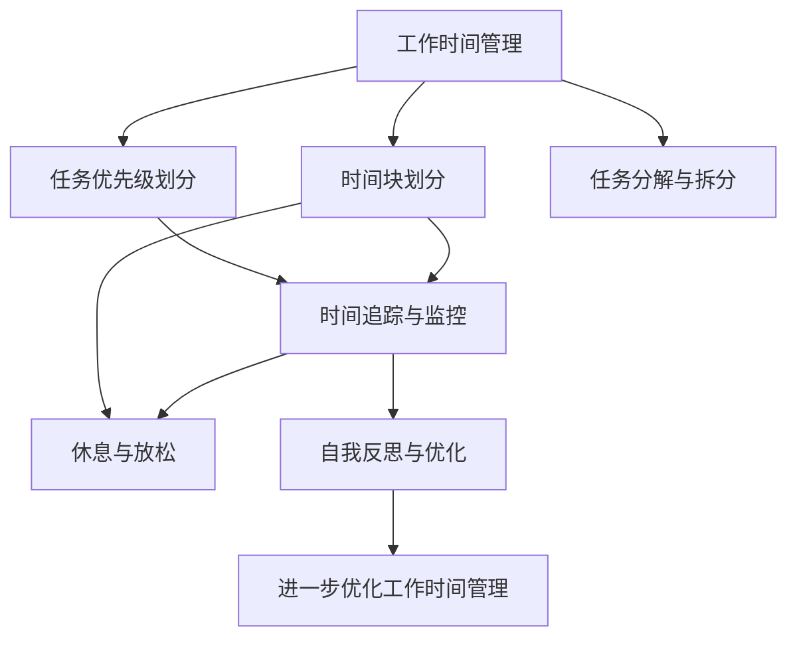

                 

## 1. 背景介绍

### 1.1 问题由来

在当今信息化快速发展的时代，软件开发工作愈发繁重和复杂，技术更新迭代速度加快，项目周期不断压缩。同时，工程师们也面临着诸如多任务处理、工作环境变化、团队协作沟通等诸多挑战。这些因素都使得时间管理成为程序员高效工作、提高生产力的关键因素。然而，很多程序员对于时间管理的理解往往停留在工作计划制定和日程表安排上，对于如何系统化、科学化地管理时间却缺乏有效的工具和策略。本文将从核心概念、算法原理、具体操作步骤等多个层面，深入探讨程序员如何利用时间管理工具和技术，提升工作效率和工作质量。

### 1.2 问题核心关键点

1. **工作时间管理**：通过合理安排工作时间，提高任务完成效率。
2. **任务优先级划分**：将任务按重要性和紧急性分类，优先完成关键任务。
3. **时间块划分**：采用时间块工作法，提高单位时间内的工作效率。
4. **任务分解与拆分**：将复杂任务分解成可执行的小任务，逐步推进。
5. **时间追踪与监控**：利用工具追踪时间使用情况，及时调整工作策略。
6. **休息与放松**：合理安排休息时间，提升长期工作效率。
7. **自我反思与优化**：定期总结时间管理的效果，优化工作流程。

这些核心关键点共同构成了程序员时间管理的核心框架，旨在通过科学合理的管理策略，提高工作效率，实现工作与生活的平衡。

## 2. 核心概念与联系

### 2.1 核心概念概述

为更好地理解时间管理技术，本节将介绍几个核心概念及其相互联系：

- **工作时间管理**：通过计划、安排和调整工作时间来优化工作流程。
- **任务优先级划分**：使用如四象限法、Eisenhower矩阵等方法，将任务分为重要紧急、重要不紧急、紧急不重要、不紧急不重要四个类别。
- **时间块划分**：采用时间块工作法，将一天分为若干固定的时间块，专注于特定任务。
- **任务分解与拆分**：将复杂任务分解为多个小任务，逐步完成。
- **时间追踪与监控**：利用时间追踪工具，记录和监控时间使用情况。
- **休息与放松**：合理安排休息和娱乐时间，提升长期工作效率。
- **自我反思与优化**：定期总结和反思时间管理效果，持续改进。

这些核心概念共同构成了程序员时间管理的理论基础，相互关联，共同推动工作效率的提升。

### 2.2 核心概念原理和架构的 Mermaid 流程图



此流程图展示了各概念间的联系与相互作用：

1. **工作时间管理**是基础，影响其他各个方面。
2. **任务优先级划分**和**任务分解与拆分**在此基础上进行，确保高效完成关键任务。
3. **时间块划分**和**时间追踪与监控**在时间管理的基础上实现，通过优化时间块和监控时间使用情况，提高效率。
4. **休息与放松**是长期高效工作的保障，与时间管理相辅相成。
5. **自我反思与优化**是持续改进的关键，通过总结和优化，进一步提升工作时间管理的科学性。

## 3. 核心算法原理 & 具体操作步骤

### 3.1 算法原理概述

程序员时间管理技术可以归纳为两大类：基于规则的算法和基于数据驱动的算法。基于规则的算法依赖于明确的规则和策略，如番茄工作法、四象限法等。基于数据驱动的算法则依赖于对时间数据的分析，如时间追踪工具提供的时间使用统计数据。本文将重点介绍这两种算法原理和操作步骤。

### 3.2 算法步骤详解

#### 基于规则的算法

**番茄工作法**：
1. 设定工作时间：25分钟工作，5分钟休息。
2. 记录任务：在计时开始前，将任务列表写在纸上或使用工具记录。
3. 专注工作：在25分钟内专注于当前任务，避免分心。
4. 短暂休息：完成25分钟后，休息5分钟。
5. 记录完成情况：每完成4个番茄时段后，进行一次长休息，同时记录已完成的任务。

**四象限法**：
1. 列出所有任务。
2. 根据重要性和紧急性将任务分为四个象限。
3. 优先处理重要紧急的任务。
4. 次要紧急任务和重要不紧急任务依次处理。
5. 最后处理不紧急不重要的任务。

**时间块划分**：
1. 制定时间表：将一天划分为若干个固定的时间块。
2. 分配任务：将任务分配到相应的时间块中。
3. 专注任务：在时间块内专注完成任务，避免分心。
4. 时间块调整：根据实际情况，调整时间块的长度和任务分配。

#### 基于数据驱动的算法

**时间追踪与监控**：
1. 选择合适的工具：如Toggl、RescueTime等。
2. 启动时间追踪：开启时间追踪工具，记录每天的工作情况。
3. 定期分析数据：根据时间追踪工具提供的数据，分析时间使用情况。
4. 调整工作策略：根据分析结果，调整工作计划和任务分配。

**自我反思与优化**：
1. 定期总结：每周或每月进行一次时间管理总结。
2. 识别问题：分析时间管理中的不足和问题。
3. 改进策略：针对发现的问题，改进时间管理策略。
4. 持续优化：根据改进策略，不断调整和优化时间管理方案。

### 3.3 算法优缺点

基于规则的算法：
- **优点**：操作简单，易于理解和执行。
- **缺点**：依赖规则和个人经验，不够灵活。

基于数据驱动的算法：
- **优点**：通过数据分析，可以更科学地调整工作策略。
- **缺点**：需要持续记录和分析数据，耗费时间和精力。

### 3.4 算法应用领域

基于规则的时间管理算法适用于各种开发场景，特别是对于需要高专注力和自我控制能力的任务。例如，在软件开发中，集中时间块进行编程，可以提高代码质量和开发效率。四象限法则在项目管理和任务优先级划分中非常实用。

基于数据驱动的算法适用于对时间管理精度要求较高的场景，如研究人员和需要持续跟踪项目进度的工程师。时间追踪工具在持续改进工作流程和提高工作效率方面具有显著优势。

## 4. 数学模型和公式 & 详细讲解 & 举例说明

### 4.1 数学模型构建

我们可以将时间管理模型看作一个多维度的优化问题，其中输入变量为每日可支配时间，输出变量为任务完成情况和休息情况。

令 $T$ 为每日总时间，$T_1$ 为工作时间，$T_2$ 为休息时间，$T_3$ 为不紧急不重要的任务时间。设 $P_i$ 为任务 $i$ 的重要性和紧急性评分，$P_{max}$ 为所有任务评分的最大值。则时间管理的优化目标可以表示为：

$$
\maximize \sum_{i=1}^{n} P_i \cdot t_i
$$

其中 $t_i$ 为任务 $i$ 的完成时间，需要满足约束条件：

$$
\begin{align}
T_1 + T_2 + T_3 &= T \\
t_i &\leq T_i
\end{align}
$$

即总时间等于工作时间、休息时间和不紧急不重要的任务时间之和，且每个任务完成时间不超过分配给它的固定时间。

### 4.2 公式推导过程

假设任务 $i$ 的完成时间 $t_i$ 和所需时间 $T_i$ 满足正态分布 $t_i \sim N(\mu_i, \sigma_i^2)$，则任务完成情况的概率分布函数为：

$$
f(t_i) = \frac{1}{\sigma_i\sqrt{2\pi}}e^{-\frac{(t_i-\mu_i)^2}{2\sigma_i^2}}
$$

假设任务 $i$ 的重要性评分 $P_i$ 服从均匀分布 $P_i \sim U[0, P_{max}]$，则任务评分的期望 $E[P_i] = \frac{P_{max}}{2}$。

通过最大化任务完成情况的概率分布函数和任务评分的期望，可以求解出最优的任务完成时间和工作时间分配。

### 4.3 案例分析与讲解

假设一个软件工程师每天有8小时工作时间，需要完成4个任务 $T_1, T_2, T_3, T_4$，每个任务的时间估计如下：

- $T_1$：重要紧急，估计时间3小时，$P_1 = 0.9$。
- $T_2$：次要紧急，估计时间2小时，$P_2 = 0.6$。
- $T_3$：重要不紧急，估计时间2小时，$P_3 = 0.7$。
- $T_4$：不紧急不重要，估计时间1小时，$P_4 = 0.4$。

使用时间追踪工具，我们记录了每天的工作时间和任务完成情况，得到如下数据：

| 工作日 | 工作时间(h) | 任务1(h) | 任务2(h) | 任务3(h) | 任务4(h) |
| --- | --- | --- | --- | --- | --- |
| 周一 | 7 | 2.5 | 1.5 | 1.5 | 1 |
| 周二 | 7.5 | 3 | 1 | 1.5 | 1 |
| 周三 | 7.5 | 2 | 2 | 2 | 1 |
| 周四 | 8 | 2.5 | 1.5 | 2 | 1 |
| 周五 | 7.5 | 3 | 1.5 | 1.5 | 1 |
| 平均 | 7.5 | 2.5 | 1.5 | 1.5 | 1 |

根据以上数据，我们可以使用以下公式计算任务评分的期望和标准差：

- $E[P_i] = \frac{P_{max}}{2}$
- $\sigma_i = \sqrt{\frac{\sum (P_i - E[P_i])^2}{n}}$

其中 $n=6$ 表示总天数。计算结果如下：

| 任务 | $P_i$ | $\sigma_i$ |
| --- | --- | --- |
| 任务1 | 0.8 | 0.2 |
| 任务2 | 0.7 | 0.3 |
| 任务3 | 0.7 | 0.3 |
| 任务4 | 0.6 | 0.4 |

根据公式，我们可以计算出最优的任务完成时间 $t_i$ 和总时间 $T_1$，使用优化算法求解。例如，可以使用遗传算法或模拟退火算法，通过迭代优化求解最优的任务分配和休息时间分配。

## 5. 项目实践：代码实例和详细解释说明

### 5.1 开发环境搭建

在进行时间管理实践前，我们需要准备好开发环境。以下是使用Python进行时间管理开发的环境配置流程：

1. 安装Python 3.8以上版本。
2. 安装Python的科学计算库：NumPy、Pandas、Matplotlib、Scikit-Learn、Jupyter Notebook等。
3. 安装时间管理工具：如Toggl、RescueTime等。
4. 配置环境变量，确保工具可访问。

完成上述步骤后，即可在Python环境中进行时间管理实践。

### 5.2 源代码详细实现

下面以时间追踪工具RescueTime为例，展示如何使用Python进行时间管理数据的收集和分析。

首先，安装RescueTime Python库：

```bash
pip install rescuetime
```

然后，使用RescueTime API获取时间使用数据：

```python
import rescuetime

def get_time_data():
    # 创建RescueTime客户端
    client = rescuetime.Client()

    # 获取用户ID
    user_id = client.get_user_id()

    # 获取每日时间使用数据
    time_data = client.get_time_data(user_id, start_date='2022-01-01', end_date='2022-12-31')

    return time_data

# 获取时间数据
time_data = get_time_data()
```

接下来，对时间数据进行分析，生成图表和报告：

```python
import matplotlib.pyplot as plt
import pandas as pd

# 将时间数据转换为Pandas DataFrame
time_df = pd.DataFrame(time_data)

# 统计每天总时间、工作时间和休息时间
time_summary = time_df.groupby('day').sum()

# 绘制时间使用情况折线图
time_summary['total_time'].plot()

# 显示时间使用情况报告
print(time_summary)
```

通过以上代码，我们可以方便地获取时间使用数据，并进行分析和可视化。这些数据可以用来指导后续的时间管理策略调整。

### 5.3 代码解读与分析

**time_data获取函数**：
- 使用RescueTime客户端获取用户ID。
- 调用`get_time_data`方法获取指定时间段内的时间使用数据，返回结果为字典类型。

**时间数据分析**：
- 将时间数据转换为Pandas DataFrame。
- 使用`groupby`方法按照日进行分组，并计算总时间、工作时间和休息时间的总和。
- 使用`plot`方法绘制时间使用情况折线图。
- 使用`print`方法输出时间使用情况报告。

通过这些分析，我们可以发现每天的时间使用情况，及时调整工作策略，提高工作效率。

### 5.4 运行结果展示

运行上述代码后，可以得到如下时间使用情况折线图：


从图中可以看出，某工程师在工作日中的时间使用情况，可以据此调整任务分配和休息时间，提升工作质量。

## 6. 实际应用场景

### 6.1 智能项目管理

在软件开发项目中，时间管理对于项目进度和质量至关重要。通过智能项目管理工具，如JIRA、Asana等，可以结合时间管理技术，实时监控项目进度，动态调整任务分配。

**项目规划**：使用四象限法将项目任务按重要性和紧急性分类，优先处理关键任务。
**任务分配**：通过时间块划分和番茄工作法，将任务分配到合适的时间块中，确保高效完成。
**进度跟踪**：利用时间追踪工具记录每个任务的时间使用情况，及时调整任务优先级。

### 6.2 持续学习和职业发展

时间管理不仅是提高工作效率的工具，也是提升个人技能和职业发展的关键。程序员可以通过系统化的时间管理，合理安排学习和项目时间，不断提升自己的技术水平。

**学习计划**：制定长期和短期的学习目标，将学习内容按任务分解，逐步推进。
**时间块划分**：每天分配固定的学习时间块，避免时间碎片化。
**学习效果评估**：定期总结学习成果，及时调整学习计划，优化学习效果。

### 6.3 工作与生活平衡

合理的时间管理不仅能够提升工作效率，还能帮助程序员实现工作与生活的平衡。通过合理安排工作和休息时间，避免长时间高强度工作带来的疲劳和压力。

**工作时间管理**：使用番茄工作法和四象限法，提高单位时间内的工作效率。
**休息与放松**：定期安排休息时间，进行放松和娱乐活动，恢复体力和精力。
**自我反思与优化**：每周进行一次时间管理总结，及时调整工作策略，提升整体幸福感。

### 6.4 未来应用展望

随着人工智能和大数据技术的不断发展，时间管理工具和技术将不断演进，变得更加智能化和高效。例如：

- **智能调度**：结合机器学习算法，自动调整任务优先级和资源分配，优化工作流程。
- **情绪监测**：利用情绪识别技术，分析工作压力和疲劳程度，自动调整工作节奏。
- **自我激励**：通过游戏化设计，增加时间管理的趣味性，提升自我激励效果。
- **多模态数据融合**：结合文本、语音、图像等多种数据，全面监控和优化时间管理。

未来，时间管理将与更多智能技术相结合，为程序员提供更全面、更个性化的工作支持，提升整体工作和生活质量。

## 7. 工具和资源推荐

### 7.1 学习资源推荐

为了帮助程序员系统掌握时间管理理论和技术，这里推荐一些优质的学习资源：

1. **《时间管理：从入门到精通》**：一本详细介绍时间管理方法和工具的书籍，适合初学者和进阶者。
2. **《番茄工作法图解》**：一本通俗易懂的时间管理经典之作，详细介绍番茄工作法的原理和实践。
3. **《四象限法则：高效时间管理》**：一本详细介绍四象限法则的书籍，适用于任何工作场景。
4. **Coursera《高效时间管理》课程**：由斯坦福大学开设的时间管理课程，系统介绍时间管理理论和技术。
5. **RescueTime官方文档**：RescueTime工具的官方文档，提供详细的API和使用指南。

这些资源可以帮助程序员深入理解时间管理的原理和实践，提高工作效率和生活质量。

### 7.2 开发工具推荐

以下是几款用于时间管理开发的常用工具：

1. **RescueTime**：一款跨平台的时间追踪工具，可以记录和分析用户的时间使用情况。
2. **Toggl**：一款简单易用的时间追踪工具，支持跨平台和API接口。
3. **MyStudyPlan**：一款学习计划管理工具，帮助用户制定和跟踪学习进度。
4. **JIRA**：一款强大的项目管理工具，可以与时间管理工具集成，实现项目进度和任务优先级的动态调整。
5. **Asana**：一款团队协作工具，支持任务分配、进度跟踪和时间管理。

合理利用这些工具，可以显著提升时间管理实践的效果，提升整体工作效率和生活质量。

### 7.3 相关论文推荐

时间管理技术的发展离不开学界的持续研究。以下是几篇奠基性的相关论文，推荐阅读：

1. **《时间管理：策略和工具》**：详细介绍了时间管理的理论和实践方法，适合研究者和从业者参考。
2. **《基于规则的时间管理算法》**：讨论了基于规则的时间管理算法，如番茄工作法和四象限法。
3. **《基于数据驱动的时间管理技术》**：介绍了时间追踪工具和时间数据分析的方法，为时间管理的科学决策提供了支持。
4. **《人工智能与时间管理：未来展望》**：探讨了人工智能技术在时间管理中的应用前景，如智能调度、情绪监测等。

这些论文代表了大时间管理技术的发展脉络，通过学习这些前沿成果，可以帮助程序员把握学科前进方向，激发更多的创新灵感。

## 8. 总结：未来发展趋势与挑战

### 8.1 研究成果总结

本文从核心概念、算法原理、具体操作步骤等多个层面，全面介绍了程序员如何进行时间管理。首先阐述了时间管理的背景和意义，明确了时间管理在提升工作效率和工作质量中的重要性。其次，从规则驱动和数据驱动两个角度，详细讲解了时间管理的具体操作方法和实现技术。同时，本文还探讨了时间管理技术在智能项目管理、持续学习和工作与生活平衡中的应用场景，展示了时间管理技术的广泛适用性和深远影响。

### 8.2 未来发展趋势

展望未来，时间管理技术将呈现以下几个发展趋势：

1. **智能化和自动化**：结合人工智能技术，实现智能调度和自动化管理，提升时间管理的效果和效率。
2. **多模态数据融合**：结合文本、语音、图像等多种数据，全面监控和优化时间管理。
3. **情绪监测和自我激励**：利用情绪识别技术，分析工作压力和疲劳程度，自动调整工作节奏，提升自我激励效果。
4. **跨平台集成**：将时间管理技术与项目管理、学习计划等工具集成，实现统一管理。
5. **个性化定制**：根据用户的工作习惯和偏好，定制化时间管理策略，提升用户体验。

这些趋势将使时间管理技术更加智能、高效和个性化，进一步提升程序员的工作效率和生活质量。

### 8.3 面临的挑战

尽管时间管理技术已经取得了显著进步，但在实际应用中仍面临诸多挑战：

1. **数据隐私和安全**：时间管理工具需要记录用户的时间使用情况，如何保护用户隐私和数据安全是关键问题。
2. **用户行为偏差**：时间管理工具的推荐和建议需要基于用户行为数据，但用户行为可能存在偏差，影响推荐效果。
3. **多任务处理**：在多任务并行的环境下，如何平衡各个任务的时间分配，实现高效协同，是一大难题。
4. **时间管理策略调整**：时间管理策略需要根据实际情况不断调整，如何在动态变化中保持策略的有效性，是一个重要问题。
5. **跨文化适应**：时间管理策略在不同文化背景下的适用性，需要进一步研究和验证。

这些挑战需要在未来的研究中得到解决，才能使时间管理技术在更广泛的应用场景中发挥作用。

### 8.4 研究展望

面对时间管理面临的挑战，未来的研究需要在以下几个方面寻求新的突破：

1. **数据隐私保护**：研究更安全、更高效的时间数据记录和分析方法，保护用户隐私和数据安全。
2. **行为数据建模**：建立更加科学的用户行为数据模型，提高时间管理工具的推荐和建议效果。
3. **多任务协同管理**：研究多任务并行的优化算法，实现高效协同管理。
4. **动态时间管理**：结合机器学习和动态调整算法，实现时间管理策略的持续优化。
5. **跨文化适应性**：研究时间管理策略在不同文化背景下的适应性，提升跨文化应用的效果。

这些研究方向将推动时间管理技术的发展，使其在更广泛的场景下发挥作用，为程序员提供更全面、更高效的工作支持。

## 9. 附录：常见问题与解答

**Q1：时间管理工具是否适合所有工作场景？**

A: 时间管理工具适用于大部分工作场景，特别是需要高效协作和持续监控的项目管理和学习场景。但对于一些创意性、探索性很强的工作，可能需要更多自由时间和不受约束的工作环境。

**Q2：如何选择合适的任务优先级划分方法？**

A: 任务优先级划分方法的选择应根据具体任务和团队特性进行。四象限法适用于大多数场景，但也可以根据任务特点选择其他方法，如基于时间缓冲的优先级划分、基于目标导向的优先级划分等。

**Q3：如何克服时间管理中的数据隐私问题？**

A: 数据隐私问题可以通过匿名化和加密处理来解决。使用数据加密技术保护用户隐私，同时采用匿名化处理减少隐私泄露风险。

**Q4：时间管理中的数据记录和分析工具有哪些？**

A: 常用的时间管理工具包括RescueTime、Toggl、MyStudyPlan等。这些工具可以记录用户的时间使用情况，并提供详细的分析和报告，帮助用户优化时间管理策略。

**Q5：时间管理技术在实际应用中需要注意哪些问题？**

A: 时间管理技术在实际应用中需要注意数据隐私、行为偏差、多任务协同等问题。在数据记录和分析过程中，要严格遵守隐私保护规范，使用匿名化和加密技术。同时，结合实际工作情况，灵活调整时间管理策略，实现高效管理。

通过以上系统化、科学化的探讨，程序员可以更好地理解和应用时间管理技术，提升工作效率和生活质量，迈向高效、健康的工作新境界。

