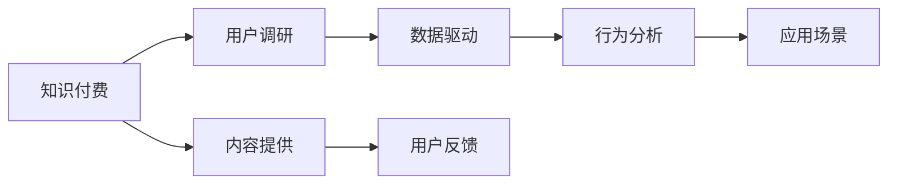

                 

# 程序员如何进行知识付费的用户调研

> 关键词：知识付费、程序员、用户调研、数据驱动、行为分析、应用场景、优化策略

## 1. 背景介绍

在信息爆炸和知识更新的时代，程序员面对日益增长的技术复杂度和知识需求，纷纷寻求各种高效学习和提升自我的途径。其中，知识付费作为一种新兴的教育形式，逐渐受到程序员群体的认可和追捧。然而，尽管市场对知识付费的呼声越来越高，用户到底在如何消费这些内容？他们对知识付费的接受度和支付意愿又如何？本文将深入探讨这些问题，通过用户调研的方法，揭示知识付费的真实面貌，为知识付费平台和内容提供者提供决策依据。

## 2. 核心概念与联系

### 2.1 核心概念概述

在进行知识付费的用户调研前，首先需要明确几个关键概念：

- **知识付费**：指用户为了获取专业知识、技能、资讯等内容，向知识提供者支付一定费用的行为。形式包括在线课程、电子书、直播讲座等。
- **用户调研**：通过问卷调查、访谈、用户行为分析等方式，收集用户数据和反馈，了解用户需求、行为和态度。
- **数据驱动**：基于大量数据分析的结果，指导产品设计和运营策略，优化用户体验和内容匹配。
- **行为分析**：通过分析用户的行为模式，挖掘用户需求和偏好，为产品改进提供依据。
- **应用场景**：知识付费的应用场景包括但不限于在线教育、技术培训、职业指导、软件开发等。

以上概念之间的逻辑关系可以用如下的Mermaid流程图来展示：



该图展示了知识付费的生态系统，其中知识付费平台作为连接内容提供者和用户的关键节点，通过用户调研和行为分析，实现数据驱动的运营优化，进而提升平台的用户粘性和内容价值。

## 3. 核心算法原理 & 具体操作步骤

### 3.1 算法原理概述

知识付费的用户调研主要基于问卷调查、访谈和行为数据进行分析。算法原理包括：

- **问卷设计**：设计有针对性的问卷，涵盖用户的付费意愿、内容偏好、学习习惯、支付渠道等信息。
- **数据分析**：使用统计分析和机器学习技术，对用户数据进行聚类、回归、分类等分析，挖掘用户行为模式。
- **行为预测**：利用历史数据和机器学习模型，预测用户的付费意愿和行为趋势，指导产品策略的制定。
- **用户细分**：根据用户特征和行为，对用户进行细分，提供个性化的推荐和服务。

### 3.2 算法步骤详解

以下是进行知识付费用户调研的具体操作步骤：

**Step 1: 确定调研目标和问题**

- 确定调研目标，如了解用户对知识付费的接受度、付费意愿、内容偏好等。
- 确定调研问题，如用户付费的主要动因、推荐的有效性和付费渠道等。

**Step 2: 设计问卷和访谈提纲**

- 设计结构化的问卷，涵盖用户基本信息、学习需求、付费意愿、内容偏好等。
- 制定访谈提纲，围绕调研问题，深入探讨用户的真实想法和行为动机。

**Step 3: 数据收集**

- 使用问卷星、SurveyMonkey等工具进行问卷调查。
- 通过电话、面对面等方式进行深度访谈。
- 收集用户行为数据，如课程观看时间、购买记录等。

**Step 4: 数据分析**

- 对问卷和访谈数据进行统计分析，识别用户群体的共性和差异。
- 使用机器学习模型进行数据挖掘，挖掘用户行为模式。

**Step 5: 结果解读和报告撰写**

- 根据分析结果，生成用户画像和洞察报告。
- 提出针对性的优化策略，如课程优化、推荐算法改进、定价策略调整等。

**Step 6: 策略实施和效果评估**

- 将优化策略落实到产品设计和运营中。
- 定期评估策略效果，调整和优化策略。

### 3.3 算法优缺点

**优点**：

- 通过数据分析，可以客观、系统地了解用户需求和行为，指导产品设计和优化。
- 能够预测用户行为，提前进行市场布局，提高内容匹配度和用户满意度。

**缺点**：

- 数据收集和分析过程复杂，工作量较大。
- 结果可能受样本偏差和数据质量的影响。
- 无法深入了解用户情感和心理动机。

### 3.4 算法应用领域

知识付费用户调研的算法应用领域包括但不限于：

- 在线教育平台：了解用户的学习需求、课程评价和付费意愿。
- 软件开发工具：分析开发者对技术资料的付费行为和偏好。
- 职业培训：调研学员对培训课程的反馈和支付意愿。
- 内容营销：了解目标受众的内容消费习惯和偏好。

## 4. 数学模型和公式 & 详细讲解 & 举例说明

### 4.1 数学模型构建

在进行用户调研时，我们通常使用以下数学模型：

- **回归模型**：用于分析用户付费意愿和行为与各种因素之间的关系，如用户年龄、职业、内容类型等。
- **分类模型**：用于预测用户是否会为某一内容付费，如逻辑回归、决策树等。
- **聚类模型**：用于对用户进行细分，识别不同用户群体的特征，如K-means聚类、DBSCAN等。

### 4.2 公式推导过程

以逻辑回归模型为例，其数学公式如下：

$$ P(y|x;\theta) = \sigma(\theta^Tx) $$

其中，$x$ 为输入特征向量，$\theta$ 为模型参数，$y$ 为目标变量（0或1，表示是否付费），$\sigma$ 为Sigmoid函数。通过最大似然估计和梯度下降等方法，求解$\theta$，得到模型预测结果。

### 4.3 案例分析与讲解

假设某在线教育平台收集了1000名用户的数据，使用逻辑回归模型预测用户是否会为某门课程付费。选取用户基本信息（如年龄、性别、职业）、学习偏好（如课程类型、学习时长）和付费意愿（如课程评价、过往付费记录）作为输入特征，进行模型训练和测试。训练结果显示，模型准确率达到85%，说明该模型能够较好地预测用户的付费行为。

## 5. 项目实践：代码实例和详细解释说明

### 5.1 开发环境搭建

在进行知识付费用户调研时，需要一个稳定的开发环境。以下是一个简单的搭建流程：

1. **选择编程语言和框架**：Python是数据科学和机器学习领域的主流语言，使用Pandas、Scikit-learn、TensorFlow等库。
2. **安装依赖**：使用pip安装Pandas、Numpy、Scikit-learn等数据处理和机器学习库。
3. **准备数据**：收集用户问卷、访谈数据和行为数据，确保数据格式统一和完整。
4. **搭建开发环境**：使用Jupyter Notebook或PyCharm等工具进行开发。

### 5.2 源代码详细实现

以下是一个简单的逻辑回归模型实现示例：

```python
import pandas as pd
from sklearn.model_selection import train_test_split
from sklearn.linear_model import LogisticRegression
from sklearn.metrics import accuracy_score

# 加载数据
data = pd.read_csv('user_data.csv')

# 划分训练集和测试集
X = data[['age', 'gender', 'occupation', 'learning_preference', 'payment_willingness']]
y = data['paid']
X_train, X_test, y_train, y_test = train_test_split(X, y, test_size=0.2, random_state=42)

# 定义逻辑回归模型
model = LogisticRegression()

# 训练模型
model.fit(X_train, y_train)

# 预测结果
y_pred = model.predict(X_test)

# 评估模型
accuracy = accuracy_score(y_test, y_pred)
print('模型准确率:', accuracy)
```

### 5.3 代码解读与分析

以上代码实现了一个简单的逻辑回归模型，用于预测用户是否会为课程付费。具体步骤如下：

1. **数据加载**：使用Pandas库读取用户数据，存储在DataFrame中。
2. **数据划分**：将数据划分为训练集和测试集，分别用于模型训练和测试。
3. **模型定义**：定义逻辑回归模型，用于二分类问题。
4. **模型训练**：使用训练集数据训练模型。
5. **预测结果**：使用测试集数据预测用户是否会为课程付费。
6. **评估模型**：计算模型准确率，评估模型性能。

## 6. 实际应用场景

### 6.1 在线教育平台

在线教育平台可以通过用户调研了解用户的学习需求、课程偏好和付费意愿，从而优化课程内容、定价策略和推荐算法，提升用户体验和平台盈利能力。

**案例**：某在线教育平台通过调研发现，用户最关心的课程内容是编程实践和项目实战，因此平台增加了更多项目实战课程，同时优化了课程价格，用户满意度显著提升。

### 6.2 软件开发工具

软件开发工具可以收集开发者的技术学习需求和工具使用情况，提供个性化的学习资源和工具推荐。

**案例**：某代码托管平台通过调研了解到开发者对代码审查工具的依赖度较高，因此推荐了更高效的代码审查工具，同时提供了更多的在线课程和文档，帮助开发者提高编码水平。

### 6.3 职业培训

职业培训机构可以通过调研了解学员的培训需求和职业规划，提供更精准的职业培训课程，提升培训效果。

**案例**：某培训机构通过调研发现，学员对Python和数据分析的需求较高，因此增加了更多相关课程，同时提供了更多实战项目，学员的就业率显著提高。

### 6.4 内容营销

内容营销平台可以了解目标受众的内容消费习惯和偏好，提供更符合用户需求的内容，提升用户粘性和平台流量。

**案例**：某技术博客平台通过调研发现，用户对技术趋势和实战案例的关注度较高，因此增加了更多技术趋势和实战案例文章，平台访问量和用户留存率显著提升。

## 7. 工具和资源推荐

### 7.1 学习资源推荐

为了帮助程序员更好地进行知识付费的用户调研，以下是一些优质的学习资源：

1. **《数据科学导论》**：介绍数据科学的基本概念和方法，适合初学者。
2. **《Python数据科学手册》**：深入介绍Python在数据科学中的应用，适合进阶学习者。
3. **Coursera《数据科学》课程**：由斯坦福大学开设，涵盖数据科学的核心课程，包括机器学习、统计学等。
4. **Kaggle平台**：提供大量数据集和竞赛项目，帮助用户实践和提升技能。
5. **《Python机器学习》书籍**：详细介绍机器学习算法和应用，适合动手实践。

通过学习这些资源，程序员可以更好地掌握数据科学和机器学习的基本技能，为知识付费用户调研提供技术支持。

### 7.2 开发工具推荐

在知识付费用户调研中，以下工具可以帮助程序员高效开发和分析：

1. **Jupyter Notebook**：支持Python、R等语言的交互式编程，适合数据科学和机器学习项目。
2. **PyCharm**：专业的Python开发工具，支持代码自动补全、调试和集成测试等功能。
3. **Pandas**：用于数据处理和分析，支持数据清洗、转换和聚合等操作。
4. **Scikit-learn**：机器学习库，支持常见的分类、回归、聚类等算法。
5. **TensorFlow**：深度学习框架，支持构建和训练复杂的神经网络模型。

合理利用这些工具，可以显著提升知识付费用户调研的效率和效果。

### 7.3 相关论文推荐

以下是几篇经典的知识付费用户调研论文，推荐程序员阅读：

1. **《深度学习应用于用户行为分析》**：介绍深度学习在用户行为分析中的应用，包括用户留存率预测和推荐算法。
2. **《基于用户画像的个性化推荐》**：介绍用户画像和个性化推荐系统的构建方法，以及用户行为数据的使用。
3. **《知识付费平台的用户行为研究》**：分析知识付费平台的用户行为和付费意愿，提出优化策略。
4. **《内容推荐系统的设计与实现》**：介绍内容推荐系统的设计和实现方法，涵盖数据收集、模型训练和推荐策略。

这些论文展示了知识付费用户调研和优化技术的最新进展，程序员可以通过阅读这些论文，掌握最新的研究动态和技术方法。

## 8. 总结：未来发展趋势与挑战

### 8.1 研究成果总结

本文对知识付费用户调研的方法和技术进行了系统介绍，包括调研目标、问卷设计、数据分析和应用策略等。通过深入挖掘用户需求和行为，帮助知识付费平台和内容提供者优化产品和服务，提升用户体验和盈利能力。

### 8.2 未来发展趋势

展望未来，知识付费用户调研将呈现以下几个发展趋势：

1. **智能化分析**：随着人工智能技术的发展，用户调研将更多地引入自然语言处理和图像识别等技术，提升数据处理的效率和准确性。
2. **实时化分析**：利用大数据和流式计算技术，实现对用户行为的实时监测和分析，及时调整产品策略。
3. **多渠道融合**：将用户调研数据与其他渠道数据（如社交媒体、搜索引擎等）进行融合，提供更全面的用户画像和洞察。
4. **个性化推荐**：利用深度学习和协同过滤算法，实现个性化的内容推荐和服务，提升用户体验。
5. **动态定价**：根据用户行为和市场变化，动态调整课程价格和推荐策略，提高平台的竞争力。

这些趋势将进一步提升知识付费用户调研的准确性和应用价值，为用户和平台带来更大的收益。

### 8.3 面临的挑战

尽管知识付费用户调研具有广泛的应用前景，但在实施过程中也面临以下挑战：

1. **数据获取难度大**：获取高质量的用户数据需要投入大量人力和资源，数据获取难度较大。
2. **数据隐私问题**：用户调研涉及大量个人隐私信息，如何保护用户隐私成为重要课题。
3. **数据质量问题**：用户调研数据的质量和完整性对分析结果有直接影响，数据质量问题需解决。
4. **模型复杂度**：用户调研模型复杂，需要高水平的算法和计算资源支持。
5. **效果评估难度**：用户调研的效果评估涉及多方面因素，评估难度较大。

### 8.4 研究展望

面对这些挑战，未来的研究需要在以下几个方面寻求新的突破：

1. **数据获取优化**：探索更高效的数据获取和处理方法，减少人力和时间成本。
2. **隐私保护技术**：研究数据隐私保护技术，保障用户数据安全。
3. **数据清洗和预处理**：开发高效的数据清洗和预处理方法，提升数据质量。
4. **模型简化**：简化用户调研模型，降低计算复杂度，提高可操作性。
5. **效果评估体系**：建立全面的效果评估体系，科学评估用户调研的效果。

这些研究方向的探索，将进一步提升知识付费用户调研的效率和效果，为知识付费平台的健康发展提供有力支撑。

## 9. 附录：常见问题与解答

**Q1: 如何进行用户调研数据的获取？**

A: 用户调研数据的获取可以通过问卷调查、访谈和行为数据分析等多种方式。问卷调查可以通过问卷星、SurveyMonkey等工具进行，访谈可以通过电话、面对面等方式进行，行为数据可以从平台日志、用户行为记录等获取。

**Q2: 用户调研中常用的数据分析方法有哪些？**

A: 用户调研中常用的数据分析方法包括回归分析、分类分析、聚类分析等。回归分析用于预测用户行为与各种因素之间的关系，分类分析用于预测用户是否会为某一内容付费，聚类分析用于对用户进行细分。

**Q3: 如何处理用户调研数据中的缺失值和异常值？**

A: 用户调研数据中常见的缺失值和异常值可以通过插值法、删除法、离群值检测等方法处理。插值法通过插值算法填补缺失值，删除法通过删除缺失值过多的样本或特征来处理缺失值，离群值检测通过统计学方法或机器学习算法检测和处理异常值。

**Q4: 如何进行用户行为的实时监测和分析？**

A: 实时监测和分析用户行为需要建立实时数据采集和处理系统，使用流式计算和大数据技术进行数据处理和分析。常用的实时分析工具包括Apache Kafka、Apache Flink等。

**Q5: 如何提升用户调研模型的准确性？**

A: 提升用户调研模型的准确性可以通过以下几个方面进行：
1. 数据预处理：进行数据清洗、特征选择和特征工程，提升数据质量。
2. 模型选择：选择适合任务的模型，如逻辑回归、决策树、随机森林等。
3. 参数优化：进行模型参数调优，如网格搜索、随机搜索等。
4. 模型集成：使用集成方法，如Bagging、Boosting等，提升模型准确性。

这些问题的解答，可以帮助程序员更好地进行知识付费用户调研，解决实际应用中的问题。

---

作者：禅与计算机程序设计艺术 / Zen and the Art of Computer Programming

