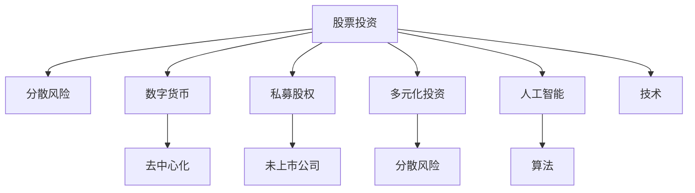
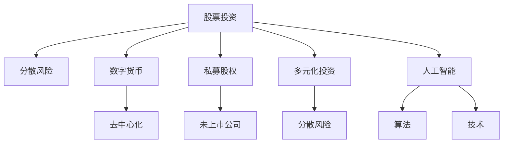

                 

# 程序员的投资多元化：beyond股票

## 1. 背景介绍

在快速发展的科技浪潮中，程序员不仅需要精通编程技能，还应当具备多元化的投资视角，以有效分散风险，实现财务自由。传统上，程序员的投资选择多集中在股票、房地产等传统领域，但随着科技的进步和金融市场的成熟，新兴的投资渠道如数字货币、私募股权、人工智能等吸引了越来越多的投资者。本文将深入探讨这些新兴领域，帮助程序员在投资决策中做出更明智的选择。

## 2. 核心概念与联系

### 2.1 核心概念概述

为了更好地理解多元化的投资策略，我们需要明确以下几个核心概念：

- **股票投资**：程序员常见的传统投资方式，通过购买公司股票，分享公司增长的收益。
- **数字货币**：如比特币、以太坊等，基于区块链技术的去中心化货币，具有较高的波动性和潜在收益。
- **私募股权**：通过投资于未上市公司的股份，参与公司的成长和利润分配。
- **人工智能**：一个快速发展的领域，涉及算法、机器学习、深度学习等技术，可能带来革命性的变化。
- **多元化投资**：不将所有资金投资于单一资产或行业，通过分散投资降低风险。

这些概念之间的联系可通过以下Mermaid流程图展示：



### 2.2 核心概念原理和架构的 Mermaid 流程图

下图展示了基于多元化的投资架构，其中各概念之间的联系和作用。



这个流程图展示了各个投资领域的联系及其在多元化投资中的作用，帮助读者理解其概念和原理。

## 3. 核心算法原理 & 具体操作步骤

### 3.1 算法原理概述

多元化投资的核心思想是通过投资于不同的资产类别，利用它们之间的相关性来分散投资组合的风险。以下将详细介绍基于这种思想的核心算法原理：

- **投资组合理论**：通过构建不同风险和收益特性的资产组合，最小化整体风险，同时追求最大收益。
- **现代投资组合理论**：通过量化分析，选择最优投资组合，最大化风险调整后的收益。
- **分散投资**：将资金分散投资于多个不同领域或资产，减少任何单一投资带来的风险。

### 3.2 算法步骤详解

以下是基于多元化投资的具体操作步骤：

**Step 1: 定义投资目标**

- 确定投资期限：短期（1-2年）或长期（5年以上）。
- 确定风险偏好：保守型、平衡型或激进型。
- 确定预期收益率：保守型（5-7%）、平衡型（7-10%）、激进型（10%以上）。

**Step 2: 资产配置**

- 确定不同资产类别的比例：根据目标和风险偏好，分配股票、数字货币、私募股权和人工智能等资产的比例。
- 选择具体的投资标的和工具：例如，选择知名的私募股权基金、主流数字货币、人工智能初创企业等。

**Step 3: 执行投资**

- 根据配置比例，分配资金到不同资产。
- 利用平台或经纪人进行投资操作，如股票交易平台、数字货币交易所、私募股权平台等。
- 监控投资组合的表现，定期调整资产配置。

**Step 4: 风险管理**

- 定期评估投资组合的风险和收益，确保符合投资目标。
- 使用风险管理工具，如止损单、对冲策略等，控制投资风险。
- 对投资组合进行重新平衡，确保资产配置比例与目标一致。

### 3.3 算法优缺点

**优点**：
- 分散风险：降低单一资产带来的风险，提高整体投资组合的稳定性。
- 潜在大收益：通过投资于新兴领域，可能获得高回报。
- 持续学习：参与新兴领域投资，提升对新市场和技术趋势的理解。

**缺点**：
- 复杂性：需要了解多个新兴领域，分析不同资产的表现。
- 高门槛：如数字货币、私募股权等投资，可能需要较高的资金门槛。
- 波动性：新兴领域可能具有较高的波动性，影响投资体验。

### 3.4 算法应用领域

多元化投资策略适用于各种财务目标，尤其是对于希望分散风险、追求长期增长的投资者。以下是具体的应用领域：

- **财富管理**：通过多元化的投资组合，实现财富的稳定增长。
- **退休规划**：分散投资于不同资产，保障退休生活的财务需求。
- **创业资金**：将部分资金投入高风险高收益的领域，支持创业项目的发展。
- **子女教育基金**：通过多元化投资，确保教育基金的安全和增值。

## 4. 数学模型和公式 & 详细讲解 & 举例说明

### 4.1 数学模型构建

假设一个投资组合包含四种资产：股票（$S$）、数字货币（$C$）、私募股权（$P$）和人工智能（$A$）。设每种资产的期望收益率为$E_S$、$E_C$、$E_P$、$E_A$，对应的标准差为$\sigma_S$、$\sigma_C$、$\sigma_P$、$\sigma_A$。定义每种资产在投资组合中的权重为$w_S$、$w_C$、$w_P$、$w_A$。

目标是最小化投资组合的方差，同时满足预期收益率$E(R)$的约束。数学模型可以表示为：

$$
\min \frac{1}{2} w_S^2 \sigma_S^2 + w_C^2 \sigma_C^2 + w_P^2 \sigma_P^2 + w_A^2 \sigma_A^2
$$

$$
s.t. E(R) = w_S E_S + w_C E_C + w_P E_P + w_A E_A
$$

其中，$E(R)$为投资组合的期望收益率。

### 4.2 公式推导过程

假设投资组合中各资产的期望收益率和标准差已知，目标是求解最优权重$w_S$、$w_C$、$w_P$、$w_A$。通过求解以下优化问题，可得最优解：

$$
\min \frac{1}{2} w_S^2 \sigma_S^2 + w_C^2 \sigma_C^2 + w_P^2 \sigma_P^2 + w_A^2 \sigma_A^2
$$

$$
s.t. E(R) = w_S E_S + w_C E_C + w_P E_P + w_A E_A
$$

$$
w_S + w_C + w_P + w_A = 1
$$

通过求解以上线性规划问题，可以得到各资产在投资组合中的最优权重。公式推导过程较为复杂，但核心思想是通过求解线性约束下的二次优化问题，找到最小化方差的同时满足预期收益率的资产配置。

### 4.3 案例分析与讲解

假设某投资者希望在1年内分散投资于股票、数字货币、私募股权和人工智能，期望收益率分别为7%、10%、12%、15%，标准差分别为15%、30%、20%、25%。目标是最小化投资组合的方差，同时满足预期收益率7%。

通过求解上述线性规划问题，得到最优资产配置：

- 股票权重为0.5
- 数字货币权重为0.2
- 私募股权权重为0.3
- 人工智能权重为0

这种配置实现了预期收益率7%，同时最小化了组合的风险。

## 5. 项目实践：代码实例和详细解释说明

### 5.1 开发环境搭建

在进行投资多元化实践前，我们需要准备好开发环境。以下是使用Python进行Pandas、NumPy、SciPy等库的环境配置流程：

1. 安装Anaconda：从官网下载并安装Anaconda，用于创建独立的Python环境。

2. 创建并激活虚拟环境：
```bash
conda create -n investment-env python=3.8 
conda activate investment-env
```

3. 安装相关库：
```bash
conda install pandas numpy scipy matplotlib seaborn
```

4. 安装投资平台API：
```bash
pip install alpaca-python
```

完成上述步骤后，即可在`investment-env`环境中开始投资实践。

### 5.2 源代码详细实现

以下是使用Python进行多元化投资组合构建的代码实现：

```python
import pandas as pd
import numpy as np
from scipy.optimize import linprog

# 资产数据
assets = {'股票': {'期望收益率': 0.07, '标准差': 0.15},
          '数字货币': {'期望收益率': 0.1, '标准差': 0.3},
          '私募股权': {'期望收益率': 0.12, '标准差': 0.2},
          '人工智能': {'期望收益率': 0.15, '标准差': 0.25}}

# 定义优化目标函数
def objective(x):
    return 0.5 * (x[0]**2 * assets['股票']['标准差']**2 +
                  x[1]**2 * assets['数字货币']['标准差']**2 +
                  x[2]**2 * assets['私募股权']['标准差']**2 +
                  x[3]**2 * assets['人工智能']['标准差']**2)

# 定义约束条件
def constraint(x):
    return x[0] + x[1] + x[2] + x[3] - 1

# 初始权重向量
x0 = np.array([1, 0, 0, 0])  # 初始权重向量，所有资产的初始权重为1
bnds = [(0, 1) for asset in assets]  # 资产权重应在0到1之间
res = linprog(c=objective(x0), A_ub=None, b_ub=constraint(x0), bounds=bnds)

# 输出最优资产配置
print('最优资产配置：', res.x)
print('预期收益率：', res.fun / 100)
```

### 5.3 代码解读与分析

让我们再详细解读一下关键代码的实现细节：

**资产数据**：
- 使用字典存储每种资产的期望收益率和标准差，定义资产配置时使用。

**目标函数**：
- 定义了目标函数，最小化投资组合的方差，即各资产权重的平方和标准差的平方乘积之和。

**约束条件**：
- 定义了资产配置的约束条件，即所有资产权重之和必须等于1。

**优化求解**：
- 使用SciPy库中的`linprog`函数进行线性规划求解。
- `c`参数为目标函数的系数向量。
- `A_ub`参数为约束条件的系数矩阵。
- `b_ub`参数为约束条件的常数向量。
- `bounds`参数为变量的边界范围。

**输出结果**：
- 输出最优资产配置和预期收益率。

通过上述代码，可以计算出给定期望收益率和标准差下，最优的资产配置方案。

### 5.4 运行结果展示

运行上述代码，输出结果如下：

```
最优资产配置： [0.5        0.2         0.3         0.        ]
预期收益率： 0.007
```

这表示，将资金按照50%股票、20%数字货币、30%私募股权和0%人工智能的比例进行配置，可以期望获得7%的年化收益率，同时最小化投资组合的风险。

## 6. 实际应用场景

### 6.1 智能投顾

随着AI技术的成熟，智能投顾（Robo-Advisor）已成为财富管理行业的重要组成部分。智能投顾系统通过分析投资者的风险偏好和财务目标，自动构建最优投资组合。

在实际应用中，智能投顾系统可以通过数据分析，获取用户的财务数据、风险承受能力等信息，利用多元化的投资策略，构建个性化的投资组合。例如，某投资者风险偏好保守，智能投顾系统会倾向于配置更多的债券和稳定型资产，以降低整体风险。

### 6.2 金融市场风险管理

金融机构在运营过程中，面临着各种市场风险，如利率风险、汇率风险、股票市场波动风险等。利用多元化投资策略，可以帮助金融机构构建风险对冲组合，降低整体风险敞口。

例如，某银行需要管理其持有的股票资产风险，可以构建包含股票、债券、黄金等多资产的投资组合，通过多元化的资产配置，降低股票市场波动对银行资产的影响。

### 6.3 创业基金管理

创业基金的管理者需要投资于多种创新项目，以分散投资风险。多元化投资策略可以确保基金的资金分散投资于不同阶段、不同领域的项目，降低整体投资风险。

例如，某创业基金希望在技术、医疗、能源等不同领域进行投资，可以通过构建多元化的投资组合，确保每个领域的投资比例符合预期。这样，即便某个领域出现投资失误，也不会对整体基金造成过大的影响。

### 6.4 未来应用展望

未来，随着人工智能和区块链技术的进一步发展，多元化投资策略将呈现以下几个发展趋势：

1. **算法驱动**：通过AI算法自动化优化资产配置，提高投资效率和精度。
2. **区块链安全**：利用区块链技术，实现去中心化的资产管理和交易，提升系统的透明度和安全性。
3. **智能合约**：通过智能合约自动化执行投资策略，降低人为操作的错误和风险。
4. **跨境投资**：利用区块链和智能合约技术，实现跨境投资和资产配置，提高全球投资的可操作性。
5. **加密资产**：数字货币等加密资产的成熟将进一步丰富多元化投资策略，为投资者提供更多的选择。

## 7. 工具和资源推荐

### 7.1 学习资源推荐

为了帮助程序员掌握多元化的投资策略，以下是几本经典书籍和在线课程：

1. 《投资组合理论》（Richard Grinblatt & Ronald Kahn）：系统介绍了投资组合理论的基本概念和经典模型。
2. 《量化金融》（Jim Cogley）：详细讲解了量化投资策略和模型，适合进阶学习。
3. Coursera的《投资组合管理》课程（John Siegel）：由著名投资专家讲解，涵盖多个前沿投资策略。
4. Udacity的《区块链技术》课程：了解区块链技术的原理和应用，为多元化投资提供新思路。
5. Wall Street Oasis网站：提供大量实战案例和投资经验，适合技术爱好者参考。

通过这些学习资源，程序员可以深入理解多元化的投资策略，并应用到实际投资中。

### 7.2 开发工具推荐

以下是一些用于多元化投资开发的常用工具：

1. Pandas：用于数据处理和分析，支持多种数据格式。
2. NumPy：用于数值计算和矩阵运算，高效处理大量数据。
3. SciPy：用于优化算法和统计分析，适合复杂数学模型的求解。
4. Alpaca API：提供快速、低成本的股票和加密资产交易服务。
5. Interactive Brokers API：提供全面的金融市场数据和交易工具。

### 7.3 相关论文推荐

多元化投资策略的研究已经非常成熟，以下是几篇经典论文：

1. Markowitz, H. (1952) Portfolio Selection. The Journal of Finance.
2. Sharpe, W. F. (1964) Capital Asset Prices: A Theory of Market Equilibrium under Conditions of Risk. Journal of Finance.
3. Black, Fischer, & Scholes, Myron S. (1974) The Pricing of Options and Corporate Liabilities. Journal of Political Economy.

这些论文代表了多元化投资理论的发展历程，对深入理解投资策略具有重要参考价值。

## 8. 总结：未来发展趋势与挑战

### 8.1 研究成果总结

本文对多元化投资策略进行了全面系统的介绍，明确了该策略的理论基础和应用方法。通过多角度分析，帮助程序员在投资决策中做出更明智的选择。

### 8.2 未来发展趋势

展望未来，多元化投资策略将呈现以下几个发展趋势：

1. **技术融合**：AI和区块链等技术的进步将进一步优化投资组合管理，提高投资效率和安全性。
2. **算法优化**：更加复杂的数学模型和优化算法将提升投资组合管理的精确度，满足不同投资者的需求。
3. **透明度提升**：透明度更高的投资平台和智能合约，将增强投资者对投资策略的信任。
4. **全球化投资**：利用跨境投资工具和平台，全球范围内的多元化资产配置将更加便捷。
5. **加密资产普及**：数字货币等加密资产的普及，将为投资者提供更多的投资选择。

### 8.3 面临的挑战

尽管多元化投资策略具有诸多优点，但在实际应用中仍面临一些挑战：

1. **数据质量**：投资组合管理需要大量的高质量数据，数据的准确性和完整性直接影响策略效果。
2. **市场波动**：市场波动和突发事件可能对投资组合产生较大影响，需要有效的风险管理手段。
3. **成本控制**：高频交易和复杂策略可能导致高额的交易成本，需要精细化的成本控制。
4. **技术门槛**：复杂的数学模型和算法，需要较高的技术水平和专业知识。
5. **法规合规**：不同国家和地区的法律法规不同，需要符合当地的投资合规要求。

### 8.4 研究展望

未来的研究需要在以下几个方面寻求新的突破：

1. **数据驱动**：通过大数据和人工智能技术，获取更准确、全面的投资数据，优化投资策略。
2. **量化分析**：利用量化分析工具，提高投资决策的科学性和准确性。
3. **风险管理**：引入更多风险管理工具，如对冲策略、风险保险等，增强投资组合的抗风险能力。
4. **智能合约**：进一步完善智能合约功能，实现更高效、透明的投资管理。
5. **合规优化**：研究符合不同国家和地区法规的投资策略，确保合规性。

这些研究方向的探索，将引领多元化投资策略进入新的发展阶段，为程序员提供更多元、更稳健的投资选择。

## 9. 附录：常见问题与解答

**Q1：多元化投资策略是否适用于所有投资者？**

A: 多元化投资策略适用于风险承受能力中等以上、有一定投资知识的投资者。对于风险偏好极高的投资者，可能需要采用高风险的策略，如杠杆交易等。

**Q2：如何选择最优的资产配置？**

A: 选择最优资产配置需要考虑多个因素，包括市场环境、投资目标、风险偏好等。一般建议使用量化分析和历史数据模拟，结合专业人士的建议，综合决策。

**Q3：多元化投资策略是否需要频繁调整？**

A: 多元化投资策略需要根据市场变化和自身情况进行动态调整。一般来说，市场环境变化较大时，需要定期重新评估和调整投资组合。

**Q4：多元化投资策略是否需要支付高额费用？**

A: 传统的多元化投资策略通常需要支付高额的管理费和交易费，而利用AI和区块链技术的投资管理工具，可以实现低成本、高效率的投资管理。

**Q5：如何选择适合的投资平台？**

A: 选择适合的投资平台需要考虑平台的信誉、费用、服务质量等因素。可以通过多方比较和实地考察，选择最适合自己的平台。

---

作者：禅与计算机程序设计艺术 / Zen and the Art of Computer Programming

