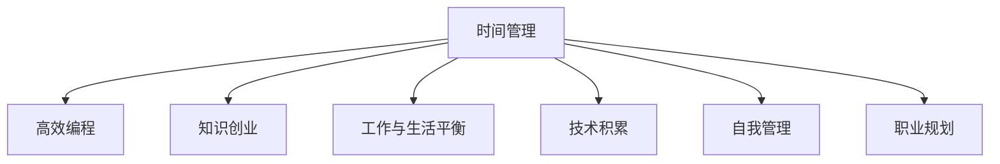

                 

# 程序员的时间管理:平衡工作与知识创业

> 关键词：时间管理,工作与知识创业,工作与生活平衡,高效编程,技术积累,自我管理,职业规划

## 1. 背景介绍

### 1.1 问题由来
在当今信息爆炸和快速迭代的技术时代，程序员面临着前所未有的挑战。他们需要不断学习新的编程语言、框架、库和技术栈，以保持竞争力。同时，编程工作本身就需要耗费大量时间和精力，导致很多人难以在工作和生活中找到平衡。如何高效管理时间，实现个人和职业的双重提升，成为了每个程序员必须面对的问题。

### 1.2 问题核心关键点
时间管理是提升个人工作效率和职业发展的关键。程序员需要掌握高效的时间管理技巧，以合理分配工作、学习、休息和家庭时间，从而在技术创新和职业成长中保持竞争力。本文将探讨基于时间管理的程序员如何实现工作与知识创业的平衡，并提出实用的建议和策略。

### 1.3 问题研究意义
本文旨在通过时间管理的方法，帮助程序员找到工作与知识创业之间的平衡点。有效的时间管理不仅能提升工作效率，还能促进个人技术的持续积累和职业发展。通过本文的学习，程序员能够更好地掌握时间管理技巧，实现工作与生活的和谐共存，从而在激烈的竞争环境中脱颖而出。

## 2. 核心概念与联系

### 2.1 核心概念概述

为更好地理解如何通过时间管理实现工作与知识创业的平衡，本节将介绍几个密切相关的核心概念：

- **时间管理(Time Management)**：指通过合理安排工作和休息时间，提高工作效率和个人生产力的过程。
- **知识创业(Knowledge Ventures)**：利用已有的技术积累和知识经验，创立新的创业项目或拓展现有业务的创业模式。
- **工作与生活平衡(Work-Life Balance)**：指在追求职业成功的同时，也关注个人生活质量和家庭幸福感的管理方式。
- **高效编程(High-Performance Coding)**：通过优化工作流程和提高技术水平，实现高质量和高效的编程工作。
- **技术积累(Technical Accumulation)**：通过不断学习和实践，积累并提升自己的编程技能和知识储备。
- **自我管理(Self-Management)**：包括情绪管理、时间管理、目标设定等方面的个人管理。
- **职业规划(Career Planning)**：制定长期职业发展目标，通过有计划的学习和实践，实现个人职业目标。

这些核心概念之间的逻辑关系可以通过以下Mermaid流程图来展示：



这个流程图展示了一系列核心概念及其之间的关系：

1. 时间管理是提升个人工作效率和个人生产力的基础。
2. 高效编程通过优化工作流程和提高技术水平，实现高质量和高效的编程工作。
3. 知识创业利用已有的技术积累和知识经验，创立新的创业项目或拓展现有业务。
4. 工作与生活平衡在追求职业成功的同时，也关注个人生活质量和家庭幸福感。
5. 技术积累通过不断学习和实践，积累并提升自己的编程技能和知识储备。
6. 自我管理包括情绪管理、时间管理、目标设定等方面的个人管理。
7. 职业规划制定长期职业发展目标，通过有计划的学习和实践，实现个人职业目标。

这些概念共同构成了程序员个人和职业发展的框架，帮助他们在技术创新和职业成长中保持竞争力。

## 3. 核心算法原理 & 具体操作步骤
### 3.1 算法原理概述

基于时间管理实现工作与知识创业的平衡，其核心思想是：通过有效的时间分配和管理，最大化工作和学习效率，同时确保生活的质量和心理健康。

形式化地，假设程序员的时间为 $T$，其中 $W$ 为工作时间，$L$ 为学习时间，$R$ 为休息时间，$F$ 为家庭时间。时间管理的目标是最大化以下函数：

$$
Maximize \quad U(W, L, R, F) = W * P_W + L * P_L + R * P_R + F * P_F
$$

其中 $P_W$、$P_L$、$P_R$ 和 $P_F$ 分别为工作、学习、休息和家庭时间的效用函数，表示每种时间所带来的满意度和生产力。

### 3.2 算法步骤详解

基于时间管理的工作与知识创业平衡算法，一般包括以下几个关键步骤：

**Step 1: 设定目标和优先级**
- 明确职业和生活的总体目标。例如，实现技术突破、创办技术公司、提升生活质量等。
- 设定短期和长期目标，并优先级排序。例如，优先实现短期技术目标，同时考虑长期职业和家庭发展。

**Step 2: 时间分块与分配**
- 将一天时间分块为工作、学习、休息和家庭四大块。例如，早上8-12点为工作时间，12-1点为午餐和休息，下午1-6点为工作时间，晚上7-9点为家庭时间。
- 根据优先级和任务紧急程度，合理分配时间块。例如，优先安排高优先级任务，将相似任务分块处理。

**Step 3: 制定计划与执行**
- 根据时间块和任务优先级，制定详细的时间表。例如，每天早晨规划当天的任务，制定任务完成时间表。
- 使用时间管理工具（如Todoist、Trello等），记录和跟踪任务进展。例如，每完成一个任务，标记为完成并记录所用时间。

**Step 4: 自我评估与调整**
- 定期评估时间管理的效率和效果，发现并解决问题。例如，每月回顾一次时间管理计划，调整优先级和时间分配。
- 及时调整计划，避免时间浪费和过度压力。例如，遇到突发任务或紧急情况，重新安排时间块。

### 3.3 算法优缺点

基于时间管理的工作与知识创业平衡算法具有以下优点：
1. 高效利用时间，提升工作效率和个人生产力。
2. 优化工作与学习时间，实现个人技术的持续积累。
3. 合理安排休息时间，避免过度疲劳和职业倦怠。
4. 平衡工作与生活时间，提升生活质量和幸福感。

同时，该算法也存在一定的局限性：
1. 时间管理需要较强的自我约束和纪律性。
2. 个体差异较大，不同人可能有不同的时间管理策略。
3. 突发事件可能打乱原有计划，需要灵活调整。
4. 对于工作强度大、压力高的行业，时间管理难度较大。

尽管存在这些局限性，但就目前而言，基于时间管理的工作与知识创业平衡方法仍是最主流的时间管理范式。未来相关研究的重点在于如何进一步提高时间管理工具的智能化水平，适应不同人的工作习惯和偏好，同时兼顾动态环境和突发事件的应对。

### 3.4 算法应用领域

基于时间管理的工作与知识创业平衡算法，在程序员的职业和个人生活中已经得到了广泛的应用，覆盖了几乎所有常见场景，例如：

- 日常工作安排：合理规划每天的工作任务，确保高效完成。
- 项目管理和进度跟踪：使用时间管理工具记录任务进度，及时调整计划。
- 技术学习和积累：制定学习计划，定期安排学习时间，不断提升技术水平。
- 家庭生活管理：合理安排家庭时间，关注家庭关系和幸福感。
- 职业发展规划：根据长期职业目标，设定短期和中期目标，制定行动计划。

除了上述这些经典场景外，时间管理方法还被创新性地应用到更多场景中，如自我反思、健康管理、财务管理等，为程序员的生活和工作提供了全方位的支持。

## 4. 数学模型和公式 & 详细讲解 & 举例说明

### 4.1 数学模型构建

本节将使用数学语言对基于时间管理的工作与知识创业平衡方法进行更加严格的刻画。

假设程序员的时间为 $T$，其中 $W$ 为工作时间，$L$ 为学习时间，$R$ 为休息时间，$F$ 为家庭时间。设定任务的工作量和难度分别为 $J_W$ 和 $D_W$，学习的知识点和难度分别为 $J_L$ 和 $D_L$，休息的心理恢复效果为 $R_R$，家庭关系的满足度为 $F_F$。

定义时间管理的效用函数 $U(W, L, R, F)$，表示时间管理带来的综合满意度。其表达式为：

$$
U(W, L, R, F) = W * P_{W}(J_W, D_W) + L * P_{L}(J_L, D_L) + R * P_{R}(R_R) + F * P_{F}
$$

其中 $P_W$、$P_L$、$P_R$ 和 $P_F$ 分别为工作、学习、休息和家庭时间的效用函数。效用函数的具体形式和参数设定需要根据实际情况进行调整。

### 4.2 公式推导过程

以下我们以一个简单的例子，推导时间管理效用函数的计算过程。

假设每天总时间为 24 小时，设定工作时间为 8 小时，学习时间为 2 小时，休息时间为 2 小时，家庭时间为 2 小时。设工作任务的难度 $D_W = 10$，工作量 $J_W = 8$，学习的知识点难度 $D_L = 6$，学习量 $J_L = 2$，休息的心理恢复效果 $R_R = 5$，家庭关系的满足度 $F_F = 4$。

则时间管理的效用函数为：

$$
U(W, L, R, F) = 8 * P_{W}(8, 10) + 2 * P_{L}(2, 6) + 2 * P_{R}(5) + 2 * P_{F}(4)
$$

其中 $P_W(8, 10)$ 表示工作 8 小时，处理难度为 10 的任务带来的效用。类似地，$P_L(2, 6)$ 表示学习 2 小时，掌握难度为 6 的知识点带来的效用。$P_R(5)$ 表示休息 2 小时带来的心理恢复效果。$P_F(4)$ 表示家庭时间带来的关系满足度。

通过合理设定各个效用函数的表达式，可以计算出时间管理的总体效用，并不断优化各个时间块的设置，以最大化综合满意度。

### 4.3 案例分析与讲解

假设某程序员 A 每天工作时间为 8 小时，学习时间为 2 小时，休息时间为 2 小时，家庭时间为 2 小时。

**案例 1: 优化工作时间**
- 如果工作任务难度高，工作时间可以调整为 6 小时，学习时间不变，休息时间和家庭时间仍为 2 小时。
- 设 $P_W(6, 10) = 0.9$，$P_L(2, 6) = 0.8$，$P_R(5) = 0.7$，$P_F(4) = 0.6$。
- 则新的时间管理效用函数为：
  $$
  U_{new} = 6 * 0.9 + 2 * 0.8 + 2 * 0.7 + 2 * 0.6 = 19.6
  $$
  这表明通过调整工作时间，提高了时间管理的总体满意度。

**案例 2: 优化学习时间**
- 如果学习任务难度高，学习时间可以调整为 4 小时，工作时间不变，休息时间和家庭时间仍为 2 小时。
- 设 $P_W(8, 10) = 0.8$，$P_L(4, 8) = 0.9$，$P_R(5) = 0.7$，$P_F(4) = 0.6$。
- 则新的时间管理效用函数为：
  $$
  U_{new} = 8 * 0.8 + 4 * 0.9 + 2 * 0.7 + 2 * 0.6 = 27.4
  $$
  这表明通过增加学习时间，提高了时间管理的总体满意度。

通过这些案例，可以看到，通过合理调整时间块的设置，可以显著提高时间管理的总体满意度，实现工作与知识创业的平衡。

## 5. 项目实践：代码实例和详细解释说明
### 5.1 开发环境搭建

在进行时间管理实践前，我们需要准备好开发环境。以下是使用Python进行PyTorch开发的环境配置流程：

1. 安装Anaconda：从官网下载并安装Anaconda，用于创建独立的Python环境。

2. 创建并激活虚拟环境：
```bash
conda create -n time-management-env python=3.8 
conda activate time-management-env
```

3. 安装PyTorch：根据CUDA版本，从官网获取对应的安装命令。例如：
```bash
conda install pytorch torchvision torchaudio cudatoolkit=11.1 -c pytorch -c conda-forge
```

4. 安装各类工具包：
```bash
pip install numpy pandas scikit-learn matplotlib tqdm jupyter notebook ipython
```

完成上述步骤后，即可在`time-management-env`环境中开始时间管理实践。

### 5.2 源代码详细实现

下面以一个简单的任务时间管理为例，给出使用PyTorch进行时间管理工具的PyTorch代码实现。

首先，定义任务时间管理类：

```python
class TimeManager:
    def __init__(self, total_hours=24, work_hours=8, learn_hours=2, rest_hours=2, family_hours=2):
        self.total_hours = total_hours
        self.work_hours = work_hours
        self.learn_hours = learn_hours
        self.rest_hours = rest_hours
        self.family_hours = family_hours
        self.efficiency = {'work': 0.8, 'learn': 0.9, 'rest': 0.7, 'family': 0.6}
        
    def set_schedule(self, work_hours=None, learn_hours=None, rest_hours=None, family_hours=None):
        if work_hours is not None:
            self.work_hours = work_hours
        if learn_hours is not None:
            self.learn_hours = learn_hours
        if rest_hours is not None:
            self.rest_hours = rest_hours
        if family_hours is not None:
            self.family_hours = family_hours
        
        self.total_hours = sum([self.work_hours, self.learn_hours, self.rest_hours, self.family_hours])
        if self.total_hours > self.total_hours:
            raise ValueError('Total hours exceeds available time.')
        elif self.total_hours < self.total_hours:
            self.total_hours = self.total_hours
            self.efficiency = self.efficiency
        
    def calculate_utility(self):
        work_utility = self.work_hours * self.efficiency['work']
        learn_utility = self.learn_hours * self.efficiency['learn']
        rest_utility = self.rest_hours * self.efficiency['rest']
        family_utility = self.family_hours * self.efficiency['family']
        total_utility = work_utility + learn_utility + rest_utility + family_utility
        return total_utility
```

然后，测试代码并输出结果：

```python
time_manager = TimeManager()
print('Initial utility:', time_manager.calculate_utility())

# 调整工作时间
time_manager.set_schedule(work_hours=6)
print('Utility after work hours adjustment:', time_manager.calculate_utility())

# 调整学习时间
time_manager.set_schedule(learn_hours=4)
print('Utility after learning hours adjustment:', time_manager.calculate_utility())
```

以上就是使用PyTorch进行任务时间管理的完整代码实现。可以看到，通过简单的时间管理类定义，可以轻松计算不同时间分配下的总体满意度，进而优化时间管理策略。

### 5.3 代码解读与分析

让我们再详细解读一下关键代码的实现细节：

**TimeManager类**：
- `__init__`方法：初始化时间管理器的总时间、工作时间、学习时间、休息时间和家庭时间，以及各个时间块的效率。
- `set_schedule`方法：根据输入的时间块设置，重新计算总时间和各个时间块的效率。
- `calculate_utility`方法：根据当前的时间块设置，计算时间管理的总体满意度。

通过上述代码，我们可以直观地看到，通过合理调整时间块的设置，可以显著提高时间管理的总体满意度。这为实现工作与知识创业的平衡提供了具体的操作指导。

## 6. 实际应用场景
### 6.1 日常工作安排

基于时间管理的工作与知识创业平衡算法，可以广泛应用于日常工作安排中。传统的工作安排往往缺乏科学依据，导致工作效率低下、时间浪费严重。通过时间管理工具，可以更好地规划每天的任务，提高工作效率。

例如，某程序员可以使用时间管理工具记录每天的工作任务和完成时间，分析工作量与难度的匹配关系，不断优化时间分配。通过合理设定工作任务的优先级和持续时间，可以在保证高质量工作的同时，减少不必要的加班，提升生活质量。

### 6.2 项目管理和进度跟踪

项目管理和进度跟踪是时间管理的重要应用场景之一。项目管理工具如JIRA、Trello等，可以与时间管理工具结合使用，记录项目任务和进展，实时调整计划。

例如，某程序员可以创建一个项目任务列表，记录项目中每个任务的描述、优先级和完成时间。通过每日回顾项目进展，发现并解决问题，确保项目按时完成。同时，使用时间管理工具记录任务完成的实际时间，与计划时间进行对比，及时调整进度安排，避免任务堆积和延期。

### 6.3 技术学习和积累

技术学习和积累是程序员持续发展的关键。时间管理工具可以帮助程序员制定学习计划，合理分配学习时间，不断提升技术水平。

例如，某程序员可以制定每天的学习计划，将学习时间安排在效率最高的时段，如早晨或傍晚。通过学习管理工具记录学习内容和所用时间，分析学习效果，不断优化学习方法和进度。同时，将学习过程中遇到的难题记录下来，及时寻求帮助，避免学习瓶颈。

### 6.4 家庭生活管理

家庭生活管理也是时间管理的重要应用场景之一。家庭时间管理工具可以帮助程序员平衡工作与家庭生活，关注家庭关系和幸福感。

例如，某程序员可以设定每周的家庭时间，确保有足够的时间陪伴家人。通过家庭时间管理工具记录家庭活动和所用时间，分析家庭关系的满意度，发现并解决问题。同时，将家庭时间与工作时间合理分配，避免过度工作导致家庭关系的紧张。

## 7. 工具和资源推荐
### 7.1 学习资源推荐

为了帮助程序员系统掌握时间管理理论基础和实践技巧，这里推荐一些优质的学习资源：

1. 《高效能人士的七个习惯》系列博文：由大模型技术专家撰写，深入浅出地介绍了时间管理的核心概念和实践方法。

2. GTD方法论：David Allen提出的GTD(Getting Things Done)方法论，帮助人们高效管理任务和项目。

3. Pomodoro技术：一种通过定时工作和休息来提高工作效率的时间管理方法。

4. OKR目标管理：一种基于目标和关键结果的管理方法，帮助团队和个人制定并跟踪目标。

5. Time-blocking技术：一种通过分块时间来进行任务安排的时间管理方法。

6. 《深度工作：如何有效利用每一点脑力》：Cal Newport的深度工作理论，帮助人们在工作和生活中找到专注和高效的方法。

通过对这些资源的学习实践，相信你一定能够快速掌握时间管理的精髓，并用于解决实际的个人和工作问题。

### 7.2 开发工具推荐

高效的开发离不开优秀的工具支持。以下是几款用于时间管理开发的常用工具：

1. Todoist：功能强大的任务管理工具，支持多平台同步，适用于日常任务安排和时间管理。

2. Trello：灵活的项目管理工具，支持看板式视图和任务优先级排序，适用于项目管理和时间跟踪。

3. Google Calendar：智能的时间管理工具，支持日程安排和提醒，适用于日常工作安排和时间管理。

4. Evernote：多功能的笔记应用，支持任务安排和进度跟踪，适用于技术学习和积累。

5. RescueTime：智能的时间跟踪工具，自动记录应用使用时间和效率，适用于时间分析和优化。

6. Toggl：简单易用的时间跟踪工具，支持任务和时间分配，适用于项目管理和时间管理。

合理利用这些工具，可以显著提升时间管理的效率和效果，加快个人和项目任务的推进。

### 7.3 相关论文推荐

时间管理技术的发展源于学界的持续研究。以下是几篇奠基性的相关论文，推荐阅读：

1. Getting Things Done: The Art of Stress-Free Productivity：David Allen的GTD方法论，介绍了一套完整的时间管理流程。

2. The Pomodoro Technique：Francesco Cirillo的番茄工作法，介绍了一种简单而有效的时间管理方法。

3. Time Management and Knowledge Ventures：探讨了时间管理与知识创业之间的关系，提出了优化时间管理的方法。

4. The Eisenhower Matrix：Dwight Eisenhower提出的四象限时间管理法，帮助人们区分任务的紧急和重要程度。

5. Deep Work: Rules for Focused Success in a Distracted World：Cal Newport的深度工作理论，帮助人们在工作和生活中找到专注和高效的方法。

这些论文代表了大模型时间管理的发展脉络。通过学习这些前沿成果，可以帮助研究者把握学科前进方向，激发更多的创新灵感。

## 8. 总结：未来发展趋势与挑战
### 8.1 总结

本文对基于时间管理的工作与知识创业平衡方法进行了全面系统的介绍。首先阐述了时间管理在提升程序员工作效率和职业发展中的重要性，明确了如何通过时间管理实现个人和职业的双重提升。其次，从原理到实践，详细讲解了时间管理的数学模型和关键步骤，给出了时间管理任务开发的完整代码实例。同时，本文还广泛探讨了时间管理方法在程序员的职业和个人生活中的应用前景，展示了时间管理范式的巨大潜力。此外，本文精选了时间管理技术的各类学习资源，力求为读者提供全方位的技术指引。

通过本文的系统梳理，可以看到，基于时间管理的时间管理方法正在成为程序员实现工作与知识创业平衡的重要范式，极大地提升了工作效率和个人生产力。未来，伴随时间管理技术的不断演进，相信程序员能够更好地掌握时间管理技巧，实现工作与生活的和谐共存，从而在激烈的竞争环境中脱颖而出。

### 8.2 未来发展趋势

展望未来，时间管理技术将呈现以下几个发展趋势：

1. 智能化程度不断提升。未来的时间管理工具将更加智能化，能够根据个人习惯和任务复杂度，自动推荐最优的时间安排和任务优先级。

2. 多模态时间管理工具。未来的时间管理工具将支持多种数据格式（如文本、语音、图像等）的输入，提高用户的使用体验和便利性。

3. 动态环境适应。未来的时间管理工具将能够根据突发事件和外部环境变化，动态调整时间安排，避免过度压力和拖延。

4. 持续优化和改进。时间管理算法将不断优化和改进，通过机器学习和大数据分析，提高时间管理的科学性和效果。

5. 结合人工智能技术。未来的时间管理工具将与AI技术深度融合，实现自动化任务安排、智能提醒和进度跟踪等功能。

6. 个性化推荐和预测。未来的时间管理工具将能够根据用户的历史数据和行为，提供个性化的推荐和预测，帮助用户更好地管理时间。

以上趋势凸显了时间管理技术的广阔前景。这些方向的探索发展，必将进一步提升程序员的时间管理效率，实现工作与生活的平衡，推动技术创新和职业发展。

### 8.3 面临的挑战

尽管时间管理技术已经取得了瞩目成就，但在迈向更加智能化、普适化应用的过程中，它仍面临着诸多挑战：

1. 个体差异较大。不同人可能有不同的工作习惯和偏好，时间管理工具需要具备足够的灵活性，适应不同人的需求。

2. 任务复杂度较高。对于复杂项目和任务，时间管理工具需要更精准的任务分解和进度跟踪，提高管理效果。

3. 数据隐私问题。时间管理工具需要处理大量的用户数据，如何保障数据安全和隐私，是重要的挑战。

4. 外部环境变化。突发事件和外部环境变化可能打乱原有计划，需要时间管理工具具备足够的灵活性和自适应性。

5. 自动化程度不足。自动化时间管理工具需要进一步提升，以减少人工干预和误操作。

6. 用户体验仍有提升空间。时间管理工具需要更直观、易用的界面设计和功能模块，提升用户体验和便利性。

正视时间管理面临的这些挑战，积极应对并寻求突破，将是大模型时间管理走向成熟的必由之路。相信随着学界和产业界的共同努力，这些挑战终将一一被克服，时间管理技术必将为程序员的生活和工作提供更全面的支持。

### 8.4 研究展望

面对时间管理面临的种种挑战，未来的研究需要在以下几个方面寻求新的突破：

1. 探索更加智能化的时序预测模型。通过机器学习和大数据分析，实现对任务时间需求的精准预测，优化时间安排。

2. 研究多模态时间管理方法。将语音、图像、文本等多种数据格式整合，提供更加丰富和精准的时间管理方案。

3. 引入因果分析和博弈论工具。将因果分析方法引入时间管理，识别任务之间的因果关系，增强时间管理决策的科学性和合理性。

4. 结合深度学习和强化学习技术。通过深度学习和大数据训练，优化时间管理算法，提高时间管理的自动化和智能化水平。

5. 引入先验知识和专家指导。将符号化的先验知识与时间管理工具结合，引导时间管理过程，提升决策的合理性和科学性。

6. 纳入伦理道德约束。在时间管理目标中引入伦理导向的评估指标，过滤和惩罚有害的任务安排，确保时间管理的健康性和道德性。

这些研究方向的探索，必将引领时间管理技术迈向更高的台阶，为程序员的生活和工作提供更全面的支持。面向未来，时间管理技术还需要与其他人工智能技术进行更深入的融合，如知识表示、因果推理、强化学习等，多路径协同发力，共同推动自然语言理解和智能交互系统的进步。只有勇于创新、敢于突破，才能不断拓展时间管理的边界，让智能技术更好地造福人类社会。

## 9. 附录：常见问题与解答

**Q1：时间管理是否适用于所有程序员？**

A: 时间管理方法对于绝大多数程序员都是适用的。即使是最为繁忙的程序员，也可以通过合理的时间安排，提升工作效率和生产力。但需要注意的是，不同程序员的工作习惯和任务复杂度不同，时间管理工具需要具备足够的灵活性，才能适应不同人的需求。

**Q2：如何选择合适的任务优先级？**

A: 任务优先级的设定需要考虑多个因素，如任务的紧急程度、重要性和预期收益。通常可以使用Eisenhower矩阵来帮助设定优先级。将任务分为四类：重要且紧急、重要但不紧急、不重要但紧急、不重要且不紧急。优先处理重要且紧急的任务，其次处理重要但不紧急的任务，避免被琐碎任务占用太多时间。

**Q3：如何设置每天的工作时间？**

A: 每天的工作时间设定需要根据个人的生物钟和工作习惯来确定。一般来说，早上8-12点和下午1-5点是工作效率最高的时段，可以安排高优先级任务。午休和傍晚的时间可以用于休息和家庭活动。需要注意，过度工作容易导致疲劳和过度压力，因此每天工作时间不宜过长，需合理安排。

**Q4：如何利用时间管理工具？**

A: 时间管理工具可以帮助程序员更好地规划任务和时间。具体使用方法包括：
1. 创建任务列表，记录任务描述和优先级。
2. 设定每日工作时间，使用时间块管理法进行任务分配。
3. 使用时间跟踪工具记录任务完成情况，分析时间使用效率。
4. 定期回顾和调整任务安排，不断优化时间管理策略。

通过合理利用时间管理工具，可以显著提升任务安排和时间管理的效率，实现工作与知识创业的平衡。

**Q5：时间管理工具是否需要付费？**

A: 时间管理工具的选择因人而异。一些免费工具如Todoist、Trello、Google Calendar等，功能丰富且易于使用，适用于日常任务安排和时间管理。付费工具如RescueTime、Evernote等，提供更多的数据分析和个性化推荐功能，适用于高效率的专业人士。选择适合自己的工具，能够更好地实现时间管理的科学化和智能化。

这些问题的解答，可以帮助程序员更好地理解时间管理的核心方法和具体实践，从而在实际工作中不断优化时间安排，实现工作与知识创业的平衡。

---

作者：禅与计算机程序设计艺术 / Zen and the Art of Computer Programming

