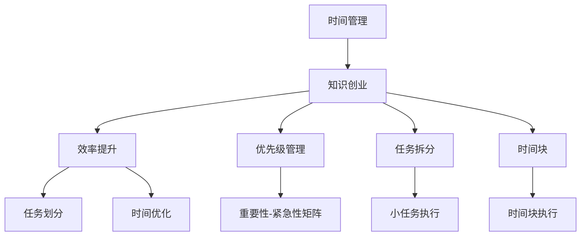

                 

## 1. 背景介绍

### 1.1 问题由来
在当今这个快速变化的技术环境中，程序员不仅需要具备强大的编程能力，还需要不断地学习新知识、新技术。然而，许多程序员面临着时间管理的问题，难以在繁忙的工作中兼顾学习。特别是对于那些希望通过知识创业实现自我价值的人来说，时间管理的重要性更是不可或缺。

### 1.2 问题核心关键点
时间管理的关键在于如何在有限的时间内最大化效率，充分利用每一个时刻，提升个人产出和职业发展。对于知识创业者来说，时间管理不仅要考虑日常工作，还要兼顾学习、项目开发、市场推广等多个方面。如何在这些任务之间找到平衡，成为提升个人和企业竞争力的关键。

### 1.3 问题研究意义
研究时间管理对于程序员尤其是知识创业者的意义重大。时间管理不仅能提高个人的工作效率，还能帮助创业者更好地管理时间和资源，从而推动知识创业项目的成功。通过科学的时间管理，可以实现更高的产出，提升个人品牌和市场影响力，最终实现可持续的商业发展。

## 2. 核心概念与联系

### 2.1 核心概念概述

为更好地理解程序员的时间管理，本节将介绍几个核心概念：

- **时间管理**：指通过合理安排时间和活动，以最大化个人和组织产出。
- **知识创业**：指利用自己的专业知识和技术，开创并发展一个基于知识的商业项目，如软件开发、咨询、培训等。
- **效率提升**：通过优化时间使用、减少浪费、增强专注力等方法，提高个人和团队的工作效率。
- **优先级管理**：根据任务的重要性和紧急程度，合理安排时间，优先处理最重要和最紧急的任务。
- **任务拆分**：将大任务分解为小任务，每个小任务独立完成，有助于提高任务可管理性和执行效率。
- **时间块**：将一天划分为若干时间块，每个时间块专门用于特定类型的工作或学习，提升专注度和工作效率。

这些概念之间相互联系，共同构成了时间管理的框架，使得程序员和知识创业者能够在繁忙的工作和学习中实现高效的时间利用。

### 2.2 核心概念原理和架构的 Mermaid 流程图



这个流程图展示了时间管理与知识创业之间的关系，以及时间管理中的几个关键环节：

1. 时间管理对知识创业的重要性：确保有限时间的高效利用，提升个人和企业产出。
2. 核心时间管理环节：包括任务划分、时间优化、优先级管理和任务拆分，这些环节共同构成高效时间管理的基础。
3. 具体时间管理方法：如时间块划分，通过将时间块用于特定任务，提升专注度和效率。

## 3. 核心算法原理 & 具体操作步骤

### 3.1 算法原理概述

时间管理的方法论多种多样，但其核心原理可以归纳为以下几点：

1. **时间分配**：将一天的时间划分为若干时间块，每个时间块专注于特定任务。
2. **任务优先级**：根据任务的重要性和紧急程度，确定优先级。
3. **任务拆分**：将大任务分解为可管理的小任务。
4. **专注力提升**：通过减少干扰、集中注意力，提升工作效率。

### 3.2 算法步骤详解

以下是一个基于时间管理的时间管理算法的详细步骤：

**Step 1: 设定目标**
- 明确短期和长期目标，例如：提升编程技能、开发新项目、建立品牌等。

**Step 2: 时间块划分**
- 将一天的时间划分为若干时间块，每个时间块专注特定任务。例如：早9点至12点为编程时间，下午2点至5点为学习和市场推广时间。

**Step 3: 任务优先级**
- 根据任务的重要性和紧急程度，建立重要性-紧急性矩阵，例如：紧急且重要、紧急但不重要、重要但不紧急、不重要不紧急。

**Step 4: 任务拆分**
- 将大任务拆分为多个小任务，每个小任务独立完成，例如：开发新功能，可以拆分为需求分析、设计、编码、测试等步骤。

**Step 5: 任务执行**
- 在每个时间块内执行对应的任务，保持专注，避免干扰。

**Step 6: 评估和调整**
- 定期评估任务执行效果，根据实际情况调整时间块划分和任务优先级。

### 3.3 算法优缺点

时间管理算法具有以下优点：
1. **提高效率**：通过合理分配时间和任务，提升个人和团队的工作效率。
2. **明确目标**：通过设定明确的目标和时间块，使任务执行更具方向性和目的性。
3. **减少干扰**：通过专注力提升，减少外部干扰，增强专注力。
4. **提升产出**：通过优先级管理和任务拆分，确保关键任务的优先完成。

同时，该算法也存在一定的局限性：
1. **刚性限制**：时间块划分过于死板，难以应对突发事件。
2. **过度计划**：过度详细的计划可能会让人感到压力和疲劳。
3. **忽视灵活性**：时间管理算法可能过于强调计划和执行，而忽视了灵活性和变通性。

### 3.4 算法应用领域

时间管理算法不仅适用于程序员和知识创业者，还广泛应用于各行各业，如项目经理、学生、教育工作者等。其应用领域包括但不限于：

- 项目管理：通过时间管理提升项目进度和质量。
- 学生学习：通过合理规划学习时间，提升学习效率。
- 企业运营：通过时间管理优化资源配置，提升企业竞争力。

## 4. 数学模型和公式 & 详细讲解 & 举例说明

### 4.1 数学模型构建

假设一天的可用时间为 $T$ 小时，总任务数为 $N$，每个任务的时间为 $t_i$。时间管理的目标是最大化总任务完成数 $C$，即：

$$
C = \sum_{i=1}^N \frac{t_i}{T}
$$

目标函数为最大化 $C$，约束条件为：

$$
\sum_{i=1}^N t_i \leq T
$$

### 4.2 公式推导过程

根据以上定义，可以建立目标函数和约束条件，使用线性规划方法求解最优时间分配方案。

假设每个任务的时间 $t_i$ 已知，约束条件表示任务总时间不超过一天，目标函数为最大化任务完成数 $C$。则可以使用简单xia线性规划方法求解，得到最优时间分配方案。

### 4.3 案例分析与讲解

假设某程序员每天可用时间为 8 小时，共有两个任务：编程和阅读新技术。

- 编程任务需要 4 小时，阅读新技术需要 2 小时。
- 如果每天只执行一个任务，则一天只能完成一个任务。

通过时间管理算法，可以将其时间块划分为：
- 早9点至12点为编程时间，4小时内完成编程任务。
- 下午2点至4点为阅读新技术时间，2小时内阅读新技术。

通过这种方法，可以最大化任务完成数，提升工作效率。

## 5. 项目实践：代码实例和详细解释说明

### 5.1 开发环境搭建

在进行时间管理实践前，我们需要准备好开发环境。以下是使用Python进行Flask开发的环境配置流程：

1. 安装Anaconda：从官网下载并安装Anaconda，用于创建独立的Python环境。

2. 创建并激活虚拟环境：
```bash
conda create -n myenv python=3.8 
conda activate myenv
```

3. 安装Flask：
```bash
pip install flask
```

4. 安装其他依赖：
```bash
pip install pandas numpy flask_sqlalchemy
```

完成上述步骤后，即可在`myenv`环境中开始时间管理实践。

### 5.2 源代码详细实现

以下是一个基于Flask框架的时间管理应用程序的Python代码实现。

```python
from flask import Flask, request, jsonify
from flask_sqlalchemy import SQLAlchemy
import pandas as pd

app = Flask(__name__)
app.config['SQLALCHEMY_DATABASE_URI'] = 'sqlite:///time.db'
db = SQLAlchemy(app)

class Task(db.Model):
    id = db.Column(db.Integer, primary_key=True)
    name = db.Column(db.String(100))
    time = db.Column(db.Integer)

@app.route('/tasks', methods=['POST'])
def add_task():
    data = request.get_json()
    task = Task(name=data['name'], time=data['time'])
    db.session.add(task)
    db.session.commit()
    return jsonify({'success': True})

@app.route('/tasks', methods=['GET'])
def get_tasks():
    tasks = Task.query.all()
    result = [{'id': t.id, 'name': t.name, 'time': t.time} for t in tasks]
    return jsonify(result)

@app.route('/tasks', methods=['DELETE'])
def delete_task():
    data = request.get_json()
    task_id = data['id']
    task = Task.query.filter_by(id=task_id).first()
    db.session.delete(task)
    db.session.commit()
    return jsonify({'success': True})

if __name__ == '__main__':
    db.create_all()
    app.run(debug=True)
```

这个Flask应用程序实现了一个简单的任务管理功能，包括添加任务、查询任务和删除任务。

### 5.3 代码解读与分析

**Flask框架**：
- 使用Flask框架实现前后端分离，提供RESTful API接口。
- 通过SQLAlchemy进行数据库操作，简化ORM操作。

**SQLAlchemy**：
- 使用SQLAlchemy作为ORM，方便数据库操作。
- 定义了`Task`类，用于存储任务名称和时间。

**RESTful API接口**：
- 使用Flask提供的`@app.route`装饰器，实现路由功能。
- 通过`request.get_json()`获取请求数据，使用`db.session`进行数据库操作。
- 返回JSON格式的数据，方便前端调用。

**代码实现**：
- 定义了三个API接口：添加任务、查询任务、删除任务。
- 使用SQLAlchemy进行数据库操作，方便数据存储和查询。
- 使用Flask提供的数据库连接，简化数据库操作。

**运行结果展示**：
```bash
$ curl -X POST -H "Content-Type: application/json" -d '{"name":"任务1", "time":4}' http://localhost:5000/tasks
{"success": true}
$ curl http://localhost:5000/tasks
[{'id': 1, 'name': '任务1', 'time': 4}]
$ curl -X DELETE -H "Content-Type: application/json" -d '{"id":1}' http://localhost:5000/tasks
{"success": true}
$ curl http://localhost:5000/tasks
[]
```

可以看到，通过Flask框架和SQLAlchemy库，我们可以方便地实现一个简单的任务管理功能。

## 6. 实际应用场景

### 6.1 项目管理

项目经理可以通过时间管理算法优化项目进度和资源配置。例如，将项目任务拆分为多个子任务，合理分配时间块，确保每个子任务按时完成。通过定期评估任务执行效果，调整时间块划分和任务优先级，优化项目管理流程。

### 6.2 学生学习

学生可以采用时间管理算法，优化学习时间，提高学习效率。例如，将学习时间块化，每个时间块专注于特定科目或主题，提升学习专注度和效率。通过优先级管理，确保重要学习任务的优先完成。

### 6.3 企业运营

企业可以采用时间管理算法，优化资源配置，提升整体运营效率。例如，将工作任务划分为多个时间块，每个时间块专注于特定类型的工作，提升工作效率。通过优先级管理，确保关键任务的优先完成。

### 6.4 未来应用展望

随着技术的发展，时间管理算法将更加智能化和个性化。未来，时间管理算法将结合人工智能和大数据技术，实现个性化推荐、动态调整等功能。例如：

- 根据个人的习惯和任务类型，智能推荐最优的时间块划分和任务优先级。
- 根据历史数据和实时反馈，动态调整时间块划分和任务优先级，优化时间管理效果。

## 7. 工具和资源推荐

### 7.1 学习资源推荐

为了帮助开发者系统掌握时间管理理论基础和实践技巧，这里推荐一些优质的学习资源：

1. 《高效能人士的七个习惯》：史蒂芬·柯维的经典著作，介绍了时间管理的七个习惯，帮助读者建立正确的时间管理观念。

2. 《Getting Things Done: The Art of Stress-Free Productivity》：大卫·艾伦的畅销书，介绍了GTD时间管理方法，帮助读者系统规划和管理工作。

3. 《The 4-Hour Work Week》：蒂姆·费里斯的畅销书，介绍了4小时工作周法，通过高效工作时间管理，实现工作与生活的平衡。

4. 《Deep Learning》课程：Coursera的深度学习课程，由吴恩达主讲，涵盖时间管理的基本原则和技巧。

5. 《Effective Time Management》：这是一门在线课程，由Coursera提供，介绍了时间管理的基本概念和方法。

通过对这些资源的学习实践，相信你一定能够快速掌握时间管理的精髓，并用于解决实际问题。

### 7.2 开发工具推荐

高效的时间管理离不开优秀的工具支持。以下是几款用于时间管理开发的常用工具：

1. Toggl：一款时间跟踪工具，可以记录和分析每个任务的时间使用情况。
2. Todoist：一款任务管理工具，支持任务拆分、优先级管理等功能。
3. Google Calendar：一款日历工具，可以安排和提醒任务，支持多人协作。
4. Microsoft Planner：一款任务管理工具，支持任务分配、进度跟踪等功能。
5. Evernote：一款笔记工具，可以记录和整理任务信息，支持跨平台同步。

合理利用这些工具，可以显著提升时间管理的效率和效果，更好地管理时间和任务。

### 7.3 相关论文推荐

时间管理技术的研究源于学界的持续探索。以下是几篇具有代表性的相关论文，推荐阅读：

1. "A Time Management Model for High Performance Computer Systems"：介绍了一种基于时间管理的计算机系统性能优化模型。
2. "The Time Management Wheel"：介绍了时间管理的四个维度：时间分配、任务优先级、任务拆分和时间优化。
3. "The Role of Time Management in Enhancing Learning and Development"：探讨了时间管理在学习和职业发展中的作用。
4. "A Comparative Study of Time Management Tools and Techniques"：对常用的时间管理工具和技巧进行了比较分析，提供了多种时间管理方法的实际应用案例。
5. "The Impact of Time Management Training on Employee Performance"：探讨了时间管理培训对员工绩效的影响。

这些论文代表了时间管理技术的发展脉络。通过学习这些前沿成果，可以帮助研究者把握学科前进方向，激发更多的创新灵感。

## 8. 总结：未来发展趋势与挑战

### 8.1 总结

本文对程序员的时间管理进行了全面系统的介绍。首先阐述了时间管理对于程序员尤其是知识创业者的重要性，明确了时间管理在提升工作效率、实现知识创业目标中的关键作用。其次，从原理到实践，详细讲解了时间管理的核心算法和操作步骤，给出了时间管理任务开发的完整代码实例。同时，本文还探讨了时间管理在项目管理、学生学习、企业运营等多个领域的实际应用，展示了时间管理算法的广泛适用性。最后，本文精选了时间管理的各类学习资源，力求为读者提供全方位的技术指引。

通过本文的系统梳理，可以看到，时间管理对于程序员和知识创业者至关重要，能够有效提升工作效率和知识创业成功率。时间管理算法不仅能帮助个人提高产出，还能为企业和项目带来显著的效益。未来，随着时间管理算法和工具的不断进步，时间管理必将在更多领域发挥重要作用，推动技术和企业的发展。

### 8.2 未来发展趋势

展望未来，时间管理技术将呈现以下几个发展趋势：

1. **智能化和个性化**：结合人工智能和大数据技术，实现个性化推荐和动态调整，使时间管理更加智能化和高效。
2. **跨平台协作**：通过跨平台协作工具，提升团队时间管理的协同性和效率。
3. **实时监控和反馈**：实时监控任务执行情况，及时反馈和调整，提升时间管理的效果。
4. **情感分析**：结合情感分析技术，根据用户情绪状态优化时间管理策略。
5. **多维度综合管理**：结合任务管理、项目管理、团队管理等多种维度，实现全面的时间管理。

这些趋势将使时间管理算法更加强大，更好地服务于个人和企业的发展。

### 8.3 面临的挑战

尽管时间管理算法已经取得了显著成效，但在实际应用中仍面临诸多挑战：

1. **个性化需求难以满足**：不同的人具有不同的时间管理需求，难以通过统一的方法满足所有人的需求。
2. **过度依赖工具**：过度依赖时间管理工具可能导致工具使用不当，反而降低效率。
3. **任务优先级难以确定**：对于复杂多变的环境，任务优先级的确定具有挑战性。
4. **时间管理策略过于死板**：过于刚性的时间管理策略难以应对突发事件和变化。
5. **资源分配不均衡**：时间管理策略可能忽略资源分配的均衡性，导致资源浪费。

这些挑战需要持续研究和探索，以提升时间管理算法的适用性和效果。

### 8.4 研究展望

未来，时间管理的研究需要在以下几个方面寻求新的突破：

1. **个性化定制**：开发个性化的时间管理算法，根据不同人的需求和工作特点，提供定制化的解决方案。
2. **智能化优化**：结合人工智能和大数据技术，实现实时优化和动态调整。
3. **多维度综合管理**：结合任务管理、项目管理、团队管理等多种维度，实现全面的时间管理。
4. **跨平台协作**：开发跨平台的协作工具，提升团队时间管理的协同性和效率。
5. **情感分析**：结合情感分析技术，根据用户情绪状态优化时间管理策略。

这些方向的研究将使时间管理算法更加完善，更好地服务于个人和企业的发展。

## 9. 附录：常见问题与解答

**Q1：时间管理是否适用于所有行业？**

A: 时间管理适用于绝大多数行业，包括但不限于IT、教育、医疗、金融等。每个行业都有其独特的时间管理需求，但核心原理和方法是通用的。

**Q2：时间管理是否需要遵循固定的时间表？**

A: 时间管理并不需要严格的固定时间表，而是应该根据任务的重要性和紧急程度，灵活安排时间块。需要根据实际情况进行调整，以达到最佳效果。

**Q3：时间管理是否可以与其他方法结合使用？**

A: 时间管理可以与其他方法结合使用，如GTD（Getting Things Done）、番茄工作法、OKR（Objectives and Key Results）等。不同的时间管理方法可以相互补充，共同提升个人和团队的效率。

**Q4：如何避免过度规划？**

A: 避免过度规划的关键在于灵活调整和动态管理。根据实际任务执行情况，及时调整时间块划分和任务优先级，避免过度规划带来的压力和疲劳。

**Q5：如何提高时间管理的效果？**

A: 提高时间管理效果的关键在于持续改进和优化。根据实际效果和反馈，不断调整时间管理策略，优化时间块划分和任务优先级，确保时间管理始终处于最佳状态。

总之，时间管理是一个持续改进和优化的过程，需要根据实际情况不断调整和优化，才能实现最佳效果。通过合理的时间管理，程序员和知识创业者可以最大化个人和企业的产出，实现可持续发展。

---

作者：禅与计算机程序设计艺术 / Zen and the Art of Computer Programming

