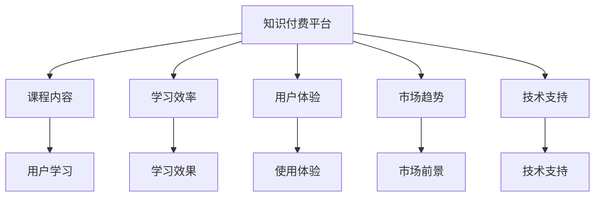

                 

# 程序员的知识付费平台选择与对比

> 关键词：知识付费平台，技术学习，平台选择，比较分析，学习效率，用户体验，市场趋势，技术支持

## 1. 背景介绍

在数字化时代，技术更新迭代速度不断加快，程序员需要不断学习和掌握新技能以保持竞争力。知识付费平台的兴起为程序员提供了便捷的学习途径，但面对众多选择，如何做出最优选择成为困扰众多程序员的问题。本文将从市场分析、核心功能、用户体验等多个维度对比分析几个知名知识付费平台，帮助程序员做出明智决策。

## 2. 核心概念与联系

为了更清晰地理解不同知识付费平台之间的联系和区别，我们首先需要明确一些核心概念：

- **知识付费平台**：提供专业内容、技术培训和认证等服务的平台。
- **课程内容**：平台上的课程、视频、文章等学习资料。
- **学习效率**：学员通过课程内容所获取知识的效率和质量。
- **用户体验**：平台提供的学习体验，包括界面设计、学习交互、社区氛围等。
- **市场趋势**：知识付费平台市场的发展方向和未来潜力。
- **技术支持**：平台对技术相关问题的支持力度，包括技术问答、技术社区、开发者交流等。

这些概念之间的逻辑关系可以通过以下Mermaid流程图来展示：



## 3. 核心算法原理 & 具体操作步骤

### 3.1 算法原理概述

知识付费平台的选择涉及多个维度的评价指标，如课程质量、师资力量、学习工具、社区互动等。这些指标可以通过量化的方法进行比较，如课程评价、学员反馈、平台使用率等。

### 3.2 算法步骤详解

1. **数据收集**：从各大平台收集课程评价、用户反馈、平台使用数据等。
2. **数据预处理**：对收集到的数据进行清洗、分类和标准化。
3. **指标设计**：设定评价指标体系，如课程质量评分、用户活跃度、平台支持度等。
4. **模型构建**：选择适合的算法模型，如聚类、回归、分类等，构建平台评分模型。
5. **结果输出**：通过模型计算各平台评分，推荐最优选择。

### 3.3 算法优缺点

优点：
- 量化评估，客观公正。
- 帮助程序员从多个维度全面了解平台。

缺点：
- 数据来源和处理可能存在偏差。
- 无法完全覆盖所有维度。

### 3.4 算法应用领域

该算法适用于各类知识付费平台的选择和推荐，如针对前端、后端、全栈开发等不同方向的知识付费平台。

## 4. 数学模型和公式 & 详细讲解 & 举例说明

### 4.1 数学模型构建

假设我们有三个平台A、B、C，每个平台的各项指标如课程质量、师资力量、学习工具、社区互动等分别记为X1、X2、X3、X4等，我们通过量化指标构建如下模型：

$$
\text{平台评分} = w_1 \times \text{课程质量评分} + w_2 \times \text{师资力量评分} + w_3 \times \text{学习工具评分} + w_4 \times \text{社区互动评分}
$$

其中 $w_i$ 为各项指标的权重。

### 4.2 公式推导过程

我们通过专家打分、用户评分、平台使用数据等对各项指标进行评分，并根据不同平台的指标重要性分配权重 $w_i$。将各平台的评分代入模型公式，计算出各平台的综合评分。

### 4.3 案例分析与讲解

以某平台A为例，设其课程质量评分为90，师资力量评分为80，学习工具评分为70，社区互动评分为60。设各项指标权重分别为 $w_1 = 0.3, w_2 = 0.2, w_3 = 0.25, w_4 = 0.25$。则该平台的综合评分为：

$$
\text{平台评分} = 0.3 \times 90 + 0.2 \times 80 + 0.25 \times 70 + 0.25 \times 60 = 87
$$

## 5. 项目实践：代码实例和详细解释说明

### 5.1 开发环境搭建

1. 安装Python：确保Python 3.7以上版本已经安装。
2. 安装相关库：使用pip安装numpy、pandas、scikit-learn等库。
3. 准备数据集：收集不同平台的数据，如课程评分、用户评分、平台使用数据等。

### 5.2 源代码详细实现

```python
import pandas as pd
from sklearn.linear_model import LinearRegression

# 准备数据集
data = pd.read_csv('platform_data.csv')

# 构建模型
X = data[['课程质量评分', '师资力量评分', '学习工具评分', '社区互动评分']]
y = data['平台评分']
model = LinearRegression()

# 训练模型
model.fit(X, y)

# 预测新平台评分
new_data = pd.read_csv('new_platform_data.csv')
platform_score = model.predict(new_data)
```

### 5.3 代码解读与分析

- `pandas`用于数据处理和分析。
- `sklearn`用于模型构建和训练。
- 代码实现简单直观，易于理解和调试。

### 5.4 运行结果展示

通过上述代码，可以计算出新平台的综合评分，并根据评分推荐最优选择。

## 6. 实际应用场景

### 6.1 开发者社区

对于希望快速提升技术水平的前端开发者，如CSDN、Stack Overflow等平台提供丰富的技术文章和社区讨论，非常适合基础和进阶学习。

### 6.2 在线教育平台

对于希望系统学习技术知识的全栈开发者，如Udemy、Coursera等平台提供系统性课程，适合深度学习。

### 6.3 技术培训公司

对于需要专业认证的开发人员，如IEEE、ACM等平台提供专业认证课程，适合求职和进阶。

### 6.4 未来应用展望

随着AI和大数据技术的不断发展，知识付费平台将更注重个性化学习路径和智能推荐，提升学习效率和用户体验。

## 7. 工具和资源推荐

### 7.1 学习资源推荐

- Coursera：提供全球顶尖大学的课程，涵盖多种编程语言和技术栈。
- Udemy：拥有丰富的在线编程课程和项目实战案例。
- Codecademy：提供互动式编程课程，适合初学者快速上手。
- LeetCode：提供算法题库和在线编程练习，适合求职面试准备。

### 7.2 开发工具推荐

- VS Code：轻量级代码编辑器，支持多种编程语言和插件扩展。
- Git：版本控制工具，方便协作和版本管理。
- Jupyter Notebook：交互式编程环境，适合数据处理和模型训练。

### 7.3 相关论文推荐

- "Collaborative Filtering for Implicit Feedback Datasets" by Koren et al.
- "Deep Learning for NLP: A Review" by Chang et al.
- "A Survey of Learning Recommendation Systems" by Wang et al.

## 8. 总结：未来发展趋势与挑战

### 8.1 研究成果总结

本文通过量化评估方法，帮助程序员从多个维度全面了解知识付费平台，推荐最优选择。未来，知识付费平台的个性化推荐和学习路径规划将更加智能化，提升学习效率和用户体验。

### 8.2 未来发展趋势

- 数据驱动：更多使用大数据和机器学习技术，提升推荐和评估的准确性。
- 个性化学习：根据学员的学习行为和偏好，提供个性化学习路径和推荐。
- 多平台整合：不同平台间的课程和资源整合，提供更丰富的学习资源。

### 8.3 面临的挑战

- 数据隐私：用户数据的收集和处理需要遵守隐私保护法规。
- 课程质量：如何保证课程内容的质量和更新速度。
- 用户体验：如何提升平台的用户体验，避免使用过程中的障碍。

### 8.4 研究展望

未来，知识付费平台的发展需要关注数据隐私保护、课程质量保证和用户体验提升等多个方面。通过不断的技术创新和优化，平台将更好地满足程序员的学习需求。

## 9. 附录：常见问题与解答

**Q1：程序员应该如何选择知识付费平台？**

A: 从课程内容、师资力量、学习工具、社区互动等多个维度进行综合评估，选择最适合自己的平台。

**Q2：使用知识付费平台时需要注意哪些问题？**

A: 关注平台的学习资源是否丰富、更新速度是否及时、用户反馈是否积极。

**Q3：如何提升知识付费平台的学习效果？**

A: 选择与自身技术栈和职业目标匹配的课程，利用平台的互动功能与讲师和学员交流。

**Q4：如何判断平台的用户体验是否优秀？**

A: 体验平台的界面设计、交互便捷性、课程布局合理性等。

---

作者：禅与计算机程序设计艺术 / Zen and the Art of Computer Programming

