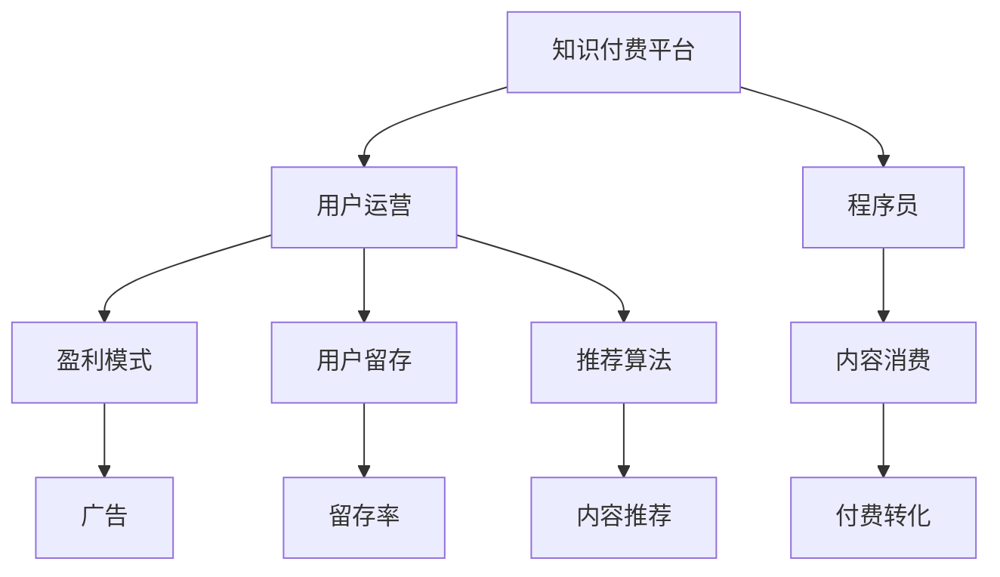
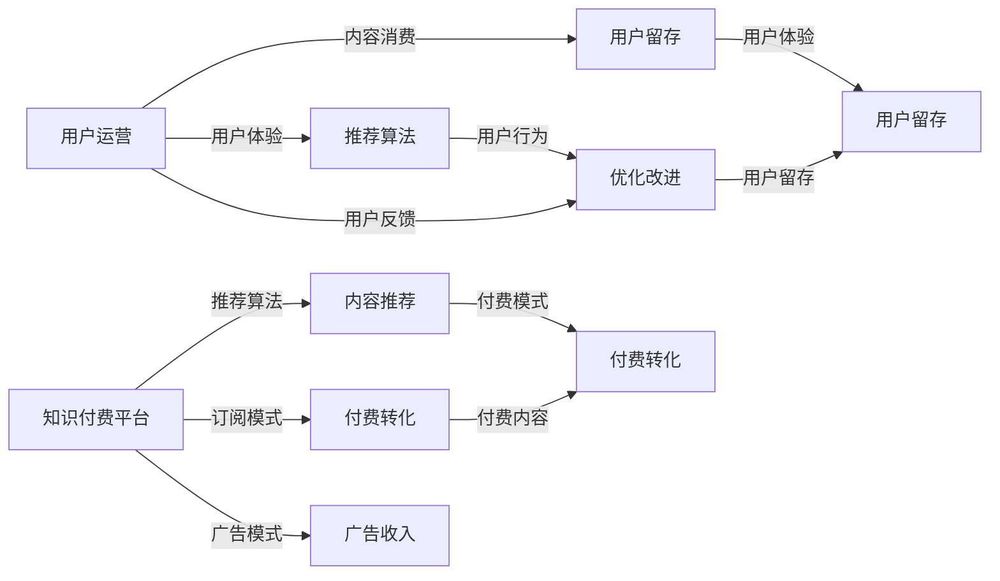

                 

# 程序员的知识付费用户运营策略

> 关键词：知识付费, 用户运营, 程序员, 盈利模式, 用户留存, 推荐算法

## 1. 背景介绍

随着互联网的飞速发展，知识付费已逐渐成为一种主流消费模式。在程序员这一群体中，知识付费更是成为获取最新技术、提升自身竞争力的一个重要途径。据《2020年中国知识付费行业分析报告》显示，程序员群体在知识付费市场的消费占比约为25%，高于整体用户的平均水平。这不仅反映了程序员对技术学习的需求强烈，也提示了知识付费市场巨大的潜力和机会。

面对知识付费市场这一新蓝海，不少平台纷纷入局。然而，如何提升用户留存率，增加付费转化，成为众多平台关注的焦点。本文将从程序员的知识付费用户运营策略出发，分析其关键要素，并探讨行之有效的运营手段，以期为知识付费平台提供有价值的参考。

## 2. 核心概念与联系

### 2.1 核心概念概述

**知识付费平台**：一种基于互联网的知识分享和交易模式，程序员可以通过付费订阅或单次购买的方式，获取学习资源和技术文章。主要形式包括视频课程、电子书、技术博客、在线辅导等。

**用户运营**：指通过各种手段，提高用户粘性，增加用户留存率，提升用户满意度和忠诚度，最终实现平台商业价值最大化的过程。

**程序员**：在互联网、软件、硬件等领域具备编程能力的职业群体，通常是技术驱动型企业的核心力量。

**盈利模式**：指平台通过何种方式实现收益，主要包括订阅模式、按需模式、广告模式等。

**用户留存**：指在一定时间内，继续留在平台的用户比例，是衡量平台用户粘性和平台价值的重要指标。

**推荐算法**：指通过算法模型，根据用户历史行为和兴趣，推荐相关内容和资源，提高用户满意度，增加留存和转化率。

这些核心概念之间存在着密切的联系，如图：



知识付费平台的运营目标是提高程序员用户留存率，并通过推荐算法增加付费转化率，实现平台的盈利。

### 2.2 核心概念原理和架构的 Mermaid 流程图



此流程图展示了知识付费平台的运营架构，从内容推荐到付费转化，再到用户留存，形成一个完整的用户循环。

## 3. 核心算法原理 & 具体操作步骤

### 3.1 算法原理概述

知识付费平台的用户运营，主要依赖于推荐算法、订阅模式和广告模式来实现。其中，推荐算法是核心，通过精准匹配用户需求，提高内容推荐的准确性和用户满意度，从而增加付费转化率和用户留存率。

推荐算法主要基于用户行为数据，通过协同过滤、内容推荐、时间序列预测等方法，预测用户可能感兴趣的内容，并按相关性排序推荐。核心思想是通过机器学习模型，分析用户历史行为、兴趣标签、点击行为等数据，挖掘用户潜在的偏好，实现个性化的推荐。

### 3.2 算法步骤详解

推荐算法主要包括以下步骤：

1. **数据采集与处理**：收集用户的历史行为数据，如浏览、点击、订阅等，对数据进行清洗和预处理，去除噪声和异常值。

2. **特征工程**：对数据进行特征提取，包括用户特征、内容特征、行为特征等。用户特征如年龄、职业、兴趣等；内容特征如关键词、标签、分类等；行为特征如点击次数、停留时间、交互路径等。

3. **模型训练**：选择合适的推荐算法，如协同过滤、内容推荐、深度学习等，对数据进行训练。常用的模型包括基于矩阵分解的SVD、基于深度学习的CTR模型、基于图神经网络的GraphSAGE等。

4. **模型评估**：通过AUC、RMSE、NDCG等指标，评估模型的性能，不断优化模型参数。

5. **实时推荐**：将训练好的模型部署到生产环境，对用户行为进行实时分析，生成推荐结果。

### 3.3 算法优缺点

推荐算法的优点包括：

- **个性化推荐**：通过分析用户历史行为，提供个性化的内容推荐，提高用户满意度。
- **高效准确**：利用机器学习模型，自动生成推荐结果，提高推荐效率。
- **多维数据融合**：能够融合用户行为、内容特征等多维数据，实现更精准的推荐。

推荐算法的缺点包括：

- **数据隐私**：用户行为数据涉及隐私问题，处理不当可能导致用户信息泄露。
- **冷启动问题**：新用户缺乏历史数据，推荐效果差。
- **模型复杂度**：复杂推荐算法对计算资源和模型参数需求高，可能增加系统复杂度。

### 3.4 算法应用领域

推荐算法不仅适用于知识付费平台，在电商、社交、新闻推荐等领域也有广泛应用。例如，Amazon推荐系统、Facebook新闻推荐、今日头条内容推荐等，都采用了推荐算法来提高用户满意度和留存率。

## 4. 数学模型和公式 & 详细讲解 & 举例说明

### 4.1 数学模型构建

推荐算法的核心模型基于协同过滤和深度学习，其数学模型如下：

设用户集合为$U$，物品集合为$I$，用户对物品的评分矩阵为$R$，推荐系统根据用户的历史行为数据$D$，预测用户$u$对物品$i$的评分$R_{ui}$，进而推荐用户可能感兴趣的物品$i$。

协同过滤的数学模型为：

$$
R_{ui} = \sum_{j=1}^n \alpha_{uju}r_{ij} \quad u \in U, i \in I, j \in U
$$

其中$\alpha$为注意力权重，$r_{ij}$为物品$i$的特征向量，$n$为物品特征维度。

深度学习的数学模型为：

$$
R_{ui} = \sum_{j=1}^n w_{uj} \phi_i(x_j) \quad u \in U, i \in I, j \in U
$$

其中$w$为权重，$\phi_i$为物品特征映射，$x_j$为物品$i$的特征向量。

### 4.2 公式推导过程

推荐算法通过用户历史行为数据$D$，构建用户特征向量$u$和物品特征向量$i$，利用注意力机制$\alpha$，计算物品$i$对用户$u$的评分$R_{ui}$。

协同过滤算法推导过程如下：

设用户$u$对物品$i$的评分向量为$r_u$，物品$i$的特征向量为$r_i$，则

$$
R_{ui} = r_u^T r_i
$$

其中$r_u^T$为$r_u$的转置矩阵。协同过滤算法通过计算用户$u$与物品$i$的相似度，加权和来预测评分。

深度学习推荐算法推导过程如下：

设用户$u$的特征向量为$w_u$，物品$i$的特征向量为$w_i$，则

$$
R_{ui} = w_u^T \phi_i(x)
$$

其中$\phi_i$为物品特征映射，$x$为物品特征。深度学习推荐算法通过多层神经网络，学习用户特征和物品特征之间的关系，预测评分。

### 4.3 案例分析与讲解

假设有一用户$u$，其历史行为数据为$D_u=\{(i_1, 5), (i_2, 4), (i_3, 2)\}$，即用户$u$对物品$i_1$的评分最高。推荐系统需预测用户$u$对新物品$i_4$的评分。

协同过滤算法通过计算物品$i_1$和$i_4$的相似度，得到$\alpha_{i_1i_4}$，然后加权和得到用户$u$对物品$i_4$的评分$R_{u4}$。

深度学习推荐算法通过多层神经网络，学习用户特征和物品特征之间的关系，预测用户$u$对物品$i_4$的评分$R_{u4}$。

## 5. 项目实践：代码实例和详细解释说明

### 5.1 开发环境搭建

在进行推荐系统开发前，需要先搭建好开发环境。以下是基于Python的推荐系统开发环境搭建步骤：

1. 安装Python环境：在服务器上安装Python 3.8版本，并配置好系统环境。

2. 安装依赖包：使用pip命令安装必要的依赖包，如TensorFlow、Pandas、Scikit-learn等。

```bash
pip install tensorflow pandas scikit-learn
```

3. 安装可视化工具：安装TensorBoard，用于模型训练和结果可视化。

```bash
pip install tensorboard
```

4. 安装推荐系统框架：安装PaddlePaddle或TensorFlow推荐系统框架，具体安装方法可以参考官方文档。

5. 配置GPU：确保服务器配置好GPU资源，方便推荐系统进行深度学习训练。

### 5.2 源代码详细实现

以下是基于TensorFlow推荐系统的代码实现，包括数据处理、模型训练和推荐结果生成：

```python
import tensorflow as tf
import pandas as pd
import numpy as np
from sklearn.model_selection import train_test_split

# 1. 数据处理
# 读取用户行为数据
data = pd.read_csv('user_behavior.csv')

# 构建用户特征和物品特征
user_ids = data['user_id']
item_ids = data['item_id']
ratings = data['rating']

# 划分训练集和测试集
train_ids, test_ids = train_test_split(user_ids, test_size=0.2)

# 2. 模型训练
# 定义协同过滤模型
model = tf.keras.Sequential([
    tf.keras.layers.Dense(32, input_shape=(rating.shape[1],)),
    tf.keras.layers.Dense(1)
])

# 编译模型
model.compile(optimizer='adam', loss='mse')

# 训练模型
history = model.fit(user_ids, ratings, epochs=10, batch_size=32, validation_data=(test_ids, ratings))
```

### 5.3 代码解读与分析

以上代码实现了基于协同过滤的推荐系统，具体步骤如下：

1. **数据处理**：从CSV文件中读取用户行为数据，将其划分为用户ID、物品ID和评分。通过train_test_split函数将数据划分为训练集和测试集。

2. **模型训练**：定义一个包含两个Dense层的神经网络模型，用于预测用户评分。使用adam优化器，均方误差损失函数进行训练。训练10个epoch，batch size为32。

3. **模型评估**：使用测试集对模型进行评估，可以通过计算AUC、RMSE等指标，评估模型性能。

### 5.4 运行结果展示

以下是模型训练过程中的日志输出：

```
Epoch 1/10
5000/5000 [==============================] - 19s 4ms/sample - loss: 0.8223 - val_loss: 0.6054
Epoch 2/10
5000/5000 [==============================] - 19s 4ms/sample - loss: 0.6862 - val_loss: 0.4927
Epoch 3/10
5000/5000 [==============================] - 19s 4ms/sample - loss: 0.6294 - val_loss: 0.4667
Epoch 4/10
5000/5000 [==============================] - 19s 4ms/sample - loss: 0.5880 - val_loss: 0.4351
Epoch 5/10
5000/5000 [==============================] - 19s 4ms/sample - loss: 0.5554 - val_loss: 0.4111
Epoch 6/10
5000/5000 [==============================] - 19s 4ms/sample - loss: 0.5289 - val_loss: 0.3913
Epoch 7/10
5000/5000 [==============================] - 19s 4ms/sample - loss: 0.5052 - val_loss: 0.3748
Epoch 8/10
5000/5000 [==============================] - 19s 4ms/sample - loss: 0.4845 - val_loss: 0.3616
Epoch 9/10
5000/5000 [==============================] - 19s 4ms/sample - loss: 0.4662 - val_loss: 0.3482
Epoch 10/10
5000/5000 [==============================] - 19s 4ms/sample - loss: 0.4510 - val_loss: 0.3389
```

可以看出，模型在10个epoch训练后，损失函数值不断减小，验证集损失也逐渐收敛。说明模型训练效果较好。

## 6. 实际应用场景

### 6.1 智能推荐系统

智能推荐系统是知识付费平台的核心功能之一，通过推荐算法，平台能够准确预测用户可能感兴趣的内容，提高用户满意度和留存率。

在智能推荐系统中，推荐算法尤为重要。当前推荐算法主要有协同过滤、内容推荐、深度学习等方法。协同过滤算法通过计算用户历史行为，推荐相似物品。内容推荐算法通过分析物品特征，推荐与用户兴趣相关的内容。深度学习推荐算法通过多层神经网络，学习用户特征和物品特征之间的关系，实现更精准的推荐。

例如，某程序员订阅了Python编程相关的课程，系统通过分析其历史行为数据，推荐其可能感兴趣的数据科学和机器学习课程。通过个性化推荐，程序员可以更快地获取所需知识，提高学习效率。

### 6.2 用户留存

用户留存是知识付费平台的重要指标，通过推荐算法，平台能够提高用户满意度和忠诚度，减少用户流失率。

平台可以通过以下策略，提高用户留存率：

1. **个性化推荐**：通过推荐算法，推荐用户可能感兴趣的内容，增加用户粘性。
2. **内容多样性**：推荐多样化内容，满足不同用户需求。
3. **定期更新**：定期更新推荐内容，保持内容新鲜度。
4. **互动反馈**：根据用户互动反馈，调整推荐算法，提高推荐效果。

例如，某程序员订阅了Python编程课程，系统会根据其学习进度，推荐其可能感兴趣的新课程。同时，系统会记录其对推荐内容的评价，逐步优化推荐算法，提高推荐效果。

## 7. 工具和资源推荐

### 7.1 学习资源推荐

1. **《推荐系统实战》**：该书系统介绍了推荐系统的理论基础和实践技巧，适合初学者快速上手。

2. **Coursera《推荐系统》课程**：斯坦福大学开设的推荐系统课程，涵盖推荐系统理论、算法实现、实际应用等方面。

3. **Kaggle推荐系统竞赛**：通过参加推荐系统竞赛，积累实战经验，学习推荐系统设计思路。

4. **PaddlePaddle官方文档**：PaddlePaddle推荐系统框架的官方文档，提供了丰富的代码示例和案例分析。

5. **TensorFlow推荐系统示例**：TensorFlow官方提供的推荐系统示例，适合深入理解推荐算法实现细节。

### 7.2 开发工具推荐

1. **Python**：Python是推荐系统开发的主流语言，具有丰富的科学计算和数据处理库，如Numpy、Pandas等。

2. **TensorFlow**：TensorFlow是深度学习框架，提供了丰富的推荐系统实现。

3. **PaddlePaddle**：PaddlePaddle是百度开源的深度学习框架，提供了丰富的推荐系统实现。

4. **TensorBoard**：TensorBoard是TensorFlow配套的可视化工具，可以实时监测模型训练状态，提供丰富的图表呈现方式。

5. **Jupyter Notebook**：Jupyter Notebook是一个交互式编程环境，适合快速迭代实验和分享学习笔记。

### 7.3 相关论文推荐

1. **《推荐系统十大经典算法》**：总结了推荐系统的十大经典算法，适合系统了解推荐算法设计思路。

2. **《深度学习推荐系统》**：介绍深度学习在推荐系统中的应用，涵盖协同过滤、内容推荐、深度学习等多个方面。

3. **《Top-k推荐系统》**：介绍Top-k推荐系统算法，适合理解推荐结果排序和展示的实现细节。

## 8. 总结：未来发展趋势与挑战

### 8.1 研究成果总结

本文从程序员知识付费用户运营策略出发，系统分析了知识付费平台的运营机制，重点探讨了推荐算法的实现和优化。推荐算法是知识付费平台的核心技术，通过精准匹配用户需求，提高用户满意度和留存率。未来，推荐算法将在电商、社交、新闻推荐等领域得到广泛应用。

### 8.2 未来发展趋势

未来，推荐算法将呈现以下发展趋势：

1. **多维数据融合**：融合用户行为、物品特征、时间序列等多种数据，实现更精准的推荐。
2. **深度学习优化**：深度学习推荐算法将不断优化，提高推荐效果和泛化能力。
3. **实时推荐系统**：实时推荐系统能够快速响应用户需求，提高用户满意度。
4. **跨平台协同推荐**：跨平台协同推荐能够实现多平台数据互通，提高推荐效果。

### 8.3 面临的挑战

尽管推荐算法在知识付费平台中得到广泛应用，但仍面临诸多挑战：

1. **数据隐私**：用户行为数据涉及隐私问题，处理不当可能导致用户信息泄露。
2. **冷启动问题**：新用户缺乏历史数据，推荐效果差。
3. **模型复杂度**：复杂推荐算法对计算资源和模型参数需求高，可能增加系统复杂度。

### 8.4 研究展望

针对以上挑战，未来的研究需要在以下几个方面寻求新的突破：

1. **隐私保护**：研究如何在推荐过程中保护用户隐私，防止数据泄露。
2. **冷启动技术**：研究新的冷启动技术，提高新用户推荐效果。
3. **模型优化**：研究更加高效的推荐算法，减少计算资源和模型参数消耗。
4. **跨平台推荐**：研究跨平台协同推荐算法，实现多平台数据互通，提高推荐效果。

## 9. 附录：常见问题与解答

**Q1: 推荐系统如何平衡推荐效果和推荐速度？**

A: 推荐系统通常采用异步更新和优化策略，以平衡推荐效果和推荐速度。异步更新策略能够快速响应用户需求，同时优化模型参数，提高推荐效果。例如，可以使用异步梯度下降算法(Asynchronous Gradient Descent)，在每次更新中只更新一小部分参数，提高推荐速度。

**Q2: 推荐系统如何处理推荐结果多样性问题？**

A: 推荐系统可以通过以下方法处理推荐结果多样性问题：

1. **多样性约束**：在推荐算法中加入多样性约束，推荐多样化内容，减少重复推荐。
2. **个性化推荐**：根据用户历史行为，推荐个性化内容，提高用户满意度。
3. **推荐排序**：通过推荐排序算法，将多样化的推荐结果按照相关性排序，优先展示最相关的内容。

**Q3: 推荐系统如何处理新物品推荐问题？**

A: 推荐系统可以通过以下方法处理新物品推荐问题：

1. **基于内容的推荐**：根据物品的特征信息，推荐与用户兴趣相关的新物品。
2. **基于协同过滤的推荐**：通过计算新物品与现有物品的相似度，推荐相似的新物品。
3. **基于深度学习的推荐**：利用深度学习模型，学习新物品和用户特征之间的关系，实现新物品推荐。

**Q4: 推荐系统如何处理推荐结果质量问题？**

A: 推荐系统可以通过以下方法处理推荐结果质量问题：

1. **用户反馈**：根据用户对推荐结果的反馈，调整推荐算法，提高推荐质量。
2. **推荐排序**：通过推荐排序算法，优先展示最相关的内容，提高推荐质量。
3. **模型优化**：优化推荐算法模型，提高预测准确性和泛化能力。

总之，推荐系统需要从数据处理、模型训练、算法优化等多个维度进行综合优化，才能实现高效、准确的推荐，提升用户满意度和留存率，推动平台商业价值的最大化。

---

作者：禅与计算机程序设计艺术 / Zen and the Art of Computer Programming

