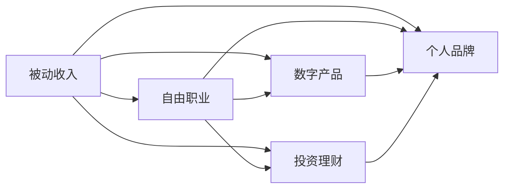

                 

# 程序员的被动收入：构建与维护

> 关键词：被动收入, 程序员, 软件开发, 投资理财, 自由职业, 数字产品, 自我营销, 持续学习

## 1. 背景介绍

### 1.1 问题由来
在科技迅猛发展的时代，程序员这一群体正逐渐从传统的全职工作模式转变为自由职业者和自我创业者。越来越多的程序员开始寻求实现被动收入，也就是不需要主动劳动就能获得的收入。这种转变并非偶然，而是源于以下原因：

1. **职业多样性**：技术的发展让编程不再局限于软件开发，例如区块链、数据科学、人工智能等领域都提供了广阔的职业前景。
2. **工作与生活的平衡**：远程工作模式的出现和普及，使得程序员可以拥有更加自由的工作时间和工作地点。
3. **财务自由**：传统工作模式下，薪资增长速度往往跟不上生活成本的增长，而被动收入则提供了更多实现财务自由的可能性。

面对这些变化，如何构建和维护一份稳定的被动收入，成为程序员们共同关心的议题。本文将深入探讨这一主题，帮助程序员们构建一个既有发展潜力又能实现财务自由的被动收入体系。

### 1.2 问题核心关键点
构建和维护被动收入的核心在于理解被动收入的本质，并掌握有效的创建和运营策略。被动收入通常来源于数字产品、投资理财、自由职业、个人品牌等方面。要想实现被动收入，关键在于：

- **识别市场需求**：找到有价值且易于实现的产品或服务。
- **提高生产效率**：通过工具、自动化等方式提升工作效率。
- **优化商业模式**：设计合理的盈利模式和价格策略。
- **持续学习和适应**：跟上技术和市场的变化，不断调整和优化策略。

## 2. 核心概念与联系

### 2.1 核心概念概述

- **被动收入**：被动收入是指不依赖主动劳动而获得的收入，如投资收益、网站广告、软件订阅等。
- **自由职业**：自由职业者通常通过提供特定的技能或服务获得报酬，例如软件开发、内容创作、设计等。
- **数字产品**：包括应用程序、软件、在线课程、电子书等，这类产品通常具有较高的附加值和可重复利用性。
- **投资理财**：通过股票、债券、房地产等投资工具获得收益。
- **个人品牌**：通过建立专业形象和市场影响力，获得品牌收入和合作机会。

这些概念之间相互联系，共同构成了程序员被动收入的生态系统。以下Mermaid流程图展示了这些核心概念及其相互关系：



## 3. 核心算法原理 & 具体操作步骤
### 3.1 算法原理概述

构建和维护被动收入的过程可以分为以下几个关键步骤：

1. **识别目标市场**：分析市场需求，找到潜在客户群体和关键需求。
2. **设计产品或服务**：根据市场需求设计有价值且易于实现的数字产品或服务。
3. **开发与测试**：使用敏捷开发方法快速迭代产品或服务，并通过用户反馈进行优化。
4. **营销推广**：通过SEO、社交媒体、内容营销等方式提高产品或服务的曝光度。
5. **运营维护**：持续优化产品或服务，确保其满足市场需求，提升用户体验。
6. **盈利模式设计**：选择合理的盈利方式，如订阅、广告、销售等。

### 3.2 算法步骤详解

#### 步骤1：识别目标市场
1. **市场调研**：使用问卷调查、访谈、数据分析等方法，深入了解潜在客户的需求和痛点。
2. **竞争分析**：分析竞争对手的产品和市场表现，找出差异化的机会。
3. **需求分析**：明确目标市场的核心需求和期望，例如提高效率、降低成本、获得信息等。

#### 步骤2：设计产品或服务
1. **产品定位**：确定产品或服务的核心功能、目标用户和市场定位。
2. **设计原型**：创建初步的产品原型或服务方案，并进行内部评估和改进。
3. **用户测试**：通过早期用户测试，收集反馈，进一步优化产品或服务。

#### 步骤3：开发与测试
1. **敏捷开发**：采用敏捷开发方法，快速迭代产品功能，持续收集用户反馈。
2. **测试与优化**：进行单元测试、集成测试、用户测试等，确保产品稳定性和用户体验。
3. **持续集成与部署**：使用CI/CD工具，实现自动化测试和部署，提升开发效率。

#### 步骤4：营销推广
1. **内容营销**：通过博客、视频、播客等形式，提供有价值的内容，吸引潜在客户。
2. **社交媒体**：在社交平台上建立品牌形象，通过互动和推广吸引粉丝和用户。
3. **搜索引擎优化（SEO）**：优化网站和内容的关键词，提高搜索引擎排名，增加自然流量。

#### 步骤5：运营维护
1. **数据监控**：使用数据监测工具，跟踪用户行为和反馈，及时发现问题。
2. **用户反馈**：建立反馈机制，持续收集用户意见，优化产品或服务。
3. **性能优化**：根据用户反馈和数据分析，优化产品性能和用户体验。

#### 步骤6：盈利模式设计
1. **选择盈利方式**：根据产品或服务的特性，选择最合适的盈利方式，如订阅、广告、销售等。
2. **定价策略**：确定合理的价格，确保盈利同时不失去用户。
3. **增值服务**：提供附加服务或增值产品，提升用户价值和满意度。

### 3.3 算法优缺点

#### 优点
1. **多样性**：被动收入来源多样化，可以提高财务安全性和稳定性。
2. **可扩展性**：数字产品和在线服务易于复制和扩展，可以快速增长。
3. **灵活性**：可以灵活调整策略，适应市场需求的变化。
4. **低成本**：相较于传统职业，被动收入的初始投入成本较低。

#### 缺点
1. **前期投入高**：初期需要大量时间、精力和资金进行市场调研和产品开发。
2. **竞争激烈**：市场竞争激烈，需要不断创新和优化。
3. **依赖网络**：产品或服务的成功高度依赖于网络和用户信任。
4. **不可控因素多**：如政策、市场、技术等不可控因素可能影响收入。

### 3.4 算法应用领域

#### 数字产品
- **应用程序**：开发有需求的应用程序，如在线教育、健康管理、财务管理等。
- **在线课程**：制作高质量的在线教育课程，提供持续学习平台。
- **电子书和文档**：创作有价值的技术文章和电子书，提供下载或订阅服务。

#### 自由职业
- **软件开发**：提供软件开发、维护和咨询服务。
- **内容创作**：撰写技术文章、博客、教程等，获得广告、赞助和订阅收入。
- **设计**：提供网站设计、UI/UX设计等服务。

#### 投资理财
- **股票和债券**：通过股票、债券等金融工具进行投资。
- **房地产**：购买物业并进行出租或翻转。
- **基金和信托**：投资于基金和信托产品，获取稳定收益。

#### 个人品牌
- **专业博客**：创建专业博客，提供技术文章和解决方案。
- **在线研讨会**：举办技术研讨会和讲座，吸引付费观众。
- **产品推广**：推广自己的数字产品或服务，获得销售和合作机会。

## 4. 数学模型和公式 & 详细讲解 & 举例说明
### 4.1 数学模型构建

为了更好地理解构建被动收入的过程，这里使用数学语言对关键步骤进行建模。

设 $T$ 为目标市场，$P$ 为产品或服务，$M$ 为营销策略，$F$ 为盈利模式。构建被动收入的数学模型可以表示为：

$$
\text{被动收入} = f(T, P, M, F)
$$

其中，$T$、$P$、$M$ 和 $F$ 分别代表目标市场、产品或服务、营销策略和盈利模式。

### 4.2 公式推导过程

以**数字产品**的收入模型为例进行推导：

设 $R$ 为产品或服务的收入，$C$ 为产品或服务的成本，$x$ 为产品或服务的用户数，$y$ 为每个用户的平均消费，则数字产品的收入模型为：

$$
R = x \cdot y
$$

设 $c_0$ 为固定成本，$c_1$ 为可变成本，则总成本模型为：

$$
C = c_0 + c_1 \cdot x
$$

利润模型为：

$$
\text{利润} = R - C = x \cdot y - (c_0 + c_1 \cdot x)
$$

通过最大化利润，可以求解最优的用户数 $x$：

$$
\max_{x} \{x \cdot y - (c_0 + c_1 \cdot x)\}
$$

通过求解一阶导数，可以确定最优用户数：

$$
y - c_1 = 0 \Rightarrow x = \frac{y}{c_1}
$$

代入收入模型中，可以得到最大收入：

$$
R_{\text{max}} = \frac{y^2}{c_1}
$$

### 4.3 案例分析与讲解

假设开发一个在线教育平台，该平台每月订阅费用为 $10，平均每名用户消费 $10/月，固定成本为 $5000，每名用户变动成本为 $2/月，目标是最大化月收入。

根据上述公式，可以计算出最优用户数：

$$
x = \frac{10}{2} = 5000
$$

则最大月收入为：

$$
R_{\text{max}} = 5000 \cdot 10 = 50000
$$

### 5. 项目实践：代码实例和详细解释说明
### 5.1 开发环境搭建

构建被动收入的开发环境一般包括服务器、开发工具、数据库等。以下是Python开发环境的搭建步骤：

1. **服务器**：使用AWS、Google Cloud或阿里云等云服务提供商，根据需求选择合适的服务器。
2. **开发工具**：安装Python、Django或Flask等框架，以及相关的开发库和工具。
3. **数据库**：选择MySQL、PostgreSQL或MongoDB等数据库，用于存储用户数据和业务数据。

#### 步骤1：服务器配置
```bash
# 安装云服务提供商提供的Linux系统
# 配置服务器安全组和网络设置
# 安装和配置数据库
# 安装开发环境和依赖库
```

#### 步骤2：开发环境配置
```bash
# 安装Python 3.8及以下依赖库
# 配置开发环境
# 创建虚拟环境
# 安装Django框架及其依赖
```

#### 步骤3：数据库配置
```bash
# 安装MySQL或PostgreSQL
# 创建数据库和用户
# 配置数据库连接
```

### 5.2 源代码详细实现

以下是使用Django框架搭建在线教育平台的示例代码：

```python
# settings.py
DATABASES = {
    'default': {
        'ENGINE': 'django.db.backends.mysql',
        'NAME': 'mydatabase',
        'USER': 'mydatabaseuser',
        'PASSWORD': 'mypassword',
        'HOST': 'localhost',
        'PORT': '3306',
    }
}

# urls.py
from django.urls import path
from . import views

urlpatterns = [
    path('course/', views.course_list, name='course_list'),
    path('course/<int:id>/', views.course_detail, name='course_detail'),
]

# views.py
from django.shortcuts import render
from .models import Course

def course_list(request):
    courses = Course.objects.all()
    return render(request, 'course_list.html', {'courses': courses})

def course_detail(request, id):
    course = Course.objects.get(id=id)
    return render(request, 'course_detail.html', {'course': course})
```

### 5.3 代码解读与分析

#### 代码解析
1. **settings.py**：配置数据库连接信息，确保应用能正确连接数据库。
2. **urls.py**：定义路由，将请求映射到相应的视图函数。
3. **views.py**：定义视图函数，处理逻辑和渲染页面。

#### 分析思路
1. **数据库设计**：设计课程模型，包括课程名称、介绍、价格等信息。
2. **路由设计**：设计课程列表和课程详情的路由，确保用户能够访问相应页面。
3. **视图实现**：实现课程列表和课程详情的逻辑处理，查询和渲染课程信息。

### 5.4 运行结果展示

```python
# 运行结果示例
# 运行后，可以在浏览器访问http://127.0.0.1:8000/course/，查看课程列表
# 点击某个课程链接，访问课程详情页面
```

## 6. 实际应用场景

### 6.1 在线教育平台

在线教育平台可以提供各类技术课程、编程培训、职业认证等，帮助用户提升技能，同时为平台带来稳定的订阅收入。

### 6.2 数字内容创作

通过博客、视频、播客等形式创作内容，可以吸引大量粉丝和订阅者，通过广告、赞助和付费阅读等方式获得被动收入。

### 6.3 个人品牌推广

建立个人品牌，通过撰写技术文章、举办研讨会等方式，吸引技术社区的关注和支持，获得品牌推广机会和商业合作。

### 6.4 未来应用展望

未来，随着技术的不断进步和市场的不断成熟，被动收入的构建和维护将更加高效和灵活。例如：

- **自动化工具**：使用自动化工具和平台，减少人工操作，提高开发效率。
- **数据分析**：利用大数据和机器学习技术，深入分析用户行为和需求，提供更加精准的产品和服务。
- **新模式探索**：探索如DAO（去中心化自治组织）、NFT（非同质化代币）等新模式，提升被动收入的多样性和稳定性。

## 7. 工具和资源推荐

### 7.1 学习资源推荐

1. **《Python Web Development with Django》**：Django官方文档，详细介绍了Django框架的使用方法。
2. **《Flask Web Development》**：Flask官方文档，介绍了Flask框架的快速开发技巧。
3. **《Django for Beginners》**：Django入门教程，适合初学者快速上手。
4. **《Python for Data Science》**：Python数据科学教程，涵盖数据分析、机器学习等领域的知识。
5. **《Udemy》**：在线教育平台，提供大量高质量的编程和商业课程。

### 7.2 开发工具推荐

1. **GitHub**：版本控制和代码托管平台，方便协作和项目管理。
2. **PyCharm**：Python开发工具，提供强大的代码编辑和调试功能。
3. **Visual Studio Code**：轻量级的代码编辑器，支持多种语言和插件。
4. **JIRA**：项目管理工具，帮助团队高效协作。
5. **Slack**：即时通讯工具，支持跨平台沟通和协作。

### 7.3 相关论文推荐

1. **《A Survey of Software Engineering Research for Software-as-a-Service Applications》**：综述软件即服务(SaaS)应用的工程研究。
2. **《Scalable Software Development》**：关于软件开发的经典著作，涵盖敏捷开发、DevOps等前沿话题。
3. **《Web Development with Django》**：详细介绍Django框架的开发实践，适合进阶学习。
4. **《APIs: The Most Important Web Service You'll Ever Write》**：关于API设计的优秀文章，适合开发者学习。

## 8. 总结：未来发展趋势与挑战

### 8.1 研究成果总结

本文深入探讨了程序员构建与维护被动收入的各个方面，包括目标市场识别、产品设计、开发测试、营销推广、运营维护和盈利模式设计等。通过数学模型和实际案例的结合，阐述了被动收入构建的原理和方法。

### 8.2 未来发展趋势

1. **自动化和智能化**：自动化工具和智能化平台将使开发效率和运营效率大幅提升。
2. **数据分析和个性化**：大数据和机器学习技术将帮助开发者更深入地了解用户需求，提供更加个性化的产品和服务。
3. **新模式和新技术**：DAO、NFT等新模式将为被动收入的构建提供新的机会。
4. **全球化和本地化**：全球化市场和本地化需求将为被动收入提供更广阔的空间。

### 8.3 面临的挑战

1. **竞争激烈**：市场上已存在大量成熟产品，需要不断创新和优化才能脱颖而出。
2. **用户获取**：获取新用户和维持用户黏性需要大量资源和精力。
3. **法律和伦理**：确保产品和服务符合法律和伦理要求，避免法律风险。
4. **技术更新**：跟上技术变化，确保产品始终保持竞争力。

### 8.4 研究展望

1. **多元化收入来源**：探索更多元化的收入来源，减少对单一业务的依赖。
2. **提升用户价值**：通过提高产品和服务质量，提升用户满意度和忠诚度。
3. **持续学习和创新**：不断学习新知识，持续创新，保持竞争优势。
4. **生态系统建设**：建立健康的生态系统，与合作伙伴共同发展。

## 9. 附录：常见问题与解答

**Q1：如何选择合适的被动收入来源？**

A: 选择被动收入来源时，应考虑市场需求、自身技能和资源。如技术型人才可以选择软件开发、在线教育、内容创作等，商务型人才可以选择咨询、项目管理、品牌推广等。

**Q2：如何提高被动收入的稳定性？**

A: 提高收入的稳定性需要多方面努力：
1. **多样化**：不要依赖单一收入来源，建立多元化的收入结构。
2. **自动化**：使用自动化工具和平台，减少人工操作，提高效率。
3. **持续改进**：定期评估和优化产品或服务，提高用户满意度和留存率。
4. **数据分析**：利用数据分析工具，深入了解用户行为和需求，调整策略。

**Q3：如何管理时间和精力？**

A: 有效的时间管理是被动收入的关键：
1. **优先级排序**：明确重要和紧急的任务，优先处理。
2. **自动化工具**：使用自动化工具和平台，减少重复性任务。
3. **时间块管理**：将时间分成不同的块，集中处理不同类型的工作。
4. **自我管理**：保持健康的生活习惯，保持高效的工作状态。

**Q4：如何应对市场变化？**

A: 应对市场变化需要灵活调整策略：
1. **市场调研**：定期进行市场调研，了解市场需求和趋势。
2. **用户反馈**：建立用户反馈机制，及时调整产品和服务。
3. **持续创新**：不断探索新模式、新技术，提升产品竞争力。
4. **灵活运营**：根据市场需求和用户反馈，灵活调整运营策略。

---

作者：禅与计算机程序设计艺术 / Zen and the Art of Computer Programming

