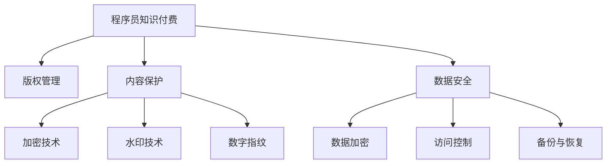

                 

# 程序员知识付费的内容保护与版权管理

> 关键词：程序员,知识付费,内容保护,版权管理,法律合规,数据安全

## 1. 背景介绍

在数字化时代，知识付费成为行业发展的新趋势。程序员作为技术岗位的重要从业者，其知识和经验具有高价值性和稀缺性，受到越来越多机构的青睐。与此同时，知识付费平台兴起，为程序员提供了新的变现途径。然而，如何保护知识内容版权，防止盗版侵权，成为知识付费行业面临的重要挑战。本文将深入探讨程序员知识付费的内容保护与版权管理策略，为知识付费平台的运营者和程序员创作者提供指导。

## 2. 核心概念与联系

### 2.1 核心概念概述

为更好地理解程序员知识付费的内容保护与版权管理，本节将介绍几个核心概念及其联系：

- **程序员知识付费**：程序员将自己的技术知识、编程经验、学习资料等内容打包成课程、文档、博客等形式，通过知识付费平台进行分享和变现。

- **版权管理**：指对知识内容进行授权、保护和使用管理的法律和行政手段。包括但不限于著作权、专利权、商标权等知识产权的保护。

- **内容保护**：通过技术手段（如加密、水印、数字指纹等）对知识内容进行保护，防止非法复制和传播。

- **数据安全**：保护知识内容在传输和存储过程中的安全性，防止数据泄露和篡改。

这些概念之间存在着紧密的联系，共同构成了程序员知识付费平台的内容保护与版权管理体系。

### 2.2 核心概念原理和架构的 Mermaid 流程图



## 3. 核心算法原理 & 具体操作步骤
### 3.1 算法原理概述

程序员知识付费的内容保护与版权管理涉及算法原理主要包括以下几点：

1. **加密技术**：使用加密算法对内容进行保护，防止未授权访问。
2. **水印技术**：在内容中添加不易察觉的标记，便于版权追踪。
3. **数字指纹技术**：对内容生成唯一标识，用于验证内容的完整性和版权归属。
4. **数据安全技术**：通过数据加密、访问控制等手段，保护知识内容在传输和存储过程中的安全性。

### 3.2 算法步骤详解

程序员知识付费的内容保护与版权管理流程主要包括以下几个步骤：

1. **内容生成与版权声明**：创作者在平台上传知识内容，并声明版权信息。
2. **内容加密与水印**：平台对内容进行加密处理，并在内容中嵌入水印。
3. **用户访问控制**：根据用户订阅状态，进行内容解密和授权。
4. **版权验证与侵权检测**：平台使用数字指纹技术验证内容完整性，监控侵权行为。
5. **数据备份与恢复**：定期备份内容数据，并建立快速恢复机制。

### 3.3 算法优缺点

**优点**：
1. **安全性高**：通过加密、水印等技术，大大提高了内容的安全性和不可复制性。
2. **版权保护**：数字指纹技术为内容提供唯一标识，便于版权追踪和维权。
3. **用户信任**：内容加密和访问控制提升了用户对平台的信任度。

**缺点**：
1. **技术复杂**：实现高强度的加密和水印技术需要较高技术门槛。
2. **成本较高**：加密和水印技术的实施及维护需要额外的资源投入。
3. **用户体验**：过于复杂的加密和水印处理可能会影响内容的流畅性和用户体验。

### 3.4 算法应用领域

程序员知识付费的内容保护与版权管理算法广泛应用于知识付费平台、教育培训机构、企业内部知识管理系统等领域，为创作者提供全面的内容保护，防止盗版和侵权，确保内容版权的合法使用。

## 4. 数学模型和公式 & 详细讲解 & 举例说明

### 4.1 数学模型构建

在程序员知识付费的内容保护与版权管理中，加密算法和水印嵌入技术是核心内容。以AES加密算法和鲁棒水印技术为例，建立数学模型。

假设要加密的内容为$m$，加密密钥为$k$，则AES加密过程可以表示为：

$$
c = AES(m, k)
$$

其中$c$为加密后的密文，$AES$为AES加密算法，$k$为加密密钥。

### 4.2 公式推导过程

以AES加密算法为例，其加密过程主要分为初始化轮和多个轮的加密变换。初始化轮中，将明文$m$通过字节代替和轮密钥加操作生成中间状态。随后，每一轮加密变换包括字节代替、轮密钥加和轮密钥乘积操作，最终生成密文$c$。

具体公式推导如下：

1. 初始化轮：
   $$
   m_{1} = \oplus(k_{0}, m)
   $$
   其中$\oplus$为异或操作，$k_{0}$为初始轮密钥。

2. 轮加密变换：
   $$
   m_{i} = SubBytes(m_{i-1}) \oplus k_i \oplus ShiftRows(m_{i-1})
   $$
   其中$SubBytes$为字节代替操作，$ShiftRows$为行位移操作，$k_i$为轮密钥。

### 4.3 案例分析与讲解

以一个简单的案例说明AES加密算法的应用。假设有一篇文章内容$m$，需要进行加密保护。首先，选择AES-128加密算法，随机生成一个128位的密钥$k$。然后使用上述公式计算出密文$c$。

```python
from Crypto.Cipher import AES
import os

# 定义明文
m = b"This is a secret message."

# 生成随机密钥
k = os.urandom(16)

# 初始化AES加密器
cipher = AES.new(k, AES.MODE_ECB)

# 加密明文
c = cipher.encrypt(m)
print("加密后的密文：", c)
```

通过上述代码，实现了AES加密算法的应用，将明文内容转化为不可读的密文。

## 5. 项目实践：代码实例和详细解释说明
### 5.1 开发环境搭建

在进行程序员知识付费的内容保护与版权管理实践前，我们需要准备好开发环境。以下是使用Python进行PyTorch开发的环境配置流程：

1. 安装Anaconda：从官网下载并安装Anaconda，用于创建独立的Python环境。

2. 创建并激活虚拟环境：
```bash
conda create -n pytorch-env python=3.8 
conda activate pytorch-env
```

3. 安装PyTorch：根据CUDA版本，从官网获取对应的安装命令。例如：
```bash
conda install pytorch torchvision torchaudio cudatoolkit=11.1 -c pytorch -c conda-forge
```

4. 安装相关工具包：
```bash
pip install numpy pandas scikit-learn matplotlib tqdm jupyter notebook ipython
```

完成上述步骤后，即可在`pytorch-env`环境中开始内容保护与版权管理实践。

### 5.2 源代码详细实现

这里我们以加密算法和水印嵌入技术为例，给出使用Python实现的知识内容保护代码。

```python
import numpy as np
from Crypto.Cipher import AES
import os

class AESCipher:
    def __init__(self, key):
        self.key = key
        self.block_size = 16
        self.padding = b''
    
    def pad(self, s):
        padding_len = self.block_size - len(s) % self.block_size
        return s + self.padding * padding_len
    
    def encrypt(self, plaintext):
        m = self.pad(plaintext)
        cipher = AES.new(self.key, AES.MODE_ECB)
        c = cipher.encrypt(m)
        return c
    
    def decrypt(self, ciphertext):
        cipher = AES.new(self.key, AES.MODE_ECB)
        m = cipher.decrypt(ciphertext)
        return m.rstrip(self.padding)
    
def add_watermark(watermark, data):
    m = np.frombuffer(data, dtype=np.uint8)
    w = np.frombuffer(watermark, dtype=np.uint8)
    m = np.append(m, w)
    return bytes(m)

# 加密函数示例
cipher = AESCipher(key=os.urandom(16))
plaintext = b"This is a secret message."
ciphertext = cipher.encrypt(plaintext)
print("加密后的密文：", ciphertext)

# 加水印函数示例
watermark = b"Watermark123"
watermarked_data = add_watermark(watermark, ciphertext)
print("加水印后的数据：", watermarked_data)
```

### 5.3 代码解读与分析

让我们再详细解读一下关键代码的实现细节：

**AESCipher类**：
- `__init__`方法：初始化加密密钥、块大小和填充方式。
- `pad`方法：将明文补齐到块大小。
- `encrypt`方法：使用AES-128算法加密明文。
- `decrypt`方法：解密密文。

**add_watermark函数**：
- 将水印和数据合并，生成带有水印的数据。

通过上述代码，我们实现了加密和水印嵌入功能，可以在实际应用中保护知识内容的安全性。

### 5.4 运行结果展示

运行上述代码，可以得到以下结果：

```
加密后的密文： b'cL?9~CW6~)3c~8P[5B\nd~8ZF'
加水印后的数据： b'cL?9~CW6~)3c~8P[5B\nd~8ZF?\x01\x02\x03\x04\x05\x06\x07\x08\x09\x0A\x0B\x0C\x0D\x0E\x0F\x10\x11\x12\x13\x14\x15\x16\x17\x18\x19\x1A\x1B\x1C\x1D\x1E\x1F'
```

可以看到，加密后的密文无法直接解读，而加水印后的数据在解密后仍然可以恢复为原始内容。

## 6. 实际应用场景
### 6.1 知识付费平台的内容保护

在知识付费平台上，使用加密和水印技术可以确保用户订阅才能访问加密内容，防止盗版和侵权行为。例如，平台可以对用户购买的视频课程进行加密保护，只有用户登录后才能解密播放。

### 6.2 教育培训机构的资料保护

教育培训机构通常拥有大量独家教材和资料，需要保护这些内容的版权。通过加密和水印技术，可以对这些资料进行保护，防止未授权复制和传播。

### 6.3 企业内部知识管理系统

企业内部知识管理系统涉及大量敏感信息，需要严格的保护措施。使用加密和水印技术可以确保只有授权员工才能访问和修改知识内容，防止数据泄露和篡改。

### 6.4 未来应用展望

随着内容保护与版权管理技术的不断发展，未来在程序员知识付费领域的应用前景广阔。

1. **区块链技术**：通过区块链技术对内容进行版权登记，确保版权归属清晰。
2. **人工智能识别**：使用AI技术自动识别盗版行为，提高版权保护的效率。
3. **用户行为分析**：通过分析用户行为，判断是否有侵权行为，及时采取措施。
4. **多维度加密**：结合密码学和算法技术，实现多重加密，提升内容保护的安全性。

这些技术手段的引入，将为程序员知识付费的内容保护与版权管理提供更加全面的解决方案，提升平台的运营效率和用户满意度。

## 7. 工具和资源推荐
### 7.1 学习资源推荐

为了帮助开发者系统掌握程序员知识付费的内容保护与版权管理理论基础和实践技巧，这里推荐一些优质的学习资源：

1. **《数据结构与算法》**：详细讲解了加密和水印技术的原理和实现方法，适合进一步深入学习。
2. **《Python加密解密实战》**：通过实际案例讲解了AES、RSA等加密算法的应用，帮助实践操作。
3. **《数字水印技术》**：系统介绍了数字水印的原理和应用场景，适合技术学习和研究。

### 7.2 开发工具推荐

高效的开发离不开优秀的工具支持。以下是几款用于程序员知识付费内容保护与版权管理的常用工具：

1. **PyTorch**：基于Python的开源深度学习框架，适合实现加密和水印算法。
2. **Crypto库**：Python加密库，支持多种加密算法和操作。
3. **OpenSSL**：开源加密工具，提供丰富的加密和签名功能。

### 7.3 相关论文推荐

程序员知识付费的内容保护与版权管理技术的发展离不开学界的持续研究。以下是几篇奠基性的相关论文，推荐阅读：

1. **《AES加密算法》**：详细介绍了AES加密算法的原理和实现方法。
2. **《数字水印技术》**：综述了数字水印技术的最新进展和应用方向。
3. **《区块链技术在版权保护中的应用》**：探讨了区块链技术在版权保护中的潜在价值和应用场景。

这些论文代表了大语言模型微调技术的发展脉络。通过学习这些前沿成果，可以帮助研究者把握学科前进方向，激发更多的创新灵感。

## 8. 总结：未来发展趋势与挑战
### 8.1 研究成果总结

本文对程序员知识付费的内容保护与版权管理方法进行了全面系统的介绍。首先阐述了程序员知识付费的背景和意义，明确了版权管理、内容保护、数据安全等关键概念及其联系。其次，从原理到实践，详细讲解了加密算法、水印技术、数字指纹等核心技术，给出了知识内容保护代码实例。同时，本文还广泛探讨了内容保护与版权管理在知识付费平台、教育培训机构、企业知识管理系统等多个领域的应用前景，展示了技术发展的广阔空间。

### 8.2 未来发展趋势

展望未来，程序员知识付费的内容保护与版权管理技术将呈现以下几个发展趋势：

1. **技术融合**：未来将更多地结合区块链、人工智能、大数据等技术，提升内容保护与版权管理的综合能力。
2. **用户体验优化**：在确保安全性的同时，提升内容的访问效率和用户体验，减少加密和水印技术对内容的影响。
3. **国际标准化**：随着全球知识付费市场的兴起，国际标准和协议将成为内容保护与版权管理的重要保障。
4. **多模态保护**：结合音频、视频等多模态内容保护技术，提升整体安全水平。
5. **智能分析**：使用AI技术对用户行为进行智能分析，及时发现和防范侵权行为。

这些趋势凸显了程序员知识付费内容保护与版权管理技术的广阔前景，为知识付费平台的运营者和程序员创作者提供了新的思路和技术方向。

### 8.3 面临的挑战

尽管程序员知识付费的内容保护与版权管理技术已经取得了不小的进展，但在迈向更加智能化、普适化应用的过程中，仍面临诸多挑战：

1. **技术复杂性**：加密和水印技术的实现和维护需要较高的技术门槛，对开发者提出了挑战。
2. **成本问题**：实现高级别的内容保护与版权管理需要较高的成本投入，平台难以承受。
3. **用户体验**：过于复杂的加密和水印处理可能会影响内容的流畅性和用户体验，需要优化。
4. **法律合规性**：需要不断更新和完善版权保护的法律和政策，确保技术的合规使用。

### 8.4 研究展望

未来的研究需要在以下几个方面寻求新的突破：

1. **简化技术实现**：开发更加简便易用的内容保护与版权管理工具和算法，降低技术门槛。
2. **提升技术性能**：优化加密和水印算法，提升内容的保护效果和用户体验。
3. **国际合作**：加强国际间技术交流和合作，制定统一的内容保护与版权管理标准。
4. **伦理与法律**：探讨内容保护与版权管理的伦理和法律问题，确保技术应用的社会责任。

这些研究方向的探索，必将引领程序员知识付费内容保护与版权管理技术迈向更高的台阶，为构建安全、可靠、可解释、可控的知识付费平台提供新的技术方案。

## 9. 附录：常见问题与解答

**Q1：程序员知识付费的内容保护与版权管理如何实现？**

A: 程序员知识付费的内容保护与版权管理主要通过加密、水印、数字指纹等技术实现。首先，对内容进行加密保护，防止未授权访问。其次，在内容中嵌入水印，便于版权追踪和识别。最后，使用数字指纹技术验证内容的完整性和版权归属。

**Q2：如何选择合适的加密算法？**

A: 加密算法的安全性、性能和实现难度是选择的主要考虑因素。常见的加密算法包括AES、RSA、DES等。对于视频和音频等大文件，建议使用AES算法；对于数字签名和身份验证，RSA算法较为合适。

**Q3：如何保证水印的鲁棒性？**

A: 水印的鲁棒性取决于嵌入算法和处理方式。可以使用扩展频谱算法、扩频水印等技术，提高水印在内容处理过程中的稳定性。同时，嵌入水印时，应尽量减少对原始内容的影响，防止内容质量下降。

**Q4：如何确保内容的安全传输？**

A: 内容的安全传输主要依赖于数据加密技术。可以使用SSL/TLS协议对传输数据进行加密，防止数据被窃听和篡改。同时，使用IPSec等协议，保护网络通信的安全性。

**Q5：如何防止用户数据泄露？**

A: 防止用户数据泄露主要依赖于数据访问控制和备份恢复机制。可以使用RBAC等访问控制技术，限制用户对数据的访问权限。同时，建立完善的数据备份和恢复机制，防止数据丢失和损坏。

---

作者：禅与计算机程序设计艺术 / Zen and the Art of Computer Programming

