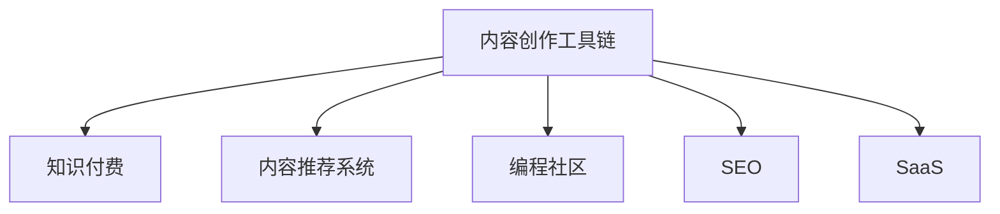

                 

# 程序员知识付费的内容创作工具链

## 1. 背景介绍

随着互联网经济的发展，内容付费逐渐成为新的盈利模式。程序员作为技术知识的重要生产者和消费者，对高质量技术内容的需求日益增长。因此，工具链的发展与程序员内容创作息息相关。本文章将围绕程序员知识付费的内容创作工具链展开详细探讨。

## 2. 核心概念与联系

### 2.1 核心概念概述

在进行深入讨论之前，首先要明确几个核心概念及其相互之间的联系：

- **内容创作工具链**：由多个软件工具组成的流水线，用于从内容构思、编写、编辑、发布到推广的一体化工作流程。
- **知识付费**：用户为获取特定知识和信息而支付费用的商业模式，其目的是获得深度、全面、定制化的技术内容。
- **内容推荐系统**：通过分析用户行为数据，推荐相关内容的技术系统。其目的是提升用户满意度和留存率，增加内容付费收入。
- **编程社区**：程序员知识共享和协作的平台，如GitHub、Stack Overflow等。内容创作工具链可以与之无缝集成，共同为程序员提供一站式创作体验。
- **SEO（搜索引擎优化）**：通过优化网站结构和内容，提升在搜索引擎中的排名，吸引更多的流量和用户。
- **SaaS（软件即服务）**：云计算技术，通过在线平台提供软件应用，方便用户按需使用。

### 2.2 核心概念原理和架构的 Mermaid 流程图



上述流程图示意了内容创作工具链与知识付费、内容推荐系统、编程社区、SEO和SaaS之间的联系和作用。

## 3. 核心算法原理 & 具体操作步骤

### 3.1 算法原理概述

内容创作工具链的算法原理涉及自然语言处理、数据挖掘、机器学习等多个领域。以推荐系统为例，其核心在于利用协同过滤、内容过滤等算法，根据用户历史行为数据，预测其可能感兴趣的内容。

### 3.2 算法步骤详解

1. **用户行为数据收集**：通过浏览器cookie、用户行为日志等方式收集用户的浏览、点击、购买行为数据。
2. **数据预处理**：清洗、整合、归一化用户行为数据，生成用户行为矩阵和物品特征矩阵。
3. **模型训练**：使用协同过滤、内容过滤等算法，训练推荐模型。
4. **预测和推荐**：基于训练好的模型，对新用户进行内容推荐。
5. **模型评估和优化**：通过A/B测试、离线评估等方法，不断优化推荐算法，提升推荐效果。

### 3.3 算法优缺点

优点：
- 用户兴趣预测准确性高，能够提供个性化的内容推荐。
- 通过大数据分析，发现用户行为模式，提升内容付费转化率。
- 能够实时处理和推荐，保持内容的实时性和新鲜性。

缺点：
- 需要大规模用户数据，隐私问题较为突出。
- 推荐算法可能存在冷启动问题，新用户难以获得有效推荐。
- 推荐结果可能会受到数据噪声和偏见的影响。

### 3.4 算法应用领域

推荐算法广泛应用于电商、新闻、视频等多个领域，其中程序员知识付费领域也有着广泛的应用：
- 开发者社区的课程和文章推荐。
- 技术论坛、博客站点的文章和视频推荐。
- 在线编程课程和直播推荐。
- 技术问答和咨询的推荐。

## 4. 数学模型和公式 & 详细讲解 & 举例说明

### 4.1 数学模型构建

推荐系统的数学模型通常基于矩阵分解、协同过滤、深度学习等方法。以协同过滤为例，假设用户行为矩阵为 $U \times N$ 的稀疏矩阵，其中 $U$ 为用户数量，$N$ 为物品数量。推荐矩阵 $P$ 的每个元素 $p_{ui}$ 表示用户 $u$ 对物品 $i$ 的预测评分。协同过滤的目标是最大化用户满意度，即：

$$
\max_{P} \sum_{u,i} \text{Precision}(u,i) \times \text{Recall}(u,i) - \lambda \times ||P||^2
$$

其中 $\text{Precision}$ 和 $\text{Recall}$ 为模型评估指标，$\lambda$ 为正则化参数。

### 4.2 公式推导过程

协同过滤模型的推导过程涉及矩阵分解和特征矩阵计算，其关键在于求解推荐矩阵 $P$ 的分解：

$$
P \approx UV^T
$$

其中 $V$ 为物品特征矩阵。求解该分解问题通常使用奇异值分解（SVD）算法。

### 4.3 案例分析与讲解

以YouTube推荐系统为例，其采用协同过滤算法，根据用户历史观看行为，推荐相关视频内容。系统通过实时分析用户的行为数据，每5秒钟更新推荐结果，确保用户获取最新、最相关的视频内容。

## 5. 项目实践：代码实例和详细解释说明

### 5.1 开发环境搭建

开发内容创作工具链通常需要以下环境：

1. 安装Python环境：使用Anaconda、Miniconda等工具搭建虚拟环境。
2. 安装必要的库：如TensorFlow、PyTorch、Scikit-learn等深度学习框架。
3. 搭建服务器环境：使用云服务如AWS、GCP等搭建高性能服务器，安装Redis、Nginx等组件。

### 5.2 源代码详细实现

以下是一个简单的推荐系统示例代码，基于Python的Scikit-learn库实现协同过滤算法：

```python
from sklearn.decomposition import TruncatedSVD
from sklearn.metrics.pairwise import cosine_similarity

# 用户行为矩阵
U = np.random.randn(1000, 10000)
N = np.random.randn(10000, 1000)
P = np.dot(U, N.T)

# 分解推荐矩阵
svd = TruncatedSVD(n_components=50)
P_hat = svd.fit_transform(P)

# 计算相似度
U_hat = svd.components_
V_hat = svd.transform(N)

# 预测用户评分
user1 = np.array([1.0, 0.0, 1.0])
scores = cosine_similarity(user1.reshape(1, -1), V_hat)
prediction = np.dot(U_hat, scores.T)

print(prediction)
```

### 5.3 代码解读与分析

上述代码首先生成用户行为矩阵 $U \times N$，然后使用TruncatedSVD算法对推荐矩阵进行分解。最后，使用余弦相似度计算用户对物品的预测评分。

## 6. 实际应用场景

### 6.1 内容创作平台

内容创作平台如CSDN、博客园等，采用推荐系统对程序员的文章和课程进行推荐。用户登录后，系统会根据其历史行为和偏好，推荐相关内容和课程。

### 6.2 开发者社区

开发者社区如GitHub、Stack Overflow等，可以借助推荐系统提高社区内容的可见性和互动性。例如，GitHub可以推荐最受欢迎的项目和代码片段，提升用户的活跃度和参与度。

### 6.3 知识付费平台

知识付费平台如掘金、雪球等，通过推荐系统，将付费文章、课程、咨询等内容推荐给目标用户，提高内容消费量。

## 7. 工具和资源推荐

### 7.1 学习资源推荐

为了深入学习内容创作工具链的相关知识，推荐以下学习资源：

1. **Coursera上的机器学习课程**：由斯坦福大学的Andrew Ng教授讲授，涵盖了机器学习的基础和高级内容。
2. **Kaggle**：数据科学和机器学习竞赛平台，提供大量实战项目和数据集。
3. **DeepLearning.AI（深度学习研究院）**：由吴恩达教授创办，提供深度学习相关课程和资源。
4. **PyTorch官方文档**：深度学习框架PyTorch的官方文档，详细介绍了框架的使用和应用。
5. **TensorFlow官方文档**：另一主流深度学习框架TensorFlow的官方文档，提供丰富的模型和工具库。

### 7.2 开发工具推荐

1. **Python**：当前最流行的编程语言之一，适合数据科学和机器学习任务。
2. **TensorFlow和PyTorch**：主流深度学习框架，提供高效的计算图和自动微分功能。
3. **Jupyter Notebook**：交互式编程环境，支持多种语言和库，适合数据分析和模型开发。
4. **Flask和Django**：流行的Web框架，适合搭建内容推荐系统的Web服务。
5. **Redis**：高性能内存数据库，适合存储用户行为数据和推荐模型。
6. **Nginx**：轻量级Web服务器，适合内容推荐系统的负载均衡和反向代理。

### 7.3 相关论文推荐

1. **《推荐系统算法》**：一部详细介绍协同过滤、内容过滤、混合推荐等推荐算法的经典书籍。
2. **《深度学习》**：深度学习领域的经典教材，涵盖深度学习的基础和应用。
3. **《搜索引擎优化（SEO）指南》**：详细介绍了SEO原理和实践，适合内容创作者和SEO工程师。
4. **《程序员知识付费研究》**：探讨程序员知识付费的现状、问题和未来趋势的论文。

## 8. 总结：未来发展趋势与挑战

### 8.1 研究成果总结

内容创作工具链和大数据推荐系统，已经在多个领域展示了强大的应用能力。通过用户行为数据分析，推荐系统能够提供个性化的内容推荐，提升用户体验和满意度。

### 8.2 未来发展趋势

1. **智能推荐算法**：未来的推荐系统将引入更多智能算法，如深度学习、自然语言处理等，提升推荐效果。
2. **多模态推荐**：推荐系统将集成多种数据源和模态信息，如文本、图像、音频等，提供更加丰富和准确的内容推荐。
3. **用户隐私保护**：随着数据隐私法规的加强，推荐系统将更多地采用匿名化和差分隐私技术，保护用户隐私。
4. **实时性和可扩展性**：未来的推荐系统将具备更高的实时性和可扩展性，支持海量用户和大规模数据处理。
5. **模型解释性**：推荐模型将引入更多的可解释性技术，如LIME、SHAP等，帮助用户理解推荐结果的依据。

### 8.3 面临的挑战

1. **数据隐私和安全**：推荐系统需要处理大量用户数据，数据隐私和安全问题尤为突出。
2. **算法偏见**：推荐算法可能存在性别、种族等偏见，需要更多的公平性分析和管理。
3. **冷启动问题**：新用户难以获得有效的推荐，需要更多的策略解决。
4. **数据噪声和偏差**：推荐结果可能受到数据噪声和偏差的影响，需要更多的数据清洗和预处理。

### 8.4 研究展望

1. **推荐算法优化**：开发更加高效、公平、可解释的推荐算法。
2. **用户行为建模**：深入研究用户行为和心理模型，提升推荐精准度。
3. **推荐系统评估**：引入更多评估指标和实验方法，全面评估推荐效果。
4. **跨平台协同推荐**：构建跨平台推荐系统，提高用户覆盖面和推荐多样性。

总之，内容创作工具链和大数据推荐系统将成为程序员知识付费的核心技术支撑，其应用前景广阔。未来，随着技术的不断进步，推荐系统将更加智能、高效、安全，成为程序员获取高质量技术内容的必备工具。

## 9. 附录：常见问题与解答

**Q1：程序员知识付费的价值何在？**

A: 程序员知识付费的价值在于提供深度、全面、定制化的技术内容，帮助程序员提升技能和解决实际问题。相比免费内容，付费内容通常具有更高的质量和可靠性。

**Q2：内容创作工具链中，推荐算法的重要性何在？**

A: 推荐算法是内容创作工具链的核心，决定了内容的个性化和精准度。通过算法优化，可以显著提升用户的满意度和留存率，增加内容付费收入。

**Q3：如何构建高效的内容推荐系统？**

A: 构建高效的内容推荐系统需要：
1. 选择合适的推荐算法，如协同过滤、内容过滤等。
2. 收集和清洗用户行为数据，生成用户行为矩阵和物品特征矩阵。
3. 使用机器学习算法训练推荐模型，不断优化模型参数和评估指标。
4. 实时更新推荐结果，确保内容的实时性和新鲜性。

**Q4：如何处理内容推荐中的冷启动问题？**

A: 冷启动问题是推荐系统面临的主要挑战之一。解决冷启动问题的方法包括：
1. 使用用户兴趣声明和社交网络信息，快速获取新用户的兴趣。
2. 引入专家推荐和人工推荐，帮助新用户快速获得相关内容。
3. 使用强化学习算法，通过交互反馈逐步优化推荐策略。

**Q5：内容推荐系统中的公平性问题如何解决？**

A: 内容推荐系统中的公平性问题可以通过以下方法解决：
1. 引入公平性评估指标，如性别、种族、年龄等。
2. 在推荐模型中加入公平性约束，避免偏见和歧视。
3. 使用多样性增强技术，如反偏见采样、多样性惩罚等，提升推荐公平性。

通过上述问题的解答，可以更全面地理解内容创作工具链和大数据推荐系统的工作原理和应用场景。总之，随着技术的不断进步，内容推荐系统将更加智能和高效，为程序员知识付费带来更大的价值。

---

作者：禅与计算机程序设计艺术 / Zen and the Art of Computer Programming

