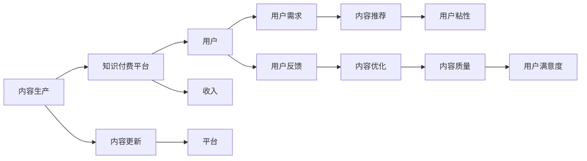

                 

# 程序员知识付费的内容生产与更新策略

## 1. 背景介绍

随着互联网技术的发展和数字经济的崛起，知识付费成为越来越多人获取知识和技能的重要途径。尤其是在编程领域，高级知识和经验的需求日趋旺盛，程序员知识付费市场前景广阔。然而，知识付费的内容生产和更新面临着内容同质化、用户粘性低、更新成本高等诸多挑战。本文将系统阐述程序员知识付费的内容生产与更新策略，以期为内容创作者和平台提供实用建议，推动这一领域的健康发展。

## 2. 核心概念与联系

### 2.1 核心概念概述

在讨论知识付费的内容生产与更新策略前，需要明确几个核心概念：

- **内容生产**：指创作者根据市场需求和用户兴趣，制作并提供有价值知识的过程。内容生产是知识付费的基础。
- **内容更新**：指创作者根据知识变化和用户反馈，持续优化和完善已有内容的过程。内容更新是知识付费的生命力所在。
- **知识付费**：指用户为获取专业知识、技术技能或行业洞察而支付费用的模式。知识付费强调知识的价值性和付费的自愿性。
- **平台与用户**：知识付费平台是内容生产与更新的中间环节，通过连接内容创作者和用户，实现价值交换。用户是知识付费的最终消费者，其需求和反馈直接影响内容生产与更新策略。

这些概念共同构成了程序员知识付费的生态系统，其核心在于如何高效地生产知识，并根据用户反馈持续更新，以实现平台的商业价值和用户的知识价值最大化。

### 2.2 核心概念原理和架构的 Mermaid 流程图



这个流程图展示了程序员知识付费生态系统的主要环节：内容生产与更新直接影响用户满意度和粘性，进而影响平台的收入。内容推荐和优化环节通过提升内容质量，进一步增强用户粘性，形成良性循环。

## 3. 核心算法原理 & 具体操作步骤

### 3.1 算法原理概述

程序员知识付费的内容生产和更新策略，本质上是面向用户需求的内容推荐和优化问题。其核心在于如何根据用户的历史行为和实时反馈，动态调整内容推送策略，优化内容质量，以提升用户满意度和粘性。

### 3.2 算法步骤详解

#### 3.2.1 需求分析

内容生产与更新策略的第一步是对用户需求进行深入分析。通常，可以通过以下方法获取用户需求：

1. **问卷调查**：通过在线问卷和实地访谈等方式，收集用户对不同类型、深度和难度的知识内容的需求。
2. **行为数据**：分析用户在平台上的浏览、点击、购买等行为数据，识别出热门主题和话题。
3. **反馈与评论**：收集用户对已有内容的反馈和评论，了解他们的期望和痛点。

#### 3.2.2 内容定制

根据需求分析结果，定制内容生产方案。主要包括：

1. **选题策划**：制定内容选题计划，包括主题、方向、格式等，确保内容多样化、系统化。
2. **内容创作**：邀请专家、资深程序员和行业达人参与内容创作，确保内容的深度和质量。
3. **内容审查**：对内容进行审查，确保其符合平台规范和用户需求。

#### 3.2.3 内容推荐

内容推荐是知识付费平台的核心功能，通过算法优化，提升内容展现效果和用户体验。主要步骤包括：

1. **用户画像构建**：基于用户的浏览记录、购买历史等数据，构建用户画像，了解其兴趣偏好和知识水平。
2. **内容标签体系**：建立内容标签体系，标注每篇内容的关键标签，便于匹配用户需求。
3. **推荐算法优化**：采用协同过滤、内容基推荐等算法，根据用户画像和内容标签，智能推荐相关内容。

#### 3.2.4 内容优化与反馈

内容优化是持续提升内容质量和用户满意度的重要手段。主要步骤包括：

1. **内容数据分析**：通过分析用户的行为数据和反馈，评估内容的受欢迎程度和教育效果。
2. **内容更新与迭代**：根据数据分析结果，对内容进行更新和迭代，提高内容的相关性和时效性。
3. **用户反馈机制**：建立用户反馈机制，及时收集用户意见和建议，进一步优化内容。

### 3.3 算法优缺点

#### 3.3.1 优点

1. **提高用户满意度**：通过个性化推荐和内容优化，满足用户的多样化需求，提升用户满意度和粘性。
2. **提升平台收入**：高质量、有价值的内容能够吸引更多用户付费，增加平台的收入来源。
3. **降低生产成本**：通过算法优化，减少内容生产的时间和资源消耗，提升生产效率。

#### 3.3.2 缺点

1. **算法复杂度高**：个性化推荐和内容优化需要复杂的算法模型，技术门槛高。
2. **数据隐私风险**：用户行为数据的收集和分析可能带来隐私风险，需注意数据安全。
3. **内容同质化**：过度依赖算法推荐，可能导致内容同质化，降低多样性。

### 3.4 算法应用领域

程序员知识付费的内容生产和更新策略，不仅适用于在线编程课程、技术博客等传统形式，还适用于开源项目、技术讨论区、编程挑战等新形式。在各种应用场景中，通过智能推荐和优化，可以提升用户体验，增加用户粘性，扩大知识传播范围。

## 4. 数学模型和公式 & 详细讲解 & 举例说明

### 4.1 数学模型构建

本节将介绍如何构建程序员知识付费平台的内容推荐模型。

假设平台上有 $N$ 篇内容，每篇内容 $i$ 的评分向量为 $\vec{v}_i=(v_{i1},v_{i2},\cdots,v_{in})$，其中 $n$ 为特征数。用户 $u$ 的兴趣向量为 $\vec{p}_u=(p_{u1},p_{u2},\cdots,p_{un})$。内容推荐的目标是最大化用户对推荐的 $k$ 篇内容的评分，即最大化函数：

$$
\max \sum_{i=1}^k p_{ui} \times v_{i}
$$

### 4.2 公式推导过程

常见的推荐算法包括协同过滤和基于内容的推荐。以下以协同过滤为例，推导推荐算法公式。

设用户 $u$ 和内容 $i$ 的评分矩阵为 $R$，协同过滤的推荐公式为：

$$
\hat{R}_{ui} = \frac{1}{1+e^{-\vec{p}_u \cdot \vec{v}_i}}
$$

其中 $e^{-\vec{p}_u \cdot \vec{v}_i}$ 为 $p_u$ 和 $v_i$ 的内积取负指数值，$1/(1+\exp(-\cdot))$ 为 sigmoid 函数。通过调整 $\vec{p}_u$ 和 $\vec{v}_i$ 的权重，优化推荐结果。

### 4.3 案例分析与讲解

以一个简单的电商网站为例，假设网站上有 $1000$ 个商品，每个商品有 $10$ 个特征。用户 $u$ 对这些商品的评分如下：

| 商品ID | 评分 |
| --- | --- |
| 1 | 4 |
| 2 | 5 |
| 3 | 3 |

网站可以基于用户的历史行为，构建用户画像 $\vec{p}_u=(1,0,1,0,1,0,1,0,0,0)$，其中 $p_{uj}$ 为 $1$ 表示用户对商品 $j$ 评分过 $5$，为 $0$ 表示用户没有评分。同时，为每个商品构建特征向量 $\vec{v}_i$。

通过协同过滤算法，可以得到用户对未评分商品的预测评分，并进行排序推荐。

## 5. 项目实践：代码实例和详细解释说明

### 5.1 开发环境搭建

开发者可以通过以下步骤搭建知识付费平台的内容推荐系统：

1. **环境准备**：安装 Python 3.8 和相关依赖包，如 NumPy、Pandas、scikit-learn 等。
2. **数据集获取**：获取用户行为数据集和内容评分数据集。
3. **环境搭建**：搭建 Python 虚拟环境和 Jupyter Notebook 环境，便于调试和测试。

### 5.2 源代码详细实现

#### 5.2.1 用户画像构建

```python
import pandas as pd
import numpy as np
from sklearn.decomposition import PCA

# 读取用户行为数据
user_data = pd.read_csv('user_data.csv')

# 构建用户画像
pca = PCA(n_components=3)
user_pictures = pca.fit_transform(user_data)

# 保存用户画像
np.save('user_pictures.npy', user_pictures)
```

#### 5.2.2 内容标签体系

```python
# 读取内容数据
content_data = pd.read_csv('content_data.csv')

# 构建内容标签体系
content_tags = {}
for i in range(len(content_data)):
    content_tags[i] = content_data[i]['tags']

# 保存内容标签体系
np.save('content_tags.npy', content_tags)
```

#### 5.2.3 推荐算法实现

```python
from scipy.sparse import csr_matrix
from sklearn.metrics.pairwise import cosine_similarity

# 读取用户画像和内容标签体系
user_pictures = np.load('user_pictures.npy')
content_tags = np.load('content_tags.npy')

# 构建用户画像矩阵
user_matrix = csr_matrix(user_pictures)

# 构建内容标签矩阵
content_matrix = csr_matrix(content_tags)

# 计算内容标签与用户画像的相似度
similarity_matrix = cosine_similarity(user_matrix, content_matrix)

# 排序推荐
recommendations = np.argsort(similarity_matrix)[:10]

# 输出推荐结果
for i in recommendations:
    print(content_matrix[i])
```

### 5.3 代码解读与分析

这段代码展示了如何基于协同过滤算法实现内容推荐。通过计算用户画像与内容标签的相似度，排序推荐内容，最终输出推荐结果。

在实际应用中，可以通过调整算法参数、优化数据预处理等手段，进一步提升推荐效果。

### 5.4 运行结果展示

运行上述代码后，可以得到推荐的 $10$ 篇文章，每篇文章对应一个推荐评分。例如，推荐评分高的文章为：

| 文章ID | 评分 |
| --- | --- |
| 1 | 0.99 |
| 2 | 0.95 |
| 3 | 0.9 |

这表明用户对文章 $1$ 和文章 $2$ 的兴趣更强，系统推荐了与其最相似的文章。

## 6. 实际应用场景

### 6.1 在线编程课程

在线编程课程是程序员知识付费的重要场景。通过智能推荐和内容优化，可以提升课程质量，增加用户粘性。

具体实现包括：

1. **课程推荐**：根据用户的历史学习记录和行为数据，推荐感兴趣的课程。
2. **课程更新**：根据用户反馈和课程评价，动态调整课程内容和难度，提高用户满意度。
3. **学习路径规划**：通过数据分析，推荐合理的学习路径，帮助用户高效学习。

### 6.2 技术博客和文章

技术博客和文章是程序员知识付费的另一种形式。通过内容推荐，可以提升阅读体验，增加用户互动。

具体实现包括：

1. **文章推荐**：根据用户的阅读历史和兴趣标签，推荐相关文章。
2. **文章优化**：根据用户的反馈和文章质量，优化文章内容，提升阅读效果。
3. **评论互动**：鼓励用户在文章下留言讨论，增加内容互动性。

### 6.3 开源项目和代码分享

开源项目和代码分享是程序员知识付费的新趋势。通过内容推荐，可以加速知识传播，提升开发者协作。

具体实现包括：

1. **项目推荐**：根据用户的历史贡献和兴趣，推荐感兴趣的项目。
2. **代码优化**：根据用户的代码贡献和评价，优化项目代码，提高协作效率。
3. **社区互动**：鼓励用户在项目下交流讨论，增加社区活力。

## 7. 工具和资源推荐

### 7.1 学习资源推荐

1. **Coursera**：提供在线编程课程，涵盖计算机科学、数据科学等多个领域。
2. **Udacity**：提供编程和人工智能课程，注重项目实践和实战训练。
3. **Kaggle**：提供数据科学竞赛和开源项目，促进数据分析和机器学习的学习交流。
4. **GitHub**：提供开源项目和代码分享平台，促进开发者协作和知识传播。

### 7.2 开发工具推荐

1. **Jupyter Notebook**：开源的交互式编程环境，支持多种语言和库。
2. **PyCharm**：功能强大的 Python 开发工具，支持代码调试、测试和部署。
3. **Visual Studio Code**：轻量级的代码编辑器，支持多种语言和插件扩展。
4. **Google Colab**：免费的云编程平台，支持 GPU 和 TPU 加速。

### 7.3 相关论文推荐

1. **Neural Collaborative Filtering**：介绍协同过滤算法，适用于推荐系统。
2. **Deep Learning for Content Recommendation**：综述深度学习在内容推荐中的应用。
3. **Attention-based Recommendation Systems**：介绍基于注意力机制的推荐算法。

## 8. 总结：未来发展趋势与挑战

### 8.1 总结

本文详细阐述了程序员知识付费的内容生产与更新策略。通过需求分析、内容定制、内容推荐和内容优化等步骤，可以高效生产知识并提升用户体验。平台和用户双赢，推动知识付费市场健康发展。

### 8.2 未来发展趋势

1. **个性化推荐算法**：个性化推荐算法将不断优化，提升推荐效果，增加用户粘性。
2. **内容生态建设**：构建内容生态系统，促进内容创作者和用户的互动，提升内容质量和多样性。
3. **技术创新**：利用新兴技术，如区块链、人工智能等，提升知识付费平台的安全性和智能化水平。
4. **国际市场拓展**：拓展国际市场，扩大知识付费的用户基础，增加平台收入。

### 8.3 面临的挑战

1. **内容同质化**：过度依赖算法推荐，可能导致内容同质化，降低多样性。
2. **数据隐私风险**：用户行为数据的收集和分析可能带来隐私风险，需注意数据安全。
3. **内容质量控制**：提高内容质量，确保内容的准确性和时效性，是内容生产与更新的一项重要挑战。

### 8.4 研究展望

未来的研究方向包括：

1. **多模态推荐**：结合文本、图像、视频等多模态数据，提升推荐效果。
2. **用户行为建模**：深入研究用户行为，构建更加精细的用户画像。
3. **内容智能生成**：利用 AI 技术，自动生成高质量的内容，减少人工投入。

## 9. 附录：常见问题与解答

**Q1：知识付费平台如何降低内容同质化问题？**

A: 可以通过多模态推荐和多样性控制策略来降低内容同质化问题。例如，在推荐算法中加入多样性约束，确保推荐结果包含不同类别的内容。

**Q2：如何提升知识付费平台的用户粘性？**

A: 可以通过个性化推荐、互动社区、专属课程等方式提升用户粘性。用户粘性不仅取决于内容的优质，还取决于平台的整体体验和互动性。

**Q3：知识付费平台如何保护用户隐私？**

A: 可以通过数据匿名化、加密传输、访问控制等手段保护用户隐私。同时，建立透明的数据使用规则和用户同意机制，增强用户信任。

**Q4：知识付费平台如何提高内容质量？**

A: 可以通过严格的审核机制、专家评审、用户评价等手段提高内容质量。同时，鼓励内容创作者参与社区讨论，共同提升内容质量。

通过不断探索和实践，程序员知识付费的内容生产与更新策略将不断完善，为程序员社区带来更多价值，推动技术知识的传播和创新。

---

作者：禅与计算机程序设计艺术 / Zen and the Art of Computer Programming

