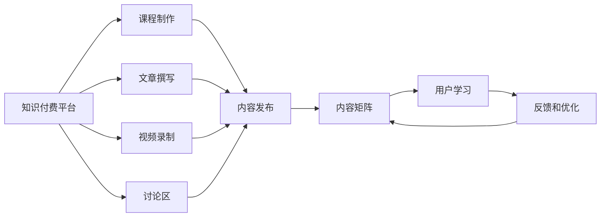

                 

# 程序员知识付费的内容矩阵构建

> 关键词：知识付费,内容矩阵,程序员培训,技能提升,市场调研,技术课程,用户需求,推荐算法,内容优化

## 1. 背景介绍

在数字化经济和信息爆炸的时代背景下，知识付费成为了一种新的学习方式。对于程序员而言，持续的学习和技能提升是他们职业发展的关键。然而，传统的学习模式往往存在内容杂乱、互动性差、缺乏个性化等问题。知识付费平台的出现，为程序员提供了一种高效、个性化、互动性强的学习方式。本文将系统探讨程序员知识付费的内容矩阵构建，分析其核心概念、关键步骤、优缺点及应用领域，并给出实际案例和未来发展趋势。

## 2. 核心概念与联系

### 2.1 核心概念概述

构建程序员知识付费的内容矩阵，是指通过对知识付费平台的课程、文章、视频、讨论等内容的分析和优化，构建一个多维度、多层次的内容体系，以更好地满足程序员的学习需求。具体来说，包括以下几个核心概念：

- **知识付费平台**：以内容订阅、按需购买等方式提供高质量教育资源的平台。
- **内容矩阵**：将各种内容形式组织成矩阵结构，通过不同维度的交叉组合，形成多样化的学习资源。
- **程序员技能提升**：通过各类学习资源，帮助程序员掌握新的编程语言、框架、工具等技能，提高工作效率和竞争力。
- **个性化学习**：根据用户的学习历史、行为偏好等数据，推荐个性化的学习内容，提升学习效果。
- **市场调研**：通过对程序员职业发展趋势、技术需求等进行分析，指导内容矩阵的构建和优化。

### 2.2 核心概念原理和架构的 Mermaid 流程图



这个流程图展示了知识付费平台与课程、文章、视频、讨论区等内容的关联关系，以及内容矩阵如何形成和优化，最终服务于用户学习的过程。

## 3. 核心算法原理 & 具体操作步骤

### 3.1 算法原理概述

构建程序员知识付费的内容矩阵，核心在于通过数据分析、机器学习等技术手段，对课程、文章、视频等不同形式的内容进行优化组合，形成具有层次性、结构性和个性化特征的内容体系。这涉及多个维度的交叉和组合，包括时间维度（课程阶段）、深度维度（课程难度）、领域维度（技术栈）等。

### 3.2 算法步骤详解

1. **市场调研**：
   - 分析程序员的职业发展路径和技能需求，了解不同阶段、不同领域的技术趋势。
   - 收集用户反馈，确定最受欢迎的技术栈和课程类型。

2. **内容制作**：
   - 根据调研结果，设计课程大纲，邀请行业专家进行课程制作。
   - 撰写高质量的文章，提供实战案例和技术解析。
   - 录制高质量的视频，确保讲解清晰、生动。
   - 在讨论区组织技术讨论和案例分析，增强互动性。

3. **内容发布与更新**：
   - 将制作好的课程、文章、视频等发布到平台。
   - 根据用户反馈和市场趋势，定期更新和优化课程内容。

4. **内容矩阵构建**：
   - 将各类内容按时间、难度、领域等维度进行归类。
   - 设计多层次的内容组合方式，如初级-中级-高级课程链、技术栈串等。
   - 通过算法推荐，形成个性化的学习路径。

5. **用户学习与反馈**：
   - 用户根据自身需求选择合适的学习路径。
   - 平台记录用户学习行为，收集反馈数据。
   - 根据反馈数据，优化内容矩阵和推荐算法。

### 3.3 算法优缺点

#### 优点：

- **多样化内容选择**：课程、文章、视频、讨论等多种形式的内容，满足不同学习习惯的用户需求。
- **个性化推荐**：基于用户学习行为和偏好，提供个性化的学习路径，提高学习效果。
- **持续优化**：通过用户反馈和市场调研，不断更新和优化内容矩阵，保持内容的先进性和实用性。

#### 缺点：

- **内容制作成本高**：高质量课程、文章和视频的制作需要专业团队和技术资源。
- **推荐算法复杂**：个性化推荐算法需要大量数据和复杂计算，实现难度较大。
- **内容更新频率受限**：课程和内容的更新需要时间和资源，难以实时响应技术变化。

### 3.4 算法应用领域

基于知识付费的内容矩阵构建，已经在程序员培训、技能提升、技术交流等多个领域得到广泛应用。具体应用包括：

- **在线课程平台**：如Udacity、Coursera等，提供系统化的编程语言、框架和工具课程。
- **技术博客和文章**：如InfoQ、CSDN等，提供高质量的技术文章、案例分析和实战经验。
- **视频教程**：如YouTube、B站等，提供生动的编程技术讲解和演示。
- **技术讨论社区**：如Stack Overflow、Github Issues等，提供技术交流和问题解答的平台。

## 4. 数学模型和公式 & 详细讲解 & 举例说明

### 4.1 数学模型构建

假设知识付费平台上有N门课程、M篇文章、K段视频，每个用户的学习行为可以用向量$\vec{x} \in \{0,1\}^N$表示，其中1表示用户已学习该课程，0表示未学习。同样，每篇文章、视频的标签向量分别为$\vec{a} \in \{0,1\}^M$和$\vec{v} \in \{0,1\}^K$。

知识付费平台的内容矩阵可以表示为矩阵$\mathbf{C} \in \{0,1\}^{N \times M}$，其中$C_{i,j}=1$表示课程i包含文章j。

### 4.2 公式推导过程

通过余弦相似度公式计算课程和文章之间的相似度：

$$
\text{similarity}(\vec{x}, \vec{a}) = \frac{\vec{x} \cdot \vec{a}}{\|\vec{x}\| \cdot \|\vec{a}\|}
$$

其中$\cdot$表示向量点乘，$\| \cdot \|$表示向量模长。

### 4.3 案例分析与讲解

假设有一个课程向量$\vec{x} = [1,0,1,0]$，表示用户已学习了第1和第3门课程。通过余弦相似度计算，可以得到与该课程最相似的5篇文章的向量$\vec{a}$，如下：

$$
\vec{a}_1 = [0,1,1,0,1]
$$

$$
\vec{a}_2 = [0,1,1,1,0]
$$

$$
\vec{a}_3 = [1,0,1,1,0]
$$

$$
\vec{a}_4 = [1,1,0,0,1]
$$

$$
\vec{a}_5 = [1,0,0,1,1]
$$

选择与该课程最相似的文章进行推荐，即可帮助用户获得更高效的学习体验。

## 5. 项目实践：代码实例和详细解释说明

### 5.1 开发环境搭建

为了进行内容矩阵的构建和优化，需要使用Python语言和相关库，包括pandas、numpy、scikit-learn等。

### 5.2 源代码详细实现

首先，导入相关库，并读取课程、文章、视频等数据：

```python
import pandas as pd
import numpy as np
from sklearn.metrics.pairwise import cosine_similarity

# 读取课程数据
courses = pd.read_csv('courses.csv')

# 读取文章数据
articles = pd.read_csv('articles.csv')

# 读取视频数据
videos = pd.read_csv('videos.csv')

# 构建内容矩阵
C = np.zeros((courses.shape[0], articles.shape[0]))

for i in range(courses.shape[0]):
    course_id = courses.iloc[i]['id']
    for j in range(articles.shape[0]):
        if course_id in articles.iloc[j]['courses']:
            C[i,j] = 1
```

然后，计算课程和文章之间的相似度：

```python
# 计算课程和文章的相似度
similarity = cosine_similarity(courses[['id']].values, articles[['id']].values)
```

最后，根据相似度推荐文章：

```python
# 根据相似度推荐文章
recommended_articles = np.argsort(similarity)[1:6].tolist()
```

### 5.3 代码解读与分析

上述代码实现了简单的课程和文章之间的相似度计算和推荐。在实际应用中，还需要考虑更复杂的因素，如用户行为、文章质量、课程深度等，才能构建更精确、更有用的内容矩阵。

## 6. 实际应用场景

### 6.1 在线课程平台

知识付费平台的课程制作和发布是内容矩阵构建的重要环节。例如，Udacity平台上有系统化的Python、机器学习、数据科学等课程，每门课程都包含了多个模块和实践项目，用户可以按需选择学习路径。

### 6.2 技术博客和文章

技术博客和文章提供了丰富的实战案例和深度解析，帮助用户理解复杂的技术问题。如InfoQ平台上的文章，涵盖了最新的技术趋势和最佳实践，用户可以根据兴趣和需求进行阅读。

### 6.3 视频教程

视频教程通过生动的演示和讲解，帮助用户掌握编程技巧和工具使用方法。如YouTube平台上的编程视频，用户可以通过观看视频，快速学习新技能。

### 6.4 技术讨论社区

技术讨论社区提供了用户互动交流的平台，用户可以在讨论区提出问题、分享经验、交流心得。如Stack Overflow平台上的讨论，用户可以获取专业的问题解答和解决方案。

## 7. 工具和资源推荐

### 7.1 学习资源推荐

为了帮助开发者系统掌握内容矩阵构建的理论基础和实践技巧，这里推荐一些优质的学习资源：

1. 《知识付费平台的数据科学与工程》：深度介绍知识付费平台的数据科学和工程实践，涵盖数据收集、处理、分析等全流程。
2. 《数据科学与机器学习》课程：斯坦福大学开设的机器学习课程，系统讲解机器学习算法和实践应用。
3. 《内容推荐系统：算法与案例》书籍：详细分析内容推荐系统的算法和实现，结合具体案例讲解优化策略。
4. Udacity在线课程：提供系统化的数据科学和人工智能课程，涵盖深度学习、自然语言处理等前沿技术。
5. Coursera在线课程：提供高质量的教育资源，涵盖计算机科学、数据科学、人工智能等多个领域。

### 7.2 开发工具推荐

高效的开发离不开优秀的工具支持。以下是几款用于内容矩阵构建开发的常用工具：

1. Python：Python语言广泛用于数据科学、机器学习、自然语言处理等领域，拥有丰富的第三方库和框架。
2. Pandas：数据处理和分析的必备工具，支持高效的数据读写、清洗、转换等操作。
3. NumPy：Python科学计算的核心库，支持高效的数值计算和矩阵运算。
4. Scikit-learn：机器学习算法库，提供多种分类、回归、聚类等算法。
5. TensorFlow：Google开源的深度学习框架，支持高效的模型构建和训练。
6. PyTorch：Facebook开源的深度学习框架，支持动态图和静态图模式，适合研究原型开发。

### 7.3 相关论文推荐

内容矩阵构建领域的研究正在不断深入，以下是几篇具有代表性的论文，推荐阅读：

1. 《Content-based Recommender Systems》：介绍了基于内容的推荐系统设计思路和算法实现。
2. 《Item-based Collaborative Filtering》：讲解了协同过滤推荐算法，通过用户行为数据进行个性化推荐。
3. 《Deep Learning Recommendation Systems》：介绍了深度学习在推荐系统中的应用，通过神经网络进行高质量推荐。
4. 《Semantic-Based Recommender Systems》：研究了基于语义的推荐系统，通过自然语言处理技术进行内容匹配。
5. 《Reinforcement Learning in Recommendation Systems》：探讨了强化学习在推荐系统中的应用，通过用户反馈进行动态优化。

## 8. 总结：未来发展趋势与挑战

### 8.1 研究成果总结

内容矩阵构建技术在程序员培训、技能提升、技术交流等领域得到了广泛应用，显著提升了用户的学习效果和平台的用户粘性。然而，现有的内容矩阵构建方法仍面临数据量庞大、算法复杂、个性化推荐难度高等挑战。

### 8.2 未来发展趋势

展望未来，内容矩阵构建技术将呈现以下几个发展趋势：

1. **智能化推荐**：通过深度学习和强化学习技术，实现更加智能化的内容推荐，提高用户的学习体验。
2. **多模态融合**：将文本、图像、视频等多模态数据进行融合，提供更全面的学习资源。
3. **实时更新**：通过实时数据采集和分析，保持内容矩阵的动态更新，跟上技术发展的步伐。
4. **社交化交互**：通过社交网络技术和社区互动，增强用户的学习动力和参与感。
5. **知识图谱应用**：引入知识图谱技术，构建更丰富、更系统的知识网络，提供更深入的学习资源。

### 8.3 面临的挑战

尽管内容矩阵构建技术取得了一定的进展，但在迈向更加智能化、个性化应用的过程中，仍面临诸多挑战：

1. **数据隐私与安全**：用户数据和内容数据的隐私保护和安全传输，是一个重要的问题。
2. **内容版权与合规**：内容版权问题复杂，需要确保内容的使用合规，避免侵权风险。
3. **算法透明性与可解释性**：推荐算法需要具备透明性和可解释性，帮助用户理解推荐逻辑。
4. **用户个性化需求多样化**：不同用户的学习需求和背景差异较大，如何满足多样化需求，是一个挑战。
5. **技术壁垒与门槛**：内容矩阵构建涉及复杂的技术实现，需要较高的技术门槛。

### 8.4 研究展望

未来的内容矩阵构建研究需要在以下几个方面寻求新的突破：

1. **算法优化**：开发更加高效、精确的推荐算法，提升用户体验和学习效果。
2. **用户行为分析**：深入分析用户行为数据，提供更加个性化的推荐和服务。
3. **跨平台整合**：实现不同平台之间的内容整合和数据共享，提供更全面的学习资源。
4. **智能化学习**：引入AI技术，如自然语言处理、机器翻译等，提升内容矩阵的智能化水平。
5. **社交化应用**：通过社交网络技术和社区互动，增强用户的学习动力和参与感。

这些研究方向的探索，将推动内容矩阵构建技术迈向更高的台阶，为程序员提供更高效、个性化的学习体验。

## 9. 附录：常见问题与解答

**Q1: 如何确定内容矩阵的维度？**

A: 内容矩阵的维度应根据平台的用户规模、课程数量、技术栈复杂度等因素综合考虑。一般建议按照时间、难度、领域三个维度构建，能够覆盖大多数学习需求。

**Q2: 如何优化内容推荐算法？**

A: 优化内容推荐算法需要综合考虑数据量、算法复杂度、用户反馈等因素。常用的方法包括引入深度学习、强化学习等高级技术，进行模型优化和超参数调优。

**Q3: 如何处理多模态数据？**

A: 处理多模态数据需要引入跨模态学习技术，如多模态特征融合、跨模态匹配等，将不同类型的数据进行有效整合。

**Q4: 如何保证推荐内容的质量？**

A: 推荐内容的质量主要取决于数据质量和算法设计。可以通过定期评估和用户反馈，优化数据源和算法模型，提升推荐内容的质量。

**Q5: 如何平衡个性化推荐和公平性？**

A: 在个性化推荐中，需要平衡用户个性化需求和平台公平性。可以通过设定多样性约束、平衡推荐机制等，避免过度个性化带来的偏见。

本文通过系统分析程序员知识付费的内容矩阵构建技术，展示了其核心概念、关键步骤和应用前景，希望能为程序员培训和技能提升提供有价值的参考。通过不断探索和优化内容矩阵，相信程序员的知识付费平台将迎来更广阔的发展空间，为程序员提供更高效、个性化的学习资源。

