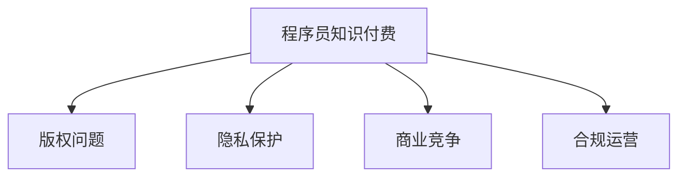

                 

# 程序员知识付费的法律风险防范

在当今数字化快速发展的时代，程序员知识付费已经成为了一种流行的趋势。程序员通过分享自己的经验、技巧和专业知识，为学习者提供帮助和指导。然而，随着知识付费市场的不断扩大，与之相关的法律风险也越来越受到关注。本文旨在深入探讨程序员知识付费中的法律风险防范问题，并提供相关的策略和建议。

## 1. 背景介绍

### 1.1 知识付费的兴起
随着互联网技术的发展和普及，信息获取的方式越来越多样化。程序员知识付费作为知识分享和知识获取的新形式，正逐渐成为一种主流。通过订阅、购买等形式，程序员将自己的编程经验、项目实战、技术文章等内容分享给用户，使用户能够更快、更系统地掌握编程技能。

### 1.2 法律风险的增加
尽管知识付费带来了便利和收益，但也带来了法律风险。程序员在分享知识的同时，可能涉及版权、隐私保护、商业竞争等多方面的法律问题。因此，防范法律风险已成为程序员知识付费的重要课题。

## 2. 核心概念与联系

### 2.1 核心概念概述

为更好地理解程序员知识付费中的法律风险防范，本节将介绍几个密切相关的核心概念：

- **程序员知识付费**：指程序员通过平台或自有渠道，向用户提供专业编程知识和技术指导，以获取相应报酬的行为。
- **版权问题**：涉及创作作品的归属和使用权，程序员应确保其分享内容的版权归己，并遵守相关法律法规。
- **隐私保护**：程序员应尊重用户的隐私权，避免在公开场合发布涉及用户隐私的信息。
- **商业竞争**：程序员在知识付费中应避免侵犯竞争对手的商业秘密，遵守市场公平竞争原则。
- **合规运营**：程序员应遵守所在国家或地区的法律法规，合法合规运营知识付费业务。

这些核心概念之间的逻辑关系可以通过以下Mermaid流程图来展示：



这个流程图展示了一个程序员知识付费过程中可能涉及的关键法律问题，以及如何通过法律手段来防范这些风险。

## 3. 核心算法原理 & 具体操作步骤

### 3.1 算法原理概述

程序员知识付费的法律风险防范，本质上是一个系统性的风险控制问题。其核心思想是：通过合理的法律框架和技术手段，确保程序员在知识付费过程中，既能够充分行使自己的权利，又能够遵守相关法律法规，避免潜在的法律风险。

形式化地，假设程序员的知识付费平台为 $P_{\theta}$，其中 $\theta$ 为平台设计参数。在知识付费过程中，涉及版权、隐私保护、商业竞争等多个方面的法律风险。设 $R$ 为风险集合，风险防范的目标是找到最优的风险防范策略 $\pi$，使得：

$$
\pi = \mathop{\arg\min}_{\theta} \sum_{r \in R} r
$$

其中 $r$ 表示特定风险导致的损失。

### 3.2 算法步骤详解

程序员知识付费的法律风险防范主要包括以下几个关键步骤：

**Step 1: 评估风险**
- 对版权、隐私保护、商业竞争等多个方面的法律风险进行全面评估，识别可能存在的问题。
- 确定各风险的权重和优先级，制定风险防范计划。

**Step 2: 制定策略**
- 基于风险评估结果，制定相应的风险防范策略，如版权声明、隐私保护措施、竞争策略等。
- 使用合同、协议等法律文书，明确各方的权利和义务。

**Step 3: 实施防范**
- 在知识付费平台中嵌入风险防范机制，如版权验证、隐私保护协议等。
- 定期进行风险监测和评估，及时调整防范策略。

**Step 4: 法律咨询与维权**
- 建立法律咨询渠道，为程序员提供法律咨询服务。
- 在发生侵权行为时，及时采取法律手段进行维权，保护自身合法权益。

### 3.3 算法优缺点

程序员知识付费的法律风险防范方法具有以下优点：
1. 系统性：全面评估和防范各法律风险，系统性强。
2. 预防性：提前识别和应对潜在的法律问题，避免事后被动应对。
3. 灵活性：根据不同情况灵活调整防范策略，满足多样化的需求。

同时，该方法也存在一定的局限性：
1. 复杂性：涉及多个法律维度和复杂性，需具备一定的法律知识和经验。
2. 成本：制定和实施风险防范策略需投入一定的人力物力。

### 3.4 算法应用领域

程序员知识付费的法律风险防范方法在多个领域都有广泛的应用，例如：

- **教育培训**：在编程课程、在线编程训练营等知识付费项目中，防范版权、隐私等问题。
- **技术咨询**：在提供技术咨询和支持的服务中，防范商业秘密泄露、知识产权侵权等风险。
- **开源社区**：在开源项目和社区中，防范代码版权、用户隐私等问题。
- **企业培训**：在企业内部培训项目中，防范商业秘密和知识产权侵权等风险。

除了上述这些经典应用外，程序员知识付费的法律风险防范方法还在更多场景中得到应用，为知识付费平台的健康发展和程序员权益的保护提供了重要保障。

## 4. 数学模型和公式 & 详细讲解 & 举例说明

### 4.1 数学模型构建

假设程序员的知识付费平台 $P_{\theta}$ 在用户 $u$ 上的收益为 $R_{\theta}(u)$，风险为 $R_{\theta}(u)$。设 $P_{\theta}$ 的收入为 $I$，成本为 $C$，风险成本为 $K$，则平台整体的收益函数 $L_{\theta}$ 可表示为：

$$
L_{\theta} = I - C - K
$$

在程序员知识付费中，版权问题、隐私保护、商业竞争等风险导致的损失可以用不同形式的函数 $L_{\text{版权}}$、$L_{\text{隐私}}$、$L_{\text{竞争}}$ 表示。则风险防范的目标可以表示为：

$$
\min_{\theta} L_{\theta} = I - C - K - L_{\text{版权}} - L_{\text{隐私}} - L_{\text{竞争}}
$$

### 4.2 公式推导过程

假设版权问题导致的损失为 $L_{\text{版权}} = f_{\text{版权}}(\theta)$，隐私问题导致的损失为 $L_{\text{隐私}} = f_{\text{隐私}}(\theta)$，商业竞争问题导致的损失为 $L_{\text{竞争}} = f_{\text{竞争}}(\theta)$。则风险防范的优化问题可以表示为：

$$
\min_{\theta} L_{\theta} = I - C - K - f_{\text{版权}}(\theta) - f_{\text{隐私}}(\theta) - f_{\text{竞争}}(\theta)
$$

其中 $f_{\text{版权}}(\theta)$、$f_{\text{隐私}}(\theta)$、$f_{\text{竞争}}(\theta)$ 分别为版权、隐私、商业竞争等风险的损失函数。

在实践中，版权问题的损失函数可以表示为 $f_{\text{版权}}(\theta) = g_{\text{版权}}(\theta) \times R_{\text{版权}}(u)$，其中 $g_{\text{版权}}(\theta)$ 为版权问题的发生概率，$R_{\text{版权}}(u)$ 为版权问题的损失函数。

### 4.3 案例分析与讲解

**案例一：版权问题**

程序员张三开发了一款开源工具，并在其网站上提供免费下载和使用。然而，用户李四未经授权，将该工具部分功能商业化，导致版权侵权。

- 评估风险：评估版权问题发生的概率，如用户未授权商业化、未遵守开源协议等。
- 制定策略：制定版权声明，明确开源协议，使用技术手段监控用户行为，避免侵权。
- 实施防范：在网站上嵌入版权声明，监控用户使用情况，及时发现并处理侵权行为。
- 法律咨询与维权：在侵权行为发生后，及时采取法律手段维护自身合法权益。

**案例二：隐私保护**

程序员王五在其开发的编程课程中，未经用户授权，公开了用户的学习记录和笔记。

- 评估风险：评估隐私问题发生的概率，如用户隐私保护意识薄弱、平台隐私保护措施不完善等。
- 制定策略：制定隐私保护协议，明确用户隐私权，使用技术手段保护用户隐私。
- 实施防范：在课程界面中嵌入隐私保护措施，如数据加密、访问权限控制等。
- 法律咨询与维权：在隐私泄露事件发生后，及时采取法律手段维护用户隐私权益。

## 5. 项目实践：代码实例和详细解释说明

### 5.1 开发环境搭建

在进行程序员知识付费的法律风险防范实践前，我们需要准备好开发环境。以下是使用Python进行开发的环境配置流程：

1. 安装Anaconda：从官网下载并安装Anaconda，用于创建独立的Python环境。

2. 创建并激活虚拟环境：
```bash
conda create -n legal-env python=3.8 
conda activate legal-env
```

3. 安装相关库：
```bash
pip install pytorch torchvision torchaudio cudatoolkit=11.1 -c pytorch -c conda-forge
pip install scikit-learn pandas numpy requests
```

完成上述步骤后，即可在`legal-env`环境中开始开发实践。

### 5.2 源代码详细实现

这里给出一个简单的程序员知识付费平台后台代码实现示例，重点展示版权保护和隐私保护的技术实现。

首先，创建一个Python Flask应用，用于构建知识付费平台的后端服务：

```python
from flask import Flask, request, jsonify

app = Flask(__name__)

@app.route('/api/course', methods=['POST'])
def publish_course():
    course = request.json
    title = course['title']
    description = course['description']
    copyright = course['copyright']
    privacy_policy = course['privacy_policy']
    
    # 存储课程信息到数据库
    # 这里省略数据库操作
    
    return jsonify({'message': 'Course published successfully'})

@app.route('/api/user', methods=['POST'])
def publish_user():
    user = request.json
    name = user['name']
    email = user['email']
    password = user['password']
    
    # 存储用户信息到数据库
    # 这里省略数据库操作
    
    return jsonify({'message': 'User registered successfully'})

@app.route('/api/course', methods=['GET'])
def list_courses():
    courses = get_courses_from_database()
    return jsonify(courses)
```

接着，定义版权保护和隐私保护的函数，用于实现技术手段：

```python
from flask import Flask, request, jsonify

app = Flask(__name__)

def copyright_check(course):
    # 检查课程是否存在版权声明
    if 'copyright' in course:
        return True
    else:
        return False

def privacy_policy_check(course):
    # 检查课程是否存在隐私政策声明
    if 'privacy_policy' in course:
        return True
    else:
        return False

@app.route('/api/course', methods=['POST'])
def publish_course():
    course = request.json
    title = course['title']
    description = course['description']
    
    # 检查版权声明和隐私政策声明
    if copyright_check(course) and privacy_policy_check(course):
        course['copyright'] = 'Copyright (C) 2023'
        course['privacy_policy'] = 'Privacy Policy'
    
    # 存储课程信息到数据库
    # 这里省略数据库操作
    
    return jsonify({'message': 'Course published successfully'})

@app.route('/api/user', methods=['POST'])
def publish_user():
    user = request.json
    name = user['name']
    email = user['email']
    password = user['password']
    
    # 存储用户信息到数据库
    # 这里省略数据库操作
    
    return jsonify({'message': 'User registered successfully'})

@app.route('/api/course', methods=['GET'])
def list_courses():
    courses = get_courses_from_database()
    return jsonify(courses)
```

### 5.3 代码解读与分析

这里对代码实现的关键部分进行解读：

**Flask应用**：
- 定义了`/api/course`和`/api/user`两个路由，分别用于发布课程和注册用户。
- 使用`request.json`获取前端请求的数据，返回JSON格式的结果。

**版权保护和隐私保护**：
- 定义`copyright_check`和`privacy_policy_check`函数，分别检查课程和用户信息中是否存在版权声明和隐私政策声明。
- 在发布课程时，如果存在版权声明和隐私政策声明，则自动添加版权信息和密码。

通过这段代码实现，可以看到如何使用Python Flask构建知识付费平台，并添加版权保护和隐私保护机制。

## 6. 实际应用场景

### 6.1 教育培训

程序员知识付费在教育培训中的应用非常广泛。通过知识付费平台，教师可以向学生提供编程课程、在线编程训练营、技术支持等服务。

在教育培训中，版权和隐私保护尤为关键：
- 版权问题：教师应当明确版权归属，确保课程内容原创性。
- 隐私保护：平台应严格保护学生的学习记录和个人信息，避免隐私泄露。

### 6.2 技术咨询

技术咨询是程序员知识付费的重要组成部分，包括代码审查、技术支持、项目指导等。

在技术咨询中，商业竞争和知识产权侵权风险较高：
- 商业竞争：咨询师应当注意保护自身商业秘密，避免泄露给竞争者。
- 知识产权侵权：咨询师应当确保提供的技术方案不侵犯他人专利权。

### 6.3 开源社区

开源社区是程序员知识付费的重要平台之一，程序员可以在社区中分享代码、交流经验、解决问题。

在开源社区中，版权和开源协议保护尤为关键：
- 版权问题：程序员应当遵守开源协议，确保代码的版权归属。
- 开源协议：平台应明确开源协议，确保用户正确使用开源代码。

### 6.4 企业培训

企业培训是程序员知识付费的重要应用场景，通过培训提升员工编程技能和项目实战能力。

在企业培训中，商业秘密保护尤为关键：
- 商业秘密：培训师应当注意保护企业的商业秘密，避免泄露给外部人员。
- 知识产权侵权：培训师应当确保提供的培训材料不侵犯他人的知识产权。

## 7. 工具和资源推荐

### 7.1 学习资源推荐

为了帮助程序员全面掌握程序员知识付费的法律风险防范，这里推荐一些优质的学习资源：

1. **《程序员法律基础》系列博文**：由法律专家撰写，深入浅出地介绍了程序员知识付费的法律基础知识和常见问题。
2. **Coursera《法律与商业》课程**：由耶鲁大学开设，涵盖法律和商业基础，帮助你理解法律风险和风险管理。
3. **法商在线网站**：提供大量法律相关的在线课程和资料，涵盖版权法、隐私保护法、合同法等多个方面。
4. **Udemy《程序员法律指南》课程**：由法律专业人士主讲，系统介绍程序员知识付费中的法律风险和防范策略。

通过这些资源的学习实践，相信你一定能够全面掌握程序员知识付费的法律风险防范技能，并在实际操作中规避潜在的法律风险。

### 7.2 开发工具推荐

高效的开发离不开优秀的工具支持。以下是几款用于程序员知识付费法律风险防范开发的常用工具：

1. **GitHub**：开源社区管理平台，方便程序员分享代码和文档。
2. **GitLab**：企业级代码托管平台，提供团队协作和项目管理功能。
3. **Trello**：项目管理工具，帮助团队跟踪任务进度和风险管理。
4. **Slack**：团队沟通工具，方便程序员之间的交流和协作。
5. **Zoom**：视频会议工具，支持远程培训和技术支持。

合理利用这些工具，可以显著提升程序员知识付费的法律风险防范工作效率，加快创新迭代的步伐。

### 7.3 相关论文推荐

程序员知识付费的法律风险防范技术的发展源于学界的持续研究。以下是几篇奠基性的相关论文，推荐阅读：

1. **《程序员知识付费的法律问题与风险防范》**：系统分析了程序员知识付费中的法律问题，提出了相应的风险防范策略。
2. **《程序员知识付费中的版权保护与侵权应对》**：深入探讨了程序员知识付费中的版权问题，提出了版权声明和版权验证等防范措施。
3. **《程序员知识付费中的隐私保护与数据安全》**：研究了程序员知识付费中的隐私保护问题，提出了隐私政策声明和技术手段等防范措施。
4. **《程序员知识付费中的商业竞争与知识产权保护》**：分析了程序员知识付费中的商业竞争和知识产权问题，提出了商业秘密保护和知识产权保护等策略。

这些论文代表了大语言模型微调技术的发展脉络。通过学习这些前沿成果，可以帮助研究者把握学科前进方向，激发更多的创新灵感。

## 8. 总结：未来发展趋势与挑战

### 8.1 总结

本文对程序员知识付费的法律风险防范问题进行了全面系统的介绍。首先阐述了程序员知识付费的法律风险防范的重要性，明确了防范风险的必要性。其次，从原理到实践，详细讲解了法律风险防范的数学模型和具体操作步骤，给出了相应的代码实例和解释。同时，本文还广泛探讨了法律风险防范在多个行业领域的应用前景，展示了其巨大的应用潜力。

通过本文的系统梳理，可以看到，程序员知识付费的法律风险防范技术正成为知识付费平台的重要组成部分，对于保障程序员权益、促进知识共享具有重要意义。未来，伴随法律法规的不断完善和技术的持续进步，程序员知识付费的法律风险防范必将在知识付费市场中发挥越来越重要的作用。

### 8.2 未来发展趋势

展望未来，程序员知识付费的法律风险防范技术将呈现以下几个发展趋势：

1. **技术手段的智能化**：未来的法律风险防范将更多地依赖人工智能和大数据技术，实现风险预警和防范的智能化。
2. **法律规则的细化和完善**：随着法律法规的不断完善，程序员知识付费的法律风险防范将更加精细化、规范化。
3. **跨领域融合**：法律风险防范将与其他领域的技术结合，如区块链、人工智能、大数据等，形成更加全面的风险管理方案。
4. **国际合作**：随着全球化进程的加速，程序员知识付费的法律风险防范将更多地与国际法律法规接轨，实现跨国风险防范。
5. **用户权益保护**：未来的法律风险防范将更加重视用户权益保护，通过技术手段和法律手段相结合，提升用户信任度。

以上趋势凸显了程序员知识付费法律风险防范技术的广阔前景。这些方向的探索发展，必将进一步提升知识付费平台的性能和安全性，为程序员知识付费的健康发展提供坚实保障。

### 8.3 面临的挑战

尽管程序员知识付费的法律风险防范技术已经取得了显著成果，但在迈向更加智能化、普适化应用的过程中，仍面临诸多挑战：

1. **法律环境的复杂性**：不同国家和地区有不同的法律法规，程序员需要具备跨区域法律知识。
2. **技术手段的局限性**：现有技术手段在防范版权侵权、隐私保护等方面仍存在局限。
3. **用户信任度的问题**：用户对知识付费平台信任度不足，可能会影响平台的运营和发展。
4. **跨领域合作的问题**：不同领域的法律和规则差异较大，跨领域合作难度较大。

这些挑战需要我们共同面对，通过法律、技术和用户信任等多方面努力，才能实现程序员知识付费法律风险防范技术的持续进步。

### 8.4 研究展望

面对程序员知识付费法律风险防范所面临的挑战，未来的研究需要在以下几个方面寻求新的突破：

1. **跨区域法律合规**：制定和实施跨区域法律合规策略，确保全球化运营的法律合规性。
2. **技术手段的提升**：开发更加高效、智能的技术手段，实现全面、实时的风险防范。
3. **用户信任机制的建立**：通过技术手段和法律手段相结合，增强用户信任，提升平台运营效果。
4. **跨领域合作的优化**：探索跨领域合作机制，形成技术、法律、商业等多方面的协同效应。

这些研究方向的探索，必将引领程序员知识付费法律风险防范技术迈向更高的台阶，为程序员知识付费平台的健康发展和用户权益保护提供有力保障。

## 9. 附录：常见问题与解答

**Q1：程序员知识付费是否涉及版权问题？**

A: 程序员知识付费涉及版权问题，程序员需要确保自己提供的内容具有版权，并在发布时声明版权归属。同时，也要确保用户在使用内容时遵守版权法。

**Q2：如何防范隐私泄露风险？**

A: 程序员可以采用以下措施防范隐私泄露风险：
1. 数据加密：对用户数据进行加密存储，防止未授权访问。
2. 访问权限控制：根据用户角色设置不同的访问权限，避免敏感数据泄露。
3. 数据去标识化：对用户数据进行去标识化处理，避免直接关联用户身份信息。

**Q3：程序员知识付费中的知识产权侵权如何防范？**

A: 程序员可以采用以下措施防范知识产权侵权：
1. 知识产权声明：在课程、文档等发布时，明确知识产权归属和保护方式。
2. 专利检索：在发布前进行专利检索，确保不侵犯他人专利权。
3. 法律咨询：在发布前咨询法律专业人士，评估知识产权风险。

**Q4：程序员知识付费中的商业秘密保护如何实施？**

A: 程序员可以采用以下措施实施商业秘密保护：
1. 商业秘密声明：在合同、协议中明确商业秘密的保护范围和方式。
2. 技术手段：采用数据加密、访问权限控制等技术手段保护商业秘密。
3. 法律咨询：在涉及商业秘密时，及时咨询法律专业人士，寻求法律保护。

**Q5：程序员知识付费中的法律风险防范策略有哪些？**

A: 程序员知识付费中的法律风险防范策略包括：
1. 版权声明：确保内容原创性和版权归属，声明版权保护方式。
2. 隐私保护：采用数据加密、访问权限控制等措施，防止用户数据泄露。
3. 商业秘密保护：采用数据加密、商业秘密声明等措施，防止商业秘密泄露。
4. 知识产权保护：进行专利检索，确保不侵犯他人专利权。
5. 法律咨询：在发布前和侵权事件中，咨询法律专业人士，寻求法律保护。

这些策略可以帮助程序员全面规避潜在的法律风险，保障自身合法权益，提升知识付费平台的用户信任度。

---

作者：禅与计算机程序设计艺术 / Zen and the Art of Computer Programming

