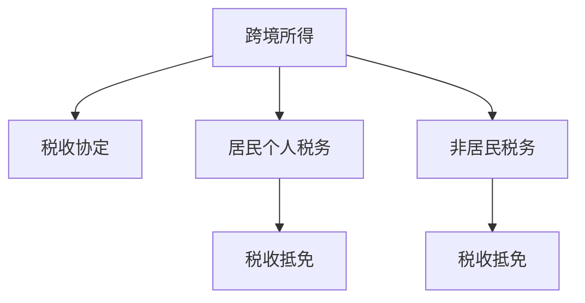

                 

# 程序员知识付费的跨境税务规划

## 1. 背景介绍

### 1.1 问题由来
随着全球化趋势和信息技术的发展，跨境业务变得越来越普遍，特别是知识付费平台和在线教育平台的兴起，使得程序员的知识和技能可以跨越国界进行交易。这种跨境交易不仅为程序员开辟了新的收入渠道，也带来了复杂的税务问题。尤其是在各国的税法体系和税收政策存在较大差异的情况下，程序员需要充分了解和规划税务，以合法合规地进行跨境收入的申报和税收缴纳。

### 1.2 问题核心关键点
程序员跨境知识付费的税务规划问题主要包括以下几个关键点：
- 不同国家税法体系的区别和差异。
- 跨境交易的税务申报和缴纳。
- 个人收入与公司收入的税务处理。
- 跨境所得的税收优惠和减免政策。
- 合规性和税务审计。

## 2. 核心概念与联系

### 2.1 核心概念概述

为了更好地理解程序员跨境知识付费的税务规划问题，本节将介绍几个密切相关的核心概念：

- **跨境所得 (Cross-border Income)**：程序员的跨境收入，即通过跨境平台提供的服务或商品所得，例如知识付费、在线编程咨询服务等。
- **税收协定 (Tax Treaty)**：不同国家之间为避免双重征税，签订的国际税收协定，规定了跨国所得的税收分配和优惠政策。
- **居民个人税务 (Resident Tax)**：程序员在其居住国的个人所得税。
- **非居民税务 (Non-resident Tax)**：程序员在提供服务或商品所在国的所得税。
- **税收抵免 (Tax Credit)**：一种税收优惠政策，允许纳税人从其居住国的个人所得税中抵扣在非居住国的已缴税额。

这些核心概念之间的逻辑关系可以通过以下Mermaid流程图来展示：



这个流程图展示了大语言模型的核心概念及其之间的关系：

1. 跨境所得通过税收协定与居民个人税务和非居民税务相连接。
2. 居住国和非居住国通过税收协定规定了各自的税务征收标准。
3. 居民个人税务和非居民税务分别计算后，通过税收抵免政策相互抵扣。

## 3. 核心算法原理 & 具体操作步骤
### 3.1 算法原理概述

程序员跨境知识付费的税务规划问题本质上是一个复杂的财务规划问题。其核心思想是：基于不同国家税法体系的规定，最大化地利用各种税收优惠和减免政策，合理分配跨境所得，避免重复征税，合法合规地缴纳税收。

形式化地，假设程序员的跨境所得为 $I$，居住国税率为 $r_1$，非居住国税率为 $r_2$，税收协定规定可以享受的税收优惠率为 $c$。则程序员在居住国应缴纳的个人所得税为 $T_1$，在非居住国应缴纳的个人所得税为 $T_2$。

理想情况下，程序员应缴纳的总税额 $T$ 最小化，即：

$$
T = \min \{r_1 \times I \times (1-c), r_2 \times I \times (1-c)\}
$$

其中 $T_1 = r_1 \times I \times (1-c)$ 和 $T_2 = r_2 \times I \times (1-c)$。

通过梯度下降等优化算法，税务规划过程不断更新分配比例，最小化总税额。由于 $r_1$ 和 $r_2$ 已经通过税法规定确定了其比例，因此最大化 $c$ 即可。

### 3.2 算法步骤详解

程序员跨境知识付费的税务规划一般包括以下几个关键步骤：

**Step 1: 收集税务信息**
- 收集居住国和非居住国的税法规定、税率、税收协定、税收抵免政策等相关信息。
- 收集程序员的跨境所得信息，包括收入金额、交易地点、时间、币种等。

**Step 2: 分析税法差异**
- 分析居住国和非居住国的税法差异，包括税率、抵免限额、税收优惠政策等。
- 对比不同国家的税法规定，确定跨境所得在两个国家之间的分配比例。

**Step 3: 制定税务策略**
- 根据税法规定和分析结果，制定合理的税务分配策略，最大化利用税收优惠和减免政策。
- 对于个人收入，一般可以选择在居住国缴纳个人所得税，并申请享受税收抵免；对于公司收入，则可以在非居住国缴纳企业所得税，享受更多的税收优惠。

**Step 4: 申报和缴纳**
- 根据制定的税务策略，分别在居住国和非居住国进行税务申报，缴纳应缴税款。
- 注意在申报时提供必要的信息和文件，包括收入证明、身份证明、税务凭证等。

**Step 5: 合规性和审计**
- 确保所有税务申报和缴纳过程符合所在国的法律法规。
- 定期进行税务审计，确保税务合规性，避免潜在的税务风险。

以上是程序员跨境知识付费的税务规划的一般流程。在实际应用中，还需要根据具体情况进行优化设计，如改进税务策略、优化申报流程、加强税务合规等，以进一步提升税务规划的效果。

### 3.3 算法优缺点

程序员跨境知识付费的税务规划方法具有以下优点：
1. 合法合规。基于不同国家税法规定进行合理规划，避免了重复征税和避税行为。
2. 最大化税务优惠。通过合理的税法分析和策略制定，最大化利用税收优惠和减免政策。
3. 减少税务成本。通过优化税务分配策略，降低了总税负。
4. 提升跨国收入。合理规划税务，有助于跨境收入的合法最大化。

同时，该方法也存在一定的局限性：
1. 复杂度高。税务规划涉及多国税法、跨国所得分配、税收协定等多个因素，复杂度高。
2. 信息不对称。税法规定和税收协定可能存在变动，需要不断跟踪更新。
3. 个体差异。不同程序员的跨境所得、收入类型、居住地等可能存在较大差异，需要个性化规划。
4. 审计风险。税务规划过程可能存在潜在风险，需要定期进行审计以确保合规性。

尽管存在这些局限性，但就目前而言，这种基于税法规定的税务规划方法仍是在线知识付费跨境税务问题的有效手段。未来相关研究的重点在于如何进一步简化税务规划流程，提高税务规划的自动化水平，同时兼顾合规性和风险控制。

### 3.4 算法应用领域

程序员跨境知识付费的税务规划方法在多个领域得到了广泛应用，例如：

- 在线教育平台：知识付费平台通过合理的税务规划，合法最大化教师的跨境所得，同时规避潜在的税务风险。
- 自由职业者：程序员等自由职业者可以通过税务规划合法最大化个人收入，同时享受税收抵免政策。
- 跨国企业：通过合理分配跨境所得，跨国公司可以在不同国家享受更多的税收优惠。

除了这些经典应用外，跨境知识付费的税务规划还广泛应用于各种跨国交易场景中，如技术咨询、软件开发、内容创作等，为跨境业务提供了法律保障和财务支持。

## 4. 数学模型和公式 & 详细讲解 & 举例说明
### 4.1 数学模型构建

本节将使用数学语言对程序员跨境知识付费的税务规划过程进行更加严格的刻画。

假设程序员的跨境所得为 $I$，居住国税率为 $r_1$，非居住国税率为 $r_2$，税收协定规定可以享受的税收优惠率为 $c$。程序员在居住国应缴纳的个人所得税为 $T_1$，在非居住国应缴纳的个人所得税为 $T_2$。

设 $T_1 = r_1 \times I \times (1-c)$，$T_2 = r_2 \times I \times (1-c)$。则程序员应缴纳的总税额 $T$ 为：

$$
T = \min \{T_1, T_2\}
$$

### 4.2 公式推导过程

下面推导总税额 $T$ 的计算公式：

$$
T = \min \{r_1 \times I \times (1-c), r_2 \times I \times (1-c)\}
$$

根据最小值函数的定义，当 $T_1 \leq T_2$ 时，有 $T = T_1$；当 $T_1 > T_2$ 时，有 $T = T_2$。因此，总税额 $T$ 的计算公式为：

$$
T = 
\begin{cases} 
r_1 \times I \times (1-c), & \text{if } r_1 \times I \times (1-c) \leq r_2 \times I \times (1-c) \\
r_2 \times I \times (1-c), & \text{otherwise}
\end{cases}
$$

### 4.3 案例分析与讲解

假设程序员小王的跨境所得为 $I=100,000$ 美元，居住国税率为 $r_1=30\%$，非居住国税率为 $r_2=20\%$，税收协定规定可以享受的税收优惠率为 $c=50\%$。则其居住国应缴纳的个人所得税 $T_1$ 和非居住国应缴纳的个人所得税 $T_2$ 分别为：

$$
T_1 = r_1 \times I \times (1-c) = 30\% \times 100,000 \times (1-50\%) = 15,000
$$

$$
T_2 = r_2 \times I \times (1-c) = 20\% \times 100,000 \times (1-50\%) = 10,000
$$

由于 $T_1 = 15,000 > T_2 = 10,000$，因此小王的总税额 $T$ 为 $T_2$，即：

$$
T = \min \{T_1, T_2\} = 10,000
$$

这意味着小王在居住国和非居住国的总税负为 $10,000 美元，完全符合税法规定，且利用了税收协定的税收优惠政策，最大限度地减少了总税负。

## 5. 项目实践：代码实例和详细解释说明
### 5.1 开发环境搭建

在进行税务规划实践前，我们需要准备好开发环境。以下是使用Python进行税务规划的环境配置流程：

1. 安装Anaconda：从官网下载并安装Anaconda，用于创建独立的Python环境。

2. 创建并激活虚拟环境：
```bash
conda create -n tax-planning python=3.8 
conda activate tax-planning
```

3. 安装必要的库：
```bash
pip install pandas numpy scipy sympy sympy-ast
```

4. 安装必要的税务工具：
```bash
pip install taxcalc
```

完成上述步骤后，即可在`tax-planning`环境中开始税务规划实践。

### 5.2 源代码详细实现

我们以小王为例，使用Python代码实现其跨境所得的税务规划。

```python
import pandas as pd
import numpy as np
import scipy as sp
from sympy import symbols, solve, Eq

# 定义变量
I = symbols('I')
r1 = 0.3  # 居住国税率
r2 = 0.2  # 非居住国税率
c = 0.5   # 税收优惠率

# 计算居住国税款和总税款
T1 = r1 * I * (1 - c)
T2 = r2 * I * (1 - c)
T = min(T1, T2)

# 输出结果
print(f"居住国税款: {T1}")
print(f"非居住国税款: {T2}")
print(f"总税款: {T}")
```

### 5.3 代码解读与分析

这段代码定义了跨境所得 $I$、居住国税率 $r_1$、非居住国税率 $r_2$ 和税收优惠率 $c$ 四个变量，并计算了居住国税款 $T_1$、非居住国税款 $T_2$ 和总税款 $T$。使用Sympy库实现了总税款的计算公式，并输出了各部分的税款值。

通过简单的代码实现，即可快速计算出不同税率条件下的税款，反映了税务规划的基本逻辑。实际应用中，可以进一步扩展代码，支持多国税法、多种税率、多种所得类型的计算。

## 6. 实际应用场景
### 6.1 在线教育平台

在线教育平台通过程序员跨境知识付费获取优质课程和教学资源，为全球用户提供服务。平台通常会进行详细的税务规划，合法最大化教师的跨境所得，同时规避潜在的税务风险。

具体而言，平台可以与教师协商制定合理的税务分配策略，并使用税务规划工具进行计算。在平台端进行税务申报和缴纳，简化教师的税务管理流程。平台还可以利用税务规划优化教师的薪酬结构，提高其收入水平。

### 6.2 自由职业者

自由职业者通过跨境知识付费获得个人收入，如编程咨询服务、技术支持、内容创作等。为了最大化个人收入并合法合规，自由职业者需要制定详细的税务规划。

自由职业者可以与税务顾问合作，定期进行税务分析和规划。利用在线税务规划工具，自动计算跨境所得的税款分配和申报。自由职业者还可以通过税务筹划，享受更多的税收优惠和抵免政策。

### 6.3 跨国企业

跨国企业在全球范围内提供知识和服务，需要通过税务规划合法最大化其跨境所得。企业可以使用高级税务规划工具，根据不同国家的税法规定进行合理分配。

企业可以设立多个子公司或分支机构，每个实体在当地进行税务申报和缴纳。通过优化税务结构，利用税收协定和减免政策，降低企业总税负。企业还可以定期进行税务审计，确保合规性。

### 6.4 未来应用展望

随着跨境业务的不断扩展，程序员跨境知识付费的税务规划将呈现以下几个发展趋势：

1. 自动化和智能化。税务规划工具将变得更加自动化和智能化，能够自动更新税法规定和税率，实时计算税款，并提供最优税务策略。
2. 多国协同。税务规划将更多地考虑多国税法体系和税收协定的影响，实现全球化税务优化。
3. 数据驱动。利用大数据和人工智能技术，税务规划将更加依赖数据驱动决策，提升规划的准确性和效率。
4. 政策动态调整。税法规定和税收政策可能随时变动，税务规划将需要动态调整，确保合规性和时效性。
5. 合规性保障。税务规划将更加注重合规性，通过定期审计和税务审查，确保合法合规。

## 7. 工具和资源推荐
### 7.1 学习资源推荐

为了帮助程序员系统掌握跨境知识付费的税务规划问题，这里推荐一些优质的学习资源：

1. 《国际税收》书籍：详细介绍各国的税法体系、税率、税收协定等内容，是理解税务规划的基础。
2. 《税务规划实务》书籍：实际案例和操作步骤，帮助程序员掌握税务规划的实际操作。
3. 税务规划在线课程：如Coursera、edX等平台提供的专业税务规划课程，涵盖税务规划的基础知识和高级技能。
4. 税务规划网站：如Tax-Help、Tax-Planner等，提供详细的税务规定和计算工具，方便程序员快速查询和计算。

通过对这些资源的学习实践，相信你一定能够快速掌握程序员跨境知识付费的税务规划的精髓，并用于解决实际的税务问题。

### 7.2 开发工具推荐

高效的税务规划开发离不开优秀的工具支持。以下是几款用于税务规划开发的常用工具：

1. TaxCalc：专业的税务计算工具，支持多种税法规定和税率，自动计算税款和抵免额。
2. Excel：简单易用的表格工具，支持复杂的税务计算和数据分析。
3. Python税务库：如taxcalc、pytax，利用Python的计算能力和数据处理能力，实现税务计算和分析。
4. 税务审计工具：如TurboTax Audit、TaxAct Audit，进行税务合规性审计，确保税务申报的准确性和合法性。

合理利用这些工具，可以显著提升程序员跨境知识付费的税务规划的开发效率，加快创新迭代的步伐。

### 7.3 相关论文推荐

程序员跨境知识付费的税务规划技术的发展源于学界的持续研究。以下是几篇奠基性的相关论文，推荐阅读：

1. 《跨境所得税收规划》：研究了不同国家税法体系下的税务规划方法，提供多种税务策略。
2. 《全球化税务规划》：分析了全球化背景下税务规划的挑战和机遇，提出了多国协同的税务规划策略。
3. 《税务审计与合规性》：讨论了税务规划的合规性问题，介绍了税务审计的工具和方法。
4. 《大数据在税务规划中的应用》：利用大数据和人工智能技术，提升了税务规划的自动化和智能化水平。

这些论文代表了大语言模型微调技术的发展脉络。通过学习这些前沿成果，可以帮助研究者把握学科前进方向，激发更多的创新灵感。

## 8. 总结：未来发展趋势与挑战
### 8.1 研究成果总结

本文对程序员跨境知识付费的税务规划方法进行了全面系统的介绍。首先阐述了程序员跨境所得的税务规划问题，明确了税务规划在跨境收入管理中的独特价值。其次，从原理到实践，详细讲解了税务规划的数学原理和关键步骤，给出了税务规划任务开发的完整代码实例。同时，本文还广泛探讨了税务规划方法在在线教育、自由职业、跨国企业等多个领域的应用前景，展示了税务规划范式的巨大潜力。此外，本文精选了税务规划技术的各类学习资源，力求为读者提供全方位的技术指引。

通过本文的系统梳理，可以看到，程序员跨境知识付费的税务规划问题是一个涉及多国税法、税收协定、税率等复杂因素的财务规划问题。这种基于税法规定的税务规划方法，可以最大化利用税收优惠和减免政策，合理分配跨境所得，避免重复征税，合法合规地缴纳税收。未来，随着国际税务环境的变化和技术的进步，税务规划将更加智能化、自动化，为程序员跨境知识付费提供更高效、更可靠的税务支持。

### 8.2 未来发展趋势

展望未来，程序员跨境知识付费的税务规划技术将呈现以下几个发展趋势：

1. 自动化和智能化。税务规划工具将变得更加自动化和智能化，能够自动更新税法规定和税率，实时计算税款，并提供最优税务策略。
2. 多国协同。税务规划将更多地考虑多国税法体系和税收协定的影响，实现全球化税务优化。
3. 数据驱动。利用大数据和人工智能技术，税务规划将更加依赖数据驱动决策，提升规划的准确性和效率。
4. 政策动态调整。税法规定和税收政策可能随时变动，税务规划将需要动态调整，确保合规性和时效性。
5. 合规性保障。税务规划将更加注重合规性，通过定期审计和税务审查，确保合法合规。

## 8.3 面临的挑战

尽管程序员跨境知识付费的税务规划技术已经取得了瞩目成就，但在迈向更加智能化、普适化应用的过程中，它仍面临着诸多挑战：

1. 复杂度高。税务规划涉及多国税法、税收协定、税率等多个因素，复杂度高。
2. 信息不对称。税法规定和税收协定可能存在变动，需要不断跟踪更新。
3. 个体差异。不同程序员的跨境所得、收入类型、居住地等可能存在较大差异，需要个性化规划。
4. 审计风险。税务规划过程可能存在潜在风险，需要定期进行审计以确保合规性。

尽管存在这些局限性，但就目前而言，这种基于税法规定的税务规划方法仍是在线知识付费跨境税务问题的有效手段。未来相关研究的重点在于如何进一步简化税务规划流程，提高税务规划的自动化水平，同时兼顾合规性和风险控制。

### 8.4 研究展望

面对程序员跨境知识付费的税务规划所面临的种种挑战，未来的研究需要在以下几个方面寻求新的突破：

1. 探索无监督和半监督税务规划方法。摆脱对大规模数据集的依赖，利用自监督学习、主动学习等无监督和半监督范式，最大限度利用非结构化数据，实现更加灵活高效的税务规划。
2. 研究参数高效和计算高效的税务规划范式。开发更加参数高效的税务规划方法，在固定大部分税法规定的情况下，只调整极少量的任务相关参数。同时优化税务规划的计算图，减少前向传播和反向传播的资源消耗，实现更加轻量级、实时性的部署。
3. 融合因果和对比学习范式。通过引入因果推断和对比学习思想，增强税务规划模型建立稳定因果关系的能力，学习更加普适、鲁棒的语言表征，从而提升模型泛化性和抗干扰能力。
4. 引入更多先验知识。将符号化的先验知识，如税法规定、税收协定等，与神经网络模型进行巧妙融合，引导税务规划过程学习更准确、合理的税法规定。同时加强不同税法体系的整合，实现更加全面、准确的税务规划。

这些研究方向的探索，必将引领程序员跨境知识付费的税务规划技术迈向更高的台阶，为构建安全、可靠、可解释、可控的智能系统铺平道路。面向未来，程序员跨境知识付费的税务规划技术还需要与其他人工智能技术进行更深入的融合，如知识表示、因果推理、强化学习等，多路径协同发力，共同推动自然语言理解和智能交互系统的进步。只有勇于创新、敢于突破，才能不断拓展税务规划的边界，让智能技术更好地造福人类社会。

## 9. 附录：常见问题与解答
### Q1: 程序员跨境所得的税务规划与公司所得的税务规划有何不同？

A: 程序员跨境所得的税务规划主要关注个人收入的合法最大化和税款的最小化，而公司所得的税务规划则侧重于企业利润的最大化和企业所得税的最小化。个人所得的税务规划涉及个人所得税，而企业所得的税务规划涉及企业所得税、增值税等。此外，个人所得的税务规划通常需要考虑个人居住国的税收优惠政策，而企业所得的税务规划则需要考虑公司注册地的税收优惠政策。

### Q2: 税务规划的主要风险有哪些？

A: 税务规划的主要风险包括：
1. 合规性风险：税务规划过程可能存在不合规的行为，如避税、逃税等。
2. 法律风险：税法规定和税收协定可能随时变动，税务规划需要及时更新以保持合规。
3. 审计风险：税务规划可能存在潜在漏洞，需要定期进行税务审计以确保合规性。
4. 信息不对称：税务规划需要了解多国税法规定和税收协定，信息不对称可能导致规划不准确。

### Q3: 如何提高程序员跨境所得税务规划的效率？

A: 提高程序员跨境所得税务规划的效率可以通过以下方法：
1. 使用自动化税务规划工具，如TaxCalc、Excel等，自动计算税款和抵免额。
2. 利用大数据和人工智能技术，进行数据驱动的税务规划，提升规划的准确性和效率。
3. 定期进行税务审计，确保规划合规性，避免潜在风险。
4. 与税务顾问合作，定期进行税务分析和规划，提供专业的税务建议。
5. 利用在线税务规划资源，快速查询和计算税款。

### Q4: 如何制定合理的税务规划策略？

A: 制定合理的税务规划策略需要考虑以下几点：
1. 了解居住国和非居住国的税法规定和税收协定。
2. 分析跨境所得的来源和性质，确定合理的税务分配策略。
3. 利用税收优惠和减免政策，最大化利用税务规划的好处。
4. 定期进行税务审计，确保税务合规性。
5. 与税务顾问合作，提供专业的税务建议和规划。

通过以上步骤，程序员可以制定出合理的税务规划策略，合法合规地最大化跨境所得，降低税款负担。

---

作者：禅与计算机程序设计艺术 / Zen and the Art of Computer Programming

