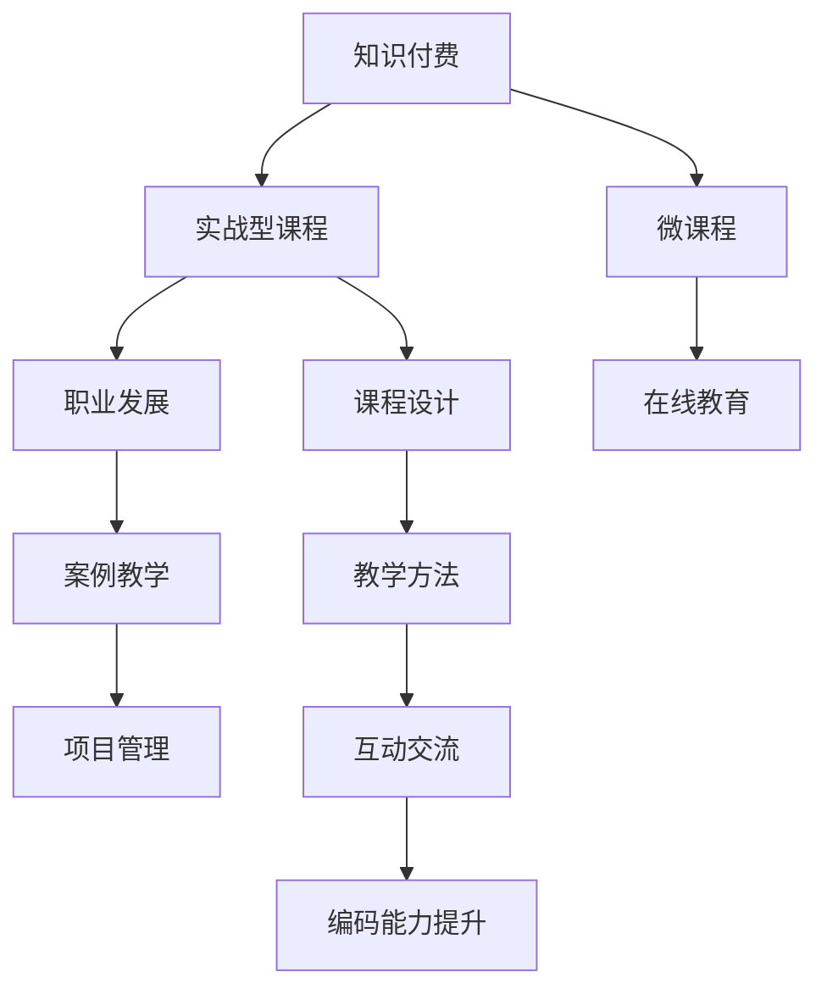

                 

# 程序员知识付费：打造实战型课程

> 关键词：知识付费, 程序员, 实战型课程, 微课程, 职业发展, 在线教育, 课程设计, 教学方法

## 1. 背景介绍

### 1.1 问题由来
在信息爆炸的时代，互联网为知识传播提供了新的可能性，知识付费模式也因此应运而生。自2016年知识付费平台如雨后春笋般涌现以来，已经涌现出了大量的内容，满足了不同用户的需求。对于程序员来说，知识付费不仅可以帮助他们快速获取编程技能和软件开发的最佳实践，还能提升他们在职业生涯中的竞争力和发展潜力。

在这个过程中，如何打造符合程序员需求的实战型课程，成为了一个亟待解决的课题。不同于传统的高校课程和职业培训，实战型课程更注重实战经验，旨在提升学员的项目管理、编码能力，解决实际工作中遇到的真实问题。本文旨在探讨如何打造基于知识付费的实战型课程，为程序员职业发展提供参考。

### 1.2 问题核心关键点
- **课程需求分析**：了解程序员的实际需求和痛点，确定课程的核心内容和方向。
- **课程设计**：科学制定课程框架，确保课程既有理论深度又有实战能力。
- **教学方法**：采用科学合理的教学方法，提升课程的学习效果。
- **技术栈选择**：结合行业发展趋势和技术更新，选择适合的编程语言和技术栈。
- **案例教学**：通过实际项目案例，提升学员的实操能力。
- **互动交流**：鼓励学员之间、师生之间的交流，促进知识共享和学习效果。

## 2. 核心概念与联系

### 2.1 核心概念概述

为了构建一个成功的实战型课程，我们需要关注以下几个核心概念：

- **知识付费**：指的是个人或机构向用户提供有价值的专业知识或技能，以付费形式进行交易的模式。
- **实战型课程**：指以解决实际工作中的问题为核心，通过案例教学、项目实践等方法，帮助学员提升专业技能和解决实际问题的课程。
- **微课程**：是一种短小精悍的课程形式，强调知识的实用性、应用性和操作的简便性。
- **职业发展**：指的是个人在职业生涯中的成长、晋升和技能提升。
- **在线教育**：利用互联网技术，实现远程教学和知识传播的在线教育模式。
- **课程设计**：指科学制定课程的框架、内容和教学方法，确保课程的质量和效果。
- **教学方法**：指提升教学效果的各种技术和手段，如案例教学、翻转课堂、小组讨论等。

这些核心概念之间的逻辑关系可以通过以下Mermaid流程图来展示：



这个流程图展示的核心概念及其之间的关系：

1. 知识付费为实战型课程的创建提供经济支撑。
2. 实战型课程结合微课程和在线教育模式，提升学习的便捷性和实用性。
3. 课程设计是课程质量的关键，教学方法是提升学习效果的重要手段。
4. 职业发展是实战型课程的终极目标，通过提升专业技能帮助学员实现职业晋升。
5. 案例教学和互动交流是提升实操能力和学习效果的有效途径。

## 3. 核心算法原理 & 具体操作步骤
### 3.1 算法原理概述

打造实战型课程的核心在于科学设计课程内容和教学方法，确保学员通过系统的学习掌握必要的技能，并通过实践解决实际问题。以下是构建实战型课程的核心算法原理：

- **需求分析**：通过调查问卷、访谈等方式，了解目标学员的基本情况、职业发展目标和常见问题。
- **内容设计**：基于需求分析的结果，科学设计课程框架，包括理论知识、实践技能、项目案例等。
- **教学实施**：选择适合的教学方法，如案例教学、项目实践、翻转课堂等，确保学员在实践中掌握知识和技能。
- **评估与反馈**：定期对学员进行评估，收集反馈意见，持续改进课程内容和教学方法。

### 3.2 算法步骤详解

以下我们将详细介绍如何通过系统化的步骤打造实战型课程：

**Step 1: 需求分析**
- 设计调查问卷，针对目标学员群体进行问卷调查。
- 与目标学员进行一对一访谈，深入了解他们的需求和痛点。
- 分析问卷和访谈结果，总结出学员最希望掌握的技能和知识。

**Step 2: 内容设计**
- 根据需求分析的结果，设计课程框架，确定课程的核心内容和结构。
- 邀请行业专家和技术人员共同制定课程大纲，确保课程内容的权威性和实用性。
- 选择合适的教学平台和工具，如编程IDE、在线代码编辑器、视频会议软件等，提升课程的可操作性。

**Step 3: 教学实施**
- 根据课程框架，系统讲解理论知识，包括编程语言基础、数据结构、算法等。
- 设计实战项目，选择典型、具有代表性的案例，引导学员动手实践，提升编码能力和问题解决能力。
- 采用多种教学方法，如案例教学、翻转课堂、小组讨论等，提升学员的参与度和学习效果。

**Step 4: 评估与反馈**
- 定期对学员进行测试，评估其掌握程度。
- 收集学员反馈意见，了解课程内容和教学方法的不足之处。
- 根据反馈意见，持续改进课程内容和教学方法，提升课程的质量和效果。

### 3.3 算法优缺点

实战型课程具有以下优点：
- **实用性强**：以解决实际工作中的问题为核心，帮助学员掌握实用的技能。
- **提升快**：通过项目实践和案例教学，学员能够快速掌握知识，提升实操能力。
- **灵活性高**：课程内容可以根据学员反馈进行动态调整，确保课程的实用性和时效性。

然而，也存在一些局限性：
- **成本高**：课程设计、开发和维护需要较高的时间和资金投入。
- **教师要求高**：需要具备丰富的行业经验和实战经验，能够针对具体问题进行深入讲解。
- **学习节奏快**：课程内容密集，对学员的学习能力和时间投入有较高要求。

### 3.4 算法应用领域

实战型课程的应用领域非常广泛，以下是几个典型的应用场景：

**软件开发**：通过实战型课程，帮助学员掌握软件开发的最佳实践，提升编码能力和项目管理能力。

**数据分析**：课程内容结合实际项目案例，帮助学员掌握数据分析工具和技能，如Python、R、SQL等。

**人工智能**：针对人工智能领域，设计实战型课程，涵盖机器学习、深度学习、自然语言处理等核心内容。

**项目管理**：帮助项目经理掌握项目管理工具和技能，提升项目的执行效率和成功率。

**敏捷开发**：通过实战型课程，帮助团队掌握敏捷开发的方法论和实践，提升开发效率和产品质量。

## 4. 数学模型和公式 & 详细讲解 & 举例说明

### 4.1 数学模型构建

为了进一步阐述实战型课程的设计思路，我们将构建一个简单的数学模型：

假设一个实战型课程包含N个项目，每个项目包含M个任务，每个任务需要S小时完成。课程的总时长为T小时。

设课程的目标是最大化学员的学习效果E，E可以表示为学员掌握项目任务数量的函数：

$$
E=f(N, M, S)
$$

其中，N、M、S分别代表项目的数量、每个项目包含的任务数量和每个任务需要的时间。

课程的总时长T是学员可投入时间的上限，需要满足以下条件：

$$
N \times M \times S \leq T
$$

### 4.2 公式推导过程

在上述数学模型中，E可以通过学员掌握项目任务数量的多少来衡量，N、M、S则是影响E的关键因素。

我们通过推导E的函数关系，可以得到：

$$
E \propto N \times M \times S
$$

其中，$\propto$表示正比关系。

### 4.3 案例分析与讲解

以软件开发为例，假设课程包含10个项目，每个项目包含5个任务，每个任务需要5小时完成，学员总可投入时间为500小时。

设E为学员掌握项目任务数量的函数，则：

$$
E=f(10, 5, 5) \propto 10 \times 5 \times 5 = 250
$$

这意味着，通过完成这10个项目，学员可以掌握250个任务，从而提升其编码能力和项目管理能力。

## 5. 项目实践：代码实例和详细解释说明
### 5.1 开发环境搭建

为了打造实战型课程，我们需要搭建一套完善的开发环境。以下是具体的搭建步骤：

**Step 1: 选择合适的开发平台**
- 选择一个功能完善的开发平台，如Jupyter Notebook、AWS、Google Cloud等。

**Step 2: 安装必要的软件工具**
- 安装编程IDE，如PyCharm、Visual Studio Code等。
- 安装版本控制工具，如Git、SVN等。
- 安装代码质量管理工具，如SonarQube、Jenkins等。

**Step 3: 设计课程框架**
- 设计课程框架，包括理论知识、实践技能、项目案例等。
- 根据课程框架，设计课程大纲和教学计划。

### 5.2 源代码详细实现

以下是一个简单的实战型课程的示例代码，用于讲解如何通过Python实现一个简单的项目案例：

```python
# 课程框架设计
课程框架 = {
    '理论知识': [
        '编程语言基础',
        '数据结构与算法',
        '项目案例'
    ],
    '实践技能': [
        '编码能力提升',
        '项目管理',
        '问题解决'
    ],
    '项目案例': [
        '电商平台开发',
        '数据分析',
        '人工智能应用'
    ]
}

# 设计课程大纲
课程大纲 = {
    '第1周': [
        '编程语言基础',
        'Python基础'
    ],
    '第2周': [
        '数据结构与算法',
        'Python进阶'
    ],
    '第3周': [
        '项目案例1: 电商平台开发',
        '实际项目案例讲解'
    ],
    '第4周': [
        '项目管理',
        '实际项目案例分析'
    ]
}

# 教学方法设计
教学方法 = {
    '案例教学': '通过实际项目案例，提升学员的实操能力',
    '项目实践': '设计实际项目，引导学员动手实践',
    '翻转课堂': '课堂上讲解理论知识，课后完成项目实践'
}

# 课程内容设计
课程内容 = {
    '理论知识': [
        'Python基础',
        '数据结构与算法',
        '项目案例'
    ],
    '实践技能': [
        '编码能力提升',
        '项目管理',
        '问题解决'
    ],
    '项目案例': [
        '电商平台开发',
        '数据分析',
        '人工智能应用'
    ]
}
```

### 5.3 代码解读与分析

在上述代码中，我们通过Python实现了课程框架、课程大纲、教学方法、课程内容的设计和构建。这些设计能够帮助我们系统地规划实战型课程，确保课程内容的科学性和实用性。

## 6. 实际应用场景
### 6.1 软件开发

在软件开发领域，实战型课程可以帮助学员掌握编程语言、数据结构和算法等基础知识，并通过实际项目案例提升编码能力和项目管理能力。

### 6.2 数据分析

数据分析课程可以通过实战型课程帮助学员掌握数据分析工具和技能，如Python、R、SQL等，并通过实际项目案例提升数据分析能力。

### 6.3 人工智能

人工智能课程可以通过实战型课程帮助学员掌握机器学习、深度学习、自然语言处理等核心内容，并通过实际项目案例提升人工智能应用能力。

## 7. 工具和资源推荐
### 7.1 学习资源推荐

为了帮助开发者系统掌握实战型课程的设计思路，以下是一些优质的学习资源：

1. **《深入浅出 Python》系列书籍**：该书详细讲解了Python编程语言的各个方面，适合初学者和进阶者。
2. **Coursera 在线课程**：提供各类编程语言、数据分析、人工智能等领域的实战课程，由业内专家授课。
3. **Udacity 在线课程**：提供实战型课程，涵盖软件开发、数据分析、人工智能等方向，注重实操能力。
4. **慕课网**：提供大量实战型课程，涵盖各类编程语言和技术的实战应用。
5. **LeetCode 平台**：提供丰富的编程题和项目案例，适合编程能力和问题解决能力的提升。

### 7.2 开发工具推荐

以下是几款用于实战型课程开发的常用工具：

1. **Jupyter Notebook**：一个强大的交互式开发环境，支持Python、R等语言的代码执行和交互式编程。
2. **Git**：一个版本控制工具，用于代码的协同开发和版本管理。
3. **SonarQube**：一个代码质量管理工具，用于代码的静态分析、检测和改进。
4. **Jenkins**：一个自动化测试和持续集成工具，用于自动化测试和部署。

### 7.3 相关论文推荐

以下是几篇奠基性的相关论文，推荐阅读：

1. **《编程语言基础》**：作者：Dennis M. Ritchie、Brian W. Kernighan。该书详细讲解了编程语言的各个方面，是编程初学者必读之作。
2. **《Python编程：从入门到实践》**：作者：Eric Matthes。该书通过实际项目案例，详细讲解了Python编程语言的各个方面。
3. **《数据分析实战》**：作者：Stefanie Molin、Peter Prettenhofer。该书详细讲解了数据分析工具和技能的实战应用。
4. **《机器学习实战》**：作者：Peter Harrington。该书通过实际项目案例，详细讲解了机器学习算法的实现和应用。

## 8. 总结：未来发展趋势与挑战

### 8.1 总结

本文对如何打造实战型课程进行了全面系统的介绍。通过需求分析、内容设计、教学实施、评估与反馈等步骤，详细阐述了实战型课程的构建流程和方法。实战型课程强调实用性和实践能力，通过系统讲解理论知识和项目实践，帮助学员提升专业技能和解决实际问题的能力。

通过本文的系统梳理，可以看到，实战型课程在知识付费模式下的应用前景广阔，有助于程序员职业发展。未来，随着技术的发展和市场的变化，实战型课程还将不断创新和改进，为程序员提供更加系统和实用的学习资源。

### 8.2 未来发展趋势

展望未来，实战型课程将呈现以下几个发展趋势：

1. **结合行业需求**：随着行业的不断变化，实战型课程将更加注重结合行业需求，提供针对性的培训内容。
2. **注重实操能力**：实战型课程将更加注重实操能力的提升，通过实际项目案例，帮助学员快速掌握技能。
3. **结合前沿技术**：随着技术的不断进步，实战型课程将更加注重结合前沿技术，提升学员的实战能力。
4. **注重学习效果**：实战型课程将更加注重学习效果，通过评估与反馈机制，持续改进课程内容和教学方法。
5. **强调软技能**：实战型课程将更加注重软技能的培养，如沟通能力、团队协作能力等。

### 8.3 面临的挑战

尽管实战型课程在知识付费模式下的应用前景广阔，但在迈向更加智能化、普适化应用的过程中，它仍面临着诸多挑战：

1. **课程设计复杂**：实战型课程需要结合行业需求、前沿技术等多种因素，设计课程内容，难度较大。
2. **师资力量不足**：需要具备丰富的行业经验和实战经验，能够针对具体问题进行深入讲解，师资力量不足。
3. **学习节奏快**：课程内容密集，对学员的学习能力和时间投入有较高要求。
4. **学习效果评估难**：实战型课程注重实操能力，如何科学评估学习效果，仍然是一个难题。

### 8.4 研究展望

面对实战型课程所面临的挑战，未来的研究需要在以下几个方面寻求新的突破：

1. **结合行业需求**：通过深入了解行业需求，设计更具针对性的课程内容，提升课程的实用性和应用性。
2. **注重师资培养**：加强对讲师的培训和认证，提升讲师的行业经验和实战能力，确保课程的权威性和实用性。
3. **注重学习效果评估**：通过科学合理的评估机制，确保学员的学习效果，提升课程的实效性。
4. **结合前沿技术**：通过结合前沿技术，提升实战型课程的竞争力，满足市场对技术应用的需求。
5. **强调软技能培养**：注重培养学员的软技能，如沟通能力、团队协作能力等，提升学员的综合素质。

这些研究方向的探索，必将引领实战型课程向更高的台阶发展，为程序员职业发展提供更加系统和实用的学习资源。面向未来，实战型课程需要在课程设计、师资培养、学习效果评估等方面不断创新和改进，才能更好地适应市场的变化和需求。

## 9. 附录：常见问题与解答

**Q1: 实战型课程与传统高校课程有何不同？**

A: 实战型课程与传统高校课程的最大不同在于实战性更强。传统高校课程注重理论知识的系统讲解，而实战型课程更加注重实操能力的提升，通过实际项目案例，帮助学员快速掌握技能。

**Q2: 如何选择适合实战型课程的教学方法？**

A: 选择适合实战型课程的教学方法，需要考虑课程的内容和学员的特点。如案例教学适用于理论知识较为系统的课程，项目实践适用于实操性强的课程。

**Q3: 实战型课程的评估与反馈机制如何设计？**

A: 实战型课程的评估与反馈机制需要综合考虑学员的理论知识掌握情况和实操能力。可以通过理论考试、项目评审、小组讨论等方式进行评估，并根据学员反馈不断改进课程内容和教学方法。

**Q4: 实战型课程在知识付费模式下的应用前景如何？**

A: 实战型课程在知识付费模式下的应用前景广阔。随着知识付费市场的不断成熟，越来越多的程序员将选择通过在线课程提升自身的职业能力。

**Q5: 如何平衡课程内容的深度和广度？**

A: 平衡课程内容的深度和广度，需要根据学员的学习能力和目标需求进行科学设计。可以通过调研学员背景、学习需求等方式，设计符合学员实际情况的课程内容。

通过以上系统的介绍和分析，我们希望能够帮助更多的程序员通过知识付费模式，获得更加实用、系统的学习资源，提升自身职业能力，实现职业发展目标。

