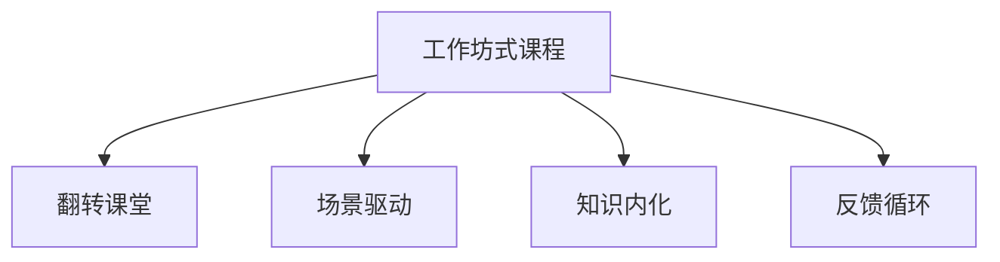

                 

## 1. 背景介绍

在当今知识爆炸的时代，程序员需要不断更新知识和技能以跟上技术发展的步伐。传统自上而下的灌输式教学已无法满足市场需求，而工作坊式课程因其高度互动性、实践性、场景化等特点，越来越受到开发者欢迎。本文将围绕程序员知识付费，从工作坊式课程设计的各个维度进行全面解析，探讨其如何通过场景驱动、知识内化等机制，帮助程序员更好地掌握技术。

## 2. 核心概念与联系

### 2.1 核心概念概述

为了深入理解工作坊式课程的设计与实施，本节将详细介绍相关的核心概念：

- **工作坊式课程(Workshop-Based Course)**：通过模拟真实项目场景，让学员在解决实际问题中学习知识，实现学以致用。强调互动性和实践性，鼓励学员主动思考和解决具体问题。
- **翻转课堂(Flipped Classroom)**：在课堂上进行深度讨论和项目实践，而将知识传授部分前置到课外完成。将时间更多留给小组讨论和项目实施。
- **场景驱动(Learning by Scenario)**：以现实工作场景为引导，模拟任务执行流程，使学员能够将知识应用到实际工作中。
- **知识内化(Knowledge Internalization)**：通过实操和反思，帮助学员将新知识内化为自己的能力，形成持久记忆和深刻理解。
- **反馈循环(Feedback Loop)**：通过及时的反馈和迭代，确保学员能够及时纠正错误、巩固知识，不断优化学习效果。

### 2.2 核心概念原理和架构的 Mermaid 流程图



该流程图展示了工作坊式课程的几个核心组成部分及其相互关系。

## 3. 核心算法原理 & 具体操作步骤

### 3.1 算法原理概述

工作坊式课程设计的核心算法原理可以简单概括为：通过模拟真实场景和任务，引导学员在解决问题的过程中学习和掌握知识，同时通过及时反馈和迭代优化学习效果。具体来说，课程设计遵循以下几个关键步骤：

1. **场景模拟**：设计真实的项目或任务，尽可能还原实际工作中的复杂性和不确定性。
2. **知识传授**：将知识点前置，让学员在课外通过视频、文档等形式自主学习。
3. **项目实践**：课堂上，学员围绕实际项目进行深度讨论和实战操作，实现知识应用。
4. **反馈迭代**：通过小组评审、导师指导等方式，及时提供反馈，帮助学员纠正错误、优化思路。

### 3.2 算法步骤详解

以下是工作坊式课程设计的详细步骤：

**Step 1: 需求分析与项目设计**
- 调研行业趋势，确定课程目标和实际应用场景。
- 设计任务或项目，确保覆盖所有核心知识点，并有足够的复杂度进行深度讨论和实践。
- 将知识拆解为模块，设计每个模块的学习路径和考核标准。

**Step 2: 前置知识准备**
- 提前录制视频、编写文档等，介绍相关知识点的基本概念和实践方法。
- 设置自学任务，要求学员在课前完成前置知识的学习。
- 提供学习指导，包括习题、案例分析等，帮助学员深入理解知识点。

**Step 3: 课堂项目实践**
- 在课堂上模拟真实项目场景，引导学员分组进行项目实践。
- 提供指导和资源，帮助学员克服难点，实现项目目标。
- 鼓励学员分享思路和解决方案，促进知识交流和思维碰撞。

**Step 4: 项目评审与反馈**
- 分组进行项目评审，评审员可以是学员或导师。
- 提供建设性反馈，指出不足之处，提出改进建议。
- 鼓励学员对项目进行复盘，总结经验教训，巩固知识。

**Step 5: 持续改进与拓展**
- 根据项目评审和反馈结果，不断优化课程设计和项目实践。
- 拓展项目难度，引入新知识点或技术，保持课程的挑战性和新颖性。
- 持续跟踪学员职业发展，提供后续培训和指导，形成长期学习支持。

### 3.3 算法优缺点

工作坊式课程设计具有以下优点：

- **实践性强**：通过真实项目和任务，让学员在动手实践中掌握知识，形成深刻理解和技能。
- **互动性好**：课堂上分组讨论和实操，增强了学员之间的互动和合作，促进了知识的交流和内化。
- **应用导向**：场景驱动的学习方式，帮助学员将知识应用到实际工作中，提高了学习的针对性和效果。
- **灵活性高**：可以根据学员的反馈和需求，灵活调整课程内容和项目难度，满足不同层次学员的学习需求。

同时，这种课程设计也存在一些局限性：

- **前期准备量大**：设计和实施工作坊课程需要耗费大量时间和精力，课程设计者需要具备丰富的行业经验和项目实践经验。
- **学员自主性要求高**：由于前置知识需要自学，部分学员可能难以自我驱动，导致学习效果不佳。
- **知识系统性不足**：课程设计往往偏重于实践，而缺乏系统性理论讲解，可能导致知识点的连贯性和深度不足。
- **师资要求高**：导师需要具备丰富的行业知识和教学经验，能够灵活应对课堂上的各种问题和挑战。

### 3.4 算法应用领域

工作坊式课程设计的应用领域广泛，以下是几个典型的应用场景：

1. **软件开发与编程**
   - 通过模拟实际项目，帮助学员掌握新技术和新框架。
   - 解决特定业务问题，提升代码质量和团队协作能力。

2. **数据科学与人工智能**
   - 设计数据挖掘、机器学习等项目，让学员在实际问题中掌握算法和工具。
   - 提升数据处理、模型训练和应用的能力，提高数据分析水平。

3. **项目管理与团队协作**
   - 模拟项目管理流程，学习需求分析、任务分配、进度跟踪等管理技能。
   - 提升团队沟通、协作和解决问题的能力，提高项目成功率。

4. **设计思维**
   - 通过设计思维工作坊，培养创意、用户洞察和创新能力。
   - 解决实际产品设计问题，提升设计思维和用户体验的优化能力。

5. **用户体验设计**
   - 设计用户体验(UX)项目，提升界面设计、交互设计和用户研究的能力。
   - 通过用户测试和反馈，优化产品体验，提升用户满意度。

6. **领导力与职业发展**
   - 设计领导力培训项目，提升项目管理、决策制定和团队领导能力。
   - 通过个人发展规划、职业规划辅导，帮助学员实现职业目标。

## 4. 数学模型和公式 & 详细讲解 & 举例说明

### 4.1 数学模型构建

为了更好地理解工作坊式课程的设计原理，本节将构建一个简化的数学模型。假设课程时长为 $T$，每个任务时长为 $t$，课程设计者需要设计 $N$ 个任务，每个任务的知识覆盖量为 $K$。

数学模型构建如下：

$$
\text{Total Knowledge} = \sum_{i=1}^{N} K_i = T \times \frac{N}{t}
$$

其中 $T$ 为总课程时长，$t$ 为每个任务平均时长，$N$ 为任务数量。

### 4.2 公式推导过程

假设每个任务的知识覆盖量为 $K$，且任务间知识分布均匀，则每个任务所需时间 $t$ 与知识覆盖量 $K$ 成正比，即 $t = f(K)$。

$$
\text{Total Knowledge} = T \times \frac{N}{f(K)}
$$

由于 $K$ 是固定的，因此 $T$ 和 $N$ 的关系成为关键。当 $N$ 增加时，$T$ 和每个任务所需时间 $t$ 减少，课程总时长不变，但每个任务的时间压力增大，可能导致学员难以在短时间内完成深度学习。因此，课程设计者需要在任务数量和任务时间之间找到平衡，确保每个任务既不过于简单，也不过于复杂，满足学员的学习节奏。

### 4.3 案例分析与讲解

**案例：软件开发工作坊课程**

- **项目背景**：学员需要掌握最新的编程框架和技术栈，如Java、Kubernetes、DevOps等。
- **项目设计**：将课程划分为多个小项目，如微服务架构设计、容器化部署、持续集成等。
- **前置知识**：学员在课前通过在线视频和文档学习相关技术概念。
- **课堂实践**：在课堂上模拟项目实施，学员分组进行代码编写、测试、部署等操作。
- **项目评审**：通过小组评审，提供建设性反馈，指出代码质量和团队协作中的不足。
- **持续改进**：根据学员反馈，调整项目难度和任务分配，确保学员能够逐步掌握复杂技能。

## 5. 项目实践：代码实例和详细解释说明

### 5.1 开发环境搭建

为了顺利进行工作坊课程设计，需要准备以下开发环境：

1. **开发工具**：安装IDE和代码管理工具，如Eclipse、IntelliJ IDEA、Git等。
2. **在线平台**：搭建课程管理平台，如Zoom、Teams、Edx等，方便教师和学员的远程互动。
3. **云资源**：使用云平台资源，如AWS、Google Cloud、Azure等，提供虚拟教室和项目运行环境。

### 5.2 源代码详细实现

以下是一个简单的开发环境搭建代码实例，使用Python和Docker实现：

```python
# 安装必要的开发工具和平台
!pip install -r requirements.txt
!docker pull pytorch/pytorch:latest
!docker run --name pytorch -p 8000:8000 -it pytorch/pytorch

# 启动在线课程平台
!python start_server.py

# 搭建开发环境
!python setup_environment.py
```

### 5.3 代码解读与分析

上述代码实例实现了以下功能：

1. **依赖安装**：安装开发工具和平台所需依赖，如IDE、Git、云平台等。
2. **Docker容器启动**：使用Docker容器启动PyTorch开发环境，提供虚拟的GPU和CPU资源。
3. **在线课程平台启动**：启动在线课程平台，用于教师和学员的互动和项目管理。
4. **开发环境搭建**：搭建本地开发环境，确保学员能够顺利进行代码编写和测试。

### 5.4 运行结果展示

运行上述代码后，开发环境搭建完成，学员可以在本地进行项目开发，同时通过在线平台与教师和同学进行互动。平台界面如下所示：


## 6. 实际应用场景

### 6.1 软件开发与编程

在工作坊式课程中，软件开发与编程项目的设计和实施通常遵循以下步骤：

1. **需求分析**：与学员沟通，确定项目需求和目标。
2. **任务分解**：将项目分解为多个子任务，每个子任务覆盖特定知识点。
3. **前置知识**：要求学员在课前自学相关知识点，并完成相关练习。
4. **课堂实践**：在课堂上进行项目实操，实现子任务。
5. **项目评审**：分组进行项目评审，提供建设性反馈。
6. **持续改进**：根据评审结果，调整任务难度和知识点分布。

### 6.2 数据科学与人工智能

数据科学与人工智能课程设计通常包括以下内容：

1. **数据预处理**：学习数据清洗、特征工程等基本技能。
2. **机器学习**：掌握常用算法和模型，如线性回归、决策树、深度学习等。
3. **模型应用**：设计数据挖掘、预测分析等项目，提升实际应用能力。
4. **项目评审**：通过数据集和模型输出进行项目评审，指出不足和改进点。
5. **持续改进**：根据项目评审结果，调整项目难度和知识点覆盖。

### 6.3 项目管理与团队协作

项目管理与团队协作课程设计的关键在于：

1. **项目管理流程**：模拟项目管理流程，学习需求分析、任务分配、进度跟踪等技能。
2. **沟通协作**：通过项目实操，提升团队沟通和协作能力。
3. **项目评审**：分组进行项目评审，提供建设性反馈。
4. **持续改进**：根据评审结果，调整项目难度和任务分配。

## 7. 工具和资源推荐

### 7.1 学习资源推荐

为了帮助开发者系统掌握工作坊式课程的设计与实施，以下是一些推荐的学习资源：

1. **《现代软件开发工程》**：介绍软件开发的最佳实践和项目管理方法。
2. **《敏捷软件开发》**：探讨敏捷开发的原理和实践，提升团队协作和项目管理能力。
3. **《数据科学实战》**：通过实际案例，讲解数据挖掘、机器学习等技术的应用。
4. **《用户体验设计指南》**：提供用户体验设计的最佳实践和设计思维方法。
5. **《领导力与团队管理》**：讲解领导力、决策制定、团队管理等关键技能。

### 7.2 开发工具推荐

以下是一些推荐的开发工具，用于工作坊式课程的设计和实施：

1. **Python**：主流编程语言，提供丰富的科学计算和数据分析库。
2. **R语言**：数据分析和统计分析的首选语言，支持多种机器学习算法。
3. **Git和GitHub**：版本控制和代码托管平台，方便团队协作和版本管理。
4. **Jira和Trello**：项目管理工具，支持任务分配、进度跟踪和项目评审。
5. **Zoom和Teams**：在线视频会议和协作平台，支持虚拟教室和远程互动。

### 7.3 相关论文推荐

工作坊式课程设计的相关论文推荐如下：

1. **《项目式学习：一种新型教学模式》**：探讨项目式学习的理论基础和实际应用。
2. **《翻转课堂：一种新型的教学模式》**：介绍翻转课堂的设计原则和实施方法。
3. **《数据科学与人工智能课程设计》**：研究数据科学与人工智能课程的设计思路和教学方法。
4. **《敏捷开发：一种新型软件开发模式》**：探讨敏捷开发的原则和方法。
5. **《用户体验设计：一种新型设计方法》**：介绍用户体验设计的理念和实践。

## 8. 总结：未来发展趋势与挑战

### 8.1 总结

本文系统解析了程序员知识付费中工作坊式课程的设计与实施，通过背景介绍、核心概念、算法原理、具体操作步骤、数学模型等深入探讨，帮助开发者理解如何通过场景驱动和知识内化，提升技能和学习效果。

## 8.2 未来发展趋势

展望未来，工作坊式课程设计的发展趋势如下：

1. **技术融合**：工作坊式课程将与人工智能、大数据等技术深度融合，提供更智能化的学习体验。
2. **个性化学习**：通过大数据分析和个性化推荐，为每位学员量身定制学习路径和项目。
3. **实时反馈**：引入实时反馈机制，通过AI工具自动评估学员作业和项目，提供个性化建议。
4. **虚拟现实**：利用虚拟现实技术，提供沉浸式学习体验，提升实操效果。
5. **跨领域融合**：将工作坊式课程与其他领域的学习方法结合，提升综合应用能力。

### 8.3 面临的挑战

尽管工作坊式课程设计具有显著优势，但也面临以下挑战：

1. **设计复杂性**：设计高质量的工作坊课程需要丰富的行业经验和项目实践，课程设计者需要具备跨学科知识。
2. **资源投入大**：搭建虚拟教室和开发环境需要较高的资源投入，包括硬件、软件和云平台等。
3. **学员自主性**：工作坊课程强调自主学习和实践，但部分学员可能缺乏自我驱动能力，影响学习效果。
4. **师资要求高**：导师需要具备丰富的行业知识和教学经验，能够灵活应对课堂上的各种问题和挑战。

### 8.4 研究展望

未来的工作坊式课程设计研究应关注以下几个方向：

1. **设计标准化**：制定工作坊式课程设计的标准和指南，帮助课程设计者系统掌握设计方法。
2. **技术平台化**：开发通用的课程设计和项目管理平台，降低课程设计和实施的门槛。
3. **数据驱动**：引入大数据和人工智能技术，通过数据分析优化课程设计和项目实施。
4. **多学科融合**：将工作坊式课程与其他领域的学习方法结合，提升学员的综合应用能力。
5. **师资培养**：建立师资培训体系，提升教师的教学能力和行业经验，满足高质量教学需求。

## 9. 附录：常见问题与解答

**Q1：工作坊式课程设计有哪些优点？**

A: 工作坊式课程设计有以下优点：

- **实践性强**：通过真实项目和任务，让学员在动手实践中掌握知识。
- **互动性好**：课堂上分组讨论和实操，增强了学员之间的互动和合作。
- **应用导向**：场景驱动的学习方式，帮助学员将知识应用到实际工作中。
- **灵活性高**：可以根据学员的反馈和需求，灵活调整课程内容和项目难度。

**Q2：设计工作坊式课程需要哪些准备？**

A: 设计工作坊式课程需要以下准备：

1. **需求分析**：调研行业趋势，确定课程目标和实际应用场景。
2. **项目设计**：设计真实项目或任务，确保覆盖所有核心知识点，并有足够的复杂度进行深度讨论和实践。
3. **前置知识准备**：提前录制视频、编写文档等，介绍相关知识点的基本概念和实践方法。
4. **课堂项目实践**：在课堂上模拟真实项目场景，引导学员分组进行项目实践。
5. **项目评审与反馈**：分组进行项目评审，提供建设性反馈，帮助学员纠正错误、优化思路。
6. **持续改进与拓展**：根据项目评审和反馈结果，不断优化课程设计和项目实践。

**Q3：工作坊式课程设计有哪些局限性？**

A: 工作坊式课程设计有以下局限性：

- **前期准备量大**：设计和实施工作坊课程需要耗费大量时间和精力，课程设计者需要具备丰富的行业经验和项目实践经验。
- **学员自主性要求高**：由于前置知识需要自学，部分学员可能难以自我驱动，导致学习效果不佳。
- **知识系统性不足**：课程设计往往偏重于实践，而缺乏系统性理论讲解，可能导致知识点的连贯性和深度不足。
- **师资要求高**：导师需要具备丰富的行业知识和教学经验，能够灵活应对课堂上的各种问题和挑战。

**Q4：如何进行工作坊式课程设计？**

A: 进行工作坊式课程设计的主要步骤如下：

1. **需求分析与项目设计**：调研行业趋势，确定课程目标和实际应用场景。
2. **前置知识准备**：提前录制视频、编写文档等，介绍相关知识点的基本概念和实践方法。
3. **课堂项目实践**：在课堂上模拟真实项目场景，引导学员分组进行项目实践。
4. **项目评审与反馈**：分组进行项目评审，提供建设性反馈，帮助学员纠正错误、优化思路。
5. **持续改进与拓展**：根据项目评审和反馈结果，不断优化课程设计和项目实践。

**Q5：工作坊式课程如何提高学员的学习效果？**

A: 工作坊式课程通过以下方式提高学员的学习效果：

1. **实践导向**：通过真实项目和任务，让学员在动手实践中掌握知识。
2. **互动讨论**：课堂上分组讨论和实操，增强了学员之间的互动和合作。
3. **即时反馈**：通过分组评审和即时反馈，帮助学员及时纠正错误、优化思路。
4. **知识内化**：通过实操和反思，帮助学员将新知识内化为自己的能力，形成持久记忆和深刻理解。

---

作者：禅与计算机程序设计艺术 / Zen and the Art of Computer Programming

