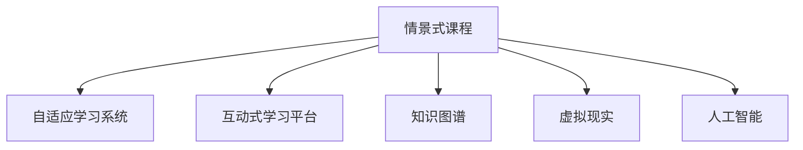

                 

## 1. 背景介绍

### 1.1 问题由来
随着互联网和移动设备的普及，在线教育成为越来越多人的选择。然而，传统的在线课程往往存在知识更新慢、内容枯燥、互动性差等缺点，难以吸引学员的注意力。如何打造更加生动、实用、互动的在线课程，成为了教育平台和机构亟待解决的问题。

近年来，知识付费领域的兴起，为教育模式的创新提供了新的思路。许多平台开始尝试将付费课程与情景式学习（Scenario-based Learning）结合起来，通过创建丰富多样的学习情境，提高学员的学习兴趣和效果。本文将围绕情景式课程的构建，系统探讨其核心概念与技术实现，为在线教育从业者提供全面的指导。

### 1.2 问题核心关键点
情景式课程（Scenario-based Course）的核心在于将知识与实际场景紧密结合，通过模拟真实生活和工作环境，提高学员的沉浸感和参与度。其核心关键点包括：

- 真实场景模拟：通过构建真实的生活和工作场景，使学员身临其境，增强学习效果。
- 互动性强：情景式课程通过互动问答、小组讨论、实践练习等方式，提高学员的参与度和兴趣。
- 自适应学习：通过个性化的学习路径和推荐，使学员能够自主选择学习内容和进度。
- 知识关联性强：情景式课程通过跨学科、跨领域的知识整合，提高学员的综合素质和应用能力。

这些核心关键点共同构成了情景式课程的技术实现框架，使其能够在各种场景下发挥强大的教育效用。

## 2. 核心概念与联系

### 2.1 核心概念概述

为了更好地理解情景式课程的构建原理，本节将介绍几个密切相关的核心概念：

- 情景式课程（Scenario-based Course）：一种基于情景模拟的在线课程设计模式，通过创造真实生活或工作场景，引导学员在实际应用中掌握知识。
- 自适应学习系统（Adaptive Learning System）：根据学员的学习行为和能力，动态调整课程内容和难度，实现个性化教学。
- 互动式学习平台（Interactive Learning Platform）：通过互动问答、小组讨论、实践练习等方式，提高学员的参与度和学习效果。
- 知识图谱（Knowledge Graph）：一种结构化的知识表示方式，用于描述知识之间的关系和层次，支持知识关联和检索。
- 虚拟现实（Virtual Reality, VR）：通过创建沉浸式的虚拟环境，增强情景式课程的真实感和体验感。
- 人工智能（AI）：通过机器学习、自然语言处理等技术，实现情景式课程的个性化推荐和智能辅助。

这些核心概念之间的逻辑关系可以通过以下Mermaid流程图来展示：



这个流程图展示情景式课程的核心概念及其之间的关系：

1. 情景式课程通过创造真实生活或工作场景，引导学员在实际应用中掌握知识。
2. 自适应学习系统根据学员的学习行为和能力，动态调整课程内容和难度，实现个性化教学。
3. 互动式学习平台通过互动问答、小组讨论、实践练习等方式，提高学员的参与度和学习效果。
4. 知识图谱用于描述知识之间的关系和层次，支持知识关联和检索。
5. 虚拟现实通过创建沉浸式的虚拟环境，增强情景式课程的真实感和体验感。
6. 人工智能通过机器学习、自然语言处理等技术，实现情景式课程的个性化推荐和智能辅助。

这些概念共同构成了情景式课程的技术实现框架，使其能够在各种场景下发挥强大的教育效用。

## 3. 核心算法原理 & 具体操作步骤
### 3.1 算法原理概述

情景式课程的构建，本质上是一个结合教育学和计算机科学的应用场景设计过程。其核心思想是：将知识与实际场景紧密结合，通过模拟真实生活和工作环境，使学员在情境中主动探索、学习，实现知识的迁移应用。

形式化地，假设情景式课程的内容为 $S$，对应的情景模拟为 $E$，学员的学习行为和能力为 $L$，则情景式课程设计的目标是最小化学员的学习成本，即：

$$
\min_{S,E} \mathcal{C}(L) = \sum_{i=1}^N \mathcal{L}_i(L)
$$

其中 $\mathcal{L}_i(L)$ 为第 $i$ 个学员的学习效果，可以通过测试、实践等方式衡量。目标函数 $\mathcal{C}(L)$ 表示总的学习成本，包括课程设计成本、学员学习成本等。

通过梯度下降等优化算法，课程设计者不断调整情景 $E$ 和内容 $S$，最小化学习成本，使学员的学习效果最大化。由于情景式课程的目标是使学员在真实情境中学习，因此情景模拟和内容设计必须高度契合学员的实际应用场景，才能真正达到预期的学习效果。

### 3.2 算法步骤详解

情景式课程的构建一般包括以下几个关键步骤：

**Step 1: 情景建模**
- 分析目标任务，确定需要掌握的知识点和技能点。
- 根据知识点的复杂度，划分不同的情景阶段，如入门、进阶、实战等。
- 设计具体的模拟情景，包括角色设定、任务描述、环境设置等，使情景尽可能接近真实生活或工作环境。

**Step 2: 学习路径设计**
- 根据情景阶段和学习目标，设计相应的学习路径，包括任务分配、时间规划、资源推荐等。
- 设定学习任务的难度和要求，通过自适应学习系统动态调整，使学员能够按照自己的节奏学习。
- 在每个学习路径节点上，设置评估和反馈机制，及时纠正学员的错误，提高学习效果。

**Step 3: 互动环节设计**
- 设计互动问答、小组讨论、实践练习等环节，使学员能够参与和互动，增强学习体验。
- 通过智能推荐系统，根据学员的学习行为和反馈，实时调整互动内容，提高互动效果。
- 使用游戏化设计，如积分、排名、徽章等，激励学员参与互动，增强学习动力。

**Step 4: 课程评估与反馈**
- 设计评估任务，通过测试、作业、实践等方式，评估学员的学习效果和掌握程度。
- 根据评估结果，调整课程内容和难度，使学员能够不断进步。
- 收集学员的反馈，持续改进课程设计，提高课程质量。

**Step 5: 上线与迭代**
- 将设计好的情景式课程上线，提供给学员使用。
- 持续监控学员的学习数据和反馈，进行课程迭代优化。
- 根据最新技术和教育理论，不断更新课程内容和设计，保持课程的先进性和实用性。

以上是情景式课程构建的一般流程。在实际应用中，还需要针对具体任务的特点，对课程设计过程的各个环节进行优化设计，如改进互动机制、增强评估体系、引入更多教学资源等，以进一步提升课程效果。

### 3.3 算法优缺点

情景式课程具有以下优点：
1. 提高学习兴趣：通过真实场景模拟，使学员在情境中学习，增强学习的趣味性和沉浸感。
2. 增强学习效果：通过实际应用和互动练习，使学员能够更好地掌握知识，提高学习效果。
3. 个性化教学：通过自适应学习系统，根据学员的学习行为和能力，动态调整课程内容和难度，实现个性化教学。
4. 跨学科整合：通过跨学科、跨领域的知识整合，提高学员的综合素质和应用能力。

同时，情景式课程也存在一些局限性：
1. 设计复杂度较高：课程设计需要大量的人力和时间，难度较大。
2. 技术实现难度大：情景式课程需要结合虚拟现实、人工智能等多种技术，技术实现复杂。
3. 成本较高：课程设计、技术实现和持续优化都需要较高投入，成本较高。
4. 难以量化评估：课程效果的评估较为复杂，难以进行客观的量化评估。

尽管存在这些局限性，但就目前而言，情景式课程在提高学习效果和用户体验方面，仍具有显著的优势。未来相关研究的重点在于如何进一步降低课程设计难度，提高技术实现的便捷性，同时兼顾课程效果的客观评估和量化。

### 3.4 算法应用领域

情景式课程在教育领域已经得到了广泛的应用，特别是在职业培训、在线教育、企业内训等领域，取得了显著的成效：

- 职业培训：如编程、设计、营销等技能培训，通过模拟实际工作场景，使学员在真实环境中掌握技能。
- 在线教育：如K-12教育、成人教育等，通过情景式课程设计，提高学员的学习兴趣和效果。
- 企业内训：如领导力培训、项目管理等，通过模拟企业环境，提高员工的业务能力和实战经验。

除了上述这些经典领域外，情景式课程还被创新性地应用到更多场景中，如智能游戏、虚拟实习、情景模拟竞赛等，为教育模式带来了新的创新方向。随着技术的发展和应用场景的扩展，情景式课程必将在更广泛的教育领域发挥更大的作用。

## 4. 数学模型和公式 & 详细讲解 & 举例说明
### 4.1 数学模型构建

本节将使用数学语言对情景式课程的构建过程进行更加严格的刻画。

假设情景式课程的内容为 $S$，对应的情景模拟为 $E$，学员的学习行为和能力为 $L$，则情景式课程设计的目标是最小化学员的学习成本，即：

$$
\min_{S,E} \mathcal{C}(L) = \sum_{i=1}^N \mathcal{L}_i(L)
$$

其中 $\mathcal{L}_i(L)$ 为第 $i$ 个学员的学习效果，可以通过测试、实践等方式衡量。目标函数 $\mathcal{C}(L)$ 表示总的学习成本，包括课程设计成本、学员学习成本等。

在实践中，我们通常使用基于梯度的优化算法（如SGD、Adam等）来近似求解上述最优化问题。设 $\eta$ 为学习率，$\lambda$ 为正则化系数，则课程设计者不断调整情景 $E$ 和内容 $S$，最小化学习成本，使学员的学习效果最大化。具体来说，课程设计者可以定义一个损失函数 $\mathcal{L}(L)$，用于衡量课程设计的效果，并通过梯度下降等优化算法不断调整 $E$ 和 $S$，使得 $\mathcal{L}(L)$ 最小化。

### 4.2 公式推导过程

以下我们以一个简单的情景式课程设计为例，推导课程设计过程中的一些关键公式。

假设情景式课程的目标任务为编程任务，具体流程如下：

1. 设计编程任务 $T$，包括任务描述、输入数据、任务目标等。
2. 将任务 $T$ 拆分成多个子任务，每个子任务对应一个情景阶段。
3. 根据每个子任务的特点，设计相应的情景模拟 $E_t$，包括环境设置、角色设定、任务描述等。
4. 在每个情景阶段 $t$ 上，设计相应的学习路径 $P_t$，包括任务分配、时间规划、资源推荐等。
5. 在每个学习路径节点上，设计互动问答、小组讨论、实践练习等环节，增强学员的参与度。
6. 设计评估任务 $A_t$，通过测试、作业、实践等方式，评估学员的学习效果。
7. 根据评估结果，调整课程内容和难度，使学员能够不断进步。

假设课程设计者有 $n$ 个情景模拟 $E_t$，$n$ 个学习路径 $P_t$，每个情景模拟的难度系数为 $d_t$，每个学习路径的学习效果为 $l_t$，则课程设计者需要最小化的目标函数为：

$$
\min_{E_t, P_t} \mathcal{C}(L) = \sum_{t=1}^n \alpha_t(d_t + \mathcal{L}(l_t))
$$

其中 $\alpha_t$ 为情景模拟 $E_t$ 和路径 $P_t$ 的权重，用于平衡情景模拟和路径学习的效果。

根据上述目标函数，我们可以通过梯度下降等优化算法，不断调整 $E_t$ 和 $P_t$，使得 $\mathcal{C}(L)$ 最小化。具体来说，课程设计者需要计算每个情景模拟和路径的学习效果，计算目标函数的梯度，并根据梯度方向调整 $E_t$ 和 $P_t$。

### 4.3 案例分析与讲解

为了更好地理解情景式课程的构建过程，我们以一个实际的编程任务为例，说明情景式课程的设计和实施过程。

假设目标任务为实现一个简单的需求分析报告，具体流程如下：

1. **设计编程任务 $T$**：
   - 任务描述：设计一份需求分析报告，包括需求描述、技术方案、用户需求等。
   - 输入数据：收集实际项目的项目文档和需求文档。
   - 任务目标：生成一份结构合理、内容完整的需求分析报告。

2. **设计情景模拟 $E_t$**：
   - 情景阶段 1：需求收集与分析
     - 角色设定：需求分析师、产品经理
     - 环境设置：模拟项目团队会议，通过问答形式收集需求
     - 任务描述：记录每个用户的需求和意见，整理成需求文档。
   - 情景阶段 2：需求设计
     - 角色设定：需求分析师、技术开发者
     - 环境设置：模拟技术讨论会议，通过问答形式讨论需求方案
     - 任务描述：设计需求文档的技术方案和架构，生成需求报告。
   - 情景阶段 3：需求评审
     - 角色设定：需求分析师、产品经理、技术开发者
     - 环境设置：模拟项目评审会议，通过问答形式进行需求评审
     - 任务描述：评审需求报告，提出改进建议，修正需求文档。

3. **设计学习路径 $P_t$**：
   - 情景阶段 1：需求收集与分析
     - 任务分配：分配需求分析师和产品经理，通过问答形式收集需求
     - 时间规划：每个环节需要 1 小时，共 3 小时
     - 资源推荐：提供需求分析工具，如JIRA、Confluence等
   - 情景阶段 2：需求设计
     - 任务分配：分配需求分析师和技术开发者，讨论需求方案
     - 时间规划：每个环节需要 2 小时，共 4 小时
     - 资源推荐：提供技术文档，如设计规范、架构方案等
   - 情景阶段 3：需求评审
     - 任务分配：分配需求分析师、产品经理和技术开发者，进行需求评审
     - 时间规划：每个环节需要 2 小时，共 6 小时
     - 资源推荐：提供评审工具，如Zoom、Slack等

4. **设计互动环节**：
   - 在每个情景阶段，设计互动问答、小组讨论、实践练习等环节，增强学员的参与度。例如，在需求收集与分析阶段，可以通过问答形式，引导学员思考如何收集和整理需求；在需求设计阶段，可以通过模拟技术讨论，引导学员设计需求方案和架构；在需求评审阶段，可以通过模拟评审会议，引导学员进行需求评审和修正。

5. **设计评估任务 $A_t$**：
   - 在每个情景阶段，设计评估任务，通过测试、作业、实践等方式，评估学员的学习效果。例如，在需求收集与分析阶段，可以要求学员提交需求文档，并由导师进行评审；在需求设计阶段，可以要求学员提交需求方案，并进行技术评审；在需求评审阶段，可以要求学员进行需求报告的编写和修改。

通过以上步骤，我们构建了一个完整的情景式课程，使学员在真实的情境中学习和掌握需求分析报告的编写技能。

## 5. 项目实践：代码实例和详细解释说明
### 5.1 开发环境搭建

在进行情景式课程开发前，我们需要准备好开发环境。以下是使用Python进行Flask开发的环境配置流程：

1. 安装Anaconda：从官网下载并安装Anaconda，用于创建独立的Python环境。

2. 创建并激活虚拟环境：
```bash
conda create -n course-env python=3.8 
conda activate course-env
```

3. 安装Flask：
```bash
pip install flask
```

4. 安装Flask-RESTful、Flask-SocketIO等库：
```bash
pip install flask-restful flask-socketio
```

5. 安装Flask-User、Flask-Login等用户认证和权限管理库：
```bash
pip install flask-user flask-login
```

完成上述步骤后，即可在`course-env`环境中开始情景式课程的开发。

### 5.2 源代码详细实现

下面我们以一个简单的编程任务为例，给出使用Flask开发的情景式课程的PyTorch代码实现。

首先，定义Flask应用程序和用户认证：

```python
from flask import Flask, render_template, request
from flask_user import UserMixin, UserManager, login_required
from flask_sqlalchemy import SQLAlchemy

app = Flask(__name__)
app.config['SQLALCHEMY_DATABASE_URI'] = 'sqlite:////home/username/.db'
app.config['SECRET_KEY'] = 'my_secret_key'
app.config['USER_ENABLE_EMAIL'] = False

db = SQLAlchemy(app)

class User(db.Model, UserMixin):
    id = db.Column(db.Integer, primary_key=True)
    username = db.Column(db.String(255), unique=True)
    email = db.Column(db.String(255), unique=True)
    password = db.Column(db.String(255))

user_manager = UserManager(app, User, db)

@app.route('/')
@login_required
def index():
    return render_template('index.html')

if __name__ == '__main__':
    app.run(debug=True)
```

然后，定义用户注册和登录逻辑：

```python
from flask_login import login_user

@app.route('/login', methods=['POST'])
def login():
    username = request.form.get('username')
    password = request.form.get('password')
    user = User.query.filter_by(username=username).first()
    if user and user.password == password:
        login_user(user)
        return redirect('/')
    else:
        return render_template('login.html', error='Invalid username or password')

@app.route('/logout')
@login_required
def logout():
    logout_user()
    return redirect('/')
```

接着，定义情景式课程的交互界面：

```python
from flask_socketio import SocketIO, emit

app = Flask(__name__)
app.config['SECRET_KEY'] = 'my_secret_key'
app.config['IOS_GZIP'] = True

socketio = SocketIO(app)

@app.route('/')
def index():
    return render_template('index.html')

@app.route('/start', methods=['POST'])
def start():
    username = request.form.get('username')
    task_id = request.form.get('task_id')
    socketio.emit('start', {'username': username, 'task_id': task_id})
    return redirect('/')

@app.route('/task', methods=['GET'])
@login_required
def task():
    task_id = request.args.get('task_id')
    task = Task.query.filter_by(id=task_id).first()
    return render_template('task.html', task=task)

@socketio.on('message')
def message(data):
    username = data['username']
    task_id = data['task_id']
    task = Task.query.filter_by(id=task_id).first()
    if task and task.status == 'ongoing':
        task.answering_username = username
        task.answer = data['answer']
        task.status = 'completed'
        task.save()
        emit('task_completed', {'task_id': task_id, 'username': username})
```

最后，启动Flask应用程序：

```python
if __name__ == '__main__':
    socketio.run(app, debug=True)
```

以上就是使用Flask开发情景式课程的基本代码实现。可以看到，通过Flask和SocketIO，我们构建了一个基本的交互式课程平台，使学员可以通过Flask应用程序和SocketIO接口进行情景式学习。

### 5.3 代码解读与分析

让我们再详细解读一下关键代码的实现细节：

**Flask应用程序和用户认证**：
- `app.config`：设置应用程序的配置项，包括数据库连接、密钥等。
- `User`类：定义用户模型，包含用户名、密码、电子邮件等属性。
- `UserManager`：用于管理用户的注册、登录、注销等功能。

**用户注册和登录逻辑**：
- `@app.route('/login', methods=['POST'])`：定义登录接口，通过表单提交用户名和密码进行登录。
- `login_user`：使用Flask-User库的登录方法，将用户信息存储到session中。

**情景式课程的交互界面**：
- `@app.route('/start', methods=['POST'])`：定义开始任务接口，通过表单提交用户名和任务ID，启动任务。
- `@app.route('/task', methods=['GET'])`：定义任务页面，根据任务ID查询任务信息并渲染页面。
- `@socketio.on('message')`：定义SocketIO接口，接收学员提交的解答信息，更新任务状态并广播完成任务的学员。

通过以上代码，我们构建了一个基本的情景式课程开发框架，学员可以通过Flask应用程序和SocketIO接口进行情景式学习。在实际应用中，我们还需要进一步优化用户界面、增加更多互动功能、引入更多的教学资源等，以提供更加丰富、实时的学习体验。

## 6. 实际应用场景
### 6.1 智能游戏
情景式课程在游戏设计中也得到了广泛应用。通过创建沉浸式的游戏场景，使玩家在游戏中掌握各种技能和知识，提高游戏的趣味性和教育性。

例如，一款编程教育游戏可以通过模拟软件开发流程，使玩家在实际开发中学习和掌握编程技能。游戏设计者可以根据任务复杂度，划分不同的游戏关卡，每个关卡对应一个情景阶段，通过问答、小组讨论、实践练习等方式，引导玩家在实际应用中掌握编程技能。

### 6.2 虚拟实习
虚拟实习是情景式课程在企业培训中的典型应用。通过创建虚拟的企业环境，使员工在虚拟情境中学习和掌握各种技能和知识，提高员工的业务能力和实战经验。

例如，一款虚拟银行实习系统可以通过模拟银行的日常业务，使实习员工在虚拟情境中学习和掌握银行业务技能。系统设计者可以根据银行业务流程，划分不同的实习环节，每个环节对应一个情景阶段，通过问答、小组讨论、实践练习等方式，引导实习员工在虚拟情境中掌握银行业务技能。

### 6.3 在线教育
在线教育平台也在积极引入情景式课程，通过创建丰富的学习情境，提高学员的学习兴趣和效果。

例如，一款编程教育平台可以通过模拟软件开发流程，使学员在实际开发中学习和掌握编程技能。平台设计者可以根据任务复杂度，划分不同的学习模块，每个模块对应一个情景阶段，通过问答、小组讨论、实践练习等方式，引导学员在实际应用中掌握编程技能。

### 6.4 未来应用展望
随着技术的不断发展，情景式课程将在更多领域得到应用，为教育模式带来新的变革。

在智慧城市治理中，情景式课程可以通过模拟城市管理场景，使学生和市民在虚拟情境中学习城市管理知识，提高城市管理水平。

在智慧医疗领域，情景式课程可以通过模拟医疗流程，使医生和护士在虚拟情境中学习医疗技能，提高医疗服务质量。

在智能游戏、虚拟实习、在线教育等领域，情景式课程必将在更广阔的应用场景中发挥更大的作用，为教育模式带来新的突破。随着技术的不断进步，情景式课程必将在未来的教育领域中扮演越来越重要的角色。

## 7. 工具和资源推荐
### 7.1 学习资源推荐

为了帮助开发者系统掌握情景式课程的构建原理和实践技巧，这里推荐一些优质的学习资源：

1. 《情景式课程设计与实践》系列博文：由教育技术专家撰写，深入浅出地介绍了情景式课程的设计原理、应用场景和实施方法。

2. 《自适应学习系统与教育技术》课程：由斯坦福大学开设的在线课程，涵盖自适应学习系统、教育技术等多个相关主题，是学习情景式课程设计的重要参考资料。

3. 《虚拟现实与教育应用》书籍：介绍虚拟现实技术在教育中的应用，通过丰富的案例分析，探讨虚拟现实在情景式课程中的实际应用。

4. 《人工智能与教育》书籍：介绍人工智能技术在教育中的应用，通过机器学习、自然语言处理等技术，探讨情景式课程设计的未来方向。

5. 《Khan Academy》平台：一个广泛使用的在线教育平台，通过情景式课程设计，提供丰富的教育资源和互动学习体验。

通过对这些资源的学习实践，相信你一定能够快速掌握情景式课程的构建原理和实践技巧，为在线教育平台带来更多的创新和突破。

### 7.2 开发工具推荐

高效的开发离不开优秀的工具支持。以下是几款用于情景式课程开发常用的工具：

1. Flask：基于Python的开源Web框架，灵活的路由设计和模板引擎，适合快速迭代研究。

2. SocketIO：用于实现实时通信的JavaScript库，支持WebSocket协议，实现实时交互和数据同步。

3. MongoDB：NoSQL数据库，支持分布式存储和数据索引，适合存储和查询大规模用户数据。

4. Redis：内存数据库，支持高速缓存和数据同步，适合存储和查询实时交互数据。

5. D3.js：基于JavaScript的数据可视化库，支持丰富的图表和动画效果，适合设计互动式学习界面。

6. Three.js：基于WebGL的3D渲染库，支持创建沉浸式虚拟现实场景，适合设计虚拟实习和情景模拟。

合理利用这些工具，可以显著提升情景式课程的开发效率，加快创新迭代的步伐。

### 7.3 相关论文推荐

情景式课程的研究始于学界对传统教育的反思和对新技术的探索。以下是几篇奠基性的相关论文，推荐阅读：

1. A Taxonomy of Learning by Doing：提出情景式学习的框架，探讨在真实情境中学习的多种方式。

2. Contextualized Neural Pre-training for Language Understanding：介绍BERT等预训练语言模型的构建方法，为情景式课程设计提供数据支持。

3. Deep Learning in Education：探讨深度学习技术在教育中的应用，特别是情景式课程的设计和实施。

4. Interactive Learning Environments for Education：介绍交互式学习环境的设计和实现，为情景式课程的开发提供技术支持。

5. Scenario-based Learning：总结情景式学习的理论和方法，探讨在各种情境下学习的可行性。

这些论文代表了大语言模型微调技术的发展脉络。通过学习这些前沿成果，可以帮助研究者把握学科前进方向，激发更多的创新灵感。

## 8. 总结：未来发展趋势与挑战

### 8.1 总结

本文对情景式课程的构建原理和实践技巧进行了全面系统的介绍。首先阐述了情景式课程的研究背景和意义，明确了情景式课程在提高学习效果和用户体验方面的独特价值。其次，从原理到实践，详细讲解了情景式课程的数学模型和关键步骤，给出了情景式课程开发的完整代码实例。同时，本文还广泛探讨了情景式课程在智能游戏、虚拟实习、在线教育等多个领域的应用前景，展示了情景式课程的巨大潜力。此外，本文精选了情景式课程的各类学习资源，力求为开发者提供全方位的技术指引。

通过本文的系统梳理，可以看到，情景式课程在教育领域已经得到了广泛的应用，特别在游戏、虚拟实习、在线教育等领域，取得了显著的成效。情景式课程通过创建真实场景模拟和互动学习环节，使学员在实际应用中掌握知识，提高了学习效果和用户体验。未来情景式课程必将在更广阔的教育领域发挥更大的作用，为教育模式的创新提供新的方向。

### 8.2 未来发展趋势

展望未来，情景式课程将呈现以下几个发展趋势：

1. 技术与教育深度融合：情景式课程将更加深入地与教育学、心理学、社会学等学科结合，形成更加科学、系统的课程设计理论。

2. 跨学科知识整合：情景式课程将更加注重跨学科、跨领域的知识整合，提高学员的综合素质和应用能力。

3. 个性化推荐系统：情景式课程将引入更多个性化推荐技术，根据学员的学习行为和能力，动态调整课程内容和难度，实现个性化教学。

4. 虚拟现实和增强现实：情景式课程将更多地利用虚拟现实、增强现实技术，创建沉浸式的学习环境，提高学习效果。

5. 实时数据与反馈：情景式课程将更多地利用大数据、人工智能等技术，实时分析学员的学习数据和反馈，优化课程设计和教学方法。

6. 多模态学习：情景式课程将更多地利用多模态学习技术，融合文本、图像、视频等多种形式的学习内容，提高学习效果。

以上趋势凸显了情景式课程的未来发展方向，必将推动教育模式的创新，为学习者带来更好的学习体验。

### 8.3 面临的挑战

尽管情景式课程在教育领域已经取得了显著成效，但在迈向更加智能化、普适化应用的过程中，它仍面临诸多挑战：

1. 课程设计复杂度：情景式课程的设计需要大量的时间和精力，难度较大，课程设计者需要具备较高的专业素养。

2. 技术实现难度：情景式课程需要结合虚拟现实、人工智能等多种技术，技术实现复杂。

3. 成本较高：情景式课程的设计、开发和持续优化都需要较高投入，成本较高。

4. 课程效果评估：情景式课程的效果评估较为复杂，难以进行客观的量化评估，需要更多的方法论和工具支持。

5. 学习资源丰富性：情景式课程需要丰富的学习资源和互动内容，课程设计者需要不断积累和更新资源库。

尽管存在这些挑战，但情景式课程在提高学习效果和用户体验方面，仍具有显著的优势。未来相关研究的重点在于如何进一步降低课程设计难度，提高技术实现的便捷性，同时兼顾课程效果的客观评估和量化。

### 8.4 研究展望

面对情景式课程所面临的挑战，未来的研究需要在以下几个方面寻求新的突破：

1. 引入更多先验知识：情景式课程需要引入更多的符号化先验知识，如知识图谱、逻辑规则等，引导微调过程学习更准确、合理的语言模型。

2. 加强跨学科整合：情景式课程需要更多地融合跨学科、跨领域的知识，提高学员的综合素质和应用能力。

3. 引入机器学习：情景式课程需要引入机器学习、自然语言处理等技术，实现情景式课程的个性化推荐和智能辅助。

4. 引入虚拟现实技术：情景式课程需要引入虚拟现实技术，创建沉浸式的学习环境，提高学习效果。

5. 引入多模态学习技术：情景式课程需要引入多模态学习技术，融合文本、图像、视频等多种形式的学习内容，提高学习效果。

这些研究方向将进一步推动情景式课程的发展，为教育模式的创新提供新的方向。随着技术的不断进步和应用的深入，情景式课程必将在未来的教育领域中发挥更大的作用。

## 9. 附录：常见问题与解答

**Q1：情景式课程与传统在线课程有什么区别？**

A: 情景式课程与传统在线课程的主要区别在于情景模拟和互动性。传统在线课程通常以视频、文章等单向内容为主，缺乏互动和情境模拟，学员的学习效果和参与度有限。情景式课程通过创建真实生活或工作场景，使学员在情境中学习，增强学习的趣味性和沉浸感，提高学习效果和参与度。

**Q2：情景式课程的实施需要哪些技术支持？**

A: 情景式课程的实施需要结合虚拟现实、人工智能等多种技术，具体包括以下几个方面：
1. 虚拟现实技术：创建沉浸式的虚拟环境，增强情景式课程的真实感和体验感。
2. 人工智能技术：通过机器学习、自然语言处理等技术，实现情景式课程的个性化推荐和智能辅助。
3. 自适应学习系统：根据学员的学习行为和能力，动态调整课程内容和难度，实现个性化教学。
4. 大数据分析：实时分析学员的学习数据和反馈，优化课程设计和教学方法。

**Q3：情景式课程的优点有哪些？**

A: 情景式课程的主要优点包括：
1. 提高学习兴趣：通过真实场景模拟，使学员在情境中学习，增强学习的趣味性和沉浸感。
2. 增强学习效果：通过实际应用和互动练习，使学员能够更好地掌握知识，提高学习效果。
3. 个性化教学：通过自适应学习系统，根据学员的学习行为和能力，动态调整课程内容和难度，实现个性化教学。
4. 跨学科整合：通过跨学科、跨领域的知识整合，提高学员的综合素质和应用能力。

**Q4：情景式课程的缺点有哪些？**

A: 情景式课程的主要缺点包括：
1. 课程设计复杂度较高：情景式课程的设计需要大量的时间和精力，难度较大。
2. 技术实现难度大：情景式课程需要结合虚拟现实、人工智能等多种技术，技术实现复杂。
3. 成本较高：情景式课程的设计、开发和持续优化都需要较高投入，成本较高。
4. 课程效果评估复杂：情景式课程的效果评估较为复杂，难以进行客观的量化评估。

通过以上问答，相信你已对情景式课程的构建原理和实践技巧有了更全面的了解。情景式课程通过创造真实生活或工作场景，使学员在情境中学习，增强学习的趣味性和沉浸感，提高学习效果和参与度。未来情景式课程必将在更广阔的教育领域发挥更大的作用，为教育模式的创新提供新的方向。

---

作者：禅与计算机程序设计艺术 / Zen and the Art of Computer Programming

