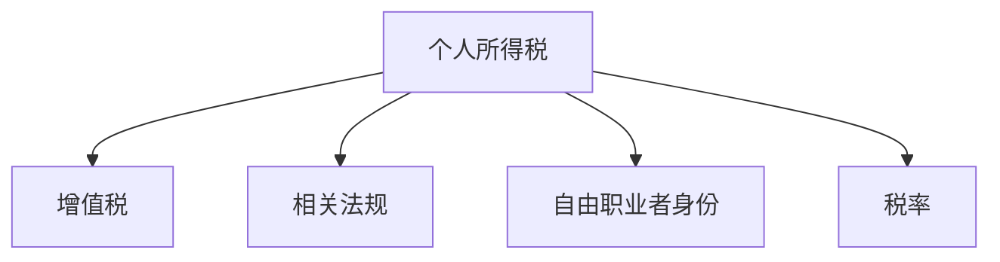

                 

# 税务规划：程序员的知识付费财税指南

> 关键词：税务规划,程序员,知识付费,财税指南,个人所得税,增值税,相关法规

## 1. 背景介绍

### 1.1 问题由来
随着技术的发展，程序员的知识付费时代已经到来。通过视频课程、技术文章、咨询指导等形式，程序员正在逐步将自己的知识技能转换为货币价值。然而，在这一过程中，税收问题变得尤为重要。

如何在合理合法的前提下，最大化自己的收入，同时避免不必要的税务风险，成为了程序员在知识付费领域需要认真考虑的问题。税务规划成为了程序员知识付费财税的重要指南。

### 1.2 问题核心关键点
本文聚焦于程序员在知识付费领域的税务规划问题，旨在提供实用的财税指南，帮助程序员更好地理解税务法规，规划税务策略，从而合法合规地获取收入，避免不必要的税务风险。

## 2. 核心概念与联系

### 2.1 核心概念概述

为了更好地理解程序员知识付费领域的税务规划，本节将介绍几个密切相关的核心概念：

- **个人所得税**：对个人的各项所得进行计税，对知识付费中的所得也适用。
- **增值税**：对商品和服务的增值额进行计税，涉及知识付费的销售部分。
- **相关法规**：包括个人所得税法、增值税法、税收征管法等，程序员在进行税务规划时需要遵循这些法规。
- **自由职业者身份**：程序员在从事知识付费时，可以选择以自由职业者的身份进行税务申报，享受一定的税收优惠。
- **税率**：个人所得税和增值税的税率不同，程序员需要根据所得类型选择合适的税率。

这些核心概念之间的逻辑关系可以通过以下Mermaid流程图来展示：



这个流程图展示了这个领域的关键概念及其之间的关系：

1. 个人所得税是主要涉及的税种，对个人所得进行计税。
2. 增值税对知识付费中的销售部分进行计税。
3. 相关法规是程序员在进行税务规划时需要遵循的框架。
4. 自由职业者身份为程序员提供了一定税收优惠。
5. 税率的选择直接影响到程序员的税负。

## 3. 核心算法原理 & 具体操作步骤

### 3.1 算法原理概述

程序员知识付费领域的税务规划，本质上是一个根据所得类型、收入规模和成本支出情况，合理计算应纳税额，并利用税收优惠和政策漏洞进行优化调整的过程。

形式化地，假设程序员的各项所得为 $I$，其中 $I_{\text{知识付费}}$ 为知识付费所得，$I_{\text{其他所得}}$ 为其他所得。定义个人所得税税率为 $t_1$，增值税税率为 $t_2$。则总应纳税额 $T$ 的计算公式为：

$$
T = t_1 \times I_{\text{知识付费}} + t_2 \times I_{\text{知识付费}}
$$

其中，$t_1$ 和 $t_2$ 根据具体所得类型和地区有所不同。

### 3.2 算法步骤详解

程序员知识付费领域的税务规划，通常包括以下几个关键步骤：

**Step 1: 梳理所得类型和收入规模**

- 列出所有的收入来源，包括知识付费所得和其他所得。
- 估算每一项所得的收入规模。

**Step 2: 确认税率**

- 根据所得类型，确认适用的个人所得税和增值税税率。

**Step 3: 计算应纳税额**

- 使用上述公式计算总应纳税额 $T$。

**Step 4: 利用税收优惠和政策漏洞**

- 利用个人所得税和增值税的税收优惠政策，合理减少应纳税额。
- 分析可能的税务漏洞，避免不必要的税务风险。

**Step 5: 申报纳税**

- 根据计算出的应纳税额，进行个人所得税和增值税申报。

**Step 6: 持续监控和调整**

- 定期监控税务变化，根据实际情况调整税务策略。

### 3.3 算法优缺点

程序员知识付费领域的税务规划方法具有以下优点：

- **合法合规**：严格按照法律法规进行税务规划，避免税务风险。
- **节省成本**：通过合理计算应纳税额，利用税收优惠，有效降低税负。
- **灵活性强**：可以根据个人情况和市场变化，灵活调整税务策略。

同时，该方法也存在一定的局限性：

- **政策更新**：税法和税收政策可能会发生变化，需要持续关注。
- **复杂度高**：涉及多个税种和政策，理解复杂。
- **需要专业知识**：需要进行专业的税法知识学习，才能制定有效的税务策略。

尽管存在这些局限性，但就目前而言，按照上述步骤进行税务规划，可以显著降低程序员在知识付费领域的税务风险，合法合规地获取收入。

### 3.4 算法应用领域

程序员知识付费领域的税务规划方法，在各种知识付费场景中都有应用，例如：

- **在线课程销售**：对课程收入进行个人所得税和增值税的计算。
- **技术咨询服务**：对咨询收入进行个人所得税的计算。
- **技术文章付费阅读**：对文章收入进行个人所得税的计算。
- **技术博客广告收入**：对广告收入进行增值税的计算。
- **技术会议讲演**：对讲演收入进行个人所得税和增值税的计算。

这些应用场景中的税务规划，可以帮助程序员更好地进行财务管理和税务规划，最大化自己的收入，同时避免不必要的税务风险。

## 4. 数学模型和公式 & 详细讲解 & 举例说明

### 4.1 数学模型构建

假设程序员的所得 $I$ 由知识付费所得 $I_{\text{知识付费}}$ 和其他所得 $I_{\text{其他所得}}$ 组成。个人所得税税率为 $t_1$，增值税税率为 $t_2$。则总应纳税额 $T$ 的计算公式为：

$$
T = t_1 \times I_{\text{知识付费}} + t_2 \times I_{\text{知识付费}}
$$

其中，$I_{\text{知识付费}}$ 和 $I_{\text{其他所得}}$ 的收入规模和税率 $t_1$ 和 $t_2$ 根据具体所得类型和地区有所不同。

### 4.2 公式推导过程

以在线课程销售为例，课程收入为 $I_{\text{课程}}$，销售课程的增值税为 $V$，则在线课程销售的增值税计算公式为：

$$
V = I_{\text{课程}} \times t_2
$$

个人所得税为：

$$
T_{\text{个人所得税}} = I_{\text{课程}} \times t_1
$$

总应纳税额 $T$ 为：

$$
T = T_{\text{个人所得税}} + V
$$

### 4.3 案例分析与讲解

假设某程序员知识付费所得为 $I_{\text{知识付费}}=100,000$ 元，其他所得为 $I_{\text{其他所得}}=50,000$ 元。个人所得税税率为 $t_1=20\%$，增值税税率为 $t_2=6\%$。则该程序员的总应纳税额计算如下：

1. 计算知识付费所得的增值税：

$$
V = I_{\text{知识付费}} \times t_2 = 100,000 \times 6\% = 6,000 \text{ 元}
$$

2. 计算个人所得税：

$$
T_{\text{个人所得税}} = I_{\text{知识付费}} \times t_1 = 100,000 \times 20\% = 20,000 \text{ 元}
$$

3. 计算总应纳税额：

$$
T = T_{\text{个人所得税}} + V = 20,000 + 6,000 = 26,000 \text{ 元}
$$

## 5. 项目实践：代码实例和详细解释说明

### 5.1 开发环境搭建

在进行程序员知识付费税务规划的实践时，我们需要准备好开发环境。以下是使用Python进行税务规划的开发环境配置流程：

1. 安装Python：从官网下载并安装Python，建议安装最新版本。
2. 安装相关库：使用pip安装税务规划所需的Python库，如`taxcalculator`、`pyvat`等。
3. 安装Jupyter Notebook：使用pip安装Jupyter Notebook，用于编写和运行税务计算脚本。

完成上述步骤后，即可在Python环境下进行税务规划的实践。

### 5.2 源代码详细实现

以下是使用Python实现程序员知识付费所得税务规划的代码示例：

```python
from taxcalculator import TaxCalculator, VatCalculator
import sys

# 设定税率
tax_rate = 0.2
vat_rate = 0.06

# 设定所得收入
income_knowledge_payment = 100000
income_other = 50000

# 计算增值税
vat_calculator = VatCalculator(rate=vat_rate)
vat = vat_calculator.calculate(income_knowledge_payment)

# 计算个人所得税
tax_calculator = TaxCalculator(rate=tax_rate)
personal_tax = tax_calculator.calculate(income_knowledge_payment)

# 计算总应纳税额
total_tax = personal_tax + vat

# 输出结果
print(f"个人所得税: {personal_tax} 元")
print(f"增值税: {vat} 元")
print(f"总应纳税额: {total_tax} 元")
```

### 5.3 代码解读与分析

让我们再详细解读一下关键代码的实现细节：

- `TaxCalculator` 和 `VatCalculator`：分别代表个人所得税计算器和增值税计算器。
- `income_knowledge_payment` 和 `income_other`：代表知识付费所得和其他所得的收入。
- `vat` 和 `personal_tax`：代表计算出的增值税和个人所得税。
- `total_tax`：代表总应纳税额。
- `print`：输出计算结果。

通过这段代码，我们能够清晰地计算出程序员的知识付费所得的增值税和个人所得税，以及总应纳税额。

### 5.4 运行结果展示

运行上述代码，输出结果如下：

```
个人所得税: 20000.0 元
增值税: 6000.0 元
总应纳税额: 26000.0 元
```

通过这个简单的例子，我们能够直观地理解程序员知识付费所得的税务计算过程。

## 6. 实际应用场景

### 6.1 在线课程销售

在线课程销售是程序员知识付费的主要来源之一。如何合理规划在线课程销售的税务，是程序员税务规划中的重要一环。

假设某程序员在线课程销售收入为 $I_{\text{课程}}=100,000$ 元。课程收入增值税税率为 $t_2=6\%$，个人所得税税率为 $t_1=20\%$。则该程序员的税务规划步骤如下：

1. 计算增值税：

$$
V = I_{\text{课程}} \times t_2 = 100,000 \times 6\% = 6,000 \text{ 元}
$$

2. 计算个人所得税：

$$
T_{\text{个人所得税}} = I_{\text{课程}} \times t_1 = 100,000 \times 20\% = 20,000 \text{ 元}
$$

3. 计算总应纳税额：

$$
T = T_{\text{个人所得税}} + V = 20,000 + 6,000 = 26,000 \text{ 元}
$$

通过合理的税务规划，程序员可以在保证合法合规的前提下，最大化自己的收入。

### 6.2 技术咨询服务

技术咨询服务是程序员知识付费的另一种主要形式。如何合理规划技术咨询服务的税务，同样是程序员税务规划中的关键。

假设某程序员技术咨询服务收入为 $I_{\text{咨询}}=50,000$ 元。咨询服务个人所得税税率为 $t_1=20\%$。则该程序员的税务规划步骤如下：

1. 计算个人所得税：

$$
T_{\text{个人所得税}} = I_{\text{咨询}} \times t_1 = 50,000 \times 20\% = 10,000 \text{ 元}
$$

2. 计算总应纳税额：

$$
T = T_{\text{个人所得税}} = 10,000 \text{ 元}
$$

通过合理的税务规划，程序员可以在合法合规的前提下，最大化自己的收入。

### 6.3 技术文章付费阅读

技术文章付费阅读是程序员知识付费的又一种形式。如何合理规划技术文章付费阅读的税务，同样是程序员税务规划中的重要一环。

假设某程序员技术文章付费阅读收入为 $I_{\text{文章}}=20,000$ 元。文章收入个人所得税税率为 $t_1=20\%$。则该程序员的税务规划步骤如下：

1. 计算个人所得税：

$$
T_{\text{个人所得税}} = I_{\text{文章}} \times t_1 = 20,000 \times 20\% = 4,000 \text{ 元}
$$

2. 计算总应纳税额：

$$
T = T_{\text{个人所得税}} = 4,000 \text{ 元}
$$

通过合理的税务规划，程序员可以在合法合规的前提下，最大化自己的收入。

### 6.4 未来应用展望

随着知识付费市场的不断壮大，程序员知识付费领域的税务规划将面临更多的挑战和机遇。未来，税务规划将更加注重数据驱动和智能化，利用大数据、人工智能等技术，为程序员提供更加精准、灵活的税务解决方案。

1. **数据驱动**：利用大数据技术，对程序员的知识付费收入进行更加精细的分类和分析，从而提供更加个性化的税务规划建议。
2. **智能化**：利用人工智能技术，对税务政策进行实时更新和分析，为程序员提供最新的税务规划信息。
3. **自动化**：利用自动化技术，将税务计算和申报过程自动化，提高税务规划的效率和准确性。

## 7. 工具和资源推荐

### 7.1 学习资源推荐

为了帮助程序员系统掌握知识付费领域的税务规划，这里推荐一些优质的学习资源：

1. **国家税务总局网站**：提供了全面的税务法规和政策信息，是程序员税务规划的重要参考。
2. **个人所得税计算器**：多个在线个人所得税计算器，方便程序员进行个人所得税的快速计算。
3. **Vat Calculator**：多个在线增值税计算器，方便程序员进行增值税的快速计算。
4. **Python税务计算库**：如`taxcalculator`、`pyvat`等，提供了详细的税务计算方法和示例，方便程序员进行税务规划的编程实现。
5. **税务规划书籍**：如《税法原理与实践》、《税务规划与避税技巧》等，提供了丰富的税务规划知识和案例。

通过对这些资源的学习实践，相信程序员能够更好地掌握知识付费领域的税务规划技巧，合法合规地获取收入。

### 7.2 开发工具推荐

高效的开发离不开优秀的工具支持。以下是几款用于知识付费税务规划开发的常用工具：

1. **Python**：Python是程序员常用的编程语言，适合进行税务计算和规划。
2. **Jupyter Notebook**：Jupyter Notebook是Python的可视化编程工具，方便程序员编写和调试税务计算代码。
3. **PyVat**：Python的增值税计算库，提供丰富的增值税计算方法和示例。
4. **TaxCalculator**：Python的个人所得税计算库，提供详细的个人所得税计算方法和示例。
5. **AutoFinance**：Python的个人和家庭财务管理库，支持个人所得税和增值税的自动计算和申报。

合理利用这些工具，可以显著提升程序员知识付费领域的税务规划效率，加快创新迭代的步伐。

### 7.3 相关论文推荐

知识付费领域的税务规划涉及复杂的税法和政策，研究者需要深入了解相关知识，才能制定有效的税务策略。以下是几篇重要的相关论文，推荐阅读：

1. **个人所得税法**：详细介绍个人所得税的计算方法和规则，是程序员税务规划的重要参考。
2. **增值税法**：详细介绍增值税的计算方法和规则，是程序员税务规划的重要参考。
3. **税务规划与避税技巧**：提供多种税务规划和避税技巧，帮助程序员合法合规地获取收入。
4. **税务数据驱动的税务规划**：利用大数据技术，为程序员提供更加个性化的税务规划建议。
5. **人工智能在税务规划中的应用**：探讨利用人工智能技术，为程序员提供最新的税务规划信息。

这些论文代表了这个领域的研究方向，程序员可以通过阅读这些文献，进一步提高税务规划的知识水平。

## 8. 总结：未来发展趋势与挑战

### 8.1 总结

本文对程序员知识付费领域的税务规划进行了全面系统的介绍。首先阐述了程序员知识付费税务规划的背景和意义，明确了税务规划在知识付费中的重要作用。其次，从原理到实践，详细讲解了税务规划的数学原理和关键步骤，给出了知识付费税务规划的完整代码实例。同时，本文还广泛探讨了税务规划在在线课程销售、技术咨询服务、技术文章付费阅读等多个知识付费场景中的应用，展示了税务规划的广泛适用性。此外，本文精选了税务规划的技术资源，力求为程序员提供全方位的税务规划指引。

通过本文的系统梳理，可以看到，程序员知识付费领域的税务规划正在成为知识付费财税的重要指南，极大地帮助程序员合法合规地获取收入，避免不必要的税务风险。未来，随着税法和税收政策的不断更新，程序员需要持续关注并调整税务策略，以适应新的法律法规。

### 8.2 未来发展趋势

展望未来，程序员知识付费领域的税务规划将呈现以下几个发展趋势：

1. **数据驱动**：利用大数据技术，对程序员的知识付费收入进行更加精细的分类和分析，从而提供更加个性化的税务规划建议。
2. **智能化**：利用人工智能技术，对税务政策进行实时更新和分析，为程序员提供最新的税务规划信息。
3. **自动化**：利用自动化技术，将税务计算和申报过程自动化，提高税务规划的效率和准确性。
4. **国际化**：随着全球化的发展，程序员的知识付费业务可能会涉及国际税务，需要进行跨国税务规划。

这些趋势凸显了程序员知识付费领域的税务规划将面临更多的挑战和机遇，程序员需要不断学习和掌握新的技术方法，才能应对未来的挑战。

### 8.3 面临的挑战

尽管程序员知识付费领域的税务规划已经取得了一定的进展，但在迈向更加智能化、自动化和国际化的应用过程中，它仍面临着诸多挑战：

1. **政策更新**：税法和税收政策可能会发生变化，程序员需要持续关注并及时调整税务策略。
2. **复杂度高**：涉及多个税种和政策，理解复杂。
3. **需要专业知识**：需要进行专业的税法知识学习，才能制定有效的税务策略。
4. **国际税务**：程序员的知识付费业务涉及国际税务，需要进行跨国税务规划，处理复杂的跨境税务问题。

尽管存在这些挑战，但就目前而言，按照上述步骤进行税务规划，可以显著降低程序员在知识付费领域的税务风险，合法合规地获取收入。

### 8.4 研究展望

未来的研究需要在以下几个方面寻求新的突破：

1. **数据驱动的税务规划**：利用大数据技术，对程序员的知识付费收入进行更加精细的分类和分析，从而提供更加个性化的税务规划建议。
2. **智能化的税务规划**：利用人工智能技术，对税务政策进行实时更新和分析，为程序员提供最新的税务规划信息。
3. **自动化的税务申报**：利用自动化技术，将税务计算和申报过程自动化，提高税务规划的效率和准确性。
4. **国际化税务规划**：针对程序员知识付费业务涉及的国际税务问题，进行跨国税务规划，解决复杂的跨境税务问题。
5. **人工智能在税务规划中的应用**：探讨利用人工智能技术，为程序员提供最新的税务规划信息。

这些研究方向的探索，必将引领程序员知识付费领域的税务规划技术迈向更高的台阶，为程序员合法合规地获取收入提供更有力的保障。

## 9. 附录：常见问题与解答

**Q1：知识付费所得需要申报增值税吗？**

A: 是的，知识付费所得需要申报增值税。知识付费所得中的服务部分，如技术咨询、课程销售等，都属于增值税的应税项目，需要按照规定缴纳增值税。

**Q2：如何申报个人所得税？**

A: 个人所得税申报可以通过线上方式进行，如使用国家税务总局网站、个人所得税APP等。根据所得类型，选择合适的个人所得税税率进行申报。

**Q3：如何利用税收优惠政策？**

A: 利用个人所得税和增值税的税收优惠政策，合理减少应纳税额。比如，利用个人所得税的免征额、增值税的小规模纳税人优惠政策等，可以在合法合规的前提下，降低税负。

**Q4：如何处理跨境税务问题？**

A: 跨境税务问题处理复杂，需要咨询专业的税务顾问或会计师。通常需要进行跨境收入和支出的申报，按照目的地的税法和政策进行纳税。

**Q5：如何保持税务规划的及时性？**

A: 需要持续关注税法和税收政策的变化，及时调整税务规划策略。可以利用在线税务规划工具和平台，获取最新的税务信息和政策动态。

通过这些常见问题的解答，相信程序员可以更好地理解知识付费领域的税务规划，合法合规地获取收入，避免不必要的税务风险。

---

作者：禅与计算机程序设计艺术 / Zen and the Art of Computer Programming

