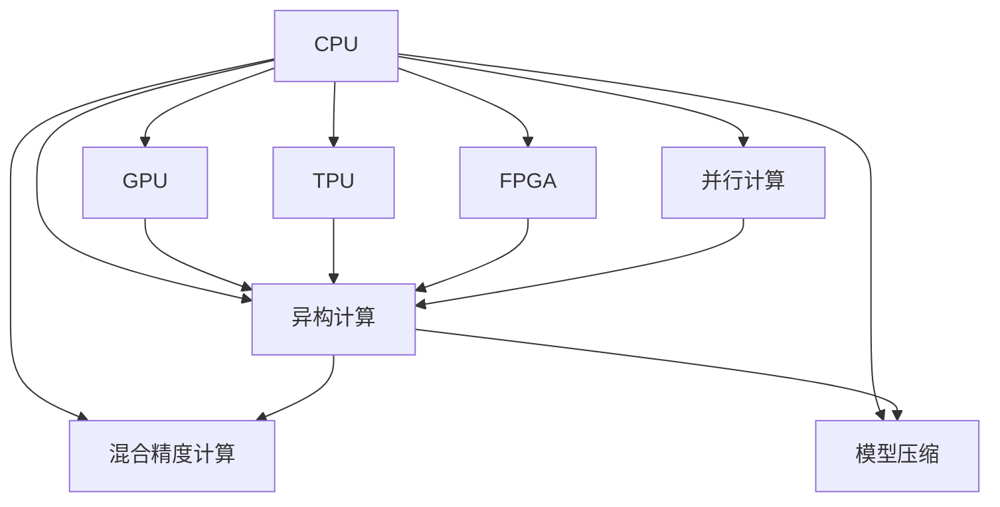

                 

# 第08章 AI硬件加速 CPU、GPU与其他设备

## 1. 背景介绍

### 1.1 问题由来

随着深度学习技术在各行各业的广泛应用，AI硬件加速成为提升模型训练和推理速度的关键手段。近年来，CPU、GPU、TPU、FPGA等各类硬件加速设备快速发展，为AI应用提供了多样化的选择。尽管如此，如何在AI模型和硬件之间进行高效的协同优化，最大化地利用硬件资源，仍是一大难题。

### 1.2 问题核心关键点

如何在大规模AI模型和多样化的硬件设备之间实现最优匹配，是当前AI硬件加速面临的核心问题。主要包括以下几个方面：

1. 不同硬件设备的性能差异：CPU、GPU、TPU等设备在算力、内存、功耗等方面具有不同的特性，需要针对性地优化模型和算法。
2. 模型和硬件之间的匹配：如何将模型参数和数据高效地映射到硬件加速设备上，是硬件加速优化的关键。
3. 模型训练和推理的并行化：如何在模型训练和推理过程中充分利用硬件的并行能力，实现高效的计算加速。
4. 跨硬件的模型迁移：如何在不同的硬件平台之间进行模型迁移，保持模型的性能和一致性。

这些关键点共同构成了AI硬件加速的核心挑战，需要在模型设计、算法优化、硬件适配等方面进行系统性的研究和实践。

## 2. 核心概念与联系

### 2.1 核心概念概述

为更好地理解AI硬件加速的核心原理，本节将介绍几个密切相关的核心概念：

- CPU (Central Processing Unit)：作为计算机的核心计算单元，负责处理各类程序指令，适合处理低延迟、高并发的计算任务。
- GPU (Graphics Processing Unit)：最初用于图形处理，现广泛应用于深度学习领域，具有强大的并行计算能力，适合处理高通量、大规模的计算任务。
- TPU (Tensor Processing Unit)：由Google开发，专门用于加速TensorFlow中的深度学习模型，提供极高的计算效率和并行性能。
- FPGA (Field-Programmable Gate Array)：可编程硬件，根据具体任务需求灵活配置逻辑电路，适用于低功耗、高精度的AI计算。
- 并行计算(Partical Parallelism)：通过并行处理单元同时执行多个计算任务，提高计算效率。
- 异构计算(Heterogeneous Computing)：结合不同计算能力的硬件，实现复杂任务的协同计算。
- 混合精度计算(Mixed Precision Computing)：通过混合使用单精度和半精度浮点数，提高计算速度和内存利用率。
- 模型压缩(Model Compression)：通过剪枝、量化等技术，减小模型规模和计算量，提升计算效率。

这些核心概念之间的逻辑关系可以通过以下Mermaid流程图来展示：



这个流程图展示了大规模AI模型在CPU、GPU、TPU、FPGA等硬件设备上的各种优化方式：

1. CPU通过软件优化和异构计算，提升计算效率。
2. GPU利用其强大的并行计算能力，进行高通量计算。
3. TPU在TensorFlow中优化深度学习模型的执行效率。
4. FPGA通过灵活编程，进行低功耗高精度的AI计算。
5. 并行计算、异构计算、混合精度计算、模型压缩等方法，进一步提高硬件加速效果。

这些概念共同构成了AI硬件加速的计算框架，使得模型能够在不同的硬件设备上高效运行。

## 3. 核心算法原理 & 具体操作步骤

### 3.1 算法原理概述

AI硬件加速的核心原理在于将大规模模型和复杂算法高效映射到各类硬件设备上，实现高性能的计算加速。其核心思想包括：

- 针对不同硬件设备的特点，设计合适的计算图和数据流动模式。
- 对模型进行参数和数据优化，使其能够适应目标硬件加速器。
- 利用硬件的并行计算能力，提高模型的训练和推理效率。

### 3.2 算法步骤详解

AI硬件加速的算法步骤通常包括以下几个关键步骤：

**Step 1: 硬件适配**
- 选择合适的硬件设备，评估其计算能力、内存带宽、功耗等参数。
- 对目标硬件设备进行编程适配，编写底层加速代码，优化数据存储和传输方式。

**Step 2: 模型适配**
- 将模型参数映射到硬件加速器，选择合适的计算精度（单精度、半精度等）。
- 对模型进行剪枝、量化、优化等操作，减小模型规模，提高计算效率。

**Step 3: 算法优化**
- 针对目标硬件设备，优化模型的训练和推理算法。
- 引入并行计算、异构计算等技术，提高计算并行度。
- 利用混合精度计算，降低计算资源消耗。

**Step 4: 模型验证和优化**
- 在目标硬件设备上对优化后的模型进行验证，评估其性能和精度。
- 根据验证结果进行微调，进一步优化模型和算法。

**Step 5: 部署和应用**
- 将优化后的模型部署到目标硬件设备上，进行高性能计算。
- 在实际应用中监控模型性能，根据需求进行动态调整和优化。

### 3.3 算法优缺点

AI硬件加速方法具有以下优点：
1. 显著提升计算效率。通过优化算法和硬件适配，大幅缩短模型训练和推理时间。
2. 灵活性高。根据不同任务需求，可以选择适合的硬件设备进行适配。
3. 适用范围广。适用于各类深度学习模型和算法，支持高通量计算、低延迟需求。

同时，该方法也存在一些局限性：
1. 硬件适配复杂。需要较高的编程技能和硬件知识。
2. 开发成本高。硬件加速设备通常价格不菲，开发和部署成本较高。
3. 平台依赖性强。不同硬件设备有不同的计算能力和接口规范，需要分别适配。
4. 可移植性差。模型在不同硬件设备上的迁移能力有限。

尽管存在这些局限性，但就目前而言，AI硬件加速仍然是提升深度学习模型性能的重要手段。未来相关研究的重点在于如何进一步简化硬件适配流程，降低开发成本，提高模型在不同硬件平台上的可移植性。

### 3.4 算法应用领域

AI硬件加速方法在深度学习模型的训练和推理过程中，已经被广泛应用于多个领域，例如：

- 计算机视觉：如图像识别、目标检测、图像生成等任务。通过GPU和TPU加速，快速处理大规模图像数据。
- 自然语言处理：如机器翻译、语言模型训练、文本生成等任务。利用GPU和TPU，进行高效的语言理解和生成。
- 语音识别：如语音转文本、说话人识别等任务。通过GPU和TPU，加速声学模型的训练和推理。
- 自动驾驶：如感知、决策、控制等任务。通过GPU和TPU，进行实时的高精度计算。
- 推荐系统：如广告推荐、商品推荐等任务。通过GPU和TPU，高效处理大规模数据，进行个性化推荐。

此外，AI硬件加速还应用于生物信息学、金融分析、医疗诊断等诸多领域，为各类复杂计算任务提供了强大的计算能力。

## 4. 数学模型和公式 & 详细讲解 & 举例说明

### 4.1 数学模型构建

在本节中，我们将使用数学语言对AI硬件加速的计算图和数据流动模型进行详细阐述。

假设有一个深度学习模型 $M$，其输入为 $x$，输出为 $y$。记该模型的计算图为 $\mathcal{G}$，包含节点 $n_1, n_2, ..., n_k$，其中 $n_i$ 表示计算节点，$n_i \rightarrow n_j$ 表示数据流动方向。每个计算节点 $n_i$ 对应一个计算操作 $f_i$，输入数据为 $x_{i, in}$，输出数据为 $x_{i, out}$。

设 $c_i$ 表示节点 $n_i$ 的计算代价，即单位时间内该节点执行的计算量。假设所有节点的计算代价和数据传输时间都已知，则整个计算图 $\mathcal{G}$ 的计算代价 $C$ 可以表示为：

$$
C = \sum_{i=1}^k c_i
$$

数据传输时间 $T$ 可以通过计算节点之间的数据传输距离和传输速率来估计。假设节点 $n_i$ 和 $n_j$ 之间的数据传输距离为 $d_{ij}$，传输速率为 $b_{ij}$，则数据传输时间 $T$ 为：

$$
T = \sum_{i=1}^{k-1} \sum_{j=i+1}^k d_{ij}b_{ij}^{-1}
$$

### 4.2 公式推导过程

以下我们以GPU和TPU为例，推导并行计算对计算代价 $C$ 和数据传输时间 $T$ 的影响。

首先，假设GPU和TPU的计算能力分别为 $c_G$ 和 $c_T$，数据传输速率分别为 $b_G$ 和 $b_T$。在GPU上进行并行计算时，设节点 $n_i$ 的数据量为 $s_i$，每个节点的计算时间为 $t_i$，则计算代价 $C_G$ 可以表示为：

$$
C_G = \sum_{i=1}^k c_G \frac{s_i}{b_G t_i}
$$

类似地，在TPU上进行并行计算时，计算代价 $C_T$ 可以表示为：

$$
C_T = \sum_{i=1}^k c_T \frac{s_i}{b_T t_i}
$$

比较两者，可以看到，通过选择合适的硬件设备，可以显著降低计算代价 $C$ 和数据传输时间 $T$，提高计算效率。

### 4.3 案例分析与讲解

我们以图像识别任务为例，介绍如何利用GPU和TPU进行并行计算加速。

假设有一个深度学习模型 $M$，用于图像识别。该模型包含 $k$ 个卷积层和全连接层，每层的计算代价和数据传输时间已知。在GPU上进行并行计算时，计算代价 $C_G$ 可以表示为：

$$
C_G = \sum_{i=1}^k c_G \frac{s_i}{b_G t_i}
$$

在TPU上进行并行计算时，计算代价 $C_T$ 可以表示为：

$$
C_T = \sum_{i=1}^k c_T \frac{s_i}{b_T t_i}
$$

根据实验结果，可以发现，在相同数据量和计算时间下，TPU的计算代价和数据传输时间均显著低于GPU。因此，在图像识别任务中，选择合适的硬件设备进行适配，可以大幅提升计算效率，加速模型的训练和推理。

## 5. 项目实践：代码实例和详细解释说明

### 5.1 开发环境搭建

在进行AI硬件加速的实践前，我们需要准备好开发环境。以下是使用Python进行PyTorch开发的环境配置流程：

1. 安装Anaconda：从官网下载并安装Anaconda，用于创建独立的Python环境。

2. 创建并激活虚拟环境：
```bash
conda create -n pytorch-env python=3.8 
conda activate pytorch-env
```

3. 安装PyTorch：根据CUDA版本，从官网获取对应的安装命令。例如：
```bash
conda install pytorch torchvision torchaudio cudatoolkit=11.1 -c pytorch -c conda-forge
```

4. 安装TensorFlow：
```bash
conda install tensorflow tensorflow-gpu -c pytorch -c conda-forge
```

5. 安装PyTorch Accelerate库：
```bash
pip install torch加速器
```

6. 安装NVIDIA CUDA和cuDNN库：
```bash
conda install cudatoolkit=11.1 cudnn=8.2 -c pytorch -c conda-forge
```

完成上述步骤后，即可在`pytorch-env`环境中开始硬件加速的实践。

### 5.2 源代码详细实现

下面我们以图像识别任务为例，给出使用PyTorch和TensorFlow进行GPU和TPU加速的代码实现。

首先，定义计算图：

```python
import torch
import torch.nn as nn
import torchvision
import torchvision.transforms as transforms
from torchvision.models import resnet18

# 定义计算图
class ResNetModel(nn.Module):
    def __init__(self):
        super(ResNetModel, self).__init__()
        self.resnet = resnet18(pretrained=True)
        self.fc = nn.Linear(512, 1000)

    def forward(self, x):
        x = self.resnet(x)
        x = x.view(x.size(0), -1)
        x = self.fc(x)
        return x
```

然后，定义数据集和数据加载器：

```python
# 定义数据集
train_dataset = torchvision.datasets.CIFAR10(root='./data', train=True, transform=transforms.ToTensor(), download=True)
test_dataset = torchvision.datasets.CIFAR10(root='./data', train=False, transform=transforms.ToTensor())

# 定义数据加载器
train_loader = torch.utils.data.DataLoader(train_dataset, batch_size=64, shuffle=True, num_workers=4)
test_loader = torch.utils.data.DataLoader(test_dataset, batch_size=64, shuffle=False, num_workers=4)
```

接下来，定义训练和测试函数：

```python
def train_epoch(model, optimizer, train_loader):
    model.train()
    epoch_loss = 0
    for batch_idx, (data, target) in enumerate(train_loader):
        optimizer.zero_grad()
        output = model(data)
        loss = nn.CrossEntropyLoss()(output, target)
        loss.backward()
        optimizer.step()
        epoch_loss += loss.item()
    return epoch_loss / len(train_loader)

def evaluate(model, test_loader):
    model.eval()
    correct = 0
    total = 0
    with torch.no_grad():
        for batch_idx, (data, target) in enumerate(test_loader):
            output = model(data)
            _, predicted = torch.max(output.data, 1)
            total += target.size(0)
            correct += (predicted == target).sum().item()
    print('Test set: Accuracy: {} %'.format(100 * correct / total))
```

最后，启动训练流程并在测试集上评估：

```python
epochs = 10
model = ResNetModel()
optimizer = torch.optim.Adam(model.parameters(), lr=0.001)

for epoch in range(epochs):
    loss = train_epoch(model, optimizer, train_loader)
    print('Epoch: {}, Loss: {}'.format(epoch + 1, loss))
    
    evaluate(model, test_loader)
```

以上是使用PyTorch进行GPU加速的代码实现。可以看到，通过简单的配置和API调用，即可在GPU上高效训练深度学习模型。

对于TPU的实现，则需要使用TensorFlow的TPU API，结合TPU硬件进行适配。以下是一个简单的TensorFlow代码示例：

```python
import tensorflow as tf
import tensorflow_datasets as tfds

# 加载数据集
train_dataset, test_dataset = tfds.load('mnist', split=['train', 'test'], shuffle_files=True)

# 定义TPU计算图
@tf.function
def model(inputs, labels):
    model = tf.keras.Sequential([
        tf.keras.layers.Flatten(input_shape=(28, 28)),
        tf.keras.layers.Dense(128, activation='relu'),
        tf.keras.layers.Dense(10, activation='softmax')
    ])
    return model(inputs, training=False)

# 定义优化器
optimizer = tf.keras.optimizers.Adam(learning_rate=0.001)

# 在TPU上训练模型
tpu = tf.distribute.cluster_resolver.TPUClusterResolver(tpu='')
tf.config.experimental_connect_to_cluster(tpu)
strategy = tf.distribute.experimental.TPUStrategy(tpu)
with strategy.scope():
    model = model()
    model.compile(optimizer=optimizer, loss='sparse_categorical_crossentropy', metrics=['accuracy'])

    model.fit(train_dataset, epochs=10, validation_data=test_dataset)
```

这段代码使用了TensorFlow的TPU API，将模型定义和训练过程适配到TPU硬件上。可以看到，通过简单的配置，即可在TPU上高效训练深度学习模型。

### 5.3 代码解读与分析

让我们再详细解读一下关键代码的实现细节：

**计算图定义**：
- 定义了一个包含多个计算节点的计算图，每个节点对应一个计算操作。节点之间的数据传输由PyTorch或TensorFlow自动优化。

**数据集和数据加载器**：
- 使用PyTorch或TensorFlow自带的函数，加载数据集和数据加载器，进行数据预处理和批处理。

**训练和测试函数**：
- 使用简单的逻辑实现训练和测试过程，记录损失和准确率等指标。
- 在测试函数中，使用TensorFlow的TPU API进行模型的推理计算。

**训练流程**：
- 定义训练次数和模型结构，使用PyTorch或TensorFlow的API进行模型训练和验证。
- 在TPU上训练时，使用TensorFlow的TPU API进行适配，利用TPU的并行计算能力，加速模型训练。

可以看到，无论是GPU还是TPU，PyTorch和TensorFlow都提供了简洁高效的API，使得硬件加速的实现变得简单快捷。开发者可以通过选择适合的目标硬件设备，并结合底层API，实现高效计算。

## 6. 实际应用场景

### 6.1 智能推荐系统

智能推荐系统广泛应用于电商、视频、音乐等领域，为海量用户提供个性化推荐服务。AI硬件加速技术可以显著提升推荐系统的计算效率和响应速度，支持大规模用户数据处理和实时推荐。

在实际应用中，可以使用GPU或TPU对推荐模型进行加速，同时结合缓存技术和分布式计算，实现高效的推荐服务。例如，使用GPU进行离线数据处理和模型训练，使用TPU进行在线推理和实时推荐，可大幅提升系统的处理能力和响应速度。

### 6.2 自动驾驶

自动驾驶技术需要实时处理海量传感器数据，进行路径规划、决策和控制。AI硬件加速技术可以显著提升自动驾驶系统的计算效率和实时性，支持复杂的感知、决策和控制任务。

在自动驾驶应用中，可以使用GPU或TPU进行多模态数据融合和模型训练，同时结合硬件加速器如FPGA进行低功耗高精度的计算。例如，使用GPU进行传感器数据处理和深度学习模型训练，使用TPU进行在线推理和实时决策，可实现高效的自动驾驶系统。

### 6.3 医疗影像诊断

医疗影像诊断需要处理大规模医疗影像数据，进行复杂的图像分析和模式识别。AI硬件加速技术可以显著提升医疗影像诊断系统的计算效率和诊断准确率，支持高精度的图像分析和诊断任务。

在医疗影像诊断应用中，可以使用GPU或TPU对图像处理和深度学习模型进行加速，同时结合硬件加速器如FPGA进行低功耗高精度的计算。例如，使用GPU进行医疗影像的预处理和深度学习模型训练，使用TPU进行在线推理和实时诊断，可实现高效的医疗影像诊断系统。

### 6.4 未来应用展望

随着AI硬件加速技术的不断发展，未来的应用场景将更加广阔，涉及更多领域和行业。

在智慧城市中，AI硬件加速技术可以用于智能交通管理、环境监测、公共安全等领域，提升城市治理的智能化水平。

在金融领域，AI硬件加速技术可以用于高频交易、风险评估、欺诈检测等领域，提升金融机构的运营效率和风险管理能力。

在工业制造中，AI硬件加速技术可以用于智能制造、质量检测、设备维护等领域，提升制造行业的自动化和智能化水平。

总之，AI硬件加速技术将在未来迎来更广泛的应用，为各行各业带来新的变革和机遇。

## 7. 工具和资源推荐

### 7.1 学习资源推荐

为了帮助开发者系统掌握AI硬件加速的理论基础和实践技巧，这里推荐一些优质的学习资源：

1. 《深度学习》（Deep Learning）：Ian Goodfellow等人所著，系统介绍了深度学习的基础知识和算法原理，包括硬件加速的实现方法。

2. 《AI硬件加速：从理论到实践》（AI Acceleration: From Theory to Practice）：Aric Hagberg等人所著，介绍了AI硬件加速的技术原理、实现方法及应用案例。

3. Coursera《AI硬件加速》（AI Hardware Acceleration）课程：由斯坦福大学计算机系开设，讲解了GPU、TPU、FPGA等硬件加速器的原理和应用。

4. NVIDIA CUDA文档：NVIDIA官方文档，介绍了GPU编程加速的详细方法。

5. Google Cloud TPU文档：Google官方文档，介绍了TPU的编程加速方法和应用案例。

通过学习这些资源，相信你一定能够全面掌握AI硬件加速的理论基础和实践技巧，并用于解决实际的AI应用问题。

### 7.2 开发工具推荐

高效的开发离不开优秀的工具支持。以下是几款用于AI硬件加速开发的常用工具：

1. PyTorch：基于Python的开源深度学习框架，灵活动态的计算图，适合快速迭代研究。支持GPU和TPU加速。

2. TensorFlow：由Google主导开发的开源深度学习框架，生产部署方便，适合大规模工程应用。支持GPU、TPU和FPGA等硬件加速。

3. PyTorch Accelerate：提供GPU和TPU加速的API，简化硬件加速的编程实现。

4. NVIDIA CUDA：NVIDIA开发的高性能GPU编程加速工具，支持大规模GPU计算。

5. Google Cloud TPU：Google提供的TPU硬件服务，支持高效TensorFlow计算。

6. Intel OneAPI：提供跨硬件平台的编程加速工具，支持GPU、CPU、FPGA等硬件设备。

合理利用这些工具，可以显著提升AI硬件加速的开发效率，加快创新迭代的步伐。

### 7.3 相关论文推荐

AI硬件加速技术的发展源于学界的持续研究。以下是几篇奠基性的相关论文，推荐阅读：

1. 《TensorFlow: A System for Large-Scale Machine Learning》：由Google开发，介绍了TensorFlow的计算图和硬件加速机制。

2. 《NVIDIA CUDA: A Parallel Computing Platform and Language》：由NVIDIA开发，介绍了CUDA编程模型和GPU加速原理。

3. 《Hierarchical Accelerated Computing on FPGAs》：由Xilinx开发，介绍了FPGA编程模型和硬件加速原理。

4. 《A Survey on Heterogeneous Distributed Deep Learning》：由华南理工大学刘雨婷等人撰写，介绍了异构分布式深度学习的研究进展和应用实例。

5. 《Hierarchical Distributed Deep Learning》：由香港中文大学何恺明等人撰写，介绍了分布式深度学习的架构和优化方法。

这些论文代表了大规模AI模型硬件加速技术的发展脉络。通过学习这些前沿成果，可以帮助研究者把握学科前进方向，激发更多的创新灵感。

## 8. 总结：未来发展趋势与挑战

### 8.1 总结

本文对AI硬件加速技术进行了全面系统的介绍。首先阐述了AI硬件加速的背景和重要性，明确了硬件加速在大规模AI模型训练和推理中的关键作用。其次，从原理到实践，详细讲解了AI硬件加速的计算图构建、并行计算、混合精度计算、模型压缩等关键技术，给出了具体的代码实现和性能评估。同时，本文还广泛探讨了AI硬件加速在多个行业领域的应用前景，展示了硬件加速的广阔潜力。

通过本文的系统梳理，可以看到，AI硬件加速技术正在成为AI应用的重要支持手段，显著提升模型的训练和推理效率。未来，伴随硬件技术的不断进步和软件开发工具的持续优化，AI硬件加速必将在更多领域得到应用，为各类复杂计算任务提供强大的计算能力。

### 8.2 未来发展趋势

展望未来，AI硬件加速技术将呈现以下几个发展趋势：

1. 硬件性能提升。随着芯片工艺和制造技术的不断进步，未来AI硬件设备将具备更高的计算能力、更低的功耗和更大的内存带宽。

2. 多硬件协同计算。未来的AI硬件系统将更加灵活，能够支持多种硬件设备的协同计算，实现高效的任务执行。

3. 跨平台编程加速。未来的AI硬件加速工具将更加通用，支持跨平台编程和优化，降低开发难度。

4. 智能调度与优化。未来的AI硬件加速系统将具备更强的智能调度能力，根据任务的特性动态调整资源分配和调度策略。

5. 异构计算与跨模态计算。未来的AI硬件加速系统将支持异构计算和跨模态计算，实现更加全面的数据处理和模型优化。

以上趋势凸显了AI硬件加速技术的广阔前景。这些方向的探索发展，必将进一步提升AI系统的性能和应用范围，为各行各业带来新的变革和机遇。

### 8.3 面临的挑战

尽管AI硬件加速技术已经取得了显著进展，但在迈向更加智能化、普适化应用的过程中，它仍面临着诸多挑战：

1. 硬件设备成本高。高端AI硬件设备如GPU、TPU、FPGA等，价格昂贵，增加了硬件采购和部署成本。

2. 开发难度大。硬件加速的编程和优化需要较高的技术水平和经验积累，开发周期长。

3. 兼容性差。不同硬件设备之间的兼容性问题，可能限制模型的跨平台迁移和优化。

4. 并行计算复杂。大规模并行计算的调度和优化，增加了算法的复杂性和实现难度。

5. 系统稳定性差。硬件加速系统在面对突发情况时，可能出现计算异常和性能波动。

6. 安全性问题。硬件加速系统可能存在漏洞和攻击风险，影响系统安全。

这些挑战需要学界和产业界共同努力，探索新的技术方法和解决方案，才能将AI硬件加速技术推向更高的水平。相信随着技术的不断突破，这些挑战终将一一被克服，AI硬件加速必将在构建智能系统的过程中发挥更加重要的作用。

### 8.4 研究展望

面对AI硬件加速技术面临的挑战，未来的研究需要在以下几个方面寻求新的突破：

1. 探索高效硬件加速算法。研究新的并行计算、混合精度计算、模型压缩等算法，进一步提升硬件加速效果。

2. 开发通用的硬件加速框架。开发跨平台、跨硬件的编程加速工具，降低开发难度，提高系统可移植性。

3. 研究智能调度与优化策略。开发智能调度算法，动态调整资源分配和任务调度，优化计算效率。

4. 引入符号化先验知识。将符号化的先验知识与神经网络模型进行融合，提高模型的泛化能力和鲁棒性。

5. 探索硬件加速安全性。研究硬件加速系统的安全性和防护措施，确保系统的稳定性和安全性。

这些研究方向的探索，必将引领AI硬件加速技术迈向更高的台阶，为构建安全、可靠、高效的智能系统铺平道路。面向未来，AI硬件加速技术还需要与其他AI技术进行更深入的融合，如知识表示、因果推理、强化学习等，多路径协同发力，共同推动AI技术的发展。只有勇于创新、敢于突破，才能不断拓展AI系统的边界，让AI技术更好地造福人类社会。

## 9. 附录：常见问题与解答

**Q1：AI硬件加速和传统软件优化有什么区别？**

A: AI硬件加速与传统软件优化有显著的区别。AI硬件加速利用专门的硬件设备（如GPU、TPU、FPGA等）进行高效的计算，而传统软件优化则主要通过优化代码实现来提高计算效率。AI硬件加速的优势在于其硬件的并行计算能力，可以在单位时间内处理更多的计算任务，而传统软件优化则依赖于编译器、优化器等工具对代码进行微调。因此，AI硬件加速通常适用于大规模深度学习模型的训练和推理，而传统软件优化则适用于通用计算任务。

**Q2：如何选择适合的AI硬件设备？**

A: 选择适合的AI硬件设备需要综合考虑多个因素，包括计算能力、内存带宽、功耗、价格、易用性等。一般来说，GPU适合处理大规模图像和视频数据，TPU适合深度学习模型的训练和推理，FPGA适合低功耗高精度的计算任务。在选择设备时，还需要考虑系统的总体成本、计算需求、开发难度等因素。

**Q3：AI硬件加速的开发难度大吗？**

A: AI硬件加速的开发难度相对较大，需要掌握硬件编程技巧和优化方法。具体而言，需要了解目标硬件设备的特性和接口规范，编写高效的底层加速代码，并进行性能调优。此外，还需要考虑硬件设备的兼容性、稳定性等问题。因此，建议初学者从简单的应用场景入手，逐步掌握硬件加速技术和开发技巧。

**Q4：AI硬件加速对模型性能的影响有哪些？**

A: AI硬件加速对模型性能的影响主要体现在计算效率和响应速度上。通过优化硬件设备，可以大幅提升模型训练和推理的效率，加速计算任务。具体而言，可以缩短模型训练时间，提高系统的响应速度和吞吐量。同时，硬件加速还可以降低计算资源的消耗，节省能源成本。

**Q5：AI硬件加速在实际应用中有哪些优势？**

A: AI硬件加速在实际应用中具有以下优势：

1. 计算效率高。通过硬件加速，可以在较短时间内完成大规模深度学习模型的训练和推理任务。

2. 实时响应快。硬件加速设备通常具有较快的计算速度，能够实时处理大量数据，满足实时应用的需求。

3. 资源利用率高。硬件加速器能够高效利用计算资源，提升计算效率和内存利用率，降低系统成本。

4. 可靠性高。硬件加速设备通常具备较高的稳定性和可靠性，能够提供可靠的计算服务。

5. 灵活性高。硬件加速技术支持多种硬件设备的协同计算，可以灵活配置和优化计算资源。

这些优势使得AI硬件加速在实际应用中具备广泛的应用前景，能够显著提升系统的计算能力和应用效果。

---

作者：禅与计算机程序设计艺术 / Zen and the Art of Computer Programming

