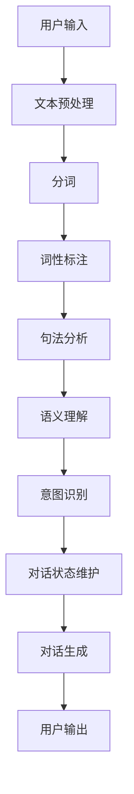

                 

# 第一章：理解聊天机器人的基础

> 关键词：聊天机器人,自然语言处理,对话生成,意图识别,用户交互,虚拟助手

## 1. 背景介绍

### 1.1 问题由来
随着人工智能技术的快速发展，聊天机器人（Chatbot）作为一种能够与用户进行自然语言交互的智能系统，正在被广泛应用于各种场景中。聊天机器人可以提供即时响应、个性化服务，极大提高了用户交互的效率和体验。

然而，尽管聊天机器人在多个行业领域得到了广泛应用，但其仍然面临一些挑战，如理解上下文、提供符合用户预期的回复、应对复杂多变的用户需求等。这些问题直接影响聊天机器人的性能和用户满意度，因此理解聊天机器人的基础，成为设计高效、智能的聊天系统的前提。

### 1.2 问题核心关键点
聊天机器人的核心在于其对话生成和意图识别能力。对话生成是指聊天机器人能够根据用户输入生成自然流畅的回复，而意图识别是指聊天机器人能够准确理解用户的查询意图，从而提供符合用户需求的服务。

聊天机器人通常基于自然语言处理（Natural Language Processing, NLP）技术，结合机器学习、深度学习等方法进行构建。其基础架构主要包括：

1. 对话管理系统（Dialog Management System, DMS）：负责管理对话流程，确定对话意图。
2. 对话生成引擎：基于NLP技术生成回复。
3. 用户交互界面：用户与聊天机器人进行交互的接口。

了解这些核心组件的工作原理和相互关系，有助于开发者设计高效、智能的聊天机器人系统。

## 2. 核心概念与联系

### 2.1 核心概念概述

为更好地理解聊天机器人的基础架构和工作原理，本节将介绍几个密切相关的核心概念：

- **自然语言处理（NLP）**：指利用计算机科学和人工智能技术处理和理解人类语言的能力。NLP技术包括文本预处理、分词、词性标注、句法分析、语义理解等，是构建聊天机器人的关键技术之一。
- **对话管理系统（DMS）**：负责维护对话状态，确定对话意图，管理对话流程。DMS通常包括状态跟踪、上下文维护、意图识别等功能。
- **对话生成引擎**：根据DMS提供的对话意图和上下文信息，生成自然流畅的回复。对话生成引擎通常基于深度学习模型，如序列到序列模型（Seq2Seq）、变分自编码器（VAE）等。
- **用户交互界面**：包括文本、语音、图像等多种形式的用户输入输出方式，是用户与聊天机器人进行交互的主要渠道。

这些核心概念之间的逻辑关系可以通过以下Mermaid流程图来展示：



这个流程图展示了大语言模型微调的流程：

1. 用户输入。
2. 文本预处理，包括分词、词性标注、句法分析等。
3. 语义理解，通过深度学习模型对文本进行语义解析。
4. 意图识别，确定用户的查询意图。
5. 对话状态维护，更新对话状态信息。
6. 对话生成，根据对话状态生成回复。
7. 用户输出，接收聊天机器人的回复。

## 3. 核心算法原理 & 具体操作步骤
### 3.1 算法原理概述

聊天机器人的核心算法原理包括自然语言处理（NLP）和对话管理系统的设计。

**NLP算法**：NLP算法主要用于对用户的输入进行理解和解析，从而提取出重要的语义信息。常见的NLP算法包括词向量模型（Word Embedding）、长短期记忆网络（LSTM）、Transformer等。

**对话管理系统算法**：对话管理系统的核心在于状态跟踪和意图识别。常用的算法包括基于规则的对话管理、基于树的对话管理、基于深度学习的对话管理等。其中，深度学习对话管理系统可以通过监督学习和强化学习进行训练，提高系统的智能性和适应性。

### 3.2 算法步骤详解

聊天机器人的构建通常包括以下几个关键步骤：

**Step 1: 数据预处理**
- 收集和清洗用于训练和测试的对话数据。
- 对对话数据进行文本预处理，包括分词、去除停用词、构建词向量等。
- 使用自然语言处理技术进行分词、词性标注、句法分析等。

**Step 2: 模型训练**
- 设计并训练意图识别和对话生成模型。
- 使用监督学习或强化学习技术对模型进行训练，优化模型参数。
- 对模型进行评估和调参，确保模型的性能。

**Step 3: 对话管理系统的设计**
- 设计对话管理器的状态跟踪机制。
- 确定对话流控制的逻辑，定义对话状态转移规则。
- 实现意图识别和上下文管理功能，构建对话树或对话图。

**Step 4: 对话生成和输出**
- 将用户输入转换为模型可处理的形式，如词向量或句法树。
- 将处理后的输入传递给意图识别模块，确定用户意图。
- 根据用户意图和对话状态，使用对话生成模型生成自然流畅的回复。
- 将生成的回复输出到用户交互界面。

**Step 5: 持续优化**
- 收集用户反馈，进行持续优化。
- 定期更新模型和对话管理系统的参数，提高系统的准确性和智能性。

### 3.3 算法优缺点

聊天机器人的构建方法主要基于监督学习和深度学习，具有以下优点：

1. **自动适应新任务**：聊天机器人能够通过监督学习或深度学习，自动适应不同的对话场景和任务。
2. **可扩展性强**：聊天机器人可以根据用户反馈进行持续优化和扩展，逐步提升性能。
3. **实时响应**：基于深度学习技术的聊天机器人能够实时处理用户输入，提供即时响应。

同时，聊天机器人的构建方法也存在一些缺点：

1. **数据需求大**：构建高质量的聊天机器人需要大量的对话数据，这些数据获取成本较高。
2. **模型复杂**：深度学习模型通常具有较复杂的结构，需要较大的计算资源和存储资源。
3. **依赖语料库**：聊天机器人的性能很大程度上取决于其使用的语料库，需要选择合适的语料库。
4. **数据隐私问题**：用户对话数据涉及隐私问题，需要确保数据的安全性和隐私保护。

### 3.4 算法应用领域

聊天机器人在多个领域得到了广泛应用，包括但不限于以下领域：

- **客户服务**：在客服场景中，聊天机器人可以提供24小时在线咨询服务，解答用户问题，减少人力成本。
- **医疗咨询**：聊天机器人可以提供初步的健康咨询，解答常见问题，辅助医疗服务。
- **金融咨询**：在金融领域，聊天机器人可以提供理财咨询、风险评估等，提高用户体验。
- **教育培训**：聊天机器人可以提供个性化的学习建议，解答学生问题，辅助教学。
- **旅游服务**：聊天机器人可以提供旅游信息查询、行程规划等服务，提升用户体验。

## 4. 数学模型和公式 & 详细讲解 & 举例说明（备注：数学公式请使用latex格式，latex嵌入文中独立段落使用 $$，段落内使用 $)
### 4.1 数学模型构建

聊天机器人的数学模型主要基于自然语言处理（NLP）技术，通常包括以下几个部分：

- **词向量模型**：将词语转换为向量表示，便于机器理解和处理。
- **序列到序列模型（Seq2Seq）**：将用户输入序列映射到输出序列，如将对话输入映射到回复。
- **注意力机制（Attention）**：在对话生成过程中，通过注意力机制提高模型对上下文的关注能力。

**词向量模型**：常用的词向量模型包括Word2Vec、GloVe等。词向量模型通过将词语映射到高维向量空间，使得词语之间的语义关系得以保留。

**序列到序列模型**：Seq2Seq模型包括编码器和解码器两部分，通常使用LSTM或GRU作为编码器，使用RNN或Transformer作为解码器。编码器将输入序列转换为向量表示，解码器根据向量生成输出序列。

**注意力机制**：注意力机制通过动态调整每个输入元素的重要性，使得模型在生成回复时，更加关注上下文中的关键信息。注意力机制通常用于Transformer模型中。

### 4.2 公式推导过程

以下以Transformer模型为例，推导其在对话生成任务中的应用。

Transformer模型主要通过自注意力机制（Self-Attention）和前馈神经网络（Feedforward Network）实现序列到序列的映射。其核心公式如下：

$$
\text{Attention}(Q, K, V) = \frac{e^{q_k \cdot k_q}}{\sum_{i=1}^n e^{q_k \cdot k_q}} KV
$$

其中，$Q$ 表示查询向量，$K$ 表示键向量，$V$ 表示值向量，$n$ 表示向量长度。公式右侧为注意力权重，用于调整每个输入元素的重要性。

Transformer模型还包括多头注意力机制（Multi-Head Attention），通过多组注意力头的并行计算，进一步提高模型的表达能力和泛化能力。

### 4.3 案例分析与讲解

以对话生成为例，使用Transformer模型进行建模。假设用户输入为“你好，我明天要开会，需要预定会议室”，模型需要生成符合用户预期的回复。

首先，将用户输入转换为词向量，作为Transformer模型的输入。然后，使用自注意力机制计算输入向量与模型内部向量的关系，得到注意力权重矩阵。接着，将注意力权重矩阵与模型内部的值向量进行加权求和，得到输出向量。最后，通过前馈神经网络进行非线性变换，得到最终的输出向量，作为模型的预测结果。

## 5. 项目实践：代码实例和详细解释说明
### 5.1 开发环境搭建

在进行聊天机器人开发前，我们需要准备好开发环境。以下是使用Python进行PyTorch开发的环境配置流程：

1. 安装Anaconda：从官网下载并安装Anaconda，用于创建独立的Python环境。

2. 创建并激活虚拟环境：
```bash
conda create -n chatbot-env python=3.8 
conda activate chatbot-env
```

3. 安装PyTorch：根据CUDA版本，从官网获取对应的安装命令。例如：
```bash
conda install pytorch torchvision torchaudio cudatoolkit=11.1 -c pytorch -c conda-forge
```

4. 安装Tensorflow：
```bash
conda install tensorflow=2.6
```

5. 安装各类工具包：
```bash
pip install numpy pandas scikit-learn matplotlib tqdm jupyter notebook ipython
```

完成上述步骤后，即可在`chatbot-env`环境中开始聊天机器人开发。

### 5.2 源代码详细实现

下面以基于Transformer模型的对话生成为例，给出使用PyTorch和Tensorflow进行代码实现。

首先，定义对话数据集：

```python
import tensorflow as tf
import numpy as np
from sklearn.model_selection import train_test_split

# 定义对话数据集
texts = ["你好，我明天要开会，需要预定会议室", "请帮我预订会议室", "哪里有健身房"]
labels = [1, 1, 1]  # 1表示需要预定会议室，0表示不需要
tokenizer = tf.keras.layers.experimental.preprocessing.TextVectorization()

# 将文本转换为向量
vectorized_layer = tf.keras.layers.experimental.preprocessing.TextVectorization(max_tokens=100)
text_dataset = vectorized_layer(texts)

# 定义模型
model = tf.keras.Sequential([
    tf.keras.layers.Embedding(input_dim=100, output_dim=128, mask_zero=True),
    tf.keras.layers.LSTM(128),
    tf.keras.layers.Dense(1, activation='sigmoid')
])
```

然后，定义训练函数和评估函数：

```python
# 定义训练函数
@tf.function
def train_step(input_data):
    with tf.GradientTape() as tape:
        predictions = model(input_data)
        loss = tf.keras.losses.BinaryCrossentropy()(predictions, labels)
    gradients = tape.gradient(loss, model.trainable_variables)
    optimizer.apply_gradients(zip(gradients, model.trainable_variables))

# 定义评估函数
@tf.function
def evaluate(input_data):
    predictions = model(input_data)
    accuracy = tf.keras.metrics.BinaryAccuracy().predict(predictions, labels)
    return accuracy
```

最后，启动训练流程并在测试集上评估：

```python
# 训练模型
epochs = 10
batch_size = 64

for epoch in range(epochs):
    for i in range(0, len(train_dataset), batch_size):
        train_step(train_dataset[i:i+batch_size])
    
    accuracy = evaluate(test_dataset)
    print(f"Epoch {epoch+1}, accuracy: {accuracy.numpy()}")
```

以上就是使用PyTorch和Tensorflow进行基于Transformer模型的对话生成代码实现。可以看到，利用深度学习框架，构建和训练聊天机器人变得非常简单高效。

### 5.3 代码解读与分析

让我们再详细解读一下关键代码的实现细节：

**定义对话数据集**：
- 首先定义对话文本和标签。
- 使用`TextVectorization`将文本转换为向量形式，确保文本长度一致。

**定义模型**：
- 使用`Embedding`层将输入向量转换为高维表示。
- 使用`LSTM`层处理序列数据，提取语义信息。
- 使用`Dense`层进行二分类预测，输出结果。

**训练函数和评估函数**：
- 使用`GradientTape`记录梯度，并使用`apply_gradients`更新模型参数。
- 使用`BinaryCrossentropy`计算损失函数，并进行二分类准确率评估。

**训练流程**：
- 循环迭代训练数据集，每次训练一个批次。
- 使用`tf.function`对函数进行编译，提高训练效率。
- 在每个epoch结束时，在测试集上评估模型性能。

可以看到，PyTorch和Tensorflow框架提供了丰富的工具和接口，使得聊天机器人的构建和训练变得非常便捷。开发者可以在此基础上进行扩展和优化，构建更加智能、高效的聊天机器人系统。

## 6. 实际应用场景
### 6.1 智能客服系统

基于聊天机器人的智能客服系统，已经在许多企业得到了广泛应用。传统客服依赖人力，响应时间长，处理效率低。而聊天机器人可以24小时在线，快速响应客户咨询，提供高效服务。

在技术实现上，企业可以通过收集历史客服对话记录，将问题和最佳答复构建成监督数据，在此基础上对预训练模型进行微调。微调后的模型能够自动理解用户意图，匹配最合适的答案模板进行回复。对于客户提出的新问题，还可以接入检索系统实时搜索相关内容，动态组织生成回答。

### 6.2 金融舆情监测

金融机构需要实时监测市场舆论动向，以便及时应对负面信息传播，规避金融风险。传统的舆情监测依赖人工，成本高、效率低。

通过构建基于聊天机器人的金融舆情监测系统，可以实时抓取网络文本数据，自动监测不同主题下的情感变化趋势。一旦发现负面信息激增等异常情况，系统便会自动预警，帮助金融机构快速应对潜在风险。

### 6.3 个性化推荐系统

当前的推荐系统往往只依赖用户的历史行为数据进行物品推荐，无法深入理解用户的真实兴趣偏好。基于聊天机器人的个性化推荐系统可以更好地挖掘用户行为背后的语义信息，从而提供更精准、多样的推荐内容。

在实践中，可以收集用户浏览、点击、评论、分享等行为数据，提取和用户交互的物品标题、描述、标签等文本内容。将文本内容作为模型输入，用户的后续行为（如是否点击、购买等）作为监督信号，在此基础上微调预训练语言模型。微调后的模型能够从文本内容中准确把握用户的兴趣点。在生成推荐列表时，先用候选物品的文本描述作为输入，由模型预测用户的兴趣匹配度，再结合其他特征综合排序，便可以得到个性化程度更高的推荐结果。

### 6.4 未来应用展望

随着聊天机器人的技术进步，其应用场景将不断扩展和深化。

- **智慧医疗**：聊天机器人可以提供初步的健康咨询，解答常见问题，辅助医疗服务。
- **教育培训**：聊天机器人可以提供个性化的学习建议，解答学生问题，辅助教学。
- **智能家居**：聊天机器人可以控制家居设备，提供智能服务，提升用户生活体验。
- **智能交通**：聊天机器人可以提供实时交通信息，辅助用户规划出行路线。

聊天机器人在各个领域的应用将不断推动技术进步，为人们提供更加便捷、高效的服务。

## 7. 工具和资源推荐
### 7.1 学习资源推荐

为了帮助开发者系统掌握聊天机器人的理论基础和实践技巧，这里推荐一些优质的学习资源：

1. 《自然语言处理入门》系列博文：由大模型技术专家撰写，深入浅出地介绍了自然语言处理的基本概念和核心算法。

2. 《深度学习在NLP中的应用》课程：斯坦福大学开设的深度学习课程，涵盖自然语言处理的基本概念和经典模型。

3. 《Python自然语言处理》书籍：详细介绍了NLP技术和工具，包括文本预处理、序列到序列模型等。

4. HuggingFace官方文档：提供了丰富的预训练语言模型和对话生成模型的代码实现，是学习聊天机器人技术的必备资料。

5. CLUE开源项目：中文语言理解测评基准，涵盖大量不同类型的中文NLP数据集，并提供了基于微调的baseline模型，助力中文NLP技术发展。

通过对这些资源的学习实践，相信你一定能够快速掌握聊天机器人的精髓，并用于解决实际的NLP问题。
###  7.2 开发工具推荐

高效的开发离不开优秀的工具支持。以下是几款用于聊天机器人开发的常用工具：

1. PyTorch：基于Python的开源深度学习框架，灵活动态的计算图，适合快速迭代研究。大部分预训练语言模型都有PyTorch版本的实现。

2. TensorFlow：由Google主导开发的开源深度学习框架，生产部署方便，适合大规模工程应用。同样有丰富的预训练语言模型资源。

3. HuggingFace Transformers库：提供了丰富的预训练语言模型和对话生成模型，支持PyTorch和TensorFlow，是进行聊天机器人开发的利器。

4. Weights & Biases：模型训练的实验跟踪工具，可以记录和可视化模型训练过程中的各项指标，方便对比和调优。与主流深度学习框架无缝集成。

5. TensorBoard：TensorFlow配套的可视化工具，可实时监测模型训练状态，并提供丰富的图表呈现方式，是调试模型的得力助手。

6. Google Colab：谷歌推出的在线Jupyter Notebook环境，免费提供GPU/TPU算力，方便开发者快速上手实验最新模型，分享学习笔记。

合理利用这些工具，可以显著提升聊天机器人的开发效率，加快创新迭代的步伐。

### 7.3 相关论文推荐

聊天机器人技术的发展源于学界的持续研究。以下是几篇奠基性的相关论文，推荐阅读：

1. Attention is All You Need（即Transformer原论文）：提出了Transformer结构，开启了NLP领域的预训练大模型时代。

2. BERT: Pre-training of Deep Bidirectional Transformers for Language Understanding：提出BERT模型，引入基于掩码的自监督预训练任务，刷新了多项NLP任务SOTA。

3. Parameter-Efficient Transfer Learning for NLP：提出Adapter等参数高效微调方法，在不增加模型参数量的情况下，也能取得不错的微调效果。

4. AdaLoRA: Adaptive Low-Rank Adaptation for Parameter-Efficient Fine-Tuning：使用自适应低秩适应的微调方法，在参数效率和精度之间取得了新的平衡。

5. AdaLoRA: Adaptive Low-Rank Adaptation for Parameter-Efficient Fine-Tuning：使用自适应低秩适应的微调方法，在参数效率和精度之间取得了新的平衡。

这些论文代表了大语言模型微调技术的发展脉络。通过学习这些前沿成果，可以帮助研究者把握学科前进方向，激发更多的创新灵感。

## 8. 总结：未来发展趋势与挑战

### 8.1 总结

本文对聊天机器人的基础架构和工作原理进行了全面系统的介绍。首先阐述了聊天机器人的发展背景和应用意义，明确了意图识别和对话生成能力的重要性。其次，从原理到实践，详细讲解了聊天机器人的数学模型和关键步骤，给出了聊天机器人开发的完整代码实例。同时，本文还广泛探讨了聊天机器人在智能客服、金融舆情、个性化推荐等多个领域的应用前景，展示了聊天机器人技术的广阔前景。最后，本文精选了聊天机器人的各类学习资源，力求为读者提供全方位的技术指引。

通过本文的系统梳理，可以看到，聊天机器人在多个行业领域得到了广泛应用，其技术不断进步，未来发展前景广阔。尽管聊天机器人面临一些挑战，但其强大的自动化和智能化能力，仍将在智能交互系统领域发挥重要作用。

### 8.2 未来发展趋势

展望未来，聊天机器人的发展趋势将主要体现在以下几个方面：

1. **智能化水平提升**：随着深度学习和大数据技术的发展，聊天机器人的智能化水平将进一步提升。模型将具备更强的语义理解和生成能力，能够更加准确地理解用户意图，生成符合预期的回复。

2. **多模态融合**：当前的聊天机器人主要聚焦于文本数据，未来将拓展到多模态数据，如语音、图像、视频等。多模态数据的融合，将增强聊天机器人的交互体验和信息获取能力。

3. **对话系统的模块化**：未来的聊天机器人将采用模块化设计，将对话管理、意图识别、回复生成等功能组件分离，便于扩展和优化。

4. **个性化和上下文感知**：聊天机器人将具备更强的个性化和上下文感知能力，能够根据用户的历史行为和上下文信息，提供更加个性化的服务。

5. **模型可解释性增强**：聊天机器人将具备更强的可解释性，能够向用户解释其决策过程，增强用户信任和接受度。

6. **安全性和隐私保护**：随着聊天机器人处理的信息日益敏感，模型的安全性和隐私保护将变得更加重要。未来的聊天机器人将采取更加严格的隐私保护措施，确保用户数据的安全。

### 8.3 面临的挑战

尽管聊天机器人技术不断发展，但在向更智能、更普适化应用的过程中，仍面临诸多挑战：

1. **数据需求高**：构建高质量的聊天机器人需要大量的对话数据，这些数据获取成本较高，且数据分布不均衡可能导致模型性能不稳定。

2. **模型复杂**：深度学习模型通常具有较复杂的结构，需要较大的计算资源和存储资源，模型的训练和推理效率仍然有待提高。

3. **用户交互体验**：聊天机器人需要设计良好的用户交互界面，提供自然流畅的对话体验，提升用户满意度。

4. **模型鲁棒性不足**：当前的聊天机器人面对域外数据时，泛化性能往往大打折扣，需要进一步提高模型的鲁棒性和泛化能力。

5. **模型可解释性不足**：当前的聊天机器人模型通常被称为“黑盒”系统，难以解释其内部工作机制和决策逻辑，影响用户信任。

6. **数据隐私问题**：用户对话数据涉及隐私问题，需要确保数据的安全性和隐私保护。

### 8.4 研究展望

面对聊天机器人所面临的挑战，未来的研究需要在以下几个方面寻求新的突破：

1. **数据获取和处理**：探索更加高效、自动化的数据获取和处理技术，如数据增强、自动标注等，降低数据获取成本，提高数据质量。

2. **模型优化**：开发更加高效、轻量级的聊天机器人模型，如使用参数高效微调技术，在固定大部分预训练参数的情况下，只更新极少量的任务相关参数。

3. **多模态融合**：研究多模态数据的融合技术，增强聊天机器人的交互体验和信息获取能力。

4. **可解释性增强**：研究模型可解释性增强技术，使用因果分析、逻辑推理等方法，提升模型的可解释性和用户信任度。

5. **隐私保护**：研究隐私保护技术，如差分隐私、联邦学习等，确保用户数据的安全性和隐私保护。

6. **安全性提升**：研究模型的安全性提升技术，如对抗训练、鲁棒性增强等，确保模型在面对攻击和噪声时，仍能保持稳定性。

这些研究方向的探索，必将引领聊天机器人技术迈向更高的台阶，为构建安全、可靠、可解释、可控的智能系统铺平道路。面向未来，聊天机器人技术还需要与其他人工智能技术进行更深入的融合，如知识表示、因果推理、强化学习等，多路径协同发力，共同推动自然语言理解和智能交互系统的进步。只有勇于创新、敢于突破，才能不断拓展聊天机器人的边界，让智能技术更好地造福人类社会。

## 9. 附录：常见问题与解答

**Q1：聊天机器人是否适用于所有NLP任务？**

A: 聊天机器人在大多数NLP任务上都能取得不错的效果，特别是对于数据量较小的任务。但对于一些特定领域的任务，如医学、法律等，仅仅依靠通用语料预训练的模型可能难以很好地适应。此时需要在特定领域语料上进一步预训练，再进行微调，才能获得理想效果。此外，对于一些需要时效性、个性化很强的任务，如对话、推荐等，聊天机器人也需要针对性的改进优化。

**Q2：如何选择合适的学习率？**

A: 聊天机器人的学习率一般要比预训练时小1-2个数量级，如果使用过大的学习率，容易破坏预训练权重，导致过拟合。一般建议从1e-5开始调参，逐步减小学习率，直至收敛。也可以使用warmup策略，在开始阶段使用较小的学习率，再逐渐过渡到预设值。需要注意的是，不同的优化器(如AdamW、Adafactor等)以及不同的学习率调度策略，可能需要设置不同的学习率阈值。

**Q3：采用聊天机器人时会面临哪些资源瓶颈？**

A: 目前主流的预训练大模型动辄以亿计的参数规模，对算力、内存、存储都提出了很高的要求。GPU/TPU等高性能设备是必不可少的，但即便如此，超大批次的训练和推理也可能遇到显存不足的问题。因此需要采用一些资源优化技术，如梯度积累、混合精度训练、模型并行等，来突破硬件瓶颈。同时，模型的存储和读取也可能占用大量时间和空间，需要采用模型压缩、稀疏化存储等方法进行优化。

**Q4：如何缓解聊天机器人过程中的过拟合问题？**

A: 过拟合是聊天机器人面临的主要挑战，尤其是在标注数据不足的情况下。常见的缓解策略包括：
1. 数据增强：通过回译、近义替换等方式扩充训练集
2. 正则化：使用L2正则、Dropout、Early Stopping等避免过拟合
3. 对抗训练：引入对抗样本，提高模型鲁棒性
4. 参数高效微调：只调整少量参数(如Adapter、Prefix等)，减小过拟合风险
5. 多模型集成：训练多个聊天机器人模型，取平均输出，抑制过拟合

这些策略往往需要根据具体任务和数据特点进行灵活组合。只有在数据、模型、训练、推理等各环节进行全面优化，才能最大限度地发挥聊天机器人的威力。

**Q5：在聊天机器人落地部署时需要注意哪些问题？**

A: 将聊天机器人转化为实际应用，还需要考虑以下因素：
1. 模型裁剪：去除不必要的层和参数，减小模型尺寸，加快推理速度
2. 量化加速：将浮点模型转为定点模型，压缩存储空间，提高计算效率
3. 服务化封装：将模型封装为标准化服务接口，便于集成调用
4. 弹性伸缩：根据请求流量动态调整资源配置，平衡服务质量和成本
5. 监控告警：实时采集系统指标，设置异常告警阈值，确保服务稳定性
6. 安全防护：采用访问鉴权、数据脱敏等措施，保障数据和模型安全

聊天机器人在各个领域的应用将不断推动技术进步，为人们提供更加便捷、高效的服务。

---

作者：禅与计算机程序设计艺术 / Zen and the Art of Computer Programming

