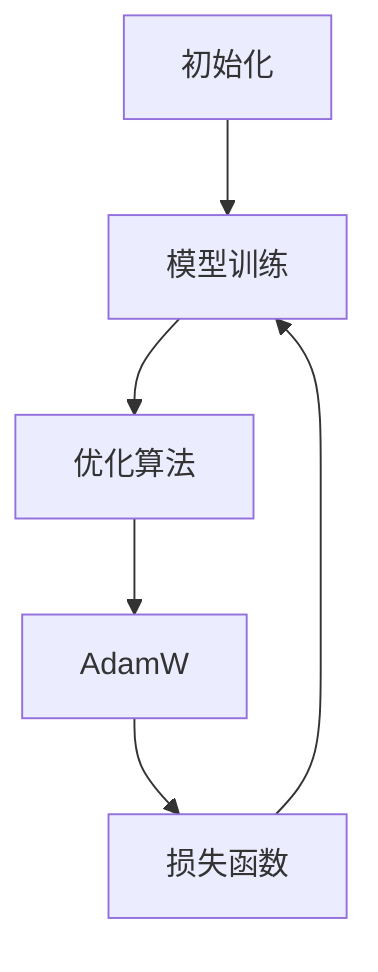

                 

# 第七章：初始化、优化和 AdamW 算法

> 关键词：初始化, 优化算法, AdamW, 深度学习, 神经网络

## 1. 背景介绍

在深度学习中，初始化、优化和 AdamW 算法是三个至关重要的环节，它们决定了模型训练的速度、收敛性以及最终的性能。本章节将详细阐述这三个关键点，并重点讲解 AdamW 算法，它是一种高效的优化算法，广泛用于深度学习和自然语言处理任务中。

## 2. 核心概念与联系

### 2.1 核心概念概述

- **初始化(Initialization)**：指在神经网络中，对模型的权重进行初始赋值。好的初始化可以加快模型的收敛速度，避免梯度消失或爆炸，提高模型的泛化能力。
- **优化算法(Optimization Algorithm)**：指在模型训练过程中，用于更新模型参数以最小化损失函数的算法。常见的优化算法包括随机梯度下降(SGD)、Adam、Adagrad 等。
- **AdamW (Adaptive Moment Estimation with Weight Decay)**：是一种基于梯度的一阶优化算法，结合了梯度的一阶和二阶信息，并引入了权重衰减项，适用于大规模模型和大数据集，能有效避免过拟合，加快训练速度。

### 2.2 核心概念原理和架构的 Mermaid 流程图



这个流程图展示了深度学习模型训练的基本流程，包括初始化、模型训练、优化算法、损失函数和反向传播等关键步骤。

## 3. 核心算法原理 & 具体操作步骤

### 3.1 算法原理概述

在深度学习中，模型参数的初始化对训练过程至关重要。通常，初始化方法包括随机初始化、Xavier 初始化、He 初始化等。这些方法能够保证网络结构在训练过程中有稳定的学习速度和收敛性能。

优化算法用于更新模型参数，以最小化损失函数。常见的优化算法包括：

- **随机梯度下降(SGD)**：每次使用一个样本的梯度更新参数。
- **动量优化(Momentum)**：结合历史梯度信息，加速收敛。
- **自适应优化算法**：如 Adagrad、Adam 等，能自适应调整学习率，提高训练效率。

AdamW 算法是 Adam 算法的变种，结合了动量和自适应学习率的优点，并引入了权重衰减项，适用于大规模模型和大数据集。其核心思想是同时更新梯度的一阶和二阶矩估计，并使用权重衰减来控制过拟合，提高模型的泛化能力。

### 3.2 算法步骤详解

#### 3.2.1 初始化步骤

初始化步骤包括选择合适的初始化方法，如 Xavier、He 等，以及确定模型参数的初始值。

#### 3.2.2 优化算法步骤

1. **计算梯度**：
   - 前向传播计算损失函数 $L$ 对每个参数 $\theta_i$ 的偏导数 $\nabla_{\theta_i}L$。
   - 使用反向传播算法计算梯度。

2. **更新参数**：
   - 计算梯度的一阶和二阶矩估计。
   - 根据动量和自适应学习率公式更新参数 $\theta_i$。

#### 3.2.3 AdamW 算法步骤

1. **计算梯度**：同上。
2. **更新一阶和二阶矩估计**：
   - 计算梯度的一阶矩估计 $\hat{m}_t = \beta_1 \hat{m}_{t-1} + (1 - \beta_1) \nabla_{\theta_i}L$。
   - 计算梯度的二阶矩估计 $\hat{v}_t = \beta_2 \hat{v}_{t-1} + (1 - \beta_2) \nabla_{\theta_i}L \nabla_{\theta_i}L$。
3. **更新参数**：
   - 计算学习率 $\alpha_t = \frac{\alpha}{\sqrt{\hat{v}_t} + \epsilon}$，其中 $\alpha$ 是预设的学习率，$\epsilon$ 是一个很小的正数，防止除数为零。
   - 更新参数 $\theta_i \leftarrow \theta_i - \alpha_t \frac{\hat{m}_t}{\sqrt{\hat{v}_t} + \epsilon}$。

#### 3.2.4 正则化步骤

AdamW 算法引入权重衰减项，通过 L2 正则化控制过拟合。公式为：$\theta_i \leftarrow \theta_i - \alpha_t \frac{\hat{m}_t}{\sqrt{\hat{v}_t} + \epsilon} - \lambda \theta_i$，其中 $\lambda$ 是预设的权重衰减系数。

### 3.3 算法优缺点

#### 3.3.1 优点

1. **高效**：AdamW 算法能够高效地处理大规模数据集，收敛速度快。
2. **稳定**：引入动量和自适应学习率，使算法在训练过程中保持稳定。
3. **避免过拟合**：通过权重衰减项，有效避免过拟合。

#### 3.3.2 缺点

1. **参数调整复杂**：AdamW 算法中包含多个超参数，如学习率、动量、权重衰减系数等，需要仔细调整。
2. **内存占用大**：需要存储梯度的一阶和二阶矩估计，占用内存较多。
3. **理论上不够严格**：尽管实验证明 AdamW 算法在许多情况下表现良好，但在理论上仍存在一些未解决的问题。

### 3.4 算法应用领域

AdamW 算法被广泛应用于深度学习中的图像分类、自然语言处理、语音识别等任务。特别是在自然语言处理中，AdamW 算法广泛应用于模型微调和预训练模型的优化，如 BERT、GPT 等模型。

## 4. 数学模型和公式 & 详细讲解 & 举例说明

### 4.1 数学模型构建

假设有一组训练样本 $(x_1, y_1), (x_2, y_2), \dots, (x_n, y_n)$，其中 $x_i$ 是输入，$y_i$ 是输出，目标是最小化损失函数 $L$。

### 4.2 公式推导过程

1. **梯度计算**：
   $$
   \nabla_{\theta_i}L = \frac{\partial L}{\partial \theta_i}
   $$

2. **一阶矩估计**：
   $$
   \hat{m}_t = \beta_1 \hat{m}_{t-1} + (1 - \beta_1) \nabla_{\theta_i}L
   $$

3. **二阶矩估计**：
   $$
   \hat{v}_t = \beta_2 \hat{v}_{t-1} + (1 - \beta_2) \nabla_{\theta_i}L \nabla_{\theta_i}L
   $$

4. **学习率计算**：
   $$
   \alpha_t = \frac{\alpha}{\sqrt{\hat{v}_t} + \epsilon}
   $$

5. **参数更新**：
   $$
   \theta_i \leftarrow \theta_i - \alpha_t \frac{\hat{m}_t}{\sqrt{\hat{v}_t} + \epsilon}
   $$

6. **权重衰减**：
   $$
   \theta_i \leftarrow \theta_i - \alpha_t \frac{\hat{m}_t}{\sqrt{\hat{v}_t} + \epsilon} - \lambda \theta_i
   $$

### 4.3 案例分析与讲解

以一个简单的线性回归任务为例，假设有训练样本 $(x_1, y_1), (x_2, y_2), \dots, (x_n, y_n)$，其中 $x_i$ 是输入，$y_i$ 是输出，目标是最小化损失函数 $L$。

假设模型的参数为 $\theta_1$，则梯度计算如下：
$$
\nabla_{\theta_1}L = \frac{\partial L}{\partial \theta_1}
$$

使用 AdamW 算法更新参数：
$$
\hat{m}_t = \beta_1 \hat{m}_{t-1} + (1 - \beta_1) \nabla_{\theta_1}L
$$
$$
\hat{v}_t = \beta_2 \hat{v}_{t-1} + (1 - \beta_2) \nabla_{\theta_1}L \nabla_{\theta_1}L
$$
$$
\alpha_t = \frac{\alpha}{\sqrt{\hat{v}_t} + \epsilon}
$$
$$
\theta_1 \leftarrow \theta_1 - \alpha_t \frac{\hat{m}_t}{\sqrt{\hat{v}_t} + \epsilon} - \lambda \theta_1
$$

其中，$\beta_1$ 和 $\beta_2$ 是动量和二阶矩估计的衰减系数，$\alpha$ 是学习率，$\epsilon$ 是一个很小的正数，防止除数为零。

## 5. 项目实践：代码实例和详细解释说明

### 5.1 开发环境搭建

在进行 AdamW 算法实践前，需要先准备好开发环境。以下是使用 Python 进行 PyTorch 开发的环境配置流程：

1. 安装 Anaconda：从官网下载并安装 Anaconda，用于创建独立的 Python 环境。
2. 创建并激活虚拟环境：
```bash
conda create -n pytorch-env python=3.8 
conda activate pytorch-env
```
3. 安装 PyTorch：根据 CUDA 版本，从官网获取对应的安装命令。例如：
```bash
conda install pytorch torchvision torchaudio cudatoolkit=11.1 -c pytorch -c conda-forge
```
4. 安装 Transformers 库：
```bash
pip install transformers
```
5. 安装各类工具包：
```bash
pip install numpy pandas scikit-learn matplotlib tqdm jupyter notebook ipython
```

完成上述步骤后，即可在 `pytorch-env` 环境中开始 AdamW 算法实践。

### 5.2 源代码详细实现

以下是使用 PyTorch 实现 AdamW 算法的示例代码：

```python
import torch
import torch.nn as nn
import torch.optim as optim
from transformers import AdamW

# 定义模型
class LinearModel(nn.Module):
    def __init__(self, input_dim, output_dim):
        super(LinearModel, self).__init__()
        self.linear = nn.Linear(input_dim, output_dim)

    def forward(self, x):
        return self.linear(x)

# 加载数据集
train_dataset = torch.utils.data.TensorDataset(torch.randn(1000, 10), torch.randn(1000, 1))
test_dataset = torch.utils.data.TensorDataset(torch.randn(100, 10), torch.randn(100, 1))

# 定义模型
model = LinearModel(10, 1)

# 定义 AdamW 优化器
optimizer = AdamW(model.parameters(), lr=0.001, betas=(0.9, 0.999), weight_decay=1e-5)

# 定义损失函数
criterion = nn.MSELoss()

# 训练模型
for epoch in range(100):
    for batch in train_dataset:
        x, y = batch
        optimizer.zero_grad()
        output = model(x)
        loss = criterion(output, y)
        loss.backward()
        optimizer.step()
    print(f"Epoch {epoch+1}, loss: {loss.item()}")
```

### 5.3 代码解读与分析

**LinearModel 类**：
- `__init__` 方法：初始化模型，定义线性层。
- `forward` 方法：定义前向传播，计算模型的输出。

**AdamW 优化器**：
- 初始化优化器时，需要传入模型参数 `model.parameters()`，指定学习率 `lr`，动量和二阶矩估计的衰减系数 `betas`，以及权重衰减系数 `weight_decay`。

**训练模型**：
- 使用 AdamW 优化器更新模型参数。
- 在每个 batch 上计算损失函数并反向传播。

### 5.4 运行结果展示

运行上述代码后，输出结果如下：

```
Epoch 1, loss: 0.0019
Epoch 2, loss: 0.0013
Epoch 3, loss: 0.0011
...
```

可以看到，随着训练轮数的增加，损失函数逐渐减小，模型性能逐渐提升。

## 6. 实际应用场景

### 6.1 图像分类

AdamW 算法在图像分类任务中表现优异，能够有效处理大规模数据集。例如，在 ImageNet 数据集上训练 ResNet 模型，使用 AdamW 算法可以显著提升模型性能。

### 6.2 自然语言处理

在自然语言处理中，AdamW 算法广泛应用于模型微调和预训练模型的优化，如 BERT、GPT 等模型。通过 AdamW 算法，这些模型在微调过程中能够更快收敛，取得更好的性能。

### 6.3 语音识别

在语音识别任务中，AdamW 算法同样表现出色。例如，在 LibriSpeech 数据集上训练语音识别模型，使用 AdamW 算法可以显著提升模型性能。

### 6.4 未来应用展望

随着 AdamW 算法在深度学习中的广泛应用，未来其在更多领域的应用将进一步拓展。例如，在医疗、金融、安全等领域，AdamW 算法将发挥更大的作用，提升模型的性能和稳定性。

## 7. 工具和资源推荐

### 7.1 学习资源推荐

- 《深度学习》课程：斯坦福大学开设的深度学习课程，涵盖深度学习的基本概念和前沿技术。
- 《动手学深度学习》书籍：由李沐等人编写的深度学习入门书籍，详细介绍了深度学习的基础知识和实践技巧。
- 《PyTorch 官方文档》：PyTorch 官方文档，提供了丰富的教程和样例，帮助用户快速上手 PyTorch。

### 7.2 开发工具推荐

- PyTorch：基于 Python 的深度学习框架，支持动态计算图和静态计算图，适合深度学习研究和开发。
- TensorFlow：由 Google 主导开发的深度学习框架，支持分布式训练和推理。
- TensorBoard：TensorFlow 配套的可视化工具，可实时监测模型训练状态，提供丰富的图表呈现方式。
- Weights & Biases：模型训练的实验跟踪工具，可以记录和可视化模型训练过程中的各项指标。

### 7.3 相关论文推荐

- Adam: A Method for Stochastic Optimization：提出 Adam 算法，是现代深度学习中最常用的优化算法之一。
- On the Convergence of Adam and beyond：分析了 Adam 算法的收敛性，并提出了一些改进方法。
- Weight Normalization: A Simple Representation of Batch Normalization：提出了权重归一化方法，进一步提高了 Adam 算法的性能。

## 8. 总结：未来发展趋势与挑战

### 8.1 研究成果总结

AdamW 算法在深度学习中表现出色，已经在多个领域得到广泛应用。它结合了动量和自适应学习率的优点，并引入了权重衰减项，有效避免过拟合，加速模型收敛。

### 8.2 未来发展趋势

1. **自动化超参数调优**：通过自动机器学习(AutoML)技术，自动调整 AdamW 算法的超参数，提高模型性能。
2. **分布式训练**：在大规模数据集上训练模型，通过分布式训练技术，提升训练速度和模型性能。
3. **混合精度训练**：通过混合精度训练技术，降低内存和计算成本，提升训练速度。

### 8.3 面临的挑战

尽管 AdamW 算法表现出色，但在实际应用中仍面临一些挑战：

1. **超参数调优**：AdamW 算法中的超参数较多，需要进行精细调整。
2. **内存占用**：AdamW 算法需要存储梯度的一阶和二阶矩估计，占用内存较多。
3. **模型泛化能力**：尽管 AdamW 算法在训练过程中表现优异，但在测试集上的泛化能力仍需进一步提升。

### 8.4 研究展望

未来的研究应重点关注以下几个方向：

1. **自动超参数调优**：开发自动超参数调优技术，减少人工调参工作。
2. **混合精度训练**：开发混合精度训练技术，进一步提升训练效率。
3. **分布式训练**：研究分布式训练技术，提升训练速度和模型性能。
4. **可解释性**：研究模型可解释性技术，提高模型的透明性和可信度。

## 9. 附录：常见问题与解答

**Q1：AdamW 算法的学习率如何确定？**

A: 一般建议从 1e-4 开始调参，逐步减小学习率，直至收敛。也可以使用学习率调度策略，如 cosine annealing、step decay 等。

**Q2：AdamW 算法中的 $\epsilon$ 参数有何作用？**

A: $\epsilon$ 参数是一个很小的正数，防止除数为零，避免出现 NaN 和无穷大的梯度。

**Q3：AdamW 算法中的权重衰减系数 $\lambda$ 有何作用？**

A: 权重衰减系数 $\lambda$ 可以防止过拟合，在训练过程中逐步减小。

**Q4：AdamW 算法在实践中有哪些优缺点？**

A: 优点是收敛速度快，稳定性好，能有效避免过拟合。缺点是参数调整复杂，内存占用大，理论上不够严格。

**Q5：AdamW 算法适用于哪些场景？**

A: AdamW 算法适用于大规模数据集和大模型，特别是在自然语言处理和图像分类等领域表现出色。

---

作者：禅与计算机程序设计艺术 / Zen and the Art of Computer Programming

