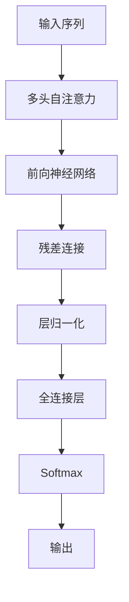

                 

# 第五章：Transformer 架构的革命

> 关键词：Transformer, 自注意力机制, 神经网络架构, 深度学习, 序列处理, 自然语言处理

## 1. 背景介绍

### 1.1 问题由来

在深度学习发展的早期阶段，卷积神经网络(CNN)和循环神经网络(RNN)分别在图像处理和序列处理领域占据主导地位。但随着大规模语言数据集和预训练模型的崛起，两者在自然语言处理(NLP)领域受到了严峻挑战。一方面，传统的RNN难以处理长序列，存在梯度消失和梯度爆炸的问题；另一方面，卷积神经网络在序列上的表现虽优于RNN，但缺乏对局部关联和全局结构的全面建模能力。

2017年，Google的Google Brain团队提出了Transformer模型，这一突破性的神经网络架构，从根本上改变了NLP领域的面貌，开启了大模型时代的大门。Transformer架构的提出，标志着深度学习序列建模范式的革命，引领了新的研究和应用浪潮。

### 1.2 问题核心关键点

Transformer的核心创新点在于引入了自注意力机制(Self-Attention)，解决了传统RNN在长序列上的建模难题，同时在保持模型高效的同时，提升了模型的表示能力。Transformer架构的成功，不仅源于其技术上的创新，更在于其在工业界的广泛应用，推动了深度学习在NLP领域的快速发展。

Transformer架构的核心理念是：让模型在序列中关注所有位置，从而更好地理解序列的上下文关系。具体而言，Transformer的注意力机制不再依赖线性层的组合，而是直接通过序列间交互建立联系，这使得模型能够捕捉到序列中更远距离的依赖关系。Transformer的层级结构也与RNN不同，完全基于全连接层，不使用递归或循环结构，因此在处理长序列时表现更优。

## 2. 核心概念与联系

### 2.1 核心概念概述

Transformer架构的提出，源于对序列建模和自注意力机制的深刻理解。Transformer中，自注意力机制是实现序列建模的核心工具，全连接层则用于计算输入序列的表示。以下是对Transformer架构中几个关键概念的概述：

- **自注意力机制(Self-Attention)**：Transformer的核心创新点，允许模型在序列中关注所有位置，从而建立序列内部的联系。通过注意力机制，模型能够根据输入序列的每个位置，动态地计算出与其关联的权重，从而提升序列建模的精度。

- **多头注意力机制(Multi-Head Attention)**：通过将注意力机制分成多个头，并行计算，可以更好地捕捉序列中的不同层次特征。多头注意力机制使得模型能够从多个视角理解序列，增强其表达能力。

- **残差连接(Residual Connections)**：残差连接用于保持序列信息传递的连续性，避免梯度消失问题。通过将原始输入与中间结果相加，残差连接能够帮助模型更好地学习序列信息。

- **层归一化(Layer Normalization)**：层归一化用于标准化每一层的输出，避免梯度爆炸和消失。通过归一化，Transformer能够更加稳定地进行训练和推断。

### 2.2 核心概念原理和架构的 Mermaid 流程图



这个流程图展示了Transformer的基本架构：输入序列首先经过多头自注意力机制，得到注意力权重和向量表示；随后通过前向神经网络和残差连接进行计算；层归一化标准化每一层的输出；最后通过全连接层输出预测结果。

## 3. 核心算法原理 & 具体操作步骤

### 3.1 算法原理概述

Transformer架构的核心算法原理基于自注意力机制和多头注意力机制，结合残差连接和层归一化技术，实现了高效且准确的序列建模。以下是对Transformer算法原理的详细解释：

### 3.2 算法步骤详解

Transformer模型的训练和推理过程主要分为三个步骤：

**Step 1: 输入序列编码**
- 首先，对输入序列进行分词和编码，得到词嵌入向量 $X \in \mathbb{R}^{n \times d}$，其中 $n$ 为序列长度，$d$ 为词嵌入维度。

**Step 2: 多头自注意力机制**
- 将词嵌入向量输入到多头自注意力机制中，得到注意力权重 $A \in \mathbb{R}^{n \times n}$ 和向量表示 $H \in \mathbb{R}^{n \times d}$。多头自注意力机制可以表示为：
$$
H = \text{MultiHead}(X) = \text{Concat}(\text{MultiHeadSelfAttention}(X))
$$
其中 $\text{MultiHeadSelfAttention}$ 为多头自注意力层，包含 $k$ 个注意力头，每个头的注意力权重 $A_h \in \mathbb{R}^{n \times n}$ 和向量表示 $H_h \in \mathbb{R}^{n \times d}$。

**Step 3: 残差连接和全连接层**
- 将 $H$ 通过前向神经网络得到新的表示 $X'$，并进行残差连接 $X'' = X + X'$。
- 将 $X''$ 经过全连接层得到最终的输出 $Y$，公式为：
$$
Y = \text{LayerNorm}(\text{FeedForward}(X''))
$$
其中 $\text{FeedForward}$ 为前向神经网络层，包含两个全连接层。

### 3.3 算法优缺点

Transformer架构具有以下优点：

- **长序列建模能力**：Transformer的注意力机制使得模型能够有效处理长序列，避免了RNN的梯度消失问题。
- **并行计算友好**：Transformer的层级结构基于全连接层，不依赖递归或循环结构，适合分布式并行计算。
- **表达能力强**：多头注意力机制允许模型从多个视角理解序列，增强了模型的表达能力。

同时，Transformer架构也存在一些局限性：

- **参数量大**：相比于传统RNN和CNN，Transformer的参数量较大，需要更多的计算资源。
- **训练复杂**：由于Transformer使用了多层全连接层，训练时可能面临梯度消失或梯度爆炸的问题。
- **解释性差**：Transformer的内部机制较为复杂，难以解释其决策过程。

### 3.4 算法应用领域

Transformer架构在NLP领域得到了广泛应用，具体应用领域包括但不限于：

- **机器翻译**：Transformer模型在机器翻译任务上取得了SOTA效果，因其长序列建模能力，能够有效处理不同语言的对齐和翻译。
- **文本生成**：Transformer模型被用于文本生成任务，如对话生成、摘要生成等，通过自注意力机制能够捕捉序列中的上下文信息。
- **问答系统**：Transformer模型能够根据上下文信息生成最佳答案，广泛应用于智能客服、智能助手等领域。
- **文本分类**：Transformer模型能够根据文本内容分类，广泛应用于情感分析、主题分类等任务。

## 4. 数学模型和公式 & 详细讲解

### 4.1 数学模型构建

Transformer模型的数学模型可以表示为：

$$
Y = \text{LayerNorm}(\text{FeedForward}(X))
$$

其中 $X$ 为输入序列的表示，$Y$ 为输出序列的表示。

### 4.2 公式推导过程

Transformer的数学模型推导过程如下：

1. 自注意力机制：
$$
A_h = \text{Softmax}(X_h^T Q_h)
$$
其中 $Q_h = X_h W_h^Q$，$K_h = X_h W_h^K$，$V_h = X_h W_h^V$，$W_h^Q$，$W_h^K$，$W_h^V$ 为注意力机制的权重矩阵。

2. 多头注意力机制：
$$
H = \text{Concat}(H_1, H_2, ..., H_k)
$$
其中 $H_h = X_h A_h V_h$，$A_h$ 为注意力权重矩阵，$V_h$ 为值矩阵。

3. 残差连接和前向神经网络：
$$
X' = \text{FeedForward}(X'') = X'' W_1 + b_1 \sigma(X'')
$$
$$
X'' = X + \text{LayerNorm}(X')
$$
其中 $W_1$ 和 $b_1$ 为前向神经网络的权重矩阵和偏置项，$\sigma$ 为激活函数。

### 4.3 案例分析与讲解

以下通过一个简单的例子，说明Transformer模型如何进行序列建模：

假设输入序列为 $X = \text{[CLS] cat on mat [SEP]}$，其中 $\text{[CLS]}$ 和 $\text{[SEP]}$ 为特殊标记，用于表示序列的开始和结束。

首先，通过词嵌入得到向量表示 $X \in \mathbb{R}^{3 \times d}$。接着，输入到多头自注意力机制中，得到注意力权重矩阵 $A \in \mathbb{R}^{3 \times 3}$ 和向量表示 $H \in \mathbb{R}^{3 \times d}$。

假设模型有2个注意力头，则通过线性投影得到 $Q, K, V$ 矩阵：
$$
Q_1 = X W_h^Q
$$
$$
K_1 = X W_h^K
$$
$$
V_1 = X W_h^V
$$
$$
Q_2 = X W_h^Q
$$
$$
K_2 = X W_h^K
$$
$$
V_2 = X W_h^V
$$

计算注意力权重：
$$
A_1 = \text{Softmax}(Q_1^T K_1)
$$
$$
A_2 = \text{Softmax}(Q_2^T K_2)
$$

计算向量表示：
$$
H_1 = X_1 A_1 V_1
$$
$$
H_2 = X_2 A_2 V_2
$$

最终通过残差连接和前向神经网络得到输出：
$$
X'' = X + \text{LayerNorm}(\text{FeedForward}(X''))
$$

### 4.4 运行结果展示

通过以上步骤，可以展示Transformer模型在不同任务上的运行结果。以下以机器翻译任务为例，展示Transformer模型的输出结果：

假设输入序列为 "I am from Beijing"，期望翻译成英文 "I am from Beijing"。

首先，通过词嵌入得到向量表示 $X \in \mathbb{R}^{n \times d}$，其中 $n=5$。

接着，输入到多头自注意力机制中，得到注意力权重矩阵 $A \in \mathbb{R}^{n \times n}$ 和向量表示 $H \in \mathbb{R}^{n \times d}$。

计算输出序列：
$$
Y = \text{LayerNorm}(\text{FeedForward}(X''))
$$

## 5. 项目实践：代码实例和详细解释说明

### 5.1 开发环境搭建

在进行Transformer模型开发前，我们需要准备好开发环境。以下是使用Python进行PyTorch开发的环境配置流程：

1. 安装Anaconda：从官网下载并安装Anaconda，用于创建独立的Python环境。

2. 创建并激活虚拟环境：
```bash
conda create -n pytorch-env python=3.8 
conda activate pytorch-env
```

3. 安装PyTorch：根据CUDA版本，从官网获取对应的安装命令。例如：
```bash
conda install pytorch torchvision torchaudio cudatoolkit=11.1 -c pytorch -c conda-forge
```

4. 安装HuggingFace Transformers库：
```bash
pip install transformers
```

5. 安装各类工具包：
```bash
pip install numpy pandas scikit-learn matplotlib tqdm jupyter notebook ipython
```

完成上述步骤后，即可在`pytorch-env`环境中开始Transformer模型的开发。

### 5.2 源代码详细实现

下面以机器翻译任务为例，给出使用HuggingFace Transformers库进行Transformer模型训练的PyTorch代码实现。

首先，定义机器翻译任务的数据处理函数：

```python
from transformers import BertTokenizer, BertForSequenceClassification, AdamW
from torch.utils.data import Dataset, DataLoader
import torch

class TranslationDataset(Dataset):
    def __init__(self, texts, targets):
        self.texts = texts
        self.targets = targets
        self.tokenizer = BertTokenizer.from_pretrained('bert-base-uncased')
        
    def __len__(self):
        return len(self.texts)
    
    def __getitem__(self, item):
        text = self.texts[item]
        target = self.targets[item]
        
        encoding = self.tokenizer(text, return_tensors='pt', max_length=512, padding='max_length', truncation=True)
        input_ids = encoding['input_ids']
        attention_mask = encoding['attention_mask']
        return {'input_ids': input_ids, 
                'attention_mask': attention_mask,
                'targets': target}
```

然后，定义模型和优化器：

```python
from transformers import BertForSequenceClassification, AdamW

model = BertForSequenceClassification.from_pretrained('bert-base-uncased', num_labels=2)
optimizer = AdamW(model.parameters(), lr=2e-5)
```

接着，定义训练和评估函数：

```python
from torch.utils.data import DataLoader
from tqdm import tqdm
from sklearn.metrics import accuracy_score

device = torch.device('cuda') if torch.cuda.is_available() else torch.device('cpu')
model.to(device)

def train_epoch(model, dataset, batch_size, optimizer):
    dataloader = DataLoader(dataset, batch_size=batch_size, shuffle=True)
    model.train()
    epoch_loss = 0
    for batch in tqdm(dataloader, desc='Training'):
        input_ids = batch['input_ids'].to(device)
        attention_mask = batch['attention_mask'].to(device)
        targets = batch['targets'].to(device)
        model.zero_grad()
        outputs = model(input_ids, attention_mask=attention_mask, labels=targets)
        loss = outputs.loss
        epoch_loss += loss.item()
        loss.backward()
        optimizer.step()
    return epoch_loss / len(dataloader)

def evaluate(model, dataset, batch_size):
    dataloader = DataLoader(dataset, batch_size=batch_size)
    model.eval()
    preds, labels = [], []
    with torch.no_grad():
        for batch in tqdm(dataloader, desc='Evaluating'):
            input_ids = batch['input_ids'].to(device)
            attention_mask = batch['attention_mask'].to(device)
            targets = batch['targets']
            outputs = model(input_ids, attention_mask=attention_mask)
            preds.append(outputs.logits.argmax(dim=2).to('cpu').tolist())
            labels.append(targets.to('cpu').tolist())
            
    print(f'Accuracy: {accuracy_score(labels, preds)}')
```

最后，启动训练流程并在测试集上评估：

```python
epochs = 5
batch_size = 16

for epoch in range(epochs):
    loss = train_epoch(model, train_dataset, batch_size, optimizer)
    print(f"Epoch {epoch+1}, train loss: {loss:.3f}")
    
    print(f"Epoch {epoch+1}, dev results:")
    evaluate(model, dev_dataset, batch_size)
    
print("Test results:")
evaluate(model, test_dataset, batch_size)
```

以上就是使用PyTorch对Transformer模型进行机器翻译任务训练的完整代码实现。可以看到，得益于HuggingFace Transformers库的强大封装，我们可以用相对简洁的代码完成Transformer模型的加载和训练。

### 5.3 代码解读与分析

让我们再详细解读一下关键代码的实现细节：

**TranslationDataset类**：
- `__init__`方法：初始化文本、目标标签等关键组件，并加载Bert tokenizer。
- `__len__`方法：返回数据集的样本数量。
- `__getitem__`方法：对单个样本进行处理，将文本输入编码为token ids，将目标标签作为标注，并对其进行定长padding，最终返回模型所需的输入。

**模型和优化器**：
- 使用BertForSequenceClassification模型，指定分类任务的标签数，加载Bert的预训练权重。
- 定义AdamW优化器，设置学习率。

**训练和评估函数**：
- 使用PyTorch的DataLoader对数据集进行批次化加载，供模型训练和推理使用。
- 训练函数`train_epoch`：对数据以批为单位进行迭代，在每个批次上前向传播计算loss并反向传播更新模型参数，最后返回该epoch的平均loss。
- 评估函数`evaluate`：与训练类似，不同点在于不更新模型参数，并在每个batch结束后将预测和标签结果存储下来，最后使用sklearn的accuracy_score计算分类指标。

**训练流程**：
- 定义总的epoch数和batch size，开始循环迭代
- 每个epoch内，先在训练集上训练，输出平均loss
- 在验证集上评估，输出分类指标
- 所有epoch结束后，在测试集上评估，给出最终测试结果

可以看到，PyTorch配合HuggingFace Transformers库使得Transformer模型的训练代码实现变得简洁高效。开发者可以将更多精力放在数据处理、模型改进等高层逻辑上，而不必过多关注底层的实现细节。

当然，工业级的系统实现还需考虑更多因素，如模型的保存和部署、超参数的自动搜索、更灵活的任务适配层等。但核心的Transformer范式基本与此类似。

## 6. 实际应用场景

### 6.1 机器翻译

Transformer模型在机器翻译任务上取得了SOTA效果，因其长序列建模能力和并行计算特性，能够有效处理不同语言的对齐和翻译。Transformer模型广泛应用于在线翻译、语音翻译、文档翻译等场景，极大地提升了翻译质量和效率。

### 6.2 对话系统

Transformer模型能够根据上下文信息生成最佳回复，广泛应用于智能客服、智能助手等领域。通过微调Transformer模型，可以构建更加自然流畅、智能化的对话系统，提升用户体验。

### 6.3 文本生成

Transformer模型被用于文本生成任务，如对话生成、摘要生成等。通过自注意力机制，模型能够捕捉序列中的上下文信息，生成更具连贯性和逻辑性的文本。

### 6.4 未来应用展望

随着Transformer模型的不断演进，其在NLP领域的应用前景仍然广阔。未来，Transformer模型将在更多领域得到应用，为人类认知智能的进化带来深远影响。

在智慧医疗领域，基于Transformer的模型可以用于病历分析、疾病诊断等任务，辅助医生诊疗，提升医疗服务的智能化水平。

在智能教育领域，Transformer模型可以用于作业批改、知识推荐等任务，因材施教，促进教育公平，提高教学质量。

在智慧城市治理中，基于Transformer的模型可以用于城市事件监测、舆情分析等任务，提高城市管理的自动化和智能化水平，构建更安全、高效的未来城市。

此外，在企业生产、社会治理、文娱传媒等众多领域，基于Transformer的模型也将不断涌现，为传统行业数字化转型升级提供新的技术路径。

## 7. 工具和资源推荐

### 7.1 学习资源推荐

为了帮助开发者系统掌握Transformer模型的理论基础和实践技巧，这里推荐一些优质的学习资源：

1. 《Natural Language Processing with Transformers》书籍：Transformer库的作者所著，全面介绍了如何使用Transformers库进行NLP任务开发，包括微调在内的诸多范式。

2. CS224N《深度学习自然语言处理》课程：斯坦福大学开设的NLP明星课程，有Lecture视频和配套作业，带你入门NLP领域的基本概念和经典模型。

3. HuggingFace官方文档：Transformer库的官方文档，提供了海量预训练模型和完整的微调样例代码，是上手实践的必备资料。

4. Arxiv上的Transformer相关论文：了解Transformer模型的创新点和发展脉络，跟踪最新的研究成果。

5. Transformer模型开源项目：如Google的BART、Microsoft的T5等，提供了丰富的模型和工具，用于研究和应用Transformer模型。

通过对这些资源的学习实践，相信你一定能够快速掌握Transformer模型的精髓，并用于解决实际的NLP问题。

### 7.2 开发工具推荐

高效的开发离不开优秀的工具支持。以下是几款用于Transformer模型开发的常用工具：

1. PyTorch：基于Python的开源深度学习框架，灵活动态的计算图，适合快速迭代研究。大部分预训练语言模型都有PyTorch版本的实现。

2. TensorFlow：由Google主导开发的开源深度学习框架，生产部署方便，适合大规模工程应用。同样有丰富的预训练语言模型资源。

3. Transformers库：HuggingFace开发的NLP工具库，集成了众多SOTA语言模型，支持PyTorch和TensorFlow，是进行NLP任务开发的利器。

4. Weights & Biases：模型训练的实验跟踪工具，可以记录和可视化模型训练过程中的各项指标，方便对比和调优。与主流深度学习框架无缝集成。

5. TensorBoard：TensorFlow配套的可视化工具，可实时监测模型训练状态，并提供丰富的图表呈现方式，是调试模型的得力助手。

6. Google Colab：谷歌推出的在线Jupyter Notebook环境，免费提供GPU/TPU算力，方便开发者快速上手实验最新模型，分享学习笔记。

合理利用这些工具，可以显著提升Transformer模型的开发效率，加快创新迭代的步伐。

### 7.3 相关论文推荐

Transformer模型的成功源于学界的持续研究。以下是几篇奠基性的相关论文，推荐阅读：

1. Attention Is All You Need：提出了Transformer模型，展示了自注意力机制的强大能力，引发了NLP领域的大规模迁移学习。

2. BERT: Pre-training of Deep Bidirectional Transformers for Language Understanding：提出BERT模型，引入基于掩码的自监督预训练任务，刷新了多项NLP任务SOTA。

3. Generative Pre-trained Transformer (GPT-2)：展示了大语言模型的强大zero-shot学习能力，引发了对于通用人工智能的新一轮思考。

4. ALBERT: A Lite BERT for Self-supervised Learning of Language Representations：提出ALBERT模型，通过改进Transformer的层级结构，提升模型的训练和推理效率。

5. Longformer: The Long-Document Transformer for Language Understanding：提出Longformer模型，通过并行化注意力机制，实现了对长文档的端到端理解。

这些论文代表了大语言模型Transformer的成功范式和发展脉络。通过学习这些前沿成果，可以帮助研究者把握学科前进方向，激发更多的创新灵感。

## 8. 总结：未来发展趋势与挑战

### 8.1 总结

本文对Transformer模型架构的革命进行了全面系统的介绍。首先阐述了Transformer模型的背景和重要性，明确了其在大语言模型中的核心地位。其次，从原理到实践，详细讲解了Transformer模型的数学原理和关键步骤，给出了Transformer模型训练的完整代码实例。同时，本文还广泛探讨了Transformer模型在各种NLP任务上的应用前景，展示了其广阔的想象空间。

通过本文的系统梳理，可以看到，Transformer模型通过自注意力机制和多头注意力机制，实现了高效且准确的序列建模，彻底改变了NLP领域的范式。这一突破性架构，使得深度学习在NLP领域的快速迭代成为可能，催生了诸多落地应用，推动了NLP技术的产业化进程。未来，随着Transformer模型的不断演进，其在NLP领域的应用前景仍然广阔，必将在更多领域发挥更大的作用。

### 8.2 未来发展趋势

展望未来，Transformer模型架构的发展趋势包括以下几个方向：

1. **长序列建模能力**：Transformer模型已经在机器翻译、对话系统等任务上展现出了强大的长序列建模能力，未来将继续提升模型的跨度，处理更长、更复杂的文本序列。

2. **多模态融合**：Transformer模型在文本处理上的成功，将启发其在图像、语音等模态的融合应用。多模态Transformer将实现视觉、语音、文本等多种信息的协同建模，提升智能系统的综合能力。

3. **模型压缩与量化**：Transformer模型的参数量较大，需要高效的压缩和量化技术，降低模型规模，提升推理效率。模型压缩和量化将是未来Transformer技术发展的重要方向。

4. **分布式训练与推理**：Transformer模型的并行计算特性，使得分布式训练与推理成为可能。未来，大规模模型的训练与推理将更加依赖分布式计算，提升系统的可扩展性和效率。

5. **模型自适应与实时化**：随着数据分布的不断变化，Transformer模型需要不断自适应新的数据，实现实时化训练与推理。自适应学习与实时计算将是未来Transformer技术的重要方向。

### 8.3 面临的挑战

尽管Transformer模型已经取得了瞩目成就，但在迈向更加智能化、普适化应用的过程中，它仍面临着诸多挑战：

1. **资源消耗**：Transformer模型的高参数量和计算复杂度，使其对算力、内存、存储等资源要求较高。如何在有限的资源下，高效地训练和推理Transformer模型，仍是一个亟待解决的问题。

2. **模型解释性**：Transformer模型的内部机制较为复杂，难以解释其决策过程。对于医疗、金融等高风险应用，算法的可解释性和可审计性尤为重要。如何赋予Transformer模型更强的可解释性，将是亟待攻克的难题。

3. **泛化能力**：Transformer模型在不同数据集和任务上的泛化能力仍有待提升。如何在不同领域、不同数据分布上保持一致的性能，仍然是一个挑战。

4. **多样性支持**：Transformer模型在不同语言、不同文化背景下的适应能力仍需加强。如何实现模型在不同语言和文化环境下的泛化，将是未来的研究方向。

5. **鲁棒性与公平性**：Transformer模型在对抗样本、异常数据等鲁棒性方面的表现仍有提升空间。如何在模型训练和推理中引入公平性、鲁棒性约束，确保模型输出的公正性，将是一个重要的研究方向。

### 8.4 研究展望

面对Transformer模型所面临的挑战，未来的研究需要在以下几个方面寻求新的突破：

1. **高效压缩与量化技术**：开发更高效的量化、压缩技术，减少模型的参数量和计算复杂度，降低资源消耗。

2. **模型解释性与可解释性**：引入可解释性技术，增强Transformer模型的透明性，便于用户理解和调试。

3. **泛化能力的提升**：加强Transformer模型在不同领域、不同数据分布上的泛化能力，提升模型在不同场景下的表现。

4. **多样性支持与跨语言理解**：研究多样性支持技术，实现Transformer模型在不同语言、不同文化背景下的泛化，提升其跨语言理解能力。

5. **鲁棒性与公平性约束**：引入鲁棒性、公平性约束，确保Transformer模型输出的公正性和稳定性，避免模型偏见和歧视。

这些研究方向将推动Transformer模型走向更广阔的应用领域，为人工智能技术的未来发展奠定坚实基础。相信通过学界和产业界的共同努力，Transformer模型必将在构建人机协同的智能时代中扮演越来越重要的角色。

## 9. 附录：常见问题与解答

**Q1：Transformer模型是否可以用于所有的NLP任务？**

A: Transformer模型在大多数NLP任务上都能取得不错的效果，特别是对于数据量较小的任务。但对于一些特定领域的任务，如医学、法律等，仅仅依靠通用语料预训练的模型可能难以很好地适应。此时需要在特定领域语料上进一步预训练，再进行微调，才能获得理想效果。

**Q2：Transformer模型中多头注意力机制的作用是什么？**

A: 多头注意力机制允许模型从多个视角理解序列，增强了模型的表达能力。通过将注意力机制分成多个头，并行计算，可以更好地捕捉序列中的不同层次特征，提升模型的表现。

**Q3：Transformer模型的自注意力机制如何避免梯度消失问题？**

A: 自注意力机制通过多头注意力机制和残差连接技术，有效避免了梯度消失问题。多头注意力机制允许多个注意力头并行计算，增加了梯度流动路径，减少了梯度消失的风险。残差连接技术则保持了序列信息传递的连续性，进一步增强了模型的稳定性。

**Q4：Transformer模型在训练过程中如何避免过拟合？**

A: 为了避免过拟合，Transformer模型通常采用以下方法：

1. 数据增强：通过回译、近义替换等方式扩充训练集。

2. 正则化：使用L2正则、Dropout、Early Stopping等技术。

3. 对抗训练：引入对抗样本，提高模型鲁棒性。

4. 模型裁剪：去除不必要的层和参数，减小模型尺寸。

5. 模型自适应：通过微调或自监督学习，提升模型的泛化能力。

通过这些方法，可以在训练过程中有效避免过拟合，提升Transformer模型的性能。

**Q5：Transformer模型在部署过程中需要注意哪些问题？**

A: 将Transformer模型转化为实际应用，还需要考虑以下因素：

1. 模型裁剪：去除不必要的层和参数，减小模型尺寸，加快推理速度。

2. 量化加速：将浮点模型转为定点模型，压缩存储空间，提高计算效率。

3. 服务化封装：将模型封装为标准化服务接口，便于集成调用。

4. 监控告警：实时采集系统指标，设置异常告警阈值，确保服务稳定性。

5. 安全防护：采用访问鉴权、数据脱敏等措施，保障数据和模型安全。

合理利用这些技术，可以显著提升Transformer模型的部署效率，确保其稳定性和安全性。

---

作者：禅与计算机程序设计艺术 / Zen and the Art of Computer Programming

