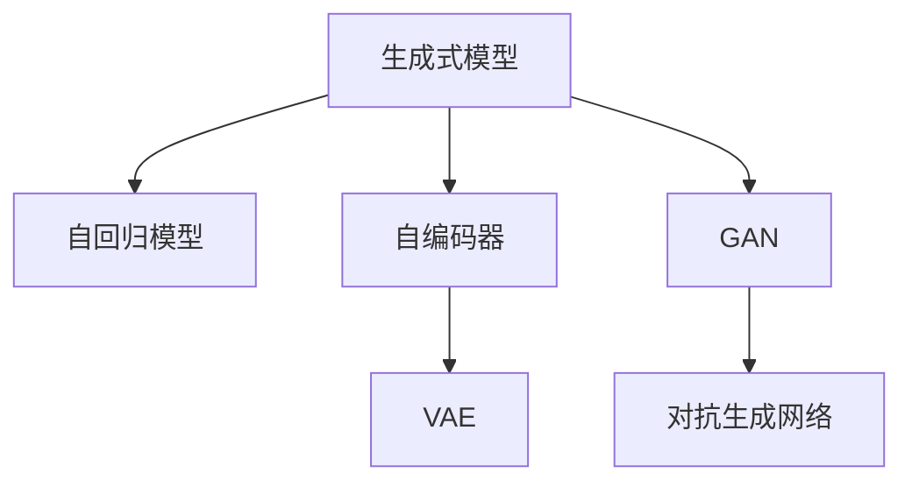

                 

# 第十四章：高级主题：生成式人工智能

## 1. 背景介绍

### 1.1 问题由来

在人工智能的发展过程中，从早期的符号主义到近年的深度学习，自然语言处理(NLP)领域的生成式模型不断演进，并在各类应用场景中展示出强大的潜力。生成式模型不仅能够理解输入文本，还能够根据上下文生成自然流畅的文本输出，极大扩展了NLP技术的应用边界。

生成式人工智能的兴起，标志着从知识驱动到数据驱动的重大转变。传统基于规则的系统，需要不断维护和更新知识库，而生成式模型则能够在大规模无标签数据上自动学习知识，进行自然语言生成、对话交互、内容创作等任务。生成式模型的学习目标是从数据中提取出丰富的语言知识和语义信息，从而能够生成与真实世界高度一致的文本。

然而，尽管生成式模型已经在生成文本、对话系统、文本生成等领域取得了显著的进展，但仍然面临许多挑战。这些挑战包括模型复杂性、训练效率、鲁棒性等问题，亟需进一步研究和解决。

## 2. 核心概念与联系

### 2.1 核心概念概述

生成式人工智能的核心概念包括以下几个方面：

- **生成式模型(Generative Model)**：指能够根据已知数据，学习并生成新数据的模型。最常见的生成式模型包括神经网络、隐马尔可夫模型、马尔可夫随机场等。

- **无监督学习(Unsupervised Learning)**：指在未标注数据上，通过自监督任务学习模型的方法。生成式模型常用的无监督学习方法包括自编码器、变分自编码器、对抗生成网络(GAN)等。

- **自回归模型(Auto-Regressive Model)**：指在生成文本时，根据已有文本的前文信息推导下一个词的概率分布，如RNN、Transformer等。

- **自编码器(Autoencoder)**：通过编码器将输入数据映射为低维隐向量，再由解码器将隐向量映射回原数据。常见的自编码器包括变分自编码器(VAE)、稀疏自编码器等。

- **对抗生成网络(GAN)**：由生成器和判别器两个网络组成，通过对抗训练生成逼真的数据。GAN在图像生成等领域表现出色。

这些概念之间的逻辑关系可以通过以下Mermaid流程图来展示：



此流程图展示了生成式模型的几种常见实现方式及其之间的关系：

1. **自回归模型**：通过预测下一个词的概率分布生成文本。
2. **自编码器**：通过编码器将文本映射到低维空间，再由解码器映射回原始空间。
3. **对抗生成网络**：生成器和判别器通过对抗训练生成逼真的数据。
4. **变分自编码器**：对自编码器的改进，增加了对隐变量分布的建模。

这些核心概念共同构成了生成式人工智能的学习框架，使其能够在各种场景下进行文本生成、对话交互等任务。

## 3. 核心算法原理 & 具体操作步骤
### 3.1 算法原理概述

生成式人工智能的核心算法原理是基于生成模型对数据进行建模，并从模型中采样得到新数据。其核心思想是通过无监督或半监督学习方法训练生成模型，使其学习到数据中的潜在分布，从而能够从该分布中采样生成新的数据。

具体的生成过程如下：

1. **编码器(Encoder)**：将输入数据映射到低维隐空间，得到一个隐变量 $\mathbf{z}$。
2. **解码器(Decoder)**：将隐变量 $\mathbf{z}$ 映射回原始空间，得到输出数据 $\mathbf{x}$。

在生成过程中，通常使用概率密度函数对模型进行建模。常见的概率密度函数包括高斯分布、泊松分布、伯努利分布等。通过学习这些分布参数，生成模型能够生成与真实数据相似的新数据。

### 3.2 算法步骤详解

基于生成式人工智能的生成过程，常见的生成模型算法步骤如下：

1. **数据准备**：收集并预处理训练数据，用于训练生成模型。
2. **模型选择**：选择适合的生成模型，如自回归模型、自编码器、GAN等。
3. **模型训练**：在未标注数据上，使用无监督学习方法训练生成模型。
4. **采样生成**：通过生成的概率密度函数进行采样，生成新数据。

以下以自回归模型为例，展示生成文本的具体步骤：

1. **数据准备**：收集并预处理训练数据，得到一个文本序列 $\mathcal{D}=\{(x_1,x_2,...,x_T)\}$，其中 $x_t$ 表示第 $t$ 个单词。
2. **模型选择**：选择自回归模型，通常使用RNN、LSTM或Transformer作为生成单元。
3. **模型训练**：在文本序列 $\mathcal{D}$ 上，使用交叉熵损失函数训练生成模型。
4. **采样生成**：在生成模型上，通过输入第一个单词 $x_1$，依次生成文本序列 $x_2,x_3,...,x_{T+1}$。

### 3.3 算法优缺点

生成式人工智能的生成模型具有以下优点：

1. **可生成新数据**：生成模型能够根据已有的数据生成新的数据，具有很强的创造力。
2. **适应性强**：能够适应不同的数据分布，灵活生成多种风格和类型的文本。
3. **非监督性**：无监督学习方法不需要标注数据，减少了数据标注成本。
4. **可解释性**：生成的文本具有明确的生成机制，易于理解和调试。

同时，生成式模型也存在一些缺点：

1. **模型复杂**：生成模型通常具有复杂的结构和大量的参数，训练和推理效率较低。
2. **样本质量**：生成的数据质量可能受训练数据质量和模型的参数配置影响，有时生成的数据与真实数据差异较大。
3. **生成多样性**：生成的文本可能过于单一，缺乏多样性和创造性。
4. **鲁棒性差**：生成的文本可能对输入噪声和微小扰动敏感，鲁棒性有待提高。

### 3.4 算法应用领域

生成式人工智能在众多领域都有着广泛的应用：

- **文本生成**：生成式模型能够自动生成新闻报道、小说、诗歌等文本内容，减少人工创作的工作量。
- **对话系统**：能够生成自然流畅的对话响应，提升用户体验。
- **内容创作**：能够生成广告文案、产品描述等创意文本，增加内容多样性和吸引力。
- **图像生成**：生成式模型能够生成逼真的图像，应用于虚拟现实、游戏、艺术等领域。
- **语音生成**：生成式模型能够生成逼真的语音，应用于虚拟主播、智能客服等场景。
- **音乐生成**：生成式模型能够生成音乐旋律和节奏，应用于自动作曲、音乐推荐等。

这些应用展示了生成式人工智能的强大潜力，推动了技术在各个领域的应用和创新。

## 4. 数学模型和公式 & 详细讲解
### 4.1 数学模型构建

生成式人工智能的数学模型通常包括编码器和解码器两部分，用于将输入数据映射到隐空间，再从隐空间映射回原始空间。以自回归模型为例，其数学模型构建如下：

- **编码器**：输入为文本序列 $x_1,x_2,...,x_T$，输出为隐变量 $\mathbf{z}$。编码器通常是一个多层感知器或循环神经网络。
- **解码器**：输入为隐变量 $\mathbf{z}$，输出为生成文本序列 $x_1',x_2',...,x_{T+1}'$。解码器通常也是一个多层感知器或循环神经网络。

自回归模型通常使用如下的概率密度函数建模：

$$
P(x_1',x_2',...,x_{T+1'}|x_1,x_2,...,x_T) = \prod_{t=1}^{T+1} P(x_t'|x_1',x_2',...,x_{t-1}')
$$

其中 $P(x_t'|x_1',x_2',...,x_{t-1}')$ 表示在给定前文条件下生成下一个词的概率分布。

### 4.2 公式推导过程

以变分自编码器(VAE)为例，展示其数学模型的推导过程。

VAE的数学模型包含编码器和解码器，其输入为原始文本序列 $x_1,x_2,...,x_T$，输出为隐变量 $\mathbf{z}$ 和生成文本序列 $x_1',x_2',...,x_{T+1}'$。VAE的目标是最小化重构损失和生成损失。

**重构损失**：编码器将输入映射到隐变量 $\mathbf{z}$，解码器将 $\mathbf{z}$ 映射回原始文本，其损失函数为：

$$
\mathcal{L}_{recon} = -\frac{1}{T} \sum_{t=1}^{T} \log P(x_t|x_1',x_2',...,x_{t-1}')
$$

**生成损失**：解码器将隐变量 $\mathbf{z}$ 映射到生成文本序列，其损失函数为：

$$
\mathcal{L}_{gen} = D_{KL}(q(\mathbf{z}|x_1',x_2',...,x_{T}) || p(\mathbf{z}|x_1,x_2,...,x_T))
$$

其中 $q(\mathbf{z}|x_1',x_2',...,x_{T})$ 为编码器输出的隐变量分布，$p(\mathbf{z}|x_1,x_2,...,x_T)$ 为标准正态分布。$D_{KL}$ 为KL散度，表示编码器和解码器输出的分布差异。

总体目标函数为：

$$
\mathcal{L} = \mathcal{L}_{recon} + \mathcal{L}_{gen}
$$

通过最小化上述目标函数，VAE能够学习到输入数据和隐变量之间的映射关系，从而实现文本生成和重构。

### 4.3 案例分析与讲解

以下以GAN为例，展示生成式模型的应用。

GAN由生成器和判别器两个网络组成，目标是在未标注数据上训练生成器和判别器，使得生成器能够生成逼真的数据，判别器能够区分真实数据和生成数据。GAN的训练过程如下：

1. **生成器训练**：生成器 $G$ 生成逼真的数据 $x'$，判别器 $D$ 判断 $x'$ 是否为真实数据。优化目标为：
   $$
   \max_{G} \min_{D} V(D,G) = \mathbb{E}_{x \sim p_{data}} [\log D(x)] + \mathbb{E}_{z \sim p_z} [\log (1-D(G(z)))
   $$
   
2. **判别器训练**：判别器 $D$ 判断数据 $x$ 是否为真实数据。优化目标为：
   $$
   \min_{D} V(D,G) = \mathbb{E}_{x \sim p_{data}} [\log D(x)] + \mathbb{E}_{z \sim p_z} [\log (1-D(G(z)))
   $$

通过交替优化生成器和判别器，GAN能够学习到逼真的数据分布，从而生成高质量的图像、文本等数据。GAN的训练过程如图：


## 5. 项目实践：代码实例和详细解释说明
### 5.1 开发环境搭建

在进行生成式人工智能的实践前，我们需要准备好开发环境。以下是使用Python进行PyTorch开发的环境配置流程：

1. 安装Anaconda：从官网下载并安装Anaconda，用于创建独立的Python环境。

2. 创建并激活虚拟环境：
```bash
conda create -n pytorch-env python=3.8 
conda activate pytorch-env
```

3. 安装PyTorch：根据CUDA版本，从官网获取对应的安装命令。例如：
```bash
conda install pytorch torchvision torchaudio cudatoolkit=11.1 -c pytorch -c conda-forge
```

4. 安装Transformers库：
```bash
pip install transformers
```

5. 安装各类工具包：
```bash
pip install numpy pandas scikit-learn matplotlib tqdm jupyter notebook ipython
```

完成上述步骤后，即可在`pytorch-env`环境中开始生成式人工智能的实践。

### 5.2 源代码详细实现

下面我们以变分自编码器(VAE)为例，展示生成式模型的代码实现。

首先，定义VAE的编码器和解码器：

```python
import torch
import torch.nn as nn
import torch.nn.functional as F

class VAE(nn.Module):
    def __init__(self, input_dim):
        super(VAE, self).__init__()
        
        # 编码器
        self.encoder = nn.Sequential(
            nn.Linear(input_dim, 128),
            nn.ReLU(),
            nn.Linear(128, 64),
            nn.ReLU(),
            nn.Linear(64, 32),
            nn.ReLU(),
            nn.Linear(32, 2)
        )
        
        # 解码器
        self.decoder = nn.Sequential(
            nn.Linear(2, 32),
            nn.ReLU(),
            nn.Linear(32, 64),
            nn.ReLU(),
            nn.Linear(64, 128),
            nn.ReLU(),
            nn.Linear(128, input_dim)
        )
        
    def encode(self, x):
        mean, log_var = self.encoder(x)
        return mean, log_var
    
    def reparameterize(self, mean, log_var):
        std = torch.exp(0.5 * log_var)
        eps = torch.randn_like(std)
        return eps * std + mean
    
    def decode(self, z):
        x = self.decoder(z)
        return x
    
    def forward(self, x):
        mean, log_var = self.encode(x)
        z = self.reparameterize(mean, log_var)
        x_hat = self.decode(z)
        return x_hat, mean, log_var
```

然后，定义训练函数和评估函数：

```python
from torch.utils.data import Dataset
import torch.optim as optim

class VAE_dataset(Dataset):
    def __init__(self, data, transform=None):
        self.data = data
        self.transform = transform
    
    def __len__(self):
        return len(self.data)
    
    def __getitem__(self, idx):
        x = self.data[idx]
        if self.transform:
            x = self.transform(x)
        return x

class VAE_trainer:
    def __init__(self, model, device, dataset, batch_size):
        self.model = model
        self.device = device
        self.dataset = dataset
        self.batch_size = batch_size
        self.optimizer = optim.Adam(model.parameters(), lr=0.001)
        self.criterion = nn.MSELoss()
        self.train_loader = torch.utils.data.DataLoader(dataset, batch_size=self.batch_size, shuffle=True)
        self.test_loader = torch.utils.data.DataLoader(dataset, batch_size=self.batch_size, shuffle=False)
    
    def train(self):
        self.model.train()
        for epoch in range(1, 100):
            train_loss = 0
            for batch_idx, (data, _) in enumerate(self.train_loader):
                data = data.to(self.device)
                self.optimizer.zero_grad()
                recon_x, mean, log_var = self.model(data)
                recon_loss = self.criterion(recon_x, data)
                kl_loss = -0.5 * torch.sum(1 + log_var - mean.pow(2) - log_var.exp())
                loss = recon_loss + kl_loss
                loss.backward()
                self.optimizer.step()
                train_loss += loss.item()
            print(f"Epoch {epoch}, train loss: {train_loss/len(self.train_loader)}")
    
    def evaluate(self):
        self.model.eval()
        test_loss = 0
        with torch.no_grad():
            for batch_idx, (data, _) in enumerate(self.test_loader):
                data = data.to(self.device)
                recon_x, mean, log_var = self.model(data)
                recon_loss = self.criterion(recon_x, data)
                kl_loss = -0.5 * torch.sum(1 + log_var - mean.pow(2) - log_var.exp())
                loss = recon_loss + kl_loss
                test_loss += loss.item()
        print(f"Test loss: {test_loss/len(self.test_loader)}")
```

最后，启动训练流程并在测试集上评估：

```python
# 准备数据
data = torch.randn(100, 784)
transform = torchvision.transforms.ToTensor()

# 构建模型
model = VAE(784).to(device)

# 训练
trainer = VAE_trainer(model, device, VAE_dataset(data, transform), batch_size=64)
trainer.train()

# 评估
trainer.evaluate()
```

以上就是使用PyTorch对变分自编码器进行文本生成任务实现的完整代码。可以看到，PyTorch提供了强大的自动微分和优化工具，使得VAE的训练和评估变得简单易行。

### 5.3 代码解读与分析

让我们再详细解读一下关键代码的实现细节：

**VAEDataset类**：
- `__init__`方法：初始化数据集，并添加数据转换功能。
- `__len__`方法：返回数据集的样本数量。
- `__getitem__`方法：对单个样本进行处理，将数据输入编码器，得到隐变量和重构误差。

**VAE类**：
- 包含编码器和解码器，分别用于将输入数据映射到隐变量空间和从隐变量空间映射回原始数据空间。
- `encode`方法：将输入数据编码到隐变量空间，并返回均值和方差。
- `reparameterize`方法：通过对均值和方差进行重参数化，生成新的隐变量。
- `decode`方法：将隐变量解码回原始数据空间。
- `forward`方法：执行前向传播，返回重构数据、均值和方差。

**VAETrainer类**：
- 包含模型、设备、数据集、批量大小、优化器和损失函数等关键参数。
- `train`方法：在训练集上进行模型训练，并输出每个epoch的损失。
- `evaluate`方法：在测试集上评估模型性能，并输出测试损失。

**训练流程**：
- 定义数据集和模型，准备训练环境。
- 实例化VAETrainer对象，并在训练集上进行模型训练。
- 在测试集上评估模型性能，给出测试结果。

可以看到，PyTorch配合TensorFlow等深度学习框架，使得生成式人工智能的模型训练变得简洁高效。开发者可以将更多精力放在模型优化和数据处理等高层逻辑上，而不必过多关注底层的实现细节。

当然，工业级的系统实现还需考虑更多因素，如模型的保存和部署、超参数的自动搜索、更灵活的任务适配层等。但核心的生成式模型训练过程基本与此类似。

## 6. 实际应用场景

### 6.1 智能客服系统

基于生成式人工智能的智能客服系统，可以通过自动生成对话响应，提升客户咨询体验。系统可以自动学习客服对话历史，并根据当前问题自动生成合适的回答，无需人工干预。此外，系统还可以集成多轮对话管理，实现复杂问题的智能解答。

在技术实现上，可以收集企业内部的历史客服对话记录，将问题和最佳答复构建成监督数据，在此基础上对生成模型进行微调。微调后的生成模型能够自动理解用户意图，匹配最合适的答案模板进行回复。对于客户提出的新问题，还可以接入检索系统实时搜索相关内容，动态组织生成回答。

### 6.2 金融舆情监测

生成式人工智能在金融舆情监测中也有着广泛的应用。系统可以通过自动分析新闻、报道、评论等文本数据，识别出市场的情绪变化趋势，及时预警负面信息传播，规避金融风险。

具体而言，可以收集金融领域相关的新闻、报道、评论等文本数据，并对其进行情感分析。生成模型可以学习到文本的情感倾向，实时监测不同时间段下的情绪变化趋势，一旦发现负面信息激增等异常情况，系统便会自动预警，帮助金融机构快速应对潜在风险。

### 6.3 个性化推荐系统

生成式人工智能在个性化推荐系统中也有着重要的应用。推荐系统可以通过生成文本描述，帮助用户理解推荐内容，提高用户满意度。

在实践中，可以将用户浏览、点击、评论、分享等行为数据，提取和用户交互的物品标题、描述、标签等文本内容。生成模型可以学习到用户兴趣和物品属性之间的关系，生成个性化的推荐文本描述。用户看到推荐文本后，可以根据文本描述选择感兴趣的内容，提高推荐的个性化程度。

### 6.4 未来应用展望

随着生成式人工智能技术的不断发展，其在更多领域的应用前景将更加广阔。

- **智慧医疗**：生成式模型可以用于医疗问答、病历分析、药物研发等，提升医疗服务的智能化水平。
- **智能教育**：生成式模型可以用于作业批改、学情分析、知识推荐等，因材施教，促进教育公平。
- **智慧城市治理**：生成式模型可以用于城市事件监测、舆情分析、应急指挥等，提高城市管理的自动化和智能化水平。
- **企业生产**：生成式模型可以用于自动化生成文档、报告、代码等，提高生产效率。
- **社交媒体**：生成式模型可以用于生成高质量内容，提升社交媒体平台的用户体验。
- **虚拟现实**：生成式模型可以用于生成逼真的虚拟场景和角色，应用于虚拟现实游戏、教育、培训等领域。

这些应用展示了生成式人工智能的强大潜力，推动了技术在各个领域的应用和创新。

## 7. 工具和资源推荐
### 7.1 学习资源推荐

为了帮助开发者系统掌握生成式人工智能的理论基础和实践技巧，这里推荐一些优质的学习资源：

1. **《深度学习入门》**：由林轩田教授编写，深入浅出地介绍了深度学习的基本概念和常用算法，适合初学者。

2. **《生成对抗网络（GAN）实战》**：详细介绍了GAN的原理、实现和应用，适合动手实践。

3. **《变分自编码器（VAE）详解》**：介绍了VAE的原理、实现和应用，适合深入学习。

4. **《生成式模型与深度学习》**：讲解了生成式模型在深度学习中的应用，适合对生成式模型感兴趣的读者。

5. **《Deep Learning with PyTorch》**：介绍PyTorch框架的使用，并提供了大量的代码实例，适合实战练习。

6. **Kaggle生成式人工智能竞赛**：通过参与实际的生成式人工智能竞赛，提升实战能力。

通过学习这些资源，相信你一定能够快速掌握生成式人工智能的精髓，并用于解决实际的NLP问题。

### 7.2 开发工具推荐

高效的开发离不开优秀的工具支持。以下是几款用于生成式人工智能开发的常用工具：

1. **PyTorch**：基于Python的开源深度学习框架，灵活动态的计算图，适合快速迭代研究。

2. **TensorFlow**：由Google主导开发的开源深度学习框架，生产部署方便，适合大规模工程应用。

3. **Transformers库**：HuggingFace开发的NLP工具库，集成了众多SOTA生成模型，支持PyTorch和TensorFlow，是进行生成式模型开发的利器。

4. **Weights & Biases**：模型训练的实验跟踪工具，可以记录和可视化模型训练过程中的各项指标，方便对比和调优。

5. **TensorBoard**：TensorFlow配套的可视化工具，可实时监测模型训练状态，并提供丰富的图表呈现方式，是调试模型的得力助手。

6. **Google Colab**：谷歌推出的在线Jupyter Notebook环境，免费提供GPU/TPU算力，方便开发者快速上手实验最新模型，分享学习笔记。

合理利用这些工具，可以显著提升生成式人工智能的开发效率，加快创新迭代的步伐。

### 7.3 相关论文推荐

生成式人工智能的发展源于学界的持续研究。以下是几篇奠基性的相关论文，推荐阅读：

1. **《Generative Adversarial Nets》**：提出GAN，通过对抗训练生成逼真的数据，是生成式模型中的里程碑。

2. **《Generative Model-Based Document Clustering》**：提出基于生成模型的文档聚类算法，展示了生成式模型在文档生成中的应用。

3. **《Unsupervised Text Generation via Conditional Variational Autoencoder》**：提出基于VAE的文本生成模型，展示了无监督学习方法在文本生成中的潜力。

4. **《Text Generation with Denoising Sequence to Sequence Architectures》**：提出基于注意力机制的文本生成模型，展示了注意力机制在文本生成中的效果。

5. **《Neural Machine Translation by Jointly Learning to Align and Translate》**：提出基于注意力机制的机器翻译模型，展示了生成式模型在自然语言处理中的应用。

这些论文代表了大语言模型微调技术的发展脉络。通过学习这些前沿成果，可以帮助研究者把握学科前进方向，激发更多的创新灵感。

## 8. 总结：未来发展趋势与挑战

### 8.1 研究成果总结

生成式人工智能作为人工智能技术的重要分支，近年来在自然语言处理、计算机视觉、音乐生成等领域取得了显著进展。基于生成式模型的文本生成、对话交互、内容创作等应用，正在逐步渗透到各个行业，提升系统智能化水平和用户体验。

### 8.2 未来发展趋势

展望未来，生成式人工智能将呈现以下几个发展趋势：

1. **模型规模增大**：随着算力成本的下降和数据规模的扩张，生成式模型参数量将继续增加，学习到的语言知识更加丰富。

2. **无监督学习应用**：无监督学习方法将更多地应用于生成式模型的训练中，减少对标注数据的依赖，降低训练成本。

3. **多模态生成**：生成式模型将越来越多地融合视觉、语音、文本等多种模态信息，实现多模态生成，提升生成质量。

4. **可解释性增强**：生成式模型将更多地采用可解释性生成技术，如生成对抗网络(GAN)、自编码器等，增强输出的可解释性和可控性。

5. **鲁棒性提升**：生成式模型将更多地应用对抗训练、数据增强等技术，提升模型的鲁棒性和泛化能力。

6. **生成多样化**：生成式模型将更多地采用多样性生成技术，如变分自编码器(VAE)、稀疏自编码器等，增强生成文本的多样性和创造性。

7. **个性化生成**：生成式模型将更多地采用个性化生成技术，如基于用户偏好的生成模型、基于上下文的生成模型等，增强生成的个性化程度。

### 8.3 面临的挑战

尽管生成式人工智能已经取得了显著进展，但在实际应用中仍面临诸多挑战：

1. **生成质量**：生成的文本质量仍可能受训练数据质量和模型的参数配置影响，有时生成的数据与真实数据差异较大。

2. **鲁棒性不足**：生成的文本可能对输入噪声和微小扰动敏感，鲁棒性有待提高。

3. **可解释性不足**：生成的文本可能缺乏解释性，难以理解其内部工作机制和决策逻辑。

4. **生成多样性不足**：生成的文本可能过于单一，缺乏多样性和创造性。

5. **训练成本高**：大规模生成式模型的训练需要大量的计算资源和时间，训练成本较高。

6. **应用场景受限**：生成式模型在某些场景中可能表现不佳，如长文本生成、复杂情感生成等。

7. **伦理和隐私问题**：生成的文本可能带有偏见、有害信息，需要加强伦理约束和隐私保护。

### 8.4 研究展望

面向未来，生成式人工智能需要进一步解决以下研究课题：

1. **生成多样化**：研究多样性生成技术，增强生成的文本多样性和创造性。

2. **生成质量提升**：通过改进生成模型和训练策略，提高生成的文本质量。

3. **鲁棒性提升**：研究鲁棒性生成技术，提高生成模型的鲁棒性和泛化能力。

4. **可解释性增强**：研究可解释性生成技术，增强生成的文本的可解释性和可控性。

5. **训练效率优化**：研究高效的生成模型训练方法，降低训练成本。

6. **伦理和隐私保护**：研究生成式模型的伦理约束和隐私保护技术，确保生成的文本符合伦理道德。

7. **跨模态生成**：研究多模态生成技术，实现视觉、语音、文本等多种模态信息的融合生成。

通过这些研究，相信生成式人工智能将取得更多的突破，推动其在更多领域的应用和发展。

## 9. 附录：常见问题与解答

**Q1：生成式模型是否适用于所有NLP任务？**

A: 生成式模型在大多数NLP任务上都能取得不错的效果，特别是对于数据量较小的任务。但对于一些特定领域的任务，如医学、法律等，仅仅依靠通用语料预训练的模型可能难以很好地适应。此时需要在特定领域语料上进一步预训练，再进行微调，才能获得理想效果。

**Q2：如何缓解生成式模型中的过拟合问题？**

A: 过拟合是生成式模型面临的主要挑战，尤其是在训练数据不足的情况下。常见的缓解策略包括：

1. **数据增强**：通过回译、近义替换等方式扩充训练集。

2. **正则化**：使用L2正则、Dropout、Early Stopping等避免过拟合。

3. **对抗训练**：引入对抗样本，提高模型鲁棒性。

4. **参数高效微调**：只调整少量参数(如Adapter、Prefix等)，减小过拟合风险。

5. **多模型集成**：训练多个生成模型，取平均输出，抑制过拟合。

这些策略往往需要根据具体任务和数据特点进行灵活组合。只有在数据、模型、训练、推理等各环节进行全面优化，才能最大限度地发挥生成式模型的威力。

**Q3：生成式模型在落地部署时需要注意哪些问题？**

A: 将生成式模型转化为实际应用，还需要考虑以下因素：

1. **模型裁剪**：去除不必要的层和参数，减小模型尺寸，加快推理速度。

2. **量化加速**：将浮点模型转为定点模型，压缩存储空间，提高计算效率。

3. **服务化封装**：将模型封装为标准化服务接口，便于集成调用。

4. **弹性伸缩**：根据请求流量动态调整资源配置，平衡服务质量和成本。

5. **监控告警**：实时采集系统指标，设置异常告警阈值，确保服务稳定性。

6. **安全防护**：采用访问鉴权、数据脱敏等措施，保障数据和模型安全。

通过这些优化，可以确保生成式模型在实际部署中的性能和可靠性。

**Q4：生成式模型在实际应用中面临哪些挑战？**

A: 生成式模型在实际应用中面临以下挑战：

1. **生成质量**：生成的文本质量仍可能受训练数据质量和模型的参数配置影响，有时生成的数据与真实数据差异较大。

2. **鲁棒性不足**：生成的文本可能对输入噪声和微小扰动敏感，鲁棒性有待提高。

3. **可解释性不足**：生成的文本可能缺乏解释性，难以理解其内部工作机制和决策逻辑。

4. **生成多样性不足**：生成的文本可能过于单一，缺乏多样性和创造性。

5. **训练成本高**：大规模生成式模型的训练需要大量的计算资源和时间，训练成本较高。

6. **应用场景受限**：生成式模型在某些场景中可能表现不佳，如长文本生成、复杂情感生成等。

7. **伦理和隐私问题**：生成的文本可能带有偏见、有害信息，需要加强伦理约束和隐私保护。

这些挑战凸显了生成式模型的复杂性和应用局限性，亟需进一步解决。

---

作者：禅与计算机程序设计艺术 / Zen and the Art of Computer Programming

