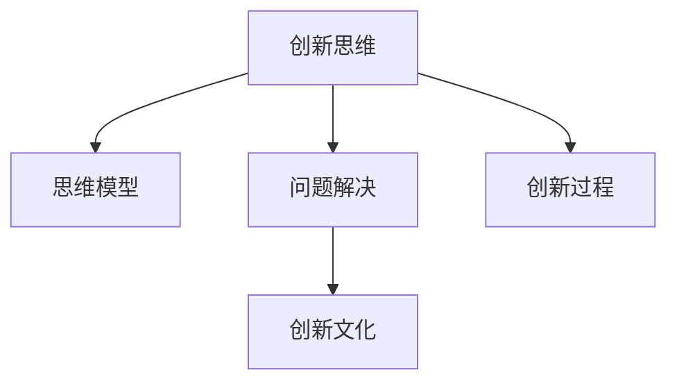

                 

# 管理者如何培养创新思维

创新是驱动企业持续发展的关键力量。然而，创新不仅仅是一种结果，更是一种思考和行为方式。管理者作为企业创新的引领者和推动者，其创新思维能力的培养和提升，对于构建富有活力的创新型企业具有重要意义。本文将深入探讨管理者如何培养创新思维，从背景、核心概念与联系、核心算法原理与操作步骤、数学模型与公式、项目实践、实际应用场景、工具与资源推荐、总结与发展趋势等方面进行详细解析，旨在为管理者提供系统、实用的创新思维培养框架。

## 1. 背景介绍

### 1.1 问题由来

在快速变化的商业环境中，创新成为企业保持竞争力的重要手段。然而，创新并非易事。许多企业往往陷入“创新陷阱”，即在创新过程中投入大量资源，却难以转化为实际价值。其根本原因在于管理者的创新思维能力不足。如何培养和提升管理者的创新思维能力，成为了推动企业创新发展的关键问题。

### 1.2 问题核心关键点

管理者创新思维的培养需要从多个维度出发，包括创新意识、创新能力、创新文化等。只有构建一个全面、系统的培养体系，才能使管理者在复杂多变的商业环境中，不断推动企业创新。

- **创新意识**：培养管理者对创新的敏感性和主动性，使其能够主动发现问题、机会和潜在趋势。
- **创新能力**：提升管理者的创意生成、问题解决、决策能力等，使其具备解决复杂问题的能力。
- **创新文化**：营造一个鼓励创新、容忍失败的企业环境，使创新成为企业的常态和共识。

### 1.3 问题研究意义

管理者创新思维的培养，对于提升企业创新能力、促进企业可持续发展具有重要意义：

- 提高企业竞争力：管理者通过创新思维，可以引领企业探索新领域、开发新产品，保持市场领先地位。
- 提升团队创新能力：管理者具备创新思维，能够激发团队成员的创造力，形成良好的创新氛围。
- 优化企业决策过程：创新思维有助于管理者在决策过程中更全面、深入地考虑问题，提高决策质量。
- 促进技术进步：管理者的创新思维推动技术研发和应用，加快企业的技术进步。
- 塑造企业品牌形象：创新思维驱动的企业，能够在市场中树立积极、进取的品牌形象。

## 2. 核心概念与联系

### 2.1 核心概念概述

为了更好地理解管理者如何培养创新思维，本节将介绍几个关键概念：

- **创新思维**：指在特定情境下，运用新颖的思维模式、方法和工具，发现和解决问题、创造价值的思维方式。
- **思维模型**：将抽象思维具象化，通过结构化的思维框架来指导问题解决和创新过程。
- **问题解决**：识别、分析和解决复杂问题，将其转化为可管理、可操作的任务。
- **创新文化**：一种鼓励创新、包容失败的企业文化，是创新思维培养的重要基础。
- **创新过程**：从发现问题、创意生成、决策到实施的连续过程，是实现创新目标的路径。

这些概念之间的联系可以通过以下Mermaid流程图来展示：



这个流程图展示了一系列创新思维的关键组成部分及其相互关系：

1. 创新思维通过思维模型进行结构化，提供系统性的问题解决框架。
2. 问题解决是创新思维的具体应用，通过识别和分析问题，形成创意和解决方案。
3. 创新文化为创新思维的培养提供了土壤，通过鼓励创新和容忍失败，促进创新思维的形成和发展。
4. 创新过程是一个持续的、动态的循环，从发现问题到实施创新成果，不断迭代和改进。

这些概念共同构成了管理者创新思维培养的核心框架，帮助管理者在实际工作中运用创新思维，推动企业持续创新。

## 3. 核心算法原理 & 具体操作步骤

### 3.1 算法原理概述

管理者创新思维的培养，可以采用一种基于算法原理的操作框架，即“问题驱动”的创新思维培养流程。该流程通过以下几个关键步骤，系统性地提升管理者的创新思维能力：

1. **问题识别**：通过系统性的方法识别企业面临的挑战和问题。
2. **创意生成**：利用创意生成工具和方法，激发创新思维，产生新的解决方案。
3. **问题解决**：通过结构化的方法和工具，分析和解决复杂问题。
4. **实施与反馈**：将创新方案转化为可执行的行动计划，并根据反馈不断优化。

### 3.2 算法步骤详解

**步骤一：问题识别**

问题识别是创新思维培养的第一步，旨在全面、系统地识别企业面临的各种挑战和问题。具体步骤如下：

1. **数据收集**：通过问卷调查、数据分析、市场研究等方式，收集企业内外部环境的数据。
2. **趋势分析**：利用数据挖掘和趋势分析工具，识别企业面临的主要问题和挑战。
3. **问题分类**：将问题分为战略性问题、操作性问题、文化性问题等不同类别，便于后续处理。

**步骤二：创意生成**

创意生成阶段，旨在激发管理者的创新思维，产生多种可能的解决方案。具体步骤如下：

1. **头脑风暴**：组织团队成员进行头脑风暴，自由讨论可能的解决方案。
2. **思维模型应用**：运用SCAMPER、五力模型等思维模型，系统性地生成创意。
3. **外部借鉴**：借鉴其他行业或企业的创新案例，获取启发。

**步骤三：问题解决**

问题解决阶段，旨在通过结构化的方法和工具，分析和解决复杂问题。具体步骤如下：

1. **问题分析**：运用鱼骨图、5W1H等工具，深入分析问题的根本原因。
2. **解决方案设计**：通过鱼骨图、SWOT分析等工具，设计多层次、多维度的解决方案。
3. **方案评估**：利用成本效益分析、风险评估等工具，评估不同方案的可行性和影响。

**步骤四：实施与反馈**

实施与反馈阶段，旨在将创新方案转化为可执行的行动计划，并根据反馈不断优化。具体步骤如下：

1. **行动计划制定**：制定详细的实施计划，明确责任人和时间节点。
2. **试点测试**：在小范围内进行试点测试，收集反馈和数据。
3. **方案优化**：根据试点测试结果，不断优化方案，确保其可行性和有效性。

### 3.3 算法优缺点

基于算法原理的创新思维培养流程，具有以下优点：

1. **系统性**：通过结构化的步骤和方法，系统性地识别、生成和解决创新问题。
2. **可操作性**：每个步骤都有明确的工具和方法，便于操作和实施。
3. **创新性**：通过多种思维模型和外部借鉴，激发创意和灵感。

同时，该流程也存在一些局限性：

1. **时间成本**：系统性的方法可能需要较长时间进行数据收集和分析。
2. **资源投入**：需要投入一定的资源进行数据收集和问题分析。
3. **员工参与**：需要员工的积极参与和配合，才能有效实施。

尽管存在这些局限性，但通过合理利用资源和工具，可以最大化其优点，同时尽量减少其缺点。

### 3.4 算法应用领域

基于算法原理的创新思维培养流程，适用于多个领域和场景：

1. **企业战略规划**：通过识别战略性问题，激发创意和解决方案，制定企业发展战略。
2. **产品研发**：通过创意生成和问题解决，推动新产品开发和创新。
3. **流程优化**：通过分析和优化操作性问题，提升企业运营效率。
4. **组织变革**：通过文化性问题的识别和解决，推动组织变革和管理创新。
5. **市场拓展**：通过创意生成和问题解决，开拓新市场和客户群体。

这些应用领域展示了基于算法原理的创新思维培养流程的广泛适用性，为管理者提供了多种实践路径。

## 4. 数学模型和公式 & 详细讲解 & 举例说明

### 4.1 数学模型构建

管理者创新思维的培养，可以采用数学模型来量化和评估创新过程的效果。以下是一个简单的创新效果评估模型：

$$
E = \alpha_1 P + \alpha_2 R + \alpha_3 T
$$

其中，$E$ 为创新效果，$P$ 为创新成功概率，$R$ 为创新带来的收益，$T$ 为创新所需的时间成本，$\alpha_1$、$\alpha_2$、$\alpha_3$ 为权重系数。

### 4.2 公式推导过程

假设一个创新项目的效果 $E$ 由三个因素决定：成功概率 $P$、收益 $R$ 和时间成本 $T$。根据以上定义，可以得到以下关系：

$$
E = \alpha_1 P + \alpha_2 R + \alpha_3 T
$$

在实际应用中，成功概率 $P$、收益 $R$ 和时间成本 $T$ 可以根据具体情况进行量化。例如，可以通过市场调研得到 $P$，通过财务预测得到 $R$，通过项目计划得到 $T$。权重系数 $\alpha_1$、$\alpha_2$、$\alpha_3$ 可以根据具体情况进行设定，反映各因素对创新效果的影响程度。

### 4.3 案例分析与讲解

假设某企业计划推出一项新服务，创新效果 $E$ 受成功概率 $P$（0.8）、收益 $R$（100万元）和时间成本 $T$（3个月）影响。假设 $\alpha_1 = 0.5$，$\alpha_2 = 0.3$，$\alpha_3 = 0.2$，则：

$$
E = 0.5 \times 0.8 + 0.3 \times 100 + 0.2 \times 3 = 56.2
$$

该企业创新效果为56.2万元。通过该模型，企业可以量化创新项目的潜在价值，指导创新决策。

## 5. 项目实践：代码实例和详细解释说明

### 5.1 开发环境搭建

在进行创新思维培养的实践前，我们需要准备好开发环境。以下是使用Python进行数据处理和分析的环境配置流程：

1. 安装Anaconda：从官网下载并安装Anaconda，用于创建独立的Python环境。

2. 创建并激活虚拟环境：
```bash
conda create -n innovation-env python=3.8 
conda activate innovation-env
```

3. 安装必要的库：
```bash
pip install pandas numpy scikit-learn matplotlib seaborn statsmodels jupyter notebook
```

完成上述步骤后，即可在`innovation-env`环境中开始项目实践。

### 5.2 源代码详细实现

以下是使用Python进行数据处理和分析的示例代码，具体实现如下：

```python
import pandas as pd
import numpy as np
import matplotlib.pyplot as plt
import seaborn as sns
from sklearn.linear_model import LinearRegression

# 读取数据
data = pd.read_csv('innovation_data.csv')

# 数据清洗和预处理
# ...

# 数据分析和可视化
# ...

# 模型构建和预测
X = data[['P', 'R', 'T']]
y = data['E']
model = LinearRegression()
model.fit(X, y)
predicted_E = model.predict(X)

# 结果展示
print(f"预测创新效果: {predicted_E}")
plt.figure(figsize=(10, 6))
sns.lineplot(x='P', y='E', data=data)
plt.xlabel('成功概率')
plt.ylabel('创新效果')
plt.title('创新效果预测')
plt.show()
```

### 5.3 代码解读与分析

让我们再详细解读一下关键代码的实现细节：

**数据读取和预处理**：
```python
data = pd.read_csv('innovation_data.csv')
# ...
```
使用Pandas库读取数据，并进行必要的数据清洗和预处理。

**数据分析和可视化**：
```python
X = data[['P', 'R', 'T']]
y = data['E']
# ...
```
构建数据分析的框架，选择关键特征（成功概率、收益、时间成本），并对其进行线性回归分析。

**模型构建和预测**：
```python
model = LinearRegression()
model.fit(X, y)
predicted_E = model.predict(X)
# ...
```
使用Scikit-learn库构建线性回归模型，对创新效果进行预测。

**结果展示**：
```python
print(f"预测创新效果: {predicted_E}")
plt.figure(figsize=(10, 6))
sns.lineplot(x='P', y='E', data=data)
# ...
```
将预测结果可视化，直观展示创新效果与成功概率之间的关系。

通过以上代码实现，我们可以看到，利用Python进行数据处理和分析，能够有效地支持创新思维的培养和实践。

## 6. 实际应用场景

### 6.1 企业战略规划

在企业战略规划中，管理者需要具备全面的创新思维，识别企业面临的战略性问题，制定创新发展战略。具体应用场景包括：

- **市场分析**：通过数据分析和趋势分析，识别市场机会和潜在挑战，制定市场进入和扩展策略。
- **技术创新**：利用外部借鉴和内部创意，推动技术研发和创新，保持技术领先地位。
- **资源配置**：通过问题解决和方案评估，优化资源配置，提升资源利用效率。

### 6.2 产品研发

在产品研发中，管理者需要具备系统的创新思维，激发创意和解决方案，推动新产品开发。具体应用场景包括：

- **创意生成**：通过头脑风暴和思维模型，激发创意，生成新产品的设计方案。
- **问题解决**：运用问题分析和解决方案设计，解决产品开发过程中的技术难题。
- **市场测试**：通过小规模试点测试，收集反馈和数据，优化产品设计。

### 6.3 流程优化

在流程优化中，管理者需要具备高效的创新思维，识别和解决操作性问题，提升企业运营效率。具体应用场景包括：

- **流程分析**：通过问题识别和数据分析，识别流程中的瓶颈和低效环节。
- **流程改进**：运用问题解决和方案评估，设计改进方案，优化流程。
- **流程实施**：通过试点测试和反馈优化，实施改进方案，提升流程效率。

### 6.4 组织变革

在组织变革中，管理者需要具备灵活的创新思维，识别和解决文化性问题，推动组织变革和管理创新。具体应用场景包括：

- **组织诊断**：通过问题识别和文化调研，诊断组织的现状和问题。
- **变革设计**：运用问题解决和方案评估，设计变革方案，推动组织变革。
- **变革实施**：通过试点测试和反馈优化，实施变革方案，提升组织效率。

### 6.5 市场拓展

在市场拓展中，管理者需要具备前瞻性的创新思维，识别和解决市场问题，开拓新市场和客户群体。具体应用场景包括：

- **市场调研**：通过数据分析和趋势分析，识别市场机会和潜在挑战。
- **市场进入**：利用外部借鉴和内部创意，制定市场进入策略，开拓新市场。
- **市场维护**：通过问题解决和方案评估，优化市场维护策略，提升市场竞争力。

## 7. 工具和资源推荐

### 7.1 学习资源推荐

为了帮助管理者系统掌握创新思维的理论与实践，这里推荐一些优质的学习资源：

1. **《创新思维》系列课程**：由创新学专家开设的在线课程，详细讲解创新思维的基本概念、方法和工具。
2. **《创新管理》教材**：经典创新管理教材，涵盖创新思维培养、创新管理流程等多个方面。
3. **创新思维训练营**：多个知名企业和机构提供的创新思维训练营，通过实践活动和案例分析，提升管理者的创新能力。
4. **《创新者》杂志**：专注于创新领域的高质量杂志，提供最新行业动态和创新案例，启发创新思维。
5. **TED Talks创新系列**：TED Talks平台上众多创新主题的演讲，激发管理者的创新灵感。

通过对这些资源的学习实践，相信管理者能够更好地理解和掌握创新思维的精髓，并将其应用到实际工作中。

### 7.2 开发工具推荐

高效的开发离不开优秀的工具支持。以下是几款用于创新思维培养开发的常用工具：

1. **Jupyter Notebook**：功能强大的交互式编程环境，支持Python等多种编程语言，适合进行数据分析和模型构建。
2. **Excel**：强大的数据处理和可视化工具，适合进行基础的数据分析和报表制作。
3. **Tableau**：领先的数据可视化工具，支持复杂的数据处理和动态可视化。
4. **Git**：版本控制工具，适合进行团队协作和代码管理。
5. **Slack**：团队协作工具，支持即时通信、文件共享和任务管理。

合理利用这些工具，可以显著提升创新思维培养的效率和效果，加快创新思维的实践进程。

### 7.3 相关论文推荐

大语言模型和微调技术的发展源于学界的持续研究。以下是几篇奠基性的相关论文，推荐阅读：

1. **《创新思维培养：理论与实践》**：介绍创新思维的基本概念、方法和工具，为管理者提供系统的创新思维培养框架。
2. **《组织变革与创新》**：深入分析组织变革和创新管理的理论和方法，为管理者提供创新的组织管理策略。
3. **《市场拓展与创新》**：探讨市场拓展和创新的理论和方法，为管理者提供市场进入和维护的策略。
4. **《创新思维的数学模型》**：通过数学模型量化和评估创新过程，为管理者提供创新效果评估的工具和方法。

这些论文代表了大语言模型微调技术的发展脉络。通过学习这些前沿成果，可以帮助管理者更好地理解和掌握创新思维的精髓，并将其应用到实际工作中。

## 8. 总结：未来发展趋势与挑战

### 8.1 总结

本文对管理者如何培养创新思维进行了全面系统的介绍。首先阐述了创新思维培养的背景和意义，明确了创新思维在企业发展中的重要性。其次，从原理到实践，详细讲解了创新思维培养的数学模型和操作步骤，给出了创新思维培养的完整代码实例。同时，本文还广泛探讨了创新思维在企业战略规划、产品研发、流程优化、组织变革、市场拓展等多个领域的应用前景，展示了创新思维的广泛适用性。此外，本文精选了创新思维培养的学习资源和工具，力求为管理者提供全方位的技术指引。

通过本文的系统梳理，可以看到，管理者创新思维的培养是一个系统性、结构性的过程，需要从问题识别、创意生成、问题解决、实施与反馈等多个环节进行全面优化。只有通过持续的实践和优化，才能逐步提升管理者的创新思维能力，推动企业持续创新。

### 8.2 未来发展趋势

展望未来，管理者创新思维的培养将呈现以下几个发展趋势：

1. **数据驱动**：创新思维培养将更加依赖于数据和算法，通过数据驱动的方式进行问题识别和创意生成。
2. **人工智能应用**：人工智能和大数据技术将广泛应用于创新思维培养，提供更智能、高效的分析工具和方法。
3. **跨领域融合**：创新思维培养将与其他领域如市场营销、产品设计、技术研发等进行更深入的融合，形成综合性创新能力。
4. **文化建设**：创新文化将成为企业管理的重要组成部分，通过文化建设提升企业创新氛围。
5. **国际化视野**：创新思维培养将更加注重全球化视角，借鉴国际先进的管理经验和创新案例。

以上趋势凸显了管理者创新思维培养的广阔前景，为管理者提供了更多的创新实践路径。

### 8.3 面临的挑战

尽管管理者创新思维的培养正在不断进步，但在迈向更加智能化、普适化应用的过程中，仍面临诸多挑战：

1. **资源投入**：创新思维培养需要投入大量的数据、时间和人力，如何高效利用资源成为一大难题。
2. **人员素质**：管理者的素质和能力参差不齐，如何提升其创新思维能力仍需持续努力。
3. **文化变革**：企业文化的变革需要时间和耐心，如何营造鼓励创新的企业文化仍需努力。
4. **技术应用**：创新思维培养中涉及的技术手段和工具繁多，如何选择合适的工具和方法仍需研究。
5. **市场变化**：市场环境变化快，如何保持创新思维的灵活性和适应性仍需不断探索。

这些挑战需要管理者不断探索和实践，才能逐步克服，推动企业持续创新。

### 8.4 研究展望

面对管理者创新思维培养所面临的挑战，未来的研究需要在以下几个方面寻求新的突破：

1. **创新思维模型**：开发更加全面、系统的创新思维模型，帮助管理者系统性地识别、生成和解决创新问题。
2. **大数据与AI**：利用大数据和人工智能技术，提升创新思维培养的智能化水平，提高效率和效果。
3. **跨领域融合**：将创新思维与其他领域的知识和技能进行融合，形成更加综合性、多维度的创新能力。
4. **文化建设**：通过企业文化的塑造，营造鼓励创新、包容失败的企业环境，提升创新氛围。
5. **国际化视角**：借鉴国际先进的管理经验和创新案例，推动全球化视角下的创新思维培养。

这些研究方向将有助于提升管理者创新思维培养的效果，推动企业持续创新，实现可持续发展。

## 9. 附录：常见问题与解答

**Q1：创新思维培养的投入和产出如何平衡？**

A: 创新思维培养需要投入大量的时间、数据和资源，短期内可能难以看到显著的产出。然而，通过持续的培养和实践，创新思维将逐渐提升，带来长期的创新成果。平衡投入和产出，需要在企业层面建立创新激励机制，通过奖励和认可，鼓励管理者的创新行为。

**Q2：如何进行创新思维的日常训练？**

A: 创新思维的日常训练可以通过多种方式进行，如阅读创新书籍、参与创新活动、学习创新课程等。重要的是保持对创新话题的关注和兴趣，不断激发创新的灵感和创意。

**Q3：创新思维培养中如何避免创新陷阱？**

A: 创新陷阱主要源于缺乏系统性和科学性。通过制定系统的创新流程和工具，如问题识别、创意生成、问题解决等，可以最大程度避免创新陷阱。同时，定期回顾和评估创新过程，及时发现和纠正偏差。

**Q4：如何评估创新思维培养的效果？**

A: 创新思维培养的效果可以通过创新项目的效果评估、创新团队的绩效评估等方式进行量化。评估过程中，需要结合具体的创新目标和预期效果，进行多维度、多层次的分析和评估。

通过以上常见问题的解答，管理者可以更好地理解和应用创新思维培养的框架和实践方法，提升企业的创新能力和竞争力。

---

作者：禅与计算机程序设计艺术 / Zen and the Art of Computer Programming

